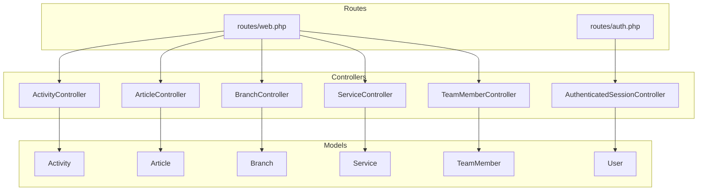
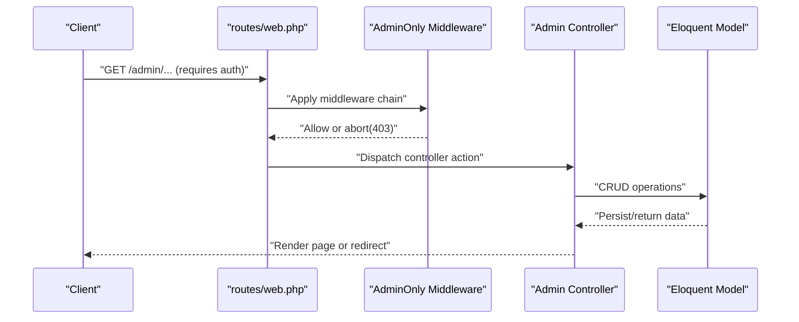
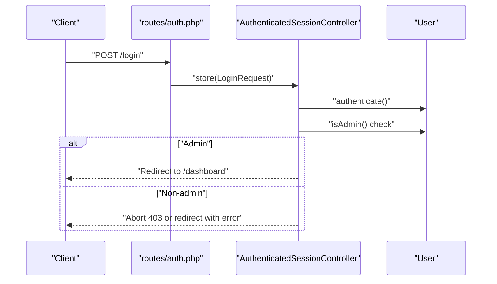
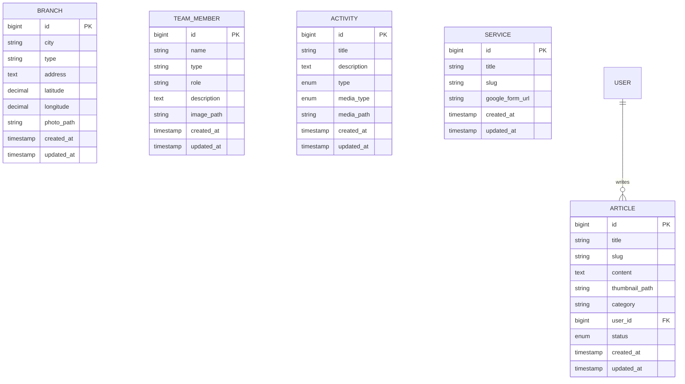
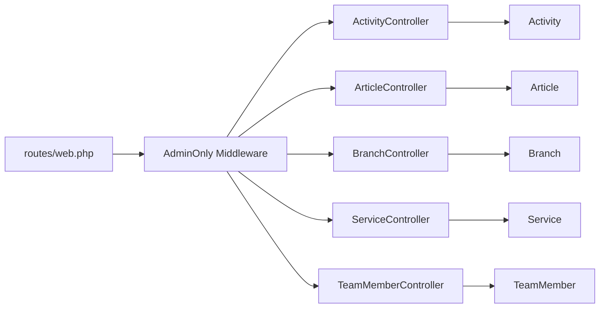

# API Reference

<cite>
**Referenced Files in This Document**
- [routes/web.php](file://routes/web.php)
- [routes/auth.php](file://routes/auth.php)
- [app/Http/Controllers/ActivityController.php](file://app/Http/Controllers/ActivityController.php)
- [app/Http/Controllers/ArticleController.php](file://app/Http/Controllers/ArticleController.php)
- [app/Http/Controllers/BranchController.php](file://app/Http/Controllers/BranchController.php)
- [app/Http/Controllers/ServiceController.php](file://app/Http/Controllers/ServiceController.php)
- [app/Http/Controllers/TeamMemberController.php](file://app/Http/Controllers/TeamMemberController.php)
- [app/Http/Controllers/Auth/AuthenticatedSessionController.php](file://app/Http/Controllers/Auth/AuthenticatedSessionController.php)
- [app/Http/Middleware/AdminOnly.php](file://app/Http/Middleware/AdminOnly.php)
- [app/Models/User.php](file://app/Models/User.php)
- [config/auth.php](file://config/auth.php)
- [database/migrations/2026_04_20_133158_create_branches_table.php](file://database/migrations/2026_04_20_133158_create_branches_table.php)
- [database/migrations/2026_04_25_153659_create_team_members_table.php](file://database/migrations/2026_04_25_153659_create_team_members_table.php)
- [database/migrations/2026_04_30_045526_create_activities_table.php](file://database/migrations/2026_04_30_045526_create_activities_table.php)
- [database/migrations/2026_04_30_050400_create_articles_table.php](file://database/migrations/2026_04_30_050400_create_articles_table.php)
- [database/migrations/2026_04_30_055559_create_services_table.php](file://database/migrations/2026_04_30_055559_create_services_table.php)
</cite>

## Table of Contents
1. [Introduction](#introduction)
2. [Project Structure](#project-structure)
3. [Core Components](#core-components)
4. [Architecture Overview](#architecture-overview)
5. [Detailed Component Analysis](#detailed-component-analysis)
6. [Dependency Analysis](#dependency-analysis)
7. [Performance Considerations](#performance-considerations)
8. [Troubleshooting Guide](#troubleshooting-guide)
9. [Conclusion](#conclusion)
10. [Appendices](#appendices)

## Introduction
This document describes EDUfa’s RESTful API surface and authentication system. It covers:
- Public endpoints for browsing content (branches, team members, articles, activities)
- Administrative endpoints for managing content and services
- Authentication and authorization mechanisms
- Request/response schemas, status codes, and error handling
- Rate limiting, security, CORS, and versioning considerations
- Client implementation guidelines for mobile apps and external integrations

Important note: The current route definitions primarily expose server-rendered pages and administrative UI routes. There are no dedicated REST API endpoints defined in the repository. This document therefore documents the existing routes and provides guidance for evolving them into a REST API while preserving the current admin UI.

## Project Structure
The API surface is defined in routes and backed by controllers and Eloquent models. Administrative routes are protected by middleware that enforces authentication and role checks.

**Diagram sources**
- [routes/web.php:68-125](file://routes/web.php#L68-L125)
- [routes/auth.php:13-43](file://routes/auth.php#L13-L43)
- [app/Http/Controllers/ActivityController.php:10](file://app/Http/Controllers/ActivityController.php#L10-L106)
- [app/Http/Controllers/ArticleController.php:11](file://app/Http/Controllers/ArticleController.php#L11-L121)
- [app/Http/Controllers/BranchController.php:12](file://app/Http/Controllers/BranchController.php#L12-L87)
- [app/Http/Controllers/ServiceController.php:9](file://app/Http/Controllers/ServiceController.php#L9-L30)
- [app/Http/Controllers/TeamMemberController.php:11](file://app/Http/Controllers/TeamMemberController.php#L11-L71)
- [app/Http/Controllers/Auth/AuthenticatedSessionController.php:13](file://app/Http/Controllers/Auth/AuthenticatedSessionController.php#L13-L57)
- [app/Models/User.php:15](file://app/Models/User.php#L15-L46)

**Section sources**
- [routes/web.php:1-137](file://routes/web.php#L1-L137)
- [routes/auth.php:1-44](file://routes/auth.php#L1-L44)

## Core Components
- Authentication and Authorization
  - Guard and provider are configured for session-based authentication.
  - Admin-only middleware restricts access to administrative routes.
  - User roles support admin/editor distinctions.

- Content Management Controllers
  - BranchController, TeamMemberController, ArticleController, ActivityController, ServiceController manage CRUD operations for respective resources.

- Data Models and Schemas
  - Eloquent models and migrations define resource structures and constraints.

**Section sources**
- [config/auth.php:40-74](file://config/auth.php#L40-L74)
- [app/Http/Middleware/AdminOnly.php:9-24](file://app/Http/Middleware/AdminOnly.php#L9-L24)
- [app/Models/User.php:32-45](file://app/Models/User.php#L32-L45)
- [app/Http/Controllers/BranchController.php:12-87](file://app/Http/Controllers/BranchController.php#L12-L87)
- [app/Http/Controllers/TeamMemberController.php:11-71](file://app/Http/Controllers/TeamMemberController.php#L11-L71)
- [app/Http/Controllers/ArticleController.php:11-121](file://app/Http/Controllers/ArticleController.php#L11-L121)
- [app/Http/Controllers/ActivityController.php:10-106](file://app/Http/Controllers/ActivityController.php#L10-L106)
- [app/Http/Controllers/ServiceController.php:9-30](file://app/Http/Controllers/ServiceController.php#L9-L30)

## Architecture Overview
The application uses server-side rendering (Inertia.js) for admin pages. Authentication is handled via session-based login with role checks. Administrative routes are grouped under a middleware stack enforcing auth and admin-only access.

**Diagram sources**
- [routes/web.php:68-125](file://routes/web.php#L68-L125)
- [app/Http/Middleware/AdminOnly.php:16-23](file://app/Http/Middleware/AdminOnly.php#L16-L23)
- [app/Http/Controllers/BranchController.php:17-44](file://app/Http/Controllers/BranchController.php#L17-L44)
- [app/Http/Controllers/TeamMemberController.php:13-36](file://app/Http/Controllers/TeamMemberController.php#L13-L36)
- [app/Http/Controllers/ArticleController.php:16-63](file://app/Http/Controllers/ArticleController.php#L16-L63)
- [app/Http/Controllers/ActivityController.php:15-51](file://app/Http/Controllers/ActivityController.php#L15-L51)
- [app/Http/Controllers/ServiceController.php:11-28](file://app/Http/Controllers/ServiceController.php#L11-L28)

## Detailed Component Analysis

### Authentication and Authorization
- Guards and Providers
  - Session-based guard “web” with Eloquent provider for model User.
- Roles and Access Control
  - Admin-only middleware checks authenticated user and role eligibility.
  - Login controller enforces admin-only access during authentication.
- Routes
  - Login/logout/password confirm protected by guest/auth middleware respectively.

**Diagram sources**
- [routes/auth.php:13-43](file://routes/auth.php#L13-L43)
- [app/Http/Controllers/Auth/AuthenticatedSessionController.php:28-43](file://app/Http/Controllers/Auth/AuthenticatedSessionController.php#L28-L43)
- [app/Http/Middleware/AdminOnly.php:16-23](file://app/Http/Middleware/AdminOnly.php#L16-L23)
- [app/Models/User.php:32-45](file://app/Models/User.php#L32-L45)

**Section sources**
- [config/auth.php:40-74](file://config/auth.php#L40-L74)
- [app/Http/Middleware/AdminOnly.php:9-24](file://app/Http/Middleware/AdminOnly.php#L9-L24)
- [app/Http/Controllers/Auth/AuthenticatedSessionController.php:13-57](file://app/Http/Controllers/Auth/AuthenticatedSessionController.php#L13-L57)
- [routes/auth.php:13-43](file://routes/auth.php#L13-L43)

### Administrative Endpoints (Current UI Routes)
Note: These are server-rendered routes. To evolve into REST APIs, add dedicated API routes returning JSON and appropriate content-type headers.

- Branches
  - GET /admin/branches → Admin/Branches/Index
  - POST /admin/branches → Create branch
  - PUT/PATCH /admin/branches/{branch} → Update branch
  - DELETE /admin/branches/{branch} → Delete branch

- Team Members
  - GET /admin/team-members → Admin/TeamMembers/Index
  - POST /admin/team-members → Create team member
  - PUT/PATCH /admin/team-members/{team_member} → Update team member
  - DELETE /admin/team-members/{team_member} → Delete team member

- Activities
  - GET /admin/activities → Admin/Activities/Index
  - POST /admin/activities → Create activity
  - PUT/PATCH /admin/activities/{activity} → Update activity
  - DELETE /admin/activities/{activity} → Delete activity

- Articles
  - GET /admin/articles → Admin/Articles/Index
  - POST /admin/articles → Create article
  - PUT/PATCH /admin/articles/{article} → Update article
  - DELETE /admin/articles/{article} → Delete article

- Services
  - GET /admin/services → Admin/Services/Index
  - PUT/PATCH /admin/services/{service} → Update Google Form URL

- Profile
  - GET /profile → Edit profile
  - PATCH /profile → Update profile
  - DELETE /profile → Delete profile

- Ping
  - GET /ping → Returns {"status":"active"}

**Section sources**
- [routes/web.php:68-125](file://routes/web.php#L68-L125)
- [routes/web.php:127-134](file://routes/web.php#L127-L134)

### Public Content Endpoints (Current UI Routes)
- Home and static pages
  - GET /, GET /terapis, GET /kegiatan, GET /artikel, GET /cabang
- Article detail
  - GET /artikel/{slug}
- Services (pelayanan)
  - GET /pelayanan/{type}
- Sitemap
  - GET /sitemap.xml

These routes render pages and do not currently expose a REST API. They can be extended to also serve JSON responses alongside HTML.

**Section sources**
- [routes/web.php:51-66](file://routes/web.php#L51-L66)
- [routes/web.php:13-47](file://routes/web.php#L13-L47)

### Data Models and Schemas
- Branch
  - Fields: city, type, address, latitude, longitude, photo_path
- Team Member
  - Fields: name, type, role, description, image_path
- Activity
  - Fields: title, description, type ∈ {terapi, kelas}, media_type ∈ {photo, video}, media_path
- Article
  - Fields: title, slug, content, thumbnail_path, category, user_id, status ∈ {published, draft}
- Service
  - Fields: title, slug, google_form_url

**Diagram sources**
- [database/migrations/2026_04_20_133158_create_branches_table.php:14-23](file://database/migrations/2026_04_20_133158_create_branches_table.php#L14-L23)
- [database/migrations/2026_04_25_153659_create_team_members_table.php:14-22](file://database/migrations/2026_04_25_153659_create_team_members_table.php#L14-L22)
- [database/migrations/2026_04_30_045526_create_activities_table.php:14-22](file://database/migrations/2026_04_30_045526_create_activities_table.php#L14-L22)
- [database/migrations/2026_04_30_050400_create_articles_table.php:14-24](file://database/migrations/2026_04_30_050400_create_articles_table.php#L14-L24)
- [database/migrations/2026_04_30_055559_create_services_table.php:14-20](file://database/migrations/2026_04_30_055559_create_services_table.php#L14-L20)
- [app/Models/User.php:15-46](file://app/Models/User.php#L15-L46)

## Dependency Analysis
Administrative routes depend on controllers and models. Controllers depend on validation and storage. Authentication depends on guard/provider configuration and middleware.

**Diagram sources**
- [routes/web.php:68-125](file://routes/web.php#L68-L125)
- [app/Http/Middleware/AdminOnly.php:16-23](file://app/Http/Middleware/AdminOnly.php#L16-L23)
- [app/Http/Controllers/ActivityController.php:10-106](file://app/Http/Controllers/ActivityController.php#L10-L106)
- [app/Http/Controllers/ArticleController.php:11-121](file://app/Http/Controllers/ArticleController.php#L11-L121)
- [app/Http/Controllers/BranchController.php:12-87](file://app/Http/Controllers/BranchController.php#L12-L87)
- [app/Http/Controllers/ServiceController.php:9-30](file://app/Http/Controllers/ServiceController.php#L9-L30)
- [app/Http/Controllers/TeamMemberController.php:11-71](file://app/Http/Controllers/TeamMemberController.php#L11-L71)

**Section sources**
- [routes/web.php:68-125](file://routes/web.php#L68-L125)
- [app/Http/Middleware/AdminOnly.php:9-24](file://app/Http/Middleware/AdminOnly.php#L9-L24)

## Performance Considerations
- Pagination: For large lists (branches, team members, articles, activities), consider adding pagination to reduce payload sizes.
- Image handling: Photo uploads are validated and stored; ensure CDN or optimized delivery for thumbnails/media.
- Query efficiency: Controllers fetch collections; consider eager loading and indexing on frequently filtered fields.
- Caching: Consider caching public article lists and branch listings with cache invalidation on updates.

## Troubleshooting Guide
- Authentication failures
  - Non-admin users attempting admin routes receive 403.
  - Login errors return to the login page with validation messages.
- Validation errors
  - Controllers validate inputs; invalid submissions redirect back with messages.
- Media cleanup
  - Controllers delete stored photos/videos on update/delete; ensure storage disk permissions are correct.

**Section sources**
- [app/Http/Middleware/AdminOnly.php:16-23](file://app/Http/Middleware/AdminOnly.php#L16-L23)
- [app/Http/Controllers/Auth/AuthenticatedSessionController.php:35-41](file://app/Http/Controllers/Auth/AuthenticatedSessionController.php#L35-L41)
- [app/Http/Controllers/BranchController.php:79-85](file://app/Http/Controllers/BranchController.php#L79-L85)
- [app/Http/Controllers/TeamMemberController.php:63-69](file://app/Http/Controllers/TeamMemberController.php#L63-L69)
- [app/Http/Controllers/ArticleController.php:115-119](file://app/Http/Controllers/ArticleController.php#L115-L119)
- [app/Http/Controllers/ActivityController.php:100-104](file://app/Http/Controllers/ActivityController.php#L100-L104)

## Conclusion
The repository exposes administrative UI routes and authentication flows. To establish a REST API:
- Add dedicated API routes returning JSON with proper content-type headers.
- Apply rate limiting and CORS policies.
- Enforce authentication and authorization consistently.
- Version APIs and maintain backward compatibility.

## Appendices

### A. Proposed REST API Evolution (Guidance)
- Base path: api/v1 (versioned)
- Content-Type: application/json
- Authentication: Session-based for now; consider adding token-based auth (Sanctum) for external clients.
- CORS: Configure per environment; allow origin and credentials as needed.
- Rate limiting: Apply per endpoint or globally using middleware.
- Status codes: Use conventional codes (200, 201, 204, 400, 401, 403, 404, 422, 500).

### B. Current Admin Routes Summary
- Branches: index, store, show, update, destroy
- Team Members: index, store, show, update, destroy
- Activities: index, store, show, update, destroy
- Articles: index, store, show, update, destroy
- Services: index, update
- Profile: edit, update, destroy
- Ping: health check

**Section sources**
- [routes/web.php:86-124](file://routes/web.php#L86-L124)
- [routes/web.php:127-134](file://routes/web.php#L127-L134)