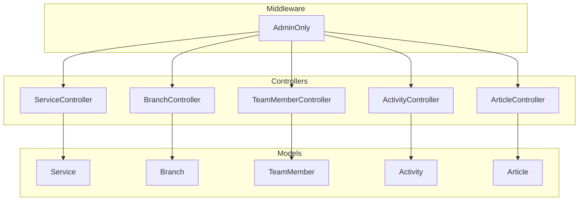
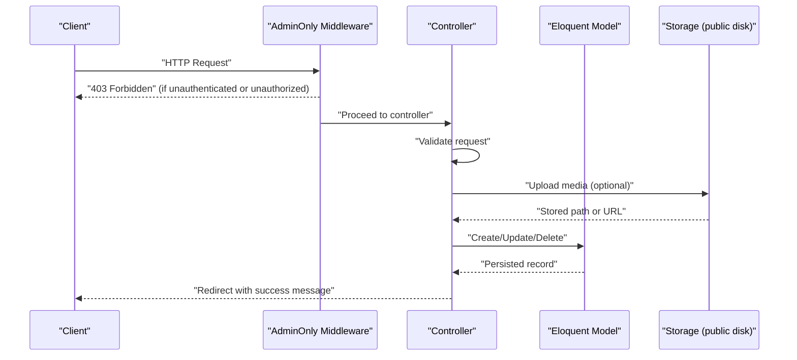
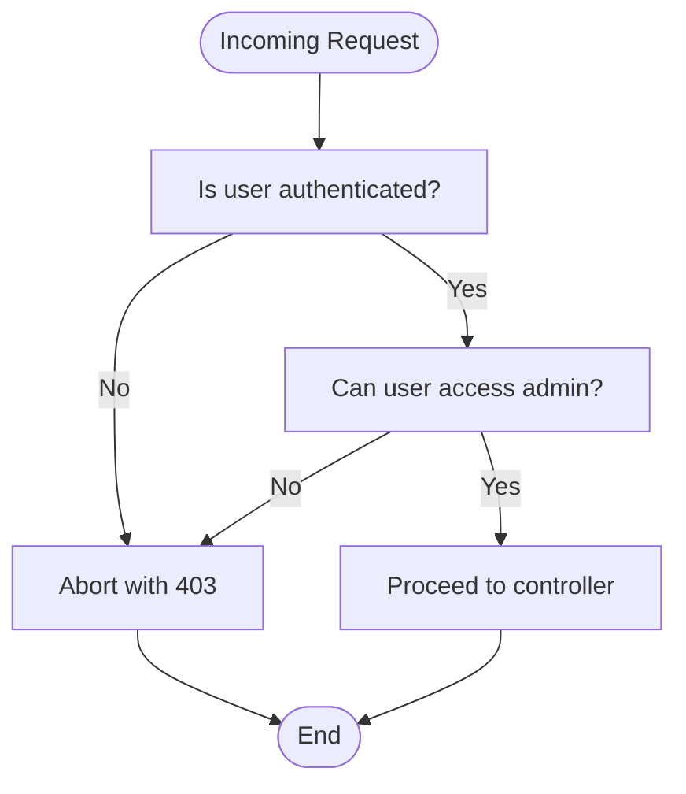
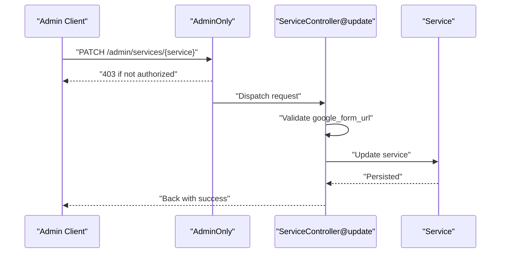
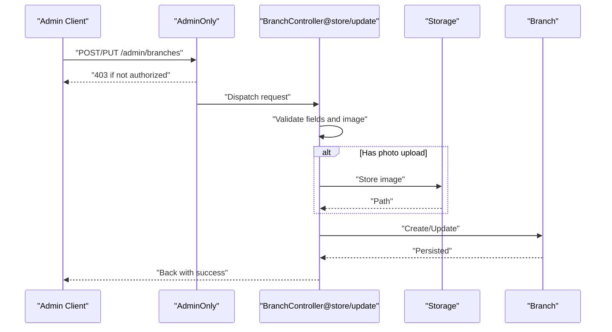
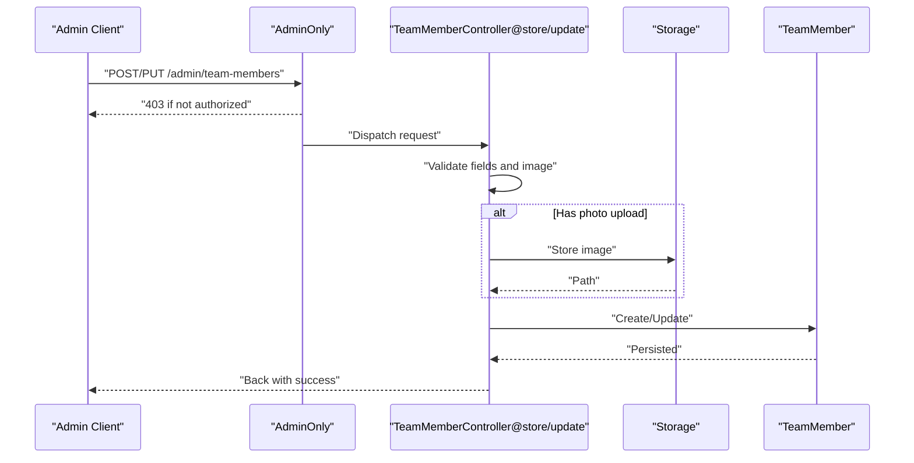
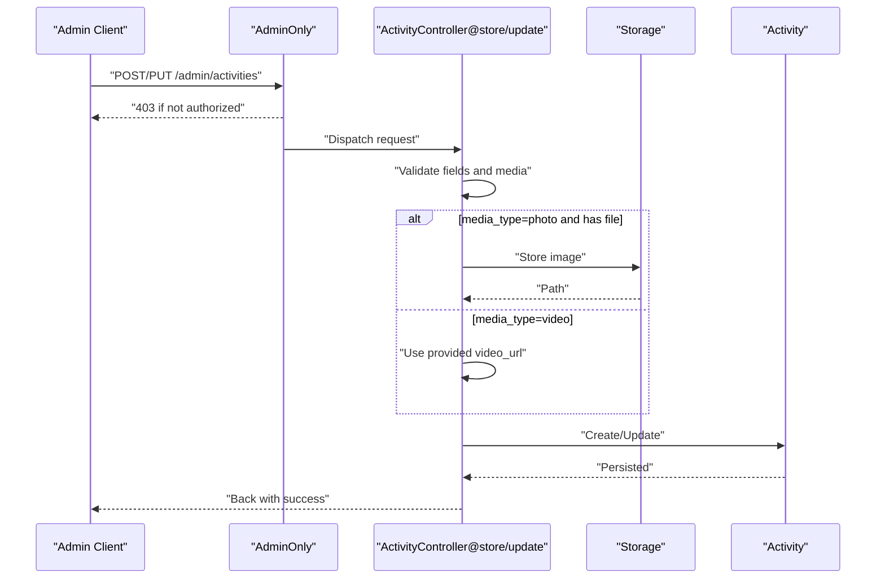
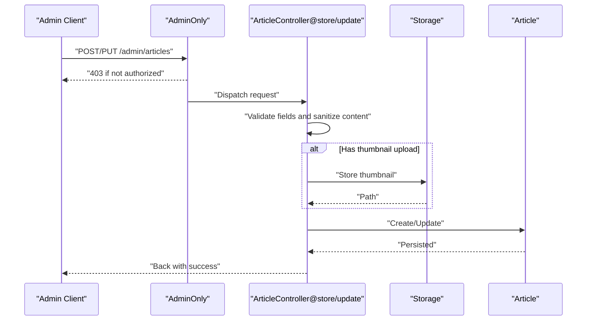
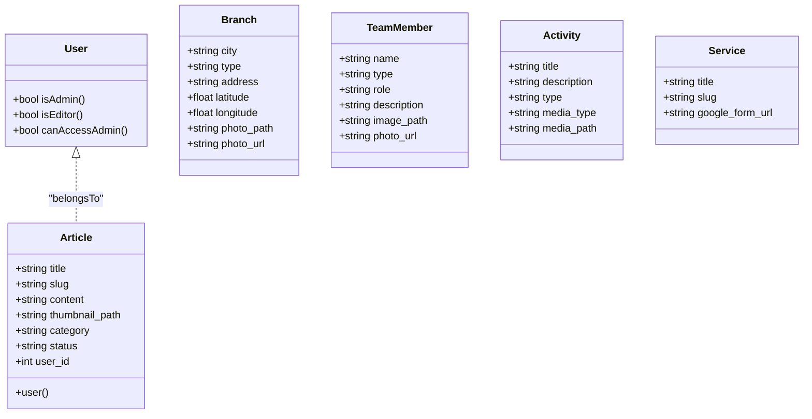

# Administrative API Endpoints

<cite>
**Referenced Files in This Document**
- [ServiceController.php](file://app/Http/Controllers/ServiceController.php)
- [BranchController.php](file://app/Http/Controllers/BranchController.php)
- [TeamMemberController.php](file://app/Http/Controllers/TeamMemberController.php)
- [ActivityController.php](file://app/Http/Controllers/ActivityController.php)
- [ArticleController.php](file://app/Http/Controllers/ArticleController.php)
- [AdminOnly.php](file://app/Http/Middleware/AdminOnly.php)
- [Service.php](file://app/Models/Service.php)
- [Branch.php](file://app/Models/Branch.php)
- [TeamMember.php](file://app/Models/TeamMember.php)
- [Activity.php](file://app/Models/Activity.php)
- [Article.php](file://app/Models/Article.php)
- [User.php](file://app/Models/User.php)
- [2026_04_20_133158_create_branches_table.php](file://database/migrations/2026_04_20_133158_create_branches_table.php)
- [2026_04_25_153659_create_team_members_table.php](file://database/migrations/2026_04_25_153659_create_team_members_table.php)
- [2026_04_30_045526_create_activities_table.php](file://database/migrations/2026_04_30_045526_create_activities_table.php)
- [2026_04_30_050400_create_articles_table.php](file://database/migrations/2026_04_30_050400_create_articles_table.php)
- [2026_04_30_055559_create_services_table.php](file://database/migrations/2026_04_30_055559_create_services_table.php)
</cite>

## Table of Contents
1. [Introduction](#introduction)
2. [Project Structure](#project-structure)
3. [Core Components](#core-components)
4. [Architecture Overview](#architecture-overview)
5. [Detailed Component Analysis](#detailed-component-analysis)
6. [Dependency Analysis](#dependency-analysis)
7. [Performance Considerations](#performance-considerations)
8. [Troubleshooting Guide](#troubleshooting-guide)
9. [Conclusion](#conclusion)
10. [Appendices](#appendices)

## Introduction
This document describes the administrative endpoints used by EDUfa’s admin dashboard and content management system. It covers HTTP methods, URL patterns, request/response schemas, validation rules, authentication and authorization via admin middleware, and error handling strategies. It also documents media upload handling, bulk operations, and administrative security considerations.

## Project Structure
The administrative endpoints are implemented as Laravel controllers per domain entity (services, branches, team members, activities, articles). Each controller exposes CRUD operations backed by Eloquent models and validated by request rules. Authentication and authorization are enforced via a dedicated middleware that checks user roles.

**Diagram sources**
- [ServiceController.php:1-31](file://app/Http/Controllers/ServiceController.php#L1-L31)
- [BranchController.php:1-88](file://app/Http/Controllers/BranchController.php#L1-L88)
- [TeamMemberController.php:1-72](file://app/Http/Controllers/TeamMemberController.php#L1-L72)
- [ActivityController.php:1-107](file://app/Http/Controllers/ActivityController.php#L1-L107)
- [ArticleController.php:1-122](file://app/Http/Controllers/ArticleController.php#L1-L122)
- [AdminOnly.php:1-25](file://app/Http/Middleware/AdminOnly.php#L1-L25)
- [Service.php:1-15](file://app/Models/Service.php#L1-L15)
- [Branch.php:1-36](file://app/Models/Branch.php#L1-L36)
- [TeamMember.php:1-24](file://app/Models/TeamMember.php#L1-L24)
- [Activity.php:1-11](file://app/Models/Activity.php#L1-L11)
- [Article.php:1-28](file://app/Models/Article.php#L1-L28)

**Section sources**
- [ServiceController.php:1-31](file://app/Http/Controllers/ServiceController.php#L1-L31)
- [BranchController.php:1-88](file://app/Http/Controllers/BranchController.php#L1-L88)
- [TeamMemberController.php:1-72](file://app/Http/Controllers/TeamMemberController.php#L1-L72)
- [ActivityController.php:1-107](file://app/Http/Controllers/ActivityController.php#L1-L107)
- [ArticleController.php:1-122](file://app/Http/Controllers/ArticleController.php#L1-L122)
- [AdminOnly.php:1-25](file://app/Http/Middleware/AdminOnly.php#L1-L25)

## Core Components
- Admin middleware enforces role-based access control for administrative routes.
- Controllers implement CRUD actions with strict validation and media handling.
- Models define fillable attributes and computed URL accessors for media assets.
- Migrations define normalized relational schemas for each entity.

Key capabilities:
- Authentication: Requires a logged-in user.
- Authorization: Only users whose role allows admin access may enter admin routes.
- Validation: Each endpoint validates input according to business rules.
- Media handling: Uploads stored to public disk with controlled file types and sizes.
- Responses: Controllers return redirects with flash messages; clients should poll or refresh to observe changes.

**Section sources**
- [AdminOnly.php:16-23](file://app/Http/Middleware/AdminOnly.php#L16-L23)
- [User.php:32-45](file://app/Models/User.php#L32-L45)
- [ServiceController.php:20-28](file://app/Http/Controllers/ServiceController.php#L20-L28)
- [BranchController.php:29-44](file://app/Http/Controllers/BranchController.php#L29-L44)
- [TeamMemberController.php:22-36](file://app/Http/Controllers/TeamMemberController.php#L22-L36)
- [ActivityController.php:27-51](file://app/Http/Controllers/ActivityController.php#L27-L51)
- [ArticleController.php:28-63](file://app/Http/Controllers/ArticleController.php#L28-L63)

## Architecture Overview
The admin endpoints follow a layered pattern:
- HTTP requests reach controllers.
- Controllers validate inputs and manage uploads.
- Controllers persist changes via Eloquent models.
- Middleware ensures only authorized users can access admin routes.

**Diagram sources**
- [AdminOnly.php:16-23](file://app/Http/Middleware/AdminOnly.php#L16-L23)
- [BranchController.php:38-44](file://app/Http/Controllers/BranchController.php#L38-L44)
- [TeamMemberController.php:30-36](file://app/Http/Controllers/TeamMemberController.php#L30-L36)
- [ActivityController.php:37-41](file://app/Http/Controllers/ActivityController.php#L37-L41)
- [ArticleController.php:45-47](file://app/Http/Controllers/ArticleController.php#L45-L47)
- [ServiceController.php:24-28](file://app/Http/Controllers/ServiceController.php#L24-L28)

## Detailed Component Analysis

### Authentication and Authorization
- Authentication: Requires a valid session/user context.
- Authorization: Only users whose role permits admin access can proceed.
- Behavior: Non-compliant requests receive a 403 response.

**Diagram sources**
- [AdminOnly.php:18-20](file://app/Http/Middleware/AdminOnly.php#L18-L20)
- [User.php:42-45](file://app/Models/User.php#L42-L45)

**Section sources**
- [AdminOnly.php:16-23](file://app/Http/Middleware/AdminOnly.php#L16-L23)
- [User.php:32-45](file://app/Models/User.php#L32-L45)

### Services
- Purpose: Manage service entries and associated Google Form links.
- Endpoint: Single update operation for a service instance.
- Validation: Validates optional Google Form URL.

**Diagram sources**
- [ServiceController.php:18-29](file://app/Http/Controllers/ServiceController.php#L18-L29)
- [Service.php:9-13](file://app/Models/Service.php#L9-L13)

**Section sources**
- [ServiceController.php:18-29](file://app/Http/Controllers/ServiceController.php#L18-L29)
- [Service.php:9-13](file://app/Models/Service.php#L9-L13)

#### Service Request/Response Schemas
- Request body (application/json):
  - google_form_url: string | null, must be a URL if present
- Response: Redirect with success message; no JSON body returned.

Validation summary:
- google_form_url: nullable, url

**Section sources**
- [ServiceController.php:20-22](file://app/Http/Controllers/ServiceController.php#L20-L22)

### Branches
- Purpose: CRUD for branch locations with geolocation and photo.
- Endpoints:
  - GET /admin/branches (index)
  - POST /admin/branches (store)
  - PUT/PATCH /admin/branches/{branch} (update)
  - DELETE /admin/branches/{branch} (destroy)
- Validation and media handling:
  - Photo upload supported; replaces existing stored image.
  - Latitude/longitude numeric; city/type/address required.

**Diagram sources**
- [BranchController.php:27-44](file://app/Http/Controllers/BranchController.php#L27-L44)
- [BranchController.php:50-71](file://app/Http/Controllers/BranchController.php#L50-L71)
- [Branch.php:21-34](file://app/Models/Branch.php#L21-L34)

**Section sources**
- [BranchController.php:17-22](file://app/Http/Controllers/BranchController.php#L17-L22)
- [BranchController.php:27-44](file://app/Http/Controllers/BranchController.php#L27-L44)
- [BranchController.php:50-71](file://app/Http/Controllers/BranchController.php#L50-L71)
- [BranchController.php:77-86](file://app/Http/Controllers/BranchController.php#L77-L86)
- [Branch.php:21-34](file://app/Models/Branch.php#L21-L34)

#### Branch Request/Response Schemas
- Request body (multipart/form-data):
  - city: string, max 255, required
  - type: string, max 255, nullable
  - address: text, required
  - latitude: number, nullable
  - longitude: number, nullable
  - photo: image/jpeg|png|jpg|webp, max 2048 KB, nullable
- Response: Redirect with success message.

Validation summary:
- city: required, string, max length 255
- type: nullable, string, max length 255
- address: required, string
- latitude: nullable, numeric
- longitude: nullable, numeric
- photo: nullable, image, allowed types jpeg,png,jpg,webp, max 2048 KB

Computed URL:
- photo_url: string | null, derived from photo_path

**Section sources**
- [BranchController.php:29-36](file://app/Http/Controllers/BranchController.php#L29-L36)
- [Branch.php:21-34](file://app/Models/Branch.php#L21-L34)

### Team Members
- Purpose: CRUD for team member profiles with role and photo.
- Endpoints:
  - GET /admin/team-members (index)
  - POST /admin/team-members (store)
  - PUT/PATCH /admin/team-members/{team_member} (update)
  - DELETE /admin/team-members/{team_member} (destroy)
- Validation and media handling:
  - Photo upload supported; replaces existing stored image.
  - Type constrained to predefined values.

**Diagram sources**
- [TeamMemberController.php:20-36](file://app/Http/Controllers/TeamMemberController.php#L20-L36)
- [TeamMemberController.php:39-58](file://app/Http/Controllers/TeamMemberController.php#L39-L58)
- [TeamMember.php:17-22](file://app/Models/TeamMember.php#L17-L22)

**Section sources**
- [TeamMemberController.php:13-18](file://app/Http/Controllers/TeamMemberController.php#L13-L18)
- [TeamMemberController.php:20-36](file://app/Http/Controllers/TeamMemberController.php#L20-L36)
- [TeamMemberController.php:39-58](file://app/Http/Controllers/TeamMemberController.php#L39-L58)
- [TeamMemberController.php:61-70](file://app/Http/Controllers/TeamMemberController.php#L61-L70)
- [TeamMember.php:17-22](file://app/Models/TeamMember.php#L17-L22)

#### Team Member Request/Response Schemas
- Request body (multipart/form-data):
  - name: string, max 255, required
  - type: enum("terapis","staf"), required
  - role: string, max 255, required
  - description: text, nullable
  - photo: image/jpeg|png|jpg|webp, max 2048 KB, nullable
- Response: Redirect with success message.

Validation summary:
- name: required, string, max length 255
- type: required, enum("terapis","staf")
- role: required, string, max length 255
- description: nullable, string
- photo: nullable, image, allowed types jpeg,png,jpg,webp, max 2048 KB

Computed URL:
- photo_url: string | null, derived from image_path

**Section sources**
- [TeamMemberController.php:22-28](file://app/Http/Controllers/TeamMemberController.php#L22-L28)
- [TeamMember.php:17-22](file://app/Models/TeamMember.php#L17-L22)

### Activities
- Purpose: CRUD for activity posts with photo/video media.
- Endpoints:
  - GET /admin/activities (index)
  - POST /admin/activities (store)
  - PUT/PATCH /admin/activities/{activity} (update)
  - DELETE /admin/activities/{activity} (destroy)
- Validation and media handling:
  - media_type determines whether media_file or video_url is required.
  - Photo uploads stored; replacing previous photo deletes old file.
  - Video URLs supported; replacing with photo deletes old video association.

**Diagram sources**
- [ActivityController.php:25-51](file://app/Http/Controllers/ActivityController.php#L25-L51)
- [ActivityController.php:57-92](file://app/Http/Controllers/ActivityController.php#L57-L92)
- [Activity.php](file://app/Models/Activity.php#L9)

**Section sources**
- [ActivityController.php:15-20](file://app/Http/Controllers/ActivityController.php#L15-L20)
- [ActivityController.php:25-51](file://app/Http/Controllers/ActivityController.php#L25-L51)
- [ActivityController.php:57-92](file://app/Http/Controllers/ActivityController.php#L57-L92)
- [ActivityController.php:98-105](file://app/Http/Controllers/ActivityController.php#L98-L105)
- [Activity.php](file://app/Models/Activity.php#L9)

#### Activity Request/Response Schemas
- Request body (multipart/form-data):
  - title: string, max 255, required
  - description: text, nullable
  - type: enum("terapi","kelas"), required
  - media_type: enum("photo","video"), required
  - media_file: image/jpeg|png|jpg|webp, max 5120 KB, required if media_type=photo
  - video_url: url, required if media_type=video
- Response: Redirect with success message.

Validation summary:
- title: required, string, max length 255
- description: nullable, string
- type: required, enum("terapi","kelas")
- media_type: required, enum("photo","video")
- media_file: nullable, image, allowed types jpeg,png,jpg,webp, max 5120 KB
- video_url: nullable, url

Computed URL:
- media_path: stores either a URL (video) or a storage path (photo)

**Section sources**
- [ActivityController.php:27-34](file://app/Http/Controllers/ActivityController.php#L27-L34)
- [ActivityController.php:59-66](file://app/Http/Controllers/ActivityController.php#L59-L66)

### Articles
- Purpose: CRUD for articles with author metadata and status.
- Endpoints:
  - GET /admin/articles (index)
  - POST /admin/articles (store)
  - PUT/PATCH /admin/articles/{article} (update)
  - DELETE /admin/articles/{article} (destroy)
- Validation and media handling:
  - Content sanitized to allow safe HTML tags.
  - Thumbnail upload supported; replaces existing thumbnail.
  - Status constrained to published/draft.

**Diagram sources**
- [ArticleController.php:26-63](file://app/Http/Controllers/ArticleController.php#L26-L63)
- [ArticleController.php:69-107](file://app/Http/Controllers/ArticleController.php#L69-L107)
- [Article.php:23-26](file://app/Models/Article.php#L23-L26)

**Section sources**
- [ArticleController.php:16-21](file://app/Http/Controllers/ArticleController.php#L16-L21)
- [ArticleController.php:26-63](file://app/Http/Controllers/ArticleController.php#L26-L63)
- [ArticleController.php:69-107](file://app/Http/Controllers/ArticleController.php#L69-L107)
- [ArticleController.php:113-120](file://app/Http/Controllers/ArticleController.php#L113-L120)
- [Article.php:23-26](file://app/Models/Article.php#L23-L26)

#### Article Request/Response Schemas
- Request body (multipart/form-data):
  - title: string, max 255, required
  - content: text, required (sanitized)
  - category: string, max 100, nullable
  - status: enum("published","draft"), required
  - thumbnail: image/jpeg|png|jpg|webp, max 5120 KB, nullable
  - author_name: string, max 255, nullable
  - author_role: string, max 255, nullable
  - author_bio: text, nullable
  - show_expert_voice: boolean, nullable
- Response: Redirect with success message.

Validation summary:
- title: required, string, max length 255
- content: required, string (sanitized)
- category: nullable, string, max length 100
- status: required, enum("published","draft")
- thumbnail: nullable, image, allowed types jpeg,png,jpg,webp, max 5120 KB
- author_name: nullable, string, max length 255
- author_role: nullable, string, max length 255
- author_bio: nullable, string
- show_expert_voice: nullable, boolean-like

Computed relations:
- user: belongs to current authenticated user (on creation)

**Section sources**
- [ArticleController.php:28-38](file://app/Http/Controllers/ArticleController.php#L28-L38)
- [ArticleController.php:71-81](file://app/Http/Controllers/ArticleController.php#L71-L81)
- [Article.php:9-21](file://app/Models/Article.php#L9-L21)

### Bulk Operations and Batch Updates
- Current implementation does not expose explicit bulk endpoints.
- Recommended approach for batch operations:
  - Client-side batching with retry/backoff.
  - Use individual endpoints in loops with optimistic concurrency checks.
  - For media-heavy operations, stagger uploads to avoid disk pressure.

[No sources needed since this section provides general guidance]

### Administrative Workflows
- Typical admin tasks:
  - Create/update branches with photos.
  - Add/edit team members with profile images.
  - Publish activities with either photo or video.
  - Author articles with thumbnails and statuses.
- Client behavior:
  - Submit forms with multipart/form-data.
  - Expect redirects with success messages; refresh lists after mutations.

[No sources needed since this section provides general guidance]

## Dependency Analysis

**Diagram sources**
- [User.php:32-45](file://app/Models/User.php#L32-L45)
- [Branch.php:12-34](file://app/Models/Branch.php#L12-L34)
- [TeamMember.php:9-22](file://app/Models/TeamMember.php#L9-L22)
- [Activity.php](file://app/Models/Activity.php#L9)
- [Article.php:9-26](file://app/Models/Article.php#L9-L26)
- [Service.php:9-13](file://app/Models/Service.php#L9-L13)

**Section sources**
- [User.php:32-45](file://app/Models/User.php#L32-L45)
- [Article.php:23-26](file://app/Models/Article.php#L23-L26)

## Performance Considerations
- Media uploads:
  - Limit file sizes as configured to reduce I/O overhead.
  - Prefer CDN-backed URLs for media when feasible.
- Pagination:
  - Index endpoints currently fetch all records; consider adding pagination for large datasets.
- Validation:
  - Keep validation rules minimal and efficient; avoid expensive checks.
- Concurrency:
  - Use database transactions for multi-field updates to maintain consistency.

[No sources needed since this section provides general guidance]

## Troubleshooting Guide
Common issues and resolutions:
- 403 Forbidden:
  - Cause: Unauthenticated or insufficient role.
  - Resolution: Ensure user is logged in and has admin/editor role.
- Validation errors:
  - Cause: Missing or invalid fields (e.g., wrong media type, out-of-range numeric values).
  - Resolution: Match validation rules precisely; confirm media constraints.
- Media deletion failures:
  - Cause: Stored path missing or incorrect; URL vs path confusion.
  - Resolution: Use provided computed URL accessors; ensure cleanup logic runs.
- Redirect-only responses:
  - Behavior: Controllers return redirects with success messages; no JSON bodies.
  - Resolution: Clients should refresh UI state or navigate accordingly.

**Section sources**
- [AdminOnly.php:18-20](file://app/Http/Middleware/AdminOnly.php#L18-L20)
- [BranchController.php:63-65](file://app/Http/Controllers/BranchController.php#L63-L65)
- [TeamMemberController.php:50-52](file://app/Http/Controllers/TeamMemberController.php#L50-L52)
- [ActivityController.php:72-76](file://app/Http/Controllers/ActivityController.php#L72-L76)
- [ArticleController.php:89-91](file://app/Http/Controllers/ArticleController.php#L89-L91)

## Conclusion
The administrative endpoints provide a focused set of CRUD operations for managing EDUfa’s content and infrastructure. They enforce authentication and authorization, apply strict validation, and handle media uploads safely. Clients should submit multipart/form-data, expect redirects with success messages, and implement client-side retries and pagination for robustness.

[No sources needed since this section summarizes without analyzing specific files]

## Appendices

### Data Models and Migrations
- Branches table schema:
  - Fields: id, city, type, address, latitude, longitude, photo_path, timestamps
  - Constraints: city, address required; latitude/longitude decimal precision; photo_path nullable
- Team Members table schema:
  - Fields: id, name, type, role, description, image_path, timestamps
  - Constraints: type enum; name, role required
- Activities table schema:
  - Fields: id, title, description, type, media_type, media_path, timestamps
  - Constraints: type enum("terapi","kelas"); media_type enum("photo","video")
- Articles table schema:
  - Fields: id, title, slug, content, thumbnail_path, category, user_id, status, timestamps
  - Constraints: slug unique; status enum("published","draft"); user_id foreign key
- Services table schema:
  - Fields: id, title, slug, google_form_url, timestamps
  - Constraints: slug unique; google_form_url nullable

**Section sources**
- [2026_04_20_133158_create_branches_table.php:14-22](file://database/migrations/2026_04_20_133158_create_branches_table.php#L14-L22)
- [2026_04_25_153659_create_team_members_table.php:14-21](file://database/migrations/2026_04_25_153659_create_team_members_table.php#L14-L21)
- [2026_04_30_045526_create_activities_table.php:14-21](file://database/migrations/2026_04_30_045526_create_activities_table.php#L14-L21)
- [2026_04_30_050400_create_articles_table.php:14-23](file://database/migrations/2026_04_30_050400_create_articles_table.php#L14-L23)
- [2026_04_30_055559_create_services_table.php:14-19](file://database/migrations/2026_04_30_055559_create_services_table.php#L14-L19)