# Authentication Endpoints

<cite>
**Referenced Files in This Document**
- [routes/auth.php](file://routes/auth.php)
- [app/Http/Controllers/Auth/AuthenticatedSessionController.php](file://app/Http/Controllers/Auth/AuthenticatedSessionController.php)
- [app/Http/Requests/Auth/LoginRequest.php](file://app/Http/Requests/Auth/LoginRequest.php)
- [app/Http/Controllers/Auth/PasswordResetLinkController.php](file://app/Http/Controllers/Auth/PasswordResetLinkController.php)
- [app/Http/Controllers/Auth/NewPasswordController.php](file://app/Http/Controllers/Auth/NewPasswordController.php)
- [app/Http/Controllers/Auth/VerifyEmailController.php](file://app/Http/Controllers/Auth/VerifyEmailController.php)
- [app/Http/Controllers/Auth/EmailVerificationNotificationController.php](file://app/Http/Controllers/Auth/EmailVerificationNotificationController.php)
- [app/Http/Controllers/Auth/EmailVerificationPromptController.php](file://app/Http/Controllers/Auth/EmailVerificationPromptController.php)
- [app/Http/Controllers/Auth/ConfirmablePasswordController.php](file://app/Http/Controllers/Auth/ConfirmablePasswordController.php)
- [app/Http/Controllers/Auth/PasswordController.php](file://app/Http/Controllers/Auth/PasswordController.php)
- [app/Models/User.php](file://app/Models/User.php)
- [app/Http/Middleware/AdminOnly.php](file://app/Http/Middleware/AdminOnly.php)
- [app/Http/Middleware/HandleInertiaRequests.php](file://app/Http/Middleware/HandleInertiaRequests.php)
- [config/auth.php](file://config/auth.php)
- [resources/js/Pages/Auth/Login.jsx](file://resources/js/Pages/Auth/Login.jsx)
</cite>

## Table of Contents
1. [Introduction](#introduction)
2. [Project Structure](#project-structure)
3. [Core Components](#core-components)
4. [Architecture Overview](#architecture-overview)
5. [Detailed Component Analysis](#detailed-component-analysis)
6. [Dependency Analysis](#dependency-analysis)
7. [Performance Considerations](#performance-considerations)
8. [Troubleshooting Guide](#troubleshooting-guide)
9. [Conclusion](#conclusion)
10. [Appendices](#appendices)

## Introduction
This document describes the authentication endpoints for EDUfa’s admin portal built with Laravel and Inertia. It focuses on login, logout, password reset, email verification, and related flows. It also covers rate limiting, CSRF protection via Laravel Sanctum, session-based authentication defaults, and guidance for clients integrating with these endpoints.

Important note: The current route definitions indicate that the primary admin login endpoint is protected behind a guest middleware and is intended for server-rendered pages. There is no dedicated API endpoint for admin login exposed in the provided routes. Clients requiring token-based authentication should integrate with Sanctum’s token issuance endpoints and CSRF cookie exposure.

## Project Structure
The authentication-related backend logic is organized under:
- Routes grouped by guest/auth middleware
- Controllers implementing CRUD-like actions for sessions, passwords, and email verification
- Request validators encapsulating authentication attempts and rate limiting
- Models and middleware supporting roles and shared auth state

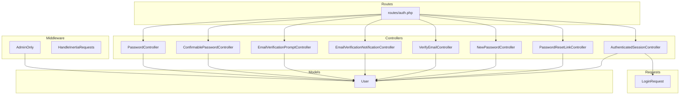

**Diagram sources**
- [routes/auth.php:1-44](file://routes/auth.php#L1-L44)
- [app/Http/Controllers/Auth/AuthenticatedSessionController.php:13-58](file://app/Http/Controllers/Auth/AuthenticatedSessionController.php#L13-L58)
- [app/Http/Controllers/Auth/PasswordResetLinkController.php:13-52](file://app/Http/Controllers/Auth/PasswordResetLinkController.php#L13-L52)
- [app/Http/Controllers/Auth/NewPasswordController.php:17-70](file://app/Http/Controllers/Auth/NewPasswordController.php#L17-L70)
- [app/Http/Controllers/Auth/VerifyEmailController.php:10-28](file://app/Http/Controllers/Auth/VerifyEmailController.php#L10-L28)
- [app/Http/Controllers/Auth/EmailVerificationNotificationController.php:9-25](file://app/Http/Controllers/Auth/EmailVerificationNotificationController.php#L9-L25)
- [app/Http/Controllers/Auth/EmailVerificationPromptController.php:11-23](file://app/Http/Controllers/Auth/EmailVerificationPromptController.php#L11-L23)
- [app/Http/Controllers/Auth/ConfirmablePasswordController.php:13-42](file://app/Http/Controllers/Auth/ConfirmablePasswordController.php#L13-L42)
- [app/Http/Controllers/Auth/PasswordController.php:11-30](file://app/Http/Controllers/Auth/PasswordController.php#L11-L30)
- [app/Http/Requests/Auth/LoginRequest.php:13-87](file://app/Http/Requests/Auth/LoginRequest.php#L13-L87)
- [app/Models/User.php:15-47](file://app/Models/User.php#L15-L47)
- [app/Http/Middleware/AdminOnly.php:9-25](file://app/Http/Middleware/AdminOnly.php#L9-L25)
- [app/Http/Middleware/HandleInertiaRequests.php:8-40](file://app/Http/Middleware/HandleInertiaRequests.php#L8-L40)

**Section sources**
- [routes/auth.php:1-44](file://routes/auth.php#L1-L44)
- [app/Http/Controllers/Auth/AuthenticatedSessionController.php:13-58](file://app/Http/Controllers/Auth/AuthenticatedSessionController.php#L13-L58)
- [app/Http/Requests/Auth/LoginRequest.php:13-87](file://app/Http/Requests/Auth/LoginRequest.php#L13-L87)
- [app/Http/Controllers/Auth/PasswordResetLinkController.php:13-52](file://app/Http/Controllers/Auth/PasswordResetLinkController.php#L13-L52)
- [app/Http/Controllers/Auth/NewPasswordController.php:17-70](file://app/Http/Controllers/Auth/NewPasswordController.php#L17-L70)
- [app/Http/Controllers/Auth/VerifyEmailController.php:10-28](file://app/Http/Controllers/Auth/VerifyEmailController.php#L10-L28)
- [app/Http/Controllers/Auth/EmailVerificationNotificationController.php:9-25](file://app/Http/Controllers/Auth/EmailVerificationNotificationController.php#L9-L25)
- [app/Http/Controllers/Auth/EmailVerificationPromptController.php:11-23](file://app/Http/Controllers/Auth/EmailVerificationPromptController.php#L11-L23)
- [app/Http/Controllers/Auth/ConfirmablePasswordController.php:13-42](file://app/Http/Controllers/Auth/ConfirmablePasswordController.php#L13-L42)
- [app/Http/Controllers/Auth/PasswordController.php:11-30](file://app/Http/Controllers/Auth/PasswordController.php#L11-L30)
- [app/Models/User.php:15-47](file://app/Models/User.php#L15-L47)
- [app/Http/Middleware/AdminOnly.php:9-25](file://app/Http/Middleware/AdminOnly.php#L9-L25)
- [app/Http/Middleware/HandleInertiaRequests.php:8-40](file://app/Http/Middleware/HandleInertiaRequests.php#L8-L40)

## Core Components
- Session-based admin login and logout
- Password reset request and set new password
- Email verification prompt, resend, and verify
- Password confirmation for sensitive actions
- Role-based access control for admin/editor

Key implementation highlights:
- Login uses a form request that enforces rate limiting and credential checks.
- Logout invalidates the session and regenerates the CSRF token.
- Password reset uses the framework’s password broker and token table.
- Email verification integrates with the framework’s email verification facilities.
- Role checks restrict access to admin-only routes.

**Section sources**
- [app/Http/Controllers/Auth/AuthenticatedSessionController.php:13-58](file://app/Http/Controllers/Auth/AuthenticatedSessionController.php#L13-L58)
- [app/Http/Requests/Auth/LoginRequest.php:13-87](file://app/Http/Requests/Auth/LoginRequest.php#L13-L87)
- [app/Http/Controllers/Auth/PasswordResetLinkController.php:13-52](file://app/Http/Controllers/Auth/PasswordResetLinkController.php#L13-L52)
- [app/Http/Controllers/Auth/NewPasswordController.php:17-70](file://app/Http/Controllers/Auth/NewPasswordController.php#L17-L70)
- [app/Http/Controllers/Auth/VerifyEmailController.php:10-28](file://app/Http/Controllers/Auth/VerifyEmailController.php#L10-L28)
- [app/Http/Controllers/Auth/EmailVerificationNotificationController.php:9-25](file://app/Http/Controllers/Auth/EmailVerificationNotificationController.php#L9-L25)
- [app/Http/Controllers/Auth/EmailVerificationPromptController.php:11-23](file://app/Http/Controllers/Auth/EmailVerificationPromptController.php#L11-L23)
- [app/Http/Controllers/Auth/ConfirmablePasswordController.php:13-42](file://app/Http/Controllers/Auth/ConfirmablePasswordController.php#L13-L42)
- [app/Http/Controllers/Auth/PasswordController.php:11-30](file://app/Http/Controllers/Auth/PasswordController.php#L11-L30)
- [app/Models/User.php:32-46](file://app/Models/User.php#L32-L46)

## Architecture Overview
The authentication flow leverages:
- Laravel’s session guard for web-based admin access
- Laravel Sanctum for SPA/API token support (CSRF cookie endpoint present)
- Inertia for server-rendered admin pages
- Rate limiter for brute-force protection

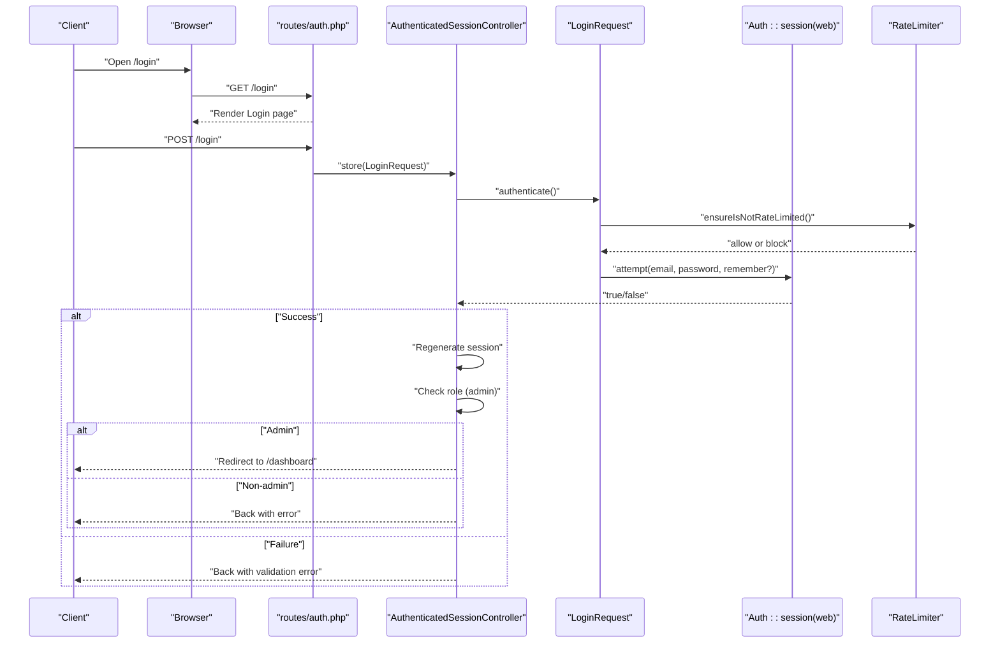

**Diagram sources**
- [routes/auth.php:13-31](file://routes/auth.php#L13-L31)
- [app/Http/Controllers/Auth/AuthenticatedSessionController.php:28-43](file://app/Http/Controllers/Auth/AuthenticatedSessionController.php#L28-L43)
- [app/Http/Requests/Auth/LoginRequest.php:41-54](file://app/Http/Requests/Auth/LoginRequest.php#L41-L54)
- [app/Http/Requests/Auth/LoginRequest.php:61-77](file://app/Http/Requests/Auth/LoginRequest.php#L61-L77)
- [app/Models/User.php:32-35](file://app/Models/User.php#L32-L35)

## Detailed Component Analysis

### Login Endpoint
- Method: POST
- URL pattern: /login
- Middleware: guest
- Purpose: Authenticate admin users and establish a session
- Authentication requirement: None (guest)
- Request body schema:
  - email: string, required, email
  - password: string, required
  - remember: boolean, optional
- Response:
  - On success: redirects to /dashboard
  - On failure: returns to login with validation errors
- Additional behavior:
  - Rate-limited per email+IP
  - Session regenerated after successful login
  - Non-admin users are logged out immediately with an error

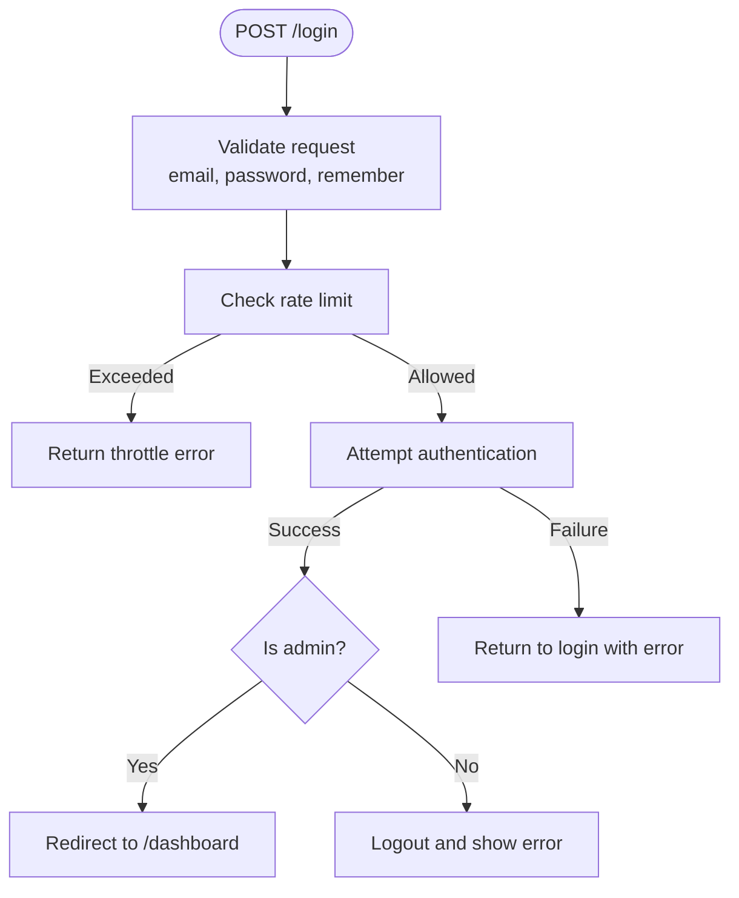

**Diagram sources**
- [routes/auth.php:18](file://routes/auth.php#L18)
- [app/Http/Requests/Auth/LoginRequest.php:28-54](file://app/Http/Requests/Auth/LoginRequest.php#L28-L54)
- [app/Http/Requests/Auth/LoginRequest.php:61-77](file://app/Http/Requests/Auth/LoginRequest.php#L61-L77)
- [app/Http/Controllers/Auth/AuthenticatedSessionController.php:28-43](file://app/Http/Controllers/Auth/AuthenticatedSessionController.php#L28-L43)
- [app/Models/User.php:32-35](file://app/Models/User.php#L32-L35)

**Section sources**
- [routes/auth.php:13-31](file://routes/auth.php#L13-L31)
- [app/Http/Controllers/Auth/AuthenticatedSessionController.php:18-43](file://app/Http/Controllers/Auth/AuthenticatedSessionController.php#L18-L43)
- [app/Http/Requests/Auth/LoginRequest.php:28-87](file://app/Http/Requests/Auth/LoginRequest.php#L28-L87)
- [app/Models/User.php:32-35](file://app/Models/User.php#L32-L35)

### Logout Endpoint
- Method: POST
- URL pattern: /logout
- Middleware: auth
- Purpose: Destroy the current session and CSRF token
- Authentication requirement: Required
- Request body: none
- Response: redirects to /login

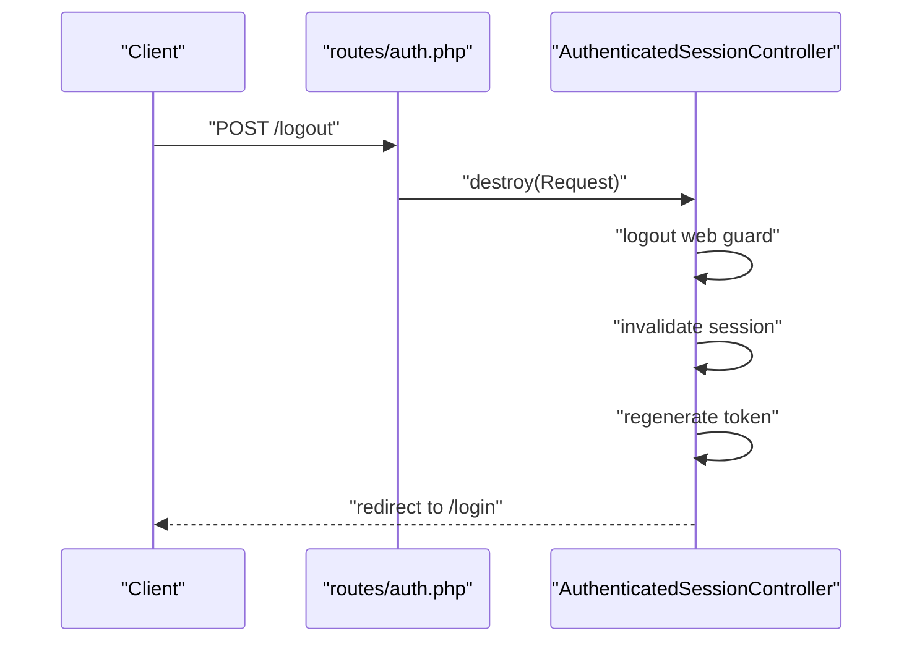

**Diagram sources**
- [routes/auth.php:41](file://routes/auth.php#L41)
- [app/Http/Controllers/Auth/AuthenticatedSessionController.php:48-57](file://app/Http/Controllers/Auth/AuthenticatedSessionController.php#L48-L57)

**Section sources**
- [routes/auth.php:33-43](file://routes/auth.php#L33-L43)
- [app/Http/Controllers/Auth/AuthenticatedSessionController.php:48-57](file://app/Http/Controllers/Auth/AuthenticatedSessionController.php#L48-L57)

### Password Reset Request
- Method: POST
- URL pattern: /forgot-password
- Middleware: guest
- Purpose: Send a password reset link to the provided email
- Authentication requirement: None
- Request body schema:
  - email: string, required, email
- Response:
  - On success: returns to the same page with a status message
  - On failure: throws validation error with the broker’s status message

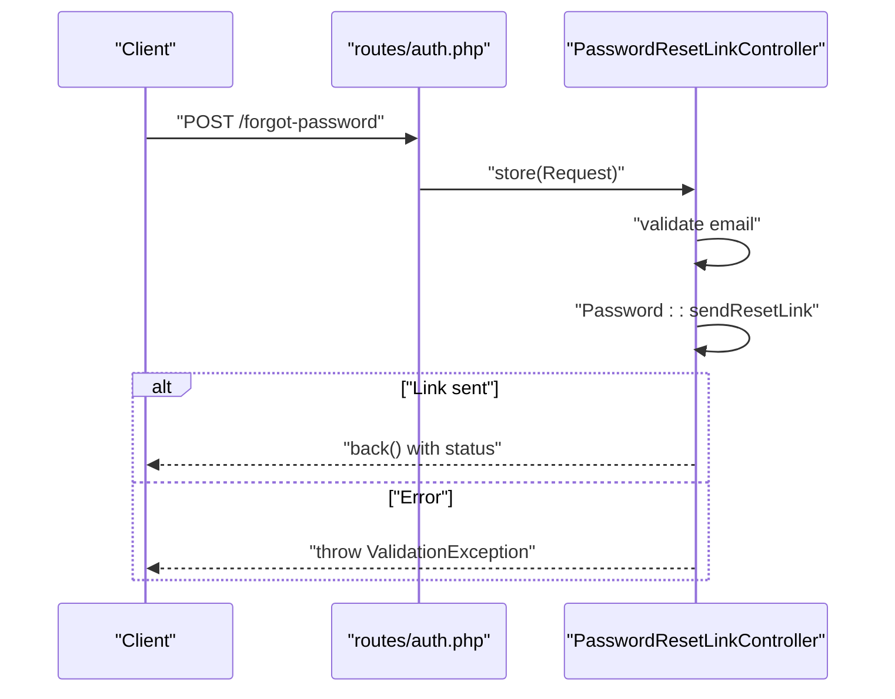

**Diagram sources**
- [routes/auth.php:20-30](file://routes/auth.php#L20-L30)
- [app/Http/Controllers/Auth/PasswordResetLinkController.php:30-50](file://app/Http/Controllers/Auth/PasswordResetLinkController.php#L30-L50)

**Section sources**
- [routes/auth.php:13-31](file://routes/auth.php#L13-L31)
- [app/Http/Controllers/Auth/PasswordResetLinkController.php:18-50](file://app/Http/Controllers/Auth/PasswordResetLinkController.php#L18-L50)

### Set New Password
- Method: POST
- URL pattern: /reset-password
- Middleware: guest
- Purpose: Reset the user’s password using a token
- Authentication requirement: None
- Request body schema:
  - token: string, required
  - email: string, required, email
  - password: string, required, confirmed, secure
- Response:
  - On success: redirects to login with a status message
  - On failure: throws validation error with the broker’s status message

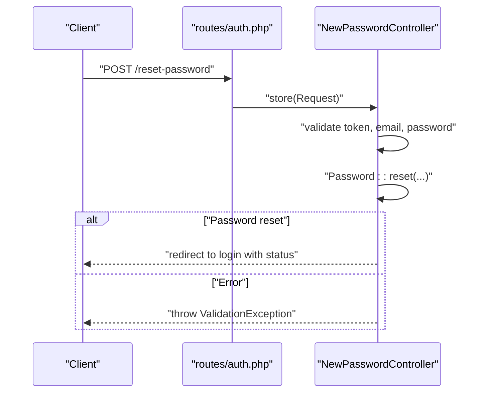

**Diagram sources**
- [routes/auth.php:26-30](file://routes/auth.php#L26-L30)
- [app/Http/Controllers/Auth/NewPasswordController.php:35-68](file://app/Http/Controllers/Auth/NewPasswordController.php#L35-L68)

**Section sources**
- [routes/auth.php:13-31](file://routes/auth.php#L13-L31)
- [app/Http/Controllers/Auth/NewPasswordController.php:17-68](file://app/Http/Controllers/Auth/NewPasswordController.php#L17-L68)

### Email Verification Prompt
- Method: GET
- URL pattern: /email/verify
- Middleware: auth
- Purpose: Show verification prompt if email is not yet verified
- Authentication requirement: Required
- Request body: none
- Response:
  - If verified: redirect to /dashboard
  - If not verified: render the verification prompt page

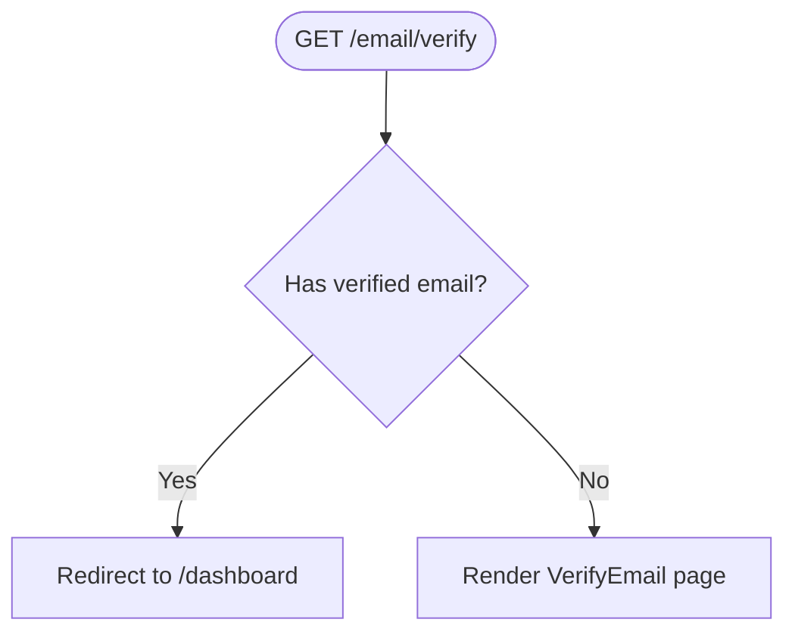

**Diagram sources**
- [app/Http/Controllers/Auth/EmailVerificationPromptController.php:16-21](file://app/Http/Controllers/Auth/EmailVerificationPromptController.php#L16-L21)

**Section sources**
- [app/Http/Controllers/Auth/EmailVerificationPromptController.php:11-23](file://app/Http/Controllers/Auth/EmailVerificationPromptController.php#L11-L23)

### Resend Email Verification Notification
- Method: POST
- URL pattern: /email/verification-notification
- Middleware: auth
- Purpose: Resend the email verification notification
- Authentication requirement: Required
- Request body: none
- Response:
  - If already verified: redirect to /dashboard
  - Else: send notification and return with a status message

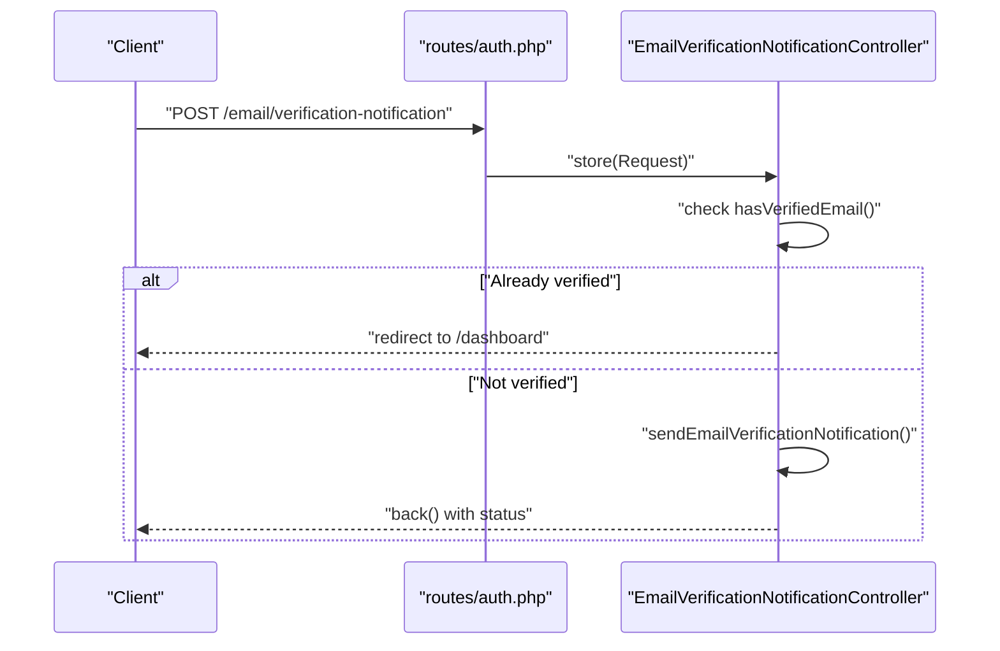

**Diagram sources**
- [app/Http/Controllers/Auth/EmailVerificationNotificationController.php:14-23](file://app/Http/Controllers/Auth/EmailVerificationNotificationController.php#L14-L23)

**Section sources**
- [app/Http/Controllers/Auth/EmailVerificationNotificationController.php:9-25](file://app/Http/Controllers/Auth/EmailVerificationNotificationController.php#L9-L25)

### Verify Email
- Method: GET
- URL pattern: /email/verify/{id}/{hash}
- Middleware: auth
- Purpose: Mark the authenticated user’s email as verified
- Authentication requirement: Required
- Request body: none
- Response: redirect to /dashboard with a verified flag

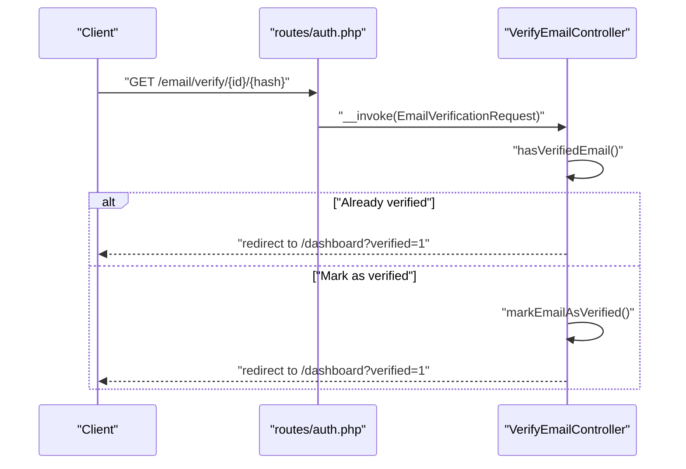

**Diagram sources**
- [app/Http/Controllers/Auth/VerifyEmailController.php:15-26](file://app/Http/Controllers/Auth/VerifyEmailController.php#L15-L26)

**Section sources**
- [app/Http/Controllers/Auth/VerifyEmailController.php:10-28](file://app/Http/Controllers/Auth/VerifyEmailController.php#L10-L28)

### Password Confirmation (for sensitive actions)
- Method: POST
- URL pattern: /confirm-password
- Middleware: auth
- Purpose: Re-validate the user’s password before allowing sensitive operations
- Authentication requirement: Required
- Request body schema:
  - password: string, required, must match current password
- Response: redirect to /dashboard

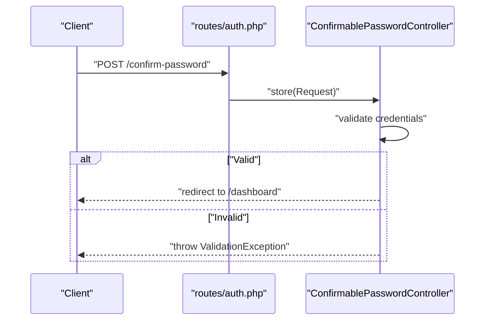

**Diagram sources**
- [routes/auth.php:34-37](file://routes/auth.php#L34-L37)
- [app/Http/Controllers/Auth/ConfirmablePasswordController.php:26-40](file://app/Http/Controllers/Auth/ConfirmablePasswordController.php#L26-L40)

**Section sources**
- [routes/auth.php:33-43](file://routes/auth.php#L33-L43)
- [app/Http/Controllers/Auth/ConfirmablePasswordController.php:13-42](file://app/Http/Controllers/Auth/ConfirmablePasswordController.php#L13-L42)

### Change Password
- Method: PUT
- URL pattern: /password
- Middleware: auth
- Purpose: Update the user’s password
- Authentication requirement: Required
- Request body schema:
  - current_password: string, required, must match existing password
  - password: string, required, confirmed, secure
- Response: back()

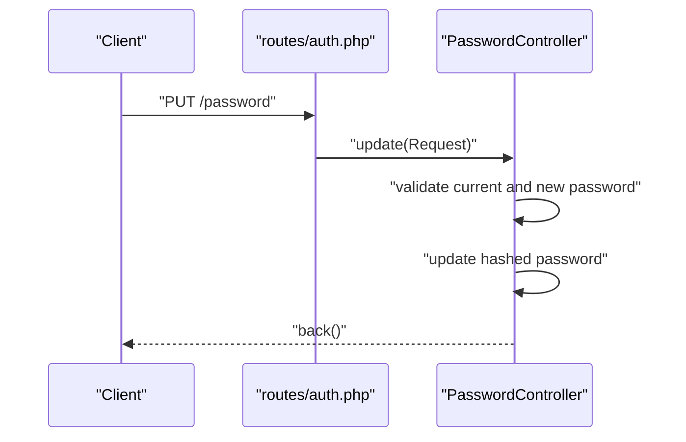

**Diagram sources**
- [routes/auth.php:39](file://routes/auth.php#L39)
- [app/Http/Controllers/Auth/PasswordController.php:16-28](file://app/Http/Controllers/Auth/PasswordController.php#L16-L28)

**Section sources**
- [routes/auth.php:33-43](file://routes/auth.php#L33-L43)
- [app/Http/Controllers/Auth/PasswordController.php:11-30](file://app/Http/Controllers/Auth/PasswordController.php#L11-L30)

## Dependency Analysis
- Route grouping:
  - guest routes: login, forgot-password, reset-password
  - auth routes: confirm-password, password, logout
- Controllers depend on:
  - Illuminate’s Auth facade and RateLimiter for throttling
  - Illuminate’s Password broker for reset flows
  - Inertia for rendering pages
- Model User supports role checks for admin/editor access
- Middleware AdminOnly enforces role-based restrictions

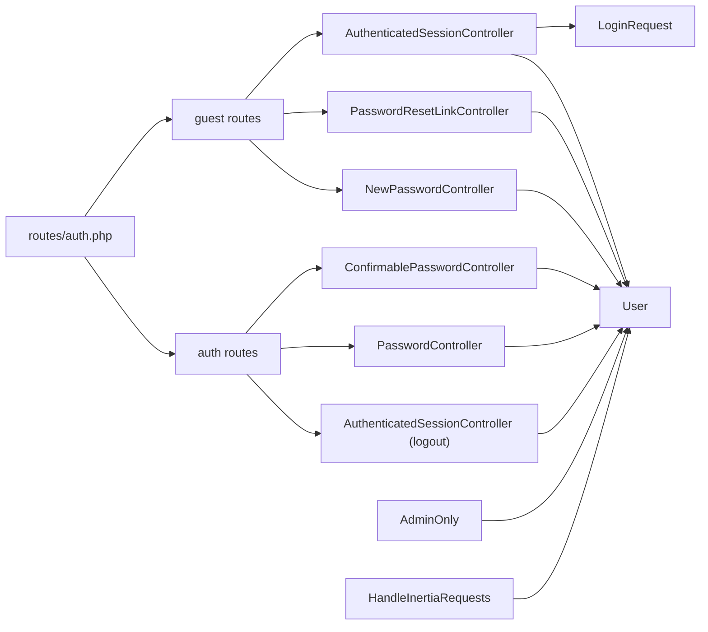

**Diagram sources**
- [routes/auth.php:13-43](file://routes/auth.php#L13-L43)
- [app/Http/Controllers/Auth/AuthenticatedSessionController.php:13-58](file://app/Http/Controllers/Auth/AuthenticatedSessionController.php#L13-L58)
- [app/Http/Controllers/Auth/PasswordResetLinkController.php:13-52](file://app/Http/Controllers/Auth/PasswordResetLinkController.php#L13-L52)
- [app/Http/Controllers/Auth/NewPasswordController.php:17-70](file://app/Http/Controllers/Auth/NewPasswordController.php#L17-L70)
- [app/Http/Controllers/Auth/ConfirmablePasswordController.php:13-42](file://app/Http/Controllers/Auth/ConfirmablePasswordController.php#L13-L42)
- [app/Http/Controllers/Auth/PasswordController.php:11-30](file://app/Http/Controllers/Auth/PasswordController.php#L11-L30)
- [app/Models/User.php:32-46](file://app/Models/User.php#L32-L46)
- [app/Http/Middleware/AdminOnly.php:16-22](file://app/Http/Middleware/AdminOnly.php#L16-L22)
- [app/Http/Middleware/HandleInertiaRequests.php:30-38](file://app/Http/Middleware/HandleInertiaRequests.php#L30-L38)

**Section sources**
- [routes/auth.php:13-43](file://routes/auth.php#L13-L43)
- [app/Models/User.php:32-46](file://app/Models/User.php#L32-L46)
- [app/Http/Middleware/AdminOnly.php:16-22](file://app/Http/Middleware/AdminOnly.php#L16-L22)
- [app/Http/Middleware/HandleInertiaRequests.php:30-38](file://app/Http/Middleware/HandleInertiaRequests.php#L30-L38)

## Performance Considerations
- Rate limiting:
  - Login requests are rate-limited per email+IP to mitigate brute force attacks.
  - Excessive attempts trigger a lockout with a throttle message.
- Session management:
  - Successful login regenerates the session ID to prevent session fixation.
  - Logout invalidates the session and regenerates the CSRF token.
- Password reset:
  - Uses the framework’s password broker with configurable expiration and throttle.

**Section sources**
- [app/Http/Requests/Auth/LoginRequest.php:61-77](file://app/Http/Requests/Auth/LoginRequest.php#L61-L77)
- [app/Http/Controllers/Auth/AuthenticatedSessionController.php:30-54](file://app/Http/Controllers/Auth/AuthenticatedSessionController.php#L30-L54)
- [config/auth.php:95-102](file://config/auth.php#L95-L102)

## Troubleshooting Guide
- Login failures:
  - Incorrect credentials: returns to login with an authentication error.
  - Rate-limited: shows a throttle message with remaining time.
  - Non-admin users attempting admin login are rejected immediately.
- Password reset:
  - Invalid or expired token: validation error with broker status message.
  - Email not found: validation error with broker status message.
- Email verification:
  - Already verified: redirect to dashboard with a verified flag.
  - Resend verification: ensures unverified users receive a new notification.

Common statuses and messages:
- Authentication failed
- Throttle (with seconds/minutes)
- Password reset sent
- Password successfully reset
- Verification link sent
- Email already verified

**Section sources**
- [app/Http/Requests/Auth/LoginRequest.php:45-51](file://app/Http/Requests/Auth/LoginRequest.php#L45-L51)
- [app/Http/Requests/Auth/LoginRequest.php:71-76](file://app/Http/Requests/Auth/LoginRequest.php#L71-L76)
- [app/Http/Controllers/Auth/AuthenticatedSessionController.php:35-41](file://app/Http/Controllers/Auth/AuthenticatedSessionController.php#L35-L41)
- [app/Http/Controllers/Auth/PasswordResetLinkController.php:43-49](file://app/Http/Controllers/Auth/PasswordResetLinkController.php#L43-L49)
- [app/Http/Controllers/Auth/NewPasswordController.php:61-67](file://app/Http/Controllers/Auth/NewPasswordController.php#L61-L67)
- [app/Http/Controllers/Auth/EmailVerificationNotificationController.php:16-22](file://app/Http/Controllers/Auth/EmailVerificationNotificationController.php#L16-L22)
- [app/Http/Controllers/Auth/VerifyEmailController.php:17-25](file://app/Http/Controllers/Auth/VerifyEmailController.php#L17-L25)

## Conclusion
The admin authentication system centers on session-based login with strong protections against brute force and immediate role enforcement. While the provided routes expose a guest login flow, there is no explicit API endpoint for admin login in the current routes. For token-based clients, integrate with Sanctum’s CSRF cookie endpoint and token issuance mechanisms. Ensure clients handle rate limits, CSRF cookies, and session lifecycle appropriately.

## Appendices

### CSRF Protection and Sanctum
- Sanctum’s CSRF cookie endpoint is registered in the application and can be used to prime browser cookies for subsequent authenticated requests.
- Sanctum enables SPA and API token support; however, the current routes do not expose token endpoints for admin login.

**Section sources**
- [config/auth.php:18-21](file://config/auth.php#L18-L21)

### Client Implementation Guidelines
- Mobile apps and external integrations should:
  - Fetch the CSRF cookie from Sanctum’s CSRF endpoint prior to sending authenticated requests.
  - Implement robust rate-limiting awareness and retry logic respecting throttle windows.
  - Store session cookies securely and handle logout by clearing cookies and tokens.
  - For admin login, use the existing guest login flow or extend routes to support token issuance via Sanctum.

[No sources needed since this section provides general guidance]