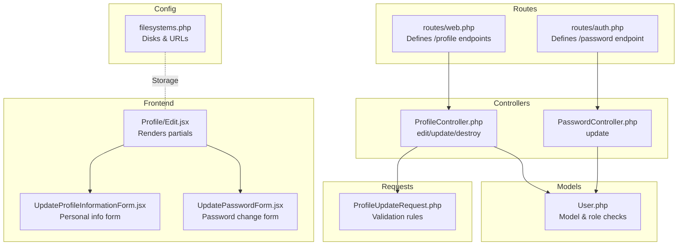
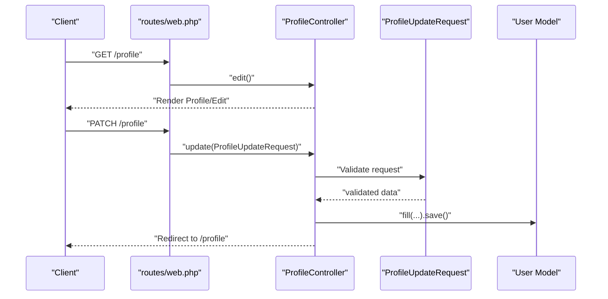
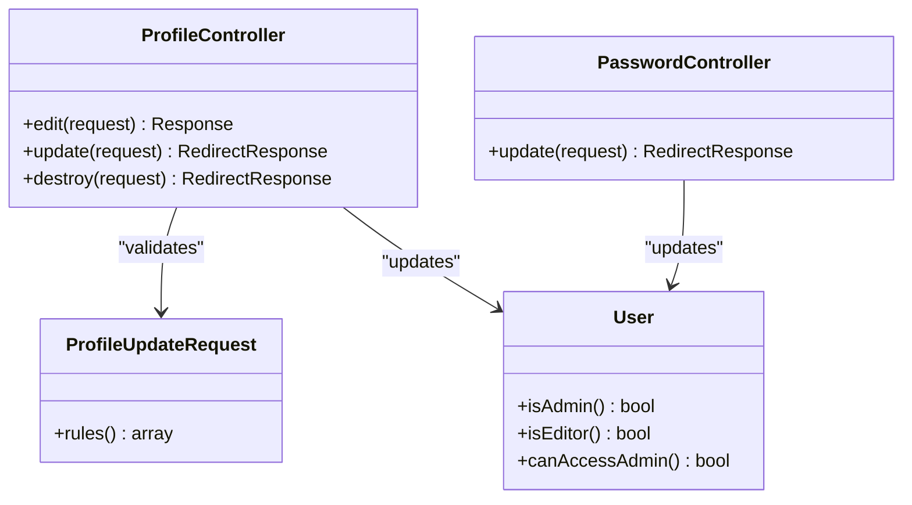

# Profile Management Endpoints

<cite>
**Referenced Files in This Document**
- [routes/web.php](file://routes/web.php)
- [routes/auth.php](file://routes/auth.php)
- [app/Http/Controllers/ProfileController.php](file://app/Http/Controllers/ProfileController.php)
- [app/Http/Controllers/Auth/PasswordController.php](file://app/Http/Controllers/Auth/PasswordController.php)
- [app/Http/Requests/ProfileUpdateRequest.php](file://app/Http/Requests/ProfileUpdateRequest.php)
- [app/Models/User.php](file://app/Models/User.php)
- [resources/js/Pages/Profile/Edit.jsx](file://resources/js/Pages/Profile/Edit.jsx)
- [resources/js/Pages/Profile/Partials/UpdateProfileInformationForm.jsx](file://resources/js/Pages/Profile/Partials/UpdateProfileInformationForm.jsx)
- [resources/js/Pages/Profile/Partials/UpdatePasswordForm.jsx](file://resources/js/Pages/Profile/Partials/UpdatePasswordForm.jsx)
- [config/filesystems.php](file://config/filesystems.php)
- [database/migrations/0001_01_01_000000_create_users_table.php](file://database/migrations/0001_01_01_000000_create_users_table.php)
- [tests/Feature/ProfileTest.php](file://tests/Feature/ProfileTest.php)
</cite>

## Table of Contents
1. [Introduction](#introduction)
2. [Project Structure](#project-structure)
3. [Core Components](#core-components)
4. [Architecture Overview](#architecture-overview)
5. [Detailed Component Analysis](#detailed-component-analysis)
6. [Dependency Analysis](#dependency-analysis)
7. [Performance Considerations](#performance-considerations)
8. [Troubleshooting Guide](#troubleshooting-guide)
9. [Conclusion](#conclusion)
10. [Appendices](#appendices)

## Introduction
This document describes the user profile management endpoints for EDUfa. It covers HTTP methods, URL patterns, request/response schemas, authentication requirements, validation rules, security considerations, and client implementation guidelines. It also documents password updates via the dedicated authentication route and clarifies that profile image/avatar upload is not implemented in the current codebase.

## Project Structure
Profile management is implemented as part of the Laravel backend with Inertia-driven frontend forms:
- Routes define GET/POST/DELETE endpoints under the authenticated middleware group.
- Controllers handle rendering the profile page and processing updates/deletion.
- Form requests enforce validation rules for profile updates.
- Frontend pages render two partials: one for updating personal information and another for changing passwords.
- Filesystem configuration supports local and public storage disks.

**Diagram sources**
- [routes/web.php:131-138](file://routes/web.php#L131-L138)
- [routes/auth.php:33-42](file://routes/auth.php#L33-L42)
- [app/Http/Controllers/ProfileController.php:14-62](file://app/Http/Controllers/ProfileController.php#L14-L62)
- [app/Http/Controllers/Auth/PasswordController.php:11-28](file://app/Http/Controllers/Auth/PasswordController.php#L11-L28)
- [app/Http/Requests/ProfileUpdateRequest.php:10-31](file://app/Http/Requests/ProfileUpdateRequest.php#L10-L31)
- [app/Models/User.php:15-46](file://app/Models/User.php#L15-L46)
- [resources/js/Pages/Profile/Edit.jsx:6-34](file://resources/js/Pages/Profile/Edit.jsx#L6-L34)
- [resources/js/Pages/Profile/Partials/UpdateProfileInformationForm.jsx:8-94](file://resources/js/Pages/Profile/Partials/UpdateProfileInformationForm.jsx#L8-L94)
- [resources/js/Pages/Profile/Partials/UpdatePasswordForm.jsx:9-146](file://resources/js/Pages/Profile/Partials/UpdatePasswordForm.jsx#L9-L146)
- [config/filesystems.php:31-80](file://config/filesystems.php#L31-L80)

**Section sources**
- [routes/web.php:131-138](file://routes/web.php#L131-L138)
- [routes/auth.php:33-42](file://routes/auth.php#L33-L42)
- [app/Http/Controllers/ProfileController.php:14-62](file://app/Http/Controllers/ProfileController.php#L14-L62)
- [app/Http/Controllers/Auth/PasswordController.php:11-28](file://app/Http/Controllers/Auth/PasswordController.php#L11-L28)
- [app/Http/Requests/ProfileUpdateRequest.php:10-31](file://app/Http/Requests/ProfileUpdateRequest.php#L10-L31)
- [app/Models/User.php:15-46](file://app/Models/User.php#L15-L46)
- [resources/js/Pages/Profile/Edit.jsx:6-34](file://resources/js/Pages/Profile/Edit.jsx#L6-L34)
- [resources/js/Pages/Profile/Partials/UpdateProfileInformationForm.jsx:8-94](file://resources/js/Pages/Profile/Partials/UpdateProfileInformationForm.jsx#L8-L94)
- [resources/js/Pages/Profile/Partials/UpdatePasswordForm.jsx:9-146](file://resources/js/Pages/Profile/Partials/UpdatePasswordForm.jsx#L9-L146)
- [config/filesystems.php:31-80](file://config/filesystems.php#L31-L80)

## Core Components
- ProfileController: Renders the profile page and handles updates and deletions.
- ProfileUpdateRequest: Validates name and email updates.
- PasswordController: Updates the user’s password via a dedicated route.
- Frontend forms: Two React components for personal info and password changes.
- Filesystem configuration: Local and public disks for file serving and uploads.

Key behaviors:
- Updating profile triggers revalidation of email uniqueness and clears verification timestamp when email changes.
- Deleting the account requires the current password and invalidates the session afterward.
- Password updates require current password confirmation and enforce strong password rules.

**Section sources**
- [app/Http/Controllers/ProfileController.php:19-62](file://app/Http/Controllers/ProfileController.php#L19-L62)
- [app/Http/Requests/ProfileUpdateRequest.php:17-29](file://app/Http/Requests/ProfileUpdateRequest.php#L17-L29)
- [app/Http/Controllers/Auth/PasswordController.php:16-28](file://app/Http/Controllers/Auth/PasswordController.php#L16-L28)
- [resources/js/Pages/Profile/Partials/UpdateProfileInformationForm.jsx:14-24](file://resources/js/Pages/Profile/Partials/UpdateProfileInformationForm.jsx#L14-L24)
- [resources/js/Pages/Profile/Partials/UpdatePasswordForm.jsx:13-44](file://resources/js/Pages/Profile/Partials/UpdatePasswordForm.jsx#L13-L44)

## Architecture Overview
The profile management flow integrates backend routes, controllers, validation, and frontend forms. The Inertia stack renders the profile page and submits PATCH/DELETE requests for updates and deletion, while a separate PUT route handles password changes.

**Diagram sources**
- [routes/web.php:132-134](file://routes/web.php#L132-L134)
- [app/Http/Controllers/ProfileController.php:19-41](file://app/Http/Controllers/ProfileController.php#L19-L41)
- [app/Http/Requests/ProfileUpdateRequest.php:17-29](file://app/Http/Requests/ProfileUpdateRequest.php#L17-L29)
- [app/Models/User.php:15-31](file://app/Models/User.php#L15-L31)

## Detailed Component Analysis

### Endpoint Definitions
- GET /profile
  - Purpose: Render the profile settings page.
  - Authentication: Required.
  - Response: HTML rendered by Inertia.
  - Status codes: 200 OK; 401 Unauthorized if unauthenticated.
  - Section sources
    - [routes/web.php:132](file://routes/web.php#L132)
    - [app/Http/Controllers/ProfileController.php:19-25](file://app/Http/Controllers/ProfileController.php#L19-L25)

- PATCH /profile
  - Purpose: Update user’s name and email.
  - Authentication: Required.
  - Request body:
    - name: string, required, max length 255.
    - email: string, required, lowercase, valid email, unique per user.
  - Validation behavior:
    - On email change, the email verification timestamp is cleared.
  - Response: Redirect to /profile.
  - Status codes: 200 OK on success; 302 Found redirect; 422 Unprocessable Entity on validation errors.
  - Section sources
    - [routes/web.php:133](file://routes/web.php#L133)
    - [app/Http/Controllers/ProfileController.php:30-41](file://app/Http/Controllers/ProfileController.php#L30-L41)
    - [app/Http/Requests/ProfileUpdateRequest.php:17-29](file://app/Http/Requests/ProfileUpdateRequest.php#L17-L29)
    - [tests/Feature/ProfileTest.php:24-62](file://tests/Feature/ProfileTest.php#L24-L62)

- DELETE /profile
  - Purpose: Delete the user’s account.
  - Authentication: Required.
  - Request body:
    - password: string, required, must match current password.
  - Behavior:
    - Logs out the user, deletes the record, invalidates session, regenerates CSRF token.
  - Response: Redirect to home.
  - Status codes: 200 OK on success; 302 Found redirect; 422 Unprocessable Entity if password is incorrect.
  - Section sources
    - [routes/web.php:134](file://routes/web.php#L134)
    - [app/Http/Controllers/ProfileController.php:46-62](file://app/Http/Controllers/ProfileController.php#L46-L62)
    - [tests/Feature/ProfileTest.php:64-98](file://tests/Feature/ProfileTest.php#L64-L98)

- PUT /password (via auth routes)
  - Purpose: Change the user’s password.
  - Authentication: Required.
  - Request body:
    - current_password: string, required, must match current password.
    - password: string, required, strong password rules, confirmed.
  - Response: Back to previous page.
  - Status codes: 200 OK on success; 422 Unprocessable Entity on validation errors.
  - Section sources
    - [routes/auth.php:39](file://routes/auth.php#L39)
    - [app/Http/Controllers/Auth/PasswordController.php:16-28](file://app/Http/Controllers/Auth/PasswordController.php#L16-L28)

### Request and Response Schemas
- PATCH /profile
  - Request JSON schema:
    {
      "name": "string, required, max 255",
      "email": "string, required, lowercase, email, unique"
    }
  - Response: Redirect to /profile.
  - Section sources
    - [app/Http/Requests/ProfileUpdateRequest.php:17-29](file://app/Http/Requests/ProfileUpdateRequest.php#L17-L29)
    - [tests/Feature/ProfileTest.php:24-44](file://tests/Feature/ProfileTest.php#L24-L44)

- DELETE /profile
  - Request JSON schema:
    {
      "password": "string, required"
    }
  - Response: Redirect to home.
  - Section sources
    - [app/Http/Controllers/ProfileController.php:48-50](file://app/Http/Controllers/ProfileController.php#L48-L50)
    - [tests/Feature/ProfileTest.php:64-79](file://tests/Feature/ProfileTest.php#L64-L79)

- PUT /password
  - Request JSON schema:
    {
      "current_password": "string, required",
      "password": "string, required, strong, confirmed"
    }
  - Response: Back to previous page.
  - Section sources
    - [app/Http/Controllers/Auth/PasswordController.php:18-21](file://app/Http/Controllers/Auth/PasswordController.php#L18-L21)

### Authentication and Authorization
- All profile endpoints are protected by the 'auth' middleware.
- Role-based access middleware exists but is not applied to profile endpoints.
- Section sources
  - [routes/web.php:131-138](file://routes/web.php#L131-L138)
  - [app/Models/User.php:32-45](file://app/Models/User.php#L32-L45)

### Validation Rules and Sanitization
- Name: required, string, max 255.
- Email: required, string, lowercase, valid email format, unique per user ID.
- Password update: current password checked, new password follows strong rules and confirmation.
- Section sources
  - [app/Http/Requests/ProfileUpdateRequest.php:17-29](file://app/Http/Requests/ProfileUpdateRequest.php#L17-L29)
  - [app/Http/Controllers/Auth/PasswordController.php:18-21](file://app/Http/Controllers/Auth/PasswordController.php#L18-L21)

### Security Considerations
- Session termination on account deletion ensures immediate logout and token regeneration.
- Email verification flag is reset upon email change to force re-verification.
- Strong password enforcement via framework rules.
- Section sources
  - [app/Http/Controllers/ProfileController.php:34-36](file://app/Http/Controllers/ProfileController.php#L34-L36)
  - [app/Http/Controllers/ProfileController.php:54-59](file://app/Http/Controllers/ProfileController.php#L54-L59)
  - [app/Http/Controllers/Auth/PasswordController.php:20](file://app/Http/Controllers/Auth/PasswordController.php#L20)

### Privacy Settings
- No explicit privacy toggles for profile visibility are present in the current codebase.
- Section sources
  - [database/migrations/0001_01_01_000000_create_users_table.php:16-25](file://database/migrations/0001_01_01_000000_create_users_table.php#L16-L25)

### Profile Image Upload and Avatar Management
- No profile image upload or avatar management endpoints are implemented in the current codebase.
- Filesystem configuration supports local and public disks; however, no routes or controllers expose upload endpoints for profile images.
- Section sources
  - [config/filesystems.php:31-80](file://config/filesystems.php#L31-L80)
  - [routes/web.php:131-138](file://routes/web.php#L131-L138)

### Client Implementation Guidelines
- Personal Information Form (frontend):
  - Uses Inertia form helpers to submit a PATCH to /profile.
  - Displays server-side validation errors and success feedback.
  - Section sources
    - [resources/js/Pages/Profile/Partials/UpdateProfileInformationForm.jsx:14-24](file://resources/js/Pages/Profile/Partials/UpdateProfileInformationForm.jsx#L14-L24)
    - [resources/js/Pages/Profile/Edit.jsx:6-34](file://resources/js/Pages/Profile/Edit.jsx#L6-L34)

- Password Change Form (frontend):
  - Uses Inertia form helpers to submit a PUT to /password.
  - Resets sensitive fields on validation errors and focuses appropriate inputs.
  - Section sources
    - [resources/js/Pages/Profile/Partials/UpdatePasswordForm.jsx:13-44](file://resources/js/Pages/Profile/Partials/UpdatePasswordForm.jsx#L13-L44)
    - [routes/auth.php:39](file://routes/auth.php#L39)

### Error Handling Strategies
- Validation failures return 422 with error messages mapped to fields.
- Account deletion requires correct password; otherwise returns 422 with password error.
- Section sources
  - [tests/Feature/ProfileTest.php:82-98](file://tests/Feature/ProfileTest.php#L82-L98)
  - [app/Http/Controllers/ProfileController.php:48-50](file://app/Http/Controllers/ProfileController.php#L48-L50)

## Dependency Analysis

**Diagram sources**
- [app/Http/Controllers/ProfileController.php:14-62](file://app/Http/Controllers/ProfileController.php#L14-L62)
- [app/Http/Controllers/Auth/PasswordController.php:11-28](file://app/Http/Controllers/Auth/PasswordController.php#L11-L28)
- [app/Http/Requests/ProfileUpdateRequest.php:10-31](file://app/Http/Requests/ProfileUpdateRequest.php#L10-L31)
- [app/Models/User.php:15-46](file://app/Models/User.php#L15-L46)

**Section sources**
- [app/Http/Controllers/ProfileController.php:14-62](file://app/Http/Controllers/ProfileController.php#L14-L62)
- [app/Http/Controllers/Auth/PasswordController.php:11-28](file://app/Http/Controllers/Auth/PasswordController.php#L11-L28)
- [app/Http/Requests/ProfileUpdateRequest.php:10-31](file://app/Http/Requests/ProfileUpdateRequest.php#L10-L31)
- [app/Models/User.php:15-46](file://app/Models/User.php#L15-L46)

## Performance Considerations
- Validation occurs at the request level; keep payloads minimal to reduce overhead.
- Email uniqueness validation queries are efficient due to database indexing.
- Session invalidation on deletion prevents stale sessions and reduces subsequent checks.
- Section sources
  - [app/Http/Requests/ProfileUpdateRequest.php:21-28](file://app/Http/Requests/ProfileUpdateRequest.php#L21-L28)
  - [app/Http/Controllers/ProfileController.php:54-59](file://app/Http/Controllers/ProfileController.php#L54-L59)

## Troubleshooting Guide
- 422 errors on PATCH /profile:
  - Ensure name and email meet validation rules.
  - Changing email resets verification status; re-verify if necessary.
  - Section sources
    - [app/Http/Requests/ProfileUpdateRequest.php:17-29](file://app/Http/Requests/ProfileUpdateRequest.php#L17-L29)
    - [tests/Feature/ProfileTest.php:24-62](file://tests/Feature/ProfileTest.php#L24-L62)

- 422 errors on DELETE /profile:
  - Provide the correct current password.
  - Section sources
    - [app/Http/Controllers/ProfileController.php:48-50](file://app/Http/Controllers/ProfileController.php#L48-L50)
    - [tests/Feature/ProfileTest.php:82-98](file://tests/Feature/ProfileTest.php#L82-L98)

- 422 errors on PUT /password:
  - Provide current password and ensure new password meets strength requirements and confirmation.
  - Section sources
    - [app/Http/Controllers/Auth/PasswordController.php:18-21](file://app/Http/Controllers/Auth/PasswordController.php#L18-L21)

## Conclusion
EDUfa’s profile management endpoints provide secure, validated operations for updating personal information and changing passwords, with robust deletion safeguards. While email verification behavior is enforced during updates, profile image upload is not currently supported. Clients should rely on the provided Inertia forms and adhere to validation rules to ensure reliable operation.

## Appendices

### Appendix A: Endpoint Reference
- GET /profile → 200 OK (renders profile page)
- PATCH /profile → 200 OK (redirects to /profile)
- DELETE /profile → 200 OK (redirects to home)
- PUT /password → 200 OK (returns to previous page)

**Section sources**
- [routes/web.php:132-134](file://routes/web.php#L132-L134)
- [routes/auth.php:39](file://routes/auth.php#L39)

### Appendix B: Data Model Notes
- Users table includes name, email, email_verified_at, password, role, remember_token, timestamps.
- Section sources
- [database/migrations/0001_01_01_000000_create_users_table.php:16-25](file://database/migrations/0001_01_01_000000_create_users_table.php#L16-L25)