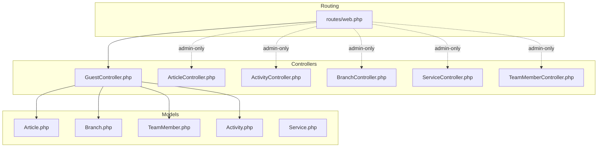
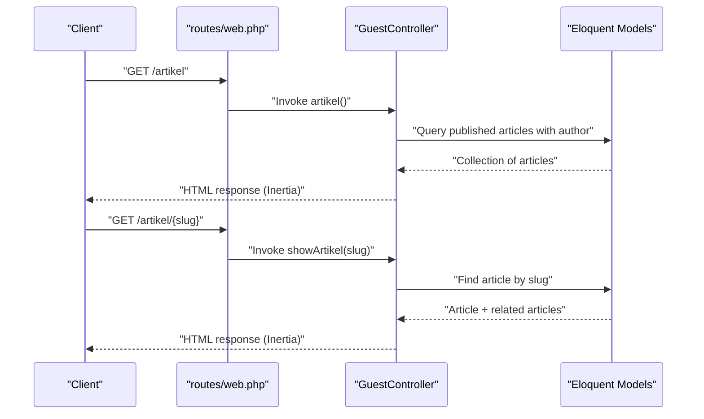
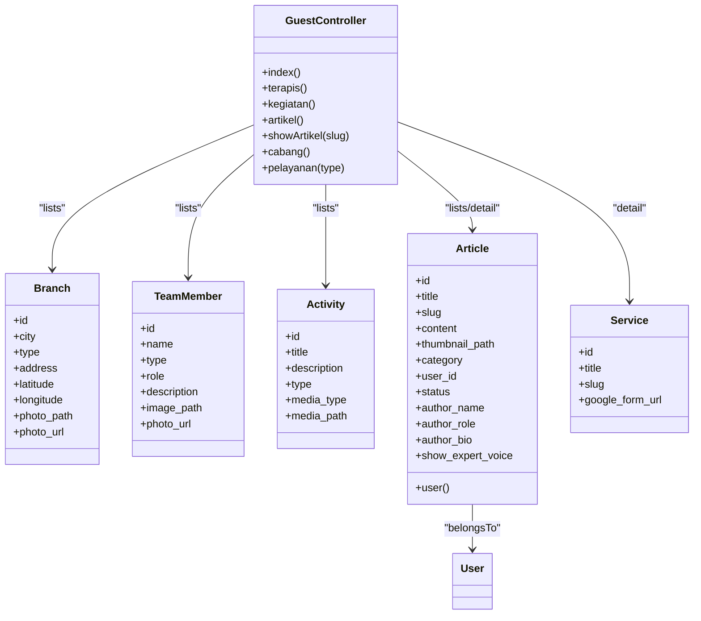

# Public Service Endpoints

<cite>
**Referenced Files in This Document**
- [web.php](file://routes/web.php)
- [GuestController.php](file://app/Http/Controllers/GuestController.php)
- [ArticleController.php](file://app/Http/Controllers/ArticleController.php)
- [ActivityController.php](file://app/Http/Controllers/ActivityController.php)
- [BranchController.php](file://app/Http/Controllers/BranchController.php)
- [ServiceController.php](file://app/Http/Controllers/ServiceController.php)
- [TeamMemberController.php](file://app/Http/Controllers/TeamMemberController.php)
- [Article.php](file://app/Models/Article.php)
- [Branch.php](file://app/Models/Branch.php)
- [TeamMember.php](file://app/Models/TeamMember.php)
- [Activity.php](file://app/Models/Activity.php)
- [Service.php](file://app/Models/Service.php)
- [2026_04_30_050400_create_articles_table.php](file://database/migrations/2026_04_30_050400_create_articles_table.php)
- [2026_04_20_133158_create_branches_table.php](file://database/migrations/2026_04_20_133158_create_branches_table.php)
- [2026_04_25_153659_create_team_members_table.php](file://database/migrations/2026_04_25_153659_create_team_members_table.php)
- [2026_04_30_045526_create_activities_table.php](file://database/migrations/2026_04_30_045526_create_activities_table.php)
- [2026_04_30_055559_create_services_table.php](file://database/migrations/2026_04_30_055559_create_services_table.php)
</cite>

## Table of Contents
1. [Introduction](#introduction)
2. [Project Structure](#project-structure)
3. [Core Components](#core-components)
4. [Architecture Overview](#architecture-overview)
5. [Detailed Component Analysis](#detailed-component-analysis)
6. [Dependency Analysis](#dependency-analysis)
7. [Performance Considerations](#performance-considerations)
8. [Troubleshooting Guide](#troubleshooting-guide)
9. [Conclusion](#conclusion)
10. [Appendices](#appendices)

## Introduction
This document describes the public service endpoints that power EDUfa’s frontend and external clients. It focuses on the guest-facing pages and content APIs exposed via Laravel routes and controllers. The documentation covers HTTP methods, URL patterns, request/response schemas, pagination, filtering/search capabilities, error handling, caching, performance, SEO-friendly URLs, and CDN optimization recommendations. It also provides client implementation guidelines for mobile apps and external integrations.

## Project Structure
The public endpoints are primarily defined in the web route file and served by the GuestController. Content lists and details are backed by Eloquent models and migrations. Administrative endpoints are present but not part of the public API surface.

**Diagram sources**
- [web.php](file://routes/web.php)
- [GuestController.php](file://app/Http/Controllers/GuestController.php)
- [ArticleController.php](file://app/Http/Controllers/ArticleController.php)
- [ActivityController.php](file://app/Http/Controllers/ActivityController.php)
- [BranchController.php](file://app/Http/Controllers/BranchController.php)
- [ServiceController.php](file://app/Http/Controllers/ServiceController.php)
- [TeamMemberController.php](file://app/Http/Controllers/TeamMemberController.php)
- [Article.php](file://app/Models/Article.php)
- [Branch.php](file://app/Models/Branch.php)
- [TeamMember.php](file://app/Models/TeamMember.php)
- [Activity.php](file://app/Models/Activity.php)
- [Service.php](file://app/Models/Service.php)

**Section sources**
- [web.php](file://routes/web.php)
- [GuestController.php](file://app/Http/Controllers/GuestController.php)

## Core Components
- GuestController: Renders guest pages and exposes content lists and details for branches, team members, activities, articles, and service landing pages.
- Models: Article, Branch, TeamMember, Activity, Service define the data structures and attributes returned to clients.
- Routes: Define public URL patterns and named routes for SEO-friendly navigation.

Key public endpoints:
- Homepage: GET /
- Team members: GET /terapis
- Activities: GET /kegiatan
- Articles listing: GET /artikel
- Article detail: GET /artikel/{slug}
- Branches: GET /cabang
- Service landing pages: GET /pelayanan/{slug}

Pagination, filtering, and search are not implemented in current controllers; clients should handle basic pagination and filtering on the frontend.

**Section sources**
- [web.php](file://routes/web.php)
- [GuestController.php](file://app/Http/Controllers/GuestController.php)
- [Article.php](file://app/Models/Article.php)
- [Branch.php](file://app/Models/Branch.php)
- [TeamMember.php](file://app/Models/TeamMember.php)
- [Activity.php](file://app/Models/Activity.php)
- [Service.php](file://app/Models/Service.php)

## Architecture Overview
The public API surface is thin: most routes render server-side views via Inertia. There are no dedicated JSON endpoints for public consumption. Clients should treat these as HTML-rendered pages and fetch content accordingly.

**Diagram sources**
- [web.php](file://routes/web.php)
- [GuestController.php](file://app/Http/Controllers/GuestController.php)

## Detailed Component Analysis

### Homepage
- Method: GET
- URL: /
- Purpose: Renders the homepage with branch listings.
- Response: HTML (Inertia-rendered page).
- Data: branches array from Branch model.

Notes:
- No JSON endpoint exists; clients should parse the HTML response.
- SEO: Canonical homepage URL is defined in sitemap generation.

**Section sources**
- [web.php](file://routes/web.php)
- [GuestController.php](file://app/Http/Controllers/GuestController.php)
- [Branch.php](file://app/Models/Branch.php)

### Team Member Profiles
- Method: GET
- URL: /terapis
- Purpose: Renders team member profiles.
- Response: HTML (Inertia-rendered page).
- Data: teamMembers array from TeamMember model.

Attributes returned:
- id, name, type, role, description, image_path.
- Computed photo_url via model accessor.

Filtering:
- Not supported in current implementation.

**Section sources**
- [web.php](file://routes/web.php)
- [GuestController.php](file://app/Http/Controllers/GuestController.php)
- [TeamMember.php](file://app/Models/TeamMember.php)

### Branch Locations
- Method: GET
- URL: /cabang
- Purpose: Renders branch locations.
- Response: HTML (Inertia-rendered page).
- Data: branches array from Branch model.

Attributes returned:
- id, city, type, address, latitude, longitude, photo_path.
- Computed photo_url via model accessor.

Filtering:
- Not supported in current implementation.

**Section sources**
- [web.php](file://routes/web.php)
- [GuestController.php](file://app/Http/Controllers/GuestController.php)
- [Branch.php](file://app/Models/Branch.php)

### Article Listings
- Method: GET
- URL: /artikel
- Purpose: Renders published articles with excerpts.
- Response: HTML (Inertia-rendered page).
- Data: articles collection with excerpt and author info.

Attributes returned:
- id, title, slug, category, status, thumbnail_path, user_id, content (removed), excerpt (computed), author_name, author_role, author_bio, show_expert_voice.
- Related model: user (author).

Filtering/Search:
- Not supported in current implementation.

**Section sources**
- [web.php](file://routes/web.php)
- [GuestController.php](file://app/Http/Controllers/GuestController.php)
- [Article.php](file://app/Models/Article.php)

### Article Detail
- Method: GET
- URL: /artikel/{slug}
- Purpose: Renders article detail and related articles.
- Response: HTML (Inertia-rendered page).
- Data: article + relatedArticles (up to 3).

Attributes returned:
- id, title, slug, category, status, thumbnail_path, content, user_id, author_name, author_role, author_bio, show_expert_voice.
- Related model: user (author).

Filtering/Search:
- Not supported in current implementation.

**Section sources**
- [web.php](file://routes/web.php)
- [GuestController.php](file://app/Http/Controllers/GuestController.php)
- [Article.php](file://app/Models/Article.php)

### Activity Schedule
- Method: GET
- URL: /kegiatan
- Purpose: Renders recent activities.
- Response: HTML (Inertia-rendered page).
- Data: activities collection.

Attributes returned:
- id, title, description, type, media_type, media_path.

Filtering/Search:
- Not supported in current implementation.

**Section sources**
- [web.php](file://routes/web.php)
- [GuestController.php](file://app/Http/Controllers/GuestController.php)
- [Activity.php](file://app/Models/Activity.php)

### Service Landing Pages
- Method: GET
- URL: /pelayanan/{type}
- Purpose: Renders service-specific landing pages mapped by slug.
- Supported slugs: asesmen-psikologi, pelatihan, konseling, terapi, paud-edufa-kids, pendampingan-abk, balai-latihan-kerja.
- Response: HTML (Inertia-rendered page).
- Data: service record by slug.

Filtering/Search:
- Not supported in current implementation.

**Section sources**
- [web.php](file://routes/web.php)
- [GuestController.php](file://app/Http/Controllers/GuestController.php)
- [Service.php](file://app/Models/Service.php)

### Sitemap Endpoint
- Method: GET
- URL: /sitemap.xml
- Purpose: Generates XML sitemap for SEO.
- Response: XML.

Capabilities:
- Includes static pages and dynamic published articles.

**Section sources**
- [web.php](file://routes/web.php)

## Dependency Analysis
- Controllers depend on Eloquent models for data retrieval.
- GuestController renders views via Inertia; no JSON serialization is performed.
- Models expose computed attributes (e.g., photo_url) to simplify client rendering.
- Routes define SEO-friendly URLs and named routes.

**Diagram sources**
- [GuestController.php](file://app/Http/Controllers/GuestController.php)
- [Branch.php](file://app/Models/Branch.php)
- [TeamMember.php](file://app/Models/TeamMember.php)
- [Activity.php](file://app/Models/Activity.php)
- [Article.php](file://app/Models/Article.php)
- [Service.php](file://app/Models/Service.php)

**Section sources**
- [GuestController.php](file://app/Http/Controllers/GuestController.php)
- [Article.php](file://app/Models/Article.php)
- [Branch.php](file://app/Models/Branch.php)
- [TeamMember.php](file://app/Models/TeamMember.php)
- [Activity.php](file://app/Models/Activity.php)
- [Service.php](file://app/Models/Service.php)

## Performance Considerations
- Current controllers load all records without pagination. This can cause performance issues at scale.
- Recommendations:
  - Introduce pagination for lists (articles, activities, branches, team members).
  - Add server-side filtering and search for articles and activities.
  - Enable HTTP caching (ETag/Last-Modified) for static-like pages.
  - Use CDN for assets (images/thumbnails) referenced via computed photo_url fields.
  - Consider pre-generating and caching sitemap for improved SEO performance.

[No sources needed since this section provides general guidance]

## Troubleshooting Guide
- 404 Not Found:
  - Occurs when accessing unknown service slugs under /pelayanan.
- Empty Lists:
  - Articles may be empty if no records exist or none are published.
- Asset Loading:
  - Ensure storage symlink is configured so computed photo_url resolves correctly.

**Section sources**
- [GuestController.php](file://app/Http/Controllers/GuestController.php)

## Conclusion
EDUfa’s public endpoints currently render HTML pages via Inertia. There is no dedicated JSON API surface. Clients should adapt to HTML responses and implement pagination/filtering/search on the frontend. For production, introduce pagination, caching, and optional JSON endpoints to improve performance and developer experience.

[No sources needed since this section summarizes without analyzing specific files]

## Appendices

### Request/Response Examples and Schemas

Note: Responses are HTML-rendered via Inertia. The following outlines representative JSON schemas clients can expect when consuming the underlying data.

- Homepage
  - GET /
  - Response body: { branches: [BranchItem] }
  - BranchItem: { id, city, type, address, latitude, longitude, photo_url }

- Team Members
  - GET /terapis
  - Response body: { teamMembers: [TeamMemberItem] }
  - TeamMemberItem: { id, name, type, role, description, photo_url }

- Branches
  - GET /cabang
  - Response body: { branches: [BranchItem] }

- Articles Listing
  - GET /artikel
  - Response body: { articles: [ArticleListItem] }
  - ArticleListItem: { id, title, slug, category, status, thumbnail_path, user_id, excerpt, author_name, author_role, author_bio, show_expert_voice }

- Article Detail
  - GET /artikel/{slug}
  - Response body: { article: ArticleDetail, relatedArticles: [ArticleListItem] }
  - ArticleDetail: { id, title, slug, category, status, thumbnail_path, content, user_id, author_name, author_role, author_bio, show_expert_voice }

- Activities
  - GET /kegiatan
  - Response body: { activities: [ActivityItem] }
  - ActivityItem: { id, title, description, type, media_type, media_path }

- Service Landing
  - GET /pelayanan/{type}
  - Response body: { service: ServiceItem }
  - ServiceItem: { id, title, slug, google_form_url }

- Sitemap
  - GET /sitemap.xml
  - Response body: XML sitemap

[No sources needed since this section provides general guidance]

### Query Parameters, Pagination, Filtering, Search
- None implemented in current controllers.
- Recommended additions:
  - Pagination: limit, offset or page, per_page.
  - Filtering: category for articles, type for activities, city/type for branches.
  - Search: q parameter for article titles/content.

[No sources needed since this section provides general guidance]

### Error Handling and Status Codes
- 404 Not Found: Unknown service slug under /pelayanan.
- 200 OK: Successful rendering of HTML pages.
- 5xx: Server errors during rendering.

[No sources needed since this section provides general guidance]

### Caching Strategies
- ETag/Last-Modified headers for static-like pages.
- Browser caching for assets via computed photo_url.
- CDN distribution for images/thumbnails.

[No sources needed since this section provides general guidance]

### SEO-Friendly URL Patterns
- Static pages: /, /terapis, /cabang, /kegiatan, /artikel.
- Article detail: /artikel/{slug}.
- Service landing: /pelayanan/{slug}.

**Section sources**
- [web.php](file://routes/web.php)

### Client Implementation Guidelines
- Mobile Apps:
  - Fetch HTML pages and render with WebView or SPA router.
  - Implement offline caching for frequently accessed pages.
  - Use image prefetching for thumbnails and photos.
- External Integrations:
  - Mirror site structure and use sitemap for discovery.
  - Respect robots.txt and rate limits.
  - Cache aggressively for low-churn content.

[No sources needed since this section provides general guidance]

### CDN Optimization
- Serve images/thumbnails via CDN using computed photo_url.
- Set long cache TTLs for immutable assets.
- Use origin pull or push depending on deployment strategy.

[No sources needed since this section provides general guidance]