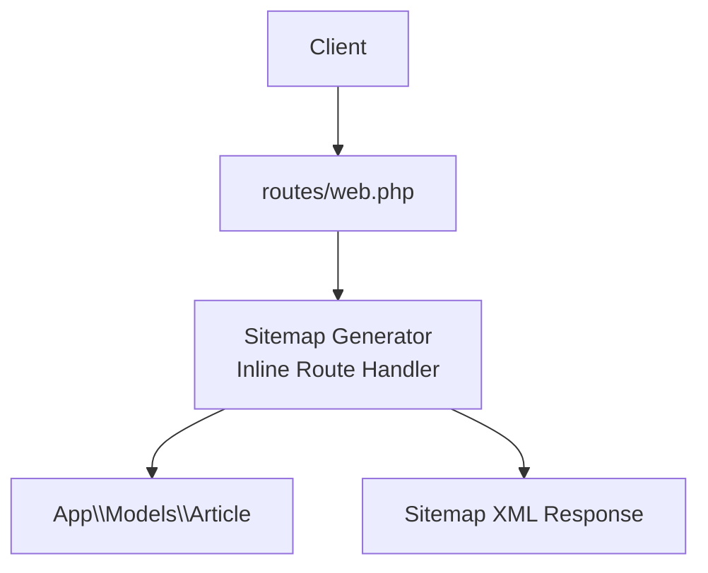
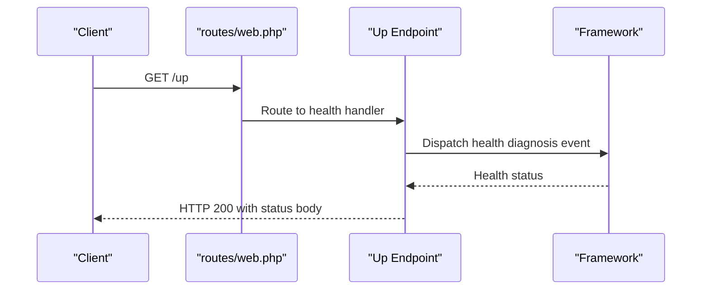
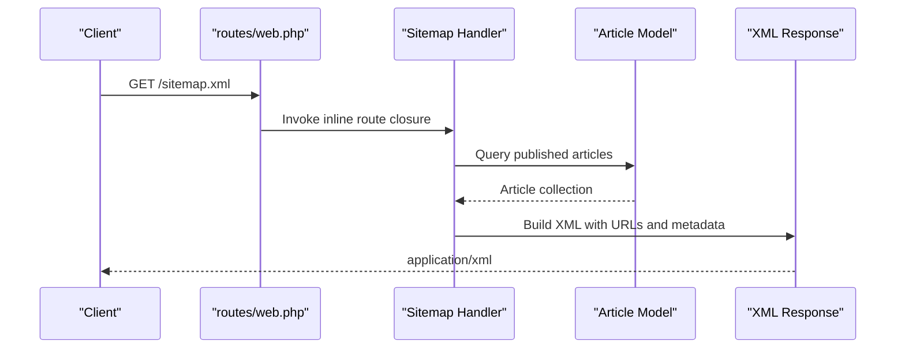
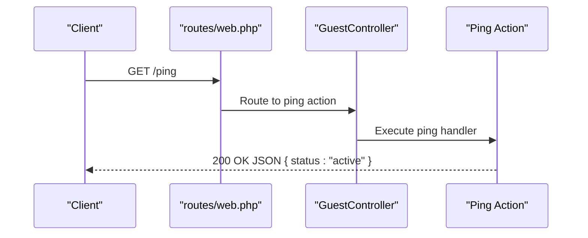
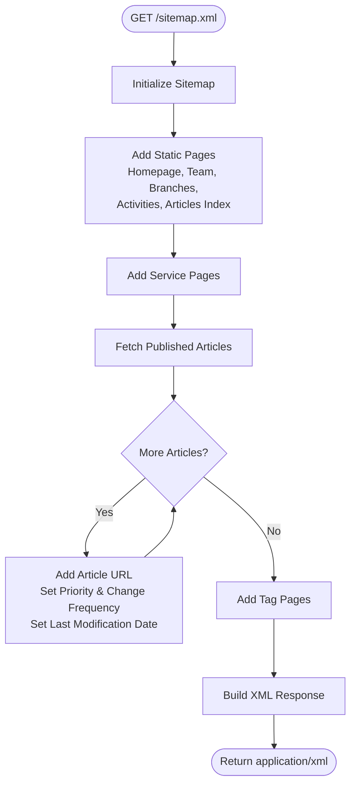
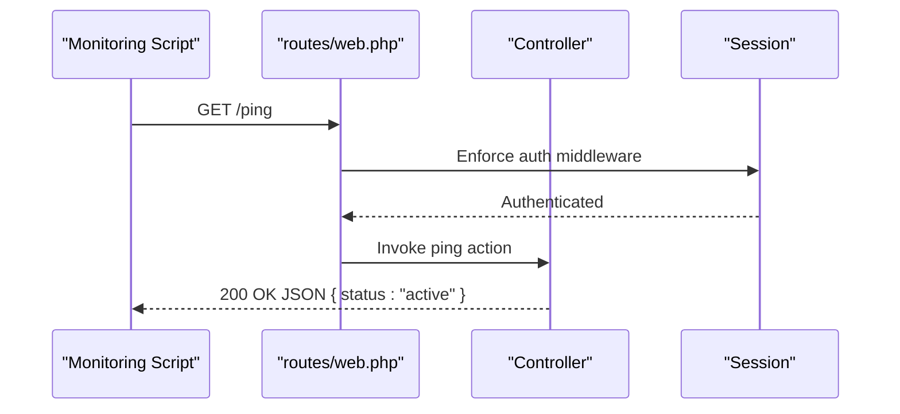
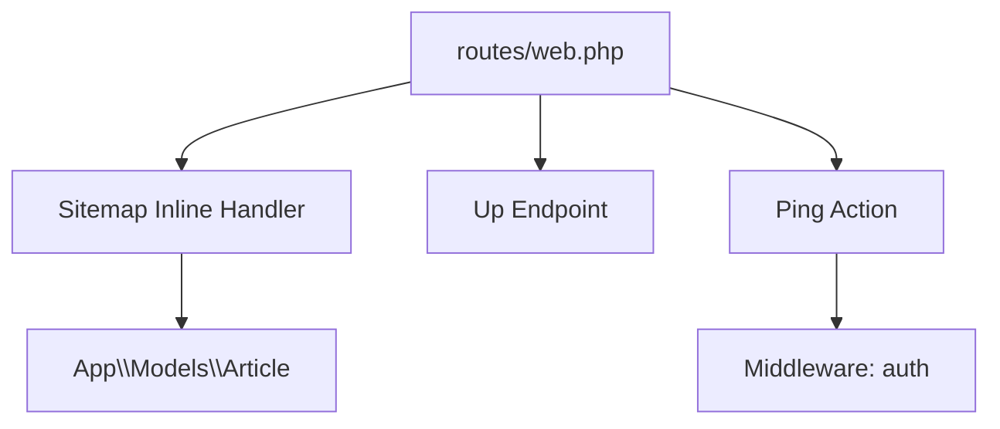

# System Health and Utility Endpoints

<cite>
**Referenced Files in This Document**
- [routes/web.php](file://routes/web.php)
- [app/Http/Controllers/GuestController.php](file://app/Http/Controllers/GuestController.php)
- [config/cache.php](file://config/cache.php)
- [config/app.php](file://config/app.php)
- [public/.htaccess](file://public/.htaccess)
- [app/Http/Middleware/HandleInertiaRequests.php](file://app/Http/Middleware/HandleInertiaRequests.php)
- [app/Providers/AppServiceProvider.php](file://app/Providers/AppServiceProvider.php)
- [bootstrap/cache/routes-v7.php](file://bootstrap/cache/routes-v7.php)
- [composer.json](file://composer.json)
</cite>

## Table of Contents
1. [Introduction](#introduction)
2. [Project Structure](#project-structure)
3. [Core Components](#core-components)
4. [Architecture Overview](#architecture-overview)
5. [Detailed Component Analysis](#detailed-component-analysis)
6. [Dependency Analysis](#dependency-analysis)
7. [Performance Considerations](#performance-considerations)
8. [Troubleshooting Guide](#troubleshooting-guide)
9. [Conclusion](#conclusion)

## Introduction
This document provides API documentation for EDUfa’s system health and utility endpoints. It covers:
- Health check endpoint for monitoring availability
- Sitemap generation endpoint for SEO and indexing
- Ping endpoint for lightweight liveness checks
- Request/response examples, caching strategies, and performance considerations
- Client implementation guidelines for automated monitoring and maintenance scripts
- Guidance on caching headers, compression, and CDN optimization for utility endpoints

## Project Structure
The relevant endpoints are defined in the web routes and served via controller actions. The sitemap endpoint is implemented inline within the routes file and leverages a third-party sitemap package. The health check endpoint is registered by the framework and exposed under the conventional path.

**Diagram sources**
- [routes/web.php:15-65](file://routes/web.php#L15-L65)
- [routes/web.php:38-46](file://routes/web.php#L38-L46)

**Section sources**
- [routes/web.php:15-65](file://routes/web.php#L15-L65)

## Core Components
This section documents the health and utility endpoints, including HTTP methods, URL patterns, and response formats.

- Health Check Endpoint
  - Method: GET
  - URL: /up
  - Purpose: System health diagnostic endpoint
  - Response: Status indicator and optional exception message in production environments
  - Notes: Implemented by the framework; integrates with health diagnosis events

- Sitemap Endpoint
  - Method: GET
  - URL: /sitemap.xml
  - Purpose: Dynamic XML sitemap for articles, services, and static pages
  - Response: application/xml
  - Behavior: Generates URLs for homepage, team, branches, activities, articles, service pages, and tag pages; sets priorities and change frequencies; includes last modification dates for articles

- Ping Endpoint
  - Method: GET
  - URL: /ping
  - Purpose: Lightweight liveness check for load balancers and monitoring
  - Response: JSON object indicating active status
  - Authentication: Requires authenticated session

**Section sources**
- [routes/web.php:15-65](file://routes/web.php#L15-L65)
- [routes/web.php:149-151](file://routes/web.php#L149-L151)
- [bootstrap/cache/routes-v7.php:1261](file://bootstrap/cache/routes-v7.php#L1261)

## Architecture Overview
The following sequence diagrams illustrate how clients interact with the health, sitemap, and ping endpoints.

**Diagram sources**
- [routes/web.php:15-65](file://routes/web.php#L15-L65)
- [bootstrap/cache/routes-v7.php:1261](file://bootstrap/cache/routes-v7.php#L1261)

**Diagram sources**
- [routes/web.php:15-65](file://routes/web.php#L15-L65)
- [routes/web.php:38-46](file://routes/web.php#L38-L46)

**Diagram sources**
- [routes/web.php:149-151](file://routes/web.php#L149-L151)

## Detailed Component Analysis

### Health Check Endpoint (/up)
- Purpose: Exposes a standardized health check for uptime monitoring and load balancer readiness probes
- Implementation: Registered by the framework; invokes health diagnosis events and returns a simple status payload
- Typical Responses:
  - 200 OK: Healthy system
  - Non-200: Indicates degraded or failed health
- Monitoring Integration: Suitable for Kubernetes readiness/liveness probes, cloud load balancers, and synthetic monitoring

**Section sources**
- [bootstrap/cache/routes-v7.php:1261](file://bootstrap/cache/routes-v7.php#L1261)

### Sitemap Endpoint (/sitemap.xml)
- Purpose: Dynamically generates an XML sitemap for SEO and search engine crawling
- URL Generation Strategy:
  - Static pages: homepage, team, branches, activities, articles index
  - Service pages: curated list of service-specific paths
  - Articles: iterates published articles and adds slugged URLs with last modification timestamps
  - Tags: predefined tag-based category URLs
- Metadata:
  - Priority and change frequency set per URL type
  - Last modification date derived from article update timestamps
- Response:
  - Content-Type: application/xml
  - Body: XML sitemap conforming to standard sitemap protocol

**Diagram sources**
- [routes/web.php:15-65](file://routes/web.php#L15-L65)
- [routes/web.php:38-46](file://routes/web.php#L38-L46)

**Section sources**
- [routes/web.php:15-65](file://routes/web.php#L15-L65)

### Ping Endpoint (/ping)
- Purpose: Lightweight heartbeat for automated monitoring and maintenance scripts
- Authentication: Requires an authenticated session
- Response: JSON object containing an active status indicator
- Use Cases:
  - Load balancer health checks
  - Synthetic monitoring scripts
  - Automated maintenance tasks verifying application responsiveness

**Diagram sources**
- [routes/web.php:149-151](file://routes/web.php#L149-L151)

**Section sources**
- [routes/web.php:149-151](file://routes/web.php#L149-L151)

## Dependency Analysis
The sitemap endpoint depends on the Article model for dynamic URL generation. The health endpoint is provided by the framework. The ping endpoint is gated by authentication middleware.

**Diagram sources**
- [routes/web.php:15-65](file://routes/web.php#L15-L65)
- [routes/web.php:149-151](file://routes/web.php#L149-L151)

**Section sources**
- [routes/web.php:15-65](file://routes/web.php#L15-L65)
- [routes/web.php:149-151](file://routes/web.php#L149-L151)

## Performance Considerations
- Sitemap Generation
  - Database Query: Fetches published articles; consider indexing the status and slug columns for efficient filtering
  - Response Size: Large sitemaps may increase memory and response time; consider pagination or pre-generation strategies for very large article catalogs
  - Caching: Implement server-side caching for the sitemap endpoint to reduce repeated database queries during crawls
- Health Endpoint
  - Minimal overhead: Health checks should remain lightweight; avoid heavy computations
  - CDN Placement: Place behind a CDN or reverse proxy to minimize origin load for frequent probes
- Ping Endpoint
  - Lightweight JSON response; ensure minimal processing and avoid unnecessary model queries
  - Authentication: Keep authentication checks fast; consider caching user session data if needed

[No sources needed since this section provides general guidance]

## Troubleshooting Guide
- Health Endpoint Returns Unexpected Status
  - Verify framework health diagnostics are enabled and not overridden by custom middleware
  - Check application logs for exceptions during health checks
- Sitemap Missing Dynamic URLs
  - Confirm published articles exist and have valid slugs
  - Ensure the Article model query returns expected records
- Ping Returns Unauthorized
  - Ensure requests include a valid session cookie or bearer token as required by the auth middleware
- Sitemap XML Parsing Errors
  - Validate generated URLs and ensure proper escaping of special characters
  - Confirm Content-Type header is application/xml

**Section sources**
- [routes/web.php:15-65](file://routes/web.php#L15-L65)
- [routes/web.php:149-151](file://routes/web.php#L149-L151)

## Conclusion
EDUfa’s health and utility endpoints provide essential capabilities for monitoring, SEO, and operational automation:
- Use the /up endpoint for health monitoring and load balancer readiness
- Use /sitemap.xml for dynamic SEO indexing with configurable priorities and change frequencies
- Use /ping for lightweight liveness checks in automated scripts
- Apply caching, compression, and CDN optimization to improve performance and reduce origin load for utility endpoints

[No sources needed since this section summarizes without analyzing specific files]