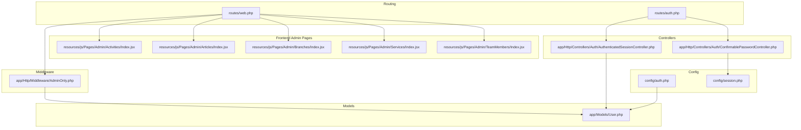
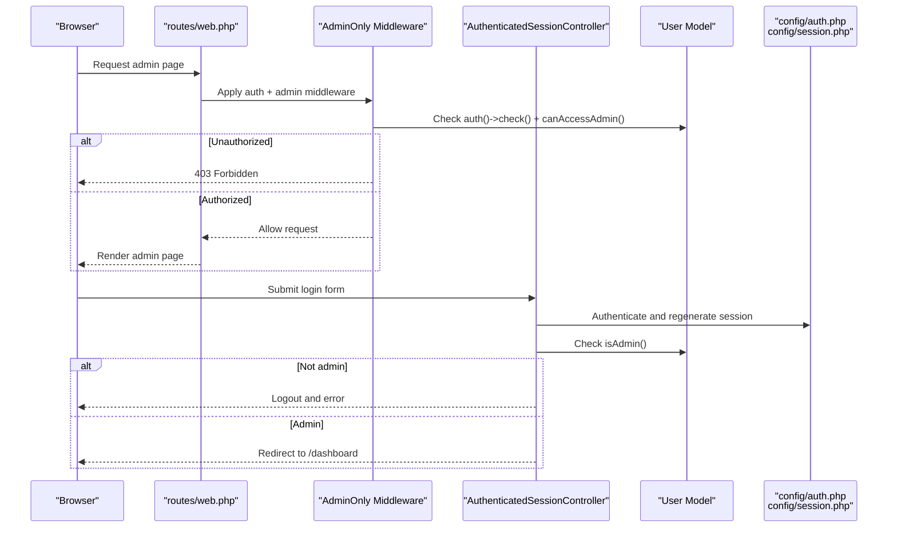
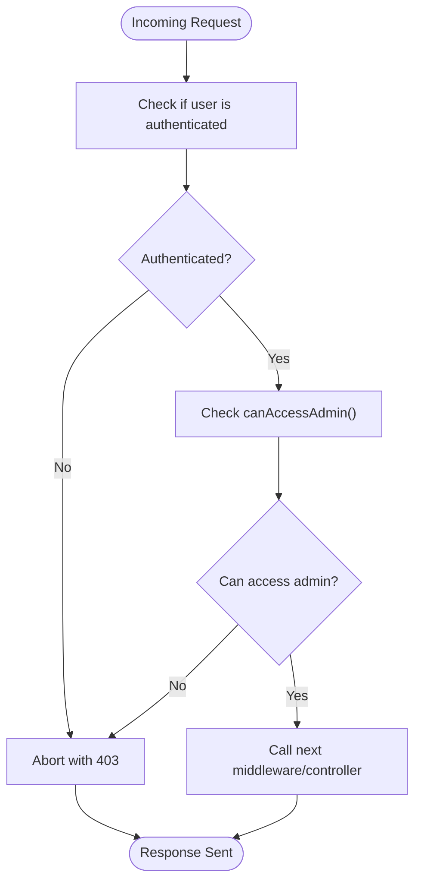
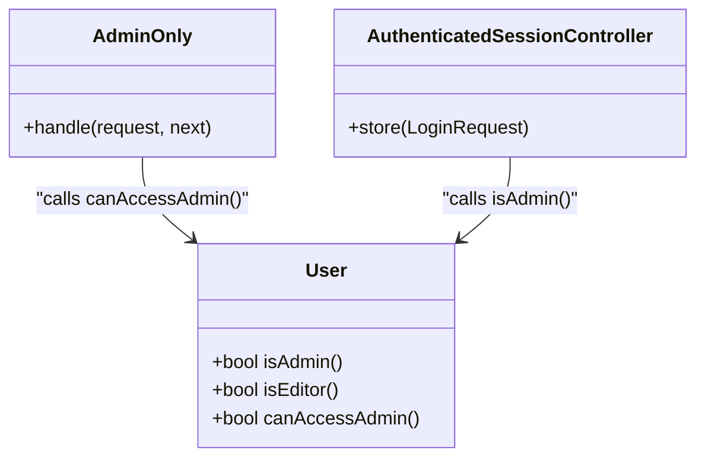
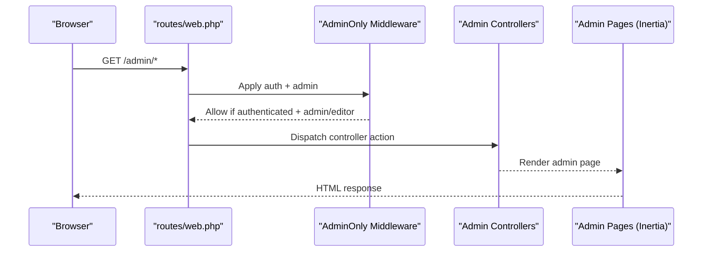
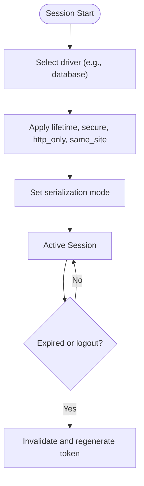
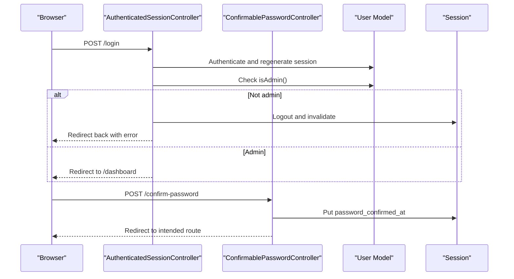
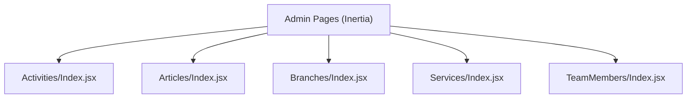
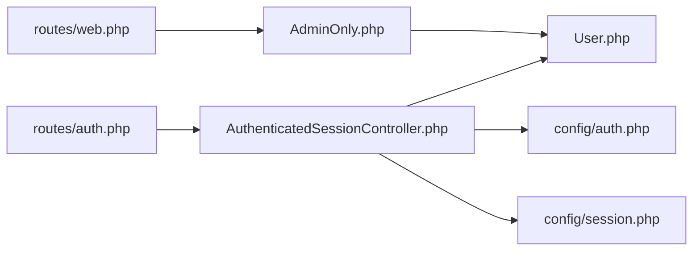

# Admin Access Control

<cite>
**Referenced Files in This Document**
- [AdminOnly.php](file://app/Http/Middleware/AdminOnly.php)
- [User.php](file://app/Models/User.php)
- [auth.php](file://config/auth.php)
- [session.php](file://config/session.php)
- [web.php](file://routes/web.php)
- [AuthenticatedSessionController.php](file://app/Http/Controllers/Auth/AuthenticatedSessionController.php)
- [ConfirmablePasswordController.php](file://app/Http/Controllers/Auth/ConfirmablePasswordController.php)
- [auth.php](file://routes/auth.php)
- [Index.jsx (Activities)](file://resources/js/Pages/Admin/Activities/Index.jsx)
- [Index.jsx (Articles)](file://resources/js/Pages/Admin/Articles/Index.jsx)
- [Index.jsx (Branches)](file://resources/js/Pages/Admin/Branches/Index.jsx)
- [Index.jsx (Services)](file://resources/js/Pages/Admin/Services/Index.jsx)
- [Index.jsx (TeamMembers)](file://resources/js/Pages/Admin/TeamMembers/Index.jsx)
</cite>

## Table of Contents
1. [Introduction](#introduction)
2. [Project Structure](#project-structure)
3. [Core Components](#core-components)
4. [Architecture Overview](#architecture-overview)
5. [Detailed Component Analysis](#detailed-component-analysis)
6. [Dependency Analysis](#dependency-analysis)
7. [Performance Considerations](#performance-considerations)
8. [Troubleshooting Guide](#troubleshooting-guide)
9. [Conclusion](#conclusion)
10. [Appendices](#appendices)

## Introduction
This document explains the administrative access control and security measures implemented in the application. It covers the admin-only middleware, authorization patterns, user roles and permissions, authentication requirements for administrative functions, and session management. It also provides guidance on implementing custom access controls, role-based permissions, audit logging, security best practices, brute force protection, secure credential management, multi-factor authentication integration, and administrative session timeout policies.

## Project Structure
Administrative access control spans backend middleware and models, routing, controllers, and frontend pages. Administrative routes are grouped under a middleware stack that enforces authentication and admin/editor privileges. The frontend admin pages are rendered via Inertia and require authenticated admin access.

**Diagram sources**
- [web.php:86-143](file://routes/web.php#L86-L143)
- [AdminOnly.php:16-23](file://app/Http/Middleware/AdminOnly.php#L16-L23)
- [AuthenticatedSessionController.php:28-42](file://app/Http/Controllers/Auth/AuthenticatedSessionController.php#L28-L42)
- [ConfirmablePasswordController.php:26-40](file://app/Http/Controllers/Auth/ConfirmablePasswordController.php#L26-L40)
- [User.php:32-45](file://app/Models/User.php#L32-L45)
- [auth.php:40-44](file://config/auth.php#L40-L44)
- [session.php:21-37](file://config/session.php#L21-L37)
- [Index.jsx (Activities):22-353](file://resources/js/Pages/Admin/Activities/Index.jsx#L22-L353)
- [Index.jsx (Articles):24-398](file://resources/js/Pages/Admin/Articles/Index.jsx#L24-L398)
- [Index.jsx (Branches):20-340](file://resources/js/Pages/Admin/Branches/Index.jsx#L20-L340)
- [Index.jsx (Services):94-135](file://resources/js/Pages/Admin/Services/Index.jsx#L94-L135)
- [Index.jsx (TeamMembers):23-374](file://resources/js/Pages/Admin/TeamMembers/Index.jsx#L23-L374)

**Section sources**
- [web.php:86-143](file://routes/web.php#L86-L143)
- [AdminOnly.php:16-23](file://app/Http/Middleware/AdminOnly.php#L16-L23)
- [AuthenticatedSessionController.php:28-42](file://app/Http/Controllers/Auth/AuthenticatedSessionController.php#L28-L42)
- [ConfirmablePasswordController.php:26-40](file://app/Http/Controllers/Auth/ConfirmablePasswordController.php#L26-L40)
- [User.php:32-45](file://app/Models/User.php#L32-L45)
- [auth.php:40-44](file://config/auth.php#L40-L44)
- [session.php:21-37](file://config/session.php#L21-L37)

## Core Components
- Admin-only middleware: Enforces that only authenticated users with admin/editor roles can access administrative routes.
- User model: Defines role checks and admin/editor capability helpers used by middleware and controllers.
- Authentication configuration: Defines guards, providers, password reset behavior, and password confirmation timeout.
- Session configuration: Controls driver, lifetime, cookie security flags, and serialization.
- Administrative routes: Grouped under auth and admin middleware to protect admin pages.
- Controllers: Handle login and password confirmation flows, enforcing role checks and session lifecycle.

Key implementation references:
- Admin-only check: [AdminOnly.php:18-20](file://app/Http/Middleware/AdminOnly.php#L18-L20)
- Role helpers: [User.php:32-45](file://app/Models/User.php#L32-L45)
- Auth guard/session: [auth.php:40-44](file://config/auth.php#L40-L44), [session.php:21-37](file://config/session.php#L21-L37)
- Admin route grouping: [web.php:86-143](file://routes/web.php#L86-L143)
- Login controller role enforcement: [AuthenticatedSessionController.php:35-41](file://app/Http/Controllers/Auth/AuthenticatedSessionController.php#L35-L41)
- Password confirmation controller: [ConfirmablePasswordController.php:26-40](file://app/Http/Controllers/Auth/ConfirmablePasswordController.php#L26-L40)

**Section sources**
- [AdminOnly.php:16-23](file://app/Http/Middleware/AdminOnly.php#L16-L23)
- [User.php:32-45](file://app/Models/User.php#L32-L45)
- [auth.php:40-44](file://config/auth.php#L40-L44)
- [session.php:21-37](file://config/session.php#L21-L37)
- [web.php:86-143](file://routes/web.php#L86-L143)
- [AuthenticatedSessionController.php:35-41](file://app/Http/Controllers/Auth/AuthenticatedSessionController.php#L35-L41)
- [ConfirmablePasswordController.php:26-40](file://app/Http/Controllers/Auth/ConfirmablePasswordController.php#L26-L40)

## Architecture Overview
The admin access control architecture combines middleware-driven authorization, model-level role checks, and controller-enforced login flows. Administrative routes are protected by a middleware stack that ensures both authentication and admin/editor privileges. Sessions are managed via the configured driver and security settings.

**Diagram sources**
- [web.php:86-143](file://routes/web.php#L86-L143)
- [AdminOnly.php:16-23](file://app/Http/Middleware/AdminOnly.php#L16-L23)
- [AuthenticatedSessionController.php:28-42](file://app/Http/Controllers/Auth/AuthenticatedSessionController.php#L28-L42)
- [User.php:42-45](file://app/Models/User.php#L42-L45)
- [auth.php:40-44](file://config/auth.php#L40-L44)
- [session.php:21-37](file://config/session.php#L21-L37)

## Detailed Component Analysis

### Admin-only Middleware
The middleware enforces that only authenticated users whose roles allow administrative access can proceed. It aborts unauthorized requests with a 403 response.

**Diagram sources**
- [AdminOnly.php:16-23](file://app/Http/Middleware/AdminOnly.php#L16-L23)
- [User.php:42-45](file://app/Models/User.php#L42-L45)

**Section sources**
- [AdminOnly.php:16-23](file://app/Http/Middleware/AdminOnly.php#L16-L23)
- [User.php:42-45](file://app/Models/User.php#L42-L45)

### User Role Management and Authorization Patterns
The User model exposes role-based helpers:
- isAdmin: True for admin role
- isEditor: True for editor role
- canAccessAdmin: True for admin or editor roles

These helpers are used by middleware and controllers to gate access.

**Diagram sources**
- [User.php:32-45](file://app/Models/User.php#L32-L45)
- [AdminOnly.php:16-23](file://app/Http/Middleware/AdminOnly.php#L16-L23)
- [AuthenticatedSessionController.php:35-41](file://app/Http/Controllers/Auth/AuthenticatedSessionController.php#L35-L41)

**Section sources**
- [User.php:32-45](file://app/Models/User.php#L32-L45)
- [AdminOnly.php:16-23](file://app/Http/Middleware/AdminOnly.php#L16-L23)
- [AuthenticatedSessionController.php:35-41](file://app/Http/Controllers/Auth/AuthenticatedSessionController.php#L35-L41)

### Authentication Requirements for Administrative Functions
Administrative functions require:
- Authentication via the web guard
- Admin/editor privilege via canAccessAdmin()

Administrative routes are grouped under auth and admin middleware, ensuring both conditions are met before rendering admin pages.

**Diagram sources**
- [web.php:86-143](file://routes/web.php#L86-L143)
- [AdminOnly.php:16-23](file://app/Http/Middleware/AdminOnly.php#L16-L23)

**Section sources**
- [web.php:86-143](file://routes/web.php#L86-L143)
- [AdminOnly.php:16-23](file://app/Http/Middleware/AdminOnly.php#L16-L23)

### Session Management
Session configuration controls:
- Driver selection (e.g., database)
- Lifetime and expiration behavior
- Cookie security flags (secure, http_only, same_site)
- Serialization mode

These settings influence session persistence and security for admin sessions.

**Diagram sources**
- [session.php:21-37](file://config/session.php#L21-L37)
- [session.php:172-185](file://config/session.php#L172-L185)
- [session.php:231](file://config/session.php#L231)

**Section sources**
- [session.php:21-37](file://config/session.php#L21-L37)
- [session.php:172-185](file://config/session.php#L172-L185)
- [session.php:231](file://config/session.php#L231)

### Login and Password Confirmation Flows
Login flow:
- Validates credentials and regenerates session
- Enforces admin-only access; non-admins are logged out with an error
- Redirects to dashboard upon successful admin login

Password confirmation flow:
- Confirms user’s current password and records confirmation timestamp in session

**Diagram sources**
- [AuthenticatedSessionController.php:28-42](file://app/Http/Controllers/Auth/AuthenticatedSessionController.php#L28-L42)
- [ConfirmablePasswordController.php:26-40](file://app/Http/Controllers/Auth/ConfirmablePasswordController.php#L26-L40)
- [User.php:32-35](file://app/Models/User.php#L32-L35)

**Section sources**
- [AuthenticatedSessionController.php:28-42](file://app/Http/Controllers/Auth/AuthenticatedSessionController.php#L28-L42)
- [ConfirmablePasswordController.php:26-40](file://app/Http/Controllers/Auth/ConfirmablePasswordController.php#L26-L40)
- [User.php:32-35](file://app/Models/User.php#L32-L35)

### Frontend Admin Pages
Admin pages are rendered via Inertia and require authenticated admin access. They provide CRUD interfaces for branches, team members, activities, articles, and service links.

**Diagram sources**
- [Index.jsx (Activities):22-353](file://resources/js/Pages/Admin/Activities/Index.jsx#L22-L353)
- [Index.jsx (Articles):24-398](file://resources/js/Pages/Admin/Articles/Index.jsx#L24-L398)
- [Index.jsx (Branches):20-340](file://resources/js/Pages/Admin/Branches/Index.jsx#L20-L340)
- [Index.jsx (Services):94-135](file://resources/js/Pages/Admin/Services/Index.jsx#L94-L135)
- [Index.jsx (TeamMembers):23-374](file://resources/js/Pages/Admin/TeamMembers/Index.jsx#L23-L374)

**Section sources**
- [Index.jsx (Activities):22-353](file://resources/js/Pages/Admin/Activities/Index.jsx#L22-L353)
- [Index.jsx (Articles):24-398](file://resources/js/Pages/Admin/Articles/Index.jsx#L24-L398)
- [Index.jsx (Branches):20-340](file://resources/js/Pages/Admin/Branches/Index.jsx#L20-L340)
- [Index.jsx (Services):94-135](file://resources/js/Pages/Admin/Services/Index.jsx#L94-L135)
- [Index.jsx (TeamMembers):23-374](file://resources/js/Pages/Admin/TeamMembers/Index.jsx#L23-L374)

## Dependency Analysis
The admin access control depends on:
- Middleware depending on model role helpers
- Controllers depending on model role checks and configuration
- Routing grouping applying middleware stacks
- Configuration defining guards and session behavior

**Diagram sources**
- [AdminOnly.php:16-23](file://app/Http/Middleware/AdminOnly.php#L16-L23)
- [User.php:32-45](file://app/Models/User.php#L32-L45)
- [AuthenticatedSessionController.php:28-42](file://app/Http/Controllers/Auth/AuthenticatedSessionController.php#L28-L42)
- [auth.php:40-44](file://config/auth.php#L40-L44)
- [session.php:21-37](file://config/session.php#L21-L37)
- [web.php:86-143](file://routes/web.php#L86-L143)
- [auth.php:13-43](file://routes/auth.php#L13-L43)

**Section sources**
- [AdminOnly.php:16-23](file://app/Http/Middleware/AdminOnly.php#L16-L23)
- [User.php:32-45](file://app/Models/User.php#L32-L45)
- [AuthenticatedSessionController.php:28-42](file://app/Http/Controllers/Auth/AuthenticatedSessionController.php#L28-L42)
- [auth.php:40-44](file://config/auth.php#L40-L44)
- [session.php:21-37](file://config/session.php#L21-L37)
- [web.php:86-143](file://routes/web.php#L86-L143)
- [auth.php:13-43](file://routes/auth.php#L13-L43)

## Performance Considerations
- Keep middleware checks lightweight; the admin check relies on simple role comparisons.
- Use database-backed sessions for scalability and centralized session invalidation.
- Minimize unnecessary session writes; only update session when required (e.g., password confirmation).
- Ensure admin pages fetch only necessary data to reduce payload sizes.

## Troubleshooting Guide
Common issues and resolutions:
- 403 Forbidden on admin routes: Verify the user is authenticated and has admin/editor role. Check middleware logic and model role helpers.
  - Reference: [AdminOnly.php:18-20](file://app/Http/Middleware/AdminOnly.php#L18-L20), [User.php:42-45](file://app/Models/User.php#L42-L45)
- Non-admin login blocked: Ensure only admin accounts attempt admin access. The login controller explicitly rejects non-admins.
  - Reference: [AuthenticatedSessionController.php:35-41](file://app/Http/Controllers/Auth/AuthenticatedSessionController.php#L35-L41)
- Session expiration or logout loops: Review session lifetime and cookie security settings.
  - Reference: [session.php:21-37](file://config/session.php#L21-L37), [session.php:172-185](file://config/session.php#L172-L185)
- Password confirmation failures: Confirm the user’s password matches and that the session stores the confirmation timestamp.
  - Reference: [ConfirmablePasswordController.php:26-40](file://app/Http/Controllers/Auth/ConfirmablePasswordController.php#L26-L40)

**Section sources**
- [AdminOnly.php:18-20](file://app/Http/Middleware/AdminOnly.php#L18-L20)
- [User.php:42-45](file://app/Models/User.php#L42-L45)
- [AuthenticatedSessionController.php:35-41](file://app/Http/Controllers/Auth/AuthenticatedSessionController.php#L35-L41)
- [session.php:21-37](file://config/session.php#L21-L37)
- [session.php:172-185](file://config/session.php#L172-L185)
- [ConfirmablePasswordController.php:26-40](file://app/Http/Controllers/Auth/ConfirmablePasswordController.php#L26-L40)

## Conclusion
The application implements a clear admin access control pattern: authentication via the web guard, role-based authorization via middleware and model helpers, and enforced session management. Administrative routes are protected by a layered middleware stack, while controllers enforce role checks during login and support password confirmation. The configuration files define the underlying authentication and session behavior. Extending the system with advanced security features (audit logging, brute force protection, MFA, and stricter timeouts) is straightforward and should be prioritized for production hardening.

## Appendices

### Implementing Custom Access Controls
- Add new role-based helpers in the User model for granular permissions.
- Extend middleware to delegate to a policy-like service for complex checks.
- Introduce route-model binding with explicit authorization gates.

References:
- [User.php:32-45](file://app/Models/User.php#L32-L45)
- [AdminOnly.php:16-23](file://app/Http/Middleware/AdminOnly.php#L16-L23)

### Role-Based Permissions and Access Level Hierarchies
- Define roles: admin, editor, staff.
- Use helper methods to check capabilities:
  - canAccessAdmin for admin/editor
  - Additional helpers for specific CRUD operations
- Gate routes per role using middleware groups or dedicated middleware.

References:
- [User.php:32-45](file://app/Models/User.php#L32-L45)
- [web.php:86-143](file://routes/web.php#L86-L143)

### Audit Logging
- Log admin actions (create/update/delete) with timestamps, actor, IP, and affected resource.
- Store logs in a dedicated table and expose a read-only admin view.

References:
- [Index.jsx (Activities):63-87](file://resources/js/Pages/Admin/Activities/Index.jsx#L63-L87)
- [Index.jsx (Articles):71-88](file://resources/js/Pages/Admin/Articles/Index.jsx#L71-L88)
- [Index.jsx (Branches):62-81](file://resources/js/Pages/Admin/Branches/Index.jsx#L62-L81)
- [Index.jsx (TeamMembers):71-107](file://resources/js/Pages/Admin/TeamMembers/Index.jsx#L71-L107)

### Security Best Practices
- Enforce HTTPS and secure cookies for admin sessions.
- Set strict SameSite and httpOnly flags.
- Limit session lifetime and enable expiration on close where appropriate.
- Rotate APP_KEY regularly and avoid storing secrets in client-side code.

References:
- [session.php:172-185](file://config/session.php#L172-L185)
- [session.php:37](file://config/session.php#L37)

### Brute Force Protection
- Rate-limit login attempts per IP/email.
- Lock accounts temporarily after repeated failures.
- Enforce CAPTCHA on login forms after threshold breaches.

[No sources needed since this section provides general guidance]

### Secure Credential Management
- Hash passwords using the framework’s built-in hashing.
- Store secrets in environment variables; never commit to version control.
- Use separate credentials for database and external services.

References:
- [User.php:25-31](file://app/Models/User.php#L25-L31)

### Multi-Factor Authentication Integration
- Add an MFA provider (TOTP/SMS/Email).
- Require MFA verification before granting admin access.
- Persist MFA status and recovery codes securely.

[No sources needed since this section provides general guidance]

### Administrative Session Timeout Policies
- Configure session lifetime and password confirmation timeout.
- Prompt users to re-authenticate for sensitive actions.
- Invalidate sessions on logout and regenerate tokens.

References:
- [session.php:35](file://config/session.php#L35)
- [auth.php:115](file://config/auth.php#L115)
- [AuthenticatedSessionController.php:48-57](file://app/Http/Controllers/Auth/AuthenticatedSessionController.php#L48-L57)