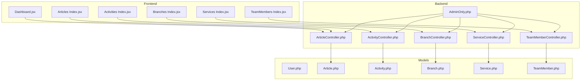
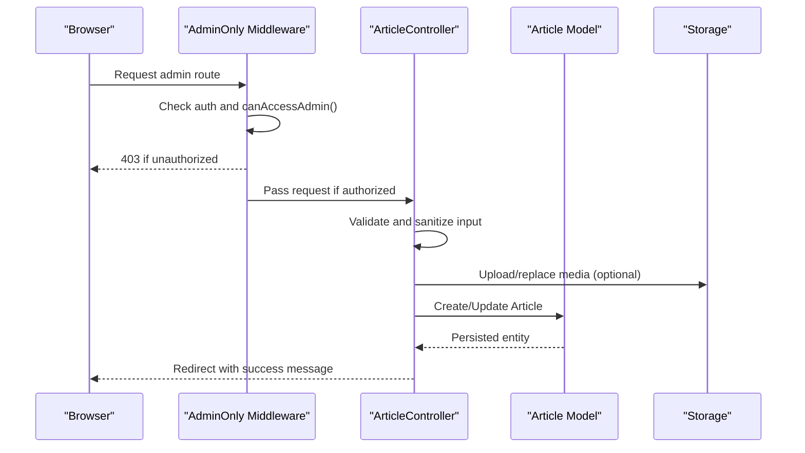
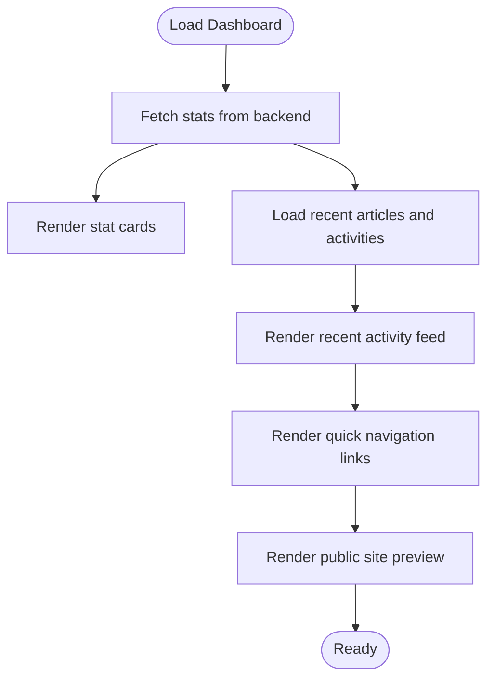
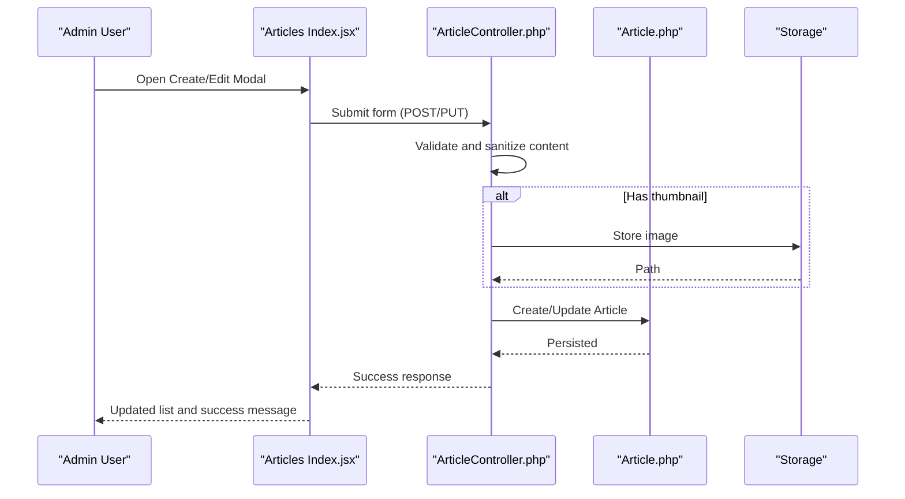
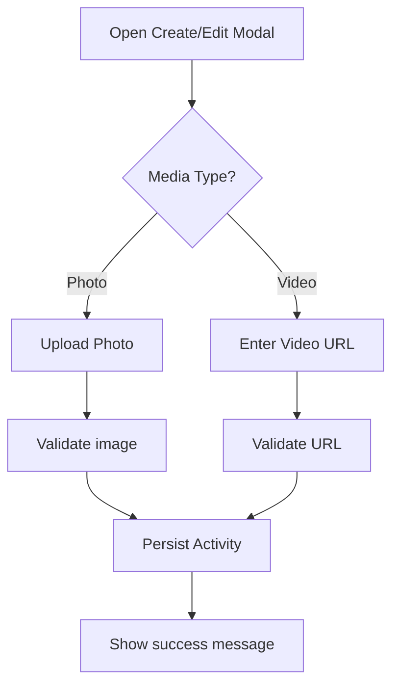
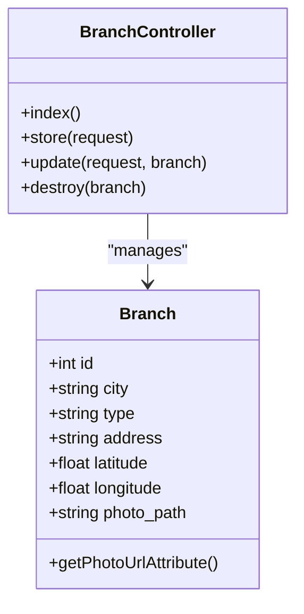
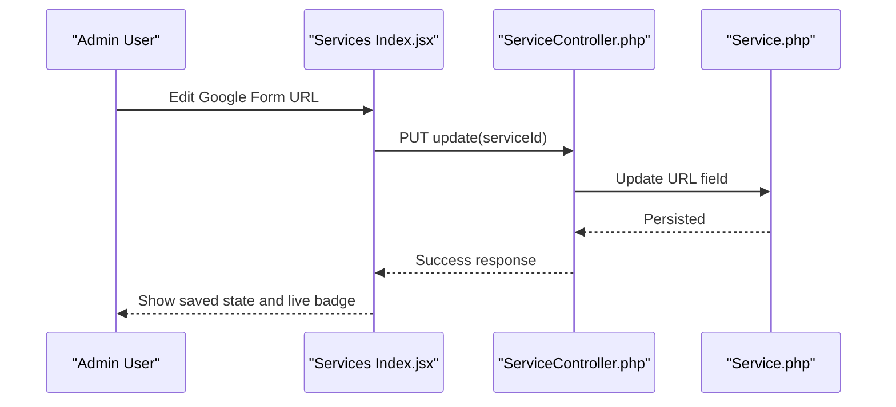
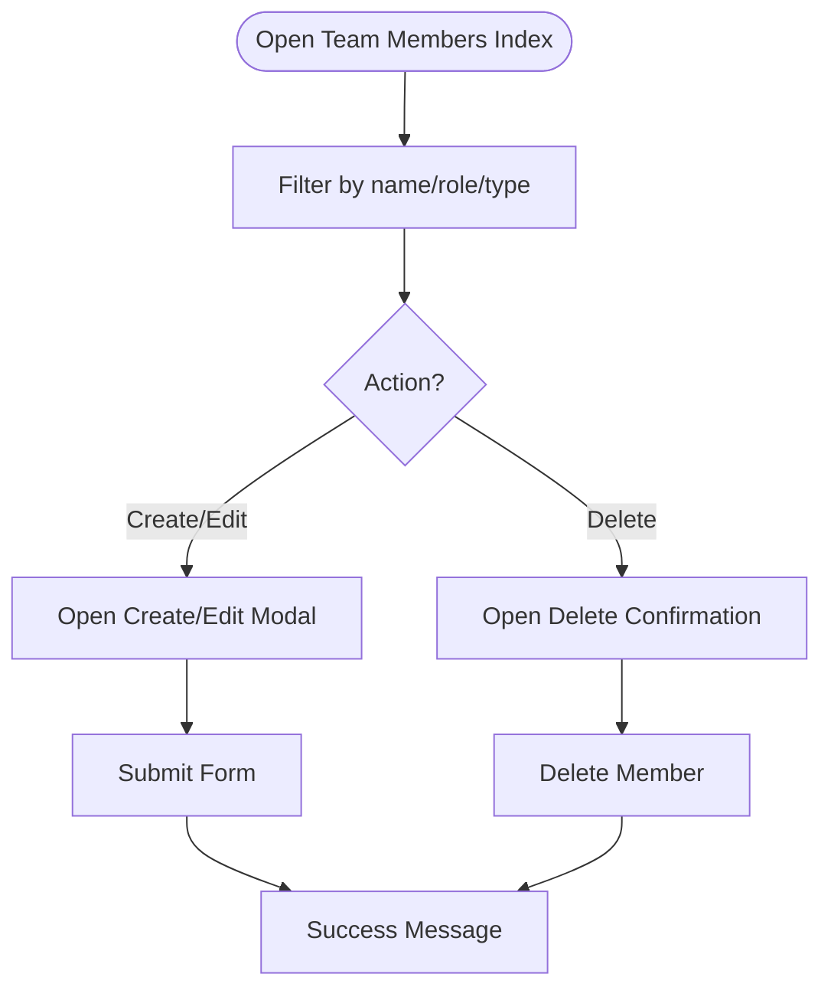
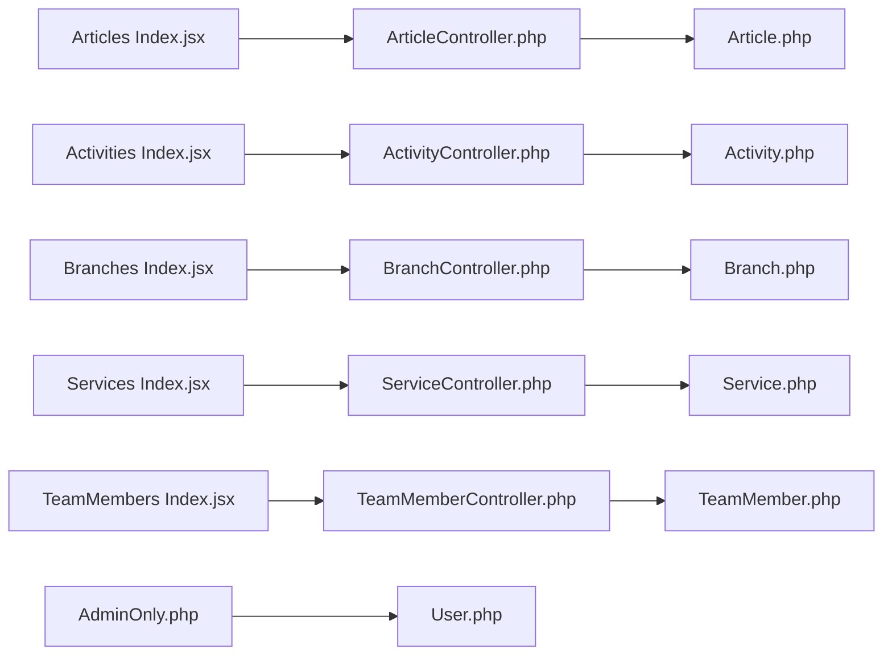

# Administrative Interface

<cite>
**Referenced Files in This Document**
- [AdminOnly.php](file://app/Http/Middleware/AdminOnly.php)
- [Dashboard.jsx](file://resources/js/Pages/Dashboard.jsx)
- [Articles Index.jsx](file://resources/js/Pages/Admin/Articles/Index.jsx)
- [Activities Index.jsx](file://resources/js/Pages/Admin/Activities/Index.jsx)
- [Branches Index.jsx](file://resources/js/Pages/Admin/Branches/Index.jsx)
- [Services Index.jsx](file://resources/js/Pages/Admin/Services/Index.jsx)
- [TeamMembers Index.jsx](file://resources/js/Pages/Admin/TeamMembers/Index.jsx)
- [ArticleController.php](file://app/Http/Controllers/ArticleController.php)
- [ActivityController.php](file://app/Http/Controllers/ActivityController.php)
- [BranchController.php](file://app/Http/Controllers/BranchController.php)
- [ServiceController.php](file://app/Http/Controllers/ServiceController.php)
- [TeamMemberController.php](file://app/Http/Controllers/TeamMemberController.php)
- [User.php](file://app/Models/User.php)
- [Article.php](file://app/Models/Article.php)
- [Activity.php](file://app/Models/Activity.php)
- [Branch.php](file://app/Models/Branch.php)
- [Service.php](file://app/Models/Service.php)
- [TeamMember.php](file://app/Models/TeamMember.php)
</cite>

## Table of Contents
1. [Introduction](#introduction)
2. [Project Structure](#project-structure)
3. [Core Components](#core-components)
4. [Architecture Overview](#architecture-overview)
5. [Detailed Component Analysis](#detailed-component-analysis)
6. [Dependency Analysis](#dependency-analysis)
7. [Performance Considerations](#performance-considerations)
8. [Troubleshooting Guide](#troubleshooting-guide)
9. [Security Considerations](#security-considerations)
10. [Practical Administrative Tasks](#practical-administrative-tasks)
11. [Extending Administrative Functionality](#extending-administrative-functionality)
12. [Conclusion](#conclusion)

## Introduction
This document describes the administrative interface for the EDUfa platform, focusing on the EDUfa dashboard and content management capabilities. It explains dashboard analytics, user statistics, and system overview, documents content management workflows for articles, activities, and service updates, details user role management with administrator privileges and access controls, explains system configuration options, and outlines admin-only middleware protection and authorization patterns. Practical examples demonstrate administrative tasks, while security considerations and audit trail guidance are included alongside guidelines for extending administrative functionality.

## Project Structure
The administrative interface is organized around:
- Frontend pages under resources/js/Pages/Admin/ covering dashboard, articles, activities, branches, services, and team members
- Backend controllers in app/Http/Controllers managing CRUD operations and authorization
- Models in app/Models representing domain entities
- Middleware in app/Http/Middleware protecting admin routes

**Diagram sources**
- [Dashboard.jsx:1-215](file://resources/js/Pages/Dashboard.jsx#L1-L215)
- [Articles Index.jsx:1-398](file://resources/js/Pages/Admin/Articles/Index.jsx#L1-L398)
- [Activities Index.jsx:1-353](file://resources/js/Pages/Admin/Activities/Index.jsx#L1-L353)
- [Branches Index.jsx:1-340](file://resources/js/Pages/Admin/Branches/Index.jsx#L1-L340)
- [Services Index.jsx:1-135](file://resources/js/Pages/Admin/Services/Index.jsx#L1-L135)
- [TeamMembers Index.jsx:1-374](file://resources/js/Pages/Admin/TeamMembers/Index.jsx#L1-L374)
- [ArticleController.php:1-122](file://app/Http/Controllers/ArticleController.php#L1-L122)
- [ActivityController.php:1-107](file://app/Http/Controllers/ActivityController.php#L1-L107)
- [BranchController.php:1-88](file://app/Http/Controllers/BranchController.php#L1-L88)
- [ServiceController.php:1-31](file://app/Http/Controllers/ServiceController.php#L1-L31)
- [TeamMemberController.php:1-72](file://app/Http/Controllers/TeamMemberController.php#L1-L72)
- [AdminOnly.php:1-25](file://app/Http/Middleware/AdminOnly.php#L1-L25)
- [User.php:1-47](file://app/Models/User.php#L1-L47)
- [Article.php:1-28](file://app/Models/Article.php#L1-L28)
- [Activity.php:1-11](file://app/Models/Activity.php#L1-L11)
- [Branch.php:1-36](file://app/Models/Branch.php#L1-L36)
- [Service.php:1-15](file://app/Models/Service.php#L1-L15)
- [TeamMember.php:1-24](file://app/Models/TeamMember.php#L1-L24)

**Section sources**
- [Dashboard.jsx:1-215](file://resources/js/Pages/Dashboard.jsx#L1-L215)
- [AdminOnly.php:1-25](file://app/Http/Middleware/AdminOnly.php#L1-L25)

## Core Components
- Admin-only middleware enforces access control for administrative routes
- Dashboard page aggregates system overview and quick navigation
- Content management pages for articles, activities, branches, services, and team members
- Backend controllers validate, sanitize, persist, and manage media assets
- Domain models define fillable attributes and computed presentation helpers

Key capabilities:
- Analytics and statistics cards on the dashboard
- Content creation, editing, and deletion workflows
- Media upload handling for images and videos
- Role-based access control for admin/editor users

**Section sources**
- [AdminOnly.php:16-23](file://app/Http/Middleware/AdminOnly.php#L16-L23)
- [Dashboard.jsx:18-71](file://resources/js/Pages/Dashboard.jsx#L18-L71)
- [Articles Index.jsx:34-88](file://resources/js/Pages/Admin/Articles/Index.jsx#L34-L88)
- [Activities Index.jsx:32-81](file://resources/js/Pages/Admin/Activities/Index.jsx#L32-L81)
- [Branches Index.jsx:30-81](file://resources/js/Pages/Admin/Branches/Index.jsx#L30-L81)
- [Services Index.jsx:9-135](file://resources/js/Pages/Admin/Services/Index.jsx#L9-L135)
- [TeamMembers Index.jsx:35-107](file://resources/js/Pages/Admin/TeamMembers/Index.jsx#L35-L107)

## Architecture Overview
The admin interface follows a layered pattern:
- Presentation layer: Inertia-based React pages render admin UI
- Controller layer: Laravel controllers orchestrate requests, validation, and persistence
- Model layer: Eloquent models encapsulate entity logic and relationships
- Middleware layer: Admin-only protection ensures only authorized users access admin routes

**Diagram sources**
- [AdminOnly.php:16-23](file://app/Http/Middleware/AdminOnly.php#L16-L23)
- [ArticleController.php:26-64](file://app/Http/Controllers/ArticleController.php#L26-L64)
- [Article.php:9-26](file://app/Models/Article.php#L9-L26)

**Section sources**
- [AdminOnly.php:16-23](file://app/Http/Middleware/AdminOnly.php#L16-L23)
- [ArticleController.php:26-64](file://app/Http/Controllers/ArticleController.php#L26-L64)
- [Article.php:9-26](file://app/Models/Article.php#L9-L26)

## Detailed Component Analysis

### Dashboard
The dashboard aggregates:
- Statistics cards for branches, team members, articles, and activities
- Recent activity feed combining articles and activities
- Quick navigation to management sections
- Public site preview link

**Diagram sources**
- [Dashboard.jsx:5-215](file://resources/js/Pages/Dashboard.jsx#L5-L215)

**Section sources**
- [Dashboard.jsx:5-215](file://resources/js/Pages/Dashboard.jsx#L5-L215)

### Articles Management
The articles management page supports:
- Listing with search/filter by title/category
- Create/edit modal with rich text editor
- Expert voice customization
- Thumbnail upload with preview
- Status selection (draft/published)
- Delete confirmation

**Diagram sources**
- [Articles Index.jsx:71-88](file://resources/js/Pages/Admin/Articles/Index.jsx#L71-L88)
- [ArticleController.php:26-108](file://app/Http/Controllers/ArticleController.php#L26-L108)
- [Article.php:9-26](file://app/Models/Article.php#L9-L26)

**Section sources**
- [Articles Index.jsx:24-88](file://resources/js/Pages/Admin/Articles/Index.jsx#L24-L88)
- [ArticleController.php:26-108](file://app/Http/Controllers/ArticleController.php#L26-L108)
- [Article.php:9-26](file://app/Models/Article.php#L9-L26)

### Activities Management
The activities management page supports:
- Listing with search/filter by title/type
- Create/edit modal with media type toggle (photo/video)
- Photo upload with preview or YouTube/GDrive URL
- Type selection (therapy/class activity)
- Delete confirmation

**Diagram sources**
- [Activities Index.jsx:42-81](file://resources/js/Pages/Admin/Activities/Index.jsx#L42-L81)
- [ActivityController.php:25-93](file://app/Http/Controllers/ActivityController.php#L25-L93)
- [Activity.php:9-10](file://app/Models/Activity.php#L9-L10)

**Section sources**
- [Activities Index.jsx:22-81](file://resources/js/Pages/Admin/Activities/Index.jsx#L22-L81)
- [ActivityController.php:25-93](file://app/Http/Controllers/ActivityController.php#L25-L93)
- [Activity.php:9-10](file://app/Models/Activity.php#L9-L10)

### Branches Management
The branches management page supports:
- Listing with search/filter by city/address
- Create/edit modal with coordinates and photo upload
- Type designation and address details
- Delete confirmation

**Diagram sources**
- [Branches Index.jsx:30-81](file://resources/js/Pages/Admin/Branches/Index.jsx#L30-L81)
- [BranchController.php:17-86](file://app/Http/Controllers/BranchController.php#L17-L86)
- [Branch.php:12-35](file://app/Models/Branch.php#L12-L35)

**Section sources**
- [Branches Index.jsx:20-81](file://resources/js/Pages/Admin/Branches/Index.jsx#L20-L81)
- [BranchController.php:17-86](file://app/Http/Controllers/BranchController.php#L17-L86)
- [Branch.php:12-35](file://app/Models/Branch.php#L12-L35)

### Services Configuration
The services configuration page allows updating Google Form URLs for each service:
- Live status indicator based on URL presence
- Inline edit with save and preview actions

**Diagram sources**
- [Services Index.jsx:9-92](file://resources/js/Pages/Admin/Services/Index.jsx#L9-L92)
- [ServiceController.php:18-29](file://app/Http/Controllers/ServiceController.php#L18-L29)
- [Service.php:9-14](file://app/Models/Service.php#L9-L14)

**Section sources**
- [Services Index.jsx:94-135](file://resources/js/Pages/Admin/Services/Index.jsx#L94-L135)
- [ServiceController.php:18-29](file://app/Http/Controllers/ServiceController.php#L18-L29)
- [Service.php:9-14](file://app/Models/Service.php#L9-L14)

### Team Members Management
The team members management page supports:
- Listing with search/filter by name/role/type
- Create/edit modal with photo upload and role description
- Type selection (therapist/staff)
- Delete confirmation with confirmation modal

**Diagram sources**
- [TeamMembers Index.jsx:23-107](file://resources/js/Pages/Admin/TeamMembers/Index.jsx#L23-L107)
- [TeamMemberController.php:20-70](file://app/Http/Controllers/TeamMemberController.php#L20-L70)
- [TeamMember.php:9-23](file://app/Models/TeamMember.php#L9-L23)

**Section sources**
- [TeamMembers Index.jsx:23-107](file://resources/js/Pages/Admin/TeamMembers/Index.jsx#L23-L107)
- [TeamMemberController.php:20-70](file://app/Http/Controllers/TeamMemberController.php#L20-L70)
- [TeamMember.php:9-23](file://app/Models/TeamMember.php#L9-L23)

## Dependency Analysis
The admin interface exhibits clear separation of concerns:
- Controllers depend on models and storage for persistence
- Views depend on controllers for data and on forms/validation for submissions
- Middleware depends on the User model for authorization checks
- Models encapsulate fillable attributes and computed presentation fields

**Diagram sources**
- [Articles Index.jsx:1-398](file://resources/js/Pages/Admin/Articles/Index.jsx#L1-L398)
- [Activities Index.jsx:1-353](file://resources/js/Pages/Admin/Activities/Index.jsx#L1-L353)
- [Branches Index.jsx:1-340](file://resources/js/Pages/Admin/Branches/Index.jsx#L1-L340)
- [Services Index.jsx:1-135](file://resources/js/Pages/Admin/Services/Index.jsx#L1-L135)
- [TeamMembers Index.jsx:1-374](file://resources/js/Pages/Admin/TeamMembers/Index.jsx#L1-L374)
- [ArticleController.php:1-122](file://app/Http/Controllers/ArticleController.php#L1-L122)
- [ActivityController.php:1-107](file://app/Http/Controllers/ActivityController.php#L1-L107)
- [BranchController.php:1-88](file://app/Http/Controllers/BranchController.php#L1-L88)
- [ServiceController.php:1-31](file://app/Http/Controllers/ServiceController.php#L1-L31)
- [TeamMemberController.php:1-72](file://app/Http/Controllers/TeamMemberController.php#L1-L72)
- [AdminOnly.php:1-25](file://app/Http/Middleware/AdminOnly.php#L1-L25)
- [User.php:1-47](file://app/Models/User.php#L1-L47)
- [Article.php:1-28](file://app/Models/Article.php#L1-L28)
- [Activity.php:1-11](file://app/Models/Activity.php#L1-L11)
- [Branch.php:1-36](file://app/Models/Branch.php#L1-L36)
- [Service.php:1-15](file://app/Models/Service.php#L1-L15)
- [TeamMember.php:1-24](file://app/Models/TeamMember.php#L1-L24)

**Section sources**
- [AdminOnly.php:16-23](file://app/Http/Middleware/AdminOnly.php#L16-L23)
- [User.php:32-45](file://app/Models/User.php#L32-L45)

## Performance Considerations
- Optimize frontend rendering by limiting initial dataset sizes and implementing virtualized lists for large datasets
- Minimize media file sizes for thumbnails/photos to reduce bandwidth and improve load times
- Use pagination or infinite scroll for content lists to avoid heavy DOM rendering
- Cache frequently accessed dashboard metrics on the backend to reduce database queries
- Compress images and leverage browser caching for static assets

## Troubleshooting Guide
Common issues and resolutions:
- Unauthorized access attempts: Ensure the admin-only middleware is applied to all admin routes; verify user roles and permissions
- Validation failures on content submission: Check field constraints and file type/mime size limits; review error messages returned by forms
- Media upload problems: Confirm storage disk permissions and available disk space; verify accepted image formats and sizes
- Asset URL resolution: Use computed attributes on models to normalize storage URLs; handle external URLs appropriately
- CSRF/XSRF protection: Ensure forms are submitted via Inertia with proper route helpers and method spoofing for PUT/DELETE

**Section sources**
- [AdminOnly.php:16-23](file://app/Http/Middleware/AdminOnly.php#L16-L23)
- [ArticleController.php:28-38](file://app/Http/Controllers/ArticleController.php#L28-L38)
- [ActivityController.php:27-34](file://app/Http/Controllers/ActivityController.php#L27-L34)
- [Branch.php:23-34](file://app/Models/Branch.php#L23-L34)
- [TeamMember.php:19-22](file://app/Models/TeamMember.php#L19-L22)

## Security Considerations
- Access control: Admin-only middleware checks authentication and role-based access (admin/editor); ensure routes are guarded
- Input sanitization: Controllers sanitize HTML content to prevent XSS; validate and restrict file uploads
- File handling: Validate media types and sizes; delete old files during updates; avoid storing sensitive metadata
- Audit trails: Track administrative actions (create/update/delete) with timestamps and user identifiers; log significant changes
- Session security: Enforce secure session cookies, logout policies, and idle timeouts
- CORS and CSRF: Configure appropriate headers and tokens for cross-origin requests and form submissions

**Section sources**
- [AdminOnly.php:16-23](file://app/Http/Middleware/AdminOnly.php#L16-L23)
- [ArticleController.php:40-47](file://app/Http/Controllers/ArticleController.php#L40-L47)
- [ActivityController.php:36-41](file://app/Http/Controllers/ActivityController.php#L36-L41)
- [BranchController.php:38-40](file://app/Http/Controllers/BranchController.php#L38-L40)
- [TeamMemberController.php:30-32](file://app/Http/Controllers/TeamMemberController.php#L30-L32)

## Practical Administrative Tasks
Examples of typical administrative tasks:
- Creating a new article:
  - Navigate to the articles management page
  - Click "Write Article" and fill in title, category, content, and optional expert voice fields
  - Select status (draft or published) and upload thumbnail if desired
  - Submit to create the article
- Managing activities:
  - Add a new activity with title, type (therapy/class), and media (photo or video URL)
  - Edit existing activities to update descriptions or change media
  - Delete activities after confirming removal
- Updating branch information:
  - Add or edit branches with city, type, address, coordinates, and photo
  - Ensure photos are properly sized and formatted
- Configuring service registration links:
  - Update Google Form URLs for each service and verify live status indicators
- Managing team members:
  - Add or edit team members with name, type (therapist/staff), role, description, and photo
  - Use confirmation modals for destructive actions

**Section sources**
- [Articles Index.jsx:47-88](file://resources/js/Pages/Admin/Articles/Index.jsx#L47-L88)
- [Activities Index.jsx:42-81](file://resources/js/Pages/Admin/Activities/Index.jsx#L42-L81)
- [Branches Index.jsx:41-81](file://resources/js/Pages/Admin/Branches/Index.jsx#L41-L81)
- [Services Index.jsx:94-135](file://resources/js/Pages/Admin/Services/Index.jsx#L94-L135)
- [TeamMembers Index.jsx:44-107](file://resources/js/Pages/Admin/TeamMembers/Index.jsx#L44-L107)

## Extending Administrative Functionality
Guidelines for adding new management features:
- Define a new model with fillable attributes and any computed fields
- Create a controller with index/store/update/destroy actions and robust validation
- Build a new frontend page under resources/js/Pages/Admin/<Feature>/Index.jsx with search, filtering, and modal forms
- Integrate with the admin-only middleware for route protection
- Add navigation links in the dashboard or relevant management pages
- Implement media handling for uploads and previews
- Ensure consistent error handling and success messaging
- Add audit logging for significant administrative actions

Example extension points:
- New content types: Follow the pattern established by articles and activities
- Settings/configuration: Follow the services configuration model for inline editing
- User management: Extend the User model and create dedicated management pages

**Section sources**
- [Article.php:9-26](file://app/Models/Article.php#L9-L26)
- [Activity.php:9-10](file://app/Models/Activity.php#L9-L10)
- [Service.php:9-14](file://app/Models/Service.php#L9-L14)
- [User.php:13-45](file://app/Models/User.php#L13-L45)

## Conclusion
The EDUfa administrative interface provides a comprehensive, role-protected environment for managing content, teams, branches, and services. Its modular design, strong middleware protection, and consistent validation patterns enable efficient administration while maintaining security and performance. By following the documented workflows and extension guidelines, administrators can confidently perform daily tasks and extend functionality as organizational needs evolve.