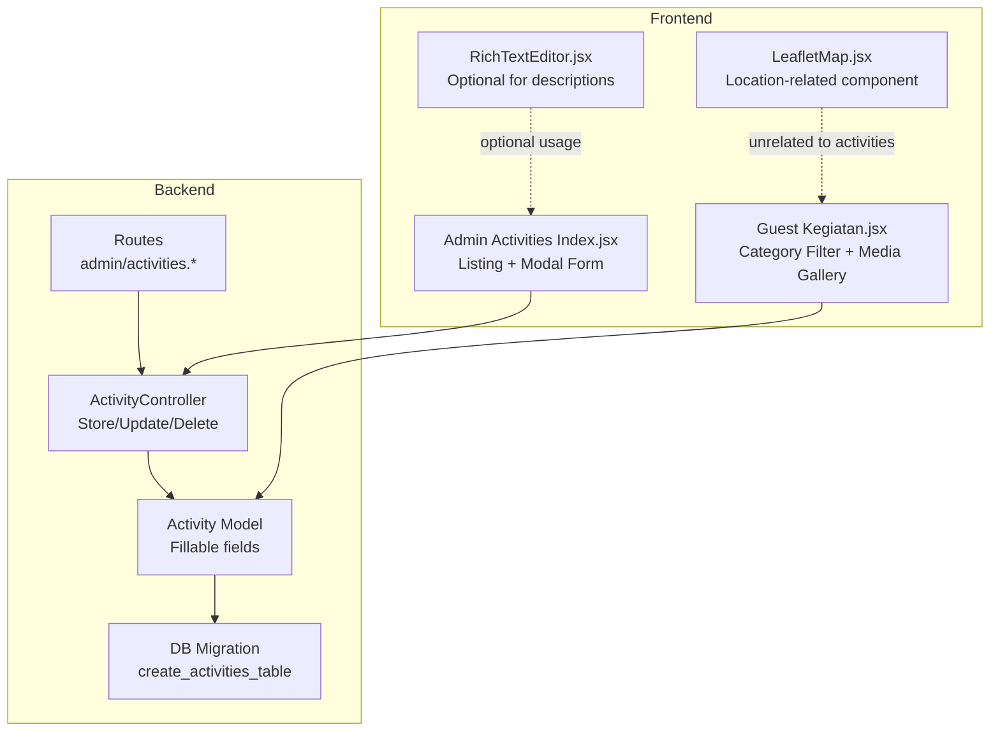
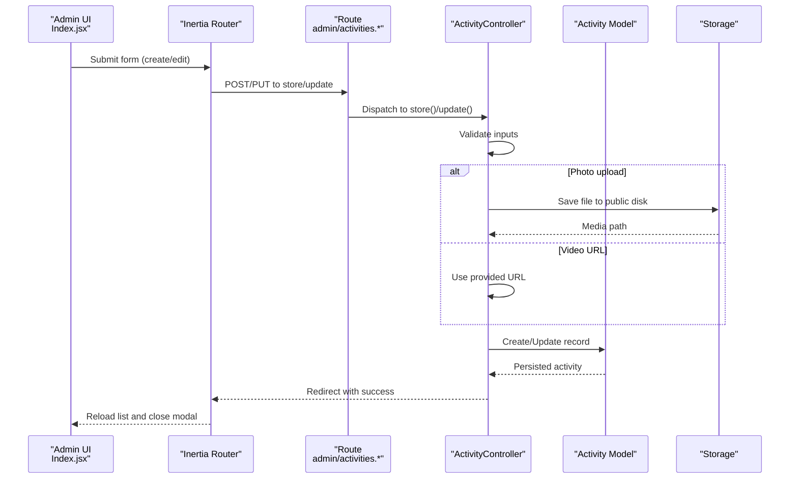
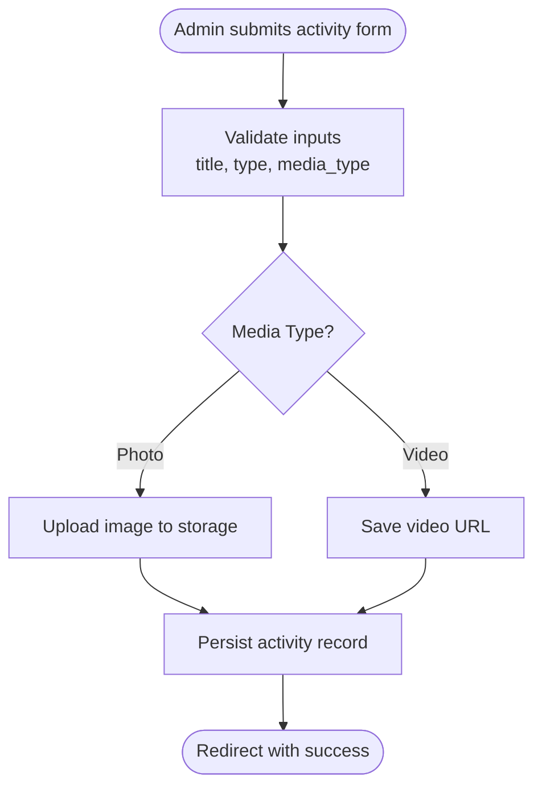
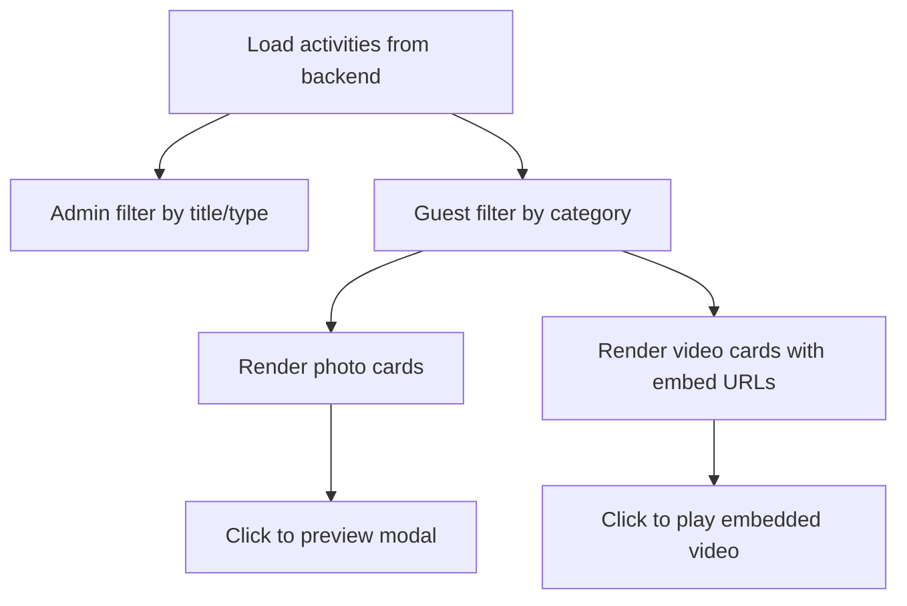
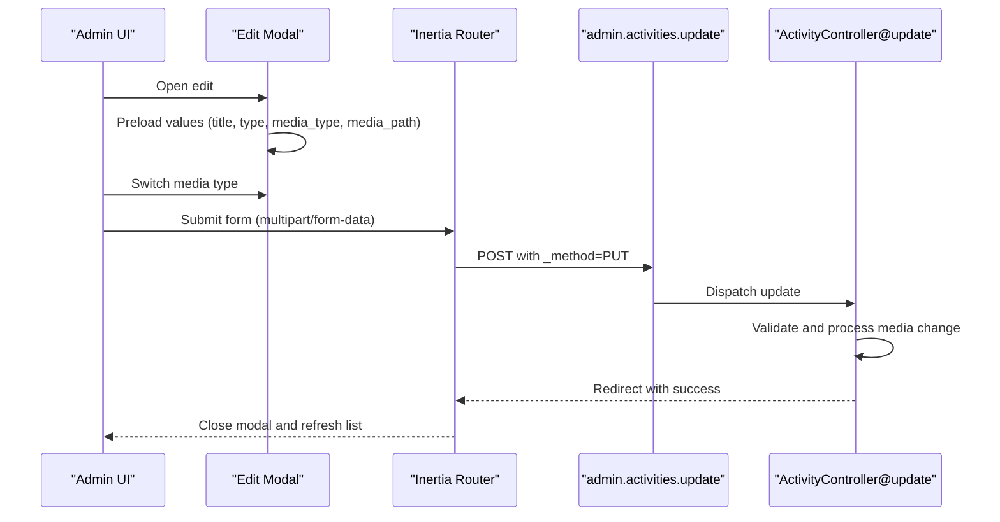
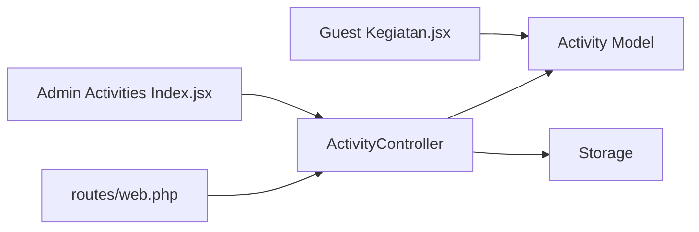
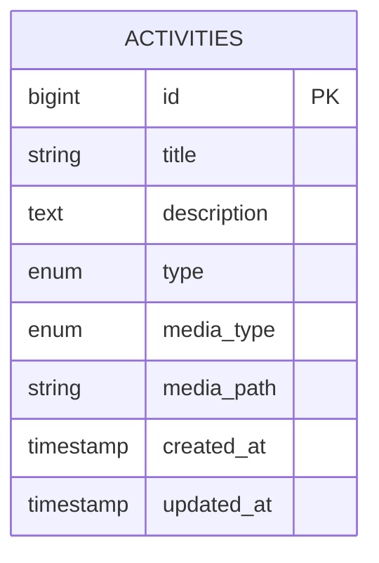

# Activity Management

<cite>
**Referenced Files in This Document**
- [ActivityController.php](file://app/Http/Controllers/ActivityController.php)
- [Activity.php](file://app/Models/Activity.php)
- [create_activities_table.php](file://database/migrations/2026_04_30_045526_create_activities_table.php)
- [Index.jsx (Admin Activities)](file://resources/js/Pages/Admin/Activities/Index.jsx)
- [Kegiatan.jsx (Guest Activities)](file://resources/js/Pages/Guest/Kegiatan.jsx)
- [web.php](file://routes/web.php)
- [LeafletMap.jsx](file://resources/js/Components/ui/LeafletMap.jsx)
- [RichTextEditor.jsx](file://resources/js/Components/RichTextEditor.jsx)
- [Dashboard.jsx](file://resources/js/Pages/Dashboard.jsx)
</cite>

## Table of Contents
1. [Introduction](#introduction)
2. [Project Structure](#project-structure)
3. [Core Components](#core-components)
4. [Architecture Overview](#architecture-overview)
5. [Detailed Component Analysis](#detailed-component-analysis)
6. [Dependency Analysis](#dependency-analysis)
7. [Performance Considerations](#performance-considerations)
8. [Troubleshooting Guide](#troubleshooting-guide)
9. [Conclusion](#conclusion)
10. [Appendices](#appendices)

## Introduction
This document describes the activity management system for the EduFA platform. It focuses on how activities are created, scheduled, listed, filtered, edited, and presented to users. It also covers media handling (photos and videos), categorization, and presentation on both admin and guest-facing pages. Where applicable, it documents current capabilities and highlights areas for enhancement such as recurring events, reminders, calendar integration, registration management, attendance reporting, promotional content management, capacity/resource controls, and participant tracking.

## Project Structure
The activity management system spans backend Laravel controllers and models, database migrations, and frontend Inertia/React pages and components:
- Backend
  - Controller: handles CRUD operations for activities
  - Model: defines the activity entity and fillable attributes
  - Migration: creates the activities table with fields for title, description, type, media type, and media path
  - Routes: define admin endpoints for activity management
- Frontend
  - Admin page: listing, search, create/edit forms, and modal UI
  - Guest page: category-filtered gallery of photos and videos
  - Supporting components: rich text editor and map component

**Diagram sources**
- [ActivityController.php:10-107](file://app/Http/Controllers/ActivityController.php#L10-L107)
- [Activity.php:7-10](file://app/Models/Activity.php#L7-L10)
- [create_activities_table.php:14-22](file://database/migrations/2026_04_30_045526_create_activities_table.php#L14-L22)
- [web.php:124-132](file://routes/web.php#L124-L132)
- [Index.jsx (Admin Activities):22-188](file://resources/js/Pages/Admin/Activities/Index.jsx#L22-L188)
- [Kegiatan.jsx (Guest Activities):203-376](file://resources/js/Pages/Guest/Kegiatan.jsx#L203-L376)
- [RichTextEditor.jsx:101-131](file://resources/js/Components/RichTextEditor.jsx#L101-L131)
- [LeafletMap.jsx:36-78](file://resources/js/Components/ui/LeafletMap.jsx#L36-L78)

**Section sources**
- [ActivityController.php:10-107](file://app/Http/Controllers/ActivityController.php#L10-L107)
- [Activity.php:7-10](file://app/Models/Activity.php#L7-L10)
- [create_activities_table.php:14-22](file://database/migrations/2026_04_30_045526_create_activities_table.php#L14-L22)
- [web.php:124-132](file://routes/web.php#L124-L132)
- [Index.jsx (Admin Activities):22-188](file://resources/js/Pages/Admin/Activities/Index.jsx#L22-L188)
- [Kegiatan.jsx (Guest Activities):203-376](file://resources/js/Pages/Guest/Kegiatan.jsx#L203-L376)
- [RichTextEditor.jsx:101-131](file://resources/js/Components/RichTextEditor.jsx#L101-L131)
- [LeafletMap.jsx:36-78](file://resources/js/Components/ui/LeafletMap.jsx#L36-L78)

## Core Components
- ActivityController
  - Provides index, store, update, and destroy actions
  - Validates inputs and manages media uploads (photos) or stores video URLs
  - Uses Inertia for admin UI rendering
- Activity model
  - Defines fillable attributes for activity records
- Activities migration
  - Creates the activities table with fields for title, description, type, media_type, and media_path
- Admin Activities page
  - Lists activities, supports search by title/type, and opens a modal form for create/edit
  - Handles file upload via multipart/form-data and posts to controller endpoints
- Guest Activities page
  - Filters activities by category and renders photo/video galleries
  - Converts YouTube/GDrive links to embed URLs and thumbnails
- Routes
  - Declares admin resource routes for activities

Key implementation references:
- Controller actions and validations: [ActivityController.php:15-105](file://app/Http/Controllers/ActivityController.php#L15-L105)
- Model fillable fields: [Activity.php:9-9](file://app/Models/Activity.php#L9-L9)
- Migration schema: [create_activities_table.php:14-22](file://database/migrations/2026_04_30_045526_create_activities_table.php#L14-L22)
- Admin listing and modal form: [Index.jsx (Admin Activities):22-188](file://resources/js/Pages/Admin/Activities/Index.jsx#L22-L188)
- Guest gallery and embed logic: [Kegiatan.jsx (Guest Activities):203-376](file://resources/js/Pages/Guest/Kegiatan.jsx#L203-L376)
- Routes definition: [web.php:124-132](file://routes/web.php#L124-L132)

**Section sources**
- [ActivityController.php:15-105](file://app/Http/Controllers/ActivityController.php#L15-L105)
- [Activity.php:9-9](file://app/Models/Activity.php#L9-L9)
- [create_activities_table.php:14-22](file://database/migrations/2026_04_30_045526_create_activities_table.php#L14-L22)
- [Index.jsx (Admin Activities):22-188](file://resources/js/Pages/Admin/Activities/Index.jsx#L22-L188)
- [Kegiatan.jsx (Guest Activities):203-376](file://resources/js/Pages/Guest/Kegiatan.jsx#L203-L376)
- [web.php:124-132](file://routes/web.php#L124-L132)

## Architecture Overview
The system follows a classic MVC pattern with Inertia.js bridging the backend and frontend:
- Routes delegate to ActivityController resource actions
- Controller interacts with Activity model and storage
- Admin page renders lists and modals; Guest page renders galleries
- Media handling is either stored files (photos) or external URLs (videos)

**Diagram sources**
- [web.php:124-132](file://routes/web.php#L124-L132)
- [ActivityController.php:25-93](file://app/Http/Controllers/ActivityController.php#L25-L93)
- [Activity.php:7-10](file://app/Models/Activity.php#L7-L10)
- [Index.jsx (Admin Activities):63-81](file://resources/js/Pages/Admin/Activities/Index.jsx#L63-L81)

## Detailed Component Analysis

### Activity Creation and Scheduling Workflow
- Inputs validated include title, description, type (terapi/kelas), media type (photo/video), optional file or URL
- Photo handling stores files under the public disk and saves the path
- Video handling stores a URL and converts it to an embed URL on the guest page
- No built-in date/time or location fields exist in the current schema; scheduling and location are not implemented

**Diagram sources**
- [ActivityController.php:27-49](file://app/Http/Controllers/ActivityController.php#L27-L49)
- [create_activities_table.php:18-20](file://database/migrations/2026_04_30_045526_create_activities_table.php#L18-L20)
- [Index.jsx (Admin Activities):286-335](file://resources/js/Pages/Admin/Activities/Index.jsx#L286-L335)

**Section sources**
- [ActivityController.php:25-52](file://app/Http/Controllers/ActivityController.php#L25-L52)
- [create_activities_table.php:18-20](file://database/migrations/2026_04_30_045526_create_activities_table.php#L18-L20)
- [Index.jsx (Admin Activities):286-335](file://resources/js/Pages/Admin/Activities/Index.jsx#L286-L335)

### Activity Listing, Filtering, and Presentation
- Admin listing filters by title and type using client-side logic
- Guest gallery filters by category (terapi/kelas) and displays photos and videos
- Embed URLs are generated for YouTube and Google Drive links; thumbnails are derived from media paths

**Diagram sources**
- [Index.jsx (Admin Activities):27-30](file://resources/js/Pages/Admin/Activities/Index.jsx#L27-L30)
- [Kegiatan.jsx (Guest Activities):203-376](file://resources/js/Pages/Guest/Kegiatan.jsx#L203-L376)

**Section sources**
- [Index.jsx (Admin Activities):27-30](file://resources/js/Pages/Admin/Activities/Index.jsx#L27-L30)
- [Kegiatan.jsx (Guest Activities):203-376](file://resources/js/Pages/Guest/Kegiatan.jsx#L203-L376)

### Activity Editing Interface and Media Handling
- Edit modal preloads existing values and supports switching between photo and video modes
- Photo updates replace existing files; video updates replace the URL
- File uploads use multipart/form-data with a hidden method field for PUT emulation

**Diagram sources**
- [Index.jsx (Admin Activities):49-81](file://resources/js/Pages/Admin/Activities/Index.jsx#L49-L81)
- [ActivityController.php:57-93](file://app/Http/Controllers/ActivityController.php#L57-L93)

**Section sources**
- [Index.jsx (Admin Activities):49-81](file://resources/js/Pages/Admin/Activities/Index.jsx#L49-L81)
- [ActivityController.php:57-93](file://app/Http/Controllers/ActivityController.php#L57-L93)

### Recurring Events, Reminders, Calendar Integration, Registrations, Attendance Reports, Promotional Content, Capacity/Resource Management
- Current implementation does not include:
  - Recurring events
  - Reminder systems
  - Calendar integration
  - Registration management
  - Attendance reporting
  - Promotional content management
  - Capacity or resource allocation features
- These are identified as gaps requiring future enhancements

[No sources needed since this section summarizes absence of features]

### Location Assignment
- The activities table does not include a location field
- A map component exists for branches but is not integrated with activities

**Section sources**
- [create_activities_table.php:14-22](file://database/migrations/2026_04_30_045526_create_activities_table.php#L14-L22)
- [LeafletMap.jsx:36-78](file://resources/js/Components/ui/LeafletMap.jsx#L36-L78)

## Dependency Analysis
- Routes delegate to ActivityController resource actions
- Controller depends on Activity model and storage
- Admin page depends on controller endpoints and Inertia
- Guest page depends on Activity model data and embed/thumbnail helpers

**Diagram sources**
- [web.php:124-132](file://routes/web.php#L124-L132)
- [ActivityController.php:10-107](file://app/Http/Controllers/ActivityController.php#L10-L107)
- [Activity.php:7-10](file://app/Models/Activity.php#L7-L10)
- [Index.jsx (Admin Activities):22-188](file://resources/js/Pages/Admin/Activities/Index.jsx#L22-L188)
- [Kegiatan.jsx (Guest Activities):203-376](file://resources/js/Pages/Guest/Kegiatan.jsx#L203-L376)

**Section sources**
- [web.php:124-132](file://routes/web.php#L124-L132)
- [ActivityController.php:10-107](file://app/Http/Controllers/ActivityController.php#L10-L107)
- [Activity.php:7-10](file://app/Models/Activity.php#L7-L10)
- [Index.jsx (Admin Activities):22-188](file://resources/js/Pages/Admin/Activities/Index.jsx#L22-L188)
- [Kegiatan.jsx (Guest Activities):203-376](file://resources/js/Pages/Guest/Kegiatan.jsx#L203-L376)

## Performance Considerations
- Media storage
  - Photos are stored on the public disk; ensure appropriate disk configuration and CDN integration for scalability
- Embed generation
  - Converting YouTube/GDrive links to embed URLs occurs on the client; consider server-side caching for frequent access
- Pagination
  - Current listing loads all activities; consider adding pagination for large datasets
- Rendering
  - Large galleries can impact performance; lazy loading and virtualization could improve UX

[No sources needed since this section provides general guidance]

## Troubleshooting Guide
- Validation errors
  - Title and type are required; media type and associated fields are validated accordingly
  - Photo uploads require supported image formats and size limits
- Media replacement
  - Updating an activity replaces the previous media; ensure backups or versioning if needed
- Deleting activities
  - Photo media files are deleted upon activity removal

**Section sources**
- [ActivityController.php:27-34](file://app/Http/Controllers/ActivityController.php#L27-L34)
- [ActivityController.php:70-82](file://app/Http/Controllers/ActivityController.php#L70-L82)
- [ActivityController.php:100-104](file://app/Http/Controllers/ActivityController.php#L100-L104)

## Conclusion
The activity management system currently supports creating, editing, deleting, and displaying activities with photo or video media. It provides admin listing with client-side filtering and a guest gallery with category filtering and embed support. Future enhancements should address scheduling, recurring events, reminders, calendar integration, registration and attendance reporting, promotional content management, capacity/resource controls, and location assignment.

[No sources needed since this section summarizes without analyzing specific files]

## Appendices

### Data Model Overview

**Diagram sources**
- [create_activities_table.php:14-22](file://database/migrations/2026_04_30_045526_create_activities_table.php#L14-L22)

### API Endpoints (Admin)
- GET /admin/activities → index
- POST /admin/activities → store
- PUT|PATCH /admin/activities/{activity} → update
- DELETE /admin/activities/{activity} → destroy

**Section sources**
- [web.php:124-132](file://routes/web.php#L124-L132)

### Examples and Usage Patterns
- Creating a photo activity
  - Select media type “Photo”
  - Upload an image file
  - Fill title, type, and optional description
  - Submit via admin form
  - See persisted media path in the database
- Creating a video activity
  - Select media type “Video”
  - Paste a YouTube or Google Drive URL
  - Submit via admin form
  - Guest page converts URL to embed and thumbnail
- Editing an activity
  - Open edit modal, switch media type if needed
  - Replace photo or update URL
  - Submit to persist changes
- Viewing on guest page
  - Filter by category (terapi/kelas)
  - Click photo/video cards to preview or play

**Section sources**
- [Index.jsx (Admin Activities):286-335](file://resources/js/Pages/Admin/Activities/Index.jsx#L286-L335)
- [Kegiatan.jsx (Guest Activities):203-376](file://resources/js/Pages/Guest/Kegiatan.jsx#L203-L376)