# Article Management

<cite>
**Referenced Files in This Document**
- [ArticleController.php](file://app/Http/Controllers/ArticleController.php)
- [Article.php](file://app/Models/Article.php)
- [Index.jsx](file://resources/js/Pages/Admin/Articles/Index.jsx)
- [RichTextEditor.jsx](file://resources/js/Components/RichTextEditor.jsx)
- [create_articles_table.php](file://database/migrations/2026_04_30_050400_create_articles_table.php)
- [add_author_details_to_articles_table.php](file://database/migrations/2026_04_30_051304_add_author_details_to_articles_table.php)
- [DetailArtikel.jsx](file://resources/js/Pages/Guest/DetailArtikel.jsx)
- [SEO.jsx](file://resources/js/Components/SEO.jsx)
- [routes/web.php](file://routes/web.php)
- [GuestController.php](file://app/Http/Controllers/GuestController.php)
</cite>

## Table of Contents
1. [Introduction](#introduction)
2. [Project Structure](#project-structure)
3. [Core Components](#core-components)
4. [Architecture Overview](#architecture-overview)
5. [Detailed Component Analysis](#detailed-component-analysis)
6. [Dependency Analysis](#dependency-analysis)
7. [Performance Considerations](#performance-considerations)
8. [Troubleshooting Guide](#troubleshooting-guide)
9. [Conclusion](#conclusion)

## Introduction
This document describes the article management system for the EduFA platform. It covers the complete CRUD lifecycle for articles, including creation with a TipTap rich text editor, image uploads, metadata management, status control, and publication workflows. It also documents the admin listing interface with filtering and actions, public article presentation with SEO features, author attribution, and content moderation safeguards currently implemented in the codebase.

## Project Structure
The article management system spans backend Laravel controllers and models, frontend Inertia/React pages and components, and database migrations that define the article schema and author-related fields.

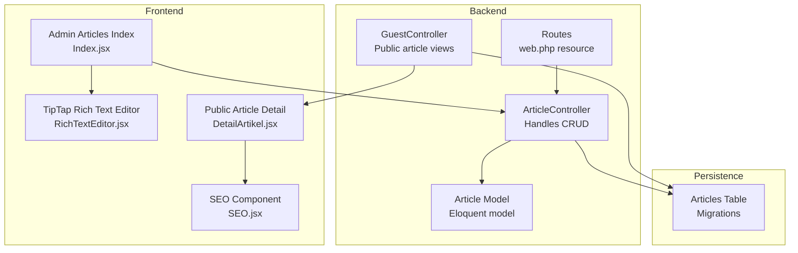

**Diagram sources**
- [ArticleController.php:11-121](file://app/Http/Controllers/ArticleController.php#L11-L121)
- [Article.php:7-27](file://app/Models/Article.php#L7-L27)
- [Index.jsx:24-397](file://resources/js/Pages/Admin/Articles/Index.jsx#L24-L397)
- [RichTextEditor.jsx:101-130](file://resources/js/Components/RichTextEditor.jsx#L101-L130)
- [DetailArtikel.jsx:154-329](file://resources/js/Pages/Guest/DetailArtikel.jsx#L154-L329)
- [SEO.jsx:3-238](file://resources/js/Components/SEO.jsx#L3-L238)
- [routes/web.php:134-142](file://routes/web.php#L134-L142)
- [GuestController.php:49-83](file://app/Http/Controllers/GuestController.php#L49-L83)
- [create_articles_table.php:14-24](file://database/migrations/2026_04_30_050400_create_articles_table.php#L14-L24)

**Section sources**
- [routes/web.php:134-142](file://routes/web.php#L134-L142)
- [ArticleController.php:11-121](file://app/Http/Controllers/ArticleController.php#L11-L121)
- [Article.php:7-27](file://app/Models/Article.php#L7-L27)
- [Index.jsx:24-397](file://resources/js/Pages/Admin/Articles/Index.jsx#L24-L397)
- [RichTextEditor.jsx:101-130](file://resources/js/Components/RichTextEditor.jsx#L101-L130)
- [DetailArtikel.jsx:154-329](file://resources/js/Pages/Guest/DetailArtikel.jsx#L154-L329)
- [SEO.jsx:3-238](file://resources/js/Components/SEO.jsx#L3-L238)
- [GuestController.php:49-83](file://app/Http/Controllers/GuestController.php#L49-L83)
- [create_articles_table.php:14-24](file://database/migrations/2026_04_30_050400_create_articles_table.php#L14-L24)

## Core Components
- Backend controller: Implements index, store, update, and destroy with validation, content sanitization, and media handling.
- Model: Defines fillable attributes and user relationship.
- Admin UI: Provides listing, search, create/edit modal, and actions.
- Rich Text Editor: TipTap-based editor with toolbar and HTML output binding.
- Public View: Renders article detail with SEO metadata and structured data.
- Routes: Resource routes for admin CRUD and public routes for listing/detail.

**Section sources**
- [ArticleController.php:16-120](file://app/Http/Controllers/ArticleController.php#L16-L120)
- [Article.php:9-26](file://app/Models/Article.php#L9-L26)
- [Index.jsx:24-397](file://resources/js/Pages/Admin/Articles/Index.jsx#L24-L397)
- [RichTextEditor.jsx:101-130](file://resources/js/Components/RichTextEditor.jsx#L101-L130)
- [DetailArtikel.jsx:154-329](file://resources/js/Pages/Guest/DetailArtikel.jsx#L154-L329)
- [routes/web.php:134-142](file://routes/web.php#L134-L142)

## Architecture Overview
The system follows a classic MVC pattern with Inertia.js bridging Laravel and React. Admin users interact with a React SPA rendered server-side by Inertia, while public users consume public endpoints.

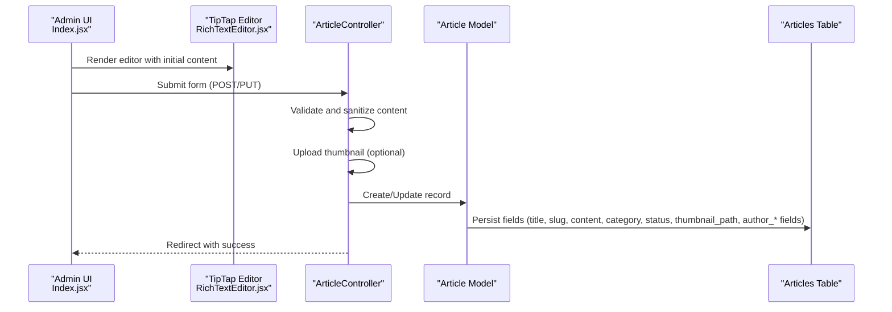

**Diagram sources**
- [Index.jsx:34-88](file://resources/js/Pages/Admin/Articles/Index.jsx#L34-L88)
- [RichTextEditor.jsx:101-130](file://resources/js/Components/RichTextEditor.jsx#L101-L130)
- [ArticleController.php:26-108](file://app/Http/Controllers/ArticleController.php#L26-L108)
- [Article.php:9-21](file://app/Models/Article.php#L9-L21)
- [create_articles_table.php:14-24](file://database/migrations/2026_04_30_050400_create_articles_table.php#L14-L24)

## Detailed Component Analysis

### Backend CRUD Controller
- Index: Returns paginated articles with author user loaded for display.
- Store: Validates inputs, sanitizes HTML, stores optional thumbnail, generates unique slug suffix, persists author metadata, and marks creator as current user.
- Update: Similar validation and sanitization, replaces thumbnail if provided, updates all metadata.
- Destroy: Deletes thumbnail from storage and removes article.

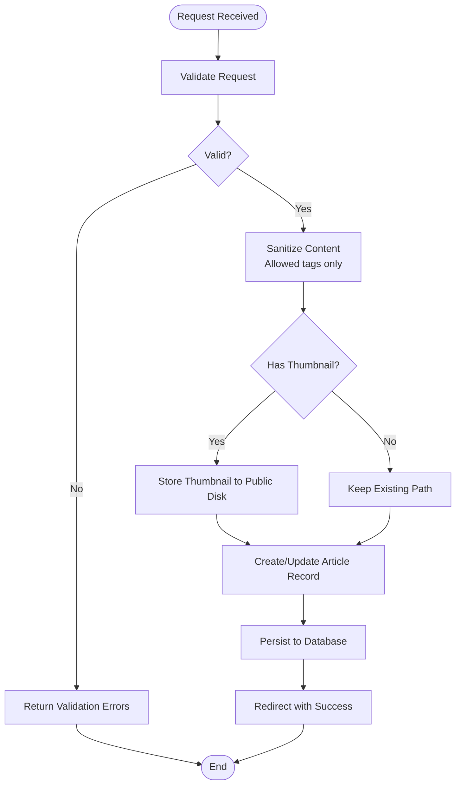

**Diagram sources**
- [ArticleController.php:26-108](file://app/Http/Controllers/ArticleController.php#L26-L108)
- [create_articles_table.php:14-24](file://database/migrations/2026_04_30_050400_create_articles_table.php#L14-L24)

**Section sources**
- [ArticleController.php:16-120](file://app/Http/Controllers/ArticleController.php#L16-L120)

### Model and Schema
- Fillable attributes include title, slug, content, thumbnail_path, category, user_id, status, and author fields.
- Eloquent relationship to User for author display.
- Database schema defines unique slug, status enum, and timestamps.

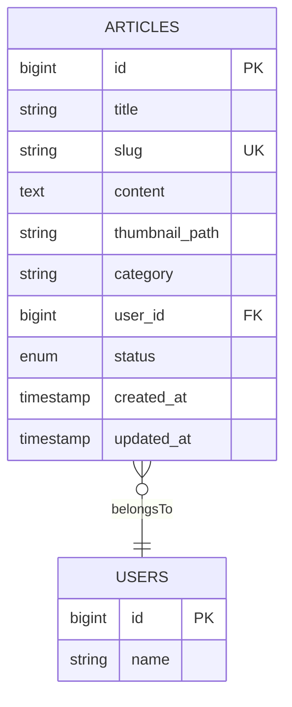

**Diagram sources**
- [Article.php:9-26](file://app/Models/Article.php#L9-L26)
- [create_articles_table.php:14-24](file://database/migrations/2026_04_30_050400_create_articles_table.php#L14-L24)

**Section sources**
- [Article.php:9-26](file://app/Models/Article.php#L9-L26)
- [create_articles_table.php:14-24](file://database/migrations/2026_04_30_050400_create_articles_table.php#L14-L24)
- [add_author_details_to_articles_table.php:14-18](file://database/migrations/2026_04_30_051304_add_author_details_to_articles_table.php#L14-L18)

### Admin Listing and Forms
- Listing displays thumbnails, titles, categories, statuses, authors, dates, and action buttons.
- Filtering: Live search by title and category.
- Create/Edit modal supports:
  - Title and category
  - Status selection (draft/published)
  - Rich text content via TipTap
  - Optional Expert Voice customization (name, role, bio)
  - Thumbnail upload preview and replacement
- Submissions use Inertia forms with multipart/form-data and method spoofing.

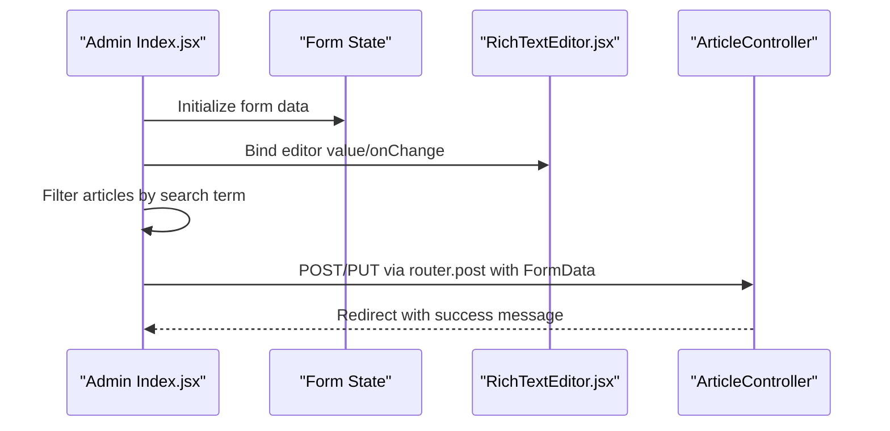

**Diagram sources**
- [Index.jsx:24-88](file://resources/js/Pages/Admin/Articles/Index.jsx#L24-L88)
- [RichTextEditor.jsx:101-130](file://resources/js/Components/RichTextEditor.jsx#L101-L130)
- [ArticleController.php:26-108](file://app/Http/Controllers/ArticleController.php#L26-L108)

**Section sources**
- [Index.jsx:24-397](file://resources/js/Pages/Admin/Articles/Index.jsx#L24-L397)

### TipTap Rich Text Editor Integration
- Uses @tiptap/react with StarterKit.
- Toolbar supports bold, italic, headings, lists, blockquote, undo/redo.
- Editor content is synchronized to parent form state via onUpdate.
- Supports external content updates (e.g., edit mode) via effect.

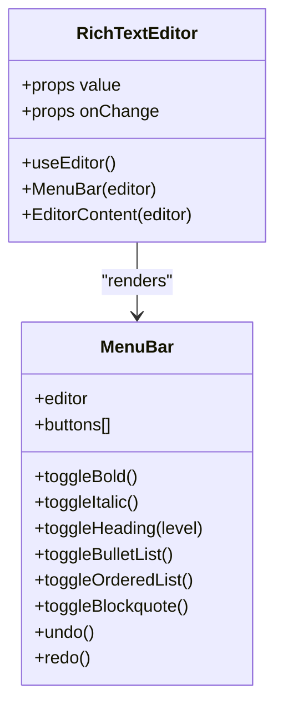

**Diagram sources**
- [RichTextEditor.jsx:101-130](file://resources/js/Components/RichTextEditor.jsx#L101-L130)

**Section sources**
- [RichTextEditor.jsx:101-130](file://resources/js/Components/RichTextEditor.jsx#L101-L130)

### Public Article Presentation and SEO
- Public route serves article detail by slug, loads related articles, and passes excerpts.
- Detail page renders content safely via dangerouslySetInnerHTML.
- SEO component injects:
  - Title, description, image, canonical
  - Open Graph and Twitter meta tags
  - Structured data (Article schema, Organization, WebSite, Breadcrumbs)
  - Keywords and author metadata
- Expert Voice fields are conditionally shown based on show_expert_voice flag.

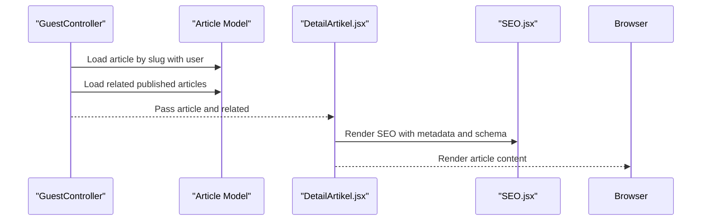

**Diagram sources**
- [GuestController.php:65-83](file://app/Http/Controllers/GuestController.php#L65-L83)
- [DetailArtikel.jsx:154-329](file://resources/js/Pages/Guest/DetailArtikel.jsx#L154-L329)
- [SEO.jsx:3-238](file://resources/js/Components/SEO.jsx#L3-L238)

**Section sources**
- [GuestController.php:49-83](file://app/Http/Controllers/GuestController.php#L49-L83)
- [DetailArtikel.jsx:154-329](file://resources/js/Pages/Guest/DetailArtikel.jsx#L154-L329)
- [SEO.jsx:3-238](file://resources/js/Components/SEO.jsx#L3-L238)

### Status Management and Publication Workflow
- Status is an enum with values published and draft.
- Admin can select status during creation/edit.
- Public listing filters by status = published.
- Slug generation appends a random suffix to ensure uniqueness.

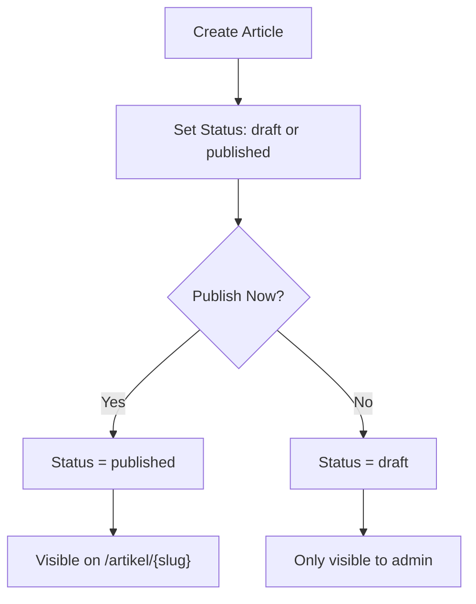

**Diagram sources**
- [ArticleController.php:49-61](file://app/Http/Controllers/ArticleController.php#L49-L61)
- [create_articles_table.php:22-22](file://database/migrations/2026_04_30_050400_create_articles_table.php#L22-L22)
- [GuestController.php:49-60](file://app/Http/Controllers/GuestController.php#L49-L60)

**Section sources**
- [ArticleController.php:28-61](file://app/Http/Controllers/ArticleController.php#L28-L61)
- [create_articles_table.php:22-22](file://database/migrations/2026_04_30_050400_create_articles_table.php#L22-L22)
- [GuestController.php:49-60](file://app/Http/Controllers/GuestController.php#L49-L60)

### Media Upload Handling
- Thumbnail upload is optional and validated as an image with allowed MIME types and size limit.
- Stored under the public disk in the articles directory.
- On update, existing thumbnail is deleted before replacing with a new one.

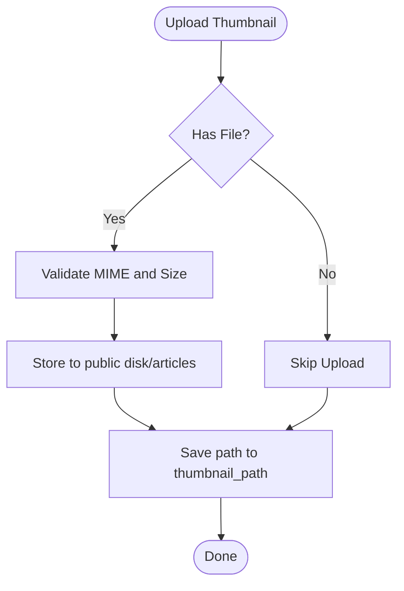

**Diagram sources**
- [ArticleController.php:44-93](file://app/Http/Controllers/ArticleController.php#L44-L93)

**Section sources**
- [ArticleController.php:33-93](file://app/Http/Controllers/ArticleController.php#L33-L93)

### Content Moderation and Security Controls
- Content sanitization strips tags to a safe whitelist to mitigate XSS risks.
- File uploads are validated for type and size.
- Status prevents accidental exposure of drafts to the public.

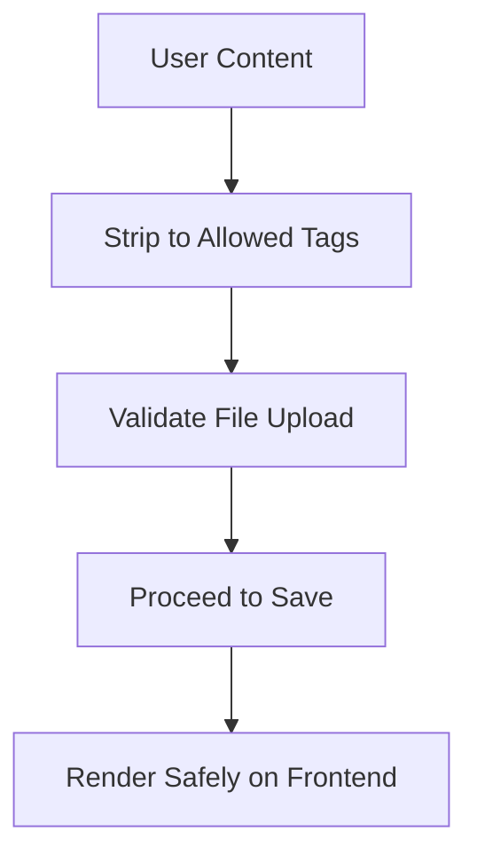

**Diagram sources**
- [ArticleController.php:40-42](file://app/Http/Controllers/ArticleController.php#L40-L42)
- [ArticleController.php:33-33](file://app/Http/Controllers/ArticleController.php#L33-L33)

**Section sources**
- [ArticleController.php:40-42](file://app/Http/Controllers/ArticleController.php#L40-L42)
- [ArticleController.php:33-33](file://app/Http/Controllers/ArticleController.php#L33-L33)

### Examples

#### Creating an Article
- Open the admin listing and click “Write Article”.
- Enter title, category, choose status (draft or published).
- Compose content using the TipTap editor.
- Optionally enable Expert Voice and fill author name/role/bio.
- Attach a thumbnail (optional).
- Submit to create the article.

**Section sources**
- [Index.jsx:47-88](file://resources/js/Pages/Admin/Articles/Index.jsx#L47-L88)
- [RichTextEditor.jsx:101-130](file://resources/js/Components/RichTextEditor.jsx#L101-L130)
- [ArticleController.php:26-64](file://app/Http/Controllers/ArticleController.php#L26-L64)

#### Editing an Article
- From the listing, click the edit icon.
- Modify title, content, category, status, or author details.
- Replace thumbnail if desired.
- Submit to persist changes.

**Section sources**
- [Index.jsx:54-69](file://resources/js/Pages/Admin/Articles/Index.jsx#L54-L69)
- [ArticleController.php:69-108](file://app/Http/Controllers/ArticleController.php#L69-L108)

#### Publishing an Article
- Set status to published during creation or edit.
- Ensure content meets guidelines and thumbnail is appropriate.
- Published articles appear on the public listing and detail page.

**Section sources**
- [ArticleController.php:32-32](file://app/Http/Controllers/ArticleController.php#L32-L32)
- [GuestController.php:49-60](file://app/Http/Controllers/GuestController.php#L49-L60)

## Dependency Analysis
- Routes define resource endpoints for admin articles.
- Admin UI depends on the controller for persistence and the TipTap component for content editing.
- Public detail page depends on the guest controller and model for rendering and SEO.

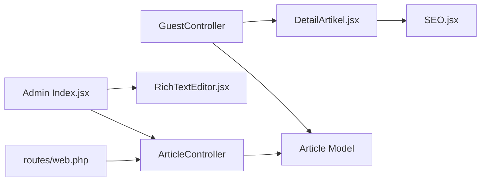

**Diagram sources**
- [routes/web.php:134-142](file://routes/web.php#L134-L142)
- [Index.jsx:24-397](file://resources/js/Pages/Admin/Articles/Index.jsx#L24-L397)
- [RichTextEditor.jsx:101-130](file://resources/js/Components/RichTextEditor.jsx#L101-L130)
- [GuestController.php:65-83](file://app/Http/Controllers/GuestController.php#L65-L83)
- [DetailArtikel.jsx:154-329](file://resources/js/Pages/Guest/DetailArtikel.jsx#L154-L329)
- [SEO.jsx:3-238](file://resources/js/Components/SEO.jsx#L3-L238)
- [ArticleController.php:11-121](file://app/Http/Controllers/ArticleController.php#L11-L121)
- [Article.php:7-27](file://app/Models/Article.php#L7-L27)

**Section sources**
- [routes/web.php:134-142](file://routes/web.php#L134-L142)
- [Index.jsx:24-397](file://resources/js/Pages/Admin/Articles/Index.jsx#L24-L397)
- [GuestController.php:65-83](file://app/Http/Controllers/GuestController.php#L65-L83)

## Performance Considerations
- Prefer lazy loading for images and thumbnails.
- Limit content length for excerpts and summaries to reduce payload sizes.
- Use pagination for large article lists in admin.
- Consider CDN for public images stored on the public disk.

## Troubleshooting Guide
- Validation errors: Ensure title and content meet length constraints and content is sanitized.
- Thumbnail upload failures: Verify file type and size limits; confirm public disk write permissions.
- Slug conflicts: The controller appends a random suffix; if duplicates occur, re-run creation.
- XSS concerns: Content is sanitized; avoid bypassing the editor’s HTML output.

**Section sources**
- [ArticleController.php:28-42](file://app/Http/Controllers/ArticleController.php#L28-L42)
- [ArticleController.php:33-33](file://app/Http/Controllers/ArticleController.php#L33-L33)
- [ArticleController.php:49-61](file://app/Http/Controllers/ArticleController.php#L49-L61)

## Conclusion
The article management system integrates a secure, admin-driven workflow with a modern rich text editor and robust public presentation. It supports essential CMS features—CRUD, status control, media handling, and SEO—while maintaining safety through content sanitization and controlled publishing. Future enhancements could include bulk actions, advanced filtering/sorting, scheduled publishing, and spam/prevention controls.