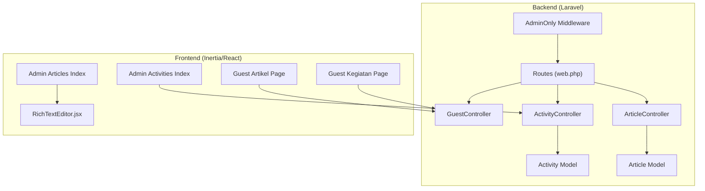
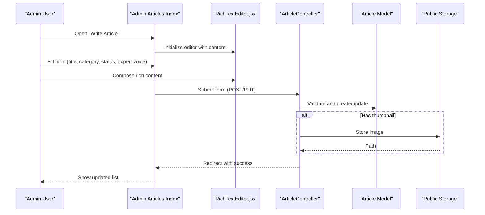
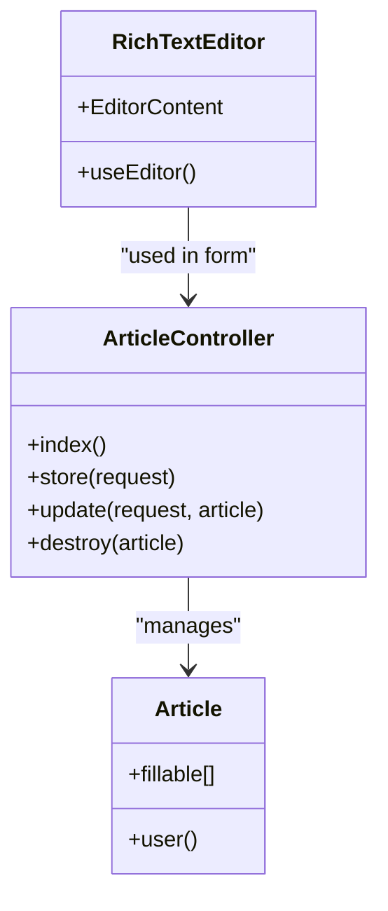
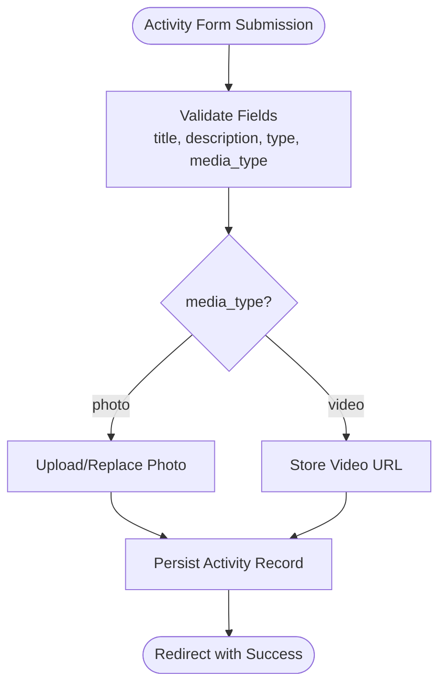
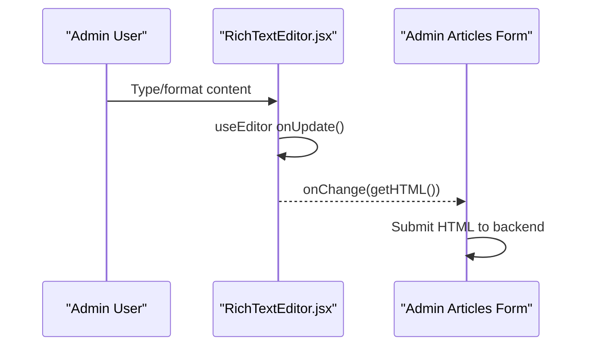
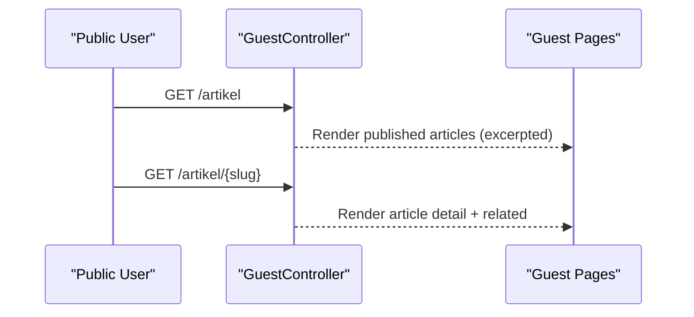
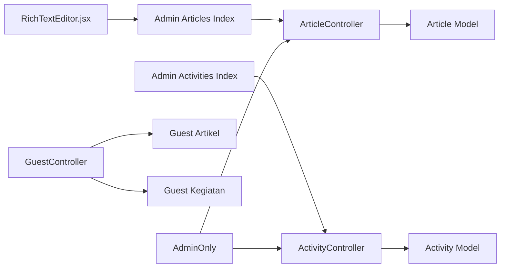
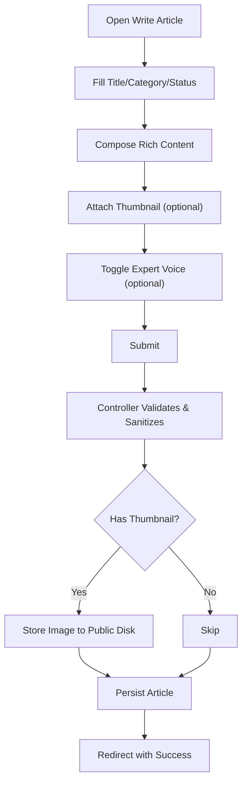
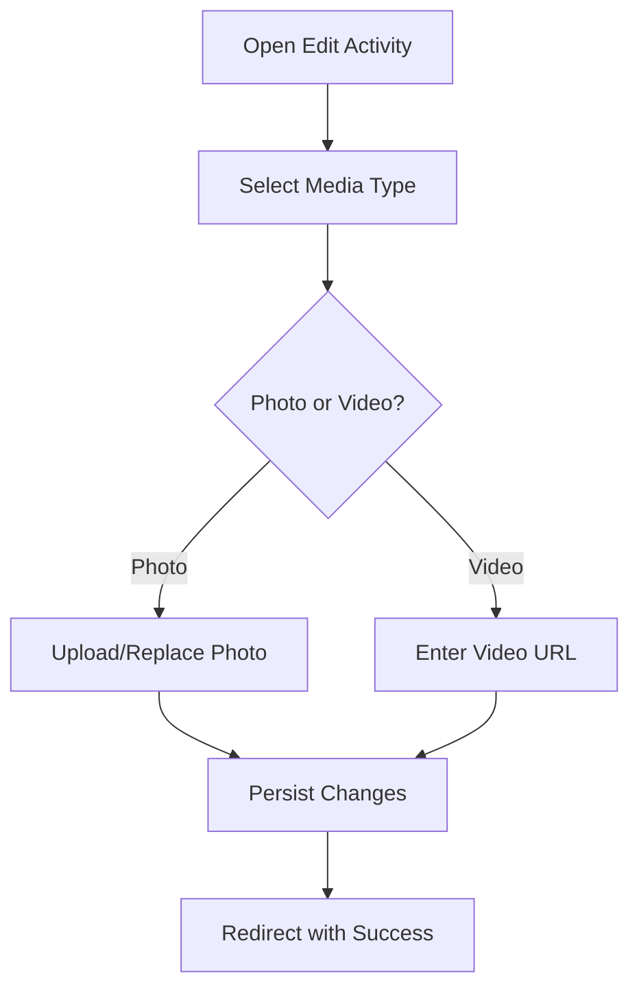

# Content Management

<cite>
**Referenced Files in This Document**
- [ArticleController.php](file://app/Http/Controllers/ArticleController.php)
- [ActivityController.php](file://app/Http/Controllers/ActivityController.php)
- [GuestController.php](file://app/Http/Controllers/GuestController.php)
- [Article.php](file://app/Models/Article.php)
- [Activity.php](file://app/Models/Activity.php)
- [RichTextEditor.jsx](file://resources/js/Components/RichTextEditor.jsx)
- [Articles Index.jsx](file://resources/js/Pages/Admin/Articles/Index.jsx)
- [Activities Index.jsx](file://resources/js/Pages/Admin/Activities/Index.jsx)
- [Articles migration](file://database/migrations/2026_04_30_050400_create_articles_table.php)
- [Activities migration](file://database/migrations/2026_04_30_045526_create_activities_table.php)
- [web.php routes](file://routes/web.php)
- [AdminOnly middleware](file://app/Http/Middleware/AdminOnly.php)
- [Guest Artikel page](file://resources/js/Pages/Guest/Artikel.jsx)
- [Guest Kegiatan page](file://resources/js/Pages/Guest/Kegiatan.jsx)
</cite>

## Table of Contents
1. [Introduction](#introduction)
2. [Project Structure](#project-structure)
3. [Core Components](#core-components)
4. [Architecture Overview](#architecture-overview)
5. [Detailed Component Analysis](#detailed-component-analysis)
6. [Dependency Analysis](#dependency-analysis)
7. [Performance Considerations](#performance-considerations)
8. [Troubleshooting Guide](#troubleshooting-guide)
9. [Conclusion](#conclusion)
10. [Appendices](#appendices)

## Introduction
This document describes the content management system for articles and activities within the EduFA platform. It covers:
- CRUD operations for articles (creation, editing, publishing, deletion)
- Activity management (scheduling and managing events with photo/video media)
- Rich text editing powered by TipTap
- Media upload and storage handling
- Status management and publication workflows
- Admin interface for bulk operations and content organization
- Examples and best practices for maintaining high-quality content

## Project Structure
The system follows a Laravel backend with Inertia.js/React frontend:
- Backend controllers manage article and activity CRUD and integrate with Eloquent models
- Frontend pages provide admin dashboards and rich editing experiences
- Routes define admin-only protected endpoints and public-facing pages
- Middleware enforces admin-only access
- TipTap-based rich text editor is embedded in the admin article form



**Diagram sources**
- [web.php routes:68-125](file://routes/web.php#L68-L125)
- [ArticleController.php:11-121](file://app/Http/Controllers/ArticleController.php#L11-L121)
- [ActivityController.php:10-106](file://app/Http/Controllers/ActivityController.php#L10-L106)
- [GuestController.php:14-118](file://app/Http/Controllers/GuestController.php#L14-L118)
- [AdminOnly middleware:9-24](file://app/Http/Middleware/AdminOnly.php#L9-L24)
- [Articles Index.jsx:24-397](file://resources/js/Pages/Admin/Articles/Index.jsx#L24-L397)
- [Activities Index.jsx:22-352](file://resources/js/Pages/Admin/Activities/Index.jsx#L22-L352)
- [RichTextEditor.jsx:101-130](file://resources/js/Components/RichTextEditor.jsx#L101-L130)
- [Guest Artikel page:207-450](file://resources/js/Pages/Guest/Artikel.jsx#L207-L450)
- [Guest Kegiatan page:203-375](file://resources/js/Pages/Guest/Kegiatan.jsx#L203-L375)

**Section sources**
- [web.php routes:68-125](file://routes/web.php#L68-L125)
- [AdminOnly middleware:9-24](file://app/Http/Middleware/AdminOnly.php#L9-L24)

## Core Components
- ArticleController: Handles listing, storing, updating, and deleting articles; sanitizes content; manages thumbnails; sets status to draft or published
- ActivityController: Manages activities with photo or video media; supports updates and deletions; handles media replacement
- GuestController: Renders public pages for articles and activities; filters published articles; resolves article detail pages
- Article and Activity models: Define fillable attributes and relationships
- Admin pages: Provide rich UI for CRUD, filtering, and media selection
- RichTextEditor.jsx: TipTap-powered editor with toolbar and HTML output synchronization
- Routes: Define admin-only protected endpoints and public routes for articles and activities
- Middleware: Enforces admin-only access

**Section sources**
- [ArticleController.php:16-120](file://app/Http/Controllers/ArticleController.php#L16-L120)
- [ActivityController.php:15-105](file://app/Http/Controllers/ActivityController.php#L15-L105)
- [GuestController.php:49-83](file://app/Http/Controllers/GuestController.php#L49-L83)
- [Article.php:9-26](file://app/Models/Article.php#L9-L26)
- [Activity.php:9-9](file://app/Models/Activity.php#L9-L9)
- [Articles Index.jsx:24-397](file://resources/js/Pages/Admin/Articles/Index.jsx#L24-L397)
- [Activities Index.jsx:22-352](file://resources/js/Pages/Admin/Activities/Index.jsx#L22-L352)
- [RichTextEditor.jsx:101-130](file://resources/js/Components/RichTextEditor.jsx#L101-L130)
- [web.php routes:68-125](file://routes/web.php#L68-L125)

## Architecture Overview
The system uses a layered architecture:
- Presentation layer: Inertia.js renders React pages for admin and guests
- Application layer: Controllers orchestrate requests and delegate to models
- Domain layer: Eloquent models encapsulate persistence and relationships
- Infrastructure layer: Routes, middleware, and storage configuration



**Diagram sources**
- [Articles Index.jsx:34-88](file://resources/js/Pages/Admin/Articles/Index.jsx#L34-L88)
- [RichTextEditor.jsx:101-130](file://resources/js/Components/RichTextEditor.jsx#L101-L130)
- [ArticleController.php:26-108](file://app/Http/Controllers/ArticleController.php#L26-L108)
- [Article.php:9-26](file://app/Models/Article.php#L9-L26)

**Section sources**
- [Articles Index.jsx:24-397](file://resources/js/Pages/Admin/Articles/Index.jsx#L24-L397)
- [RichTextEditor.jsx:101-130](file://resources/js/Components/RichTextEditor.jsx#L101-L130)
- [ArticleController.php:26-108](file://app/Http/Controllers/ArticleController.php#L26-L108)

## Detailed Component Analysis

### Article Management System
- Purpose: Full CRUD lifecycle for articles with rich content and optional expert voice metadata
- Key features:
  - Rich text editing via TipTap
  - Status management (draft vs published)
  - Optional expert voice customization
  - Thumbnail upload and replacement
  - XSS-safe content storage by whitelisting allowed tags
  - Admin-only access enforced



**Diagram sources**
- [ArticleController.php:16-120](file://app/Http/Controllers/ArticleController.php#L16-L120)
- [Article.php:9-26](file://app/Models/Article.php#L9-L26)
- [RichTextEditor.jsx:101-130](file://resources/js/Components/RichTextEditor.jsx#L101-L130)

**Section sources**
- [ArticleController.php:26-120](file://app/Http/Controllers/ArticleController.php#L26-L120)
- [Article.php:9-26](file://app/Models/Article.php#L9-L26)
- [RichTextEditor.jsx:101-130](file://resources/js/Components/RichTextEditor.jsx#L101-L130)
- [Articles Index.jsx:24-397](file://resources/js/Pages/Admin/Articles/Index.jsx#L24-L397)

### Activity Management System
- Purpose: Manage activities with photo or video media, categorized as therapy or classroom activity
- Key features:
  - Media type switching (photo/video)
  - Photo upload with preview and replacement
  - Video URL support with YouTube/GDrive embedding
  - Admin-only CRUD operations



**Diagram sources**
- [ActivityController.php:25-93](file://app/Http/Controllers/ActivityController.php#L25-L93)
- [Activities Index.jsx:32-81](file://resources/js/Pages/Admin/Activities/Index.jsx#L32-L81)

**Section sources**
- [ActivityController.php:25-105](file://app/Http/Controllers/ActivityController.php#L25-L105)
- [Activities Index.jsx:22-352](file://resources/js/Pages/Admin/Activities/Index.jsx#L22-L352)

### Rich Text Editing with TipTap
- Implemented via a reusable React component integrating TipTap Starter Kit
- Provides toolbar actions: bold, italic, headings, lists, blockquote, undo/redo
- Synchronizes editor content to HTML for form submission
- Prose-focused styling and focus handling



**Diagram sources**
- [RichTextEditor.jsx:101-130](file://resources/js/Components/RichTextEditor.jsx#L101-L130)
- [Articles Index.jsx:292-295](file://resources/js/Pages/Admin/Articles/Index.jsx#L292-L295)

**Section sources**
- [RichTextEditor.jsx:16-99](file://resources/js/Components/RichTextEditor.jsx#L16-L99)
- [RichTextEditor.jsx:101-130](file://resources/js/Components/RichTextEditor.jsx#L101-L130)

### Public Content Delivery
- Published articles are exposed on the public article index and detail pages
- Article detail page fetches related articles and strips content for excerpts
- Activities are rendered on the public activities gallery with photo/video previews



**Diagram sources**
- [GuestController.php:49-83](file://app/Http/Controllers/GuestController.php#L49-L83)
- [Guest Artikel page:207-450](file://resources/js/Pages/Guest/Artikel.jsx#L207-L450)
- [Guest Kegiatan page:203-375](file://resources/js/Pages/Guest/Kegiatan.jsx#L203-L375)

**Section sources**
- [GuestController.php:49-83](file://app/Http/Controllers/GuestController.php#L49-L83)
- [Guest Artikel page:207-450](file://resources/js/Pages/Guest/Artikel.jsx#L207-L450)
- [Guest Kegiatan page:203-375](file://resources/js/Pages/Guest/Kegiatan.jsx#L203-L375)

## Dependency Analysis
- Controllers depend on models and storage
- Admin pages depend on controllers via Inertia route actions
- Public pages depend on controllers for rendering
- Middleware restricts admin endpoints
- TipTap editor is a front-end dependency



**Diagram sources**
- [RichTextEditor.jsx:101-130](file://resources/js/Components/RichTextEditor.jsx#L101-L130)
- [Articles Index.jsx:24-397](file://resources/js/Pages/Admin/Articles/Index.jsx#L24-L397)
- [Activities Index.jsx:22-352](file://resources/js/Pages/Admin/Activities/Index.jsx#L22-L352)
- [ArticleController.php:16-120](file://app/Http/Controllers/ArticleController.php#L16-L120)
- [ActivityController.php:15-105](file://app/Http/Controllers/ActivityController.php#L15-L105)
- [Article.php:9-26](file://app/Models/Article.php#L9-L26)
- [Activity.php:9-9](file://app/Models/Activity.php#L9-L9)
- [GuestController.php:49-83](file://app/Http/Controllers/GuestController.php#L49-L83)
- [AdminOnly middleware:9-24](file://app/Http/Middleware/AdminOnly.php#L9-L24)

**Section sources**
- [web.php routes:68-125](file://routes/web.php#L68-L125)
- [AdminOnly middleware:9-24](file://app/Http/Middleware/AdminOnly.php#L9-L24)

## Performance Considerations
- Content stripping for excerpts reduces payload sizes on article listings
- Thumbnail and media paths stored separately enable lazy loading and CDN-friendly URLs
- TipTap editor updates content incrementally; avoid excessive re-renders by limiting unnecessary state updates
- Pagination and client-side filtering reduce server load on large datasets

[No sources needed since this section provides general guidance]

## Troubleshooting Guide
- Validation failures: Ensure required fields are present and media constraints are met (image types/sizes)
- XSS prevention: Content is sanitized using allowed tags; avoid unsupported HTML
- Media cleanup: Deleting articles/activities removes associated files from storage
- Access denied: Admin-only routes require authenticated admin users

**Section sources**
- [ArticleController.php:28-47](file://app/Http/Controllers/ArticleController.php#L28-L47)
- [ActivityController.php:27-41](file://app/Http/Controllers/ActivityController.php#L27-L41)
- [GuestController.php:51-82](file://app/Http/Controllers/GuestController.php#L51-L82)

## Conclusion
The EduFA content management system provides a robust, admin-driven workflow for articles and activities, combining a powerful TipTap-based editor with safe content handling and flexible media support. The separation between admin and public layers ensures maintainable, scalable content delivery.

[No sources needed since this section summarizes without analyzing specific files]

## Appendices

### Data Models Overview
```mermaid
erDiagram
USERS {
int id PK
string name
string email
}
ARTICLES {
int id PK
string title
string slug
text content
string thumbnail_path
string category
int user_id FK
enum status
timestamps
}
ACTIVITIES {
int id PK
string title
text description
enum type
enum media_type
string media_path
timestamps
}
USERS ||--o{ ARTICLES : "writes"
```

**Diagram sources**
- [Articles migration:14-24](file://database/migrations/2026_04_30_050400_create_articles_table.php#L14-L24)
- [Activities migration:14-21](file://database/migrations/2026_04_30_045526_create_activities_table.php#L14-L21)
- [Article.php:23-26](file://app/Models/Article.php#L23-L26)

### Admin Workflows

#### Article Creation Workflow


**Diagram sources**
- [Articles Index.jsx:47-88](file://resources/js/Pages/Admin/Articles/Index.jsx#L47-L88)
- [ArticleController.php:26-63](file://app/Http/Controllers/ArticleController.php#L26-L63)

#### Activity Update Workflow


**Diagram sources**
- [Activities Index.jsx:49-93](file://resources/js/Pages/Admin/Activities/Index.jsx#L49-L93)
- [ActivityController.php:57-93](file://app/Http/Controllers/ActivityController.php#L57-L93)

### Best Practices
- Keep article content concise and scannable; use headings and lists
- Use expert voice selectively for authoritative content
- Optimize thumbnails and media for fast loading
- Regularly review and clean up unused media files
- Use categories consistently for discoverability
- Publish only after thorough review and proofreading

[No sources needed since this section provides general guidance]