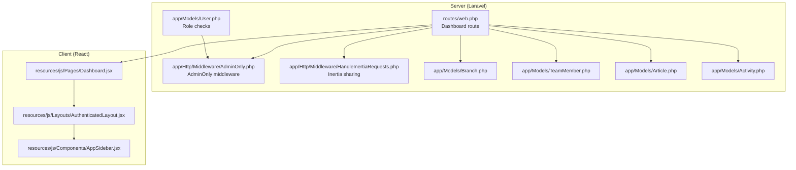
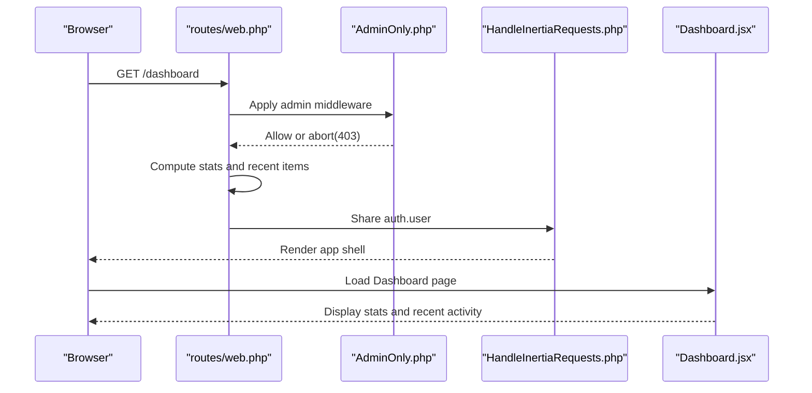
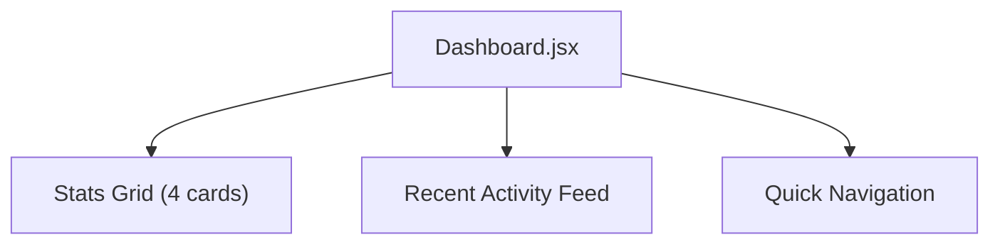
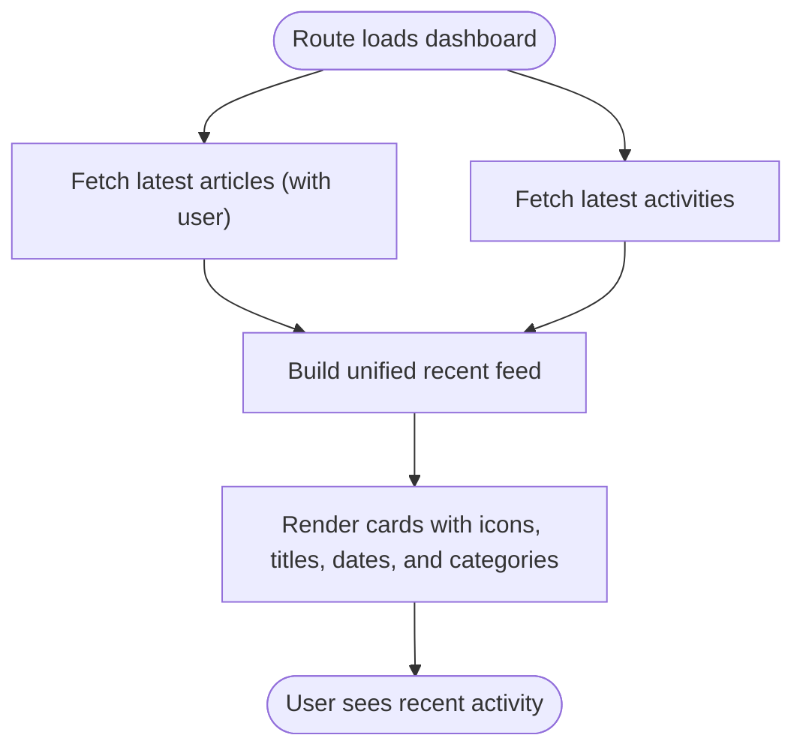
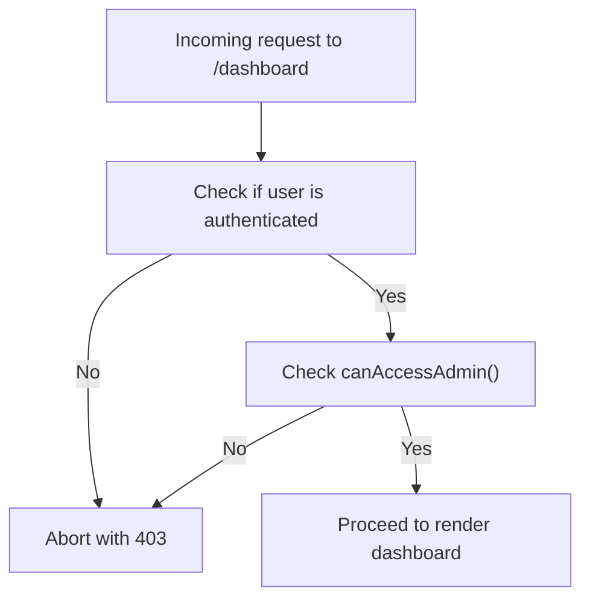
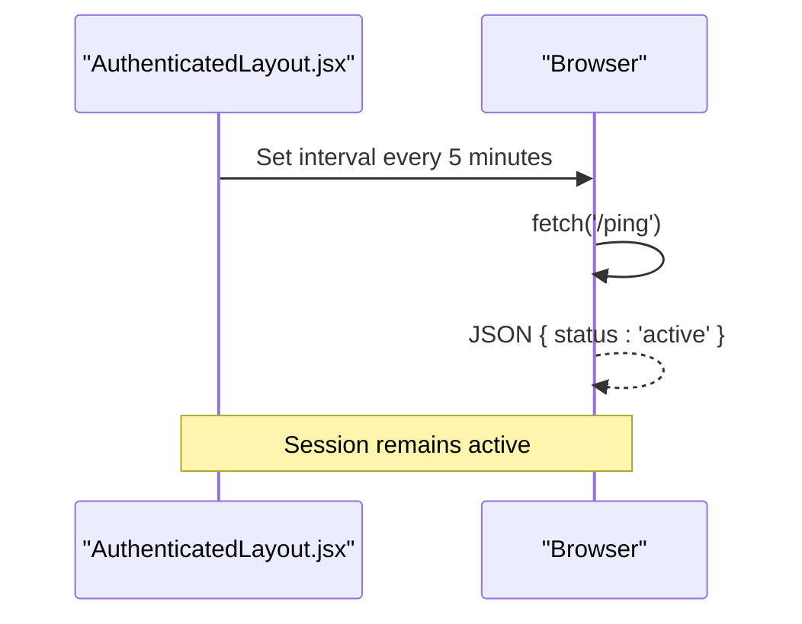
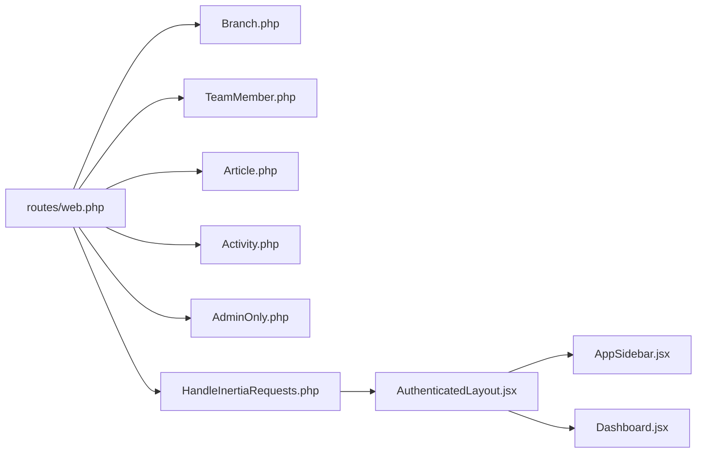

# Dashboard Overview

<cite>
**Referenced Files in This Document**
- [Dashboard.jsx](file://resources/js/Pages/Dashboard.jsx)
- [web.php](file://routes/web.php)
- [AdminOnly.php](file://app/Http/Middleware/AdminOnly.php)
- [HandleInertiaRequests.php](file://app/Http/Middleware/HandleInertiaRequests.php)
- [AuthenticatedLayout.jsx](file://resources/js/Layouts/AuthenticatedLayout.jsx)
- [AppSidebar.jsx](file://resources/js/Components/AppSidebar.jsx)
- [User.php](file://app/Models/User.php)
- [Branch.php](file://app/Models/Branch.php)
- [TeamMember.php](file://app/Models/TeamMember.php)
- [Article.php](file://app/Models/Article.php)
- [Activity.php](file://app/Models/Activity.php)
- [2026_04_20_133158_create_branches_table.php](file://database/migrations/2026_04_20_133158_create_branches_table.php)
- [2026_04_25_153659_create_team_members_table.php](file://database/migrations/2026_04_25_153659_create_team_members_table.php)
- [2026_04_30_045526_create_activities_table.php](file://database/migrations/2026_04_30_045526_create_activities_table.php)
- [2026_04_30_050400_create_articles_table.php](file://database/migrations/2026_04_30_050400_create_articles_table.php)
</cite>

## Table of Contents
1. [Introduction](#introduction)
2. [Project Structure](#project-structure)
3. [Core Components](#core-components)
4. [Architecture Overview](#architecture-overview)
5. [Detailed Component Analysis](#detailed-component-analysis)
6. [Dependency Analysis](#dependency-analysis)
7. [Performance Considerations](#performance-considerations)
8. [Troubleshooting Guide](#troubleshooting-guide)
9. [Conclusion](#conclusion)

## Introduction
This document provides a comprehensive overview of the administrative dashboard, focusing on the statistics panel, recent activity tracking, layout and navigation, and access controls. It explains how administrators can quickly assess system health and recent activity, outlines the dashboard middleware protection, and offers guidelines for customizing widgets and adding new metrics.

## Project Structure
The dashboard is implemented as a React page rendered server-side via Inertia. The Laravel backend prepares statistics and recent items, while the frontend composes the layout, cards, and quick navigation. Access is controlled by middleware ensuring only authorized users can reach the dashboard.

**Diagram sources**
- [web.php:68-80](file://routes/web.php#L68-L80)
- [AdminOnly.php:9-24](file://app/Http/Middleware/AdminOnly.php#L9-L24)
- [HandleInertiaRequests.php:8-39](file://app/Http/Middleware/HandleInertiaRequests.php#L8-L39)
- [Dashboard.jsx:5-214](file://resources/js/Pages/Dashboard.jsx#L5-L214)
- [AuthenticatedLayout.jsx:11-53](file://resources/js/Layouts/AuthenticatedLayout.jsx#L11-L53)
- [AppSidebar.jsx:35-163](file://resources/js/Components/AppSidebar.jsx#L35-L163)
- [User.php:32-45](file://app/Models/User.php#L32-L45)
- [Branch.php:8-35](file://app/Models/Branch.php#L8-L35)
- [TeamMember.php:7-23](file://app/Models/TeamMember.php#L7-L23)
- [Article.php:7-27](file://app/Models/Article.php#L7-L27)
- [Activity.php:7-10](file://app/Models/Activity.php#L7-L10)

**Section sources**
- [web.php:68-80](file://routes/web.php#L68-L80)
- [Dashboard.jsx:5-214](file://resources/js/Pages/Dashboard.jsx#L5-L214)
- [AuthenticatedLayout.jsx:11-53](file://resources/js/Layouts/AuthenticatedLayout.jsx#L11-L53)
- [AppSidebar.jsx:35-163](file://resources/js/Components/AppSidebar.jsx#L35-L163)

## Core Components
- Dashboard page: Renders statistics cards, recent activity feed, and quick navigation.
- Backend route: Computes counts and recent items for the dashboard.
- Access control: Ensures only editors and admins can access the dashboard.
- Layout and sidebar: Provide consistent navigation and keep-alive behavior.

Key statistics exposed to the dashboard:
- Total branches
- Total team members
- Total articles
- Total activities

Recent activity feed displays:
- Latest articles with author metadata
- Latest activities with media type indicators

**Section sources**
- [Dashboard.jsx:19-71](file://resources/js/Pages/Dashboard.jsx#L19-L71)
- [Dashboard.jsx:75-138](file://resources/js/Pages/Dashboard.jsx#L75-L138)
- [web.php:71-79](file://routes/web.php#L71-L79)
- [AdminOnly.php:16-22](file://app/Http/Middleware/AdminOnly.php#L16-L22)

## Architecture Overview
The dashboard follows a server-rendered React pattern:
- The route handler builds the stats payload and recent collections.
- Inertia shares the authenticated user context to the client.
- The dashboard page composes the UI and links to admin sections.

**Diagram sources**
- [web.php:68-80](file://routes/web.php#L68-L80)
- [AdminOnly.php:16-22](file://app/Http/Middleware/AdminOnly.php#L16-L22)
- [HandleInertiaRequests.php:30-37](file://app/Http/Middleware/HandleInertiaRequests.php#L30-L37)
- [Dashboard.jsx:5-214](file://resources/js/Pages/Dashboard.jsx#L5-L214)

## Detailed Component Analysis

### Dashboard Page Layout and Widgets
The dashboard organizes information into:
- Statistics grid: Four metric cards for branches, team members, articles, and activities.
- Recent activity feed: Unified list of latest articles and activities with timestamps and categorization.
- Quick navigation: One-click access to manage branches, write articles, and profile.

**Diagram sources**
- [Dashboard.jsx:19-71](file://resources/js/Pages/Dashboard.jsx#L19-L71)
- [Dashboard.jsx:75-138](file://resources/js/Pages/Dashboard.jsx#L75-L138)
- [Dashboard.jsx:142-210](file://resources/js/Pages/Dashboard.jsx#L142-L210)

**Section sources**
- [Dashboard.jsx:19-71](file://resources/js/Pages/Dashboard.jsx#L19-L71)
- [Dashboard.jsx:75-138](file://resources/js/Pages/Dashboard.jsx#L75-L138)
- [Dashboard.jsx:142-210](file://resources/js/Pages/Dashboard.jsx#L142-L210)

### Recent Activity Tracking System
The backend aggregates:
- Latest articles with user relationship for author information.
- Latest activities ordered by creation time.

The frontend renders:
- Distinct sections for articles and activities.
- Timestamps localized to Indonesian locale.
- Category badges indicating content type.
- Links to respective admin pages.

**Diagram sources**
- [web.php:77-78](file://routes/web.php#L77-L78)
- [Dashboard.jsx:95-134](file://resources/js/Pages/Dashboard.jsx#L95-L134)
- [Article.php:23-26](file://app/Models/Article.php#L23-L26)

**Section sources**
- [web.php:77-78](file://routes/web.php#L77-L78)
- [Dashboard.jsx:95-134](file://resources/js/Pages/Dashboard.jsx#L95-L134)
- [Article.php:23-26](file://app/Models/Article.php#L23-L26)

### Dashboard Middleware Protection and Access Controls
Access to the dashboard is protected by:
- A dedicated middleware that checks authentication and role.
- A shared permission method on the User model that allows both admin and editor roles.

**Diagram sources**
- [AdminOnly.php:16-22](file://app/Http/Middleware/AdminOnly.php#L16-L22)
- [User.php:42-45](file://app/Models/User.php#L42-L45)

**Section sources**
- [AdminOnly.php:16-22](file://app/Http/Middleware/AdminOnly.php#L16-L22)
- [User.php:42-45](file://app/Models/User.php#L42-L45)

### Real-Time Statistics Display and Keep-Alive
The layout injects a periodic keep-alive ping to prevent session timeouts during extended dashboard usage. This ensures administrators can browse without unexpected logouts.

**Diagram sources**
- [AuthenticatedLayout.jsx:14-23](file://resources/js/Layouts/AuthenticatedLayout.jsx#L14-L23)

**Section sources**
- [AuthenticatedLayout.jsx:14-23](file://resources/js/Layouts/AuthenticatedLayout.jsx#L14-L23)

### Data Visualization Components
The dashboard uses:
- Metric cards with icons and color accents to highlight counts.
- A unified list for recent items with category badges.
- Hover effects and subtle shadows for interactive feedback.
- Localized date formatting for readability.

These components are implemented purely with Tailwind classes and Lucide icons in the React page.

**Section sources**
- [Dashboard.jsx:19-71](file://resources/js/Pages/Dashboard.jsx#L19-L71)
- [Dashboard.jsx:75-138](file://resources/js/Pages/Dashboard.jsx#L75-L138)

### How Administrators Assess System Health and Recent Activity
Administrators can:
- Review the four main metrics at a glance to confirm inventory completeness.
- Scan the recent activity feed to verify content publishing and documentation updates.
- Use quick navigation to drill into specific areas requiring attention.
- Trust the keep-alive behavior to maintain session stability during long sessions.

**Section sources**
- [Dashboard.jsx:19-71](file://resources/js/Pages/Dashboard.jsx#L19-L71)
- [Dashboard.jsx:75-138](file://resources/js/Pages/Dashboard.jsx#L75-L138)
- [AuthenticatedLayout.jsx:14-23](file://resources/js/Layouts/AuthenticatedLayout.jsx#L14-L23)

### Guidelines for Customizing Widgets and Adding New Metrics
To add a new metric:
- Extend the stats array in the dashboard route with the desired count or aggregation.
- Pass the new value into the Inertia render call.
- Render a new card in the dashboard page using similar patterns to existing cards.

To add a new recent item type:
- Fetch the latest records in the route and pass them to the page.
- Render the items in the recent activity feed with appropriate icons and categories.
- Add a quick navigation link if needed.

Ensure access control remains intact by keeping the route under the admin middleware.

**Section sources**
- [web.php:71-79](file://routes/web.php#L71-L79)
- [Dashboard.jsx:19-71](file://resources/js/Pages/Dashboard.jsx#L19-L71)
- [Dashboard.jsx:75-138](file://resources/js/Pages/Dashboard.jsx#L75-L138)

## Dependency Analysis
The dashboard depends on:
- Laravel models for data retrieval and relationships.
- Middleware for access control.
- Inertia for server-client data sharing.
- React components for layout and navigation.

**Diagram sources**
- [web.php:68-80](file://routes/web.php#L68-L80)
- [Branch.php:8-35](file://app/Models/Branch.php#L8-L35)
- [TeamMember.php:7-23](file://app/Models/TeamMember.php#L7-L23)
- [Article.php:7-27](file://app/Models/Article.php#L7-L27)
- [Activity.php:7-10](file://app/Models/Activity.php#L7-L10)
- [AdminOnly.php:16-22](file://app/Http/Middleware/AdminOnly.php#L16-L22)
- [HandleInertiaRequests.php:30-37](file://app/Http/Middleware/HandleInertiaRequests.php#L30-L37)
- [AuthenticatedLayout.jsx:11-53](file://resources/js/Layouts/AuthenticatedLayout.jsx#L11-L53)
- [AppSidebar.jsx:35-163](file://resources/js/Components/AppSidebar.jsx#L35-L163)
- [Dashboard.jsx:5-214](file://resources/js/Pages/Dashboard.jsx#L5-L214)

**Section sources**
- [web.php:68-80](file://routes/web.php#L68-L80)
- [AdminOnly.php:16-22](file://app/Http/Middleware/AdminOnly.php#L16-L22)
- [HandleInertiaRequests.php:30-37](file://app/Http/Middleware/HandleInertiaRequests.php#L30-L37)
- [AuthenticatedLayout.jsx:11-53](file://resources/js/Layouts/AuthenticatedLayout.jsx#L11-L53)
- [AppSidebar.jsx:35-163](file://resources/js/Components/AppSidebar.jsx#L35-L163)
- [Dashboard.jsx:5-214](file://resources/js/Pages/Dashboard.jsx#L5-L214)

## Performance Considerations
- The dashboard computes counts and recent items on each request. For high traffic, consider caching counts or using database-level aggregations.
- Limit recent item fetch sizes to reduce payload and rendering overhead.
- Keep the keep-alive interval reasonable to avoid unnecessary requests.

## Troubleshooting Guide
- Access denied: Ensure the logged-in user has an admin or editor role; otherwise, the middleware will block access.
- Empty recent activity: Verify that articles and activities exist and are properly ordered by creation time.
- Broken navigation: Confirm route names and permissions for admin sections.

**Section sources**
- [AdminOnly.php:16-22](file://app/Http/Middleware/AdminOnly.php#L16-L22)
- [web.php:77-78](file://routes/web.php#L77-L78)
- [User.php:42-45](file://app/Models/User.php#L42-L45)

## Conclusion
The dashboard provides a concise overview of key system metrics and recent activity, backed by robust access controls and a responsive layout. Administrators can efficiently monitor system health and drill into management tasks using the integrated navigation and quick actions.