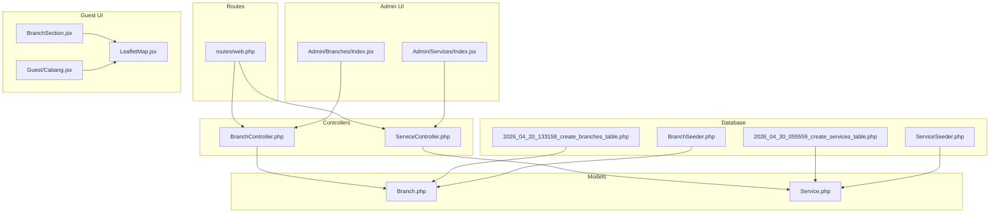
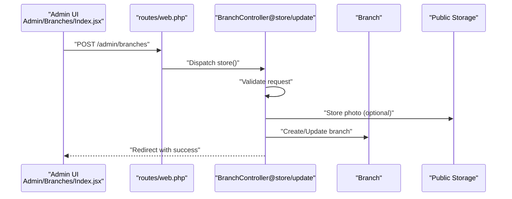
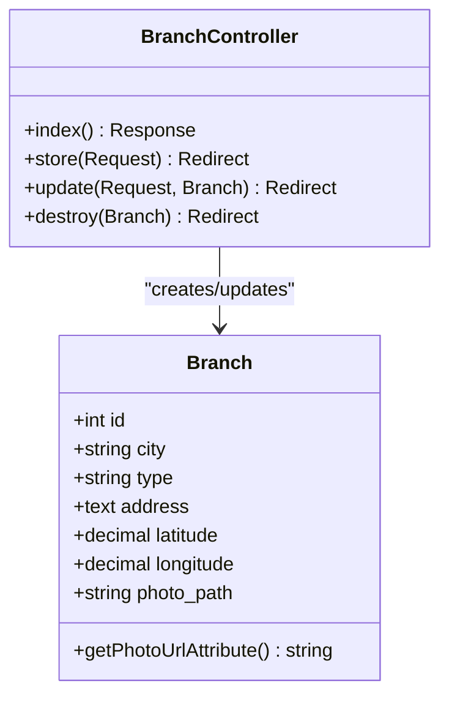
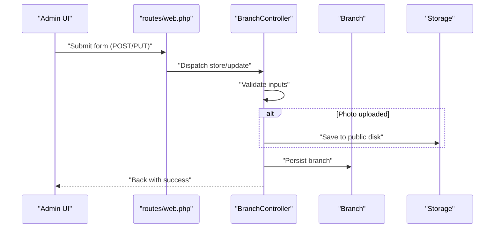
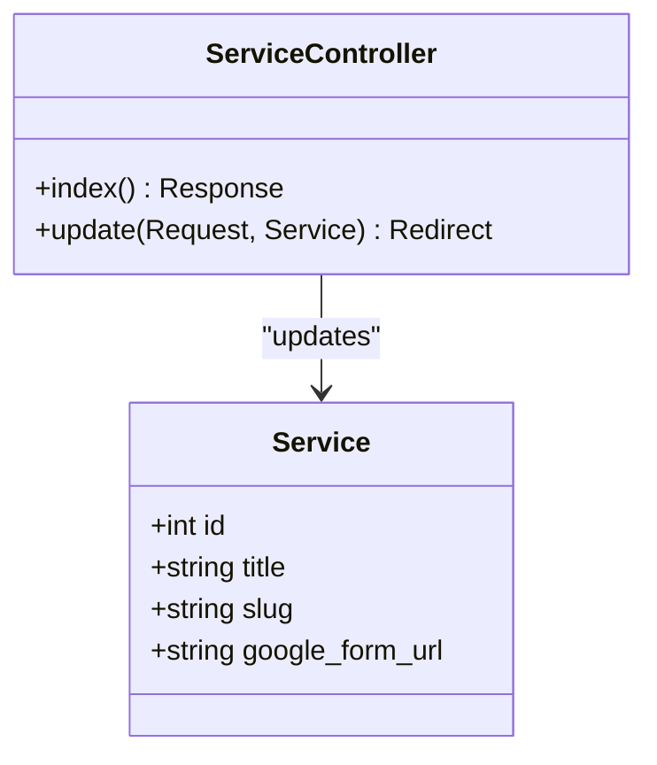
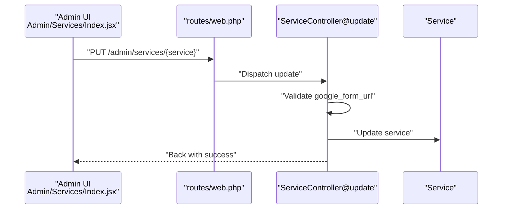
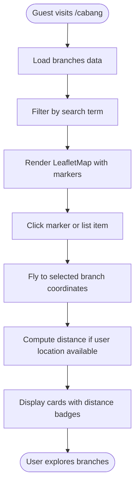
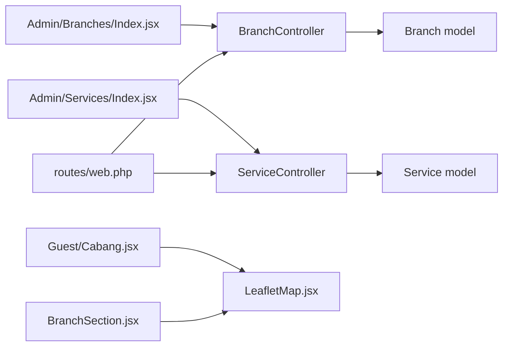
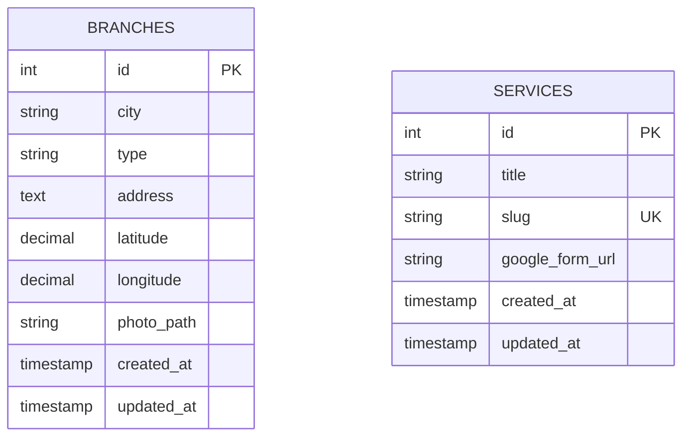

# Service & Branch Management

<cite>
**Referenced Files in This Document**
- [BranchController.php](file://app/Http/Controllers/BranchController.php)
- [ServiceController.php](file://app/Http/Controllers/ServiceController.php)
- [Branch.php](file://app/Models/Branch.php)
- [Service.php](file://app/Models/Service.php)
- [2026_04_20_133158_create_branches_table.php](file://database/migrations/2026_04_20_133158_create_branches_table.php)
- [2026_04_30_055559_create_services_table.php](file://database/migrations/2026_04_30_055559_create_services_table.php)
- [Index.jsx (Admin Branches)](file://resources/js/Pages/Admin/Branches/Index.jsx)
- [Index.jsx (Admin Services)](file://resources/js/Pages/Admin/Services/Index.jsx)
- [BranchSection.jsx](file://resources/js/Components/BranchSection.jsx)
- [LeafletMap.jsx](file://resources/js/Components/ui/LeafletMap.jsx)
- [Cabang.jsx](file://resources/js/Pages/Guest/Cabang.jsx)
- [web.php](file://routes/web.php)
- [BranchSeeder.php](file://database/seeders/BranchSeeder.php)
- [ServiceSeeder.php](file://database/seeders/ServiceSeeder.php)
</cite>

## Table of Contents
1. [Introduction](#introduction)
2. [Project Structure](#project-structure)
3. [Core Components](#core-components)
4. [Architecture Overview](#architecture-overview)
5. [Detailed Component Analysis](#detailed-component-analysis)
6. [Dependency Analysis](#dependency-analysis)
7. [Performance Considerations](#performance-considerations)
8. [Troubleshooting Guide](#troubleshooting-guide)
9. [Conclusion](#conclusion)
10. [Appendices](#appendices)

## Introduction
This document explains the service and branch management systems for the platform. It covers:
- Branch management: location data, contact information, operating hours, staff assignments, and geographic integration with Leaflet maps.
- Service management: updating service descriptions, pricing, availability, and promotional content via Google Form links.
- Practical examples: adding new branches, updating service offerings, and managing branch-specific content.
- Relationships between branches and services, capacity management, and resource allocation.

## Project Structure
The system is organized around Laravel backend controllers and models, Inertia-powered admin pages, and React components for guest-facing branch discovery and map visualization.

**Diagram sources**
- [web.php:68-94](file://routes/web.php#L68-L94)
- [BranchController.php:12-87](file://app/Http/Controllers/BranchController.php#L12-L87)
- [ServiceController.php:9-30](file://app/Http/Controllers/ServiceController.php#L9-L30)
- [Branch.php:8-35](file://app/Models/Branch.php#L8-L35)
- [Service.php:7-14](file://app/Models/Service.php#L7-L14)
- [2026_04_20_133158_create_branches_table.php:14-23](file://database/migrations/2026_04_20_133158_create_branches_table.php#L14-L23)
- [2026_04_30_055559_create_services_table.php:14-19](file://database/migrations/2026_04_30_055559_create_services_table.php#L14-L19)
- [Index.jsx (Admin Branches):20-87](file://resources/js/Pages/Admin/Branches/Index.jsx#L20-L87)
- [Index.jsx (Admin Services):94-134](file://resources/js/Pages/Admin/Services/Index.jsx#L94-L134)
- [BranchSection.jsx:4-40](file://resources/js/Components/BranchSection.jsx#L4-L40)
- [LeafletMap.jsx:36-77](file://resources/js/Components/ui/LeafletMap.jsx#L36-L77)
- [Cabang.jsx:46-95](file://resources/js/Pages/Guest/Cabang.jsx#L46-L95)

**Section sources**
- [web.php:68-94](file://routes/web.php#L68-L94)
- [BranchController.php:12-87](file://app/Http/Controllers/BranchController.php#L12-L87)
- [ServiceController.php:9-30](file://app/Http/Controllers/ServiceController.php#L9-L30)
- [Branch.php:8-35](file://app/Models/Branch.php#L8-L35)
- [Service.php:7-14](file://app/Models/Service.php#L7-L14)
- [2026_04_20_133158_create_branches_table.php:14-23](file://database/migrations/2026_04_20_133158_create_branches_table.php#L14-L23)
- [2026_04_30_055559_create_services_table.php:14-19](file://database/migrations/2026_04_30_055559_create_services_table.php#L14-L19)
- [Index.jsx (Admin Branches):20-87](file://resources/js/Pages/Admin/Branches/Index.jsx#L20-L87)
- [Index.jsx (Admin Services):94-134](file://resources/js/Pages/Admin/Services/Index.jsx#L94-L134)
- [BranchSection.jsx:4-40](file://resources/js/Components/BranchSection.jsx#L4-L40)
- [LeafletMap.jsx:36-77](file://resources/js/Components/ui/LeafletMap.jsx#L36-L77)
- [Cabang.jsx:46-95](file://resources/js/Pages/Guest/Cabang.jsx#L46-L95)

## Core Components
- Branch management controller and model handle CRUD operations, file uploads, and computed photo URLs.
- Service management controller updates Google Form registration links per service.
- Admin pages provide forms and grids for managing branches and services.
- Guest pages integrate Leaflet maps for branch discovery, distance calculation, and location-based filtering.

Key capabilities:
- Store branch photos to public storage and resolve URLs for rendering.
- Validate and persist branch coordinates for map integration.
- Update service registration links for online booking.
- Render interactive maps with custom markers and fly-to behavior.

**Section sources**
- [BranchController.php:27-86](file://app/Http/Controllers/BranchController.php#L27-L86)
- [Branch.php:21-34](file://app/Models/Branch.php#L21-L34)
- [ServiceController.php:18-29](file://app/Http/Controllers/ServiceController.php#L18-L29)
- [Index.jsx (Admin Branches):30-81](file://resources/js/Pages/Admin/Branches/Index.jsx#L30-L81)
- [Index.jsx (Admin Services):9-21](file://resources/js/Pages/Admin/Services/Index.jsx#L9-L21)

## Architecture Overview
The system follows a layered architecture:
- Routes define admin and guest endpoints.
- Controllers orchestrate requests, validations, and responses.
- Models encapsulate attributes and computed properties.
- Admin pages manage content via form submissions.
- Guest pages render maps and lists with dynamic filtering and distance computation.

**Diagram sources**
- [web.php:86-94](file://routes/web.php#L86-L94)
- [BranchController.php:27-72](file://app/Http/Controllers/BranchController.php#L27-L72)
- [Branch.php:12-19](file://app/Models/Branch.php#L12-L19)
- [Index.jsx (Admin Branches):62-81](file://resources/js/Pages/Admin/Branches/Index.jsx#L62-L81)

## Detailed Component Analysis

### Branch Management System
Branches store city, type, address, optional coordinates, and an optional photo. The model computes a photo URL for rendering.

**Diagram sources**
- [Branch.php:8-35](file://app/Models/Branch.php#L8-L35)
- [BranchController.php:17-86](file://app/Http/Controllers/BranchController.php#L17-L86)

Operational flow for adding/updating branches:
- Admin page collects city, type, address, coordinates, and photo.
- Controller validates inputs, optionally stores photo to public disk, persists branch, and redirects with success feedback.

**Diagram sources**
- [Index.jsx (Admin Branches):30-81](file://resources/js/Pages/Admin/Branches/Index.jsx#L30-L81)
- [web.php:86-94](file://routes/web.php#L86-L94)
- [BranchController.php:27-72](file://app/Http/Controllers/BranchController.php#L27-L72)

Examples:
- Adding a new branch: Fill city, address, optional type and coordinates; attach a photo if desired; submit via admin form.
- Updating branch details: Open edit modal, adjust fields, save; existing photo is replaced if a new one is uploaded.
- Managing branch-specific content: Use the photo field to showcase branch imagery; coordinates power map rendering.

**Section sources**
- [BranchController.php:27-86](file://app/Http/Controllers/BranchController.php#L27-L86)
- [Branch.php:21-34](file://app/Models/Branch.php#L21-L34)
- [Index.jsx (Admin Branches):30-81](file://resources/js/Pages/Admin/Branches/Index.jsx#L30-L81)
- [2026_04_20_133158_create_branches_table.php:14-23](file://database/migrations/2026_04_20_133158_create_branches_table.php#L14-L23)
- [BranchSeeder.php:15-66](file://database/seeders/BranchSeeder.php#L15-L66)

### Service Management System
Services are identified by title and slug, with an optional Google Form URL for registration. Admins update the URL per service.

**Diagram sources**
- [Service.php:7-14](file://app/Models/Service.php#L7-L14)
- [ServiceController.php:11-29](file://app/Http/Controllers/ServiceController.php#L11-L29)

Flow for updating service registration links:
- Admin page displays a row per service with editable URL input and Save action.
- On submit, controller validates URL and updates the record.

**Diagram sources**
- [Index.jsx (Admin Services):9-21](file://resources/js/Pages/Admin/Services/Index.jsx#L9-L21)
- [web.php:83-84](file://routes/web.php#L83-L84)
- [ServiceController.php:18-29](file://app/Http/Controllers/ServiceController.php#L18-L29)

Examples:
- Update a service’s registration link: Navigate to admin services page, paste the new Google Form URL, click Save.
- Promotional content: Use the Google Form URL to drive sign-ups; live status is indicated visually in the admin UI.

**Section sources**
- [ServiceController.php:11-29](file://app/Http/Controllers/ServiceController.php#L11-L29)
- [Service.php:9-13](file://app/Models/Service.php#L9-L13)
- [Index.jsx (Admin Services):94-134](file://resources/js/Pages/Admin/Services/Index.jsx#L94-L134)
- [2026_04_30_055559_create_services_table.php:14-19](file://database/migrations/2026_04_30_055559_create_services_table.php#L14-L19)
- [ServiceSeeder.php:13-56](file://database/seeders/ServiceSeeder.php#L13-L56)

### Geographic Data Integration with Leaflet Maps
The guest branch page integrates a Leaflet map to visualize branches, compute distances, and enable location-based filtering.

**Diagram sources**
- [Cabang.jsx:46-95](file://resources/js/Pages/Guest/Cabang.jsx#L46-L95)
- [LeafletMap.jsx:36-77](file://resources/js/Components/ui/LeafletMap.jsx#L36-L77)
- [BranchSection.jsx:4-40](file://resources/js/Components/BranchSection.jsx#L4-L40)

Key behaviors:
- Map markers use custom icons and highlight the selected branch.
- Clicking a marker or list item centers the map on that branch.
- Distance badges appear when user location is available, calculated using the Haversine formula.
- Branch photos are shown in cards; fallback images are used if branch photo is missing.

**Section sources**
- [Cabang.jsx:33-95](file://resources/js/Pages/Guest/Cabang.jsx#L33-L95)
- [LeafletMap.jsx:7-34](file://resources/js/Components/ui/LeafletMap.jsx#L7-L34)
- [BranchSection.jsx:36-40](file://resources/js/Components/BranchSection.jsx#L36-L40)

### Relationship Between Branches and Services
Current schema does not define a direct foreign key relationship between branches and services. Services are managed independently with Google Form URLs. Capacity and resource allocation are not modeled in the current data structures.

Implications:
- Branches and services are decoupled; a branch does not inherently “offer” a service.
- Capacity and scheduling are not represented in the schema; consider adding pivot tables or additional fields if needed.

**Section sources**
- [2026_04_20_133158_create_branches_table.php:14-23](file://database/migrations/2026_04_20_133158_create_branches_table.php#L14-L23)
- [2026_04_30_055559_create_services_table.php:14-19](file://database/migrations/2026_04_30_055559_create_services_table.php#L14-L19)

## Dependency Analysis
- Controllers depend on models and storage for persistence and media handling.
- Admin pages depend on controllers for form actions and route names.
- Guest pages depend on models and map components for rendering and interactivity.
- Routes bind controller actions to named endpoints.

**Diagram sources**
- [Index.jsx (Admin Branches):20-87](file://resources/js/Pages/Admin/Branches/Index.jsx#L20-L87)
- [Index.jsx (Admin Services):94-134](file://resources/js/Pages/Admin/Services/Index.jsx#L94-L134)
- [Cabang.jsx:46-95](file://resources/js/Pages/Guest/Cabang.jsx#L46-L95)
- [BranchSection.jsx:4-40](file://resources/js/Components/BranchSection.jsx#L4-L40)
- [BranchController.php:12-87](file://app/Http/Controllers/BranchController.php#L12-L87)
- [ServiceController.php:9-30](file://app/Http/Controllers/ServiceController.php#L9-L30)
- [web.php:83-94](file://routes/web.php#L83-L94)

**Section sources**
- [web.php:83-94](file://routes/web.php#L83-L94)
- [BranchController.php:12-87](file://app/Http/Controllers/BranchController.php#L12-L87)
- [ServiceController.php:9-30](file://app/Http/Controllers/ServiceController.php#L9-L30)
- [Index.jsx (Admin Branches):20-87](file://resources/js/Pages/Admin/Branches/Index.jsx#L20-L87)
- [Index.jsx (Admin Services):94-134](file://resources/js/Pages/Admin/Services/Index.jsx#L94-L134)
- [Cabang.jsx:46-95](file://resources/js/Pages/Guest/Cabang.jsx#L46-L95)
- [BranchSection.jsx:4-40](file://resources/js/Components/BranchSection.jsx#L4-L40)

## Performance Considerations
- Map rendering: Filtering branches client-side reduces server load; ensure branch lists are paginated or virtualized for large datasets.
- Image delivery: Store branch photos in public storage and rely on computed URLs; consider CDN integration for global coverage.
- Distance calculations: Haversine computation is lightweight but can be optimized by caching results or deferring until user initiates location detection.
- Validation: Keep client-side hints synchronized with server-side rules to minimize failed submissions.

[No sources needed since this section provides general guidance]

## Troubleshooting Guide
Common issues and resolutions:
- Photo upload failures: Verify storage permissions and MIME-type constraints; ensure the photo field is optional during updates.
- Invalid Google Form URLs: Confirm URLs start with http/https; the admin UI indicates live status when valid.
- Map not centered: Ensure branches have valid coordinates; the map updater only flies to positions with numeric latitude/longitude.
- Location detection errors: The guest page surfaces browser geolocation errors; instruct users to enable location permissions.

**Section sources**
- [BranchController.php:29-67](file://app/Http/Controllers/BranchController.php#L29-L67)
- [ServiceController.php:20-26](file://app/Http/Controllers/ServiceController.php#L20-L26)
- [LeafletMap.jsx:19-31](file://resources/js/Components/ui/LeafletMap.jsx#L19-L31)
- [Cabang.jsx:60-95](file://resources/js/Pages/Guest/Cabang.jsx#L60-L95)

## Conclusion
The service and branch management system provides robust administrative controls for branch data and service registration links, with strong geographic visualization for users. Branches and services are currently decoupled; future enhancements could introduce explicit relationships, capacity modeling, and scheduling to support advanced resource allocation scenarios.

[No sources needed since this section summarizes without analyzing specific files]

## Appendices

### Data Model Definitions

**Diagram sources**
- [2026_04_20_133158_create_branches_table.php:14-23](file://database/migrations/2026_04_20_133158_create_branches_table.php#L14-L23)
- [2026_04_30_055559_create_services_table.php:14-19](file://database/migrations/2026_04_30_055559_create_services_table.php#L14-L19)

### Administrative Workflows
- Manage branches:
  - View list, filter by city/address, create/edit/delete entries, preview photos, and confirm deletions.
- Manage services:
  - Update Google Form URLs per service, validate URLs, and verify live status indicators.

**Section sources**
- [Index.jsx (Admin Branches):20-196](file://resources/js/Pages/Admin/Branches/Index.jsx#L20-L196)
- [Index.jsx (Admin Services):94-134](file://resources/js/Pages/Admin/Services/Index.jsx#L94-L134)