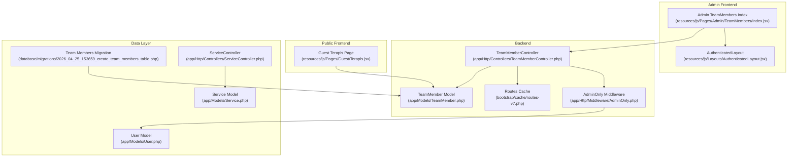
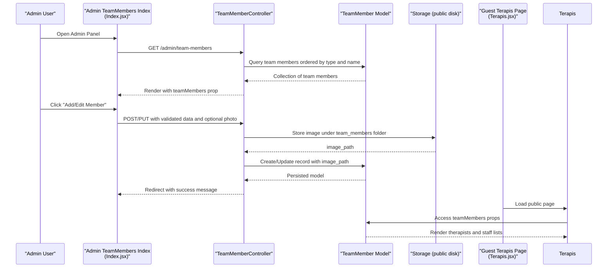
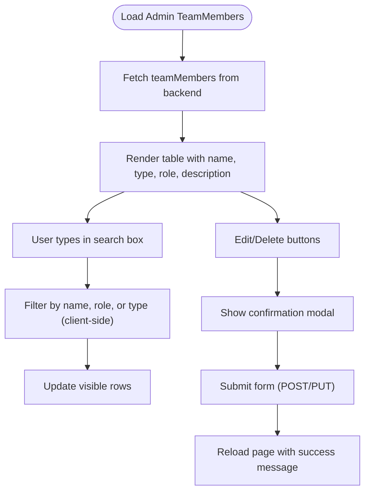
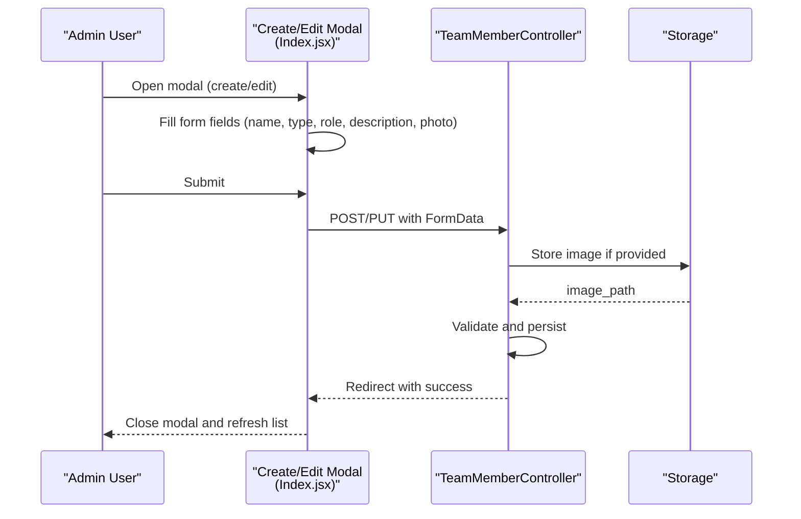
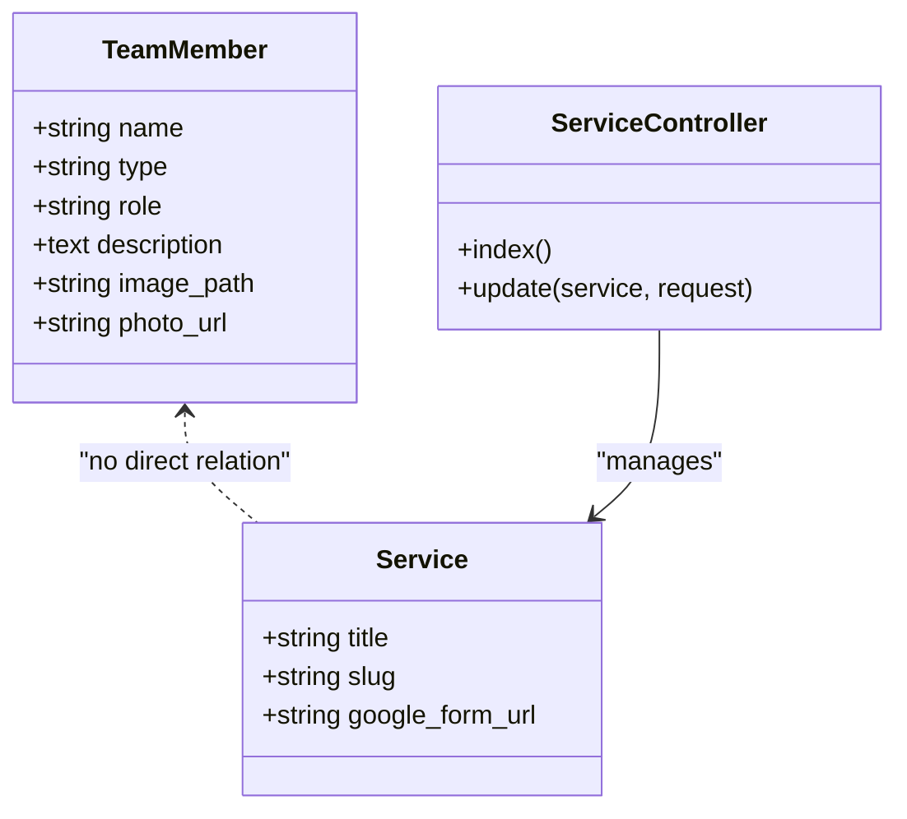
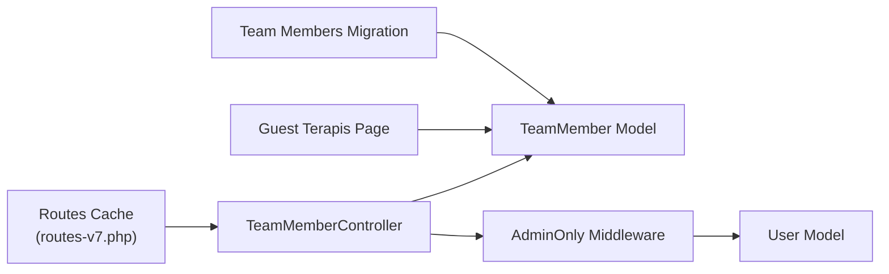

# Team Member Administration

<cite>
**Referenced Files in This Document**
- [TeamMember.php](file://app/Models/TeamMember.php)
- [TeamMemberController.php](file://app/Http/Controllers/TeamMemberController.php)
- [2026_04_25_153659_create_team_members_table.php](file://database/migrations/2026_04_25_153659_create_team_members_table.php)
- [Index.jsx](file://resources/js/Pages/Admin/TeamMembers/Index.jsx)
- [Terapis.jsx](file://resources/js/Pages/Guest/Terapis.jsx)
- [AdminOnly.php](file://app/Http/Middleware/AdminOnly.php)
- [AuthenticatedLayout.jsx](file://resources/js/Layouts/AuthenticatedLayout.jsx)
- [routes-v7.php](file://bootstrap/cache/routes-v7.php)
- [Service.php](file://app/Models/Service.php)
- [ServiceController.php](file://app/Http/Controllers/ServiceController.php)
- [User.php](file://app/Models/User.php)
- [DatabaseSeeder.php](file://database/seeders/DatabaseSeeder.php)
- [ServiceSeeder.php](file://database/seeders/ServiceSeeder.php)
</cite>

## Table of Contents
1. [Introduction](#introduction)
2. [Project Structure](#project-structure)
3. [Core Components](#core-components)
4. [Architecture Overview](#architecture-overview)
5. [Detailed Component Analysis](#detailed-component-analysis)
6. [Dependency Analysis](#dependency-analysis)
7. [Performance Considerations](#performance-considerations)
8. [Troubleshooting Guide](#troubleshooting-guide)
9. [Conclusion](#conclusion)

## Introduction
This document describes the Team Member Administration system, focusing on expert profile management, team member listing and filtering, profile editing workflows, and the relationship between team members and services. It also covers scheduling integration and appointment management features, providing practical examples for adding new team members, updating professional information, and managing visibility.

## Project Structure
The system spans backend Eloquent models and controllers, frontend Inertia pages, and routing/middleware that enforce administrative access. Public-facing team member presentation is handled separately for guests.

**Diagram sources**
- [Index.jsx:1-374](file://resources/js/Pages/Admin/TeamMembers/Index.jsx#L1-L374)
- [TeamMemberController.php:1-72](file://app/Http/Controllers/TeamMemberController.php#L1-L72)
- [TeamMember.php:1-24](file://app/Models/TeamMember.php#L1-L24)
- [routes-v7.php:2254-2438](file://bootstrap/cache/routes-v7.php#L2254-L2438)
- [AdminOnly.php:1-25](file://app/Http/Middleware/AdminOnly.php#L1-L25)
- [AuthenticatedLayout.jsx:1-54](file://resources/js/Layouts/AuthenticatedLayout.jsx#L1-L54)
- [Terapis.jsx:1-342](file://resources/js/Pages/Guest/Terapis.jsx#L1-L342)
- [2026_04_25_153659_create_team_members_table.php:1-33](file://database/migrations/2026_04_25_153659_create_team_members_table.php#L1-L33)
- [Service.php:1-15](file://app/Models/Service.php#L1-L15)
- [ServiceController.php:1-31](file://app/Http/Controllers/ServiceController.php#L1-L31)
- [User.php:1-47](file://app/Models/User.php#L1-L47)

**Section sources**
- [Index.jsx:1-374](file://resources/js/Pages/Admin/TeamMembers/Index.jsx#L1-L374)
- [TeamMemberController.php:1-72](file://app/Http/Controllers/TeamMemberController.php#L1-L72)
- [TeamMember.php:1-24](file://app/Models/TeamMember.php#L1-L24)
- [routes-v7.php:2254-2438](file://bootstrap/cache/routes-v7.php#L2254-L2438)
- [AdminOnly.php:1-25](file://app/Http/Middleware/AdminOnly.php#L1-L25)
- [AuthenticatedLayout.jsx:1-54](file://resources/js/Layouts/AuthenticatedLayout.jsx#L1-L54)
- [Terapis.jsx:1-342](file://resources/js/Pages/Guest/Terapis.jsx#L1-L342)
- [2026_04_25_153659_create_team_members_table.php:1-33](file://database/migrations/2026_04_25_153659_create_team_members_table.php#L1-L33)
- [Service.php:1-15](file://app/Models/Service.php#L1-L15)
- [ServiceController.php:1-31](file://app/Http/Controllers/ServiceController.php#L1-L31)
- [User.php:1-47](file://app/Models/User.php#L1-L47)

## Core Components
- TeamMember model: Defines fillable attributes, appends computed photo URL, and provides storage path resolution.
- TeamMemberController: Handles listing, creation, update, and deletion of team members with photo upload support and validation.
- Admin TeamMembers Index page: Provides search/filtering, create/edit modal, and confirmation dialogs.
- Guest Terapis page: Displays team members publicly, separating therapists and staff.
- AdminOnly middleware: Restricts access to administrative routes based on user roles.
- Service model/controller: Manages service metadata and Google Form links for appointment booking.

**Section sources**
- [TeamMember.php:1-24](file://app/Models/TeamMember.php#L1-L24)
- [TeamMemberController.php:1-72](file://app/Http/Controllers/TeamMemberController.php#L1-L72)
- [Index.jsx:1-374](file://resources/js/Pages/Admin/TeamMembers/Index.jsx#L1-L374)
- [Terapis.jsx:1-342](file://resources/js/Pages/Guest/Terapis.jsx#L1-L342)
- [AdminOnly.php:1-25](file://app/Http/Middleware/AdminOnly.php#L1-L25)
- [Service.php:1-15](file://app/Models/Service.php#L1-L15)
- [ServiceController.php:1-31](file://app/Http/Controllers/ServiceController.php#L1-L31)

## Architecture Overview
The system follows a classic MVC pattern with Inertia for full-stack SPA-like behavior. Administrative actions are protected by middleware and routed through dedicated controller actions. Team member photos are stored in the public disk and resolved via asset URLs.

**Diagram sources**
- [Index.jsx:13-18](file://resources/js/Pages/Admin/TeamMembers/Index.jsx#L13-L18)
- [TeamMemberController.php:13-18](file://app/Http/Controllers/TeamMemberController.php#L13-L18)
- [TeamMemberController.php:20-37](file://app/Http/Controllers/TeamMemberController.php#L20-L37)
- [TeamMemberController.php:39-59](file://app/Http/Controllers/TeamMemberController.php#L39-L59)
- [TeamMember.php:9-22](file://app/Models/TeamMember.php#L9-L22)
- [Terapis.jsx:31-44](file://resources/js/Pages/Guest/Terapis.jsx#L31-L44)

## Detailed Component Analysis

### Expert Profile Management
- Personal Information: name, role/title, and optional description.
- Qualifications and Specialties: captured via role field; description supports additional details.
- Professional Credentials: managed as part of the profile; no separate credential table exists.
- Photo Management: optional image upload with validation and storage under the public disk.

Implementation highlights:
- Validation ensures required fields and acceptable image formats.
- Image storage path is persisted and resolved to a public asset URL.
- Editing replaces existing images and cleans up old files when present.

**Section sources**
- [TeamMemberController.php:22-28](file://app/Http/Controllers/TeamMemberController.php#L22-L28)
- [TeamMemberController.php:41-47](file://app/Http/Controllers/TeamMemberController.php#L41-L47)
- [TeamMember.php:9-22](file://app/Models/TeamMember.php#L9-L22)

### Team Member Listing Interface
- Filtering: Real-time client-side filtering by name, role, and type.
- Sorting: Backend ordering by type then name.
- Actions: Inline edit and delete with confirmation modals.
- Presentation: Table layout with photo preview and role/description.

**Diagram sources**
- [Index.jsx:23-33](file://resources/js/Pages/Admin/TeamMembers/Index.jsx#L23-L33)
- [Index.jsx:80-107](file://resources/js/Pages/Admin/TeamMembers/Index.jsx#L80-L107)
- [TeamMemberController.php:13-18](file://app/Http/Controllers/TeamMemberController.php#L13-L18)

**Section sources**
- [Index.jsx:23-33](file://resources/js/Pages/Admin/TeamMembers/Index.jsx#L23-L33)
- [Index.jsx:149-211](file://resources/js/Pages/Admin/TeamMembers/Index.jsx#L149-L211)
- [TeamMemberController.php:13-18](file://app/Http/Controllers/TeamMemberController.php#L13-L18)

### Profile Editing Workflow
- Photo Upload: Click-to-upload area previews selected image; replaces existing when editing.
- Biography Management: Role and description fields editable via modal.
- Contact Information: Not exposed in current model; future extension would require migration and controller updates.
- Validation and Persistence: Strict validation enforced; successful updates return to previous state with feedback.

**Diagram sources**
- [Index.jsx:58-69](file://resources/js/Pages/Admin/TeamMembers/Index.jsx#L58-L69)
- [Index.jsx:80-107](file://resources/js/Pages/Admin/TeamMembers/Index.jsx#L80-L107)
- [TeamMemberController.php:20-37](file://app/Http/Controllers/TeamMemberController.php#L20-L37)
- [TeamMemberController.php:39-59](file://app/Http/Controllers/TeamMemberController.php#L39-L59)

**Section sources**
- [Index.jsx:58-69](file://resources/js/Pages/Admin/TeamMembers/Index.jsx#L58-L69)
- [Index.jsx:297-328](file://resources/js/Pages/Admin/TeamMembers/Index.jsx#L297-L328)
- [TeamMemberController.php:20-37](file://app/Http/Controllers/TeamMemberController.php#L20-L37)
- [TeamMemberController.php:39-59](file://app/Http/Controllers/TeamMemberController.php#L39-L59)

### Examples and Workflows

#### Adding a New Team Member
- Navigate to Admin Team Members and click "Add Member".
- Fill in name, type (terapis/staf), role, optional description, and select a photo.
- Submit; the system validates inputs, stores the image, and persists the record.

**Section sources**
- [Index.jsx:44-56](file://resources/js/Pages/Admin/TeamMembers/Index.jsx#L44-L56)
- [TeamMemberController.php:20-37](file://app/Http/Controllers/TeamMemberController.php#L20-L37)

#### Updating Professional Information
- Open the edit modal for an existing member.
- Modify role and description; optionally replace the photo.
- Submit to update the record and refresh the list.

**Section sources**
- [Index.jsx:58-69](file://resources/js/Pages/Admin/TeamMembers/Index.jsx#L58-L69)
- [TeamMemberController.php:39-59](file://app/Http/Controllers/TeamMemberController.php#L39-L59)

#### Managing Team Member Visibility
- Visibility is controlled by whether records exist in the database; there is no explicit visibility toggle in the current model.
- Public display is filtered client-side by type (terapis vs staf) on the guest page.

**Section sources**
- [Terapis.jsx:34-44](file://resources/js/Pages/Guest/Terapis.jsx#L34-L44)

### Relationship Between Team Members and Services
- Services are managed independently with titles, slugs, and Google Form links.
- Appointment management integrates via Google Forms configured per service.
- No direct foreign key relationship exists between TeamMember and Service in the current schema.

**Diagram sources**
- [TeamMember.php:9-22](file://app/Models/TeamMember.php#L9-L22)
- [Service.php:9-14](file://app/Models/Service.php#L9-L14)
- [ServiceController.php:11-29](file://app/Http/Controllers/ServiceController.php#L11-L29)

**Section sources**
- [Service.php:1-15](file://app/Models/Service.php#L1-15)
- [ServiceController.php:1-31](file://app/Http/Controllers/ServiceController.php#L1-L31)
- [ServiceSeeder.php:13-56](file://database/seeders/ServiceSeeder.php#L13-L56)

### Scheduling Integration and Appointment Management
- Each service exposes a Google Form URL for appointment requests.
- Administrators configure these links through the Services admin page.
- Users access services from the public site and are redirected to external forms.

**Section sources**
- [ServiceController.php:18-29](file://app/Http/Controllers/ServiceController.php#L18-L29)
- [ServiceSeeder.php:15-51](file://database/seeders/ServiceSeeder.php#L15-L51)

## Dependency Analysis
Administrative access is enforced centrally; routes for team members are prefixed with admin and protected by middleware. The TeamMember model depends on Laravel's Eloquent and asset helpers for photo URL generation.

**Diagram sources**
- [routes-v7.php:2254-2438](file://bootstrap/cache/routes-v7.php#L2254-L2438)
- [TeamMemberController.php:1-72](file://app/Http/Controllers/TeamMemberController.php#L1-L72)
- [TeamMember.php:1-24](file://app/Models/TeamMember.php#L1-L24)
- [AdminOnly.php:16-23](file://app/Http/Middleware/AdminOnly.php#L16-L23)
- [User.php:32-45](file://app/Models/User.php#L32-L45)
- [Terapis.jsx:1-342](file://resources/js/Pages/Guest/Terapis.jsx#L1-L342)
- [2026_04_25_153659_create_team_members_table.php:14-22](file://database/migrations/2026_04_25_153659_create_team_members_table.php#L14-L22)

**Section sources**
- [routes-v7.php:2254-2438](file://bootstrap/cache/routes-v7.php#L2254-L2438)
- [AdminOnly.php:16-23](file://app/Http/Middleware/AdminOnly.php#L16-L23)
- [User.php:32-45](file://app/Models/User.php#L32-L45)
- [2026_04_25_153659_create_team_members_table.php:14-22](file://database/migrations/2026_04_25_153659_create_team_members_table.php#L14-L22)

## Performance Considerations
- Image uploads: Limit file size and supported formats to reduce processing overhead.
- Pagination: Current listing retrieves all records; consider pagination for large datasets.
- Asset delivery: Serve images via CDN-backed storage for improved load times.
- Client-side filtering: Efficient for small to medium lists; consider server-side filtering for larger datasets.

## Troubleshooting Guide
- Access Denied: Ensure the logged-in user has admin/editor privileges; otherwise middleware blocks access.
- Photo Upload Issues: Verify storage permissions and that the public disk is writable.
- Missing Images: Confirm image_path values and that assets are served from the storage/public symlink.

**Section sources**
- [AdminOnly.php:16-23](file://app/Http/Middleware/AdminOnly.php#L16-L23)
- [TeamMemberController.php:30-32](file://app/Http/Controllers/TeamMemberController.php#L30-L32)
- [TeamMemberController.php:49-54](file://app/Http/Controllers/TeamMemberController.php#L49-L54)
- [TeamMember.php:19-22](file://app/Models/TeamMember.php#L19-L22)

## Conclusion
The Team Member Administration system provides a streamlined interface for managing profiles, photos, and roles, with clear separation between admin and public views. While the current model does not include specialized fields for qualifications or location-based filters, the architecture supports straightforward extensions for enhanced functionality and deeper integration with services and scheduling systems.