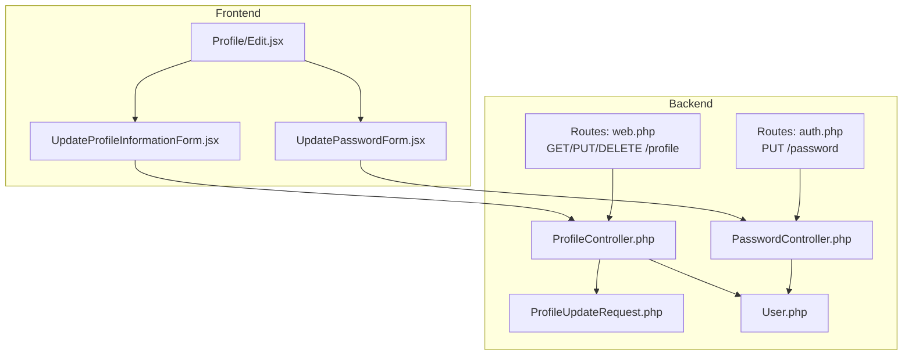
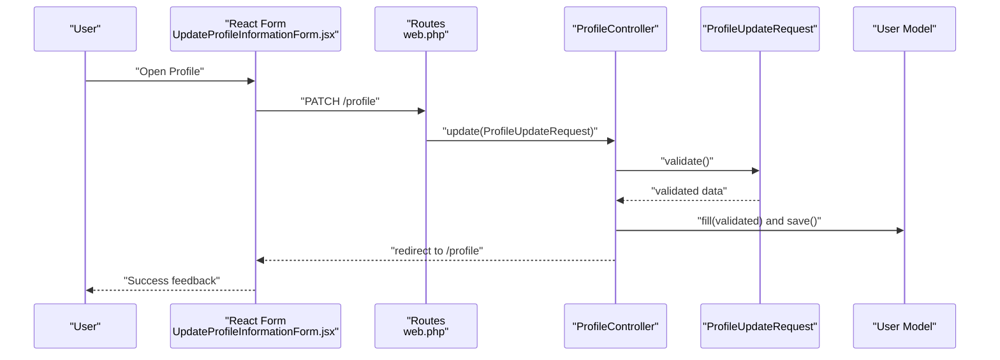
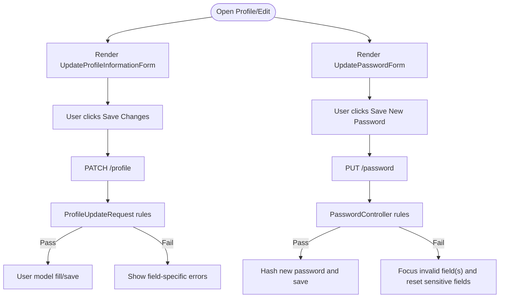
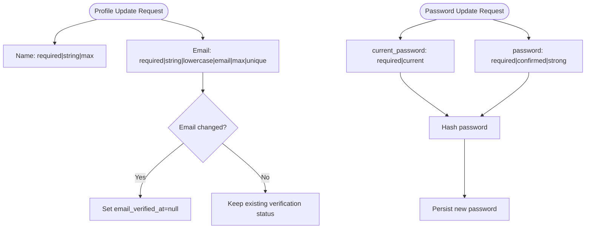
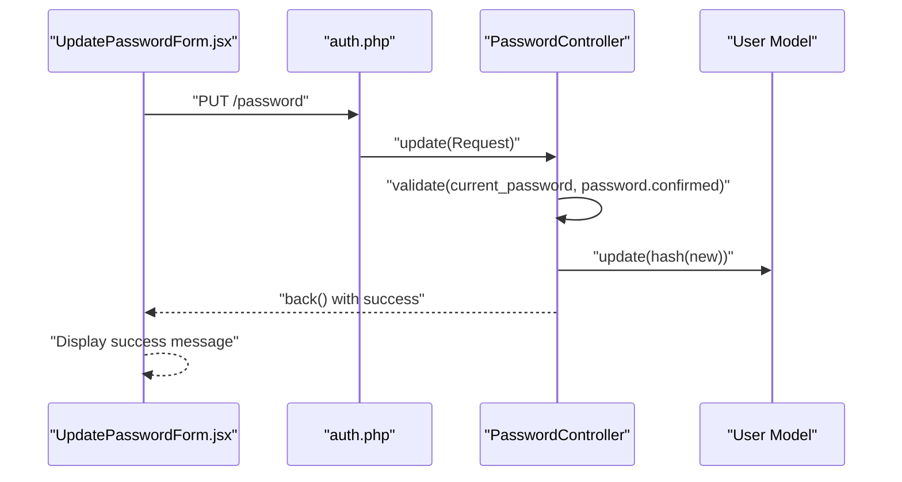
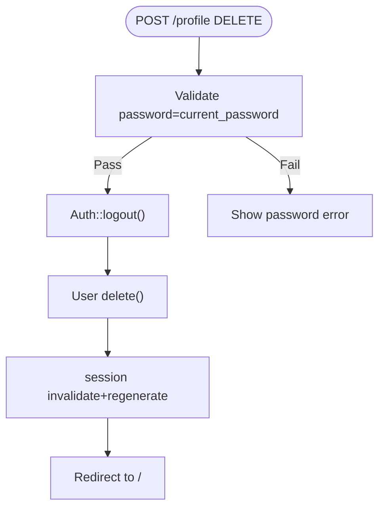
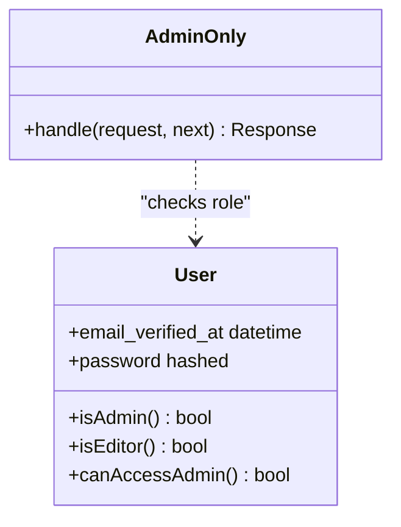
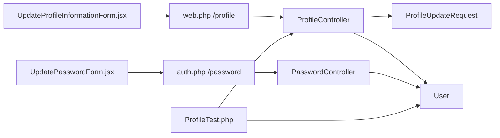

# User Profile Management

<cite>
**Referenced Files in This Document**
- [ProfileController.php](file://app/Http/Controllers/ProfileController.php)
- [PasswordController.php](file://app/Http/Controllers/Auth/PasswordController.php)
- [ProfileUpdateRequest.php](file://app/Http/Requests/ProfileUpdateRequest.php)
- [User.php](file://app/Models/User.php)
- [web.php](file://routes/web.php)
- [auth.php](file://routes/auth.php)
- [Edit.jsx](file://resources/js/Pages/Profile/Edit.jsx)
- [UpdateProfileInformationForm.jsx](file://resources/js/Pages/Profile/Partials/UpdateProfileInformationForm.jsx)
- [UpdatePasswordForm.jsx](file://resources/js/Pages/Profile/Partials/UpdatePasswordForm.jsx)
- [AdminOnly.php](file://app/Http/Middleware/AdminOnly.php)
- [ProfileTest.php](file://tests/Feature/ProfileTest.php)
</cite>

## Table of Contents
1. [Introduction](#introduction)
2. [Project Structure](#project-structure)
3. [Core Components](#core-components)
4. [Architecture Overview](#architecture-overview)
5. [Detailed Component Analysis](#detailed-component-analysis)
6. [Dependency Analysis](#dependency-analysis)
7. [Performance Considerations](#performance-considerations)
8. [Troubleshooting Guide](#troubleshooting-guide)
9. [Conclusion](#conclusion)

## Introduction
This document explains the user profile management functionality in the application. It covers the profile editing interface for updating personal information and passwords, validation rules and security measures, the end-to-end update workflow, and how profile changes relate to administrative oversight and account security. It also outlines common tasks, best practices, and the integration between frontend and backend components.

## Project Structure
Profile management spans three layers:
- Backend (Laravel):
  - Routes define endpoints for viewing and updating profile information and deleting accounts.
  - Controllers handle requests, enforce authentication, and coordinate model updates.
  - Form Requests validate incoming data.
  - Models encapsulate user attributes and roles.
- Frontend (Inertia + React):
  - Profile page renders two partials: one for updating personal information and another for changing the password.
  - Forms use Inertia’s reactive state and submit via HTTP verbs mapped by routes.

**Diagram sources**
- [web.php:145-152](file://routes/web.php#L145-L152)
- [auth.php:33-43](file://routes/auth.php#L33-L43)
- [ProfileController.php:14-63](file://app/Http/Controllers/ProfileController.php#L14-L63)
- [PasswordController.php:11-29](file://app/Http/Controllers/Auth/PasswordController.php#L11-L29)
- [ProfileUpdateRequest.php:10-31](file://app/Http/Requests/ProfileUpdateRequest.php#L10-L31)
- [User.php:15-46](file://app/Models/User.php#L15-L46)
- [Edit.jsx:6-34](file://resources/js/Pages/Profile/Edit.jsx#L6-L34)
- [UpdateProfileInformationForm.jsx:8-94](file://resources/js/Pages/Profile/Partials/UpdateProfileInformationForm.jsx#L8-L94)
- [UpdatePasswordForm.jsx:9-146](file://resources/js/Pages/Profile/Partials/UpdatePasswordForm.jsx#L9-L146)

**Section sources**
- [web.php:145-152](file://routes/web.php#L145-L152)
- [auth.php:33-43](file://routes/auth.php#L33-L43)
- [ProfileController.php:14-63](file://app/Http/Controllers/ProfileController.php#L14-L63)
- [PasswordController.php:11-29](file://app/Http/Controllers/Auth/PasswordController.php#L11-L29)
- [ProfileUpdateRequest.php:10-31](file://app/Http/Requests/ProfileUpdateRequest.php#L10-L31)
- [User.php:15-46](file://app/Models/User.php#L15-L46)
- [Edit.jsx:6-34](file://resources/js/Pages/Profile/Edit.jsx#L6-L34)
- [UpdateProfileInformationForm.jsx:8-94](file://resources/js/Pages/Profile/Partials/UpdateProfileInformationForm.jsx#L8-L94)
- [UpdatePasswordForm.jsx:9-146](file://resources/js/Pages/Profile/Partials/UpdatePasswordForm.jsx#L9-L146)

## Core Components
- ProfileController: Renders the profile page, validates and updates user information, and handles account deletion after confirming the current password.
- PasswordController: Validates and updates the user’s password using Laravel’s built-in password rules and hashing.
- ProfileUpdateRequest: Defines strict validation rules for name and email during profile updates.
- User Model: Holds user attributes, role-based permissions, and password hashing.
- Frontend Forms:
  - UpdateProfileInformationForm: Handles PATCH to update name and email.
  - UpdatePasswordForm: Handles PUT to change the password with confirmation and error focus behavior.
- Routes: Expose endpoints for profile editing, updating, and deleting; and for password updates.

Key responsibilities:
- Personal information updates: validated by ProfileUpdateRequest, persisted via ProfileController.
- Password changes: validated and hashed by PasswordController.
- Account deletion: requires current password verification and clears session/token.

**Section sources**
- [ProfileController.php:19-41](file://app/Http/Controllers/ProfileController.php#L19-L41)
- [PasswordController.php:16-27](file://app/Http/Controllers/Auth/PasswordController.php#L16-L27)
- [ProfileUpdateRequest.php:17-29](file://app/Http/Requests/ProfileUpdateRequest.php#L17-L29)
- [User.php:25-31](file://app/Models/User.php#L25-L31)
- [UpdateProfileInformationForm.jsx:14-24](file://resources/js/Pages/Profile/Partials/UpdateProfileInformationForm.jsx#L14-L24)
- [UpdatePasswordForm.jsx:13-44](file://resources/js/Pages/Profile/Partials/UpdatePasswordForm.jsx#L13-L44)
- [web.php:145-152](file://routes/web.php#L145-L152)
- [auth.php:39](file://routes/auth.php#L39)

## Architecture Overview
The profile management flow integrates frontend and backend through Inertia. The frontend renders forms and submits HTTP requests; the backend enforces authentication, applies validation, and persists changes.

**Diagram sources**
- [UpdateProfileInformationForm.jsx:20-24](file://resources/js/Pages/Profile/Partials/UpdateProfileInformationForm.jsx#L20-L24)
- [web.php:147](file://routes/web.php#L147)
- [ProfileController.php:30-41](file://app/Http/Controllers/ProfileController.php#L30-L41)
- [ProfileUpdateRequest.php:17-29](file://app/Http/Requests/ProfileUpdateRequest.php#L17-L29)
- [User.php:15-46](file://app/Models/User.php#L15-L46)

## Detailed Component Analysis

### Profile Editing Interface
The profile page composes two partials:
- Personal Information Form: displays name and email, binds to reactive state, and submits a PATCH to the profile update endpoint.
- Password Update Form: collects current/new/password confirmation, validates via backend rules, and resets fields on success.

**Diagram sources**
- [Edit.jsx:6-34](file://resources/js/Pages/Profile/Edit.jsx#L6-L34)
- [UpdateProfileInformationForm.jsx:14-24](file://resources/js/Pages/Profile/Partials/UpdateProfileInformationForm.jsx#L14-L24)
- [UpdatePasswordForm.jsx:13-44](file://resources/js/Pages/Profile/Partials/UpdatePasswordForm.jsx#L13-L44)
- [web.php:147](file://routes/web.php#L147)
- [auth.php:39](file://routes/auth.php#L39)
- [ProfileUpdateRequest.php:17-29](file://app/Http/Requests/ProfileUpdateRequest.php#L17-L29)
- [PasswordController.php:16-27](file://app/Http/Controllers/Auth/PasswordController.php#L16-L27)

**Section sources**
- [Edit.jsx:6-34](file://resources/js/Pages/Profile/Edit.jsx#L6-L34)
- [UpdateProfileInformationForm.jsx:8-94](file://resources/js/Pages/Profile/Partials/UpdateProfileInformationForm.jsx#L8-L94)
- [UpdatePasswordForm.jsx:9-146](file://resources/js/Pages/Profile/Partials/UpdatePasswordForm.jsx#L9-L146)

### Validation Rules and Security Measures
- Personal Information:
  - Name: required, string, max length enforced.
  - Email: required, string, lowercase, valid email format, max length, unique to current user.
  - Side effect: changing email resets email verification timestamp to force revalidation.
- Password Change:
  - Requires current password confirmation using server-side “current password” rule.
  - Enforces strong password rules and confirmation.
  - Hashes the new password before saving.
- Account Deletion:
  - Requires current password confirmation.
  - Logs out the user, deletes the record, invalidates session, and regenerates CSRF token.

**Diagram sources**
- [ProfileUpdateRequest.php:17-29](file://app/Http/Requests/ProfileUpdateRequest.php#L17-L29)
- [ProfileController.php:34-36](file://app/Http/Controllers/ProfileController.php#L34-L36)
- [PasswordController.php:18-25](file://app/Http/Controllers/Auth/PasswordController.php#L18-L25)
- [User.php:25-31](file://app/Models/User.php#L25-L31)

**Section sources**
- [ProfileUpdateRequest.php:17-29](file://app/Http/Requests/ProfileUpdateRequest.php#L17-L29)
- [ProfileController.php:34-36](file://app/Http/Controllers/ProfileController.php#L34-L36)
- [PasswordController.php:18-25](file://app/Http/Controllers/Auth/PasswordController.php#L18-L25)
- [User.php:25-31](file://app/Models/User.php#L25-L31)

### Profile Update Workflow
- Personal Information:
  - The frontend form binds name/email to reactive state and submits PATCH to the profile update route.
  - The controller validates via ProfileUpdateRequest, marks dirty fields, and saves.
  - If email changes, verification status is reset to require re-verification.
- Password:
  - The frontend form posts to the password update route.
  - The controller validates current password and new password rules, hashes the new password, and redirects back.
  - On validation errors, the form focuses the appropriate field and resets sensitive inputs.
- Success Feedback:
  - Both forms show transient success messages upon successful submission.

**Diagram sources**
- [UpdatePasswordForm.jsx:27-44](file://resources/js/Pages/Profile/Partials/UpdatePasswordForm.jsx#L27-L44)
- [auth.php:39](file://routes/auth.php#L39)
- [PasswordController.php:16-27](file://app/Http/Controllers/Auth/PasswordController.php#L16-L27)
- [User.php:29](file://app/Models/User.php#L29)

**Section sources**
- [UpdatePasswordForm.jsx:13-44](file://resources/js/Pages/Profile/Partials/UpdatePasswordForm.jsx#L13-L44)
- [auth.php:39](file://routes/auth.php#L39)
- [PasswordController.php:16-27](file://app/Http/Controllers/Auth/PasswordController.php#L16-L27)

### Account Deletion Workflow
- Requires current password confirmation.
- Logs out the user, deletes the record, invalidates the session, and regenerates the CSRF token.
- Redirects to home page.

**Diagram sources**
- [ProfileController.php:46-62](file://app/Http/Controllers/ProfileController.php#L46-L62)
- [web.php:148](file://routes/web.php#L148)

**Section sources**
- [ProfileController.php:46-62](file://app/Http/Controllers/ProfileController.php#L46-L62)
- [web.php:148](file://routes/web.php#L148)

### Administrative Oversight and Role-Based Access
- The User model exposes role checks to determine admin/editor access.
- An AdminOnly middleware restricts access to admin-only routes by checking authentication and role eligibility.
- While profile management itself is user-focused, role-awareness enables administrators to manage users and monitor activities.

**Diagram sources**
- [User.php:32-45](file://app/Models/User.php#L32-L45)
- [AdminOnly.php:16-23](file://app/Http/Middleware/AdminOnly.php#L16-L23)

**Section sources**
- [User.php:32-45](file://app/Models/User.php#L32-L45)
- [AdminOnly.php:16-23](file://app/Http/Middleware/AdminOnly.php#L16-L23)

## Dependency Analysis
- Routes depend on controllers for profile and password actions.
- Controllers depend on Form Requests for validation and on the User model for persistence.
- Frontend forms depend on Inertia routes and controllers for submission targets.
- Tests validate the profile update, email verification behavior, and account deletion flow.

**Diagram sources**
- [web.php:145-152](file://routes/web.php#L145-L152)
- [auth.php:33-43](file://routes/auth.php#L33-L43)
- [ProfileController.php:14-63](file://app/Http/Controllers/ProfileController.php#L14-L63)
- [PasswordController.php:11-29](file://app/Http/Controllers/Auth/PasswordController.php#L11-L29)
- [ProfileUpdateRequest.php:10-31](file://app/Http/Requests/ProfileUpdateRequest.php#L10-L31)
- [User.php:15-46](file://app/Models/User.php#L15-L46)
- [ProfileTest.php:13-98](file://tests/Feature/ProfileTest.php#L13-L98)

**Section sources**
- [web.php:145-152](file://routes/web.php#L145-L152)
- [auth.php:33-43](file://routes/auth.php#L33-L43)
- [ProfileController.php:14-63](file://app/Http/Controllers/ProfileController.php#L14-L63)
- [PasswordController.php:11-29](file://app/Http/Controllers/Auth/PasswordController.php#L11-L29)
- [ProfileUpdateRequest.php:10-31](file://app/Http/Requests/ProfileUpdateRequest.php#L10-L31)
- [User.php:15-46](file://app/Models/User.php#L15-L46)
- [ProfileTest.php:13-98](file://tests/Feature/ProfileTest.php#L13-L98)

## Performance Considerations
- Keep validation rules minimal yet sufficient to prevent unnecessary writes.
- Use targeted updates (only changed fields) to reduce database overhead.
- Avoid heavy computations in controllers; rely on Eloquent’s built-in casting and hashing.
- Ensure frontend disables submit buttons during processing to prevent duplicate submissions.

## Troubleshooting Guide
Common issues and resolutions:
- Email uniqueness violation:
  - Symptom: Validation error on email.
  - Cause: Another user already has the email.
  - Resolution: Choose a unique email address.
- Current password mismatch:
  - Symptom: Error on password change.
  - Cause: Provided current password does not match.
  - Resolution: Re-enter the correct current password; sensitive fields are reset and focused.
- Email verification reset:
  - Symptom: Verification prompt appears after changing email.
  - Cause: Changing email triggers a reset of verification timestamp.
  - Resolution: Complete the email verification process.
- Account deletion failure:
  - Symptom: Error requiring current password.
  - Cause: Incorrect password supplied.
  - Resolution: Enter the correct password; the form returns to the profile page with validation errors.

**Section sources**
- [ProfileUpdateRequest.php:21-28](file://app/Http/Requests/ProfileUpdateRequest.php#L21-L28)
- [PasswordController.php:18-21](file://app/Http/Controllers/Auth/PasswordController.php#L18-L21)
- [ProfileController.php:34-36](file://app/Http/Controllers/ProfileController.php#L34-L36)
- [ProfileController.php:48-50](file://app/Http/Controllers/ProfileController.php#L48-L50)
- [UpdatePasswordForm.jsx:33-43](file://resources/js/Pages/Profile/Partials/UpdatePasswordForm.jsx#L33-L43)
- [ProfileTest.php:46-62](file://tests/Feature/ProfileTest.php#L46-L62)
- [ProfileTest.php:82-98](file://tests/Feature/ProfileTest.php#L82-L98)

## Conclusion
The profile management system combines robust backend validation and security with a clean, reactive frontend. Personal information updates and password changes are handled through dedicated controllers and requests, while account deletion ensures strong safeguards. Role-based access and middleware support administrative oversight, enabling secure and auditable user management.