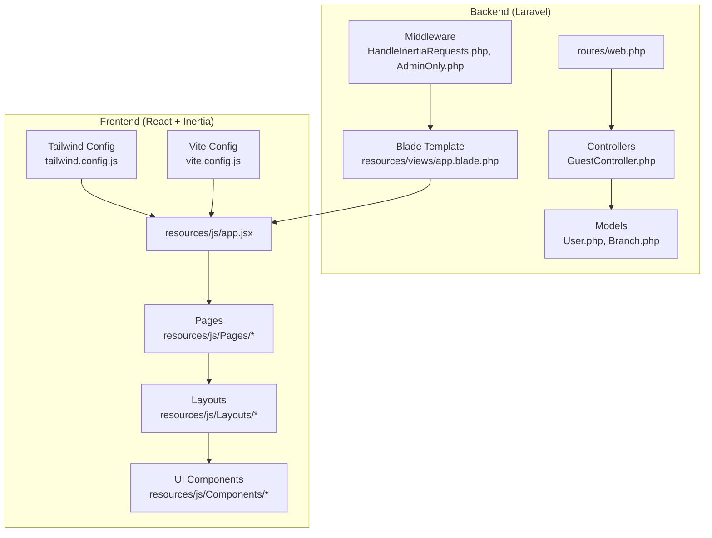
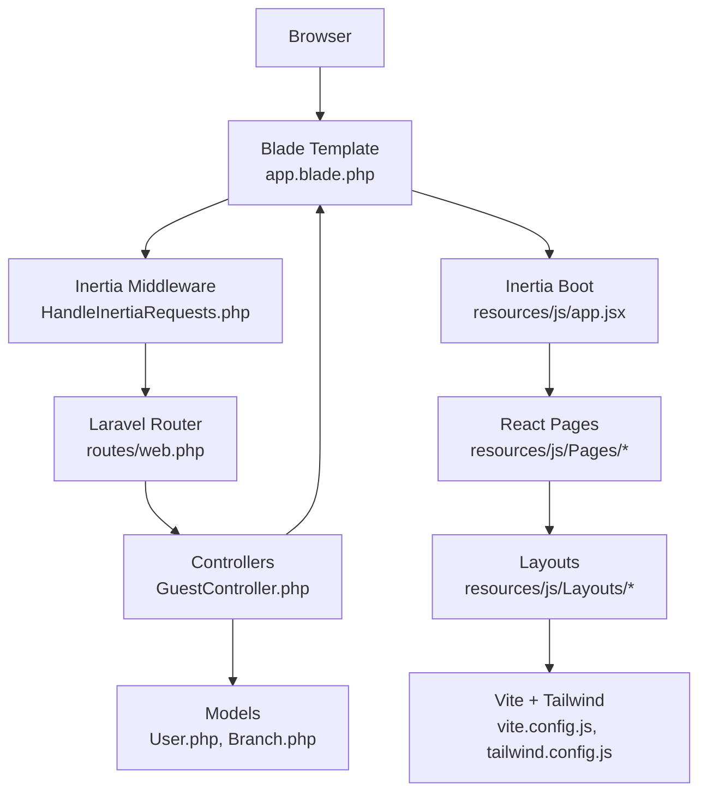
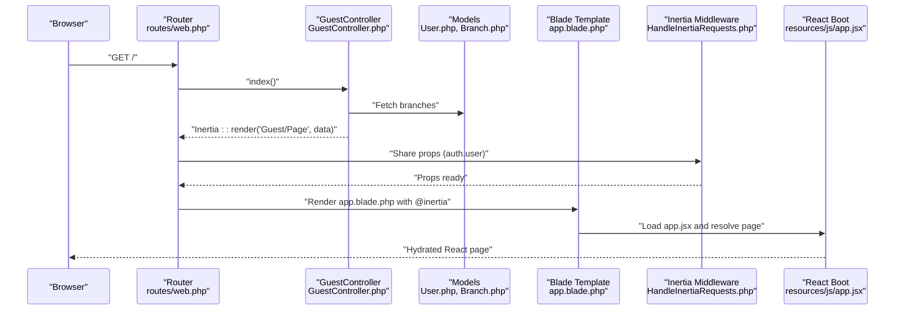
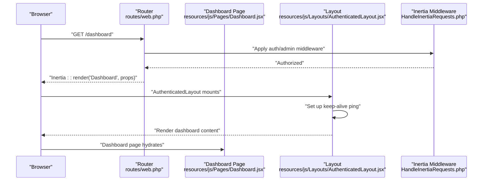
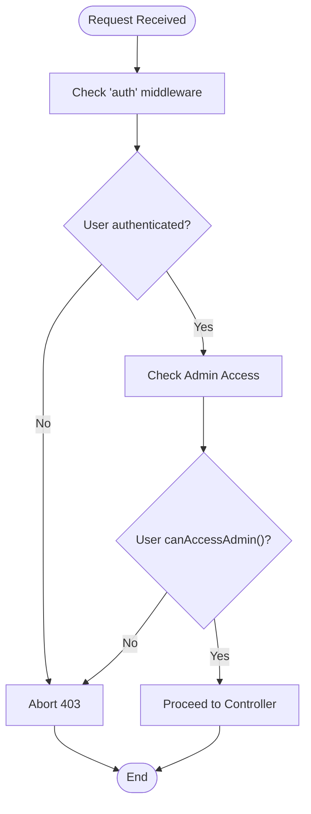
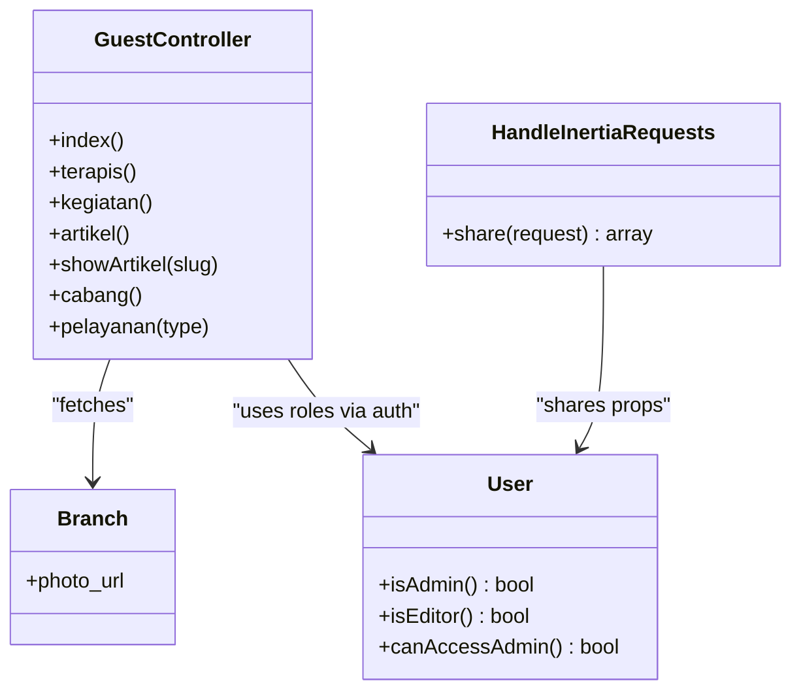
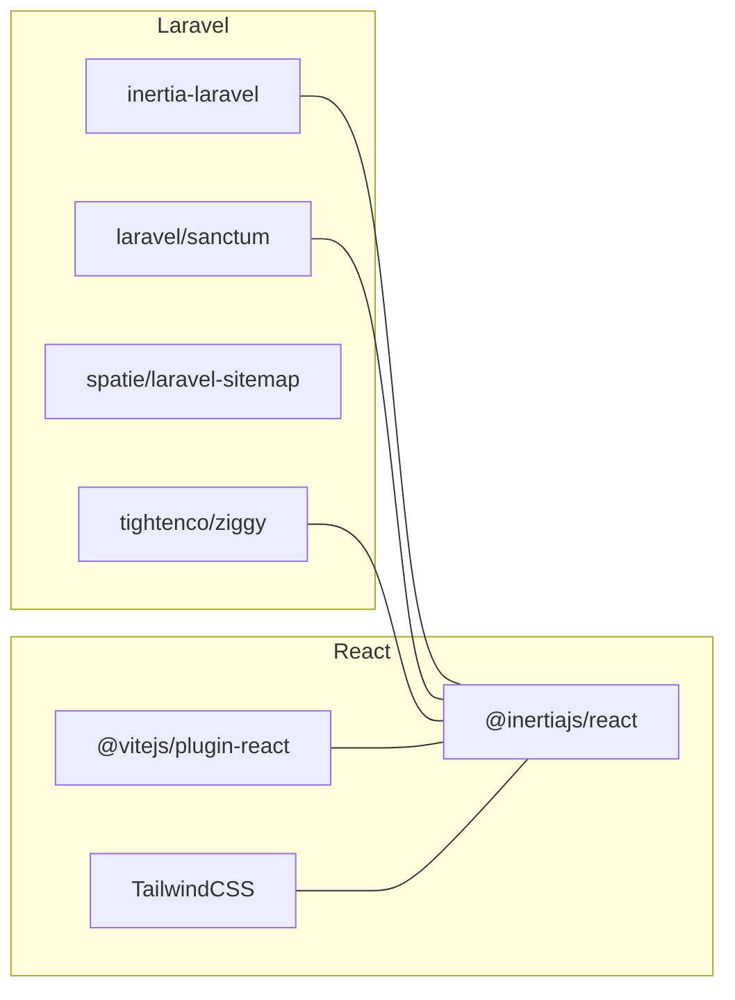

# Architecture Overview

<cite>
**Referenced Files in This Document**
- [HandleInertiaRequests.php](file://app/Http/Middleware/HandleInertiaRequests.php)
- [app.jsx](file://resources/js/app.jsx)
- [web.php](file://routes/web.php)
- [composer.json](file://composer.json)
- [package.json](file://package.json)
- [GuestController.php](file://app/Http/Controllers/GuestController.php)
- [User.php](file://app/Models/User.php)
- [Branch.php](file://app/Models/Branch.php)
- [app.blade.php](file://resources/views/app.blade.php)
- [auth.php](file://config/auth.php)
- [AdminOnly.php](file://app/Http/Middleware/AdminOnly.php)
- [AuthenticatedLayout.jsx](file://resources/js/Layouts/AuthenticatedLayout.jsx)
- [Dashboard.jsx](file://resources/js/Pages/Dashboard.jsx)
- [vite.config.js](file://vite.config.js)
- [tailwind.config.js](file://tailwind.config.js)
</cite>

## Table of Contents
1. [Introduction](#introduction)
2. [Project Structure](#project-structure)
3. [Core Components](#core-components)
4. [Architecture Overview](#architecture-overview)
5. [Detailed Component Analysis](#detailed-component-analysis)
6. [Dependency Analysis](#dependency-analysis)
7. [Performance Considerations](#performance-considerations)
8. [Troubleshooting Guide](#troubleshooting-guide)
9. [Conclusion](#conclusion)
10. [Appendices](#appendices)

## Introduction
This document describes the EDUfa system architecture, a hybrid Laravel-React application powered by Inertia.js. The system leverages Laravel’s robust backend capabilities for server-side rendering, routing, and data orchestration, while React handles interactive UI components on the client side. Inertia.js bridges the two, enabling seamless navigation and state transfer without traditional AJAX calls. The architecture emphasizes SEO-friendly server-rendered pages for public content and dynamic, reactive admin dashboards for content management.

Key goals:
- Separation of concerns: server-side rendering for SEO and client-side interactivity for admin UX.
- Clear controller-layer coordination for data fetching and view composition.
- Strong authentication and authorization boundaries.
- Scalable component interactions between controllers, models, and React pages.

## Project Structure
The project follows a layered structure:
- Backend (Laravel): Controllers, Models, Middleware, Routes, Blade templates.
- Frontend (React + Vite): Inertia-powered pages, layouts, components, and styling via TailwindCSS.
- Build tooling: Vite integrates with Laravel’s Blade to load React assets and enable hot module replacement.

**Diagram sources**
- [web.php:1-137](file://routes/web.php#L1-L137)
- [GuestController.php:14-119](file://app/Http/Controllers/GuestController.php#L14-L119)
- [User.php:15-47](file://app/Models/User.php#L15-L47)
- [Branch.php:8-36](file://app/Models/Branch.php#L8-L36)
- [HandleInertiaRequests.php:8-40](file://app/Http/Middleware/HandleInertiaRequests.php#L8-L40)
- [AdminOnly.php:9-25](file://app/Http/Middleware/AdminOnly.php#L9-L25)
- [app.blade.php:1-57](file://resources/views/app.blade.php#L1-L57)
- [app.jsx:1-26](file://resources/js/app.jsx#L1-L26)
- [vite.config.js:1-14](file://vite.config.js#L1-L14)
- [tailwind.config.js:1-42](file://tailwind.config.js#L1-L42)

**Section sources**
- [web.php:1-137](file://routes/web.php#L1-L137)
- [composer.json:1-91](file://composer.json#L1-L91)
- [package.json:1-49](file://package.json#L1-L49)
- [app.blade.php:1-57](file://resources/views/app.blade.php#L1-L57)
- [vite.config.js:1-14](file://vite.config.js#L1-L14)
- [tailwind.config.js:1-42](file://tailwind.config.js#L1-L42)

## Core Components
- Laravel backend:
  - Routing and controllers coordinate data retrieval and render Inertia responses.
  - Middleware manages shared props and access control.
  - Blade template initializes Inertia and loads assets.
- React frontend:
  - Inertia bootstrapper resolves pages and mounts them with React.
  - Pages and layouts compose UI with reusable components.
  - TailwindCSS and Vite provide styling and development ergonomics.

Key integration points:
- Inertia middleware shares authenticated user data to the client.
- Blade template injects routes, Vite assets, and Inertia head/body helpers.
- Vite plugin enables hot reload and asset resolution for React pages.

**Section sources**
- [HandleInertiaRequests.php:30-38](file://app/Http/Middleware/HandleInertiaRequests.php#L30-L38)
- [app.blade.php:26-34](file://resources/views/app.blade.php#L26-L34)
- [app.jsx:10-25](file://resources/js/app.jsx#L10-L25)
- [vite.config.js:5-13](file://vite.config.js#L5-L13)

## Architecture Overview
The hybrid architecture combines server-side rendering and client-side interactivity:
- Public pages (guest routes) are rendered server-side with Blade and hydrated by Inertia for minimal client interactivity.
- Admin pages leverage React components for rich, interactive experiences with Inertia navigation.
- Authentication and authorization are enforced via middleware and model policies.

**Diagram sources**
- [app.blade.php:26-34](file://resources/views/app.blade.php#L26-L34)
- [HandleInertiaRequests.php:30-38](file://app/Http/Middleware/HandleInertiaRequests.php#L30-L38)
- [web.php:1-137](file://routes/web.php#L1-L137)
- [GuestController.php:14-119](file://app/Http/Controllers/GuestController.php#L14-L119)
- [User.php:15-47](file://app/Models/User.php#L15-L47)
- [Branch.php:8-36](file://app/Models/Branch.php#L8-L36)
- [app.jsx:10-25](file://resources/js/app.jsx#L10-L25)
- [vite.config.js:5-13](file://vite.config.js#L5-L13)
- [tailwind.config.js:1-42](file://tailwind.config.js#L1-42)

## Detailed Component Analysis

### Request Lifecycle: Guest Route to React Page
This sequence illustrates how a guest route triggers server-side rendering and hydration to a React page.

**Diagram sources**
- [web.php:51-24](file://routes/web.php#L51-L24)
- [GuestController.php:19-24](file://app/Http/Controllers/GuestController.php#L19-L24)
- [Branch.php:8-36](file://app/Models/Branch.php#L8-L36)
- [HandleInertiaRequests.php:30-38](file://app/Http/Middleware/HandleInertiaRequests.php#L30-L38)
- [app.blade.php:26-34](file://resources/views/app.blade.php#L26-L34)
- [app.jsx:10-25](file://resources/js/app.jsx#L10-L25)

**Section sources**
- [web.php:51-24](file://routes/web.php#L51-L24)
- [GuestController.php:19-24](file://app/Http/Controllers/GuestController.php#L19-L24)
- [app.blade.php:26-34](file://resources/views/app.blade.php#L26-L34)
- [app.jsx:10-25](file://resources/js/app.jsx#L10-L25)

### Admin Dashboard: Server Rendering + Client Interactivity
Admin routes demonstrate server-rendered statistics with client-side keep-alive and layout hydration.

**Diagram sources**
- [web.php:68-80](file://routes/web.php#L68-L80)
- [Dashboard.jsx:1-215](file://resources/js/Pages/Dashboard.jsx#L1-L215)
- [AuthenticatedLayout.jsx:11-23](file://resources/js/Layouts/AuthenticatedLayout.jsx#L11-L23)
- [HandleInertiaRequests.php:30-38](file://app/Http/Middleware/HandleInertiaRequests.php#L30-L38)

**Section sources**
- [web.php:68-80](file://routes/web.php#L68-L80)
- [Dashboard.jsx:1-215](file://resources/js/Pages/Dashboard.jsx#L1-L215)
- [AuthenticatedLayout.jsx:11-23](file://resources/js/Layouts/AuthenticatedLayout.jsx#L11-L23)

### Authentication and Authorization Flow
The system enforces authentication and role-based access control across routes and middleware.

**Diagram sources**
- [AdminOnly.php:16-23](file://app/Http/Middleware/AdminOnly.php#L16-L23)
- [User.php:32-45](file://app/Models/User.php#L32-L45)

**Section sources**
- [AdminOnly.php:16-23](file://app/Http/Middleware/AdminOnly.php#L16-L23)
- [User.php:32-45](file://app/Models/User.php#L32-L45)
- [auth.php:40-74](file://config/auth.php#L40-L74)

### Component Interactions: Controllers, Models, and React
- Controllers fetch data from models and pass it to Inertia-rendered views/pages.
- React pages consume props and render UI; layouts manage global state and UX.
- Middleware ensures shared props (e.g., authenticated user) are available to React components.

**Diagram sources**
- [GuestController.php:14-119](file://app/Http/Controllers/GuestController.php#L14-L119)
- [User.php:32-45](file://app/Models/User.php#L32-L45)
- [Branch.php:21-34](file://app/Models/Branch.php#L21-L34)
- [HandleInertiaRequests.php:30-38](file://app/Http/Middleware/HandleInertiaRequests.php#L30-L38)

**Section sources**
- [GuestController.php:14-119](file://app/Http/Controllers/GuestController.php#L14-L119)
- [User.php:32-45](file://app/Models/User.php#L32-L45)
- [Branch.php:21-34](file://app/Models/Branch.php#L21-L34)
- [HandleInertiaRequests.php:30-38](file://app/Http/Middleware/HandleInertiaRequests.php#L30-L38)

## Dependency Analysis
- Laravel dependencies:
  - inertia-laravel: Enables server-side rendering and shared props.
  - laravel/sanctum: Provides stateful API authentication.
  - spatie/laravel-sitemap: Generates sitemaps for SEO.
  - tightenco/ziggy: Bridges Laravel routes to JavaScript.
- Frontend dependencies:
  - @inertiajs/react: React adapter for Inertia.
  - @vitejs/plugin-react: React plugin for Vite.
  - TailwindCSS ecosystem: Forms, typography, and Vite integration.
- Build and tooling:
  - Vite: Asset pipeline and HMR.
  - Tailwind: Utility-first CSS framework.

**Diagram sources**
- [composer.json:8-16](file://composer.json#L8-L16)
- [package.json:9-23](file://package.json#L9-L23)

**Section sources**
- [composer.json:8-16](file://composer.json#L8-L16)
- [package.json:9-23](file://package.json#L9-L23)

## Performance Considerations
- Server-side rendering for public pages reduces initial JavaScript payload and improves SEO.
- Inertia’s prop sharing minimizes redundant network requests by passing pre-fetched data to React.
- Keep-alive pings in authenticated layouts help maintain session liveness without disrupting UX.
- TailwindCSS purging and Vite’s production builds optimize asset delivery.
- Database queries in controllers should leverage eager loading and selective field selection to reduce overhead.

[No sources needed since this section provides general guidance]

## Troubleshooting Guide
Common areas to inspect:
- Authentication failures: Verify middleware guards and user role checks.
- Props not reaching React: Confirm shared props in Inertia middleware and Blade template inclusion.
- Asset loading issues: Ensure Vite plugin and Blade directives are present.
- Route resolution errors: Confirm page component paths match Inertia boot resolver.

**Section sources**
- [AdminOnly.php:16-23](file://app/Http/Middleware/AdminOnly.php#L16-L23)
- [HandleInertiaRequests.php:30-38](file://app/Http/Middleware/HandleInertiaRequests.php#L30-L38)
- [app.blade.php:26-34](file://resources/views/app.blade.php#L26-L34)
- [vite.config.js:5-13](file://vite.config.js#L5-L13)

## Conclusion
EDUfa’s hybrid architecture balances SEO-friendly server-side rendering with modern, interactive client experiences. Laravel’s routing, controllers, and middleware coordinate data and access control, while Inertia and React deliver responsive admin interfaces. The chosen stack—Laravel 13, React 18, Inertia.js 2.0, TailwindCSS—provides a scalable foundation for content-rich, user-focused applications.

[No sources needed since this section summarizes without analyzing specific files]

## Appendices

### Technology Stack
- Backend: Laravel 13, Inertia Laravel, Sanctum, Ziggy, Sitemap
- Frontend: React 18, Inertia.js React, Vite, TailwindCSS
- Supporting libraries: Radix UI, TipTap, Framer Motion, Leaflet, GSAP

**Section sources**
- [composer.json:8-16](file://composer.json#L8-L16)
- [package.json:9-49](file://package.json#L9-L49)

### Deployment Topology and Infrastructure Requirements
- Web server: Nginx/Apache serving Laravel public/index.php.
- PHP runtime: PHP 8.3+ with OPCache enabled.
- Database: MySQL/PostgreSQL compatible with Laravel 13.
- Queue worker: Laravel queue listener for background jobs.
- Static assets: Vite build artifacts served by Laravel.
- Environment: HTTPS termination at the load balancer/proxy.

[No sources needed since this section provides general guidance]