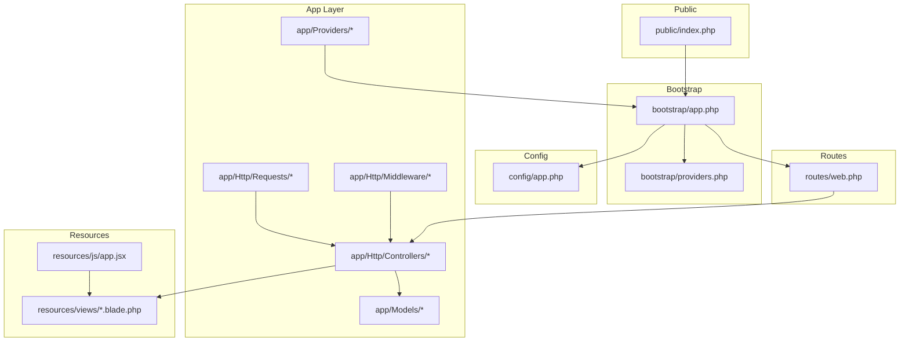
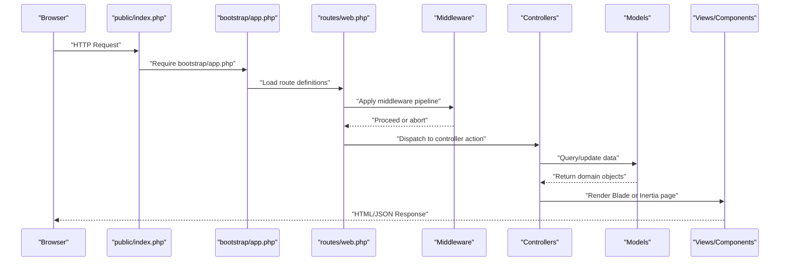
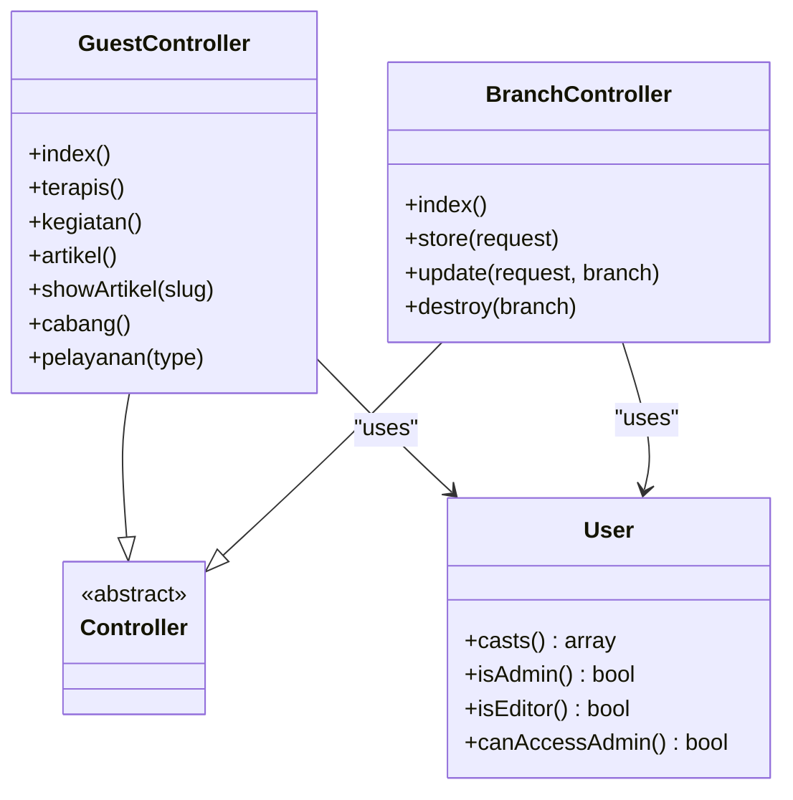
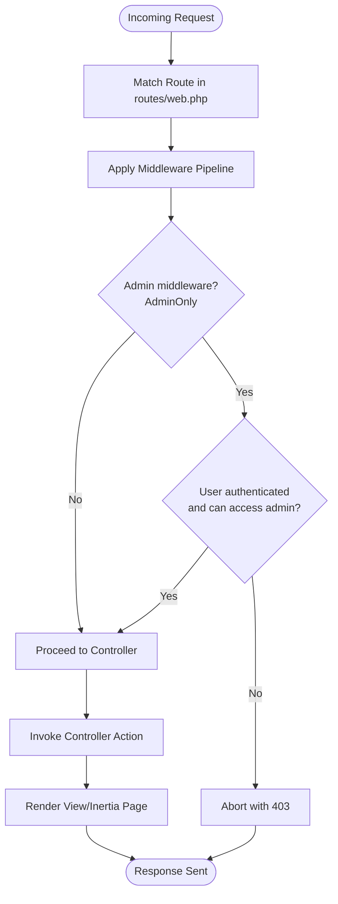
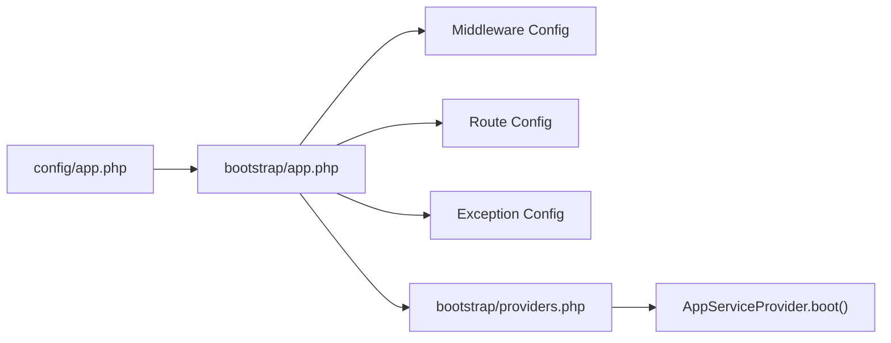
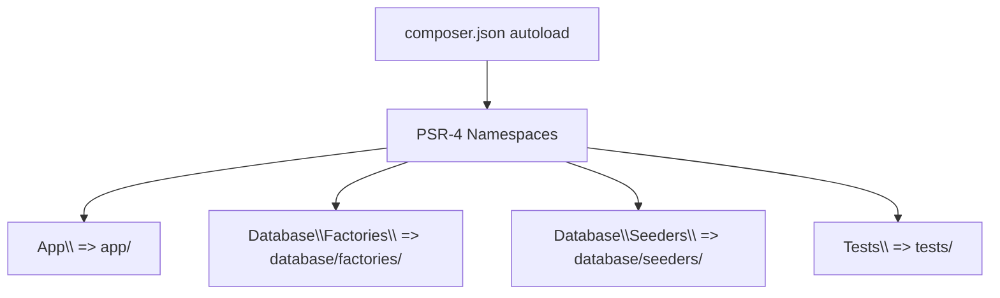
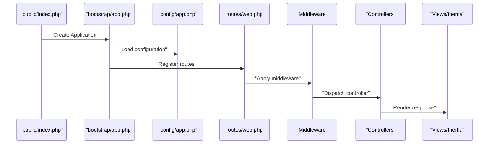
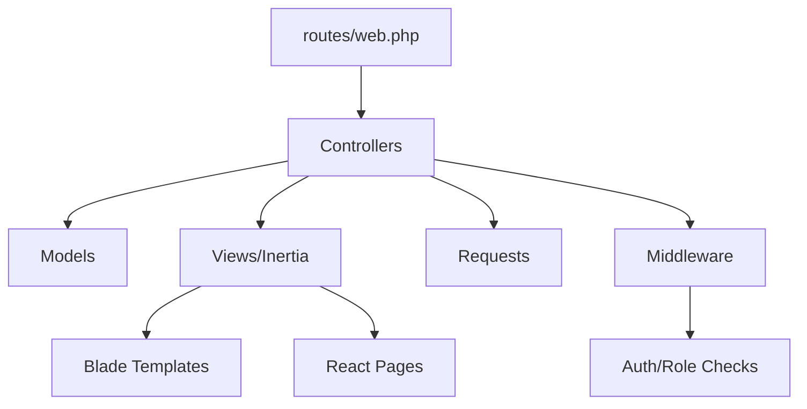

# Application Structure and Conventions

<cite>
**Referenced Files in This Document**
- [public/index.php](file://public/index.php)
- [bootstrap/app.php](file://bootstrap/app.php)
- [bootstrap/providers.php](file://bootstrap/providers.php)
- [config/app.php](file://config/app.php)
- [composer.json](file://composer.json)
- [routes/web.php](file://routes/web.php)
- [app/Http/Controllers/Controller.php](file://app/Http/Controllers/Controller.php)
- [app/Http/Controllers/GuestController.php](file://app/Http/Controllers/GuestController.php)
- [app/Http/Controllers/BranchController.php](file://app/Http/Controllers/BranchController.php)
- [app/Models/User.php](file://app/Models/User.php)
- [app/Http/Middleware/AdminOnly.php](file://app/Http/Middleware/AdminOnly.php)
- [app/Http/Requests/Auth/LoginRequest.php](file://app/Http/Requests/Auth/LoginRequest.php)
- [app/Providers/AppServiceProvider.php](file://app/Providers/AppServiceProvider.php)
- [resources/views/app.blade.php](file://resources/views/app.blade.php)
- [resources/js/app.jsx](file://resources/js/app.jsx)
</cite>

## Table of Contents
1. [Introduction](#introduction)
2. [Project Structure](#project-structure)
3. [Core Components](#core-components)
4. [Architecture Overview](#architecture-overview)
5. [Detailed Component Analysis](#detailed-component-analysis)
6. [Dependency Analysis](#dependency-analysis)
7. [Performance Considerations](#performance-considerations)
8. [Troubleshooting Guide](#troubleshooting-guide)
9. [Conclusion](#conclusion)

## Introduction
This document explains the Laravel application structure and conventions used in this project. It focuses on how the Model-View-Controller (MVC) pattern is implemented, how directories are organized, and how Laravel’s bootstrap, routing, middleware, configuration, autoloading, dependency injection, and lifecycle work together. Practical examples illustrate how controllers, models, requests, middleware, and views integrate within the application.

## Project Structure
The Laravel application follows a conventional structure with clear separation of concerns. Key directories and their roles:
- app/: Contains application logic (controllers, models, middleware, requests, providers).
- bootstrap/: Bootstraps the application and registers service providers.
- config/: Stores configuration files for the application and its services.
- database/: Migrations, model factories, and seeders for database schema and sample data.
- public/: Web server entry point (index.php) and static assets.
- resources/: Views (Blade templates), frontend JavaScript/JSX, CSS, and localization files.
- routes/: Route definitions for web, console, and API endpoints.
- storage/: Framework cache, logs, sessions, compiled views, and public disk storage.
- tests/: Unit and feature tests.
- composer.json: Autoload configuration and Composer scripts.

**Diagram sources**
- [public/index.php:1-21](file://public/index.php#L1-L21)
- [bootstrap/app.php:1-28](file://bootstrap/app.php#L1-L28)
- [bootstrap/providers.php:1-8](file://bootstrap/providers.php#L1-L8)
- [config/app.php:1-127](file://config/app.php#L1-L127)
- [routes/web.php:1-137](file://routes/web.php#L1-L137)
- [resources/views/app.blade.php:1-57](file://resources/views/app.blade.php#L1-L57)
- [resources/js/app.jsx:1-26](file://resources/js/app.jsx#L1-L26)

**Section sources**
- [public/index.php:1-21](file://public/index.php#L1-L21)
- [bootstrap/app.php:1-28](file://bootstrap/app.php#L1-L28)
- [bootstrap/providers.php:1-8](file://bootstrap/providers.php#L1-L8)
- [config/app.php:1-127](file://config/app.php#L1-L127)
- [routes/web.php:1-137](file://routes/web.php#L1-L137)
- [composer.json:26-37](file://composer.json#L26-L37)

## Core Components
- MVC Pattern Implementation:
  - Model: Encapsulates data and business logic. Example: [User model:1-47](file://app/Models/User.php#L1-L47) defines attributes, casts, and helper methods.
  - View: Renders the presentation layer. Blade templates live under [resources/views:1-57](file://resources/views/app.blade.php#L1-L57); React pages are under [resources/js/Pages:10-25](file://resources/js/app.jsx#L10-L25).
  - Controller: Handles HTTP requests, interacts with models, and returns responses. Examples:
    - [GuestController:1-119](file://app/Http/Controllers/GuestController.php#L1-L119) serves guest-facing pages and dynamic content.
    - [BranchController:1-88](file://app/Http/Controllers/BranchController.php#L1-L88) manages branch CRUD operations with validation and file storage.
- Naming Conventions and PSR Compliance:
  - Namespaces align with directory structure (PSR-4). See autoload configuration in [composer.json:26-37](file://composer.json#L26-L37).
  - Controllers extend a base controller class [Controller.php:1-9](file://app/Http/Controllers/Controller.php#L1-L9).
  - Requests encapsulate validation logic [LoginRequest.php:1-87](file://app/Http/Requests/Auth/LoginRequest.php#L1-L87).
  - Middleware classes enforce authorization [AdminOnly.php:1-25](file://app/Http/Middleware/AdminOnly.php#L1-L25).
- Directory Organization Patterns:
  - Feature-based grouping under app/ (Http, Models, Providers).
  - Separation of concerns: controllers for HTTP handling, models for persistence, middleware for cross-cutting concerns, requests for validation.

**Section sources**
- [app/Models/User.php:1-47](file://app/Models/User.php#L1-L47)
- [resources/views/app.blade.php:1-57](file://resources/views/app.blade.php#L1-L57)
- [resources/js/app.jsx:1-26](file://resources/js/app.jsx#L1-L26)
- [app/Http/Controllers/Controller.php:1-9](file://app/Http/Controllers/Controller.php#L1-L9)
- [app/Http/Controllers/GuestController.php:1-119](file://app/Http/Controllers/GuestController.php#L1-L119)
- [app/Http/Controllers/BranchController.php:1-88](file://app/Http/Controllers/BranchController.php#L1-L88)
- [app/Http/Requests/Auth/LoginRequest.php:1-87](file://app/Http/Requests/Auth/LoginRequest.php#L1-L87)
- [app/Http/Middleware/AdminOnly.php:1-25](file://app/Http/Middleware/AdminOnly.php#L1-L25)
- [composer.json:26-37](file://composer.json#L26-L37)

## Architecture Overview
The request lifecycle begins at the web server entry point, proceeds through the framework bootstrap, routing, middleware, controllers, models, and finally renders views or JSON responses.

**Diagram sources**
- [public/index.php:1-21](file://public/index.php#L1-L21)
- [bootstrap/app.php:1-28](file://bootstrap/app.php#L1-L28)
- [routes/web.php:1-137](file://routes/web.php#L1-L137)
- [app/Http/Middleware/AdminOnly.php:1-25](file://app/Http/Middleware/AdminOnly.php#L1-L25)
- [app/Http/Controllers/GuestController.php:1-119](file://app/Http/Controllers/GuestController.php#L1-L119)
- [app/Models/User.php:1-47](file://app/Models/User.php#L1-L47)
- [resources/views/app.blade.php:1-57](file://resources/views/app.blade.php#L1-L57)
- [resources/js/app.jsx:1-26](file://resources/js/app.jsx#L1-L26)

## Detailed Component Analysis

### MVC Pattern in Practice
- Controllers orchestrate user actions:
  - [GuestController:19-93](file://app/Http/Controllers/GuestController.php#L19-L93) handles guest pages and dynamic content rendering via Inertia.
  - [BranchController:17-86](file://app/Http/Controllers/BranchController.php#L17-L86) performs validation, file handling, and persistence.
- Models encapsulate domain logic:
  - [User:13-46](file://app/Models/User.php#L13-L46) demonstrates attribute casting and role-based helpers.
- Views and Frontend:
  - Blade template [app.blade.php:26-34](file://resources/views/app.blade.php#L26-L34) integrates Vite and Inertia.
  - Inertia app initialization [app.jsx:10-25](file://resources/js/app.jsx#L10-L25) resolves React pages.

**Diagram sources**
- [app/Http/Controllers/Controller.php:1-9](file://app/Http/Controllers/Controller.php#L1-L9)
- [app/Http/Controllers/GuestController.php:1-119](file://app/Http/Controllers/GuestController.php#L1-L119)
- [app/Http/Controllers/BranchController.php:1-88](file://app/Http/Controllers/BranchController.php#L1-L88)
- [app/Models/User.php:1-47](file://app/Models/User.php#L1-L47)

**Section sources**
- [app/Http/Controllers/GuestController.php:19-93](file://app/Http/Controllers/GuestController.php#L19-L93)
- [app/Http/Controllers/BranchController.php:17-86](file://app/Http/Controllers/BranchController.php#L17-L86)
- [app/Models/User.php:13-46](file://app/Models/User.php#L13-L46)

### Routing and Middleware
- Routes define named endpoints and groups:
  - [routes/web.php:51-125](file://routes/web.php#L51-L125) registers homepage, article listings, article detail, branches, services, admin dashboards, and profile routes.
  - Uses middleware groups and aliases for authentication and admin-only access.
- Middleware enforces authorization:
  - [AdminOnly.php:16-23](file://app/Http/Middleware/AdminOnly.php#L16-L23) checks authentication and role-based permissions.

**Diagram sources**
- [routes/web.php:1-137](file://routes/web.php#L1-L137)
- [app/Http/Middleware/AdminOnly.php:1-25](file://app/Http/Middleware/AdminOnly.php#L1-L25)

**Section sources**
- [routes/web.php:51-125](file://routes/web.php#L51-L125)
- [app/Http/Middleware/AdminOnly.php:16-23](file://app/Http/Middleware/AdminOnly.php#L16-L23)

### Configuration Loading and Service Provider Registration
- Application configuration:
  - [config/app.php:16-85](file://config/app.php#L16-L85) sets application name, environment, debug, URL, timezone, locale, encryption key, and maintenance driver.
- Bootstrap and middleware:
  - [bootstrap/app.php:7-27](file://bootstrap/app.php#L7-L27) configures routing, middleware (web and alias), and exception handling.
- Service provider registration:
  - [bootstrap/providers.php:5-7](file://bootstrap/providers.php#L5-L7) lists providers registered during bootstrap.
  - [AppServiceProvider.php:21-24](file://app/Providers/AppServiceProvider.php#L21-L24) boots Vite prefetch.

**Diagram sources**
- [config/app.php:1-127](file://config/app.php#L1-L127)
- [bootstrap/app.php:1-28](file://bootstrap/app.php#L1-L28)
- [bootstrap/providers.php:1-8](file://bootstrap/providers.php#L1-L8)
- [app/Providers/AppServiceProvider.php:1-26](file://app/Providers/AppServiceProvider.php#L1-L26)

**Section sources**
- [config/app.php:16-85](file://config/app.php#L16-L85)
- [bootstrap/app.php:7-27](file://bootstrap/app.php#L7-L27)
- [bootstrap/providers.php:5-7](file://bootstrap/providers.php#L5-L7)
- [app/Providers/AppServiceProvider.php:21-24](file://app/Providers/AppServiceProvider.php#L21-L24)

### Autoloading Mechanisms and PSR Compliance
- PSR-4 autoloading maps namespaces to directories:
  - App namespace to app/.
  - Factories and Seeders to database/factories and database/seeders.
  - Tests to tests/.
- Composer scripts automate setup and development tasks.

**Diagram sources**
- [composer.json:26-37](file://composer.json#L26-L37)

**Section sources**
- [composer.json:26-37](file://composer.json#L26-L37)

### Dependency Injection and Application Lifecycle
- Entry point:
  - [public/index.php:13-20](file://public/index.php#L13-L20) requires Composer autoloader and boots the application via [bootstrap/app.php:7-27](file://bootstrap/app.php#L7-L27).
- Lifecycle highlights:
  - Configuration loading from [config/app.php:16-85](file://config/app.php#L16-L85).
  - Route dispatching in [routes/web.php:51-125](file://routes/web.php#L51-L125).
  - Middleware enforcement in [app/Http/Middleware/AdminOnly.php:16-23](file://app/Http/Middleware/AdminOnly.php#L16-L23).
  - Controller actions invoking models and returning responses.
  - Views rendered via [resources/views/app.blade.php:26-34](file://resources/views/app.blade.php#L26-L34) and Inertia pages resolved in [resources/js/app.jsx:10-25](file://resources/js/app.jsx#L10-L25).

**Diagram sources**
- [public/index.php:1-21](file://public/index.php#L1-L21)
- [bootstrap/app.php:1-28](file://bootstrap/app.php#L1-L28)
- [config/app.php:1-127](file://config/app.php#L1-L127)
- [routes/web.php:1-137](file://routes/web.php#L1-L137)
- [app/Http/Middleware/AdminOnly.php:1-25](file://app/Http/Middleware/AdminOnly.php#L1-L25)
- [resources/views/app.blade.php:1-57](file://resources/views/app.blade.php#L1-L57)
- [resources/js/app.jsx:1-26](file://resources/js/app.jsx#L1-L26)

**Section sources**
- [public/index.php:13-20](file://public/index.php#L13-L20)
- [bootstrap/app.php:7-27](file://bootstrap/app.php#L7-L27)
- [config/app.php:16-85](file://config/app.php#L16-L85)
- [routes/web.php:51-125](file://routes/web.php#L51-L125)
- [app/Http/Middleware/AdminOnly.php:16-23](file://app/Http/Middleware/AdminOnly.php#L16-L23)
- [resources/views/app.blade.php:26-34](file://resources/views/app.blade.php#L26-L34)
- [resources/js/app.jsx:10-25](file://resources/js/app.jsx#L10-L25)

## Dependency Analysis
- Internal dependencies:
  - Controllers depend on Models and optionally Storage and Redirect helpers.
  - Routes reference controllers and apply middleware.
  - Middleware depends on authentication and user roles.
- External dependencies:
  - Laravel framework, Inertia for SSR-like UX, Sanctum for APIs, Ziggy for client-side routing, and Sitemap for SEO.

**Diagram sources**
- [routes/web.php:1-137](file://routes/web.php#L1-L137)
- [app/Http/Controllers/GuestController.php:1-119](file://app/Http/Controllers/GuestController.php#L1-L119)
- [app/Http/Controllers/BranchController.php:1-88](file://app/Http/Controllers/BranchController.php#L1-L88)
- [app/Models/User.php:1-47](file://app/Models/User.php#L1-L47)
- [app/Http/Middleware/AdminOnly.php:1-25](file://app/Http/Middleware/AdminOnly.php#L1-L25)
- [resources/views/app.blade.php:1-57](file://resources/views/app.blade.php#L1-L57)
- [resources/js/app.jsx:1-26](file://resources/js/app.jsx#L1-L26)

**Section sources**
- [routes/web.php:51-125](file://routes/web.php#L51-L125)
- [app/Http/Controllers/GuestController.php:19-93](file://app/Http/Controllers/GuestController.php#L19-L93)
- [app/Http/Controllers/BranchController.php:17-86](file://app/Http/Controllers/BranchController.php#L17-L86)
- [app/Models/User.php:13-46](file://app/Models/User.php#L13-L46)
- [app/Http/Middleware/AdminOnly.php:16-23](file://app/Http/Middleware/AdminOnly.php#L16-L23)
- [resources/views/app.blade.php:26-34](file://resources/views/app.blade.php#L26-L34)
- [resources/js/app.jsx:10-25](file://resources/js/app.jsx#L10-L25)

## Performance Considerations
- Use middleware judiciously to avoid heavy checks on every request.
- Leverage model relationships and eager loading to reduce N+1 queries.
- Prefetch frontend assets using Vite as configured in [AppServiceProvider:21-24](file://app/Providers/AppServiceProvider.php#L21-L24).
- Keep view rendering minimal; delegate heavy computation to controllers or jobs.

## Troubleshooting Guide
- Authentication and Authorization:
  - Ensure middleware aliases are registered in [bootstrap/app.php:19-21](file://bootstrap/app.php#L19-L21) and applied in [routes/web.php:68-125](file://routes/web.php#L68-L125).
  - Verify role checks in [AdminOnly.php:18-20](file://app/Http/Middleware/AdminOnly.php#L18-L20).
- Request Validation:
  - Review form request rules in [LoginRequest.php:28-34](file://app/Http/Requests/Auth/LoginRequest.php#L28-L34) and throttling logic in [ensureIsNotRateLimited:61-77](file://app/Http/Requests/Auth/LoginRequest.php#L61-L77).
- Routing Issues:
  - Confirm named routes and defaults in [routes/web.php:51-125](file://routes/web.php#L51-L125).
- View Rendering:
  - Ensure Blade/Vite integration in [app.blade.php:26-34](file://resources/views/app.blade.php#L26-L34) and page resolution in [app.jsx:12-16](file://resources/js/app.jsx#L12-L16).

**Section sources**
- [bootstrap/app.php:19-21](file://bootstrap/app.php#L19-L21)
- [routes/web.php:68-125](file://routes/web.php#L68-L125)
- [app/Http/Middleware/AdminOnly.php:18-20](file://app/Http/Middleware/AdminOnly.php#L18-L20)
- [app/Http/Requests/Auth/LoginRequest.php:28-34](file://app/Http/Requests/Auth/LoginRequest.php#L28-L34)
- [app/Http/Requests/Auth/LoginRequest.php:61-77](file://app/Http/Requests/Auth/LoginRequest.php#L61-L77)
- [resources/views/app.blade.php:26-34](file://resources/views/app.blade.php#L26-L34)
- [resources/js/app.jsx:12-16](file://resources/js/app.jsx#L12-L16)

## Conclusion
This project demonstrates a clean Laravel application structure with strong MVC separation, PSR-4 autoloading, and a robust bootstrap and routing pipeline. Controllers coordinate with models and middleware to deliver responsive views and Inertia-driven experiences, while configuration and service providers centralize application setup. Following these conventions ensures maintainability, scalability, and developer productivity.