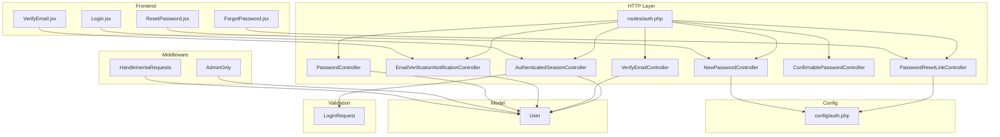
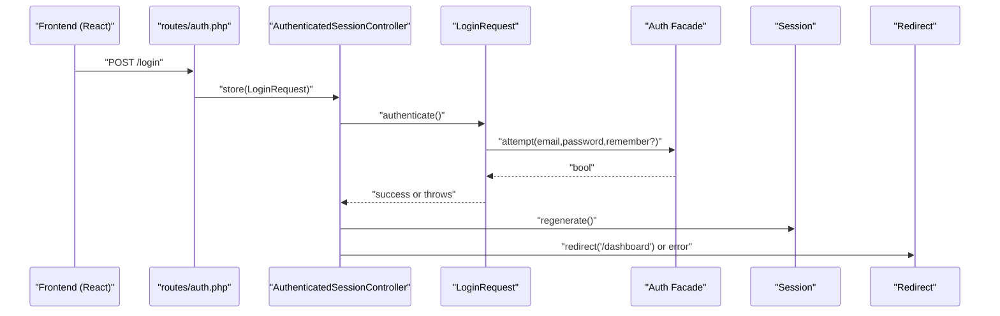
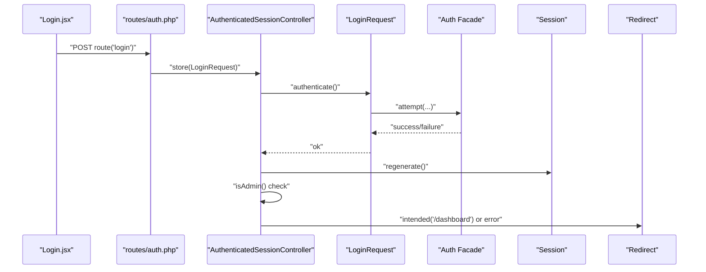
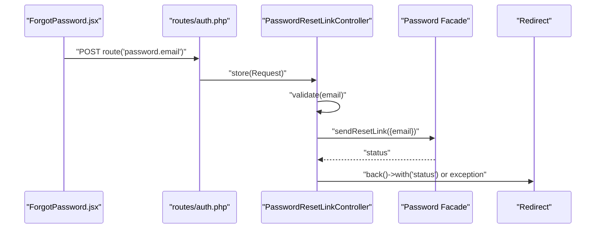
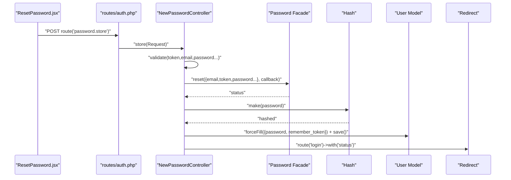
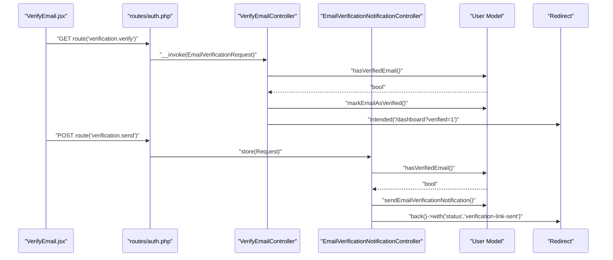
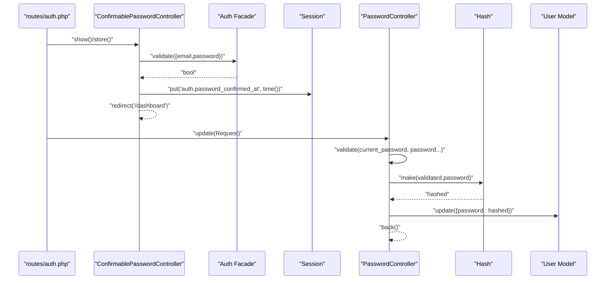
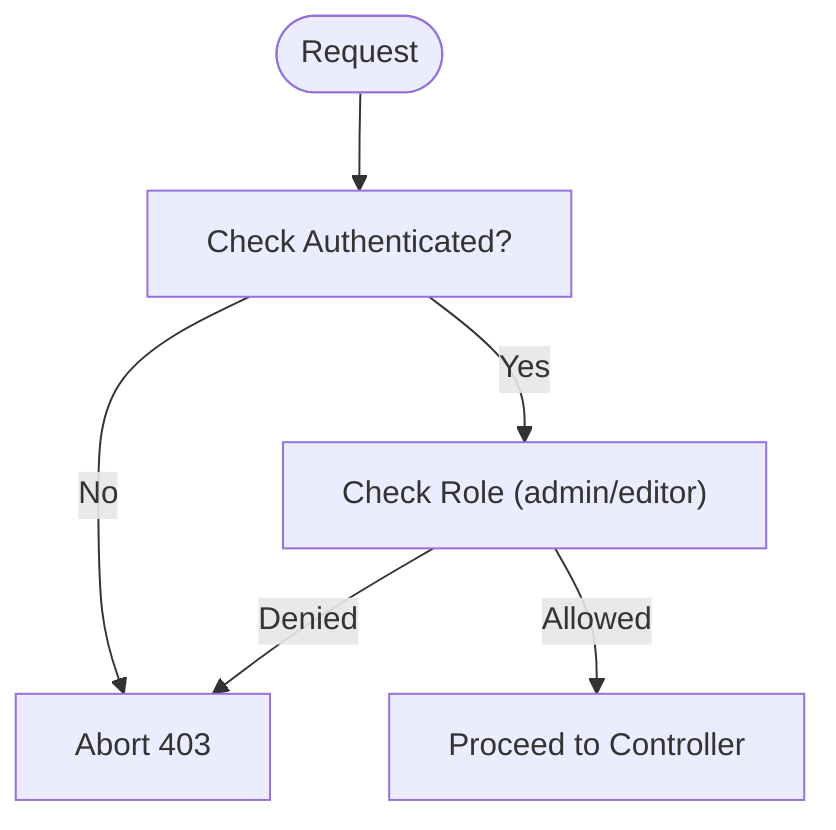
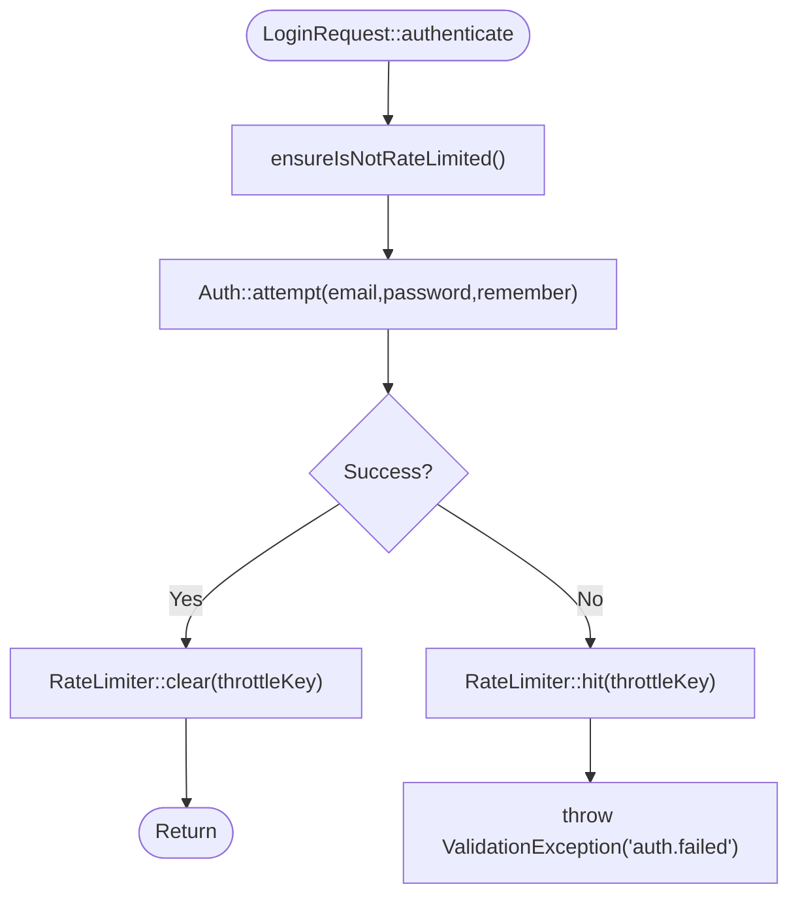
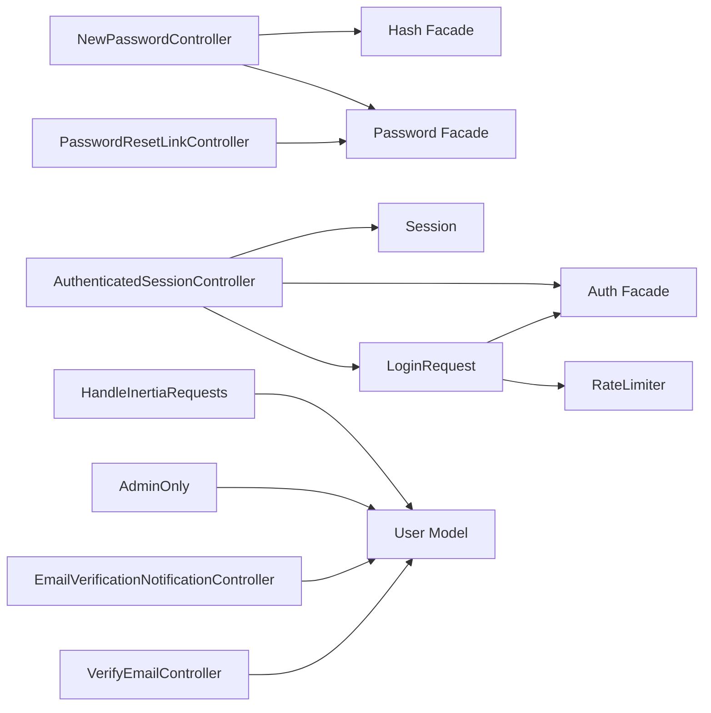

# Authentication and Authorization

<cite>
**Referenced Files in This Document**
- [AuthenticatedSessionController.php](file://app/Http/Controllers/Auth/AuthenticatedSessionController.php)
- [LoginRequest.php](file://app/Http/Requests/Auth/LoginRequest.php)
- [PasswordResetLinkController.php](file://app/Http/Controllers/Auth/PasswordResetLinkController.php)
- [NewPasswordController.php](file://app/Http/Controllers/Auth/NewPasswordController.php)
- [VerifyEmailController.php](file://app/Http/Controllers/Auth/VerifyEmailController.php)
- [EmailVerificationNotificationController.php](file://app/Http/Controllers/Auth/EmailVerificationNotificationController.php)
- [ConfirmablePasswordController.php](file://app/Http/Controllers/Auth/ConfirmablePasswordController.php)
- [PasswordController.php](file://app/Http/Controllers/Auth/PasswordController.php)
- [auth.php](file://config/auth.php)
- [User.php](file://app/Models/User.php)
- [AdminOnly.php](file://app/Http/Middleware/AdminOnly.php)
- [HandleInertiaRequests.php](file://app/Http/Middleware/HandleInertiaRequests.php)
- [auth.php](file://routes/auth.php)
- [Login.jsx](file://resources/js/Pages/Auth/Login.jsx)
- [ForgotPassword.jsx](file://resources/js/Pages/Auth/ForgotPassword.jsx)
- [ResetPassword.jsx](file://resources/js/Pages/Auth/ResetPassword.jsx)
- [VerifyEmail.jsx](file://resources/js/Pages/Auth/VerifyEmail.jsx)
</cite>

## Table of Contents
1. [Introduction](#introduction)
2. [Project Structure](#project-structure)
3. [Core Components](#core-components)
4. [Architecture Overview](#architecture-overview)
5. [Detailed Component Analysis](#detailed-component-analysis)
6. [Dependency Analysis](#dependency-analysis)
7. [Performance Considerations](#performance-considerations)
8. [Troubleshooting Guide](#troubleshooting-guide)
9. [Conclusion](#conclusion)
10. [Appendices](#appendices)

## Introduction
This document explains the Laravel authentication and authorization implementation in the project. It covers the complete authentication flow including login, password reset, and email verification, along with stateful session management. It also documents authorization patterns using middleware and role-based checks, and outlines request validation classes and data sanitization. Practical examples demonstrate middleware usage, password hashing, and session lifecycle. Security best practices such as CSRF protection, rate limiting, and secure session handling are addressed alongside user registration workflows, email verification, and account management features.

## Project Structure
Authentication and authorization functionality is organized around:
- Controllers under app/Http/Controllers/Auth for handling login, logout, password reset, email verification, and password confirmation/update.
- Request validation classes under app/Http/Requests/Auth for input validation and throttling logic.
- Routes under routes/auth.php grouped by guest and authenticated contexts.
- Middleware under app/Http/Middleware for enforcing admin-only access and sharing auth state to the frontend.
- Models under app/Models for user roles and authentication traits.
- Frontend pages under resources/js/Pages/Auth for login, forgot password, reset password, and email verification.

**Diagram sources**
- [auth.php:1-44](file://routes/auth.php#L1-L44)
- [AuthenticatedSessionController.php:1-58](file://app/Http/Controllers/Auth/AuthenticatedSessionController.php#L1-L58)
- [LoginRequest.php:1-87](file://app/Http/Requests/Auth/LoginRequest.php#L1-L87)
- [PasswordResetLinkController.php:1-52](file://app/Http/Controllers/Auth/PasswordResetLinkController.php#L1-L52)
- [NewPasswordController.php:1-70](file://app/Http/Controllers/Auth/NewPasswordController.php#L1-L70)
- [VerifyEmailController.php:1-28](file://app/Http/Controllers/Auth/VerifyEmailController.php#L1-L28)
- [EmailVerificationNotificationController.php:1-25](file://app/Http/Controllers/Auth/EmailVerificationNotificationController.php#L1-L25)
- [ConfirmablePasswordController.php:1-42](file://app/Http/Controllers/Auth/ConfirmablePasswordController.php#L1-L42)
- [PasswordController.php:1-30](file://app/Http/Controllers/Auth/PasswordController.php#L1-L30)
- [auth.php:1-118](file://config/auth.php#L1-L118)
- [User.php:1-47](file://app/Models/User.php#L1-L47)
- [AdminOnly.php:1-25](file://app/Http/Middleware/AdminOnly.php#L1-L25)
- [HandleInertiaRequests.php:1-40](file://app/Http/Middleware/HandleInertiaRequests.php#L1-L40)
- [Login.jsx:1-204](file://resources/js/Pages/Auth/Login.jsx#L1-L204)
- [ForgotPassword.jsx:1-56](file://resources/js/Pages/Auth/ForgotPassword.jsx#L1-L56)
- [ResetPassword.jsx:1-95](file://resources/js/Pages/Auth/ResetPassword.jsx#L1-L95)
- [VerifyEmail.jsx:1-51](file://resources/js/Pages/Auth/VerifyEmail.jsx#L1-L51)

**Section sources**
- [auth.php:1-44](file://routes/auth.php#L1-L44)
- [auth.php:1-118](file://config/auth.php#L1-L118)
- [User.php:1-47](file://app/Models/User.php#L1-L47)
- [AdminOnly.php:1-25](file://app/Http/Middleware/AdminOnly.php#L1-L25)
- [HandleInertiaRequests.php:1-40](file://app/Http/Middleware/HandleInertiaRequests.php#L1-L40)
- [Login.jsx:1-204](file://resources/js/Pages/Auth/Login.jsx#L1-L204)
- [ForgotPassword.jsx:1-56](file://resources/js/Pages/Auth/ForgotPassword.jsx#L1-L56)
- [ResetPassword.jsx:1-95](file://resources/js/Pages/Auth/ResetPassword.jsx#L1-L95)
- [VerifyEmail.jsx:1-51](file://resources/js/Pages/Auth/VerifyEmail.jsx#L1-L51)

## Core Components
- Authentication Controllers: Stateless route bindings to controllers manage login, logout, password reset, email verification, password confirmation, and password updates.
- Validation Classes: LoginRequest encapsulates credential validation, rate limiting, and throttling logic.
- Authorization Middleware: AdminOnly restricts access to admin/editor roles; HandleInertiaRequests shares auth state with the frontend.
- Configuration: config/auth.php defines guards, providers, password reset broker, and timeouts.
- Model Roles: User model exposes role-based helpers used by controllers and middleware.

Practical examples:
- Session lifecycle: regenerate session after login, invalidate on logout, and CSRF protection via built-in mechanisms.
- Password hashing: automatic hashing via model cast and explicit hashing in password reset/update.
- Role-based access: admin-only routes enforced by middleware and controller checks.

**Section sources**
- [AuthenticatedSessionController.php:1-58](file://app/Http/Controllers/Auth/AuthenticatedSessionController.php#L1-L58)
- [LoginRequest.php:1-87](file://app/Http/Requests/Auth/LoginRequest.php#L1-L87)
- [PasswordResetLinkController.php:1-52](file://app/Http/Controllers/Auth/PasswordResetLinkController.php#L1-L52)
- [NewPasswordController.php:1-70](file://app/Http/Controllers/Auth/NewPasswordController.php#L1-L70)
- [VerifyEmailController.php:1-28](file://app/Http/Controllers/Auth/VerifyEmailController.php#L1-L28)
- [EmailVerificationNotificationController.php:1-25](file://app/Http/Controllers/Auth/EmailVerificationNotificationController.php#L1-L25)
- [ConfirmablePasswordController.php:1-42](file://app/Http/Controllers/Auth/ConfirmablePasswordController.php#L1-L42)
- [PasswordController.php:1-30](file://app/Http/Controllers/Auth/PasswordController.php#L1-L30)
- [auth.php:1-118](file://config/auth.php#L1-L118)
- [User.php:1-47](file://app/Models/User.php#L1-L47)
- [AdminOnly.php:1-25](file://app/Http/Middleware/AdminOnly.php#L1-L25)
- [HandleInertiaRequests.php:1-40](file://app/Http/Middleware/HandleInertiaRequests.php#L1-L40)

## Architecture Overview
The authentication system follows a layered approach:
- Routes define endpoints grouped by guest vs authenticated contexts.
- Controllers orchestrate business logic and delegate to facades/services (Auth, Password, Hash).
- Request classes validate input and enforce rate limits.
- Middleware enforces authorization and shares auth state to the frontend.
- The User model centralizes role checks and hashed password handling.

**Diagram sources**
- [auth.php:13-31](file://routes/auth.php#L13-L31)
- [AuthenticatedSessionController.php:28-43](file://app/Http/Controllers/Auth/AuthenticatedSessionController.php#L28-L43)
- [LoginRequest.php:41-54](file://app/Http/Requests/Auth/LoginRequest.php#L41-L54)

**Section sources**
- [auth.php:1-44](file://routes/auth.php#L1-L44)
- [AuthenticatedSessionController.php:1-58](file://app/Http/Controllers/Auth/AuthenticatedSessionController.php#L1-L58)
- [LoginRequest.php:1-87](file://app/Http/Requests/Auth/LoginRequest.php#L1-L87)

## Detailed Component Analysis

### Login Flow
- Route binding: GET /login renders the login page; POST /login invokes the store action.
- Controller store validates via LoginRequest.authenticate, regenerates session, and redirects to intended dashboard.
- Role enforcement: The controller checks user role and logs out non-admin users with an error.
- Frontend: Login.jsx posts to the login route and clears password on finish.

**Diagram sources**
- [auth.php:15-18](file://routes/auth.php#L15-L18)
- [AuthenticatedSessionController.php:18-43](file://app/Http/Controllers/Auth/AuthenticatedSessionController.php#L18-L43)
- [LoginRequest.php:41-54](file://app/Http/Requests/Auth/LoginRequest.php#L41-L54)
- [Login.jsx:15-20](file://resources/js/Pages/Auth/Login.jsx#L15-L20)

**Section sources**
- [auth.php:13-31](file://routes/auth.php#L13-L31)
- [AuthenticatedSessionController.php:1-58](file://app/Http/Controllers/Auth/AuthenticatedSessionController.php#L1-L58)
- [LoginRequest.php:1-87](file://app/Http/Requests/Auth/LoginRequest.php#L1-L87)
- [Login.jsx:1-204](file://resources/js/Pages/Auth/Login.jsx#L1-L204)

### Password Reset Link Request
- Route binding: Grouped under guest middleware; GET displays the form; POST sends a reset link via the Password facade.
- Controller stores validates email and delegates to Password::sendResetLink; success sets a status message; otherwise throws a validation exception.

**Diagram sources**
- [auth.php:20-30](file://routes/auth.php#L20-L30)
- [PasswordResetLinkController.php:18-50](file://app/Http/Controllers/Auth/PasswordResetLinkController.php#L18-L50)
- [ForgotPassword.jsx:12-16](file://resources/js/Pages/Auth/ForgotPassword.jsx#L12-L16)

**Section sources**
- [auth.php:20-30](file://routes/auth.php#L20-L30)
- [PasswordResetLinkController.php:1-52](file://app/Http/Controllers/Auth/PasswordResetLinkController.php#L1-L52)
- [ForgotPassword.jsx:1-56](file://resources/js/Pages/Auth/ForgotPassword.jsx#L1-L56)

### Reset Password
- Route binding: GET /reset-password/{token} renders the reset form; POST /reset-password handles submission.
- Controller validates token, email, and password rules; resets password via Password::reset with a closure that hashes and saves the new password and fires a PasswordReset event.

**Diagram sources**
- [auth.php:26-30](file://routes/auth.php#L26-L30)
- [NewPasswordController.php:22-68](file://app/Http/Controllers/Auth/NewPasswordController.php#L22-L68)
- [ResetPassword.jsx:16-22](file://resources/js/Pages/Auth/ResetPassword.jsx#L16-L22)

**Section sources**
- [auth.php:26-30](file://routes/auth.php#L26-L30)
- [NewPasswordController.php:1-70](file://app/Http/Controllers/Auth/NewPasswordController.php#L1-L70)
- [ResetPassword.jsx:1-95](file://resources/js/Pages/Auth/ResetPassword.jsx#L1-L95)

### Email Verification
- Route binding: Verification link handler marks the email as verified; resend verification notification endpoint resends the email if not verified.
- Controller actions check verification status, mark as verified, and emit a Verified event; resend action ensures unverified users can request a new link.

**Diagram sources**
- [auth.php:1-44](file://routes/auth.php#L1-L44)
- [VerifyEmailController.php:15-26](file://app/Http/Controllers/Auth/VerifyEmailController.php#L15-L26)
- [EmailVerificationNotificationController.php:14-23](file://app/Http/Controllers/Auth/EmailVerificationNotificationController.php#L14-L23)
- [VerifyEmail.jsx:8-12](file://resources/js/Pages/Auth/VerifyEmail.jsx#L8-L12)

**Section sources**
- [auth.php:1-44](file://routes/auth.php#L1-L44)
- [VerifyEmailController.php:1-28](file://app/Http/Controllers/Auth/VerifyEmailController.php#L1-L28)
- [EmailVerificationNotificationController.php:1-25](file://app/Http/Controllers/Auth/EmailVerificationNotificationController.php#L1-L25)
- [VerifyEmail.jsx:1-51](file://resources/js/Pages/Auth/VerifyEmail.jsx#L1-L51)

### Password Confirmation and Update
- Password confirmation: ConfirmablePasswordController validates the current password and records a confirmation timestamp in the session.
- Password update: PasswordController validates current password and new password, then hashes and updates the user’s password.

**Diagram sources**
- [auth.php:33-43](file://routes/auth.php#L33-L43)
- [ConfirmablePasswordController.php:18-40](file://app/Http/Controllers/Auth/ConfirmablePasswordController.php#L18-L40)
- [PasswordController.php:16-28](file://app/Http/Controllers/Auth/PasswordController.php#L16-L28)

**Section sources**
- [auth.php:33-43](file://routes/auth.php#L33-L43)
- [ConfirmablePasswordController.php:1-42](file://app/Http/Controllers/Auth/ConfirmablePasswordController.php#L1-L42)
- [PasswordController.php:1-30](file://app/Http/Controllers/Auth/PasswordController.php#L1-L30)

### Authorization Patterns
- Role-based access control: User model exposes role helpers; AdminOnly middleware checks authentication and role before allowing access.
- Gate-like checks: Controllers can gate sensitive actions using role helpers.
- Frontend auth state: HandleInertiaRequests shares the authenticated user with the frontend for rendering role-aware UI.

**Diagram sources**
- [AdminOnly.php:16-23](file://app/Http/Middleware/AdminOnly.php#L16-L23)
- [User.php:32-45](file://app/Models/User.php#L32-L45)

**Section sources**
- [AdminOnly.php:1-25](file://app/Http/Middleware/AdminOnly.php#L1-L25)
- [User.php:1-47](file://app/Models/User.php#L1-L47)
- [HandleInertiaRequests.php:30-38](file://app/Http/Middleware/HandleInertiaRequests.php#L30-L38)

### Request Validation and Data Sanitization
- LoginRequest: Validates email/password, enforces rate limiting via ensureIsNotRateLimited, and attempts authentication with throttling keys derived from email and IP.
- PasswordController: Validates current password using current_password rule and enforces password strength and confirmation.
- Frontend forms: Use Inertia forms to submit validated data to backend routes.

**Diagram sources**
- [LoginRequest.php:41-77](file://app/Http/Requests/Auth/LoginRequest.php#L41-L77)

**Section sources**
- [LoginRequest.php:1-87](file://app/Http/Requests/Auth/LoginRequest.php#L1-L87)
- [PasswordController.php:16-28](file://app/Http/Controllers/Auth/PasswordController.php#L16-L28)
- [Login.jsx:9-20](file://resources/js/Pages/Auth/Login.jsx#L9-L20)

## Dependency Analysis
- Controllers depend on:
  - Auth facade for session and guard operations.
  - Password facade for password reset tokens and notifications.
  - Hash facade for password hashing.
  - RateLimiter for login throttling.
  - Inertia for inertia-rendered views.
- Request classes depend on RateLimiter and Auth for throttling and credential attempts.
- Middleware depends on Auth and User model for role checks.
- Routes bind controllers to named endpoints grouped by guest/auth contexts.

**Diagram sources**
- [LoginRequest.php:1-87](file://app/Http/Requests/Auth/LoginRequest.php#L1-L87)
- [AuthenticatedSessionController.php:1-58](file://app/Http/Controllers/Auth/AuthenticatedSessionController.php#L1-L58)
- [PasswordResetLinkController.php:1-52](file://app/Http/Controllers/Auth/PasswordResetLinkController.php#L1-L52)
- [NewPasswordController.php:1-70](file://app/Http/Controllers/Auth/NewPasswordController.php#L1-L70)
- [VerifyEmailController.php:1-28](file://app/Http/Controllers/Auth/VerifyEmailController.php#L1-L28)
- [EmailVerificationNotificationController.php:1-25](file://app/Http/Controllers/Auth/EmailVerificationNotificationController.php#L1-L25)
- [AdminOnly.php:1-25](file://app/Http/Middleware/AdminOnly.php#L1-L25)
- [HandleInertiaRequests.php:1-40](file://app/Http/Middleware/HandleInertiaRequests.php#L1-L40)
- [User.php:1-47](file://app/Models/User.php#L1-L47)

**Section sources**
- [LoginRequest.php:1-87](file://app/Http/Requests/Auth/LoginRequest.php#L1-L87)
- [AuthenticatedSessionController.php:1-58](file://app/Http/Controllers/Auth/AuthenticatedSessionController.php#L1-L58)
- [PasswordResetLinkController.php:1-52](file://app/Http/Controllers/Auth/PasswordResetLinkController.php#L1-L52)
- [NewPasswordController.php:1-70](file://app/Http/Controllers/Auth/NewPasswordController.php#L1-L70)
- [VerifyEmailController.php:1-28](file://app/Http/Controllers/Auth/VerifyEmailController.php#L1-L28)
- [EmailVerificationNotificationController.php:1-25](file://app/Http/Controllers/Auth/EmailVerificationNotificationController.php#L1-L25)
- [AdminOnly.php:1-25](file://app/Http/Middleware/AdminOnly.php#L1-L25)
- [HandleInertiaRequests.php:1-40](file://app/Http/Middleware/HandleInertiaRequests.php#L1-L40)
- [User.php:1-47](file://app/Models/User.php#L1-L47)

## Performance Considerations
- Prefer hashed passwords: The User model casts password to hashed automatically; avoid storing plaintext.
- Use rate limiting: LoginRequest throttles failed attempts per email+IP to mitigate brute force.
- Efficient session regeneration: Controllers regenerate session after successful login to prevent fixation.
- Minimal frontend payload: HandleInertiaRequests shares only essential auth state to reduce overhead.

[No sources needed since this section provides general guidance]

## Troubleshooting Guide
Common issues and resolutions:
- Login throttled: Excessive failed attempts trigger a lockout; wait for the throttle period to expire.
- Invalid reset token: Ensure the token matches the stored reset token and is not expired.
- Unverified email: Users must click the verification link; resend a new link if needed.
- Password confirmation timeout: If the confirmation window expires, re-confirm the password.
- Role restrictions: AdminOnly denies access to unauthorized users; verify user role and authentication.

**Section sources**
- [LoginRequest.php:61-77](file://app/Http/Requests/Auth/LoginRequest.php#L61-L77)
- [PasswordResetLinkController.php:30-50](file://app/Http/Controllers/Auth/PasswordResetLinkController.php#L30-L50)
- [NewPasswordController.php:35-68](file://app/Http/Controllers/Auth/NewPasswordController.php#L35-L68)
- [EmailVerificationNotificationController.php:14-23](file://app/Http/Controllers/Auth/EmailVerificationNotificationController.php#L14-L23)
- [ConfirmablePasswordController.php:26-40](file://app/Http/Controllers/Auth/ConfirmablePasswordController.php#L26-L40)
- [AdminOnly.php:16-23](file://app/Http/Middleware/AdminOnly.php#L16-L23)

## Conclusion
The authentication and authorization system integrates controllers, validation classes, middleware, and configuration to provide a robust, secure, and user-friendly experience. It supports stateful session management, role-based access control, and comprehensive password and email workflows. Following the outlined best practices ensures resilience against common threats while maintaining a smooth user experience.

[No sources needed since this section summarizes without analyzing specific files]

## Appendices
- Security best practices:
  - CSRF protection: Laravel provides built-in CSRF middleware; ensure forms are submitted through the framework.
  - Rate limiting: Use LoginRequest throttling and consider additional rate limits for sensitive endpoints.
  - Secure session handling: Regenerate session ID after login and invalidate on logout.
  - Password hashing: Rely on automatic hashing via model casts and explicit hashing in reset/update flows.
  - Email verification: Enforce verification before granting access to restricted areas.

[No sources needed since this section provides general guidance]