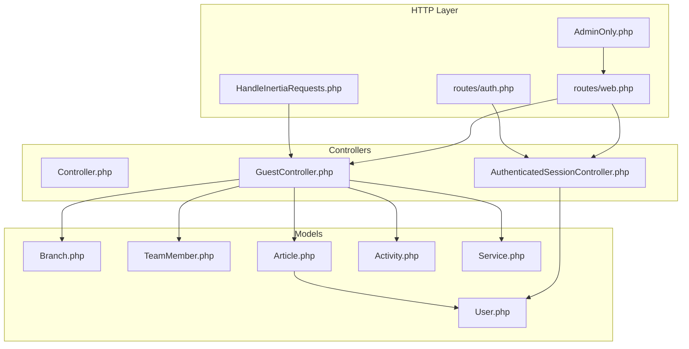
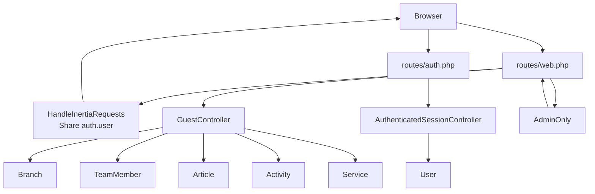
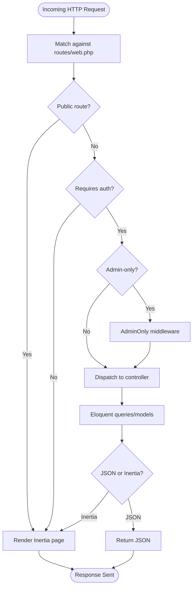
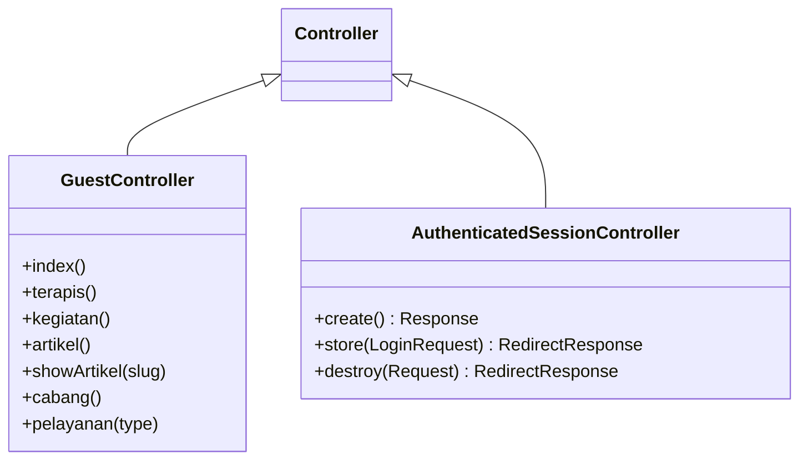
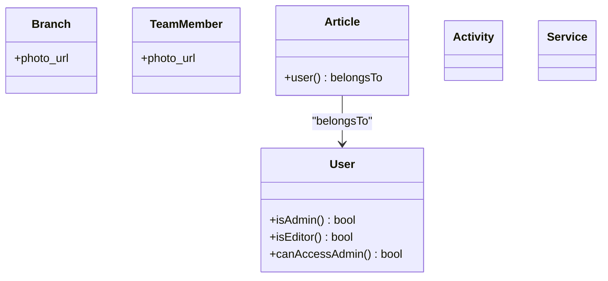
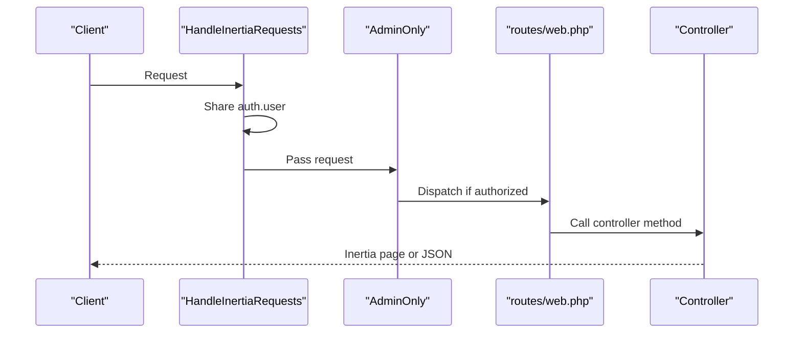
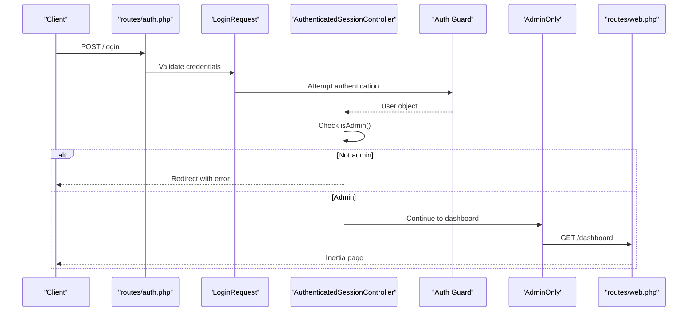
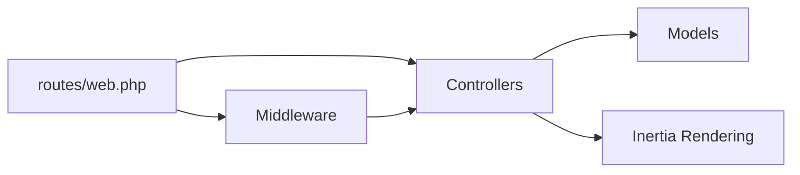

# Backend Architecture (Laravel)

<cite>
**Referenced Files in This Document**
- [Controller.php](file://app/Http/Controllers/Controller.php)
- [GuestController.php](file://app/Http/Controllers/GuestController.php)
- [AuthenticatedSessionController.php](file://app/Http/Controllers/Auth/AuthenticatedSessionController.php)
- [LoginRequest.php](file://app/Http/Requests/Auth/LoginRequest.php)
- [HandleInertiaRequests.php](file://app/Http/Middleware/HandleInertiaRequests.php)
- [AdminOnly.php](file://app/Http/Middleware/AdminOnly.php)
- [web.php](file://routes/web.php)
- [auth.php](file://routes/auth.php)
- [User.php](file://app/Models/User.php)
- [Branch.php](file://app/Models/Branch.php)
- [TeamMember.php](file://app/Models/TeamMember.php)
- [Article.php](file://app/Models/Article.php)
- [Activity.php](file://app/Models/Activity.php)
- [Service.php](file://app/Models/Service.php)
- [auth.php](file://config/auth.php)
</cite>

## Table of Contents
1. [Introduction](#introduction)
2. [Project Structure](#project-structure)
3. [Core Components](#core-components)
4. [Architecture Overview](#architecture-overview)
5. [Detailed Component Analysis](#detailed-component-analysis)
6. [Dependency Analysis](#dependency-analysis)
7. [Performance Considerations](#performance-considerations)
8. [Troubleshooting Guide](#troubleshooting-guide)
9. [Conclusion](#conclusion)

## Introduction
This document explains the Laravel backend architecture with a focus on the Model-View-Controller (MVC) pattern and Inertia.js integration. It covers application structure and conventions, controller organization, model relationships, middleware pipeline, request handling, routing for public and administrative interfaces, authentication and authorization patterns, and practical examples of request-response flows. Security best practices, performance considerations, and extensibility patterns are also addressed.

## Project Structure
The backend follows Laravel conventions with clear separation of concerns:
- Controllers under app/Http/Controllers handle HTTP requests and render Inertia pages or JSON responses.
- Models under app/Models encapsulate data and relationships.
- Routes under routes define URL patterns and group endpoints by purpose.
- Middleware under app/Http/Middleware filters requests and shares data across Inertia pages.
- Authentication controllers and form requests manage login and validation.
- Configuration under config defines guards and providers.

**Diagram sources**
- [web.php:1-137](file://routes/web.php#L1-L137)
- [auth.php:1-44](file://routes/auth.php#L1-L44)
- [HandleInertiaRequests.php:1-40](file://app/Http/Middleware/HandleInertiaRequests.php#L1-L40)
- [AdminOnly.php:1-25](file://app/Http/Middleware/AdminOnly.php#L1-L25)
- [Controller.php:1-9](file://app/Http/Controllers/Controller.php#L1-L9)
- [GuestController.php:1-119](file://app/Http/Controllers/GuestController.php#L1-L119)
- [AuthenticatedSessionController.php:1-58](file://app/Http/Controllers/Auth/AuthenticatedSessionController.php#L1-L58)
- [User.php:1-47](file://app/Models/User.php#L1-L47)
- [Branch.php:1-36](file://app/Models/Branch.php#L1-L36)
- [TeamMember.php:1-24](file://app/Models/TeamMember.php#L1-L24)
- [Article.php:1-28](file://app/Models/Article.php#L1-L28)
- [Activity.php:1-11](file://app/Models/Activity.php#L1-L11)
- [Service.php:1-15](file://app/Models/Service.php#L1-L15)

**Section sources**
- [web.php:1-137](file://routes/web.php#L1-L137)
- [auth.php:1-44](file://routes/auth.php#L1-L44)
- [HandleInertiaRequests.php:1-40](file://app/Http/Middleware/HandleInertiaRequests.php#L1-L40)
- [AdminOnly.php:1-25](file://app/Http/Middleware/AdminOnly.php#L1-L25)
- [Controller.php:1-9](file://app/Http/Controllers/Controller.php#L1-L9)
- [GuestController.php:1-119](file://app/Http/Controllers/GuestController.php#L1-L119)
- [AuthenticatedSessionController.php:1-58](file://app/Http/Controllers/Auth/AuthenticatedSessionController.php#L1-L58)
- [User.php:1-47](file://app/Models/User.php#L1-L47)
- [Branch.php:1-36](file://app/Models/Branch.php#L1-L36)
- [TeamMember.php:1-24](file://app/Models/TeamMember.php#L1-L24)
- [Article.php:1-28](file://app/Models/Article.php#L1-L28)
- [Activity.php:1-11](file://app/Models/Activity.php#L1-L11)
- [Service.php:1-15](file://app/Models/Service.php#L1-L15)

## Core Components
- Base Controller: Provides a common foundation for all controllers.
- GuestController: Renders public pages and handles article listings/detail and service-specific pages.
- Authentication Controllers: Manage login/logout and integrate with Inertia for SPA-like UX.
- Middleware: Centralizes Inertia root template sharing and admin-only access enforcement.
- Models: Define fillable attributes, appended computed fields, and relationships.

Key implementation patterns:
- Inertia rendering for server-rendered single-page experiences.
- Resource routes for admin CRUD with explicit naming.
- Role-based access checks via model helpers and middleware.
- Request validation with rate limiting and lockout protection.

**Section sources**
- [Controller.php:1-9](file://app/Http/Controllers/Controller.php#L1-L9)
- [GuestController.php:1-119](file://app/Http/Controllers/GuestController.php#L1-L119)
- [AuthenticatedSessionController.php:1-58](file://app/Http/Controllers/Auth/AuthenticatedSessionController.php#L1-L58)
- [HandleInertiaRequests.php:1-40](file://app/Http/Middleware/HandleInertiaRequests.php#L1-L40)
- [AdminOnly.php:1-25](file://app/Http/Middleware/AdminOnly.php#L1-L25)
- [User.php:1-47](file://app/Models/User.php#L1-L47)

## Architecture Overview
The system integrates Laravel’s MVC with Inertia.js to deliver reactive UI updates while maintaining server-side rendering benefits. The middleware pipeline ensures shared data and access control, while routes separate public and admin interfaces.

**Diagram sources**
- [web.php:1-137](file://routes/web.php#L1-L137)
- [auth.php:1-44](file://routes/auth.php#L1-L44)
- [HandleInertiaRequests.php:1-40](file://app/Http/Middleware/HandleInertiaRequests.php#L1-L40)
- [AdminOnly.php:1-25](file://app/Http/Middleware/AdminOnly.php#L1-L25)
- [GuestController.php:1-119](file://app/Http/Controllers/GuestController.php#L1-L119)
- [AuthenticatedSessionController.php:1-58](file://app/Http/Controllers/Auth/AuthenticatedSessionController.php#L1-L58)
- [User.php:1-47](file://app/Models/User.php#L1-L47)
- [Branch.php:1-36](file://app/Models/Branch.php#L1-L36)
- [TeamMember.php:1-24](file://app/Models/TeamMember.php#L1-L24)
- [Article.php:1-28](file://app/Models/Article.php#L1-L28)
- [Activity.php:1-11](file://app/Models/Activity.php#L1-L11)
- [Service.php:1-15](file://app/Models/Service.php#L1-L15)

## Detailed Component Analysis

### Routing System and URL Patterns
Public interface:
- Home: GET /
- Terapis: GET /terapis
- Kegiatan: GET /kegiatan
- Artikel index: GET /artikel
- Artikel detail: GET /artikel/{slug}
- Cabang: GET /cabang
- Pelayanan: GET /pelayanan/{type} with type mapped to specific views

Administrative interface (protected):
- Dashboard: GET /dashboard
- Services: Resource routes under /admin/services
- Branches: Resource routes under /admin/branches
- Team Members: Resource routes under /admin/team-members
- Activities: Resource routes under /admin/activities
- Articles: Resource routes under /admin/articles

Authentication routes:
- Login: GET /login and POST /login
- Password confirmation: GET/POST /confirm-password
- Password update: PUT /password
- Logout: POST /logout

**Diagram sources**
- [web.php:1-137](file://routes/web.php#L1-L137)
- [auth.php:1-44](file://routes/auth.php#L1-L44)
- [AdminOnly.php:1-25](file://app/Http/Middleware/AdminOnly.php#L1-L25)

**Section sources**
- [web.php:1-137](file://routes/web.php#L1-L137)
- [auth.php:1-44](file://routes/auth.php#L1-L44)

### Controller Layer Design
- GuestController: Handles public pages and dynamic content rendering with Inertia. Methods include index, terapis, kegiatan, artikel, showArtikel, cabang, and pelayanan. It fetches related models and prepares data for frontend components.
- AuthenticatedSessionController: Manages login lifecycle, validates credentials, enforces admin-only access, and redirects to dashboard upon successful authentication.
- Base Controller: Empty base class for shared controller behavior.

**Diagram sources**
- [Controller.php:1-9](file://app/Http/Controllers/Controller.php#L1-L9)
- [GuestController.php:1-119](file://app/Http/Controllers/GuestController.php#L1-L119)
- [AuthenticatedSessionController.php:1-58](file://app/Http/Controllers/Auth/AuthenticatedSessionController.php#L1-L58)

**Section sources**
- [GuestController.php:1-119](file://app/Http/Controllers/GuestController.php#L1-L119)
- [AuthenticatedSessionController.php:1-58](file://app/Http/Controllers/Auth/AuthenticatedSessionController.php#L1-L58)
- [Controller.php:1-9](file://app/Http/Controllers/Controller.php#L1-L9)

### Model Layer and Relationships
Models define fillable attributes, appended computed fields, and relationships:
- User: Provides role checks (isAdmin, isEditor, canAccessAdmin).
- Branch: Appends photo_url computed attribute.
- TeamMember: Appends photo_url computed attribute.
- Article: Belongs to User; supports author metadata and status filtering.
- Activity: Basic content fields.
- Service: Slug-based lookup for pelayanan pages.

**Diagram sources**
- [User.php:1-47](file://app/Models/User.php#L1-L47)
- [Branch.php:1-36](file://app/Models/Branch.php#L1-L36)
- [TeamMember.php:1-24](file://app/Models/TeamMember.php#L1-L24)
- [Article.php:1-28](file://app/Models/Article.php#L1-L28)
- [Activity.php:1-11](file://app/Models/Activity.php#L1-L11)
- [Service.php:1-15](file://app/Models/Service.php#L1-L15)

**Section sources**
- [User.php:1-47](file://app/Models/User.php#L1-L47)
- [Branch.php:1-36](file://app/Models/Branch.php#L1-L36)
- [TeamMember.php:1-24](file://app/Models/TeamMember.php#L1-L24)
- [Article.php:1-28](file://app/Models/Article.php#L1-L28)
- [Activity.php:1-11](file://app/Models/Activity.php#L1-L11)
- [Service.php:1-15](file://app/Models/Service.php#L1-L15)

### Middleware Pipeline
- HandleInertiaRequests: Sets the root Inertia template and shares auth.user across pages.
- AdminOnly: Enforces admin/editor access for protected routes.

**Diagram sources**
- [HandleInertiaRequests.php:1-40](file://app/Http/Middleware/HandleInertiaRequests.php#L1-L40)
- [AdminOnly.php:1-25](file://app/Http/Middleware/AdminOnly.php#L1-L25)
- [web.php:1-137](file://routes/web.php#L1-L137)

**Section sources**
- [HandleInertiaRequests.php:1-40](file://app/Http/Middleware/HandleInertiaRequests.php#L1-L40)
- [AdminOnly.php:1-25](file://app/Http/Middleware/AdminOnly.php#L1-L25)

### Authentication and Authorization Patterns
- Guard and Provider: Session-based authentication with Eloquent provider configured in config/auth.php.
- Login flow: Uses LoginRequest for validation and rate limiting; authenticatedSessionController enforces admin-only access.
- Admin-only middleware: Blocks unauthorized users and returns 403.
- Shared data: HandleInertiaRequests shares auth.user with frontend.

**Diagram sources**
- [auth.php:1-44](file://routes/auth.php#L1-L44)
- [LoginRequest.php:1-87](file://app/Http/Requests/Auth/LoginRequest.php#L1-L87)
- [AuthenticatedSessionController.php:1-58](file://app/Http/Controllers/Auth/AuthenticatedSessionController.php#L1-L58)
- [AdminOnly.php:1-25](file://app/Http/Middleware/AdminOnly.php#L1-L25)
- [web.php:68-80](file://routes/web.php#L68-L80)
- [auth.php:1-118](file://config/auth.php#L1-L118)

**Section sources**
- [LoginRequest.php:1-87](file://app/Http/Requests/Auth/LoginRequest.php#L1-L87)
- [AuthenticatedSessionController.php:1-58](file://app/Http/Controllers/Auth/AuthenticatedSessionController.php#L1-L58)
- [AdminOnly.php:1-25](file://app/Http/Middleware/AdminOnly.php#L1-L25)
- [auth.php:1-118](file://config/auth.php#L1-L118)

### Practical Examples: Request-Response Cycles
- Public article listing:
  - Route: GET /artikel → GuestController@artikel
  - Behavior: Fetch published articles, compute excerpts, remove content, render Guest/Artikel with Inertia.
- Article detail:
  - Route: GET /artikel/{slug} → GuestController@showArtikel
  - Behavior: Load article with author, compute excerpts for related articles, render Guest/DetailArtikel.
- Admin branch CRUD:
  - Route: Resource under /admin/branches → BranchController actions
  - Behavior: Standard index/create/store/show/edit/update/destroy with Inertia data sharing.
- Login:
  - Route: POST /login → AuthenticatedSessionController@store
  - Behavior: Authenticate via LoginRequest, enforce admin role, redirect to /dashboard.

**Section sources**
- [GuestController.php:49-83](file://app/Http/Controllers/GuestController.php#L49-L83)
- [web.php:116-124](file://routes/web.php#L116-L124)
- [AuthenticatedSessionController.php:28-43](file://app/Http/Controllers/Auth/AuthenticatedSessionController.php#L28-L43)

## Dependency Analysis
- Controllers depend on models for data retrieval and on Inertia for rendering.
- Routes depend on controllers and middleware for dispatching and filtering.
- Middleware depends on the request context and shared data.
- Models encapsulate relationships and computed attributes.

**Diagram sources**
- [web.php:1-137](file://routes/web.php#L1-L137)
- [HandleInertiaRequests.php:1-40](file://app/Http/Middleware/HandleInertiaRequests.php#L1-L40)
- [GuestController.php:1-119](file://app/Http/Controllers/GuestController.php#L1-L119)
- [User.php:1-47](file://app/Models/User.php#L1-L47)

**Section sources**
- [web.php:1-137](file://routes/web.php#L1-L137)
- [HandleInertiaRequests.php:1-40](file://app/Http/Middleware/HandleInertiaRequests.php#L1-L40)
- [GuestController.php:1-119](file://app/Http/Controllers/GuestController.php#L1-L119)
- [User.php:1-47](file://app/Models/User.php#L1-L47)

## Performance Considerations
- Eager loading: Use with() to avoid N+1 queries (e.g., loading user relationship with articles).
- Computed attributes: Use appends for derived data (e.g., photo_url) to reduce frontend logic.
- Pagination: For large lists, implement pagination to limit payload sizes.
- Asset URLs: Prefer stored image paths and computed URLs to minimize redundant logic.
- Middleware overhead: Keep shared data minimal; avoid heavy computations in HandleInertiaRequests.

## Troubleshooting Guide
- Authentication failures:
  - Validate LoginRequest rules and rate limiter thresholds.
  - Ensure admin role check passes before redirecting to dashboard.
- Access denied:
  - Confirm AdminOnly middleware is applied to admin routes.
  - Verify user roles via model helpers.
- Inertia data missing:
  - Check HandleInertiaRequests share() method for auth.user presence.
- Route not found:
  - Verify route names and prefixes in routes/web.php and routes/auth.php.

**Section sources**
- [LoginRequest.php:1-87](file://app/Http/Requests/Auth/LoginRequest.php#L1-L87)
- [AuthenticatedSessionController.php:1-58](file://app/Http/Controllers/Auth/AuthenticatedSessionController.php#L1-L58)
- [AdminOnly.php:1-25](file://app/Http/Middleware/AdminOnly.php#L1-L25)
- [HandleInertiaRequests.php:1-40](file://app/Http/Middleware/HandleInertiaRequests.php#L1-L40)
- [web.php:1-137](file://routes/web.php#L1-L137)

## Conclusion
The backend leverages Laravel’s MVC architecture with Inertia.js to provide a cohesive server-rendered SPA experience. Clear separation of public and admin routes, robust middleware for access control, and well-defined models with relationships enable maintainable and scalable development. Following the outlined patterns ensures secure, performant, and extensible implementations across the application.