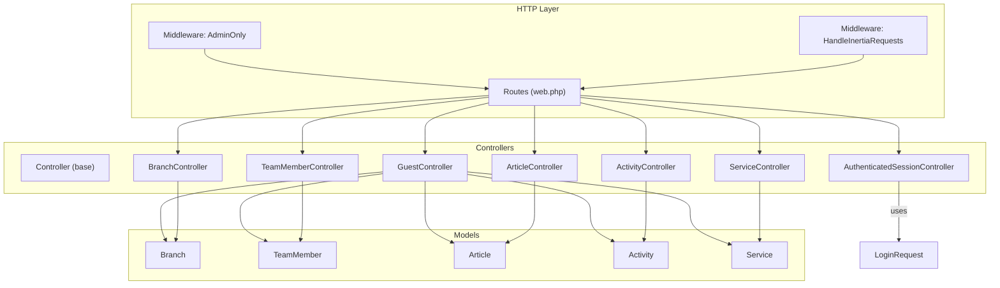
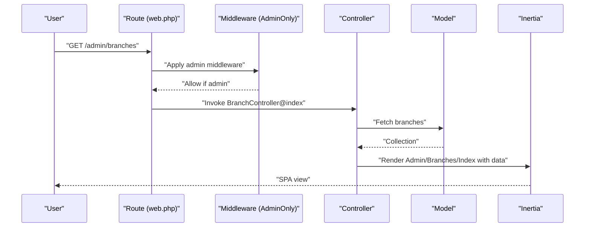
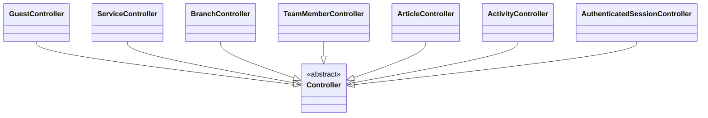
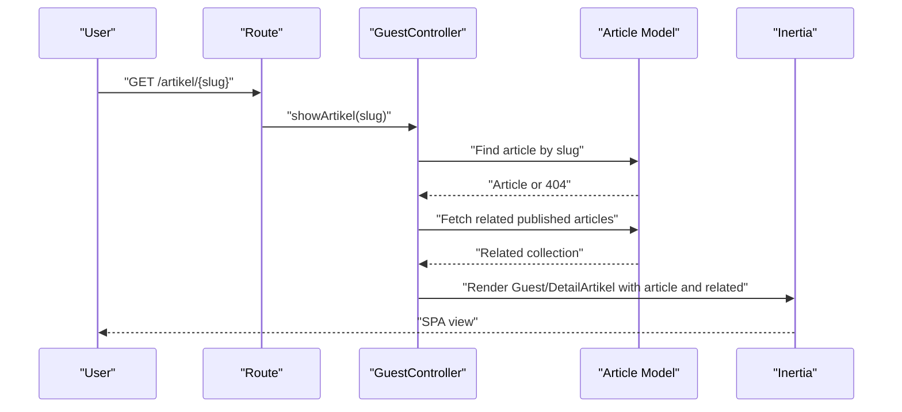
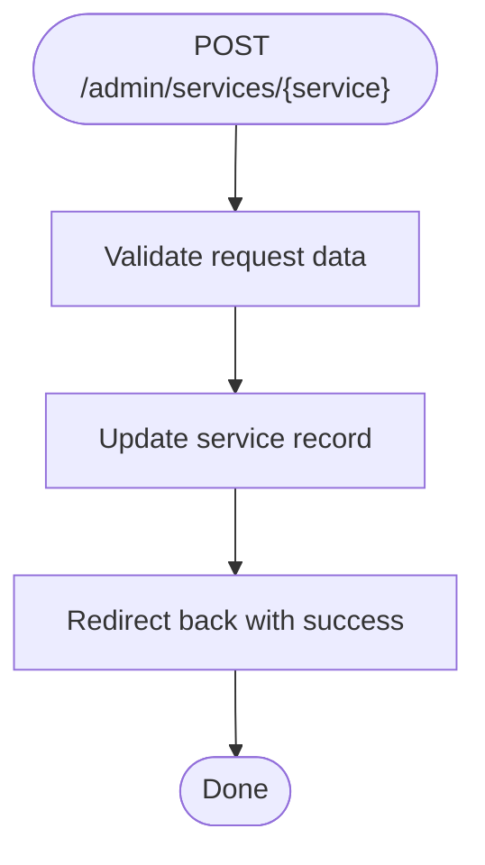
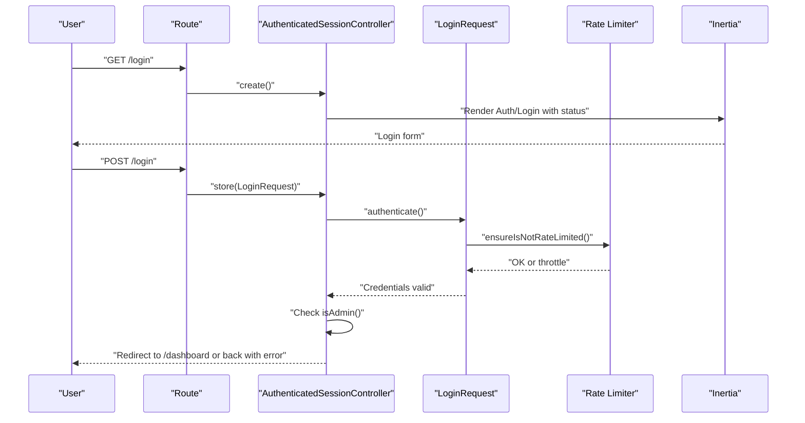
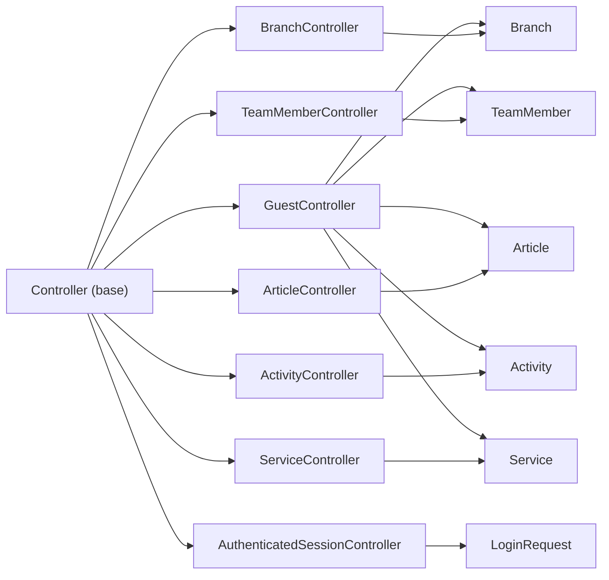

# Controller Layer Design

<cite>
**Referenced Files in This Document**
- [Controller.php](file://app/Http/Controllers/Controller.php)
- [GuestController.php](file://app/Http/Controllers/GuestController.php)
- [ServiceController.php](file://app/Http/Controllers/ServiceController.php)
- [ActivityController.php](file://app/Http/Controllers/ActivityController.php)
- [BranchController.php](file://app/Http/Controllers/BranchController.php)
- [ArticleController.php](file://app/Http/Controllers/ArticleController.php)
- [TeamMemberController.php](file://app/Http/Controllers/TeamMemberController.php)
- [AuthenticatedSessionController.php](file://app/Http/Controllers/Auth/AuthenticatedSessionController.php)
- [LoginRequest.php](file://app/Http/Requests/Auth/LoginRequest.php)
- [HandleInertiaRequests.php](file://app/Http/Middleware/HandleInertiaRequests.php)
- [AdminOnly.php](file://app/Http/Middleware/AdminOnly.php)
- [web.php](file://routes/web.php)
- [GuestLayout.jsx](file://resources/js/Layouts/GuestLayout.jsx)
- [AuthenticatedLayout.jsx](file://resources/js/Layouts/AuthenticatedLayout.jsx)
</cite>

## Table of Contents
1. [Introduction](#introduction)
2. [Project Structure](#project-structure)
3. [Core Components](#core-components)
4. [Architecture Overview](#architecture-overview)
5. [Detailed Component Analysis](#detailed-component-analysis)
6. [Dependency Analysis](#dependency-analysis)
7. [Performance Considerations](#performance-considerations)
8. [Troubleshooting Guide](#troubleshooting-guide)
9. [Conclusion](#conclusion)

## Introduction
This document explains the Laravel controller layer design for the project, focusing on the abstract base Controller class, inheritance patterns, and specialized controllers organized by functional area. It covers request handling, response formatting, business logic coordination, and Inertia.js integration for view responses. Practical examples demonstrate method responsibilities, parameter handling, and response patterns. Testing strategies, middleware integration, and performance considerations are also addressed.

## Project Structure
The controller layer follows a layered organization:
- Base controller: a minimal abstract class that establishes a common inheritance root for all controllers.
- Functional controllers:
  - GuestController: public-facing pages and content presentation.
  - ServiceController: administrative management of service configurations.
  - Resource controllers: BranchController, TeamMemberController, ArticleController, ActivityController for CRUD operations under admin middleware.
- Authentication controllers: AuthenticatedSessionController and supporting LoginRequest for admin login flows.
- Middleware: HandleInertiaRequests for Inertia shared props and AdminOnly for role-based access control.
- Routes: web.php defines route groups and resource routes for admin CRUD operations and guest/public routes.

**Diagram sources**
- [web.php:49-125](file://routes/web.php#L49-L125)
- [Controller.php:5-8](file://app/Http/Controllers/Controller.php#L5-L8)
- [GuestController.php:14-118](file://app/Http/Controllers/GuestController.php#L14-L118)
- [ServiceController.php:9-30](file://app/Http/Controllers/ServiceController.php#L9-L30)
- [BranchController.php:12-87](file://app/Http/Controllers/BranchController.php#L12-L87)
- [TeamMemberController.php:11-71](file://app/Http/Controllers/TeamMemberController.php#L11-L71)
- [ArticleController.php:11-121](file://app/Http/Controllers/ArticleController.php#L11-L121)
- [ActivityController.php:10-106](file://app/Http/Controllers/ActivityController.php#L10-L106)
- [AuthenticatedSessionController.php:13-57](file://app/Http/Controllers/Auth/AuthenticatedSessionController.php#L13-L57)
- [LoginRequest.php:13-86](file://app/Http/Requests/Auth/LoginRequest.php#L13-L86)

**Section sources**
- [web.php:49-125](file://routes/web.php#L49-L125)
- [Controller.php:5-8](file://app/Http/Controllers/Controller.php#L5-L8)

## Core Components
- Abstract base Controller: Provides a common inheritance root for all controllers, enabling shared behavior and consistency across the application.
- GuestController: Handles public-facing pages and content rendering via Inertia.js, including home, team, activities, articles, branches, and service-specific pages.
- ServiceController: Manages administrative updates to service configurations (e.g., Google Form links) with validation and flash messaging.
- Resource controllers (Branch, TeamMember, Article, Activity): Implement full CRUD operations with validation, file uploads, media handling, and storage cleanup.
- Authentication controllers: Admin login/logout flows with rate limiting and role checks.
- Middleware: HandleInertiaRequests shares authenticated user data; AdminOnly enforces admin-only access.

Responsibilities:
- Request handling: Validation via FormRequest and controller-level rules; parameter extraction and binding.
- Response formatting: Inertia::render for SPA views; redirects with flash messages for mutations; JSON for API-like endpoints.
- Business logic coordination: Delegation to Eloquent models, storage management, and sanitization helpers.

**Section sources**
- [Controller.php:5-8](file://app/Http/Controllers/Controller.php#L5-L8)
- [GuestController.php:14-118](file://app/Http/Controllers/GuestController.php#L14-L118)
- [ServiceController.php:9-30](file://app/Http/Controllers/ServiceController.php#L9-L30)
- [BranchController.php:12-87](file://app/Http/Controllers/BranchController.php#L12-L87)
- [TeamMemberController.php:11-71](file://app/Http/Controllers/TeamMemberController.php#L11-L71)
- [ArticleController.php:11-121](file://app/Http/Controllers/ArticleController.php#L11-L121)
- [ActivityController.php:10-106](file://app/Http/Controllers/ActivityController.php#L10-L106)
- [AuthenticatedSessionController.php:13-57](file://app/Http/Controllers/Auth/AuthenticatedSessionController.php#L13-L57)
- [HandleInertiaRequests.php:8-39](file://app/Http/Middleware/HandleInertiaRequests.php#L8-L39)
- [AdminOnly.php:9-24](file://app/Http/Middleware/AdminOnly.php#L9-L24)

## Architecture Overview
The controller layer integrates with routing, middleware, and Inertia.js to deliver a cohesive frontend-backend architecture:
- Routes define named endpoints and resource routes.
- Middleware applies admin-only access and Inertia shared props.
- Controllers coordinate model interactions, validation, and response rendering.

**Diagram sources**
- [web.php:86-94](file://routes/web.php#L86-L94)
- [AdminOnly.php:16-23](file://app/Http/Middleware/AdminOnly.php#L16-L23)
- [BranchController.php:17-21](file://app/Http/Controllers/BranchController.php#L17-L21)

**Section sources**
- [web.php:68-125](file://routes/web.php#L68-L125)
- [HandleInertiaRequests.php:30-38](file://app/Http/Middleware/HandleInertiaRequests.php#L30-L38)

## Detailed Component Analysis

### Abstract Controller Base Class
- Purpose: Establishes a shared inheritance root for all controllers, enabling future centralized behavior (e.g., shared traits, base policies).
- Implementation: Minimal abstract class with no methods, allowing all controllers to inherit a common namespace and identity.

**Diagram sources**
- [Controller.php:5-8](file://app/Http/Controllers/Controller.php#L5-L8)
- [GuestController.php:14](file://app/Http/Controllers/GuestController.php#L14)
- [ServiceController.php:9](file://app/Http/Controllers/ServiceController.php#L9)
- [BranchController.php:12](file://app/Http/Controllers/BranchController.php#L12)
- [TeamMemberController.php:11](file://app/Http/Controllers/TeamMemberController.php#L11)
- [ArticleController.php:11](file://app/Http/Controllers/ArticleController.php#L11)
- [ActivityController.php:10](file://app/Http/Controllers/ActivityController.php#L10)
- [AuthenticatedSessionController.php:13](file://app/Http/Controllers/Auth/AuthenticatedSessionController.php#L13)

**Section sources**
- [Controller.php:5-8](file://app/Http/Controllers/Controller.php#L5-L8)

### GuestController: Public-Facing Pages
Responsibilities:
- Render public pages (home, team, activities, articles, branches).
- Dynamic article listing with excerpt generation and content sanitization.
- Article detail retrieval with related articles and excerpt generation.
- Service-specific pages mapped by slug/type with fallback to 404.

Key patterns:
- Inertia::render for SPA views.
- Parameter handling via route model binding and explicit slug/type parameters.
- Data preparation (excerpts, content sanitization) before rendering.

Example method paths:
- Home page: [GuestController.php:19-24](file://app/Http/Controllers/GuestController.php#L19-L24)
- Team listing: [GuestController.php:29-34](file://app/Http/Controllers/GuestController.php#L29-L34)
- Activities listing: [GuestController.php:39-44](file://app/Http/Controllers/GuestController.php#L39-L44)
- Articles listing with excerpts: [GuestController.php:49-60](file://app/Http/Controllers/GuestController.php#L49-L60)
- Article detail with related content: [GuestController.php:65-83](file://app/Http/Controllers/GuestController.php#L65-L83)
- Branch listing: [GuestController.php:88-93](file://app/Http/Controllers/GuestController.php#L88-L93)
- Service-specific page routing: [GuestController.php:98-117](file://app/Http/Controllers/GuestController.php#L98-L117)

**Diagram sources**
- [web.php:55](file://routes/web.php#L55)
- [GuestController.php:65-83](file://app/Http/Controllers/GuestController.php#L65-L83)

**Section sources**
- [GuestController.php:14-118](file://app/Http/Controllers/GuestController.php#L14-L118)
- [web.php:51-66](file://routes/web.php#L51-L66)

### ServiceController: Administrative Service Management
Responsibilities:
- Render the service management index view.
- Update service configurations (e.g., Google Form URLs) with validation and feedback.

Key patterns:
- Inertia::render for index view.
- Request validation and model update.
- Redirect with success message.

Example method paths:
- Index view: [ServiceController.php:11-16](file://app/Http/Controllers/ServiceController.php#L11-L16)
- Update service: [ServiceController.php:18-29](file://app/Http/Controllers/ServiceController.php#L18-L29)

**Diagram sources**
- [ServiceController.php:18-29](file://app/Http/Controllers/ServiceController.php#L18-L29)

**Section sources**
- [ServiceController.php:9-30](file://app/Http/Controllers/ServiceController.php#L9-L30)
- [web.php:83-84](file://routes/web.php#L83-L84)

### BranchController: Administrative Branch CRUD
Responsibilities:
- List branches ordered by city.
- Create branches with optional photo upload.
- Update branches with optional photo replacement and cleanup.
- Delete branches with storage cleanup.

Key patterns:
- Validation rules for branch attributes and optional image upload.
- Storage cleanup for replaced/deleted photos.
- Redirect with success messages.

Example method paths:
- Index view: [BranchController.php:17-22](file://app/Http/Controllers/BranchController.php#L17-L22)
- Store branch: [BranchController.php:27-45](file://app/Http/Controllers/BranchController.php#L27-L45)
- Update branch: [BranchController.php:50-72](file://app/Http/Controllers/BranchController.php#L50-L72)
- Destroy branch: [BranchController.php:77-86](file://app/Http/Controllers/BranchController.php#L77-L86)

**Section sources**
- [BranchController.php:12-87](file://app/Http/Controllers/BranchController.php#L12-L87)
- [web.php:86-94](file://routes/web.php#L86-L94)

### TeamMemberController: Administrative Team Member CRUD
Responsibilities:
- List team members ordered by type and name.
- Create/update team members with optional photo upload and cleanup.
- Delete team members with storage cleanup.

Key patterns:
- Validation rules for member attributes and optional image upload.
- Storage cleanup for replaced/deleted photos.
- Redirect with success messages.

Example method paths:
- Index view: [TeamMemberController.php:13-18](file://app/Http/Controllers/TeamMemberController.php#L13-L18)
- Store team member: [TeamMemberController.php:20-37](file://app/Http/Controllers/TeamMemberController.php#L20-L37)
- Update team member: [TeamMemberController.php:39-59](file://app/Http/Controllers/TeamMemberController.php#L39-L59)
- Destroy team member: [TeamMemberController.php:61-70](file://app/Http/Controllers/TeamMemberController.php#L61-L70)

**Section sources**
- [TeamMemberController.php:11-71](file://app/Http/Controllers/TeamMemberController.php#L11-L71)
- [web.php:96-104](file://routes/web.php#L96-L104)

### ArticleController: Administrative Article CRUD
Responsibilities:
- List articles with author eager loading.
- Create articles with content sanitization, thumbnail upload, and slug generation.
- Update articles with content sanitization, optional thumbnail replacement, and cleanup.
- Delete articles with thumbnail cleanup.

Key patterns:
- Content sanitization to prevent XSS.
- Slug generation for SEO-friendly URLs.
- Storage cleanup for replaced/deleted thumbnails.
- Redirect with success messages.

Example method paths:
- Index view: [ArticleController.php:15-21](file://app/Http/Controllers/ArticleController.php#L15-L21)
- Store article: [ArticleController.php:26-64](file://app/Http/Controllers/ArticleController.php#L26-L64)
- Update article: [ArticleController.php:69-108](file://app/Http/Controllers/ArticleController.php#L69-L108)
- Destroy article: [ArticleController.php:113-120](file://app/Http/Controllers/ArticleController.php#L113-L120)

**Section sources**
- [ArticleController.php:11-121](file://app/Http/Controllers/ArticleController.php#L11-L121)
- [web.php:116-124](file://routes/web.php#L116-L124)

### ActivityController: Administrative Activity CRUD
Responsibilities:
- List activities ordered by latest.
- Create activities with validation for title, description, type, and media (photo/video).
- Update activities with media replacement and cleanup.
- Delete activities with storage cleanup.

Key patterns:
- Conditional validation for media type.
- Media path handling for both uploaded files and external video URLs.
- Storage cleanup for replaced/deleted photos.
- Redirect with success messages.

Example method paths:
- Index view: [ActivityController.php:15-20](file://app/Http/Controllers/ActivityController.php#L15-L20)
- Store activity: [ActivityController.php:25-52](file://app/Http/Controllers/ActivityController.php#L25-L52)
- Update activity: [ActivityController.php:57-93](file://app/Http/Controllers/ActivityController.php#L57-L93)
- Destroy activity: [ActivityController.php:98-105](file://app/Http/Controllers/ActivityController.php#L98-L105)

**Section sources**
- [ActivityController.php:10-106](file://app/Http/Controllers/ActivityController.php#L10-L106)
- [web.php:106-114](file://routes/web.php#L106-L114)

### Authentication Controllers: Admin Login and Logout
Responsibilities:
- Render login view with status messages.
- Authenticate admin users with rate limiting and role checks.
- Log out authenticated sessions.

Key patterns:
- FormRequest for credential validation and throttling.
- Role check to ensure only admins gain access.
- Redirect intended to dashboard after successful login.

Example method paths:
- Login view: [AuthenticatedSessionController.php:18-23](file://app/Http/Controllers/Auth/AuthenticatedSessionController.php#L18-L23)
- Handle login: [AuthenticatedSessionController.php:28-43](file://app/Http/Controllers/Auth/AuthenticatedSessionController.php#L28-L43)
- Logout: [AuthenticatedSessionController.php:48-57](file://app/Http/Controllers/Auth/AuthenticatedSessionController.php#L48-L57)
- Credential validation and throttling: [LoginRequest.php:41-54](file://app/Http/Requests/Auth/LoginRequest.php#L41-L54)

**Diagram sources**
- [AuthenticatedSessionController.php:18-43](file://app/Http/Controllers/Auth/AuthenticatedSessionController.php#L18-L43)
- [LoginRequest.php:41-54](file://app/Http/Requests/Auth/LoginRequest.php#L41-L54)

**Section sources**
- [AuthenticatedSessionController.php:13-57](file://app/Http/Controllers/Auth/AuthenticatedSessionController.php#L13-L57)
- [LoginRequest.php:13-86](file://app/Http/Requests/Auth/LoginRequest.php#L13-L86)

### Inertia.js Integration Patterns
Patterns:
- Root template sharing via HandleInertiaRequests.
- Shared props for authenticated user availability.
- Controller-side rendering with Inertia::render for SPA views.
- Layouts for guest/admin contexts.

Example paths:
- Root template and shared props: [HandleInertiaRequests.php:15-38](file://app/Http/Middleware/HandleInertiaRequests.php#L15-L38)
- Guest layout usage: [GuestLayout.jsx:4-18](file://resources/js/Layouts/GuestLayout.jsx#L4-L18)
- Authenticated layout usage: [AuthenticatedLayout.jsx:11-53](file://resources/js/Layouts/AuthenticatedLayout.jsx#L11-L53)

**Section sources**
- [HandleInertiaRequests.php:8-39](file://app/Http/Middleware/HandleInertiaRequests.php#L8-L39)
- [GuestLayout.jsx:4-18](file://resources/js/Layouts/GuestLayout.jsx#L4-L18)
- [AuthenticatedLayout.jsx:11-53](file://resources/js/Layouts/AuthenticatedLayout.jsx#L11-L53)

### Middleware Integration
- AdminOnly middleware: Enforces admin-only access by checking authentication and role, aborting with 403 otherwise.
- HandleInertiaRequests: Shares authenticated user data globally for client-side consumption.

Example paths:
- Admin-only enforcement: [AdminOnly.php:16-23](file://app/Http/Middleware/AdminOnly.php#L16-L23)
- Shared props: [HandleInertiaRequests.php:30-38](file://app/Http/Middleware/HandleInertiaRequests.php#L30-L38)

**Section sources**
- [AdminOnly.php:9-24](file://app/Http/Middleware/AdminOnly.php#L9-L24)
- [HandleInertiaRequests.php:30-38](file://app/Http/Middleware/HandleInertiaRequests.php#L30-L38)

## Dependency Analysis
Controller dependencies and relationships:
- All controllers extend the abstract base Controller.
- Controllers depend on Eloquent models for persistence and queries.
- Controllers rely on Inertia for view rendering and shared props via middleware.
- Authentication controllers depend on FormRequest for validation and rate limiting.

**Diagram sources**
- [Controller.php:5-8](file://app/Http/Controllers/Controller.php#L5-L8)
- [GuestController.php:5-12](file://app/Http/Controllers/GuestController.php#L5-L12)
- [ServiceController.php:5-7](file://app/Http/Controllers/ServiceController.php#L5-L7)
- [BranchController.php:5-10](file://app/Http/Controllers/BranchController.php#L5-L10)
- [TeamMemberController.php:5-9](file://app/Http/Controllers/TeamMemberController.php#L5-L9)
- [ArticleController.php:5-9](file://app/Http/Controllers/ArticleController.php#L5-L9)
- [ActivityController.php:5-8](file://app/Http/Controllers/ActivityController.php#L5-L8)
- [AuthenticatedSessionController.php:6-11](file://app/Http/Controllers/Auth/AuthenticatedSessionController.php#L6-L11)
- [LoginRequest.php:13-86](file://app/Http/Requests/Auth/LoginRequest.php#L13-L86)

**Section sources**
- [Controller.php:5-8](file://app/Http/Controllers/Controller.php#L5-L8)
- [GuestController.php:5-12](file://app/Http/Controllers/GuestController.php#L5-L12)
- [ServiceController.php:5-7](file://app/Http/Controllers/ServiceController.php#L5-L7)
- [BranchController.php:5-10](file://app/Http/Controllers/BranchController.php#L5-L10)
- [TeamMemberController.php:5-9](file://app/Http/Controllers/TeamMemberController.php#L5-L9)
- [ArticleController.php:5-9](file://app/Http/Controllers/ArticleController.php#L5-L9)
- [ActivityController.php:5-8](file://app/Http/Controllers/ActivityController.php#L5-L8)
- [AuthenticatedSessionController.php:6-11](file://app/Http/Controllers/Auth/AuthenticatedSessionController.php#L6-L11)
- [LoginRequest.php:13-86](file://app/Http/Requests/Auth/LoginRequest.php#L13-L86)

## Performance Considerations
- Eager loading: Use with relations (e.g., author on articles) to reduce N+1 queries.
- Content sanitization: Apply tag whitelisting to minimize XSS risks and avoid heavy DOM parsing.
- Media handling: Prefer storing only necessary metadata and lazy-loading assets; clean up replaced/deleted files promptly.
- Pagination: For large lists (articles, activities), consider pagination to limit payload sizes.
- Inertia shared props: Keep shared data minimal to reduce initial bundle size.
- Route model binding: Leverage automatic binding to reduce manual lookup overhead.

[No sources needed since this section provides general guidance]

## Troubleshooting Guide
Common issues and resolutions:
- Authentication failures: Verify rate limiting thresholds and ensure throttle keys are correctly formed.
- Admin access denied: Confirm user role checks and middleware ordering.
- File upload errors: Validate MIME types, sizes, and storage disk permissions.
- Missing shared props: Ensure HandleInertiaRequests is registered and root template is configured.
- 404 on service pages: Confirm slug mapping and existence checks.

**Section sources**
- [LoginRequest.php:61-77](file://app/Http/Requests/Auth/LoginRequest.php#L61-L77)
- [AdminOnly.php:18-20](file://app/Http/Middleware/AdminOnly.php#L18-L20)
- [GuestController.php:110-112](file://app/Http/Controllers/GuestController.php#L110-L112)
- [HandleInertiaRequests.php:15-38](file://app/Http/Middleware/HandleInertiaRequests.php#L15-L38)

## Conclusion
The controller layer employs a clean inheritance pattern with an abstract base class and specialized controllers grouped by functional domain. GuestController serves public-facing needs, while ServiceController and resource controllers manage administrative CRUD operations. Inertia.js integration ensures efficient SPA rendering with shared props and layouts. Middleware enforces admin-only access and provides global context. Validation, storage cleanup, and content sanitization are consistently applied across controllers to maintain reliability and security.