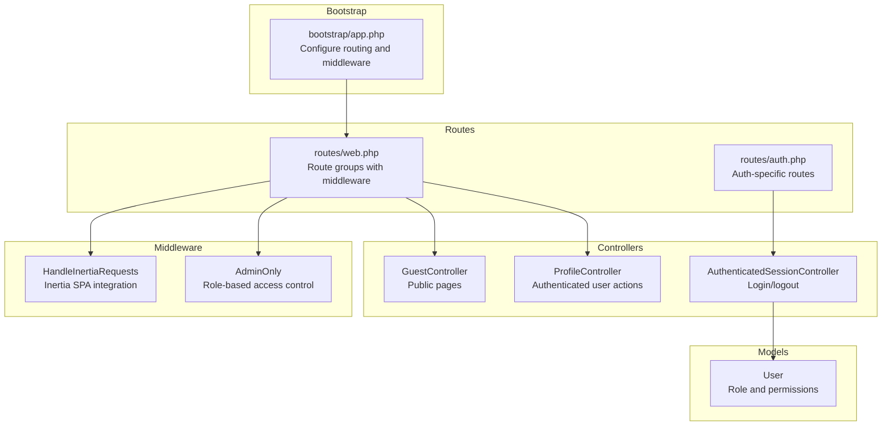
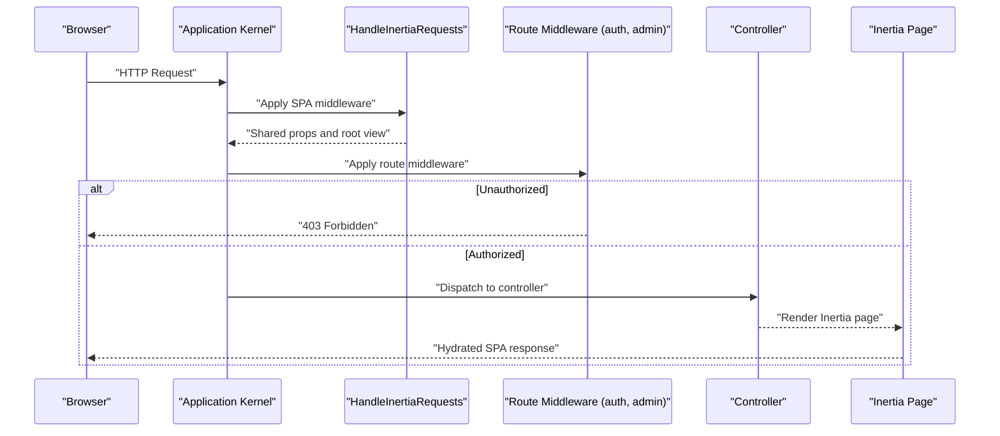
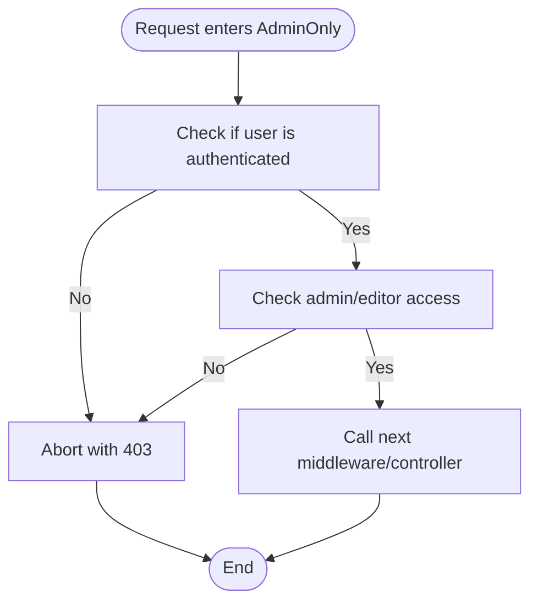
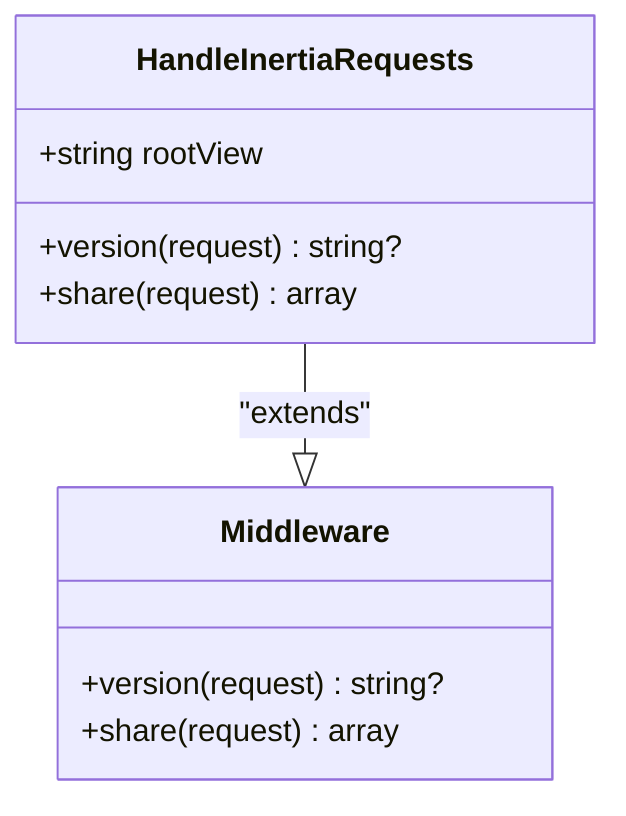
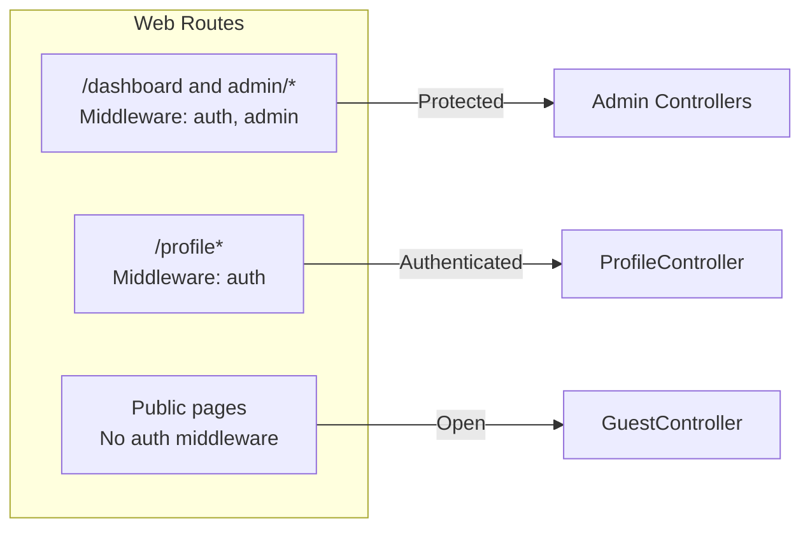
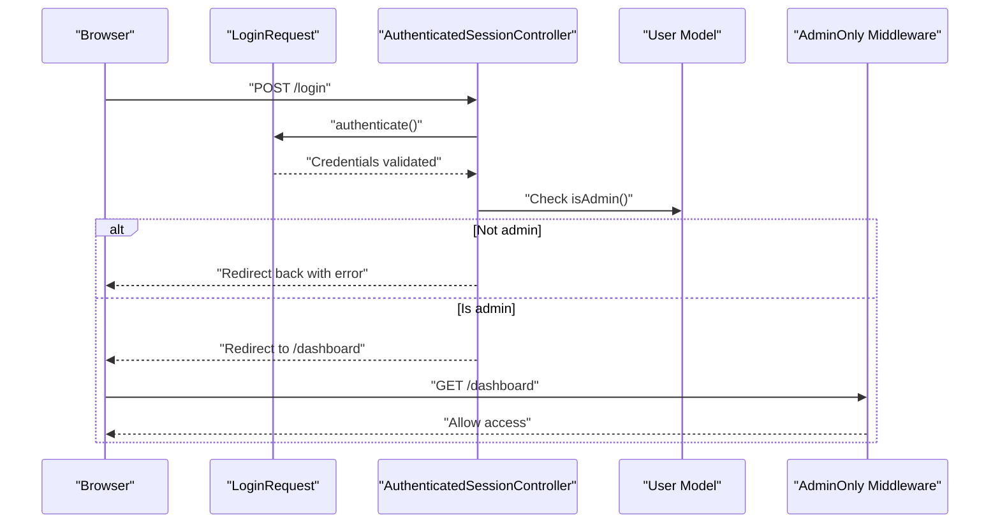
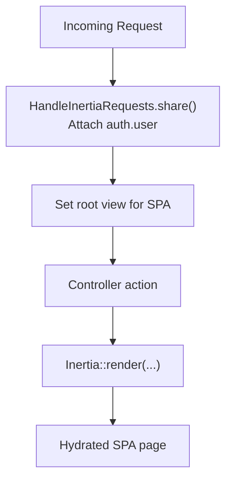
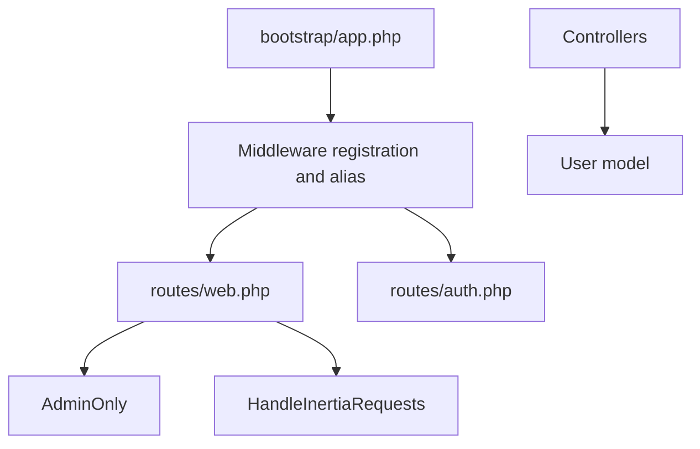

# Middleware Pipeline and Request Handling

<cite>
**Referenced Files in This Document**
- [AdminOnly.php](file://app/Http/Middleware/AdminOnly.php)
- [HandleInertiaRequests.php](file://app/Http/Middleware/HandleInertiaRequests.php)
- [app.php](file://bootstrap/app.php)
- [web.php](file://routes/web.php)
- [auth.php](file://routes/auth.php)
- [User.php](file://app/Models/User.php)
- [AuthenticatedSessionController.php](file://app/Http/Controllers/Auth/AuthenticatedSessionController.php)
- [LoginRequest.php](file://app/Http/Requests/Auth/LoginRequest.php)
- [GuestController.php](file://app/Http/Controllers/GuestController.php)
- [ProfileController.php](file://app/Http/Controllers/ProfileController.php)
- [.htaccess](file://public/.htaccess)
</cite>

## Table of Contents
1. [Introduction](#introduction)
2. [Project Structure](#project-structure)
3. [Core Components](#core-components)
4. [Architecture Overview](#architecture-overview)
5. [Detailed Component Analysis](#detailed-component-analysis)
6. [Dependency Analysis](#dependency-analysis)
7. [Performance Considerations](#performance-considerations)
8. [Troubleshooting Guide](#troubleshooting-guide)
9. [Conclusion](#conclusion)

## Introduction
This document explains the Laravel middleware pipeline and request handling in this project, focusing on:
- Role-based access control via the AdminOnly middleware
- Single Page Application (SPA) integration using HandleInertiaRequests
- Middleware execution order and conditional application
- Request lifecycle from arrival to response, including validation, authorization, and transformation phases
- Authentication middleware, CORS handling, and content negotiation
- Practical examples of middleware implementation, registration, and testing
- Performance impact, debugging techniques, and security considerations

## Project Structure
The middleware pipeline is configured during application bootstrapping and applied to route groups. The AdminOnly middleware enforces role-based access control, while HandleInertiaRequests integrates Inertia.js for SPA rendering.

**Diagram sources**
- [app.php:16-27](file://bootstrap/app.php#L16-L27)
- [web.php:86-143](file://routes/web.php#L86-L143)
- [auth.php:13-43](file://routes/auth.php#L13-L43)
- [HandleInertiaRequests.php:8-39](file://app/Http/Middleware/HandleInertiaRequests.php#L8-L39)
- [AdminOnly.php:9-24](file://app/Http/Middleware/AdminOnly.php#L9-L24)
- [GuestController.php:14-162](file://app/Http/Controllers/GuestController.php#L14-L162)
- [ProfileController.php:14-64](file://app/Http/Controllers/ProfileController.php#L14-L64)
- [AuthenticatedSessionController.php:13-58](file://app/Http/Controllers/Auth/AuthenticatedSessionController.php#L13-L58)
- [User.php:15-47](file://app/Models/User.php#L15-L47)

**Section sources**
- [app.php:16-27](file://bootstrap/app.php#L16-L27)
- [web.php:86-143](file://routes/web.php#L86-L143)
- [auth.php:13-43](file://routes/auth.php#L13-L43)

## Core Components
- AdminOnly middleware: Enforces access control by checking authentication and user role before allowing entry to admin-protected routes.
- HandleInertiaRequests middleware: Extends Inertia’s base middleware to set the root template and share the authenticated user across the application.
- Route middleware groups: Apply auth and admin guards to specific route groups for conditional middleware application.

Key responsibilities:
- AdminOnly: Abort unauthorized requests with a 403 response when the user is not authenticated or lacks admin/editor roles.
- HandleInertiaRequests: Provide a shared auth.user prop and manage asset versioning for SPA hydration.

**Section sources**
- [AdminOnly.php:16-23](file://app/Http/Middleware/AdminOnly.php#L16-L23)
- [HandleInertiaRequests.php:30-38](file://app/Http/Middleware/HandleInertiaRequests.php#L30-L38)
- [web.php:86-143](file://routes/web.php#L86-L143)

## Architecture Overview
The middleware pipeline runs per HTTP request. For web requests, HandleInertiaRequests executes first (via bootstrap configuration), followed by route-specific middleware. Admin-protected routes require both authentication and admin/editor privileges.

**Diagram sources**
- [app.php:16-27](file://bootstrap/app.php#L16-L27)
- [web.php:86-143](file://routes/web.php#L86-L143)
- [HandleInertiaRequests.php:30-38](file://app/Http/Middleware/HandleInertiaRequests.php#L30-L38)
- [AdminOnly.php:16-23](file://app/Http/Middleware/AdminOnly.php#L16-L23)

## Detailed Component Analysis

### AdminOnly Middleware
Purpose:
- Guard admin-protected routes by verifying the user is authenticated and has admin/editor roles.

Behavior:
- If the user is not authenticated or cannot access admin, abort with a 403 response.
- Otherwise, pass the request to the next middleware/controller.

**Diagram sources**
- [AdminOnly.php:16-23](file://app/Http/Middleware/AdminOnly.php#L16-L23)
- [User.php:42-45](file://app/Models/User.php#L42-L45)

**Section sources**
- [AdminOnly.php:16-23](file://app/Http/Middleware/AdminOnly.php#L16-L23)
- [User.php:32-45](file://app/Models/User.php#L32-L45)

### HandleInertiaRequests Middleware
Purpose:
- Integrate Inertia.js for SPA rendering by setting the root template and sharing the authenticated user.

Behavior:
- Sets the root template for initial page loads.
- Shares the authenticated user under a global prop for client-side hydration.
- Delegates asset versioning to the parent Inertia middleware.

**Diagram sources**
- [HandleInertiaRequests.php:8-39](file://app/Http/Middleware/HandleInertiaRequests.php#L8-L39)

**Section sources**
- [HandleInertiaRequests.php:15-38](file://app/Http/Middleware/HandleInertiaRequests.php#L15-L38)

### Route Groups and Conditional Middleware Application
- Admin-protected routes: Grouped under both auth and admin middleware to enforce authentication and role checks.
- Authenticated-only routes: Profile management endpoints require only the auth middleware.
- Public routes: GuestController renders public pages without requiring authentication.

**Diagram sources**
- [web.php:86-143](file://routes/web.php#L86-L143)
- [web.php:145-152](file://routes/web.php#L145-L152)
- [GuestController.php:19-162](file://app/Http/Controllers/GuestController.php#L19-L162)
- [ProfileController.php:19-64](file://app/Http/Controllers/ProfileController.php#L19-L64)

**Section sources**
- [web.php:86-143](file://routes/web.php#L86-L143)
- [web.php:145-152](file://routes/web.php#L145-L152)

### Authentication and Authorization Flow
- LoginRequest validates credentials and rate limits attempts.
- AuthenticatedSessionController authenticates the user and restricts access to admins only.
- AdminOnly middleware enforces role-based access control on protected routes.

**Diagram sources**
- [LoginRequest.php:41-54](file://app/Http/Requests/Auth/LoginRequest.php#L41-L54)
- [AuthenticatedSessionController.php:28-43](file://app/Http/Controllers/Auth/AuthenticatedSessionController.php#L28-L43)
- [User.php:32-35](file://app/Models/User.php#L32-L35)
- [AdminOnly.php:16-23](file://app/Http/Middleware/AdminOnly.php#L16-L23)

**Section sources**
- [LoginRequest.php:28-54](file://app/Http/Requests/Auth/LoginRequest.php#L28-L54)
- [AuthenticatedSessionController.php:28-43](file://app/Http/Controllers/Auth/AuthenticatedSessionController.php#L28-L43)
- [User.php:32-35](file://app/Models/User.php#L32-L35)

### Content Negotiation and SPA Hydration
- HandleInertiaRequests shares the authenticated user globally for client hydration.
- The root template is configured for initial page loads.
- Public routes leverage Inertia rendering for SPA-like navigation.

**Diagram sources**
- [HandleInertiaRequests.php:30-38](file://app/Http/Middleware/HandleInertiaRequests.php#L30-L38)
- [GuestController.php:19-83](file://app/Http/Controllers/GuestController.php#L19-L83)

**Section sources**
- [HandleInertiaRequests.php:15-38](file://app/Http/Middleware/HandleInertiaRequests.php#L15-L38)
- [GuestController.php:19-83](file://app/Http/Controllers/GuestController.php#L19-L83)

## Dependency Analysis
- Middleware registration and aliasing occur in the application bootstrap.
- Route groups specify middleware stacks for different route sets.
- Controllers depend on the authenticated user model for role checks.

**Diagram sources**
- [app.php:16-27](file://bootstrap/app.php#L16-L27)
- [web.php:86-143](file://routes/web.php#L86-L143)
- [auth.php:13-43](file://routes/auth.php#L13-L43)
- [AdminOnly.php:9-24](file://app/Http/Middleware/AdminOnly.php#L9-L24)
- [HandleInertiaRequests.php:8-39](file://app/Http/Middleware/HandleInertiaRequests.php#L8-L39)
- [User.php:15-47](file://app/Models/User.php#L15-L47)

**Section sources**
- [app.php:16-27](file://bootstrap/app.php#L16-L27)
- [web.php:86-143](file://routes/web.php#L86-L143)
- [auth.php:13-43](file://routes/auth.php#L13-L43)

## Performance Considerations
- Minimize heavy work in middleware; keep checks lightweight (e.g., role checks).
- Use caching for expensive computations if needed.
- Keep middleware stacks concise; avoid unnecessary middleware on public routes.
- Prefer early exits (abort) to prevent downstream processing for unauthorized requests.

## Troubleshooting Guide
Common issues and resolutions:
- 403 Forbidden on admin routes:
  - Ensure the user is authenticated and has admin/editor roles.
  - Verify the admin middleware is applied to the route group.
- Login failures:
  - Check credential validation and rate limiting logic.
  - Confirm the user role allows admin access.
- SPA hydration errors:
  - Ensure the root template is correctly configured.
  - Verify the auth.user prop is being shared.

Debugging tips:
- Inspect request headers (e.g., X-Inertia) to differentiate SPA vs. JSON requests.
- Log middleware execution order and user roles.
- Use Laravel Telescope or similar tools to trace middleware and controller actions.

Security considerations:
- Always apply the admin middleware to sensitive routes.
- Enforce strong password hashing and secure session handling.
- Validate and sanitize all inputs using FormRequest classes.
- Limit exposed routes and avoid leaking internal details.

**Section sources**
- [AdminOnly.php:16-23](file://app/Http/Middleware/AdminOnly.php#L16-L23)
- [LoginRequest.php:41-77](file://app/Http/Requests/Auth/LoginRequest.php#L41-L77)
- [HandleInertiaRequests.php:30-38](file://app/Http/Middleware/HandleInertiaRequests.php#L30-L38)
- [.htaccess:8-14](file://public/.htaccess#L8-L14)

## Conclusion
This project implements a clean middleware pipeline with role-based access control and SPA integration. AdminOnly ensures only authorized users reach admin areas, while HandleInertiaRequests streamlines SPA rendering. Route groups apply middleware conditionally, and controllers rely on the User model for role checks. Following the outlined practices helps maintain performance, security, and maintainability.