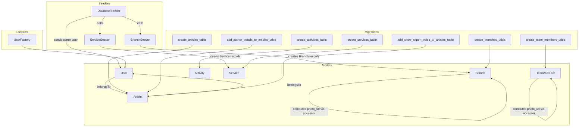
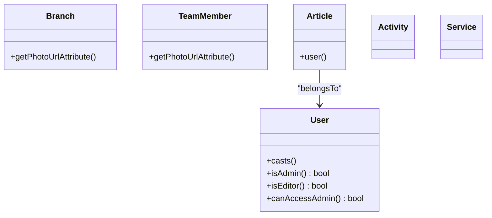
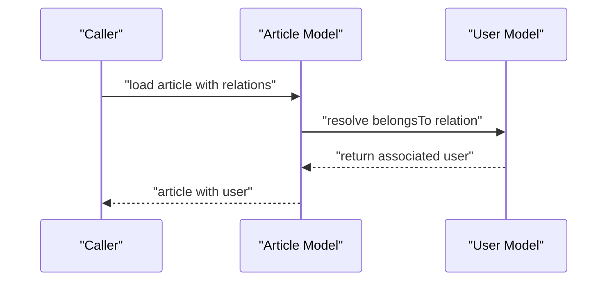
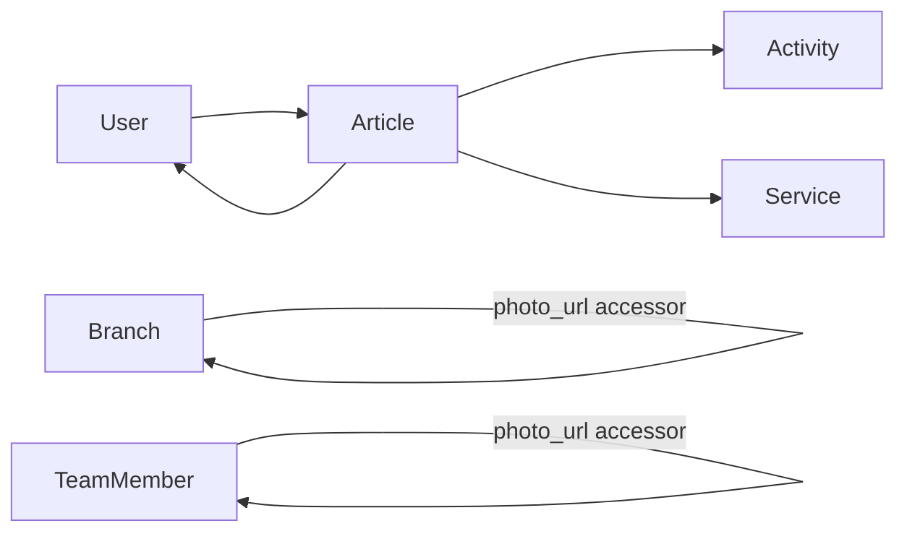

# Model Layer and Eloquent Relationships

<cite>
**Referenced Files in This Document**
- [User.php](file://app/Models/User.php)
- [Branch.php](file://app/Models/Branch.php)
- [TeamMember.php](file://app/Models/TeamMember.php)
- [Article.php](file://app/Models/Article.php)
- [Activity.php](file://app/Models/Activity.php)
- [Service.php](file://app/Models/Service.php)
- [UserFactory.php](file://database/factories/UserFactory.php)
- [2026_04_20_133158_create_branches_table.php](file://database/migrations/2026_04_20_133158_create_branches_table.php)
- [2026_04_25_153659_create_team_members_table.php](file://database/migrations/2026_04_25_153659_create_team_members_table.php)
- [2026_04_30_045526_create_activities_table.php](file://database/migrations/2026_04_30_045526_create_activities_table.php)
- [2026_04_30_050400_create_articles_table.php](file://database/migrations/2026_04_30_050400_create_articles_table.php)
- [2026_04_30_051304_add_author_details_to_articles_table.php](file://database/migrations/2026_04_30_051304_add_author_details_to_articles_table.php)
- [2026_04_30_051535_add_show_expert_voice_to_articles_table.php](file://database/migrations/2026_04_30_051535_add_show_expert_voice_to_articles_table.php)
- [2026_04_30_055559_create_services_table.php](file://database/migrations/2026_04_30_055559_create_services_table.php)
- [BranchSeeder.php](file://database/seeders/BranchSeeder.php)
- [ServiceSeeder.php](file://database/seeders/ServiceSeeder.php)
- [DatabaseSeeder.php](file://database/seeders/DatabaseSeeder.php)
</cite>

## Table of Contents
1. [Introduction](#introduction)
2. [Project Structure](#project-structure)
3. [Core Components](#core-components)
4. [Architecture Overview](#architecture-overview)
5. [Detailed Component Analysis](#detailed-component-analysis)
6. [Dependency Analysis](#dependency-analysis)
7. [Performance Considerations](#performance-considerations)
8. [Troubleshooting Guide](#troubleshooting-guide)
9. [Conclusion](#conclusion)
10. [Appendices](#appendices)

## Introduction
This document explains the Laravel model layer and Eloquent relationships used in the EduFA project. It focuses on the User, Branch, TeamMember, Article, Activity, and Service models, detailing their structure, relationships, accessors and mutators, query scopes, and supporting database migrations and factories. It also covers validation, mass assignment protection, data transformation patterns, pivot table handling, model events, testing, performance optimization, and database design best practices.

## Project Structure
The model layer resides under app/Models and is supported by database migrations, factories, and seeders under database/. The models define fillable attributes, accessors for computed fields, and basic relationships. Migrations define the schema, while factories and seeders support development and testing data.

**Diagram sources**
- [User.php:13-46](file://app/Models/User.php#L13-L46)
- [Branch.php:21-34](file://app/Models/Branch.php#L21-L34)
- [TeamMember.php:17-22](file://app/Models/TeamMember.php#L17-L22)
- [Article.php:23-26](file://app/Models/Article.php#L23-L26)
- [2026_04_20_133158_create_branches_table.php:14-23](file://database/migrations/2026_04_20_133158_create_branches_table.php#L14-L23)
- [2026_04_25_153659_create_team_members_table.php:14-22](file://database/migrations/2026_04_25_153659_create_team_members_table.php#L14-L22)
- [2026_04_30_045526_create_activities_table.php:14-22](file://database/migrations/2026_04_30_045526_create_activities_table.php#L14-L22)
- [2026_04_30_050400_create_articles_table.php:14-24](file://database/migrations/2026_04_30_050400_create_articles_table.php#L14-L24)
- [2026_04_30_051304_add_author_details_to_articles_table.php:14-18](file://database/migrations/2026_04_30_051304_add_author_details_to_articles_table.php#L14-L18)
- [2026_04_30_051535_add_show_expert_voice_to_articles_table.php:14-16](file://database/migrations/2026_04_30_051535_add_show_expert_voice_to_articles_table.php#L14-L16)
- [2026_04_30_055559_create_services_table.php:14-20](file://database/migrations/2026_04_30_055559_create_services_table.php#L14-L20)
- [UserFactory.php:25-34](file://database/factories/UserFactory.php#L25-L34)
- [DatabaseSeeder.php:14-30](file://database/seeders/DatabaseSeeder.php#L14-L30)
- [BranchSeeder.php:15-66](file://database/seeders/BranchSeeder.php#L15-L66)
- [ServiceSeeder.php:13-57](file://database/seeders/ServiceSeeder.php#L13-L57)

**Section sources**
- [User.php:13-46](file://app/Models/User.php#L13-L46)
- [Branch.php:21-34](file://app/Models/Branch.php#L21-L34)
- [TeamMember.php:17-22](file://app/Models/TeamMember.php#L17-L22)
- [Article.php:23-26](file://app/Models/Article.php#L23-L26)
- [2026_04_20_133158_create_branches_table.php:14-23](file://database/migrations/2026_04_20_133158_create_branches_table.php#L14-L23)
- [2026_04_25_153659_create_team_members_table.php:14-22](file://database/migrations/2026_04_25_153659_create_team_members_table.php#L14-L22)
- [2026_04_30_045526_create_activities_table.php:14-22](file://database/migrations/2026_04_30_045526_create_activities_table.php#L14-L22)
- [2026_04_30_050400_create_articles_table.php:14-24](file://database/migrations/2026_04_30_050400_create_articles_table.php#L14-L24)
- [2026_04_30_051304_add_author_details_to_articles_table.php:14-18](file://database/migrations/2026_04_30_051304_add_author_details_to_articles_table.php#L14-L18)
- [2026_04_30_051535_add_show_expert_voice_to_articles_table.php:14-16](file://database/migrations/2026_04_30_051535_add_show_expert_voice_to_articles_table.php#L14-L16)
- [2026_04_30_055559_create_services_table.php:14-20](file://database/migrations/2026_04_30_055559_create_services_table.php#L14-L20)
- [UserFactory.php:25-34](file://database/factories/UserFactory.php#L25-L34)
- [DatabaseSeeder.php:14-30](file://database/seeders/DatabaseSeeder.php#L14-L30)
- [BranchSeeder.php:15-66](file://database/seeders/BranchSeeder.php#L15-L66)
- [ServiceSeeder.php:13-57](file://database/seeders/ServiceSeeder.php#L13-L57)

## Core Components
- User: Central authentication and authorization model with role checks and hashed password casting. Uses attributes-based fillable and hidden declarations.
- Branch: Geographic branch locations with optional photo path and a computed photo_url accessor.
- TeamMember: Personnel records with type, role, and image_path, plus a computed photo_url accessor.
- Article: Content posts authored by User, with author metadata and expert voice toggle.
- Activity: Media-rich activity entries with type and media_type.
- Service: Service offerings with slug-based routing and optional Google Form URL.

Key model characteristics:
- Mass assignment protection via guarded/fillable arrays and attributes.
- Accessors for derived/computed fields (e.g., photo_url).
- Basic relationships defined (Article belongs to User).
- Casts for date/time and password hashing.

**Section sources**
- [User.php:13-46](file://app/Models/User.php#L13-L46)
- [Branch.php:21-34](file://app/Models/Branch.php#L21-L34)
- [TeamMember.php:17-22](file://app/Models/TeamMember.php#L17-L22)
- [Article.php:23-26](file://app/Models/Article.php#L23-L26)
- [Activity.php:9](file://app/Models/Activity.php#L9)
- [Service.php:9-14](file://app/Models/Service.php#L9-L14)

## Architecture Overview
The model layer follows Laravel conventions:
- Models encapsulate table schemas and business logic.
- Relationships connect entities (e.g., Article to User).
- Accessors transform stored data for presentation.
- Factories and seeders populate test/dev environments.
- Migrations define evolving schemas over time.

**Diagram sources**
- [User.php:25-46](file://app/Models/User.php#L25-L46)
- [Branch.php:23-34](file://app/Models/Branch.php#L23-L34)
- [TeamMember.php:19-22](file://app/Models/TeamMember.php#L19-L22)
- [Article.php:23-26](file://app/Models/Article.php#L23-L26)

## Detailed Component Analysis

### User Model
- Role-based access helpers enable authorization decisions.
- Attribute-level fillable and hidden lists simplify mass assignment control.
- Passwords are cast to hashed values for secure storage.

Practical usage:
- Use role helpers in middleware or controllers to gate admin/editor features.
- Leverage casts for consistent datetime/password handling.

**Section sources**
- [User.php:13-46](file://app/Models/User.php#L13-L46)

### Branch Model
- Fillable fields include city, type, address, coordinates, and optional photo path.
- Accessor computes a public photo URL from either an absolute URL or a storage path.

Practical usage:
- Display branch photos with normalized URLs.
- Store only relative storage paths; accessor handles asset resolution.

**Section sources**
- [Branch.php:12-34](file://app/Models/Branch.php#L12-L34)
- [2026_04_20_133158_create_branches_table.php:14-23](file://database/migrations/2026_04_20_133158_create_branches_table.php#L14-L23)

### TeamMember Model
- Stores personnel details and image_path.
- Accessor returns a public URL for the team member’s image.

Practical usage:
- Use accessor to render profile images consistently across views.

**Section sources**
- [TeamMember.php:9-22](file://app/Models/TeamMember.php#L9-L22)
- [2026_04_25_153659_create_team_members_table.php:14-22](file://database/migrations/2026_04_25_153659_create_team_members_table.php#L14-L22)

### Article Model
- Defines fillable fields including author metadata and expert voice flag.
- Relationship to User via belongsTo.
- Additional migrations add author fields and show_expert_voice toggle.

Practical usage:
- Query published articles and eager load author details.
- Toggle expert voice visibility per article.

**Diagram sources**
- [Article.php:23-26](file://app/Models/Article.php#L23-L26)
- [User.php:13-46](file://app/Models/User.php#L13-L46)

**Section sources**
- [Article.php:9-26](file://app/Models/Article.php#L9-L26)
- [2026_04_30_050400_create_articles_table.php:14-24](file://database/migrations/2026_04_30_050400_create_articles_table.php#L14-L24)
- [2026_04_30_051304_add_author_details_to_articles_table.php:14-18](file://database/migrations/2026_04_30_051304_add_author_details_to_articles_table.php#L14-L18)
- [2026_04_30_051535_add_show_expert_voice_to_articles_table.php:14-16](file://database/migrations/2026_04_30_051535_add_show_expert_voice_to_articles_table.php#L14-L16)

### Activity Model
- Stores activity metadata with type and media_type enums and media_path.
- Suitable for photo/video media entries.

**Section sources**
- [Activity.php:9](file://app/Models/Activity.php#L9)
- [2026_04_30_045526_create_activities_table.php:14-22](file://database/migrations/2026_04_30_045526_create_activities_table.php#L14-L22)

### Service Model
- Provides service listings with slugs for SEO-friendly URLs and optional Google Form links.

**Section sources**
- [Service.php:9-14](file://app/Models/Service.php#L9-L14)
- [2026_04_30_055559_create_services_table.php:14-20](file://database/migrations/2026_04_30_055559_create_services_table.php#L14-L20)

### Eloquent Relationships
- One-to-many: Article belongs to User.
- No many-to-many or polymorphic relationships are defined in the examined models.
- Pivot tables are not present in the provided migrations.

Recommendations:
- For many-to-many relationships, introduce dedicated pivot tables and use belongsToMany.
- For polymorphic associations, use morphTo/morphMany when entities share a media relationship across multiple types.

**Section sources**
- [Article.php:23-26](file://app/Models/Article.php#L23-L26)

### Accessors and Mutators
- Branch and TeamMember expose photo_url via accessors.
- User defines casts for email verification and password hashing.

Best practices:
- Keep accessors lightweight; avoid heavy computation.
- Use casts for consistent serialization and hydration.

**Section sources**
- [Branch.php:21-34](file://app/Models/Branch.php#L21-L34)
- [TeamMember.php:17-22](file://app/Models/TeamMember.php#L17-L22)
- [User.php:25-31](file://app/Models/User.php#L25-L31)

### Query Scopes
- No custom query scopes are defined in the examined models.

Consider adding scopes for common filters (e.g., published articles, active branches) to improve readability and reuse.

**Section sources**
- [Article.php:9-26](file://app/Models/Article.php#L9-L26)

### Model Validation and Mass Assignment Protection
- Mass assignment protection is enforced via fillable arrays and attributes.
- Validation should occur at the Request layer (FormRequest) before persisting model data.

Guidelines:
- Define strict fillable lists per model.
- Use FormRequest classes to validate incoming data.
- Avoid accepting raw input; map to fillable attributes explicitly.

**Section sources**
- [User.php:13-14](file://app/Models/User.php#L13-L14)
- [Branch.php:12-19](file://app/Models/Branch.php#L12-L19)
- [TeamMember.php:9-15](file://app/Models/TeamMember.php#L9-L15)
- [Article.php:9-21](file://app/Models/Article.php#L9-L21)
- [Activity.php:9](file://app/Models/Activity.php#L9)
- [Service.php:9-14](file://app/Models/Service.php#L9-L14)

### Data Transformation Patterns
- Accessors transform stored paths to public URLs.
- Casts normalize datetime and password fields.

Patterns:
- Use accessors for derived/computed fields.
- Use casts for consistent data types across requests and responses.

**Section sources**
- [Branch.php:21-34](file://app/Models/Branch.php#L21-L34)
- [TeamMember.php:17-22](file://app/Models/TeamMember.php#L17-L22)
- [User.php:25-31](file://app/Models/User.php#L25-L31)

### Pivot Table Handling
- No pivot tables are defined in the provided migrations.
- If future needs arise (e.g., User-Service enrollment), create a dedicated pivot table and define belongsToMany relationships accordingly.

**Section sources**
- [2026_04_30_055559_create_services_table.php:14-20](file://database/migrations/2026_04_30_055559_create_services_table.php#L14-L20)

### Model Events
- No explicit model events (booted, creating, saved, etc.) are defined in the examined models.

Consider adding events for auditing, notifications, or cascading updates when extending functionality.

**Section sources**
- [User.php:13-46](file://app/Models/User.php#L13-L46)
- [Branch.php:12-34](file://app/Models/Branch.php#L12-L34)
- [TeamMember.php:9-22](file://app/Models/TeamMember.php#L9-L22)
- [Article.php:9-26](file://app/Models/Article.php#L9-L26)
- [Activity.php:9](file://app/Models/Activity.php#L9)
- [Service.php:9-14](file://app/Models/Service.php#L9-L14)

### Model Testing
- A UserFactory exists to generate realistic test data.
- Seeders create initial datasets for branches and services.

Testing tips:
- Use factories to create models in tests.
- Seeders can bootstrap known datasets for integration tests.

**Section sources**
- [UserFactory.php:25-34](file://database/factories/UserFactory.php#L25-L34)
- [DatabaseSeeder.php:14-30](file://database/seeders/DatabaseSeeder.php#L14-L30)
- [BranchSeeder.php:15-66](file://database/seeders/BranchSeeder.php#L15-L66)
- [ServiceSeeder.php:13-57](file://database/seeders/ServiceSeeder.php#L13-L57)

## Dependency Analysis
The models depend on Laravel’s Eloquent ORM and database schema defined by migrations. Relationships are minimal and focused. Accessors depend on asset helpers for URL generation.

**Diagram sources**
- [Article.php:23-26](file://app/Models/Article.php#L23-L26)
- [User.php:13-46](file://app/Models/User.php#L13-L46)
- [Branch.php:21-34](file://app/Models/Branch.php#L21-L34)
- [TeamMember.php:17-22](file://app/Models/TeamMember.php#L17-L22)

**Section sources**
- [Article.php:23-26](file://app/Models/Article.php#L23-L26)
- [User.php:13-46](file://app/Models/User.php#L13-L46)
- [Branch.php:21-34](file://app/Models/Branch.php#L21-L34)
- [TeamMember.php:17-22](file://app/Models/TeamMember.php#L17-L22)

## Performance Considerations
- Prefer eager loading relationships to prevent N+1 queries.
- Use accessors judiciously; avoid expensive computations inside accessors.
- Add database indexes on frequently filtered columns (e.g., articles.slug, user_id).
- Use pagination for large collections.
- Cache computed accessors when appropriate.

## Troubleshooting Guide
Common issues and resolutions:
- Missing relationships: Ensure foreign keys and indexes exist; verify belongsTo constraints in migrations.
- Incorrect photo URLs: Confirm accessor logic and asset helper usage; check nullable photo_path values.
- Casting errors: Validate cast types and ensure data matches expected formats.
- Seed failures: Confirm environment variables and unique constraints (e.g., slug uniqueness).

**Section sources**
- [2026_04_30_050400_create_articles_table.php:14-24](file://database/migrations/2026_04_30_050400_create_articles_table.php#L14-L24)
- [2026_04_30_055559_create_services_table.php:14-20](file://database/migrations/2026_04_30_055559_create_services_table.php#L14-L20)
- [Branch.php:21-34](file://app/Models/Branch.php#L21-L34)
- [TeamMember.php:17-22](file://app/Models/TeamMember.php#L17-L22)

## Conclusion
The EduFA model layer leverages Laravel’s Eloquent ORM effectively with clear fillable lists, accessors for computed fields, and straightforward relationships. Extending to many-to-many or polymorphic relationships, adding query scopes, and implementing robust validation and testing will further strengthen the model layer.

## Appendices

### Database Design Best Practices
- Normalize where appropriate; keep denormalized fields (e.g., author_name/role/bio) for read-heavy presentation.
- Use enums for constrained fields (e.g., activity type, media_type).
- Maintain unique indexes on slugs for SEO-friendly URLs.
- Add timestamps and soft deletes where applicable.

**Section sources**
- [2026_04_30_050400_create_articles_table.php:14-24](file://database/migrations/2026_04_30_050400_create_articles_table.php#L14-L24)
- [2026_04_30_045526_create_activities_table.php:14-22](file://database/migrations/2026_04_30_045526_create_activities_table.php#L14-L22)
- [2026_04_30_055559_create_services_table.php:14-20](file://database/migrations/2026_04_30_055559_create_services_table.php#L14-L20)