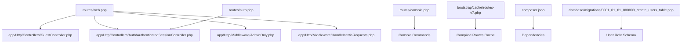
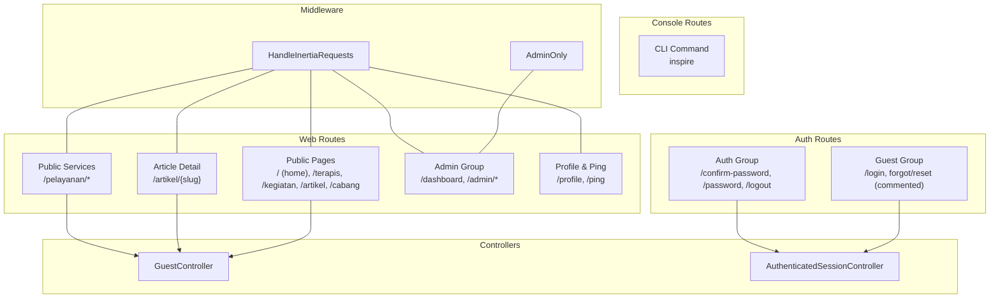
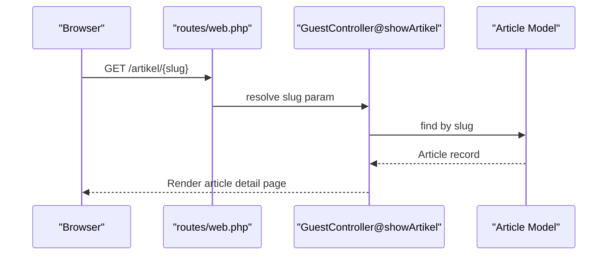
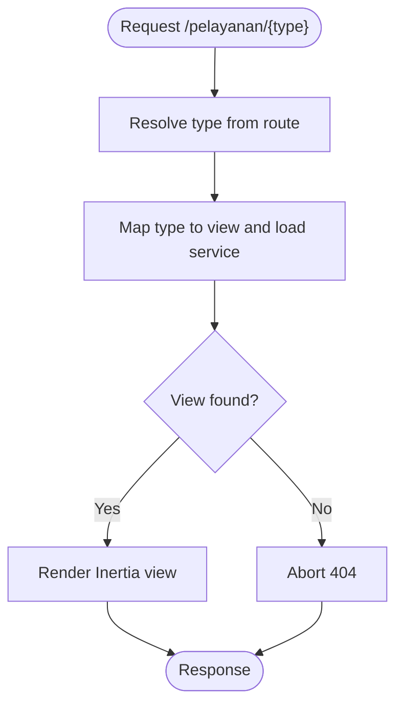
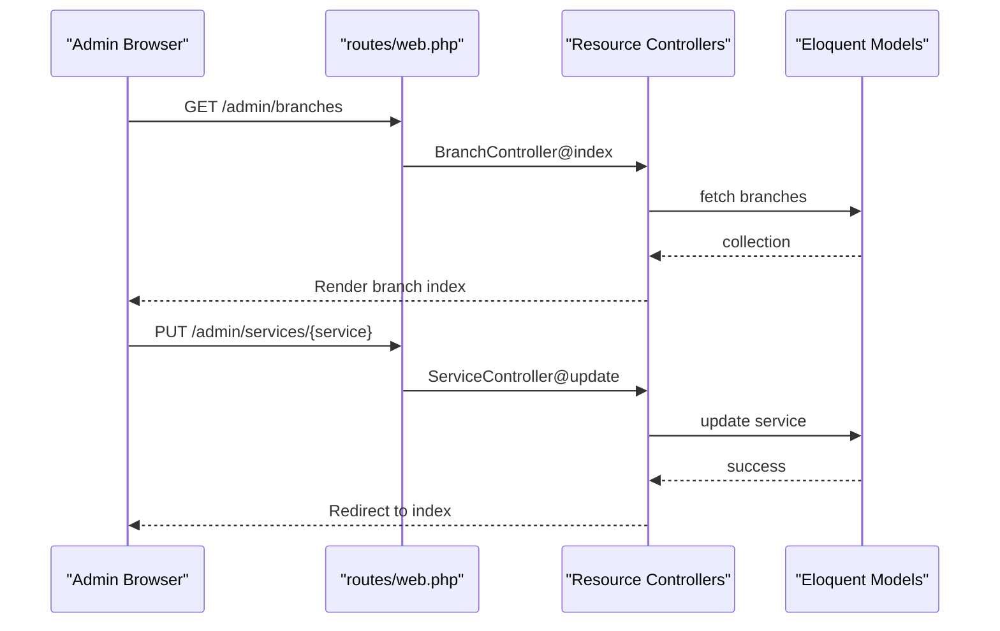
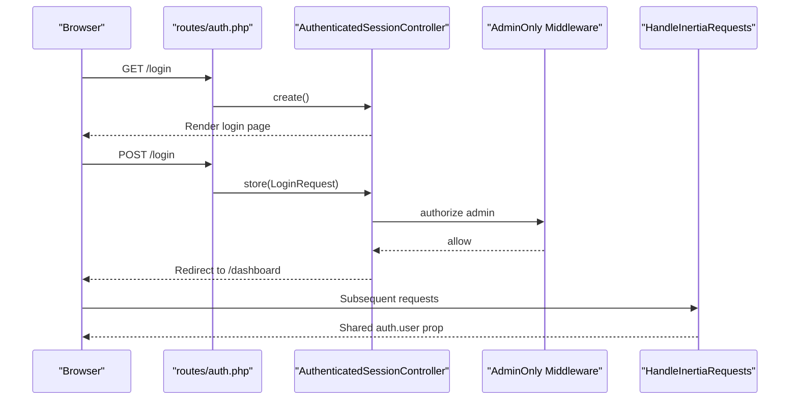
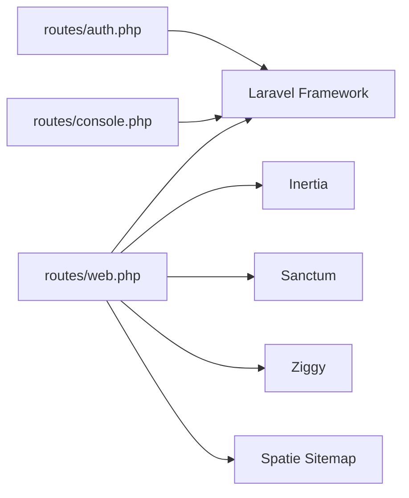

# Routing System and URL Patterns

<cite>
**Referenced Files in This Document**
- [routes/web.php](file://routes/web.php)
- [routes/auth.php](file://routes/auth.php)
- [routes/console.php](file://routes/console.php)
- [bootstrap/cache/routes-v7.php](file://bootstrap/cache/routes-v7.php)
- [app/Http/Middleware/AdminOnly.php](file://app/Http/Middleware/AdminOnly.php)
- [app/Http/Middleware/HandleInertiaRequests.php](file://app/Http/Middleware/HandleInertiaRequests.php)
- [app/Http/Controllers/GuestController.php](file://app/Http/Controllers/GuestController.php)
- [app/Http/Controllers/Auth/AuthenticatedSessionController.php](file://app/Http/Controllers/Auth/AuthenticatedSessionController.php)
- [composer.json](file://composer.json)
- [database/migrations/0001_01_01_000000_create_users_table.php](file://database/migrations/0001_01_01_000000_create_users_table.php)
</cite>

## Table of Contents
1. [Introduction](#introduction)
2. [Project Structure](#project-structure)
3. [Core Components](#core-components)
4. [Architecture Overview](#architecture-overview)
5. [Detailed Component Analysis](#detailed-component-analysis)
6. [Dependency Analysis](#dependency-analysis)
7. [Performance Considerations](#performance-considerations)
8. [Troubleshooting Guide](#troubleshooting-guide)
9. [Conclusion](#conclusion)

## Introduction
This document explains the Laravel routing system and URL patterns used in the EDUfa platform. It covers the routing architecture across web routes, authenticated routes, and console routes. It documents route definition patterns, parameter binding, and route model binding. It also details the URL patterns for public service pages (/pelayanan/*), administrative interfaces (/admin/*), and authentication endpoints (/login, /logout, /confirm-password, /password). Practical examples of route groups, middleware assignment, and resource routing are included, along with guidance on named routes, URL generation, route caching, performance optimization, and debugging techniques.

## Project Structure
The routing system is primarily defined in three files:
- Web routes: [routes/web.php](file://routes/web.php)
- Authentication routes: [routes/auth.php](file://routes/auth.php)
- Console commands: [routes/console.php](file://routes/console.php)

Additional supporting components:
- Compiled route cache: [bootstrap/cache/routes-v7.php](file://bootstrap/cache/routes-v7.php)
- Middleware for admin-only access: [app/Http/Middleware/AdminOnly.php](file://app/Http/Middleware/AdminOnly.php)
- Inertia request handling: [app/Http/Middleware/HandleInertiaRequests.php](file://app/Http/Middleware/HandleInertiaRequests.php)
- Public pages controller: [app/Http/Controllers/GuestController.php](file://app/Http/Controllers/GuestController.php)
- Authentication controller: [app/Http/Controllers/Auth/AuthenticatedSessionController.php](file://app/Http/Controllers/Auth/AuthenticatedSessionController.php)
- Dependencies and packages: [composer.json](file://composer.json)
- User role schema: [database/migrations/0001_01_01_000000_create_users_table.php](file://database/migrations/0001_01_01_000000_create_users_table.php)

**Diagram sources**
- [routes/web.php:1-137](file://routes/web.php#L1-L137)
- [routes/auth.php:1-44](file://routes/auth.php#L1-L44)
- [routes/console.php:1-9](file://routes/console.php#L1-L9)
- [bootstrap/cache/routes-v7.php:1-800](file://bootstrap/cache/routes-v7.php#L1-L800)
- [app/Http/Middleware/AdminOnly.php:1-25](file://app/Http/Middleware/AdminOnly.php#L1-L25)
- [app/Http/Middleware/HandleInertiaRequests.php:1-40](file://app/Http/Middleware/HandleInertiaRequests.php#L1-L40)
- [app/Http/Controllers/GuestController.php:1-119](file://app/Http/Controllers/GuestController.php#L1-L119)
- [app/Http/Controllers/Auth/AuthenticatedSessionController.php:1-58](file://app/Http/Controllers/Auth/AuthenticatedSessionController.php#L1-L58)
- [composer.json:1-91](file://composer.json#L1-L91)
- [database/migrations/0001_01_01_000000_create_users_table.php:1-53](file://database/migrations/0001_01_01_000000_create_users_table.php#L1-L53)

**Section sources**
- [routes/web.php:1-137](file://routes/web.php#L1-L137)
- [routes/auth.php:1-44](file://routes/auth.php#L1-L44)
- [routes/console.php:1-9](file://routes/console.php#L1-L9)
- [bootstrap/cache/routes-v7.php:1-800](file://bootstrap/cache/routes-v7.php#L1-L800)
- [composer.json:1-91](file://composer.json#L1-L91)

## Core Components
- Web routes define public pages, sitemaps, nested route groups, resource routes, and authenticated/admin-only routes.
- Authentication routes define login/logout and password confirmation endpoints under guest/auth middleware groups.
- Console routes define CLI commands for development and maintenance tasks.
- Compiled route cache improves performance by precompiling route matching logic.
- Middleware enforces admin-only access and shares Inertia data across requests.
- Controllers render Inertia pages and handle business logic for public and admin endpoints.

Key route categories:
- Public pages: home, therapists, activities, articles, branches, article detail by slug.
- Public service pages: grouped under /pelayanan/* with defaults for service type.
- Administrative interfaces: dashboard and resource routes under /admin/* with explicit named routes.
- Authentication endpoints: login, logout, password confirmation, and password update.
- Profile endpoints: edit/update/destroy under auth middleware.
- Sitemap endpoint: dynamic XML generation for SEO.

**Section sources**
- [routes/web.php:13-47](file://routes/web.php#L13-L47)
- [routes/web.php:51-66](file://routes/web.php#L51-L66)
- [routes/web.php:68-125](file://routes/web.php#L68-L125)
- [routes/web.php:127-134](file://routes/web.php#L127-L134)
- [routes/auth.php:13-43](file://routes/auth.php#L13-L43)
- [routes/console.php:6-8](file://routes/console.php#L6-L8)
- [bootstrap/cache/routes-v7.php:50-755](file://bootstrap/cache/routes-v7.php#L50-L755)

## Architecture Overview
The routing architecture separates concerns into:
- Web routes: public and admin surfaces.
- Auth routes: guest and authenticated flows.
- Console routes: CLI tasks.
- Middleware: admin-only enforcement and Inertia data sharing.
- Controllers: page rendering and business logic.

**Diagram sources**
- [routes/web.php:51-134](file://routes/web.php#L51-L134)
- [routes/auth.php:13-43](file://routes/auth.php#L13-L43)
- [routes/console.php:6-8](file://routes/console.php#L6-L8)
- [app/Http/Middleware/AdminOnly.php:16-23](file://app/Http/Middleware/AdminOnly.php#L16-L23)
- [app/Http/Middleware/HandleInertiaRequests.php:30-38](file://app/Http/Middleware/HandleInertiaRequests.php#L30-L38)
- [app/Http/Controllers/GuestController.php:19-118](file://app/Http/Controllers/GuestController.php#L19-L118)
- [app/Http/Controllers/Auth/AuthenticatedSessionController.php:18-57](file://app/Http/Controllers/Auth/AuthenticatedSessionController.php#L18-L57)

## Detailed Component Analysis

### Web Routes: Public Pages and Parameter Binding
- Named routes enable predictable URL generation and navigation.
- Parameter binding via route model binding is used implicitly for slugs in article detail.
- Defaults are applied for service type in public service routes.

**Diagram sources**
- [routes/web.php:55](file://routes/web.php#L55)
- [app/Http/Controllers/GuestController.php:65-83](file://app/Http/Controllers/GuestController.php#L65-L83)

**Section sources**
- [routes/web.php:51-55](file://routes/web.php#L51-L55)
- [routes/web.php:58-66](file://routes/web.php#L58-L66)
- [app/Http/Controllers/GuestController.php:65-83](file://app/Http/Controllers/GuestController.php#L65-L83)

### Web Routes: Public Service Pages (/pelayanan/*)
- Route group prefixes /pelayanan and assigns defaults for service type.
- Controller maps service type to specific Inertia views and loads associated service data.

**Diagram sources**
- [routes/web.php:58-66](file://routes/web.php#L58-L66)
- [app/Http/Controllers/GuestController.php:98-117](file://app/Http/Controllers/GuestController.php#L98-L117)

**Section sources**
- [routes/web.php:58-66](file://routes/web.php#L58-L66)
- [app/Http/Controllers/GuestController.php:98-117](file://app/Http/Controllers/GuestController.php#L98-L117)

### Web Routes: Administrative Interfaces (/admin/*)
- Admin-only routes under auth and admin middleware groups.
- Resource routes define index/store/create/show/edit/update/destroy actions with explicit names.
- Dashboard renders statistics and recent items.

**Diagram sources**
- [routes/web.php:68-125](file://routes/web.php#L68-L125)

**Section sources**
- [routes/web.php:68-125](file://routes/web.php#L68-L125)

### Authentication Routes and Middleware
- Guest group exposes login endpoints; auth group exposes password confirmation, password update, and logout.
- Admin-only middleware checks authentication and role-based access.
- Inertia middleware shares authenticated user data across requests.

**Diagram sources**
- [routes/auth.php:13-43](file://routes/auth.php#L13-L43)
- [app/Http/Controllers/Auth/AuthenticatedSessionController.php:18-57](file://app/Http/Controllers/Auth/AuthenticatedSessionController.php#L18-L57)
- [app/Http/Middleware/AdminOnly.php:16-23](file://app/Http/Middleware/AdminOnly.php#L16-L23)
- [app/Http/Middleware/HandleInertiaRequests.php:30-38](file://app/Http/Middleware/HandleInertiaRequests.php#L30-L38)

**Section sources**
- [routes/auth.php:13-43](file://routes/auth.php#L13-L43)
- [app/Http/Middleware/AdminOnly.php:16-23](file://app/Http/Middleware/AdminOnly.php#L16-L23)
- [app/Http/Middleware/HandleInertiaRequests.php:30-38](file://app/Http/Middleware/HandleInertiaRequests.php#L30-L38)
- [app/Http/Controllers/Auth/AuthenticatedSessionController.php:18-57](file://app/Http/Controllers/Auth/AuthenticatedSessionController.php#L18-L57)

### Console Routes
- Defines a CLI command for inspirational quotes.

**Section sources**
- [routes/console.php:6-8](file://routes/console.php#L6-L8)

### Route Groups, Middleware Assignment, and Resource Routing
- Route groups encapsulate related routes with shared prefixes and names.
- Middleware assignment ensures admin-only access for admin routes and auth for profile routes.
- Resource routing generates conventional CRUD endpoints with customizable names.

Examples by reference:
- Admin group with resource routes: [routes/web.php:86-124](file://routes/web.php#L86-L124)
- Profile group with auth middleware: [routes/web.php:127-134](file://routes/web.php#L127-L134)
- Authentication guest/auth groups: [routes/auth.php:13-43](file://routes/auth.php#L13-L43)

**Section sources**
- [routes/web.php:86-124](file://routes/web.php#L86-L124)
- [routes/web.php:127-134](file://routes/web.php#L127-L134)
- [routes/auth.php:13-43](file://routes/auth.php#L13-L43)

### Named Routes and URL Generation
- Named routes enable deterministic URL generation across the application.
- Examples of named routes include home, terapis, kegiatan, artikel, artikel.show, cabang, and admin.* variants.
- URL generation is commonly used in frontend frameworks and forms.

References:
- Named public routes: [routes/web.php:51-56](file://routes/web.php#L51-L56)
- Named public service routes: [routes/web.php:58-66](file://routes/web.php#L58-L66)
- Named admin routes: [routes/web.php:86-124](file://routes/web.php#L86-L124)
- Named profile routes: [routes/web.php:127-134](file://routes/web.php#L127-L134)
- Compiled route names: [bootstrap/cache/routes-v7.php:70-755](file://bootstrap/cache/routes-v7.php#L70-L755)

**Section sources**
- [routes/web.php:51-56](file://routes/web.php#L51-L56)
- [routes/web.php:58-66](file://routes/web.php#L58-L66)
- [routes/web.php:86-124](file://routes/web.php#L86-L124)
- [routes/web.php:127-134](file://routes/web.php#L127-L134)
- [bootstrap/cache/routes-v7.php:70-755](file://bootstrap/cache/routes-v7.php#L70-L755)

### Route Model Binding
- Implicit binding resolves route parameters to models by matching the parameter name to a model property (e.g., slug to Article).
- Explicit binding can be configured in RouteServiceProvider for stronger control.

References:
- Slug-based binding in article detail: [routes/web.php:55](file://routes/web.php#L55)
- Controller method receiving slug: [app/Http/Controllers/GuestController.php:65](file://app/Http/Controllers/GuestController.php#L65)

**Section sources**
- [routes/web.php:55](file://routes/web.php#L55)
- [app/Http/Controllers/GuestController.php:65-83](file://app/Http/Controllers/GuestController.php#L65-L83)

### Route Caching, Performance, and Debugging
- Compiled route cache improves performance by precomputing route matching.
- Route debugging can be aided by inspecting compiled routes and verifying named route presence.

References:
- Compiled routes cache: [bootstrap/cache/routes-v7.php:1-800](file://bootstrap/cache/routes-v7.php#L1-L800)
- Route caching command (typical Laravel): [composer.json:38-72](file://composer.json#L38-L72)

**Section sources**
- [bootstrap/cache/routes-v7.php:1-800](file://bootstrap/cache/routes-v7.php#L1-L800)
- [composer.json:38-72](file://composer.json#L38-L72)

## Dependency Analysis
The routing system depends on:
- Laravel framework for routing primitives and HTTP kernel.
- Inertia for server-rendered single-page experiences.
- Sanctum for CSRF cookie and session-based authentication.
- Ziggy for client-side route resolution in JavaScript.
- Sitemap package for dynamic XML sitemap generation.

**Diagram sources**
- [routes/web.php:1-137](file://routes/web.php#L1-L137)
- [routes/auth.php:1-44](file://routes/auth.php#L1-L44)
- [routes/console.php:1-9](file://routes/console.php#L1-L9)
- [composer.json:8-16](file://composer.json#L8-L16)

**Section sources**
- [composer.json:8-16](file://composer.json#L8-L16)
- [routes/web.php:1-137](file://routes/web.php#L1-L137)
- [routes/auth.php:1-44](file://routes/auth.php#L1-L44)
- [routes/console.php:1-9](file://routes/console.php#L1-L9)

## Performance Considerations
- Enable route caching in production to reduce bootstrapping overhead.
- Minimize wildcard routes and use explicit named routes for predictable performance.
- Leverage compiled route cache for faster request dispatching.
- Keep middleware chains lean; combine responsibilities where appropriate.

[No sources needed since this section provides general guidance]

## Troubleshooting Guide
Common issues and remedies:
- 403 Forbidden on admin routes: verify admin middleware and user role.
- 404 on article detail: ensure slug uniqueness and correct parameter binding.
- Missing Ziggy configuration in frontend: confirm Ziggy is initialized and routes JSON is present.
- Route name not found: verify route names in route files and compiled cache.

References:
- Admin-only middleware: [app/Http/Middleware/AdminOnly.php:16-23](file://app/Http/Middleware/AdminOnly.php#L16-L23)
- User role schema: [database/migrations/0001_01_01_000000_create_users_table.php:22](file://database/migrations/0001_01_01_000000_create_users_table.php#L22)
- Compiled route names: [bootstrap/cache/routes-v7.php:70-755](file://bootstrap/cache/routes-v7.php#L70-L755)

**Section sources**
- [app/Http/Middleware/AdminOnly.php:16-23](file://app/Http/Middleware/AdminOnly.php#L16-L23)
- [database/migrations/0001_01_01_000000_create_users_table.php:22](file://database/migrations/0001_01_01_000000_create_users_table.php#L22)
- [bootstrap/cache/routes-v7.php:70-755](file://bootstrap/cache/routes-v7.php#L70-L755)

## Conclusion
EDUfa’s routing system cleanly separates public, admin, and authentication concerns. Named routes, route groups, and resource routing simplify URL management and maintainability. Admin-only middleware and Inertia integration provide secure, responsive user experiences. Compiled route caches and careful middleware design contribute to performance. Following the patterns documented here ensures consistent URL behavior and easier debugging across the platform.