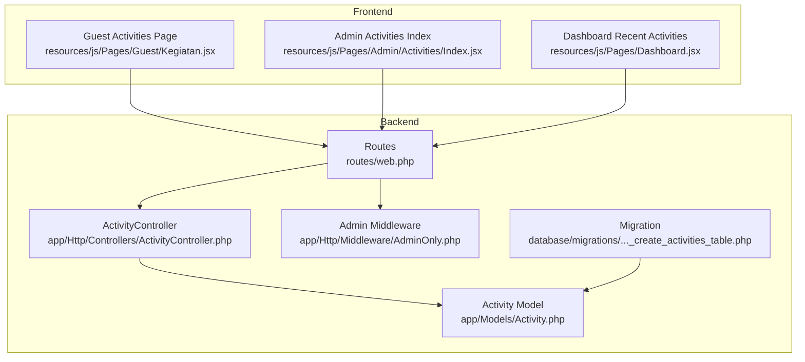
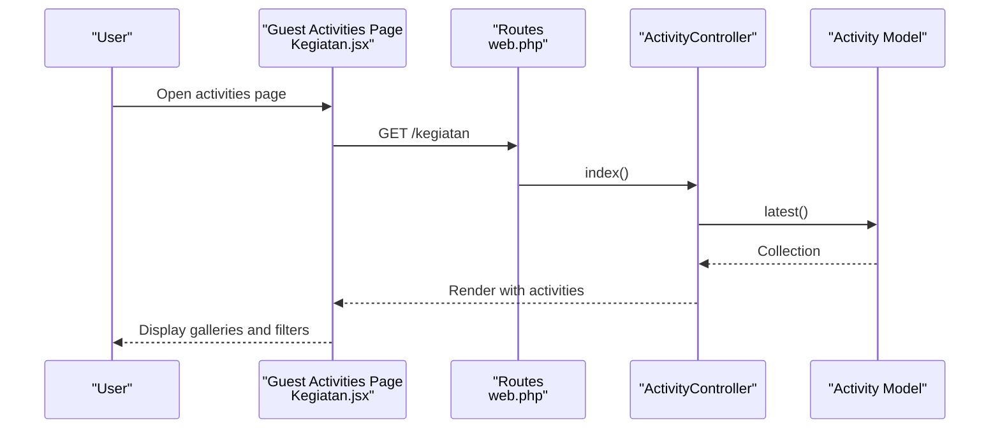
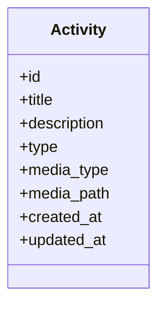
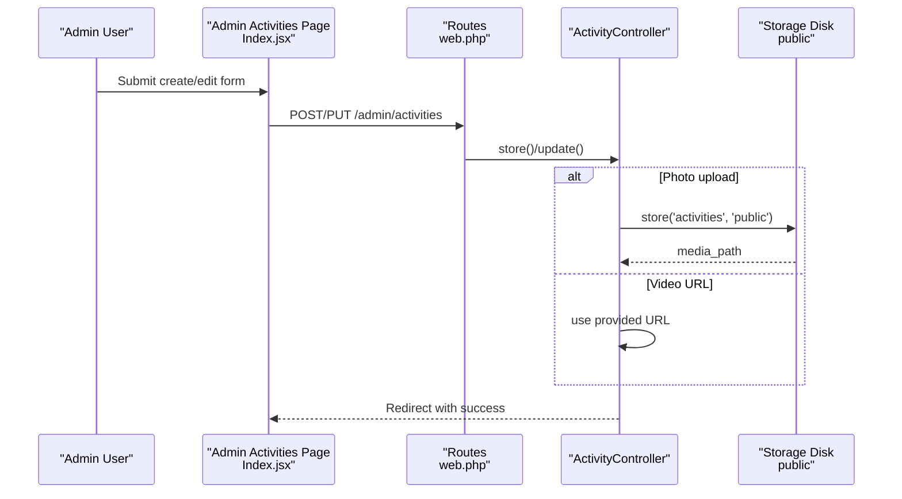
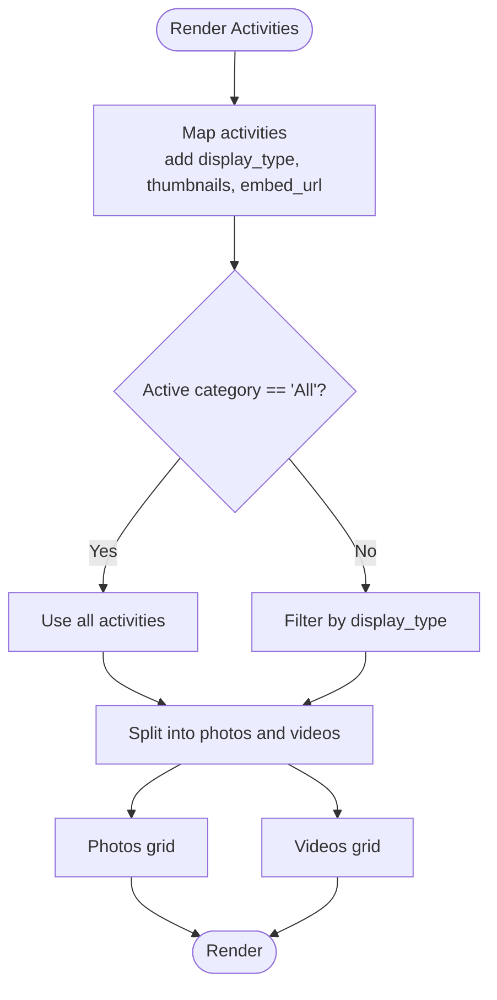
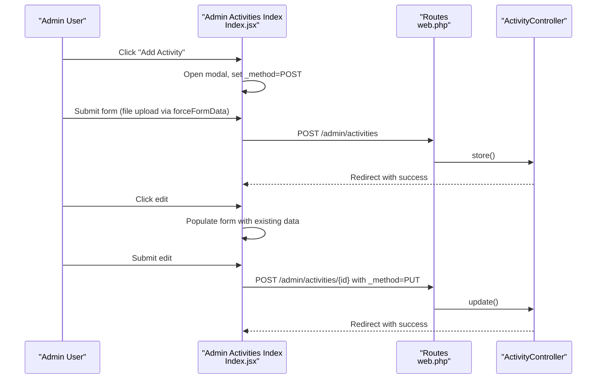
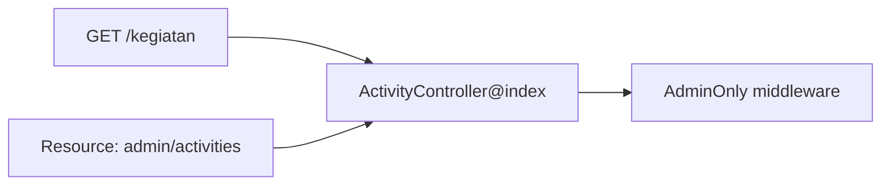
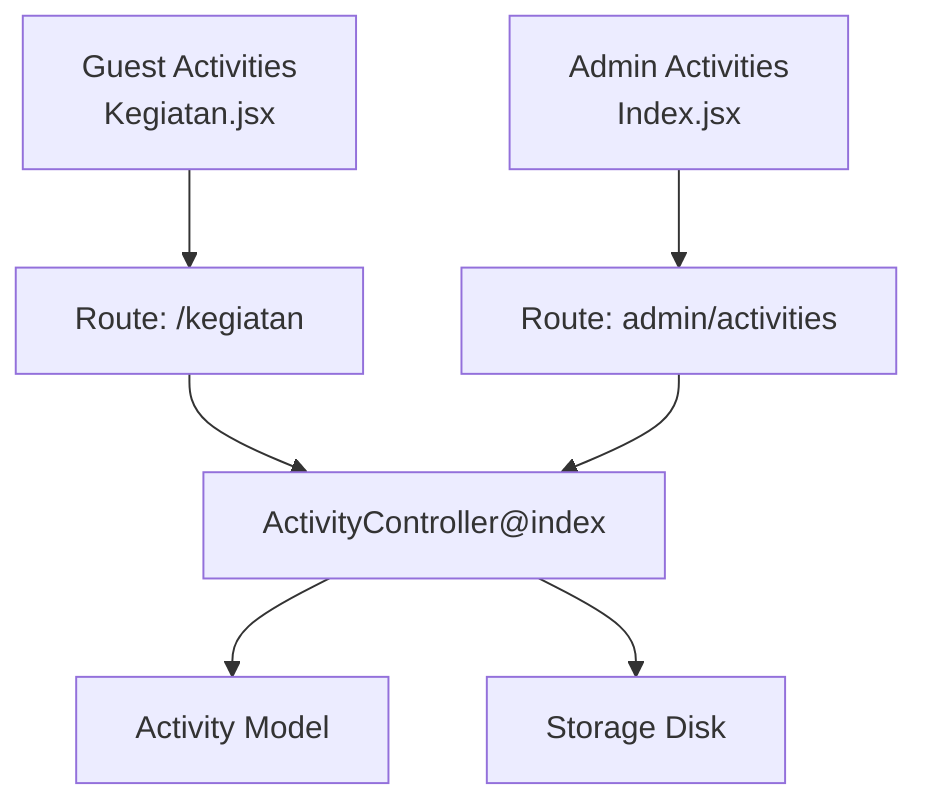

# Activity and Event Scheduling

<cite>
**Referenced Files in This Document**
- [Activity.php](file://app/Models/Activity.php)
- [ActivityController.php](file://app/Http/Controllers/ActivityController.php)
- [2026_04_30_045526_create_activities_table.php](file://database/migrations/2026_04_30_045526_create_activities_table.php)
- [Kegiatan.jsx](file://resources/js/Pages/Guest/Kegiatan.jsx)
- [Index.jsx](file://resources/js/Pages/Admin/Activities/Index.jsx)
- [web.php](file://routes/web.php)
- [AdminOnly.php](file://app/Http/Middleware/AdminOnly.php)
- [Dashboard.jsx](file://resources/js/Pages/Dashboard.jsx)
</cite>

## Table of Contents
1. [Introduction](#introduction)
2. [Project Structure](#project-structure)
3. [Core Components](#core-components)
4. [Architecture Overview](#architecture-overview)
5. [Detailed Component Analysis](#detailed-component-analysis)
6. [Dependency Analysis](#dependency-analysis)
7. [Performance Considerations](#performance-considerations)
8. [Troubleshooting Guide](#troubleshooting-guide)
9. [Conclusion](#conclusion)

## Introduction
This document describes the activity and event scheduling system implemented in the EduFA application. It covers the activity model, backend controller, frontend pages for guests and administrators, routing, and middleware protection. The current implementation focuses on activity documentation (photos and videos) with categories for therapy and classroom activities, and provides administrative capabilities to manage these activities. Features such as calendar integration, event filtering by date/type, registration workflows, recurring events, notifications, and attendance tracking are not present in the current codebase and would require extension.

## Project Structure
The activity system spans Laravel backend models/controllers, database migrations, and Inertia/React frontend pages:
- Backend: Eloquent model, controller, route resource, and middleware
- Frontend: Guest page for browsing activities and admin page for managing them
- Routing: Named routes under admin namespace with admin-only middleware

**Diagram sources**
- [Activity.php:1-11](file://app/Models/Activity.php#L1-L11)
- [ActivityController.php:1-107](file://app/Http/Controllers/ActivityController.php#L1-L107)
- [2026_04_30_045526_create_activities_table.php:1-33](file://database/migrations/2026_04_30_045526_create_activities_table.php#L1-L33)
- [Kegiatan.jsx:1-376](file://resources/js/Pages/Guest/Kegiatan.jsx#L1-L376)
- [Index.jsx:1-353](file://resources/js/Pages/Admin/Activities/Index.jsx#L1-L353)
- [web.php:70-127](file://routes/web.php#L70-L127)
- [AdminOnly.php:1-25](file://app/Http/Middleware/AdminOnly.php#L1-L25)
- [Dashboard.jsx:112-139](file://resources/js/Pages/Dashboard.jsx#L112-L139)

**Section sources**
- [web.php:70-127](file://routes/web.php#L70-L127)
- [Activity.php:1-11](file://app/Models/Activity.php#L1-L11)
- [ActivityController.php:1-107](file://app/Http/Controllers/ActivityController.php#L1-L107)
- [2026_04_30_045526_create_activities_table.php:1-33](file://database/migrations/2026_04_30_045526_create_activities_table.php#L1-L33)
- [Kegiatan.jsx:1-376](file://resources/js/Pages/Guest/Kegiatan.jsx#L1-L376)
- [Index.jsx:1-353](file://resources/js/Pages/Admin/Activities/Index.jsx#L1-L353)
- [AdminOnly.php:1-25](file://app/Http/Middleware/AdminOnly.php#L1-L25)
- [Dashboard.jsx:112-139](file://resources/js/Pages/Dashboard.jsx#L112-L139)

## Core Components
- Activity model: Defines fillable attributes for title, description, type, media type, and media path.
- ActivityController: Handles listing, creating, updating, and deleting activities with validation and media handling.
- Database migration: Creates the activities table with appropriate columns and enums.
- Guest Activities page: Renders activity galleries, filters by category, and supports photo/video viewing.
- Admin Activities page: Provides search, create/edit modal, and delete actions via resource routes.
- Routes and middleware: Resource routes under admin namespace with admin-only protection.

**Section sources**
- [Activity.php:7-10](file://app/Models/Activity.php#L7-L10)
- [ActivityController.php:15-105](file://app/Http/Controllers/ActivityController.php#L15-L105)
- [2026_04_30_045526_create_activities_table.php:14-22](file://database/migrations/2026_04_30_045526_create_activities_table.php#L14-L22)
- [Kegiatan.jsx:203-376](file://resources/js/Pages/Guest/Kegiatan.jsx#L203-L376)
- [Index.jsx:22-353](file://resources/js/Pages/Admin/Activities/Index.jsx#L22-L353)
- [web.php:108-116](file://routes/web.php#L108-L116)
- [AdminOnly.php:16-23](file://app/Http/Middleware/AdminOnly.php#L16-L23)

## Architecture Overview
The system follows a standard MVC pattern with Inertia.js for SSR-like rendering:
- Routes define endpoints and bind them to controllers.
- Controllers coordinate validation, persistence, and media storage.
- Models encapsulate table schema and relationships.
- Frontend pages render lists and forms, interacting with controllers via resource routes.

**Diagram sources**
- [Kegiatan.jsx:203-238](file://resources/js/Pages/Guest/Kegiatan.jsx#L203-L238)
- [web.php:55-55](file://routes/web.php#L55-L55)
- [ActivityController.php:15-20](file://app/Http/Controllers/ActivityController.php#L15-L20)
- [Activity.php:7-10](file://app/Models/Activity.php#L7-L10)

**Section sources**
- [web.php:55-55](file://routes/web.php#L55-L55)
- [ActivityController.php:15-20](file://app/Http/Controllers/ActivityController.php#L15-L20)
- [Kegiatan.jsx:203-238](file://resources/js/Pages/Guest/Kegiatan.jsx#L203-L238)

## Detailed Component Analysis

### Activity Model
The Activity model defines the fillable attributes used for creating and updating records. It stores:
- Title: string
- Description: text (nullable)
- Type: enum with values 'terapi' and 'kelas'
- Media type: enum with values 'photo' and 'video'
- Media path: string storing either a public storage path (photo) or a URL (video)

**Diagram sources**
- [Activity.php:7-10](file://app/Models/Activity.php#L7-L10)
- [2026_04_30_045526_create_activities_table.php:14-22](file://database/migrations/2026_04_30_045526_create_activities_table.php#L14-L22)

**Section sources**
- [Activity.php:7-10](file://app/Models/Activity.php#L7-L10)
- [2026_04_30_045526_create_activities_table.php:14-22](file://database/migrations/2026_04_30_045526_create_activities_table.php#L14-L22)

### ActivityController
Responsibilities:
- index(): Returns activities ordered by latest for the guest page.
- store(): Validates input, handles photo upload or video URL, persists record, and redirects with success feedback.
- update(): Validates input, replaces or clears media depending on type, persists changes, and redirects with success feedback.
- destroy(): Deletes associated media (if photo) and removes the record.

Validation rules:
- Title: required, string, max length
- Description: nullable, string
- Type: required, enum 'terapi' or 'kelas'
- Media type: required, enum 'photo' or 'video'
- Media file: required if media_type is photo, image, specific MIME types, max size
- Video URL: required if media_type is video, URL format

**Diagram sources**
- [Index.jsx:63-81](file://resources/js/Pages/Admin/Activities/Index.jsx#L63-L81)
- [web.php:108-116](file://routes/web.php#L108-L116)
- [ActivityController.php:25-93](file://app/Http/Controllers/ActivityController.php#L25-L93)

**Section sources**
- [ActivityController.php:15-105](file://app/Http/Controllers/ActivityController.php#L15-L105)
- [Index.jsx:32-81](file://resources/js/Pages/Admin/Activities/Index.jsx#L32-L81)

### Guest Activities Page (Kegiatan.jsx)
Key features:
- Category tabs: filter by 'All', 'Class Activity', 'Therapy'
- Photo gallery: clickable cards with hover overlays and lightbox modal
- Video gallery: clickable cards with play overlay and embedded player modal
- Embed conversion: YouTube and Google Drive URLs converted to embed URLs
- Thumbnail generation: photo path or YouTube maxres thumbnail fallback

**Diagram sources**
- [Kegiatan.jsx:226-238](file://resources/js/Pages/Guest/Kegiatan.jsx#L226-L238)
- [Kegiatan.jsx:210-224](file://resources/js/Pages/Guest/Kegiatan.jsx#L210-L224)

**Section sources**
- [Kegiatan.jsx:203-376](file://resources/js/Pages/Guest/Kegiatan.jsx#L203-L376)

### Admin Activities Page (Index.jsx)
Key features:
- Search bar: filters by title or type
- Table: shows media preview, title/type badges, and description
- Create/Edit modal: supports photo upload or video URL input, with previews and validation
- Delete action: confirms deletion and triggers route

**Diagram sources**
- [Index.jsx:42-81](file://resources/js/Pages/Admin/Activities/Index.jsx#L42-L81)
- [web.php:108-116](file://routes/web.php#L108-L116)
- [ActivityController.php:25-93](file://app/Http/Controllers/ActivityController.php#L25-L93)

**Section sources**
- [Index.jsx:22-188](file://resources/js/Pages/Admin/Activities/Index.jsx#L22-L188)
- [web.php:108-116](file://routes/web.php#L108-L116)

### Routes and Middleware
- Resource routes for admin/activities bound to ActivityController with named routes.
- Admin-only middleware protects admin routes; combined with auth middleware in the group.
- Guest route for /kegiatan renders the activities page.

**Diagram sources**
- [web.php:55-55](file://routes/web.php#L55-L55)
- [web.php:108-116](file://routes/web.php#L108-L116)
- [AdminOnly.php:16-23](file://app/Http/Middleware/AdminOnly.php#L16-L23)

**Section sources**
- [web.php:55-55](file://routes/web.php#L55-L55)
- [web.php:108-116](file://routes/web.php#L108-L116)
- [AdminOnly.php:16-23](file://app/Http/Middleware/AdminOnly.php#L16-L23)

### Dashboard Recent Activities
The dashboard displays recent activities, linking to the admin activities management page.

**Section sources**
- [Dashboard.jsx:112-139](file://resources/js/Pages/Dashboard.jsx#L112-L139)

## Dependency Analysis
- Frontend depends on Inertia for server-rendered responses and React for UI.
- Backend depends on Laravel Eloquent ORM and Storage facade for media handling.
- Routes depend on controller actions and middleware for access control.
- No external calendar library is integrated; calendar views and recurring events are not implemented.

**Diagram sources**
- [Kegiatan.jsx:203-238](file://resources/js/Pages/Guest/Kegiatan.jsx#L203-L238)
- [Index.jsx:22-353](file://resources/js/Pages/Admin/Activities/Index.jsx#L22-L353)
- [web.php:55-55](file://routes/web.php#L55-L55)
- [web.php:108-116](file://routes/web.php#L108-L116)
- [ActivityController.php:15-105](file://app/Http/Controllers/ActivityController.php#L15-L105)
- [Activity.php:7-10](file://app/Models/Activity.php#L7-L10)

**Section sources**
- [web.php:55-55](file://routes/web.php#L55-L55)
- [web.php:108-116](file://routes/web.php#L108-L116)
- [ActivityController.php:15-105](file://app/Http/Controllers/ActivityController.php#L15-L105)
- [Activity.php:7-10](file://app/Models/Activity.php#L7-L10)

## Performance Considerations
- Media storage: Photo uploads are stored on the public disk; ensure appropriate disk performance and CDN configuration for production.
- Image validation: Photo uploads are validated for MIME types and size; consider optimizing image compression for better load times.
- Frontend filtering: Client-side filtering is efficient for small datasets; pagination or server-side filtering may be needed as data grows.
- Embed URLs: Converting YouTube/Drive links to embed URLs happens client-side; caching or pre-processing could reduce runtime overhead.

## Troubleshooting Guide
Common issues and resolutions:
- Validation errors on create/edit: Ensure required fields match validation rules and media constraints.
- Photo upload failures: Verify storage permissions and disk configuration for the public disk.
- Video URL invalid: Confirm URL matches supported patterns for embedding.
- Access denied: Ensure admin middleware is applied and user has permission to access admin routes.
- Missing thumbnails: Confirm media path exists and fallback placeholders are used when absent.

**Section sources**
- [ActivityController.php:27-34](file://app/Http/Controllers/ActivityController.php#L27-L34)
- [ActivityController.php:59-66](file://app/Http/Controllers/ActivityController.php#L59-L66)
- [Index.jsx:27-30](file://resources/js/Pages/Admin/Activities/Index.jsx#L27-L30)
- [AdminOnly.php:16-23](file://app/Http/Middleware/AdminOnly.php#L16-L23)

## Conclusion
The activity and event scheduling system currently provides a robust foundation for documenting activities as photos or videos with therapy/classroom categorization. The backend offers secure CRUD operations with media handling, while the frontend delivers intuitive galleries and admin management. Calendar integration, event filtering by date/type, registration workflows, recurring events, notifications, and attendance tracking are not implemented and would require extending the model, controller, routes, and frontend components accordingly.