# Branch Location Management

<cite>
**Referenced Files in This Document**
- [Branch.php](file://app/Models/Branch.php)
- [BranchController.php](file://app/Http/Controllers/BranchController.php)
- [create_branches_table.php](file://database/migrations/2026_04_20_133158_create_branches_table.php)
- [BranchSeeder.php](file://database/seeders/BranchSeeder.php)
- [web.php](file://routes/web.php)
- [GuestController.php](file://app/Http/Controllers/GuestController.php)
- [LeafletMap.jsx](file://resources/js/Components/ui/LeafletMap.jsx)
- [BranchSection.jsx](file://resources/js/Components/BranchSection.jsx)
- [Cabang.jsx](file://resources/js/Pages/Guest/Cabang.jsx)
- [AdminBranchesIndex.jsx](file://resources/js/Pages/Admin/Branches/Index.jsx)
- [Page.jsx](file://resources/js/Pages/Guest/Page.jsx)
- [package.json](file://package.json)
</cite>

## Table of Contents
1. [Introduction](#introduction)
2. [Project Structure](#project-structure)
3. [Core Components](#core-components)
4. [Architecture Overview](#architecture-overview)
5. [Detailed Component Analysis](#detailed-component-analysis)
6. [Dependency Analysis](#dependency-analysis)
7. [Performance Considerations](#performance-considerations)
8. [Troubleshooting Guide](#troubleshooting-guide)
9. [Conclusion](#conclusion)

## Introduction
This document describes the branch location management system that powers EDUfa Centre's network of branches across Indonesia. It covers the branch model with geographic coordinates, address information, contact details, and operational hours. It explains the integration with Leaflet.js for interactive map display, location-based filtering, and distance calculations. It documents the admin interface for branch creation, editing, and status management, and details the front-end implementation for branch listing, map visualization, and location search functionality. Finally, it addresses branch-specific service offerings, staff assignments, and capacity management.

## Project Structure
The branch management system spans Laravel backend models and controllers, database migrations and seeders, and React-based frontend pages and components. Routes define the admin and guest endpoints, while the frontend integrates Leaflet.js for map visualization and distance computation.

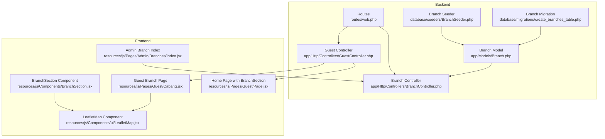

**Diagram sources**
- [Branch.php:1-36](file://app/Models/Branch.php#L1-L36)
- [BranchController.php:1-88](file://app/Http/Controllers/BranchController.php#L1-L88)
- [create_branches_table.php:1-34](file://database/migrations/2026_04_20_133158_create_branches_table.php#L1-L34)
- [BranchSeeder.php:1-67](file://database/seeders/BranchSeeder.php#L1-L67)
- [web.php:1-137](file://routes/web.php#L1-L137)
- [GuestController.php:1-119](file://app/Http/Controllers/GuestController.php#L1-L119)
- [LeafletMap.jsx:1-78](file://resources/js/Components/ui/LeafletMap.jsx#L1-L78)
- [BranchSection.jsx:1-135](file://resources/js/Components/BranchSection.jsx#L1-L135)
- [Cabang.jsx:1-393](file://resources/js/Pages/Guest/Cabang.jsx#L1-L393)
- [AdminBranchesIndex.jsx:1-340](file://resources/js/Pages/Admin/Branches/Index.jsx#L1-L340)
- [Page.jsx:1-545](file://resources/js/Pages/Guest/Page.jsx#L1-L545)

**Section sources**
- [Branch.php:1-36](file://app/Models/Branch.php#L1-L36)
- [BranchController.php:1-88](file://app/Http/Controllers/BranchController.php#L1-L88)
- [create_branches_table.php:1-34](file://database/migrations/2026_04_20_133158_create_branches_table.php#L1-L34)
- [BranchSeeder.php:1-67](file://database/seeders/BranchSeeder.php#L1-L67)
- [web.php:1-137](file://routes/web.php#L1-L137)
- [GuestController.php:1-119](file://app/Http/Controllers/GuestController.php#L1-L119)
- [LeafletMap.jsx:1-78](file://resources/js/Components/ui/LeafletMap.jsx#L1-L78)
- [BranchSection.jsx:1-135](file://resources/js/Components/BranchSection.jsx#L1-L135)
- [Cabang.jsx:1-393](file://resources/js/Pages/Guest/Cabang.jsx#L1-L393)
- [AdminBranchesIndex.jsx:1-340](file://resources/js/Pages/Admin/Branches/Index.jsx#L1-L340)
- [Page.jsx:1-545](file://resources/js/Pages/Guest/Page.jsx#L1-L545)

## Core Components
- Branch Model: Defines fillable attributes, geographic coordinates, and computed photo URL resolution.
- Branch Controller: Handles listing, creation, updates, and deletion of branches with image uploads.
- Database Migration: Creates the branches table with city, type, address, latitude, longitude, and photo path.
- Seeder: Seeds the database with real branch data across Indonesia.
- Routes: Expose admin endpoints for managing branches and guest endpoints for displaying branches.
- Frontend Components: Admin UI for CRUD operations and guest UI for map and listing with search and distance calculation.

Key capabilities:
- Geographic data storage and retrieval
- Photo management with local storage and URL resolution
- Interactive map visualization with Leaflet.js
- Location-based filtering and distance calculation
- Admin CRUD interface with modal forms

**Section sources**
- [Branch.php:12-34](file://app/Models/Branch.php#L12-L34)
- [BranchController.php:17-86](file://app/Http/Controllers/BranchController.php#L17-L86)
- [create_branches_table.php:14-23](file://database/migrations/2026_04_20_133158_create_branches_table.php#L14-L23)
- [BranchSeeder.php:17-64](file://database/seeders/BranchSeeder.php#L17-L64)
- [web.php:86-94](file://routes/web.php#L86-L94)

## Architecture Overview
The system follows a classic MVC pattern with Laravel backend and React frontend. The Branch model persists branch data, the Branch controller handles requests, and the frontend renders interactive maps and lists.

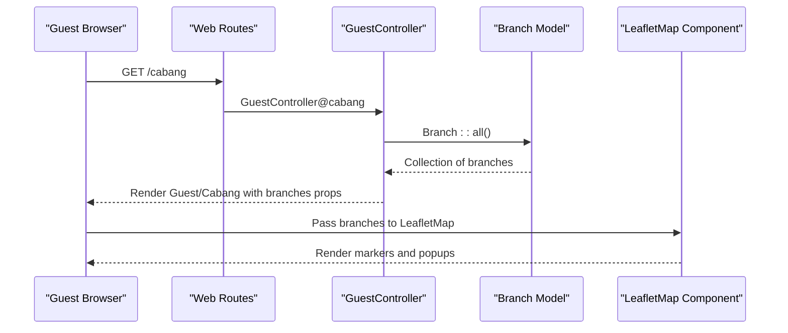

**Diagram sources**
- [web.php:56-93](file://routes/web.php#L56-L93)
- [GuestController.php:88-93](file://app/Http/Controllers/GuestController.php#L88-L93)
- [Cabang.jsx:46-95](file://resources/js/Pages/Guest/Cabang.jsx#L46-L95)
- [LeafletMap.jsx:36-77](file://resources/js/Components/ui/LeafletMap.jsx#L36-L77)

## Detailed Component Analysis

### Branch Model
The Branch model defines the branch entity with fillable fields for city, type, address, latitude, longitude, and photo path. It computes a photo URL that supports both external URLs and local storage assets.

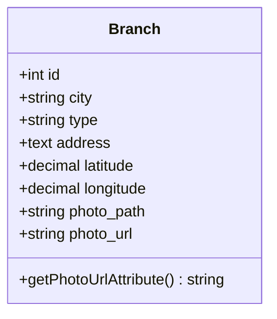

**Diagram sources**
- [Branch.php:8-34](file://app/Models/Branch.php#L8-L34)

**Section sources**
- [Branch.php:12-34](file://app/Models/Branch.php#L12-L34)

### Branch Controller
The Branch controller manages the admin CRUD operations for branches, including validation, image handling, and redirect responses.

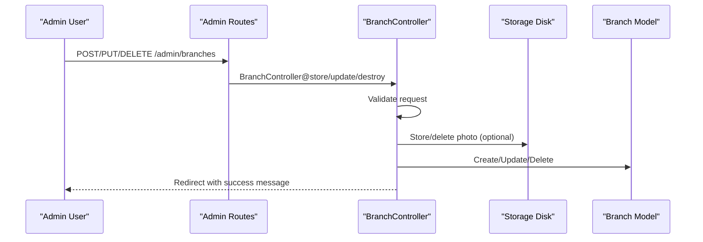

**Diagram sources**
- [web.php:86-94](file://routes/web.php#L86-L94)
- [BranchController.php:27-86](file://app/Http/Controllers/BranchController.php#L27-L86)

**Section sources**
- [BranchController.php:17-86](file://app/Http/Controllers/BranchController.php#L17-L86)

### Database Migration and Seeder
The migration creates the branches table with appropriate columns for geographic data and optional type and photo path. The seeder inserts realistic branch records across Indonesia.

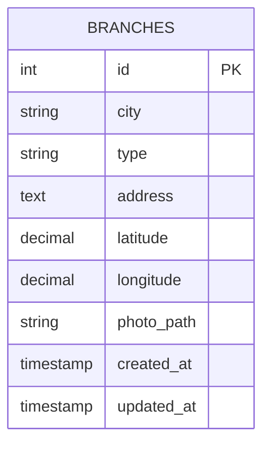

**Diagram sources**
- [create_branches_table.php:14-23](file://database/migrations/2026_04_20_133158_create_branches_table.php#L14-L23)

**Section sources**
- [create_branches_table.php:12-32](file://database/migrations/2026_04_20_133158_create_branches_table.php#L12-L32)
- [BranchSeeder.php:17-64](file://database/seeders/BranchSeeder.php#L17-L64)

### Admin Interface for Branch Management
The admin interface provides a searchable table of branches with actions to edit or delete. The form supports uploading photos and entering coordinates.

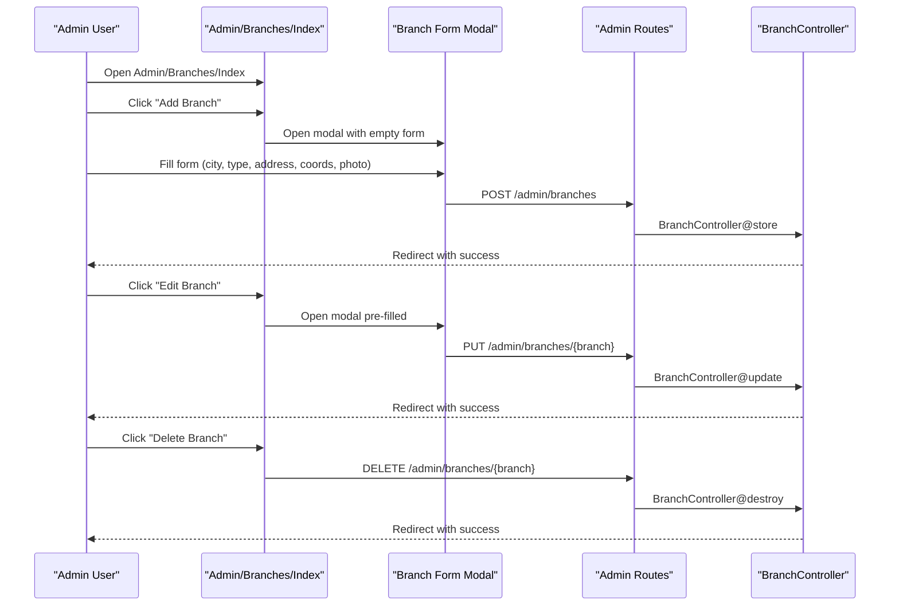

**Diagram sources**
- [AdminBranchesIndex.jsx:20-87](file://resources/js/Pages/Admin/Branches/Index.jsx#L20-L87)
- [web.php:86-94](file://routes/web.php#L86-L94)
- [BranchController.php:27-86](file://app/Http/Controllers/BranchController.php#L27-L86)

**Section sources**
- [AdminBranchesIndex.jsx:20-196](file://resources/js/Pages/Admin/Branches/Index.jsx#L20-L196)
- [web.php:86-94](file://routes/web.php#L86-L94)
- [BranchController.php:27-86](file://app/Http/Controllers/BranchController.php#L27-L86)

### Frontend Implementation: Guest Branch Listing and Map
The guest branch page integrates a Leaflet map with distance calculation and location detection. Users can search branches, find the nearest branch, and view branch details with photos.

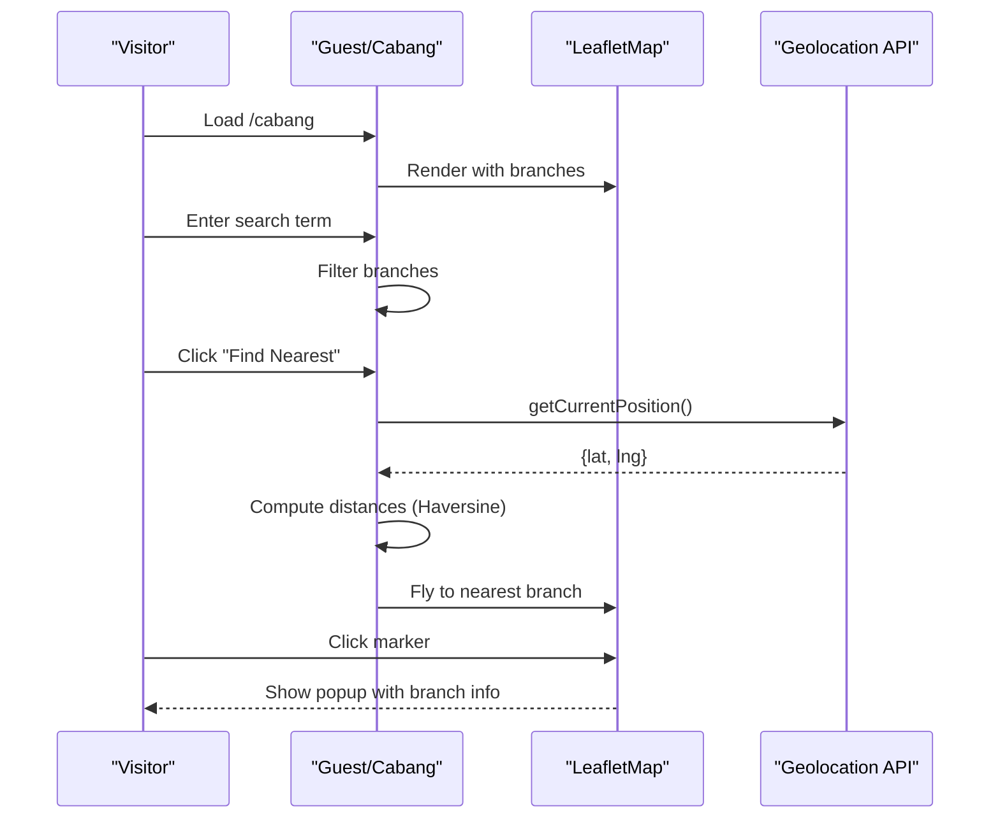

**Diagram sources**
- [Cabang.jsx:46-95](file://resources/js/Pages/Guest/Cabang.jsx#L46-L95)
- [LeafletMap.jsx:36-77](file://resources/js/Components/ui/LeafletMap.jsx#L36-L77)

**Section sources**
- [Cabang.jsx:46-393](file://resources/js/Pages/Guest/Cabang.jsx#L46-L393)
- [LeafletMap.jsx:36-77](file://resources/js/Components/ui/LeafletMap.jsx#L36-L77)

### Frontend Component: BranchSection (Homepage Integration)
The homepage integrates a responsive branch section with a map and scrollable list of branches, supporting search and selection.

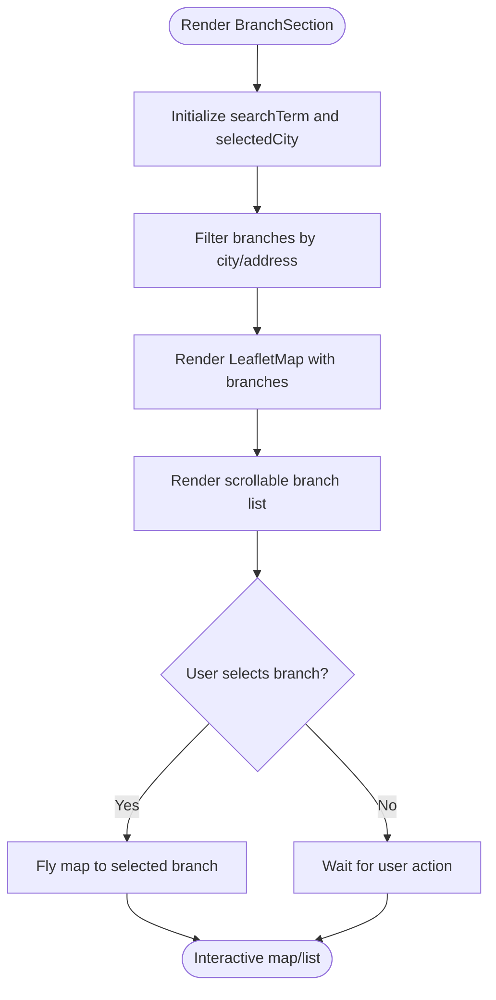

**Diagram sources**
- [BranchSection.jsx:4-111](file://resources/js/Components/BranchSection.jsx#L4-L111)
- [LeafletMap.jsx:36-77](file://resources/js/Components/ui/LeafletMap.jsx#L36-L77)

**Section sources**
- [BranchSection.jsx:4-135](file://resources/js/Components/BranchSection.jsx#L4-L135)
- [LeafletMap.jsx:36-77](file://resources/js/Components/ui/LeafletMap.jsx#L36-L77)

### Frontend Component: LeafletMap
The LeafletMap component renders markers with custom icons, fly-to animations, and popups. It filters out branches without coordinates and supports selection callbacks.

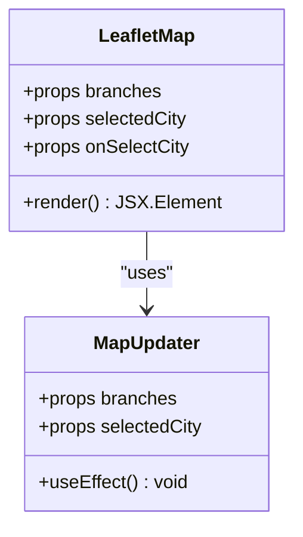

**Diagram sources**
- [LeafletMap.jsx:36-77](file://resources/js/Components/ui/LeafletMap.jsx#L36-L77)

**Section sources**
- [LeafletMap.jsx:1-78](file://resources/js/Components/ui/LeafletMap.jsx#L1-L78)

### Integration with Routes and Controllers
Routes expose admin endpoints for branch management and guest endpoints for branch listing. GuestController loads branches for both the homepage and the dedicated branch page.

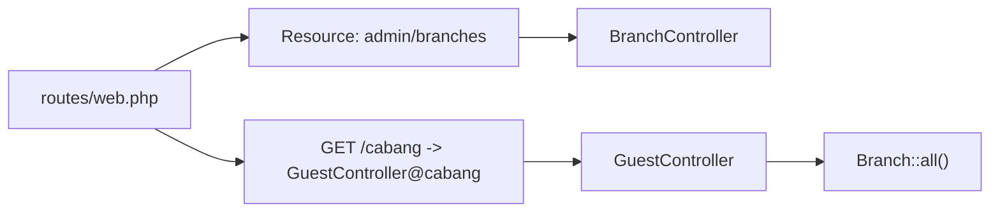

**Diagram sources**
- [web.php:56-94](file://routes/web.php#L56-L94)
- [GuestController.php:88-93](file://app/Http/Controllers/GuestController.php#L88-L93)

**Section sources**
- [web.php:56-94](file://routes/web.php#L56-L94)
- [GuestController.php:88-93](file://app/Http/Controllers/GuestController.php#L88-L93)

## Dependency Analysis
The frontend depends on Leaflet.js and react-leaflet for map rendering. The branch model resolves photo URLs, and the admin interface uses Inertia forms for submissions.

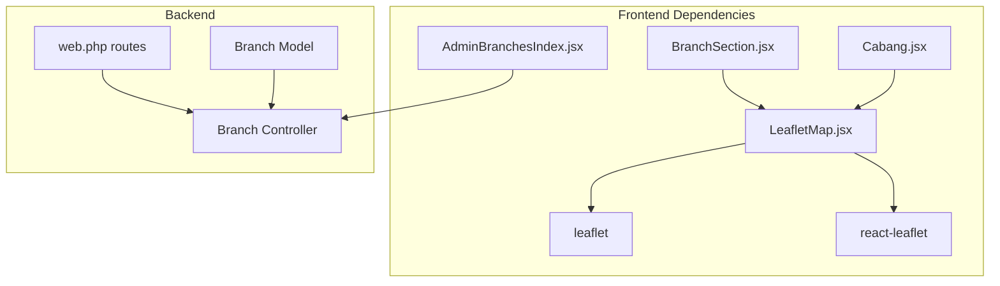

**Diagram sources**
- [package.json:41-44](file://package.json#L41-L44)
- [LeafletMap.jsx:1-4](file://resources/js/Components/ui/LeafletMap.jsx#L1-L4)
- [web.php:86-94](file://routes/web.php#L86-L94)
- [BranchController.php:1-88](file://app/Http/Controllers/BranchController.php#L1-L88)

**Section sources**
- [package.json:41-44](file://package.json#L41-L44)
- [LeafletMap.jsx:1-4](file://resources/js/Components/ui/LeafletMap.jsx#L1-L4)
- [web.php:86-94](file://routes/web.php#L86-L94)
- [BranchController.php:1-88](file://app/Http/Controllers/BranchController.php#L1-L88)

## Performance Considerations
- Map rendering: Filter branches with coordinates before rendering markers to minimize DOM overhead.
- Distance calculation: Compute distances client-side only when needed (e.g., after geolocation) to avoid unnecessary computations.
- Image handling: Validate and limit image sizes server-side to reduce storage and bandwidth usage.
- Pagination: For large datasets, consider paginating branch listings in the future.

## Troubleshooting Guide
Common issues and resolutions:
- Missing coordinates: Ensure latitude and longitude are present for map markers to render.
- Photo upload failures: Verify image validation rules and storage permissions.
- Map not centered: Confirm default center coordinates and selectedCity logic.
- Distance calculation errors: Validate numeric coordinates and handle null cases gracefully.

**Section sources**
- [BranchController.php:29-39](file://app/Http/Controllers/BranchController.php#L29-L39)
- [LeafletMap.jsx:22-31](file://resources/js/Components/ui/LeafletMap.jsx#L22-L31)
- [Cabang.jsx:60-95](file://resources/js/Pages/Guest/Cabang.jsx#L60-L95)

## Conclusion
The branch location management system provides a robust foundation for managing EDUfa Centre's branch network. It combines a clean Laravel backend with a modern React frontend, enabling efficient administration and intuitive user experiences. The integration of Leaflet.js enhances discoverability, while the admin interface streamlines branch lifecycle management. Future enhancements could include pagination, advanced filtering, and capacity management features.