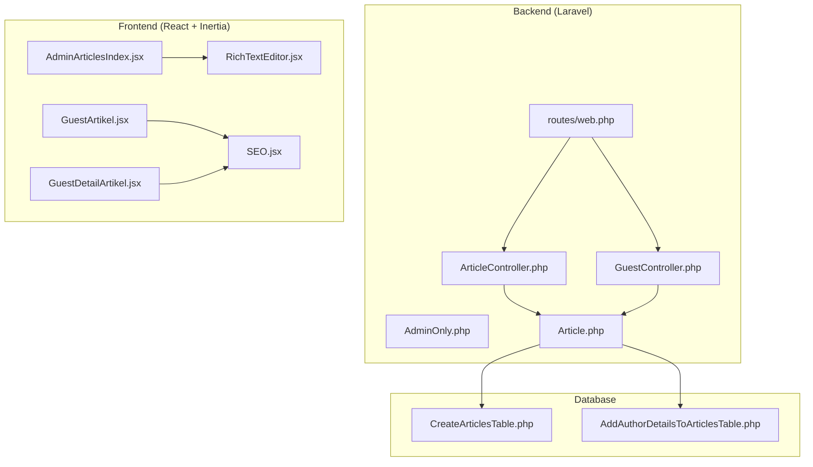
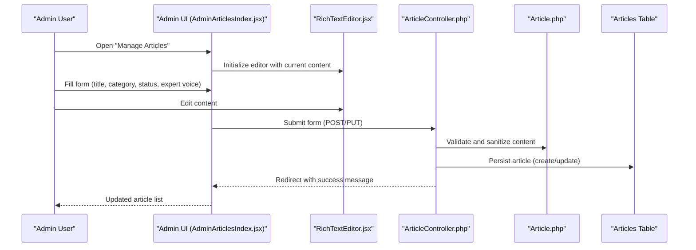
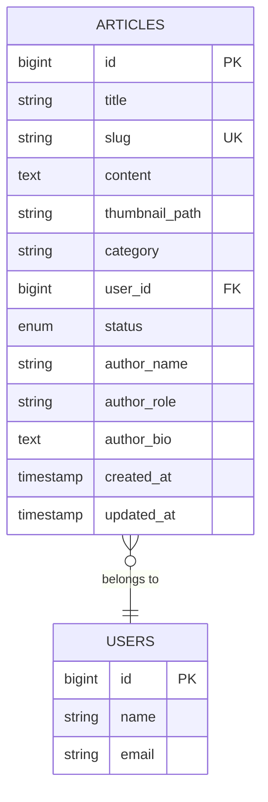
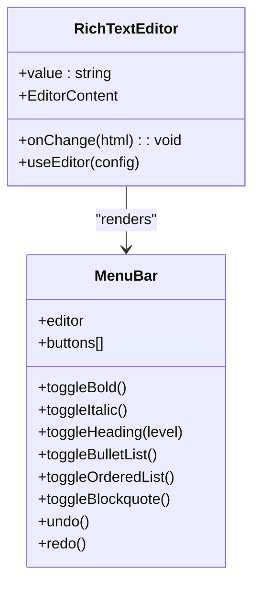
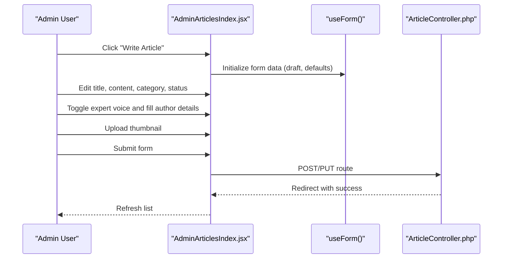
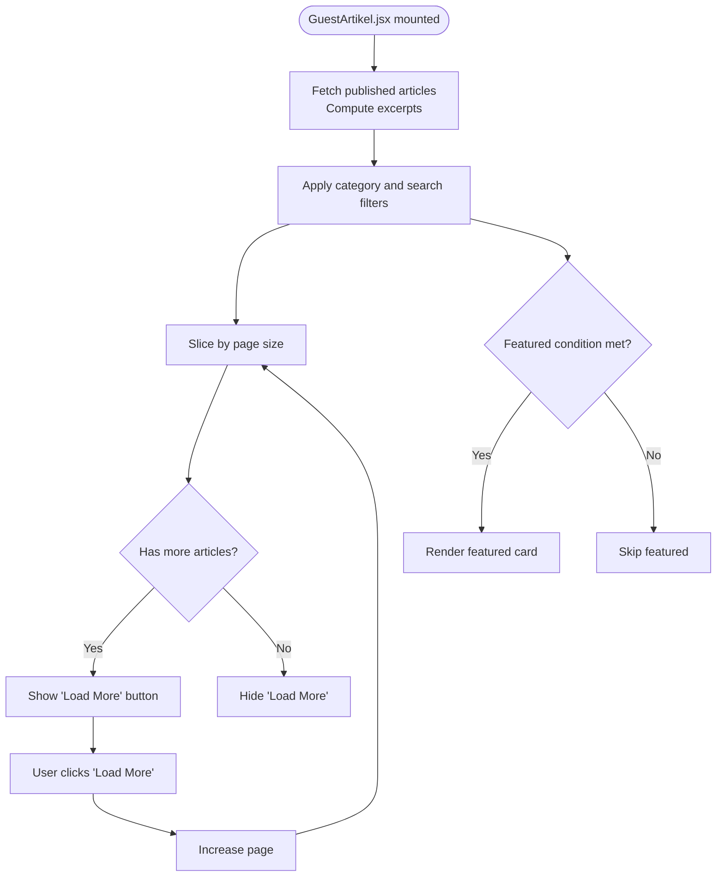
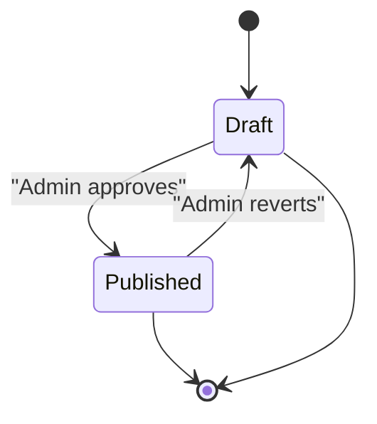
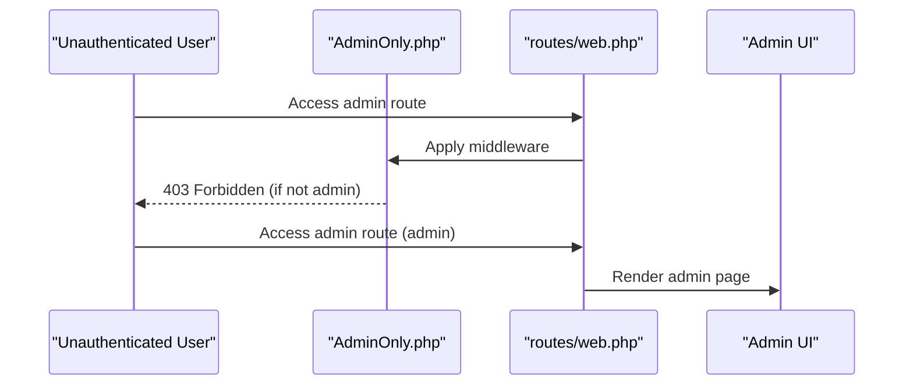
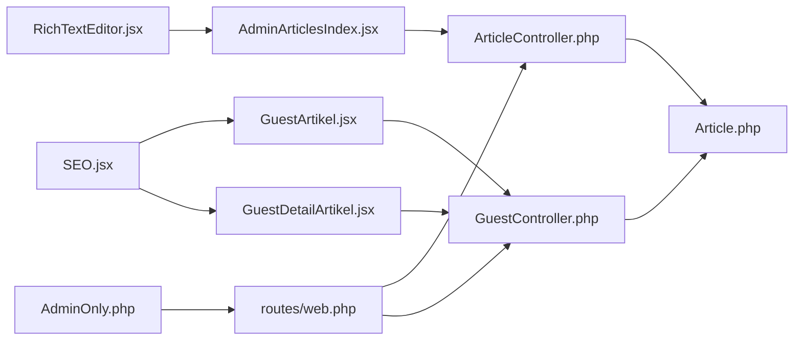

# Content Management System

<cite>
**Referenced Files in This Document**
- [Article.php](file://app/Models/Article.php)
- [ArticleController.php](file://app/Http/Controllers/ArticleController.php)
- [GuestController.php](file://app/Http/Controllers/GuestController.php)
- [RichTextEditor.jsx](file://resources/js/Components/RichTextEditor.jsx)
- [AdminArticlesIndex.jsx](file://resources/js/Pages/Admin/Articles/Index.jsx)
- [GuestArtikel.jsx](file://resources/js/Pages/Guest/Artikel.jsx)
- [GuestDetailArtikel.jsx](file://resources/js/Pages/Guest/DetailArtikel.jsx)
- [SEO.jsx](file://resources/js/Components/SEO.jsx)
- [CreateArticlesTable.php](file://database/migrations/2026_04_30_050400_create_articles_table.php)
- [AddAuthorDetailsToArticlesTable.php](file://database/migrations/2026_04_30_051304_add_author_details_to_articles_table.php)
- [web.php](file://routes/web.php)
- [AdminOnly.php](file://app/Http/Middleware/AdminOnly.php)
</cite>

## Table of Contents
1. [Introduction](#introduction)
2. [Project Structure](#project-structure)
3. [Core Components](#core-components)
4. [Architecture Overview](#architecture-overview)
5. [Detailed Component Analysis](#detailed-component-analysis)
6. [Dependency Analysis](#dependency-analysis)
7. [Performance Considerations](#performance-considerations)
8. [Troubleshooting Guide](#troubleshooting-guide)
9. [Conclusion](#conclusion)

## Introduction
This document describes the content management system focused on article/blog publishing functionality. It covers the rich text editor implementation using TipTap, article lifecycle management (draft/published), content moderation workflows, the article model structure, admin interface for content creation/editing/approval, front-end rendering patterns, pagination, search functionality, related content recommendations, and content scheduling/versioning/backup strategies.

## Project Structure
The system follows a Laravel backend with an Inertia.js/React frontend. Articles are stored in the database with associated metadata, thumbnails, and author customization fields. The admin panel allows authorized users to manage articles, while the guest-facing pages render published content with SEO optimization and responsive layouts.

**Diagram sources**
- [ArticleController.php:1-122](file://app/Http/Controllers/ArticleController.php#L1-L122)
- [GuestController.php:1-119](file://app/Http/Controllers/GuestController.php#L1-L119)
- [AdminOnly.php:1-25](file://app/Http/Middleware/AdminOnly.php#L1-L25)
- [Article.php:1-28](file://app/Models/Article.php#L1-L28)
- [AdminArticlesIndex.jsx:1-398](file://resources/js/Pages/Admin/Articles/Index.jsx#L1-L398)
- [RichTextEditor.jsx:1-131](file://resources/js/Components/RichTextEditor.jsx#L1-L131)
- [GuestArtikel.jsx:1-451](file://resources/js/Pages/Guest/Artikel.jsx#L1-L451)
- [GuestDetailArtikel.jsx:1-330](file://resources/js/Pages/Guest/DetailArtikel.jsx#L1-L330)
- [SEO.jsx:1-239](file://resources/js/Components/SEO.jsx#L1-L239)
- [CreateArticlesTable.php:1-35](file://database/migrations/2026_04_30_050400_create_articles_table.php#L1-L35)
- [AddAuthorDetailsToArticlesTable.php:1-31](file://database/migrations/2026_04_30_051304_add_author_details_to_articles_table.php#L1-L31)
- [web.php:1-137](file://routes/web.php#L1-L137)

**Section sources**
- [web.php:1-137](file://routes/web.php#L1-L137)
- [ArticleController.php:1-122](file://app/Http/Controllers/ArticleController.php#L1-L122)
- [GuestController.php:1-119](file://app/Http/Controllers/GuestController.php#L1-L119)
- [Article.php:1-28](file://app/Models/Article.php#L1-L28)

## Core Components
- Article model with fillable attributes for title, slug, content, thumbnail, category, user relationship, status, and author customization fields.
- Rich text editor built with TipTap providing bold, italic, headings, lists, blockquote, undo/redo, and HTML export.
- Admin interface for CRUD operations, status toggling, thumbnail upload, and expert voice customization.
- Guest-facing pages for listing articles with pagination, search, category filtering, and detail page with related content and SEO metadata.

**Section sources**
- [Article.php:9-26](file://app/Models/Article.php#L9-L26)
- [RichTextEditor.jsx:101-131](file://resources/js/Components/RichTextEditor.jsx#L101-L131)
- [AdminArticlesIndex.jsx:34-88](file://resources/js/Pages/Admin/Articles/Index.jsx#L34-L88)
- [GuestArtikel.jsx:35-451](file://resources/js/Pages/Guest/Artikel.jsx#L35-L451)

## Architecture Overview
The system uses a resource controller pattern for admin operations and dedicated guest controllers for public pages. Routes define both admin and public endpoints, with middleware enforcing admin access. The frontend communicates with the backend via Inertia, sending form submissions and receiving pre-rendered pages with data hydration.

**Diagram sources**
- [AdminArticlesIndex.jsx:34-88](file://resources/js/Pages/Admin/Articles/Index.jsx#L34-L88)
- [RichTextEditor.jsx:101-131](file://resources/js/Components/RichTextEditor.jsx#L101-L131)
- [ArticleController.php:26-108](file://app/Http/Controllers/ArticleController.php#L26-L108)
- [Article.php:9-26](file://app/Models/Article.php#L9-L26)

## Detailed Component Analysis

### Article Model and Database Schema
The Article model defines fillable attributes and a belongs-to relationship with User. The database schema includes title, slug, content, thumbnail_path, category, user_id, status, timestamps, and optional author customization fields appended later.

**Diagram sources**
- [CreateArticlesTable.php:14-24](file://database/migrations/2026_04_30_050400_create_articles_table.php#L14-L24)
- [AddAuthorDetailsToArticlesTable.php:14-18](file://database/migrations/2026_04_30_051304_add_author_details_to_articles_table.php#L14-L18)
- [Article.php:23-26](file://app/Models/Article.php#L23-L26)

**Section sources**
- [Article.php:9-26](file://app/Models/Article.php#L9-L26)
- [CreateArticlesTable.php:14-24](file://database/migrations/2026_04_30_050400_create_articles_table.php#L14-L24)
- [AddAuthorDetailsToArticlesTable.php:14-18](file://database/migrations/2026_04_30_051304_add_author_details_to_articles_table.php#L14-L18)

### Rich Text Editor Implementation (TipTap)
The rich text editor integrates TipTap StarterKit with a custom menu bar supporting bold, italic, headings, bullet/numbered lists, blockquote, and undo/redo actions. It exports HTML via the editor's content state and updates reactively when props change.

**Diagram sources**
- [RichTextEditor.jsx:16-99](file://resources/js/Components/RichTextEditor.jsx#L16-L99)
- [RichTextEditor.jsx:101-131](file://resources/js/Components/RichTextEditor.jsx#L101-L131)

**Section sources**
- [RichTextEditor.jsx:16-99](file://resources/js/Components/RichTextEditor.jsx#L16-L99)
- [RichTextEditor.jsx:101-131](file://resources/js/Components/RichTextEditor.jsx#L101-L131)

### Admin Interface for Content Creation and Editing
The admin interface provides:
- Listing of articles with search by title/category and filter by status.
- Create/Edit modal with form validation, thumbnail preview/upload, and expert voice customization controls.
- Submission handling via Inertia forms, including PUT for updates and POST for creation.
- Deletion with confirmation and thumbnail cleanup.

**Diagram sources**
- [AdminArticlesIndex.jsx:34-88](file://resources/js/Pages/Admin/Articles/Index.jsx#L34-L88)
- [ArticleController.php:26-108](file://app/Http/Controllers/ArticleController.php#L26-L108)

**Section sources**
- [AdminArticlesIndex.jsx:24-398](file://resources/js/Pages/Admin/Articles/Index.jsx#L24-L398)
- [ArticleController.php:16-122](file://app/Http/Controllers/ArticleController.php#L16-L122)

### Front-End Rendering Patterns, Pagination, Search, and Recommendations
Guest pages implement:
- Pagination with a fixed page size and "Load More" behavior.
- Live search across title and excerpt, plus category filtering.
- Featured article presentation on the first page when applicable.
- Related content recommendations on the detail page.
- SEO metadata injection via structured data and meta tags.

**Diagram sources**
- [GuestArtikel.jsx:207-451](file://resources/js/Pages/Guest/Artikel.jsx#L207-L451)

**Section sources**
- [GuestArtikel.jsx:207-451](file://resources/js/Pages/Guest/Artikel.jsx#L207-L451)
- [GuestDetailArtikel.jsx:154-330](file://resources/js/Pages/Guest/DetailArtikel.jsx#L154-L330)
- [SEO.jsx:170-238](file://resources/js/Components/SEO.jsx#L170-L238)

### Content Lifecycle Management (Draft/Published) and Moderation
- Status field supports draft and published states.
- Admin sets status during creation/editing; only published articles are shown to guests.
- Moderation workflow occurs in the admin panel where editors review content, approve publication, and manage expert voice visibility.

**Diagram sources**
- [ArticleController.php:32-37](file://app/Http/Controllers/ArticleController.php#L32-L37)
- [GuestController.php:51-60](file://app/Http/Controllers/GuestController.php#L51-L60)

**Section sources**
- [ArticleController.php:32-37](file://app/Http/Controllers/ArticleController.php#L32-L37)
- [GuestController.php:51-60](file://app/Http/Controllers/GuestController.php#L51-L60)

### Content Moderation Workflows
- Admin-only access enforced via middleware.
- Admins can preview, edit, approve, and delete articles.
- Expert voice customization is optional and controlled per article.

**Diagram sources**
- [AdminOnly.php:16-23](file://app/Http/Middleware/AdminOnly.php#L16-L23)
- [web.php:68-125](file://routes/web.php#L68-L125)

**Section sources**
- [AdminOnly.php:16-23](file://app/Http/Middleware/AdminOnly.php#L16-L23)
- [web.php:68-125](file://routes/web.php#L68-L125)

### Article Model Structure Details
- Fillable attributes include title, slug, content, thumbnail_path, category, user_id, status, author_name, author_role, author_bio, and show_expert_voice flag.
- Relationship to User via belongsTo.
- SEO metadata and excerpt generation handled in controllers for guest consumption.

**Section sources**
- [Article.php:9-26](file://app/Models/Article.php#L9-L26)
- [GuestController.php:51-82](file://app/Http/Controllers/GuestController.php#L51-L82)

### Front-End Rendering Patterns
- Admin uses Inertia forms with server-side validation and redirects.
- Guest pages use client-side filtering, pagination, and dynamic excerpts.
- Detail page renders structured content with related articles and expert voice profile.

**Section sources**
- [AdminArticlesIndex.jsx:34-88](file://resources/js/Pages/Admin/Articles/Index.jsx#L34-L88)
- [GuestArtikel.jsx:214-229](file://resources/js/Pages/Guest/Artikel.jsx#L214-L229)
- [GuestDetailArtikel.jsx:154-330](file://resources/js/Pages/Guest/DetailArtikel.jsx#L154-L330)

### Pagination and Search Functionality
- Fixed page size constant drives slicing of filtered results.
- Search matches title and excerpt; category filter narrows results.
- "Load More" increases page number and appends additional cards.

**Section sources**
- [GuestArtikel.jsx:35](file://resources/js/Pages/Guest/Artikel.jsx#L35)
- [GuestArtikel.jsx:214-229](file://resources/js/Pages/Guest/Artikel.jsx#L214-L229)

### Related Content Recommendations
- On the detail page, three latest published articles (excluding current) are selected as related content.
- Each recommendation includes thumbnail, title, and publish date.

**Section sources**
- [GuestController.php:67-82](file://app/Http/Controllers/GuestController.php#L67-L82)
- [GuestDetailArtikel.jsx:77-114](file://resources/js/Pages/Guest/DetailArtikel.jsx#L77-L114)

### SEO Metadata and Structured Data
- SEO component injects meta tags, Open Graph, Twitter, canonical links, and alternate hreflangs.
- Structured data includes Organization, WebSite, BreadcrumbList, and optional Article schema with author and publish/modify times.

**Section sources**
- [SEO.jsx:170-238](file://resources/js/Components/SEO.jsx#L170-L238)
- [GuestDetailArtikel.jsx:172-215](file://resources/js/Pages/Guest/DetailArtikel.jsx#L172-L215)

### Content Scheduling, Versioning, and Backup Strategies
- Scheduling: No explicit scheduled publishing mechanism exists in the current codebase; future enhancements could add scheduled_at fields and queue workers.
- Versioning: No content version history is implemented; consider adding a revisions table and diffing mechanism.
- Backups: Database backups should be automated via standard DB tools; ensure public storage thumbnails are backed up separately.

[No sources needed since this section provides general guidance]

## Dependency Analysis
The admin and guest controllers depend on the Article model and Eloquent relationships. Routes bind URLs to controllers, and middleware secures admin endpoints. The frontend depends on Inertia for SSR-like behavior and consumes controller-provided data.

**Diagram sources**
- [AdminArticlesIndex.jsx:1-398](file://resources/js/Pages/Admin/Articles/Index.jsx#L1-L398)
- [RichTextEditor.jsx:1-131](file://resources/js/Components/RichTextEditor.jsx#L1-L131)
- [ArticleController.php:1-122](file://app/Http/Controllers/ArticleController.php#L1-L122)
- [Article.php:1-28](file://app/Models/Article.php#L1-L28)
- [GuestController.php:1-119](file://app/Http/Controllers/GuestController.php#L1-L119)
- [GuestArtikel.jsx:1-451](file://resources/js/Pages/Guest/Artikel.jsx#L1-L451)
- [GuestDetailArtikel.jsx:1-330](file://resources/js/Pages/Guest/DetailArtikel.jsx#L1-L330)
- [SEO.jsx:1-239](file://resources/js/Components/SEO.jsx#L1-L239)
- [web.php:1-137](file://routes/web.php#L1-L137)
- [AdminOnly.php:1-25](file://app/Http/Middleware/AdminOnly.php#L1-L25)

**Section sources**
- [web.php:1-137](file://routes/web.php#L1-L137)
- [ArticleController.php:1-122](file://app/Http/Controllers/ArticleController.php#L1-L122)
- [GuestController.php:1-119](file://app/Http/Controllers/GuestController.php#L1-L119)

## Performance Considerations
- Database queries fetch only necessary fields; excerpts are computed server-side to avoid heavy client-side processing.
- Thumbnail storage uses public disk; ensure appropriate CDN configuration for production.
- Pagination reduces DOM rendering by limiting visible items per page.
- Consider indexing slug and status for faster lookups and filtering.

[No sources needed since this section provides general guidance]

## Troubleshooting Guide
- Validation errors: Form validation ensures required fields and acceptable statuses; check error messages returned by Inertia forms.
- XSS prevention: Content is sanitized using allowed tags; ensure custom sanitization rules align with intended formatting.
- Thumbnail handling: When updating, existing thumbnails are deleted; confirm storage permissions and disk availability.
- SEO issues: Verify canonical URLs and structured data; ensure image paths resolve correctly.

**Section sources**
- [ArticleController.php:28-43](file://app/Http/Controllers/ArticleController.php#L28-L43)
- [ArticleController.php:83-85](file://app/Http/Controllers/ArticleController.php#L83-L85)
- [GuestDetailArtikel.jsx:172-215](file://resources/js/Pages/Guest/DetailArtikel.jsx#L172-L215)

## Conclusion
The content management system provides a robust foundation for article/blog publishing with a modern admin interface, powerful rich text editing, and optimized guest experiences. The current implementation focuses on draft/published workflows, expert voice customization, and SEO-ready rendering. Future enhancements can introduce scheduling, versioning, and comprehensive backup strategies to strengthen operational reliability.