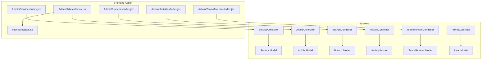
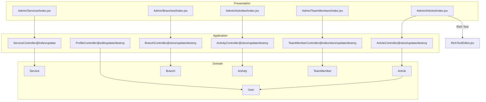
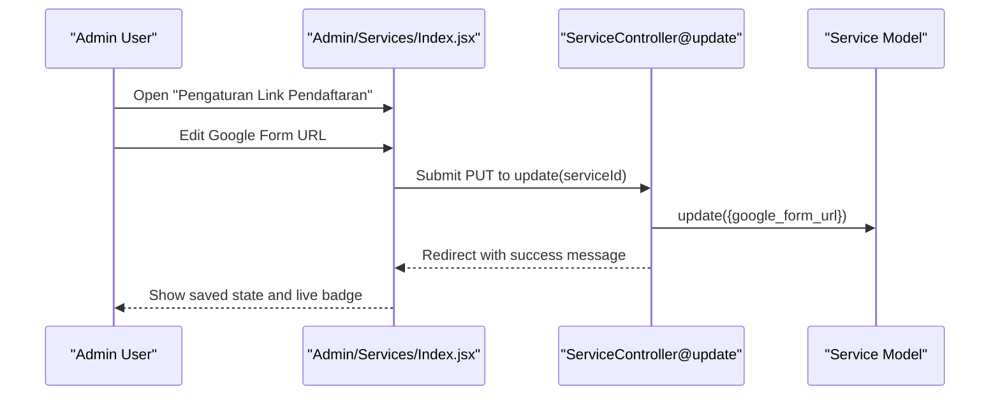
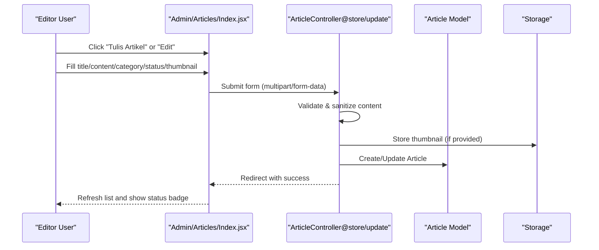
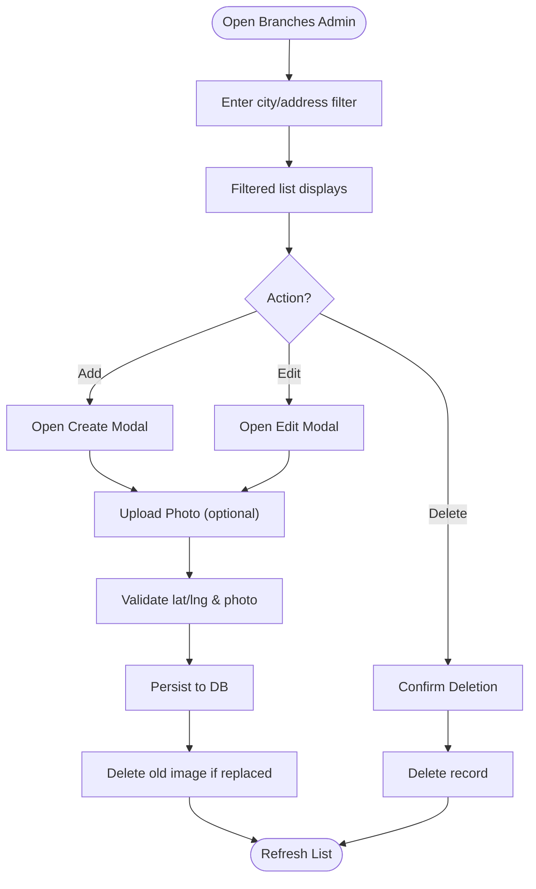
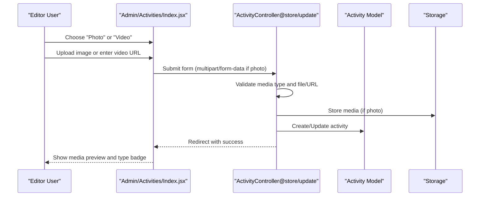
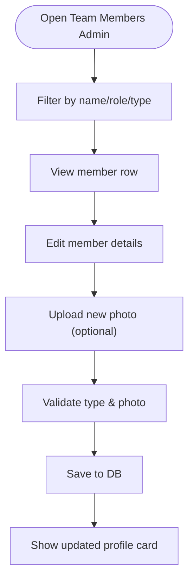
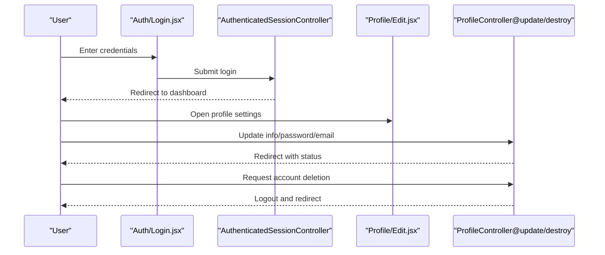
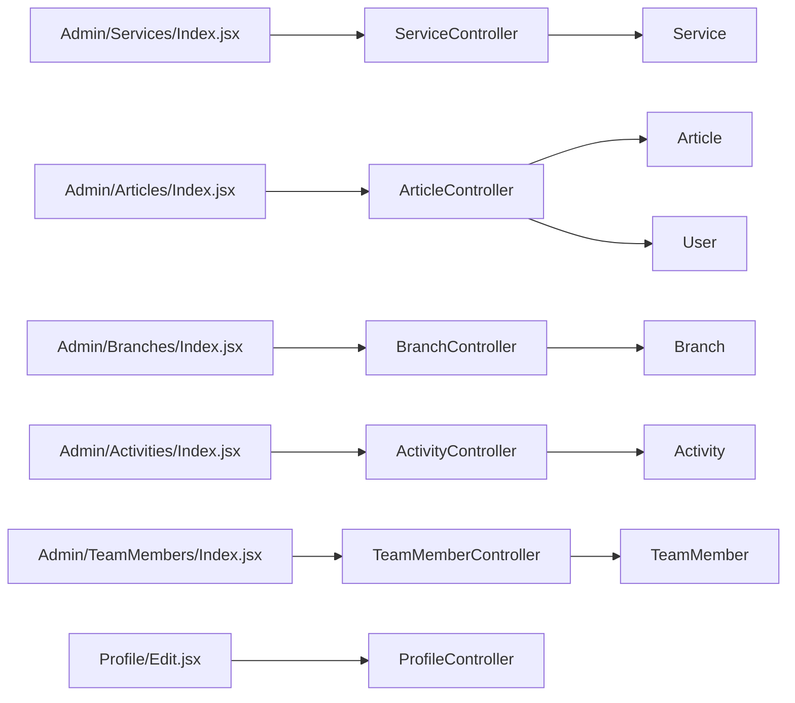

# Core Features Implementation

<cite>
**Referenced Files in This Document**
- [ServiceController.php](file://app/Http/Controllers/ServiceController.php)
- [ArticleController.php](file://app/Http/Controllers/ArticleController.php)
- [BranchController.php](file://app/Http/Controllers/BranchController.php)
- [ActivityController.php](file://app/Http/Controllers/ActivityController.php)
- [TeamMemberController.php](file://app/Http/Controllers/TeamMemberController.php)
- [ProfileController.php](file://app/Http/Controllers/ProfileController.php)
- [Service.php](file://app/Models/Service.php)
- [Article.php](file://app/Models/Article.php)
- [Branch.php](file://app/Models/Branch.php)
- [Activity.php](file://app/Models/Activity.php)
- [TeamMember.php](file://app/Models/TeamMember.php)
- [User.php](file://app/Models/User.php)
- [Index.jsx (Services)](file://resources/js/Pages/Admin/Services/Index.jsx)
- [Index.jsx (Articles)](file://resources/js/Pages/Admin/Articles/Index.jsx)
- [Index.jsx (Branches)](file://resources/js/Pages/Admin/Branches/Index.jsx)
- [Index.jsx (Activities)](file://resources/js/Pages/Admin/Activities/Index.jsx)
- [Index.jsx (TeamMembers)](file://resources/js/Pages/Admin/TeamMembers/Index.jsx)
- [RichTextEditor.jsx](file://resources/js/Components/RichTextEditor.jsx)
</cite>

## Table of Contents
1. [Introduction](#introduction)
2. [Project Structure](#project-structure)
3. [Core Components](#core-components)
4. [Architecture Overview](#architecture-overview)
5. [Detailed Component Analysis](#detailed-component-analysis)
6. [Dependency Analysis](#dependency-analysis)
7. [Performance Considerations](#performance-considerations)
8. [Troubleshooting Guide](#troubleshooting-guide)
9. [Conclusion](#conclusion)

## Introduction
This document explains the core features implementation for EDUfa’s administrative and public-facing modules. It covers:
- Service showcase system with Google Form registration links
- Content management for articles and blog publishing with rich text editing
- User authentication and profile management
- Branch and location management with geographic coordinates and image handling
- Activity and event scheduling with photo/video media
- Expert team member profiles with professional details
- Integration patterns and data sharing across modules

The goal is to provide practical guidance for developers and editors to configure, customize, and extend these features effectively.

## Project Structure
EDUfa follows a Laravel backend with Inertia.js frontend architecture:
- Controllers under app/Http/Controllers manage CRUD operations for each domain model
- Models under app/Models define fillable attributes and relationships
- Frontend pages under resources/js/Pages/Admin implement admin dashboards
- Rich text editing powered by TipTap via RichTextEditor.jsx
- Public-facing pages under resources/js/Pages/Guest implement service showcases

**Diagram sources**
- [ServiceController.php:1-31](file://app/Http/Controllers/ServiceController.php#L1-L31)
- [ArticleController.php:1-122](file://app/Http/Controllers/ArticleController.php#L1-L122)
- [BranchController.php:1-88](file://app/Http/Controllers/BranchController.php#L1-L88)
- [ActivityController.php:1-107](file://app/Http/Controllers/ActivityController.php#L1-L107)
- [TeamMemberController.php:1-72](file://app/Http/Controllers/TeamMemberController.php#L1-L72)
- [ProfileController.php:1-64](file://app/Http/Controllers/ProfileController.php#L1-L64)
- [Service.php:1-15](file://app/Models/Service.php#L1-L15)
- [Article.php:1-28](file://app/Models/Article.php#L1-L28)
- [Branch.php:1-36](file://app/Models/Branch.php#L1-L36)
- [Activity.php:1-11](file://app/Models/Activity.php#L1-L11)
- [TeamMember.php:1-24](file://app/Models/TeamMember.php#L1-L24)
- [User.php:1-47](file://app/Models/User.php#L1-L47)
- [Index.jsx (Services):1-135](file://resources/js/Pages/Admin/Services/Index.jsx#L1-L135)
- [Index.jsx (Articles):1-398](file://resources/js/Pages/Admin/Articles/Index.jsx#L1-L398)
- [Index.jsx (Branches):1-340](file://resources/js/Pages/Admin/Branches/Index.jsx#L1-L340)
- [Index.jsx (Activities):1-353](file://resources/js/Pages/Admin/Activities/Index.jsx#L1-L353)
- [Index.jsx (TeamMembers):1-374](file://resources/js/Pages/Admin/TeamMembers/Index.jsx#L1-L374)
- [RichTextEditor.jsx:1-131](file://resources/js/Components/RichTextEditor.jsx#L1-L131)

**Section sources**
- [ServiceController.php:1-31](file://app/Http/Controllers/ServiceController.php#L1-L31)
- [ArticleController.php:1-122](file://app/Http/Controllers/ArticleController.php#L1-L122)
- [BranchController.php:1-88](file://app/Http/Controllers/BranchController.php#L1-L88)
- [ActivityController.php:1-107](file://app/Http/Controllers/ActivityController.php#L1-L107)
- [TeamMemberController.php:1-72](file://app/Http/Controllers/TeamMemberController.php#L1-L72)
- [ProfileController.php:1-64](file://app/Http/Controllers/ProfileController.php#L1-L64)
- [Service.php:1-15](file://app/Models/Service.php#L1-L15)
- [Article.php:1-28](file://app/Models/Article.php#L1-L28)
- [Branch.php:1-36](file://app/Models/Branch.php#L1-L36)
- [Activity.php:1-11](file://app/Models/Activity.php#L1-L11)
- [TeamMember.php:1-24](file://app/Models/TeamMember.php#L1-L24)
- [User.php:1-47](file://app/Models/User.php#L1-L47)
- [Index.jsx (Services):1-135](file://resources/js/Pages/Admin/Services/Index.jsx#L1-L135)
- [Index.jsx (Articles):1-398](file://resources/js/Pages/Admin/Articles/Index.jsx#L1-L398)
- [Index.jsx (Branches):1-340](file://resources/js/Pages/Admin/Branches/Index.jsx#L1-L340)
- [Index.jsx (Activities):1-353](file://resources/js/Pages/Admin/Activities/Index.jsx#L1-L353)
- [Index.jsx (TeamMembers):1-374](file://resources/js/Pages/Admin/TeamMembers/Index.jsx#L1-L374)
- [RichTextEditor.jsx:1-131](file://resources/js/Components/RichTextEditor.jsx#L1-L131)

## Core Components
This section outlines the primary feature modules and their responsibilities.

- Service Showcase System
  - Purpose: Manage Google Form registration links per service
  - Controllers: ServiceController
  - Models: Service
  - UI: Admin/Services/Index.jsx
  - Key behaviors: Validation of URL format, update via AJAX, live status indicator

- Content Management System (Articles/Blog)
  - Purpose: Create, edit, publish, and delete articles with rich text
  - Controllers: ArticleController
  - Models: Article (belongs to User), User
  - UI: Admin/Articles/Index.jsx, RichTextEditor.jsx
  - Key behaviors: Rich text editing, XSS-safe content sanitization, thumbnail upload, expert voice toggles

- Branch and Location Management
  - Purpose: Add/update/delete branches with address, coordinates, and photos
  - Controllers: BranchController
  - Models: Branch (photo URL resolution)
  - UI: Admin/Branches/Index.jsx
  - Key behaviors: Coordinate validation, image storage, safe deletion

- Activity and Event Scheduling
  - Purpose: Document activities with photo or video media
  - Controllers: ActivityController
  - Models: Activity
  - UI: Admin/Activities/Index.jsx
  - Key behaviors: Media type switching, file upload handling, URL fallback for videos

- Expert Team Member Profiles
  - Purpose: Manage team members (terapis/staf) with roles and images
  - Controllers: TeamMemberController
  - Models: TeamMember (photo URL resolution)
  - UI: Admin/TeamMembers/Index.jsx
  - Key behaviors: Type validation, image handling, safe deletion

- User Authentication and Profile Management
  - Purpose: Login, logout, password reset, email verification, profile updates, account deletion
  - Controllers: Auth controllers under app/Http/Controllers/Auth, ProfileController
  - Models: User (role-based permissions)
  - UI: Auth pages under resources/js/Pages/Auth, Profile/Edit.jsx
  - Key behaviors: Role checks (admin/editor), email verification lifecycle, secure password handling

**Section sources**
- [ServiceController.php:11-29](file://app/Http/Controllers/ServiceController.php#L11-L29)
- [ArticleController.php:26-120](file://app/Http/Controllers/ArticleController.php#L26-L120)
- [BranchController.php:27-86](file://app/Http/Controllers/BranchController.php#L27-L86)
- [ActivityController.php:25-105](file://app/Http/Controllers/ActivityController.php#L25-L105)
- [TeamMemberController.php:20-70](file://app/Http/Controllers/TeamMemberController.php#L20-L70)
- [ProfileController.php:19-62](file://app/Http/Controllers/ProfileController.php#L19-L62)
- [Service.php:9-13](file://app/Models/Service.php#L9-L13)
- [Article.php:9-26](file://app/Models/Article.php#L9-L26)
- [Branch.php:12-34](file://app/Models/Branch.php#L12-L34)
- [Activity.php:9](file://app/Models/Activity.php#L9)
- [TeamMember.php:9-22](file://app/Models/TeamMember.php#L9-L22)
- [User.php:13-45](file://app/Models/User.php#L13-L45)

## Architecture Overview
The system uses a layered architecture:
- Presentation Layer: Inertia.js pages render admin dashboards and guest-facing showcases
- Application Layer: Controllers orchestrate requests, validation, and persistence
- Domain Layer: Eloquent models encapsulate business data and relationships
- Infrastructure Layer: Storage for images, routing, middleware, and UI components

**Diagram sources**
- [Index.jsx (Services):94-135](file://resources/js/Pages/Admin/Services/Index.jsx#L94-L135)
- [Index.jsx (Articles):24-398](file://resources/js/Pages/Admin/Articles/Index.jsx#L24-L398)
- [Index.jsx (Branches):20-340](file://resources/js/Pages/Admin/Branches/Index.jsx#L20-L340)
- [Index.jsx (Activities):22-353](file://resources/js/Pages/Admin/Activities/Index.jsx#L22-L353)
- [Index.jsx (TeamMembers):23-374](file://resources/js/Pages/Admin/TeamMembers/Index.jsx#L23-L374)
- [ServiceController.php:9-30](file://app/Http/Controllers/ServiceController.php#L9-L30)
- [ArticleController.php:11-122](file://app/Http/Controllers/ArticleController.php#L11-122)
- [BranchController.php:12-88](file://app/Http/Controllers/BranchController.php#L12-88)
- [ActivityController.php:10-107](file://app/Http/Controllers/ActivityController.php#L10-107)
- [TeamMemberController.php:11-72](file://app/Http/Controllers/TeamMemberController.php#L11-72)
- [ProfileController.php:14-64](file://app/Http/Controllers/ProfileController.php#L14-64)
- [Service.php:7-14](file://app/Models/Service.php#L7-L14)
- [Article.php:7-27](file://app/Models/Article.php#L7-L27)
- [Branch.php:8-35](file://app/Models/Branch.php#L8-L35)
- [Activity.php:7-10](file://app/Models/Activity.php#L7-L10)
- [TeamMember.php:7-23](file://app/Models/TeamMember.php#L7-L23)
- [User.php:15-46](file://app/Models/User.php#L15-L46)
- [RichTextEditor.jsx:101-131](file://resources/js/Components/RichTextEditor.jsx#L101-L131)

## Detailed Component Analysis

### Service Showcase System
- Purpose: Allow administrators to set and update Google Form URLs for each service
- Controller actions: index lists services; update validates and persists URL
- UI pattern: Inline editable row with save button and live status indicator
- Data model: Service with fillable fields including google_form_url
- Integration: Admin page renders service list and handles per-service updates

**Diagram sources**
- [Index.jsx (Services):9-92](file://resources/js/Pages/Admin/Services/Index.jsx#L9-L92)
- [ServiceController.php:18-29](file://app/Http/Controllers/ServiceController.php#L18-L29)
- [Service.php:9-13](file://app/Models/Service.php#L9-L13)

**Section sources**
- [ServiceController.php:11-29](file://app/Http/Controllers/ServiceController.php#L11-L29)
- [Service.php:9-13](file://app/Models/Service.php#L9-L13)
- [Index.jsx (Services):94-135](file://resources/js/Pages/Admin/Services/Index.jsx#L94-L135)

### Content Management System (Articles/Blog)
- Purpose: Publish educational content with rich text, categories, statuses, thumbnails, and expert voice
- Controller actions: index, store, update, destroy with robust validation and sanitization
- UI pattern: Modal-based create/edit form with RichTextEditor, search/filter, and status badges
- Data model: Article belongs to User; includes author metadata and expert voice toggle
- Security: XSS prevention via tag whitelisting; file upload validation; storage cleanup on delete

**Diagram sources**
- [Index.jsx (Articles):34-88](file://resources/js/Pages/Admin/Articles/Index.jsx#L34-L88)
- [ArticleController.php:26-120](file://app/Http/Controllers/ArticleController.php#L26-L120)
- [Article.php:9-26](file://app/Models/Article.php#L9-L26)
- [RichTextEditor.jsx:101-131](file://resources/js/Components/RichTextEditor.jsx#L101-L131)

**Section sources**
- [ArticleController.php:16-120](file://app/Http/Controllers/ArticleController.php#L16-L120)
- [Article.php:9-26](file://app/Models/Article.php#L9-L26)
- [Index.jsx (Articles):24-398](file://resources/js/Pages/Admin/Articles/Index.jsx#L24-L398)
- [RichTextEditor.jsx:1-131](file://resources/js/Components/RichTextEditor.jsx#L1-L131)

### Branch and Location Management
- Purpose: Maintain branch locations with address, coordinates, and photos
- Controller actions: index, store, update, destroy with coordinate and image validations
- UI pattern: Table with search, modal create/edit, coordinate display, and photo preview
- Data model: Branch resolves photo_url for rendering; supports external URLs

**Diagram sources**
- [Index.jsx (Branches):30-87](file://resources/js/Pages/Admin/Branches/Index.jsx#L30-L87)
- [BranchController.php:27-86](file://app/Http/Controllers/BranchController.php#L27-L86)
- [Branch.php:21-34](file://app/Models/Branch.php#L21-L34)

**Section sources**
- [BranchController.php:17-86](file://app/Http/Controllers/BranchController.php#L17-L86)
- [Branch.php:12-34](file://app/Models/Branch.php#L12-L34)
- [Index.jsx (Branches):20-340](file://resources/js/Pages/Admin/Branches/Index.jsx#L20-L340)

### Activity and Event Scheduling
- Purpose: Document activities with photo or video media and categorize by type
- Controller actions: store, update, destroy with media type switching and URL fallback
- UI pattern: Modal form with media type toggle, photo upload, or video URL input
- Data model: Activity stores media_path depending on media_type

**Diagram sources**
- [Index.jsx (Activities):32-81](file://resources/js/Pages/Admin/Activities/Index.jsx#L32-L81)
- [ActivityController.php:25-105](file://app/Http/Controllers/ActivityController.php#L25-L105)
- [Activity.php:9](file://app/Models/Activity.php#L9)

**Section sources**
- [ActivityController.php:15-105](file://app/Http/Controllers/ActivityController.php#L15-L105)
- [Activity.php:9](file://app/Models/Activity.php#L9)
- [Index.jsx (Activities):22-353](file://resources/js/Pages/Admin/Activities/Index.jsx#L22-L353)

### Expert Team Member Profiles
- Purpose: Manage professional profiles for therapists and staff
- Controller actions: index, store, update, destroy with image handling
- UI pattern: Searchable table, modal form, photo preview, type badges
- Data model: TeamMember resolves photo_url; supports internal/public images

**Diagram sources**
- [Index.jsx (TeamMembers):35-107](file://resources/js/Pages/Admin/TeamMembers/Index.jsx#L35-L107)
- [TeamMemberController.php:20-70](file://app/Http/Controllers/TeamMemberController.php#L20-L70)
- [TeamMember.php:17-22](file://app/Models/TeamMember.php#L17-L22)

**Section sources**
- [TeamMemberController.php:13-70](file://app/Http/Controllers/TeamMemberController.php#L13-L70)
- [TeamMember.php:9-22](file://app/Models/TeamMember.php#L9-L22)
- [Index.jsx (TeamMembers):23-374](file://resources/js/Pages/Admin/TeamMembers/Index.jsx#L23-L374)

### User Authentication and Profile Management
- Purpose: Secure login/logout, password reset, email verification, profile updates, and account deletion
- Controllers: Dedicated auth controllers under Auth namespace; ProfileController for personal settings
- Data model: User with role-based access helpers (isAdmin/isEditor/canAccessAdmin)
- UI pattern: Auth forms, profile edit page, password/email update forms

**Diagram sources**
- [ProfileController.php:19-62](file://app/Http/Controllers/ProfileController.php#L19-L62)
- [User.php:32-45](file://app/Models/User.php#L32-L45)
- [Index.jsx (Articles):24-45](file://resources/js/Pages/Admin/Articles/Index.jsx#L24-L45)

**Section sources**
- [ProfileController.php:14-62](file://app/Http/Controllers/ProfileController.php#L14-L62)
- [User.php:13-45](file://app/Models/User.php#L13-L45)
- [Index.jsx (Articles):24-45](file://resources/js/Pages/Admin/Articles/Index.jsx#L24-L45)

## Dependency Analysis
- Controllers depend on their respective Models for persistence
- Views depend on controllers for data and on shared UI components (e.g., RichTextEditor)
- Models define relationships (Article belongs to User) and computed attributes (photo_url)
- UI components encapsulate reusable patterns (tables, modals, forms)

**Diagram sources**
- [Index.jsx (Services):94-135](file://resources/js/Pages/Admin/Services/Index.jsx#L94-L135)
- [Index.jsx (Articles):24-398](file://resources/js/Pages/Admin/Articles/Index.jsx#L24-L398)
- [Index.jsx (Branches):20-340](file://resources/js/Pages/Admin/Branches/Index.jsx#L20-L340)
- [Index.jsx (Activities):22-353](file://resources/js/Pages/Admin/Activities/Index.jsx#L22-L353)
- [Index.jsx (TeamMembers):23-374](file://resources/js/Pages/Admin/TeamMembers/Index.jsx#L23-L374)
- [ServiceController.php:9-30](file://app/Http/Controllers/ServiceController.php#L9-L30)
- [ArticleController.php:11-122](file://app/Http/Controllers/ArticleController.php#L11-122)
- [BranchController.php:12-88](file://app/Http/Controllers/BranchController.php#L12-88)
- [ActivityController.php:10-107](file://app/Http/Controllers/ActivityController.php#L10-107)
- [TeamMemberController.php:11-72](file://app/Http/Controllers/TeamMemberController.php#L11-72)
- [ProfileController.php:14-64](file://app/Http/Controllers/ProfileController.php#L14-64)
- [Service.php:7-14](file://app/Models/Service.php#L7-L14)
- [Article.php:7-27](file://app/Models/Article.php#L7-L27)
- [Branch.php:8-35](file://app/Models/Branch.php#L8-L35)
- [Activity.php:7-10](file://app/Models/Activity.php#L7-L10)
- [TeamMember.php:7-23](file://app/Models/TeamMember.php#L7-L23)
- [User.php:15-46](file://app/Models/User.php#L15-L46)

**Section sources**
- [ServiceController.php:9-30](file://app/Http/Controllers/ServiceController.php#L9-L30)
- [ArticleController.php:11-122](file://app/Http/Controllers/ArticleController.php#L11-122)
- [BranchController.php:12-88](file://app/Http/Controllers/BranchController.php#L12-88)
- [ActivityController.php:10-107](file://app/Http/Controllers/ActivityController.php#L10-107)
- [TeamMemberController.php:11-72](file://app/Http/Controllers/TeamMemberController.php#L11-72)
- [ProfileController.php:14-64](file://app/Http/Controllers/ProfileController.php#L14-64)
- [Service.php:7-14](file://app/Models/Service.php#L7-L14)
- [Article.php:7-27](file://app/Models/Article.php#L7-L27)
- [Branch.php:8-35](file://app/Models/Branch.php#L8-L35)
- [Activity.php:7-10](file://app/Models/Activity.php#L7-L10)
- [TeamMember.php:7-23](file://app/Models/TeamMember.php#L7-L23)
- [User.php:15-46](file://app/Models/User.php#L15-L46)

## Performance Considerations
- Image handling: Validate file types and sizes early; reuse existing storage paths to avoid unnecessary writes
- Rich text: Sanitize content server-side to prevent XSS; keep editor content minimal and lazy-load previews
- Pagination and filtering: Use client-side filters for small datasets; consider server-side pagination for large lists
- Media storage: Prefer CDN-backed URLs for photos; avoid storing large binaries in DB
- Rendering: Memoize computed attributes (e.g., photo_url) to reduce re-renders

[No sources needed since this section provides general guidance]

## Troubleshooting Guide
Common issues and resolutions:
- Rich text content not saving
  - Ensure the editor’s onChange callback updates the form state and that the form submits with forceFormData enabled
  - Verify server-side sanitization does not remove required tags
  - Reference: [RichTextEditor.jsx:101-131](file://resources/js/Components/RichTextEditor.jsx#L101-L131), [ArticleController.php:28-42](file://app/Http/Controllers/ArticleController.php#L28-L42)

- Thumbnail or media deletion failures
  - Confirm storage disk is public and the old path exists before deletion
  - Reference: [ArticleController.php:89-93](file://app/Http/Controllers/ArticleController.php#L89-L93), [BranchController.php:79-81](file://app/Http/Controllers/BranchController.php#L79-L81), [ActivityController.php:100-103](file://app/Http/Controllers/ActivityController.php#L100-L103), [TeamMemberController.php:63-65](file://app/Http/Controllers/TeamMemberController.php#L63-L65)

- Google Form URL validation errors
  - Ensure URL starts with http:// or https://; controller enforces nullable URL validation
  - Reference: [ServiceController.php:20-22](file://app/Http/Controllers/ServiceController.php#L20-L22)

- Role-based access denied
  - Use helper methods to check admin/editor roles before rendering sensitive UI
  - Reference: [User.php:32-45](file://app/Models/User.php#L32-L45)

**Section sources**
- [RichTextEditor.jsx:101-131](file://resources/js/Components/RichTextEditor.jsx#L101-L131)
- [ArticleController.php:28-42](file://app/Http/Controllers/ArticleController.php#L28-L42)
- [ArticleController.php:89-93](file://app/Http/Controllers/ArticleController.php#L89-L93)
- [BranchController.php:79-81](file://app/Http/Controllers/BranchController.php#L79-L81)
- [ActivityController.php:100-103](file://app/Http/Controllers/ActivityController.php#L100-L103)
- [TeamMemberController.php:63-65](file://app/Http/Controllers/TeamMemberController.php#L63-L65)
- [ServiceController.php:20-22](file://app/Http/Controllers/ServiceController.php#L20-L22)
- [User.php:32-45](file://app/Models/User.php#L32-L45)

## Conclusion
EDUfa’s core features are implemented with a clean separation of concerns:
- Controllers handle validation and persistence
- Models encapsulate relationships and computed attributes
- Admin UIs provide intuitive workflows for managing content, branches, activities, and team members
- Rich text editing and media handling are integrated seamlessly
- Authentication and profile management support secure, role-aware operations

Extensibility opportunities include adding search indexing, caching layers for media URLs, and advanced filtering for large datasets. The modular design allows teams to evolve individual features independently while maintaining consistent UX patterns.

[No sources needed since this section summarizes without analyzing specific files]