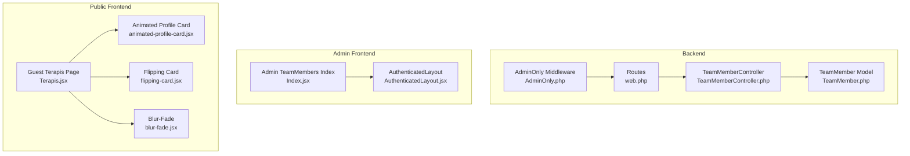
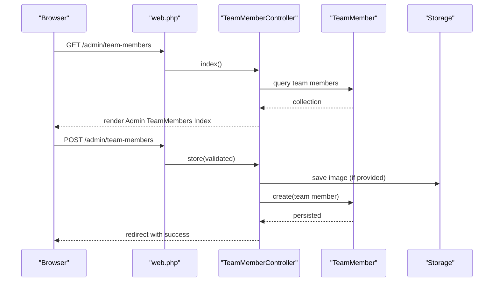
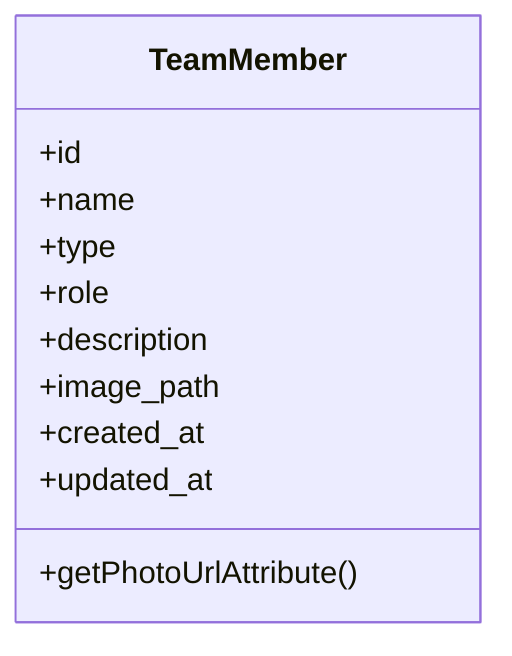
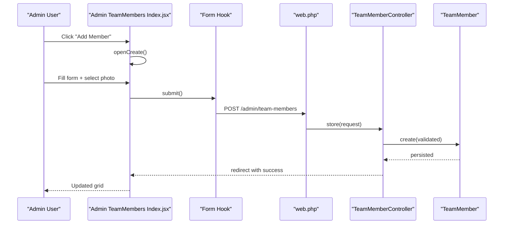
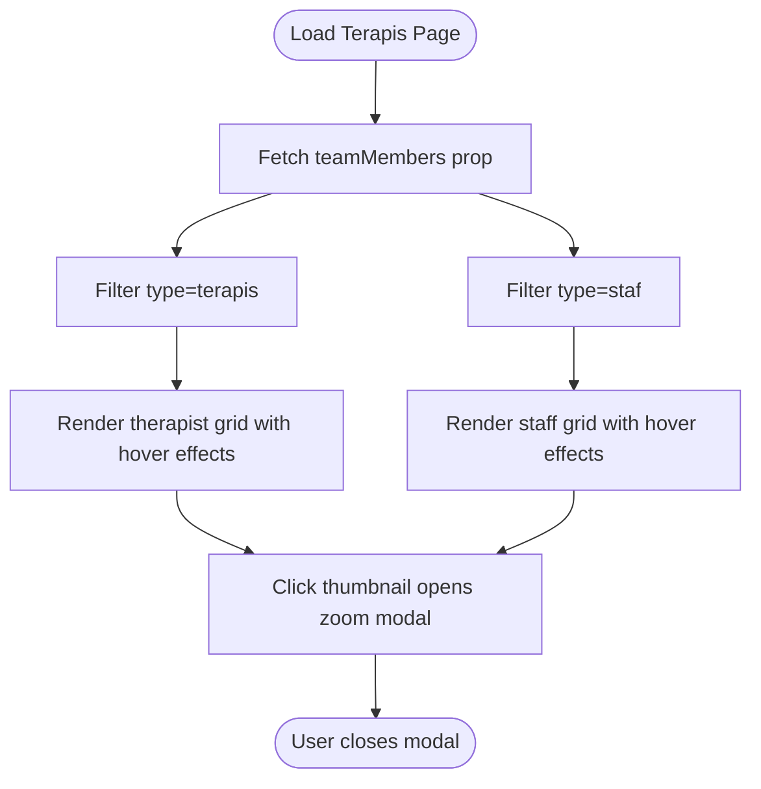
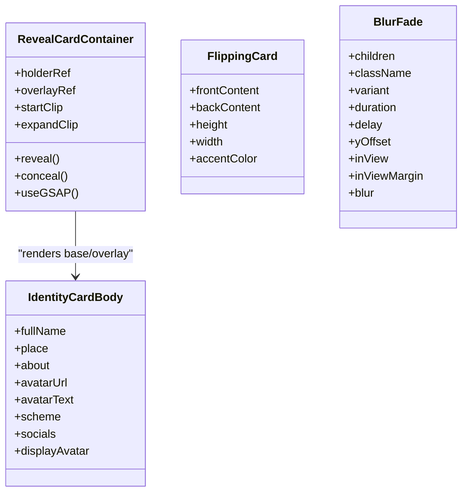
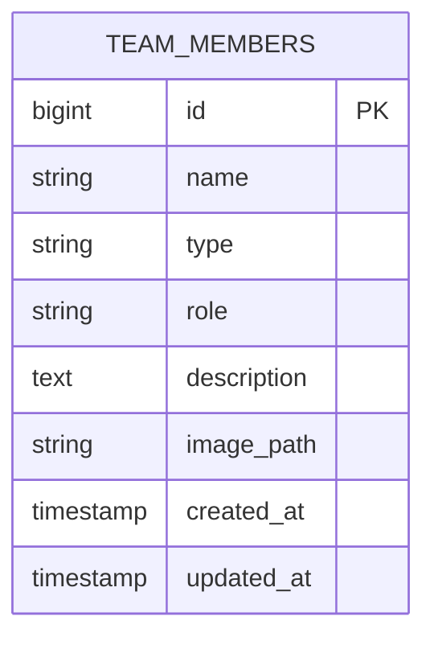
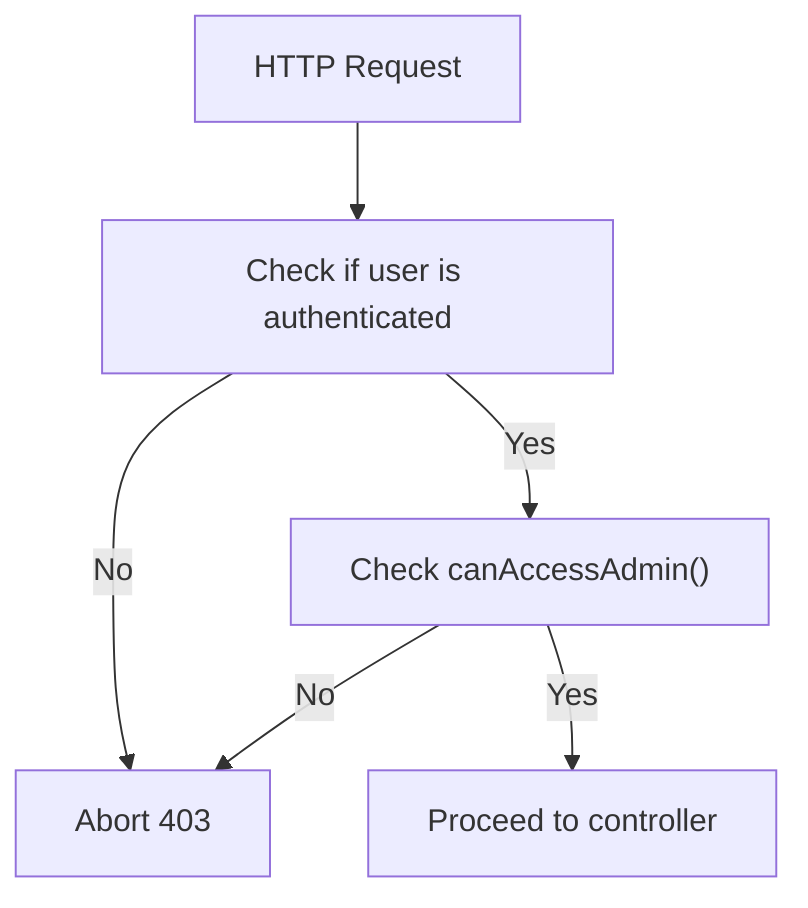
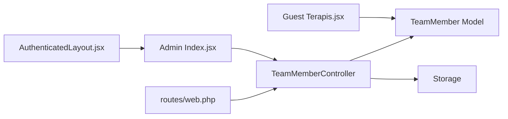

# Expert Team Management

<cite>
**Referenced Files in This Document**
- [TeamMember.php](file://app/Models/TeamMember.php)
- [TeamMemberController.php](file://app/Http/Controllers/TeamMemberController.php)
- [2026_04_25_153659_create_team_members_table.php](file://database/migrations/2026_04_25_153659_create_team_members_table.php)
- [Index.jsx](file://resources/js/Pages/Admin/TeamMembers/Index.jsx)
- [Terapis.jsx](file://resources/js/Pages/Guest/Terapis.jsx)
- [animated-profile-card.jsx](file://resources/js/Components/ui/animated-profile-card.jsx)
- [flipping-card.jsx](file://resources/js/Components/ui/flipping-card.jsx)
- [blur-fade.jsx](file://resources/js/Components/ui/blur-fade.jsx)
- [web.php](file://routes/web.php)
- [AdminOnly.php](file://app/Http/Middleware/AdminOnly.php)
- [AuthenticatedLayout.jsx](file://resources/js/Layouts/AuthenticatedLayout.jsx)
</cite>

## Table of Contents
1. [Introduction](#introduction)
2. [Project Structure](#project-structure)
3. [Core Components](#core-components)
4. [Architecture Overview](#architecture-overview)
5. [Detailed Component Analysis](#detailed-component-analysis)
6. [Dependency Analysis](#dependency-analysis)
7. [Performance Considerations](#performance-considerations)
8. [Troubleshooting Guide](#troubleshooting-guide)
9. [Conclusion](#conclusion)
10. [Appendices](#appendices)

## Introduction
This document describes the expert team management system for EDUfa Centre. It covers the team member model, admin onboarding and management, front-end display patterns for expert listings and profiles, and the animation framework used for interactive profile cards. The system supports two team types—terapis (therapists) and staf (staff)—and provides a responsive, animated presentation layer for both internal administration and public-facing expert profiles.

## Project Structure
The system is organized around Laravel backend controllers and Eloquent models, Inertia-powered React pages for admin and guest experiences, and reusable UI components with animation libraries.

**Diagram sources**
- [TeamMember.php:1-24](file://app/Models/TeamMember.php#L1-L24)
- [TeamMemberController.php:1-72](file://app/Http/Controllers/TeamMemberController.php#L1-L72)
- [AdminOnly.php:1-25](file://app/Http/Middleware/AdminOnly.php#L1-L25)
- [web.php:68-125](file://routes/web.php#L68-L125)
- [Index.jsx:1-374](file://resources/js/Pages/Admin/TeamMembers/Index.jsx#L1-L374)
- [AuthenticatedLayout.jsx:1-54](file://resources/js/Layouts/AuthenticatedLayout.jsx#L1-L54)
- [Terapis.jsx:1-342](file://resources/js/Pages/Guest/Terapis.jsx#L1-L342)
- [animated-profile-card.jsx:1-224](file://resources/js/Components/ui/animated-profile-card.jsx#L1-L224)
- [flipping-card.jsx:1-55](file://resources/js/Components/ui/flipping-card.jsx#L1-L55)
- [blur-fade.jsx:1-47](file://resources/js/Components/ui/blur-fade.jsx#L1-L47)

**Section sources**
- [web.php:68-125](file://routes/web.php#L68-L125)
- [TeamMember.php:1-24](file://app/Models/TeamMember.php#L1-L24)
- [TeamMemberController.php:1-72](file://app/Http/Controllers/TeamMemberController.php#L1-L72)
- [Index.jsx:1-374](file://resources/js/Pages/Admin/TeamMembers/Index.jsx#L1-L374)
- [Terapis.jsx:1-342](file://resources/js/Pages/Guest/Terapis.jsx#L1-L342)
- [authenticatedLayout.jsx:1-54](file://resources/js/Layouts/AuthenticatedLayout.jsx#L1-L54)

## Core Components
- TeamMember model: Defines fillable attributes, appends a computed photo URL, and stores optional image paths.
- TeamMemberController: Handles CRUD operations for team members, including image upload, validation, and deletion with storage cleanup.
- Admin UI: Provides a searchable grid/table with create/edit modals, confirmation dialogs, and image preview.
- Public expert page: Renders therapist and staff lists with hover effects, modal zoom, and animated reveals.
- Animated profile card: Offers a GSAP-based reveal card with floating idle animation and hover-triggered reveal.
- Flipping card: Implements a 3D flip effect for front/back content presentation.
- Blur fade: Adds scroll-triggered entrance animations with blur/fade transitions.

**Section sources**
- [TeamMember.php:9-22](file://app/Models/TeamMember.php#L9-L22)
- [TeamMemberController.php:20-70](file://app/Http/Controllers/TeamMemberController.php#L20-L70)
- [Index.jsx:29-211](file://resources/js/Pages/Admin/TeamMembers/Index.jsx#L29-L211)
- [Terapis.jsx:34-277](file://resources/js/Pages/Guest/Terapis.jsx#L34-L277)
- [animated-profile-card.jsx:166-221](file://resources/js/Components/ui/animated-profile-card.jsx#L166-L221)
- [flipping-card.jsx:8-54](file://resources/js/Components/ui/flipping-card.jsx#L8-L54)
- [blur-fade.jsx:8-46](file://resources/js/Components/ui/blur-fade.jsx#L8-L46)

## Architecture Overview
The system follows a layered architecture:
- Routes define admin-protected endpoints for team member management.
- Controllers orchestrate requests, validate input, manage uploads, and delegate to models.
- Models encapsulate persistence and computed attributes.
- Admin pages render a searchable grid with modals for create/update/delete.
- Public pages present filtered expert lists with interactive cards and modals.

**Diagram sources**
- [web.php:96-104](file://routes/web.php#L96-L104)
- [TeamMemberController.php:13-37](file://app/Http/Controllers/TeamMemberController.php#L13-L37)
- [TeamMember.php:19-22](file://app/Models/TeamMember.php#L19-L22)

**Section sources**
- [web.php:96-104](file://routes/web.php#L96-L104)
- [TeamMemberController.php:13-37](file://app/Http/Controllers/TeamMemberController.php#L13-L37)

## Detailed Component Analysis

### Team Member Model
The TeamMember model defines:
- Fillable fields: name, type, role, description, image_path.
- Computed photo_url attribute derived from stored image_path using Laravel’s asset helper.
- Supports nullable image_path for optional profile photos.

**Diagram sources**
- [TeamMember.php:7-22](file://app/Models/TeamMember.php#L7-L22)

**Section sources**
- [TeamMember.php:9-22](file://app/Models/TeamMember.php#L9-L22)

### Admin Onboarding and Management
The admin interface provides:
- Search across name, role, and type.
- Create/Edit modal with form validation and image preview.
- Confirmation dialog for save/delete actions.
- Image upload handling with automatic storage path generation and cleanup on update/delete.

**Diagram sources**
- [Index.jsx:44-107](file://resources/js/Pages/Admin/TeamMembers/Index.jsx#L44-L107)
- [web.php:96-104](file://routes/web.php#L96-L104)
- [TeamMemberController.php:20-37](file://app/Http/Controllers/TeamMemberController.php#L20-L37)

**Section sources**
- [Index.jsx:29-107](file://resources/js/Pages/Admin/TeamMembers/Index.jsx#L29-L107)
- [TeamMemberController.php:20-37](file://app/Http/Controllers/TeamMemberController.php#L20-L37)

### Public Expert Listings and Filtering
The guest Terapis page:
- Filters team members into therapists and staff.
- Renders responsive grids with hover effects and zoom modal.
- Uses Framer Motion for staggered entrance animations and spring-based transitions.

**Diagram sources**
- [Terapis.jsx:34-277](file://resources/js/Pages/Guest/Terapis.jsx#L34-L277)

**Section sources**
- [Terapis.jsx:34-277](file://resources/js/Pages/Guest/Terapis.jsx#L34-L277)

### Animated Profile Cards
Two complementary components enable rich profile presentations:
- Animated Profile Card: GSAP-driven reveal card with floating idle animation and mouse-enter/leave reveal. Supports accent themes and optional social links.
- Flipping Card: 3D flip component with front/back content areas and customizable dimensions and accent color.
- Blur Fade: Scroll-triggered entrance animation with blur/fade effect and configurable delay and offset.

**Diagram sources**
- [animated-profile-card.jsx:137-221](file://resources/js/Components/ui/animated-profile-card.jsx#L137-L221)
- [animated-profile-card.jsx:18-133](file://resources/js/Components/ui/animated-profile-card.jsx#L18-L133)
- [flipping-card.jsx:8-54](file://resources/js/Components/ui/flipping-card.jsx#L8-L54)
- [blur-fade.jsx:8-46](file://resources/js/Components/ui/blur-fade.jsx#L8-L46)

**Section sources**
- [animated-profile-card.jsx:166-221](file://resources/js/Components/ui/animated-profile-card.jsx#L166-L221)
- [flipping-card.jsx:8-54](file://resources/js/Components/ui/flipping-card.jsx#L8-L54)
- [blur-fade.jsx:8-46](file://resources/js/Components/ui/blur-fade.jsx#L8-L46)

### Data Model and Migration
The team_members table schema supports:
- id, name, type (terapis/staf), role, description, image_path, timestamps.
- The model appends photo_url for convenient rendering.

**Diagram sources**
- [2026_04_25_153659_create_team_members_table.php:14-22](file://database/migrations/2026_04_25_153659_create_team_members_table.php#L14-L22)
- [TeamMember.php:19-22](file://app/Models/TeamMember.php#L19-L22)

**Section sources**
- [2026_04_25_153659_create_team_members_table.php:14-22](file://database/migrations/2026_04_25_153659_create_team_members_table.php#L14-L22)
- [TeamMember.php:19-22](file://app/Models/TeamMember.php#L19-L22)

### Admin Access Control
Admin-only routes are protected by middleware that checks authentication and a user capability method to access admin.

**Diagram sources**
- [AdminOnly.php:16-23](file://app/Http/Middleware/AdminOnly.php#L16-L23)
- [web.php:68-80](file://routes/web.php#L68-L80)

**Section sources**
- [AdminOnly.php:16-23](file://app/Http/Middleware/AdminOnly.php#L16-L23)
- [web.php:68-80](file://routes/web.php#L68-L80)

## Dependency Analysis
- Routes bind resource endpoints for admin/team-members to TeamMemberController.
- TeamMemberController depends on TeamMember model and Laravel Storage for image handling.
- Admin UI (Index.jsx) uses Inertia navigation and form hooks for optimistic updates and redirects.
- Public UI (Terapis.jsx) consumes the same model-derived props and renders with animations.
- AuthenticatedLayout provides admin layout scaffolding and periodic keep-alive pings.

**Diagram sources**
- [web.php:96-104](file://routes/web.php#L96-L104)
- [TeamMemberController.php:1-72](file://app/Http/Controllers/TeamMemberController.php#L1-L72)
- [TeamMember.php:1-24](file://app/Models/TeamMember.php#L1-L24)
- [Index.jsx:1-374](file://resources/js/Pages/Admin/TeamMembers/Index.jsx#L1-L374)
- [Terapis.jsx:1-342](file://resources/js/Pages/Guest/Terapis.jsx#L1-L342)
- [AuthenticatedLayout.jsx:1-54](file://resources/js/Layouts/AuthenticatedLayout.jsx#L1-L54)

**Section sources**
- [web.php:96-104](file://routes/web.php#L96-L104)
- [TeamMemberController.php:1-72](file://app/Http/Controllers/TeamMemberController.php#L1-L72)
- [TeamMember.php:1-24](file://app/Models/TeamMember.php#L1-L24)
- [Index.jsx:1-374](file://resources/js/Pages/Admin/TeamMembers/Index.jsx#L1-L374)
- [Terapis.jsx:1-342](file://resources/js/Pages/Guest/Terapis.jsx#L1-L342)
- [AuthenticatedLayout.jsx:1-54](file://resources/js/Layouts/AuthenticatedLayout.jsx#L1-L54)

## Performance Considerations
- Image optimization: Photo uploads are validated and limited to common web formats with a cap on file size to reduce bandwidth and storage overhead.
- Client-side animations: GSAP and Framer Motion are used selectively to avoid heavy computations during frequent interactions.
- Keep-alive pings: The authenticated layout sends periodic pings to maintain session liveness and reduce reload churn.
- Lazy loading: Public pages use lazy loading on images to improve initial load performance.

[No sources needed since this section provides general guidance]

## Troubleshooting Guide
- Upload failures: Validate file types and sizes in the controller; ensure storage disk permissions and public symlink are configured.
- Missing images: Confirm image_path is stored and photo_url is computed; verify asset resolution for storage URLs.
- Access denied: Ensure the user meets admin requirements enforced by middleware.
- UI not updating after save: Confirm successful redirect and inertia response; check form submission flow and modal close/reset logic.

**Section sources**
- [TeamMemberController.php:20-37](file://app/Http/Controllers/TeamMemberController.php#L20-L37)
- [TeamMember.php:19-22](file://app/Models/TeamMember.php#L19-L22)
- [AdminOnly.php:16-23](file://app/Http/Middleware/AdminOnly.php#L16-L23)
- [Index.jsx:71-107](file://resources/js/Pages/Admin/TeamMembers/Index.jsx#L71-L107)

## Conclusion
The expert team management system integrates a robust backend model and controller with a modern admin UI and animated public profiles. It supports efficient onboarding, validation, and presentation of team members across roles and specializations, with smooth animations and responsive layouts.

[No sources needed since this section summarizes without analyzing specific files]

## Appendices
- Availability, session scheduling, and performance tracking: No current implementation exists in the reviewed files. These features would require extending the model with scheduling fields, adding dedicated scheduling endpoints, and integrating analytics or metrics collection.

[No sources needed since this section provides general guidance]