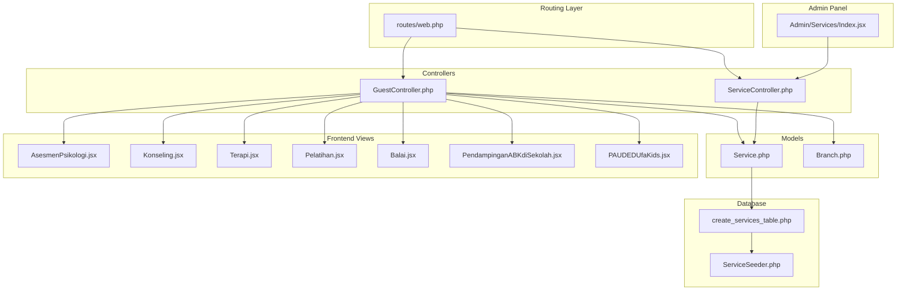
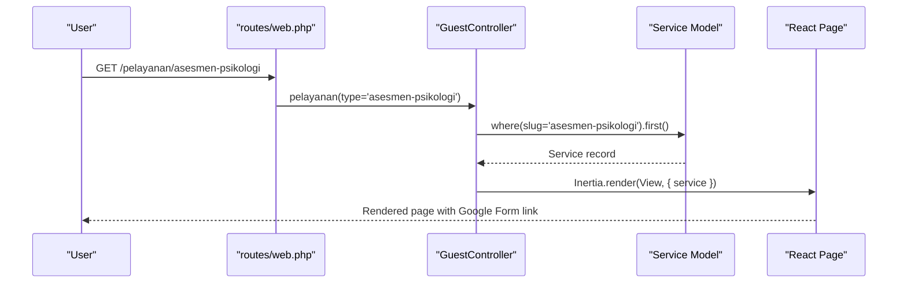
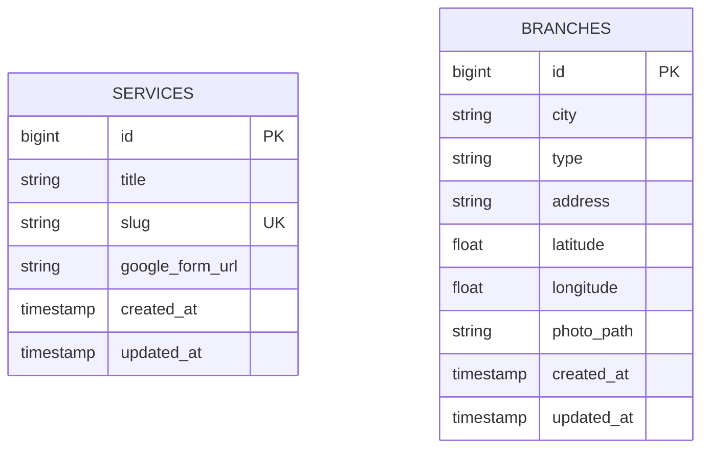
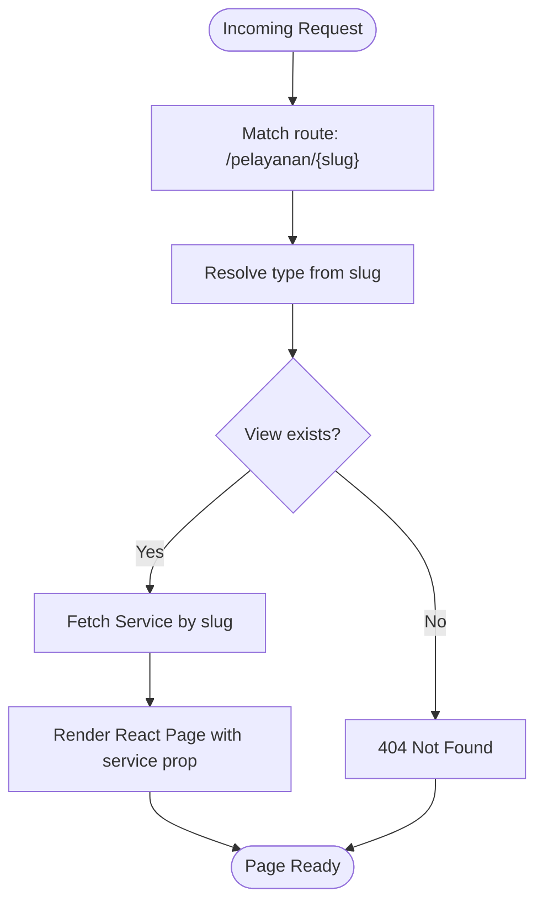
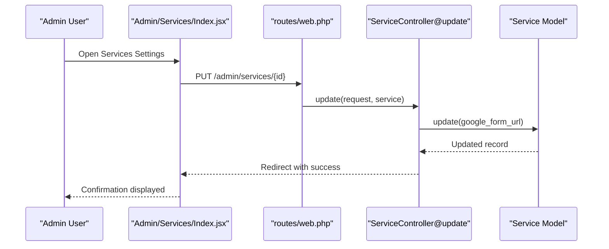
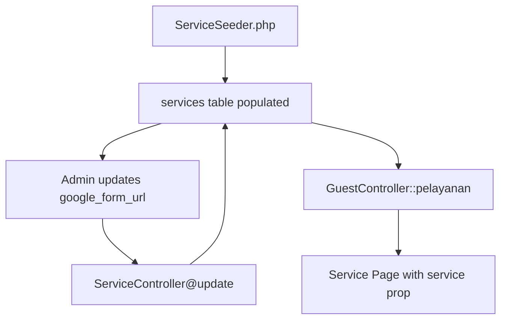
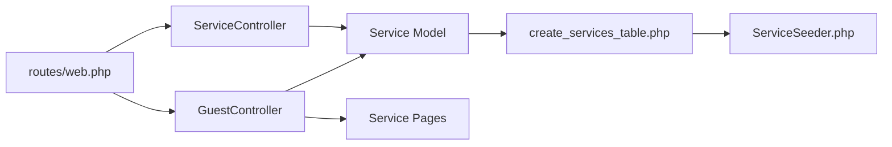

# Service Showcase System

<cite>
**Referenced Files in This Document**
- [web.php](file://routes/web.php)
- [GuestController.php](file://app/Http/Controllers/GuestController.php)
- [ServiceController.php](file://app/Http/Controllers/ServiceController.php)
- [Service.php](file://app/Models/Service.php)
- [Branch.php](file://app/Models/Branch.php)
- [2026_04_30_055559_create_services_table.php](file://database/migrations/2026_04_30_055559_create_services_table.php)
- [ServiceSeeder.php](file://database/seeders/ServiceSeeder.php)
- [AsesmenPsikologi.jsx](file://resources/js/Pages/Guest/Pelayanan/AsesmenPsikologi.jsx)
- [Konseling.jsx](file://resources/js/Pages/Guest/Pelayanan/Konseling.jsx)
- [Terapi.jsx](file://resources/js/Pages/Guest/Pelayanan/Terapi.jsx)
- [Pelatihan.jsx](file://resources/js/Pages/Guest/Pelayanan/Pelatihan.jsx)
- [Balai.jsx](file://resources/js/Pages/Guest/Pelayanan/Balai.jsx)
- [PendampinganABKdiSekolah.jsx](file://resources/js/Pages/Guest/Pelayanan/PendampinganABKdiSekolah.jsx)
- [PAUDEDUfaKids.jsx](file://resources/js/Pages/Guest/Pelayanan/PAUDEDUfaKids.jsx)
- [Index.jsx](file://resources/js/Pages/Admin/Services/Index.jsx)
</cite>

## Table of Contents
1. [Introduction](#introduction)
2. [Project Structure](#project-structure)
3. [Core Components](#core-components)
4. [Architecture Overview](#architecture-overview)
5. [Detailed Component Analysis](#detailed-component-analysis)
6. [Dependency Analysis](#dependency-analysis)
7. [Performance Considerations](#performance-considerations)
8. [Troubleshooting Guide](#troubleshooting-guide)
9. [Conclusion](#conclusion)

## Introduction
This document describes the service showcase system that powers EDUfa's service catalog. It covers the complete service offerings including psychological assessment, training programs, counseling, therapy, preschool education, school accompaniment, and vocational training. The system implements a slug-based routing mechanism, dynamic view rendering, and admin-managed enrollment links. It also documents the service data schema, relationships with branches, and the administrative interface for managing service-specific Google Forms.

## Project Structure
The service showcase system spans Laravel backend controllers and Eloquent models, Inertia-powered frontend pages, and a dedicated admin panel for service configuration.

**Diagram sources**
- [web.php:58-66](file://routes/web.php#L58-L66)
- [GuestController.php:98-117](file://app/Http/Controllers/GuestController.php#L98-L117)
- [ServiceController.php:9-30](file://app/Http/Controllers/ServiceController.php#L9-L30)
- [Service.php:7-14](file://app/Models/Service.php#L7-L14)
- [Branch.php:8-35](file://app/Models/Branch.php#L8-L35)
- [2026_04_30_055559_create_services_table.php:14-20](file://database/migrations/2026_04_30_055559_create_services_table.php#L14-L20)
- [ServiceSeeder.php:15-55](file://database/seeders/ServiceSeeder.php#L15-L55)
- [AsesmenPsikologi.jsx:32](file://resources/js/Pages/Guest/Pelayanan/AsesmenPsikologi.jsx#L32)
- [Konseling.jsx:32](file://resources/js/Pages/Guest/Pelayanan/Konseling.jsx#L32)
- [Terapi.jsx:32](file://resources/js/Pages/Guest/Pelayanan/Terapi.jsx#L32)
- [Pelatihan.jsx:32](file://resources/js/Pages/Guest/Pelayanan/Pelatihan.jsx#L32)
- [Balai.jsx:32](file://resources/js/Pages/Guest/Pelayanan/Balai.jsx#L32)
- [PendampinganABKdiSekolah.jsx:32](file://resources/js/Pages/Guest/Pelayanan/PendampinganABKdiSekolah.jsx#L32)
- [PAUDEDUfaKids.jsx:32](file://resources/js/Pages/Guest/Pelayanan/PAUDEDUfaKids.jsx#L32)
- [Index.jsx:94-134](file://resources/js/Pages/Admin/Services/Index.jsx#L94-L134)

**Section sources**
- [web.php:58-66](file://routes/web.php#L58-L66)
- [GuestController.php:98-117](file://app/Http/Controllers/GuestController.php#L98-L117)
- [ServiceController.php:9-30](file://app/Http/Controllers/ServiceController.php#L9-L30)
- [Service.php:7-14](file://app/Models/Service.php#L7-L14)
- [2026_04_30_055559_create_services_table.php:14-20](file://database/migrations/2026_04_30_055559_create_services_table.php#L14-L20)
- [ServiceSeeder.php:15-55](file://database/seeders/ServiceSeeder.php#L15-L55)

## Core Components
- Service model: Defines the service entity with title, slug, and optional Google Form URL.
- GuestController: Handles slug-based routing to service-specific pages and injects the matching service record.
- Frontend service pages: Render service-specific content and use the injected service's Google Form URL for enrollment.
- Admin ServiceController: Provides CRUD-like updates for service records, focusing on Google Form URLs.
- Admin Services Index: UI for updating and validating Google Form URLs per service.

Key implementation patterns:
- Slug-based routing: Routes map human-readable slugs to service pages.
- Dynamic view rendering: Controller selects the appropriate React page based on the slug.
- Admin-managed enrollment links: Admins update Google Form URLs that are consumed by service pages.

**Section sources**
- [Service.php:7-14](file://app/Models/Service.php#L7-L14)
- [GuestController.php:98-117](file://app/Http/Controllers/GuestController.php#L98-L117)
- [ServiceController.php:18-29](file://app/Http/Controllers/ServiceController.php#L18-L29)
- [Index.jsx:9-92](file://resources/js/Pages/Admin/Services/Index.jsx#L9-L92)

## Architecture Overview
The system follows a clean separation of concerns:
- Routing defines service endpoints under `/pelayanan/{slug}`.
- GuestController resolves the slug to a view and fetches the corresponding service record.
- Frontend pages render content and link to the configured Google Form.
- Admin routes allow updating service metadata, particularly the Google Form URL.

**Diagram sources**
- [web.php:58-66](file://routes/web.php#L58-L66)
- [GuestController.php:98-117](file://app/Http/Controllers/GuestController.php#L98-L117)
- [Service.php:7-14](file://app/Models/Service.php#L7-L14)

## Detailed Component Analysis

### Service Data Schema and Relationships
The service table stores:
- title: Human-readable service name
- slug: Unique identifier used for routing
- google_form_url: Optional enrollment form link
- timestamps: Created/updated tracking

Relationships:
- Each service page is associated with a single service record resolved by slug.
- Branches are separate entities with their own schema and photo URL resolution.

**Diagram sources**
- [2026_04_30_055559_create_services_table.php:14-20](file://database/migrations/2026_04_30_055559_create_services_table.php#L14-L20)
- [Branch.php:12-19](file://app/Models/Branch.php#L12-L19)

**Section sources**
- [2026_04_30_055559_create_services_table.php:14-20](file://database/migrations/2026_04_30_055559_create_services_table.php#L14-L20)
- [Service.php:9-13](file://app/Models/Service.php#L9-L13)
- [Branch.php:21-34](file://app/Models/Branch.php#L21-L34)

### Slug-Based Routing and Dynamic View Rendering
Routing:
- Routes under `/pelayanan` forward to GuestController::pelayanan with a type parameter.
- The controller maps the type to a specific React view and passes the matching service record.

View rendering:
- Each service page expects a service prop and falls back to a default WhatsApp link if no Google Form URL is configured.

**Diagram sources**
- [web.php:58-66](file://routes/web.php#L58-L66)
- [GuestController.php:100-116](file://app/Http/Controllers/GuestController.php#L100-L116)

**Section sources**
- [web.php:58-66](file://routes/web.php#L58-L66)
- [GuestController.php:98-117](file://app/Http/Controllers/GuestController.php#L98-L117)

### Service-Specific Pages Implementation
Each service page follows a consistent pattern:
- Uses SEO component with structured metadata and breadcrumbs.
- Renders service-specific content and a prominent enrollment link derived from the service prop.
- Includes FAQ blocks and responsive animations.

Examples:
- Psychological Assessment: [AsesmenPsikologi.jsx:32](file://resources/js/Pages/Guest/Pelayanan/AsesmenPsikologi.jsx#L32)
- Counseling: [Konseling.jsx:32](file://resources/js/Pages/Guest/Pelayanan/Konseling.jsx#L32)
- Therapy: [Terapi.jsx:32](file://resources/js/Pages/Guest/Pelayanan/Terapi.jsx#L32)
- Training Programs: [Pelatihan.jsx:32](file://resources/js/Pages/Guest/Pelayanan/Pelatihan.jsx#L32)
- Vocational Training (BLK): [Balai.jsx:32](file://resources/js/Pages/Guest/Pelayanan/Balai.jsx#L32)
- School Accompaniment: [PendampinganABKdiSekolah.jsx:32](file://resources/js/Pages/Guest/Pelayanan/PendampinganABKdiSekolah.jsx#L32)
- Preschool Education: [PAUDEDUfaKids.jsx:32](file://resources/js/Pages/Guest/Pelayanan/PAUDEDUfaKids.jsx#L32)

**Section sources**
- [AsesmenPsikologi.jsx:32](file://resources/js/Pages/Guest/Pelayanan/AsesmenPsikologi.jsx#L32)
- [Konseling.jsx:32](file://resources/js/Pages/Guest/Pelayanan/Konseling.jsx#L32)
- [Terapi.jsx:32](file://resources/js/Pages/Guest/Pelayanan/Terapi.jsx#L32)
- [Pelatihan.jsx:32](file://resources/js/Pages/Guest/Pelayanan/Pelatihan.jsx#L32)
- [Balai.jsx:32](file://resources/js/Pages/Guest/Pelayanan/Balai.jsx#L32)
- [PendampinganABKdiSekolah.jsx:32](file://resources/js/Pages/Guest/Pelayanan/PendampinganABKdiSekolah.jsx#L32)
- [PAUDEDUfaKids.jsx:32](file://resources/js/Pages/Guest/Pelayanan/PAUDEDUfaKids.jsx#L32)

### Admin Management: Service Enrollment Links
Admins manage enrollment links through:
- Admin route: GET/PUT `/admin/services/{service}`
- Admin UI: List of services with editable Google Form URLs
- Backend validation: Ensures URLs are present and properly prefixed

**Diagram sources**
- [web.php:83-84](file://routes/web.php#L83-L84)
- [ServiceController.php:18-29](file://app/Http/Controllers/ServiceController.php#L18-L29)
- [Index.jsx:9-92](file://resources/js/Pages/Admin/Services/Index.jsx#L9-L92)

**Section sources**
- [web.php:83-84](file://routes/web.php#L83-L84)
- [ServiceController.php:18-29](file://app/Http/Controllers/ServiceController.php#L18-L29)
- [Index.jsx:9-92](file://resources/js/Pages/Admin/Services/Index.jsx#L9-L92)

### Service Creation, Modification, and Display Logic
Creation:
- Seed script creates service records with predefined slugs and titles.
- Each service is inserted or updated by slug to ensure idempotency.

Modification:
- Admin updates the google_form_url field for a given service.
- Frontend pages consume the updated URL for enrollment actions.

Display:
- GuestController resolves the service by slug and renders the corresponding page.
- Pages fall back to a default contact link if no URL is configured.

**Diagram sources**
- [ServiceSeeder.php:15-55](file://database/seeders/ServiceSeeder.php#L15-L55)
- [ServiceController.php:18-29](file://app/Http/Controllers/ServiceController.php#L18-L29)
- [GuestController.php:114-116](file://app/Http/Controllers/GuestController.php#L114-L116)

**Section sources**
- [ServiceSeeder.php:15-55](file://database/seeders/ServiceSeeder.php#L15-L55)
- [ServiceController.php:18-29](file://app/Http/Controllers/ServiceController.php#L18-L29)
- [GuestController.php:114-116](file://app/Http/Controllers/GuestController.php#L114-L116)

### Service Categorization, Filtering, and Search Functionality
Categorization:
- Services are categorized implicitly by their slugs and mapped view names.

Filtering and Search:
- Branches support client-side filtering by city/address in the BranchSection component.
- No explicit service filtering/search is implemented in the current codebase.

Recommendations:
- Extend the frontend to filter services by category or keyword.
- Add server-side search endpoints for scalability.

**Section sources**
- [BranchSection.jsx:8-11](file://resources/js/Components/BranchSection.jsx#L8-L11)

## Dependency Analysis
The system exhibits low coupling between components:
- Routes depend on GuestController for service pages.
- GuestController depends on Service model for data retrieval.
- Admin routes depend on ServiceController for updates.
- Frontend pages depend on the service prop passed by the controller.

**Diagram sources**
- [web.php:58-66](file://routes/web.php#L58-L66)
- [GuestController.php:98-117](file://app/Http/Controllers/GuestController.php#L98-L117)
- [ServiceController.php:18-29](file://app/Http/Controllers/ServiceController.php#L18-L29)
- [Service.php:7-14](file://app/Models/Service.php#L7-L14)
- [2026_04_30_055559_create_services_table.php:14-20](file://database/migrations/2026_04_30_055559_create_services_table.php#L14-L20)
- [ServiceSeeder.php:15-55](file://database/seeders/ServiceSeeder.php#L15-L55)

**Section sources**
- [web.php:58-66](file://routes/web.php#L58-L66)
- [GuestController.php:98-117](file://app/Http/Controllers/GuestController.php#L98-L117)
- [ServiceController.php:18-29](file://app/Http/Controllers/ServiceController.php#L18-L29)
- [Service.php:7-14](file://app/Models/Service.php#L7-L14)

## Performance Considerations
- Database queries: Service lookup by slug is efficient due to the unique index.
- Frontend rendering: Each service page is self-contained; keep content static to minimize re-renders.
- Admin updates: Batch updates could be optimized if many services require URL changes.
- Image assets: Branch photos are served via asset URLs; ensure proper caching headers.

## Troubleshooting Guide
Common issues and resolutions:
- 404 on service pages: Verify the slug exists in the services table and matches the route definition.
- Missing enrollment link: Ensure the google_form_url is set in the admin panel and starts with a valid protocol.
- Incorrect photo URLs: Branch photos are resolved automatically; confirm photo_path correctness or URL validity.

**Section sources**
- [web.php:58-66](file://routes/web.php#L58-L66)
- [ServiceController.php:18-29](file://app/Http/Controllers/ServiceController.php#L18-L29)
- [Branch.php:21-34](file://app/Models/Branch.php#L21-L34)

## Conclusion
The service showcase system provides a robust, maintainable foundation for presenting EDUfa's services. Its slug-based routing, dynamic view rendering, and admin-managed enrollment links enable flexible content management. Extending the system with service search and filtering would further enhance user experience, while maintaining the current clear separation of concerns ensures scalability.