# User Authentication and Profile Management

<cite>
**Referenced Files in This Document**
- [AuthenticatedSessionController.php](file://app/Http/Controllers/Auth/AuthenticatedSessionController.php)
- [PasswordResetLinkController.php](file://app/Http/Controllers/Auth/PasswordResetLinkController.php)
- [NewPasswordController.php](file://app/Http/Controllers/Auth/NewPasswordController.php)
- [VerifyEmailController.php](file://app/Http/Controllers/Auth/VerifyEmailController.php)
- [ProfileController.php](file://app/Http/Controllers/ProfileController.php)
- [LoginRequest.php](file://app/Http/Requests/Auth/LoginRequest.php)
- [ProfileUpdateRequest.php](file://app/Http/Requests/ProfileUpdateRequest.php)
- [AdminOnly.php](file://app/Http/Middleware/AdminOnly.php)
- [HandleInertiaRequests.php](file://app/Http/Middleware/HandleInertiaRequests.php)
- [User.php](file://app/Models/User.php)
- [Login.jsx](file://resources/js/Pages/Auth/Login.jsx)
- [ForgotPassword.jsx](file://resources/js/Pages/Auth/ForgotPassword.jsx)
- [ResetPassword.jsx](file://resources/js/Pages/Auth/ResetPassword.jsx)
- [VerifyEmail.jsx](file://resources/js/Pages/Auth/VerifyEmail.jsx)
- [Edit.jsx](file://resources/js/Pages/Profile/Edit.jsx)
- [UpdateProfileInformationForm.jsx](file://resources/js/Pages/Profile/Partials/UpdateProfileInformationForm.jsx)
- [UpdatePasswordForm.jsx](file://resources/js/Pages/Profile/Partials/UpdatePasswordForm.jsx)
- [Dashboard.jsx](file://resources/js/Pages/Dashboard.jsx)
- [auth.php](file://config/auth.php)
- [session.php](file://config/session.php)
- [0001_01_01_000000_create_users_table.php](file://database/migrations/0001_01_01_000000_create_users_table.php)
</cite>

## Table of Contents
1. [Introduction](#introduction)
2. [Project Structure](#project-structure)
3. [Core Components](#core-components)
4. [Architecture Overview](#architecture-overview)
5. [Detailed Component Analysis](#detailed-component-analysis)
6. [Dependency Analysis](#dependency-analysis)
7. [Performance Considerations](#performance-considerations)
8. [Security Measures and Compliance](#security-measures-and-compliance)
9. [Frontend Implementation](#frontend-implementation)
10. [Troubleshooting Guide](#troubleshooting-guide)
11. [Conclusion](#conclusion)

## Introduction
This document provides comprehensive documentation for the user authentication and profile management system. It covers the complete authentication flow including login, registration, password reset, email verification, and administrative access controls. It also explains the profile management interface for updating personal information, password changes, and account settings. The documentation details middleware protection, role-based access control, session management, and security measures. Frontend implementation details for authentication forms, profile editing, and the user dashboard are included, along with guidance on password policies and user data privacy compliance.

## Project Structure
The authentication and profile management system is organized around Laravel controllers, requests, middleware, models, and Inertia-powered frontend components. Controllers handle HTTP requests and orchestrate responses, while requests encapsulate validation logic. Middleware enforces access control and shares authentication state with the frontend. The User model defines roles and access capabilities. Migrations define the underlying database schema for user accounts.

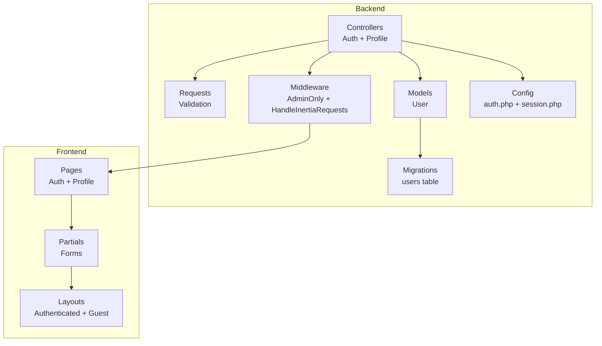

**Diagram sources**
- [AuthenticatedSessionController.php:1-58](file://app/Http/Controllers/Auth/AuthenticatedSessionController.php#L1-L58)
- [ProfileController.php:1-64](file://app/Http/Controllers/ProfileController.php#L1-L64)
- [AdminOnly.php:1-25](file://app/Http/Middleware/AdminOnly.php#L1-L25)
- [HandleInertiaRequests.php:1-40](file://app/Http/Middleware/HandleInertiaRequests.php#L1-L40)
- [User.php:1-47](file://app/Models/User.php#L1-L47)
- [Login.jsx](file://resources/js/Pages/Auth/Login.jsx)
- [Edit.jsx](file://resources/js/Pages/Profile/Edit.jsx)

**Section sources**
- [AuthenticatedSessionController.php:1-58](file://app/Http/Controllers/Auth/AuthenticatedSessionController.php#L1-L58)
- [ProfileController.php:1-64](file://app/Http/Controllers/ProfileController.php#L1-L64)
- [AdminOnly.php:1-25](file://app/Http/Middleware/AdminOnly.php#L1-L25)
- [HandleInertiaRequests.php:1-40](file://app/Http/Middleware/HandleInertiaRequests.php#L1-L40)
- [User.php:1-47](file://app/Models/User.php#L1-L47)

## Core Components
- Authentication Controllers: Manage login, logout, password reset, and email verification flows.
- Profile Controller: Handles profile updates, password changes, and account deletion.
- Validation Requests: Encapsulate login and profile update validation rules.
- Middleware: Enforce role-based access control and share authentication state with the frontend.
- User Model: Defines roles (admin/editor/user) and access capabilities.
- Frontend Pages: Provide user interfaces for authentication and profile management.

**Section sources**
- [AuthenticatedSessionController.php:13-58](file://app/Http/Controllers/Auth/AuthenticatedSessionController.php#L13-L58)
- [ProfileController.php:14-64](file://app/Http/Controllers/ProfileController.php#L14-L64)
- [LoginRequest.php:13-87](file://app/Http/Requests/Auth/LoginRequest.php#L13-L87)
- [ProfileUpdateRequest.php:10-32](file://app/Http/Requests/ProfileUpdateRequest.php#L10-L32)
- [AdminOnly.php:9-25](file://app/Http/Middleware/AdminOnly.php#L9-L25)
- [HandleInertiaRequests.php:8-40](file://app/Http/Middleware/HandleInertiaRequests.php#L8-L40)
- [User.php:15-47](file://app/Models/User.php#L15-L47)

## Architecture Overview
The system follows a layered architecture with clear separation of concerns:
- Presentation Layer: Inertia-driven React components render authentication and profile pages.
- Application Layer: Controllers coordinate business logic and orchestrate responses.
- Domain Layer: Models encapsulate user data and access control logic.
- Infrastructure Layer: Middleware handles cross-cutting concerns like authentication state sharing and access control.

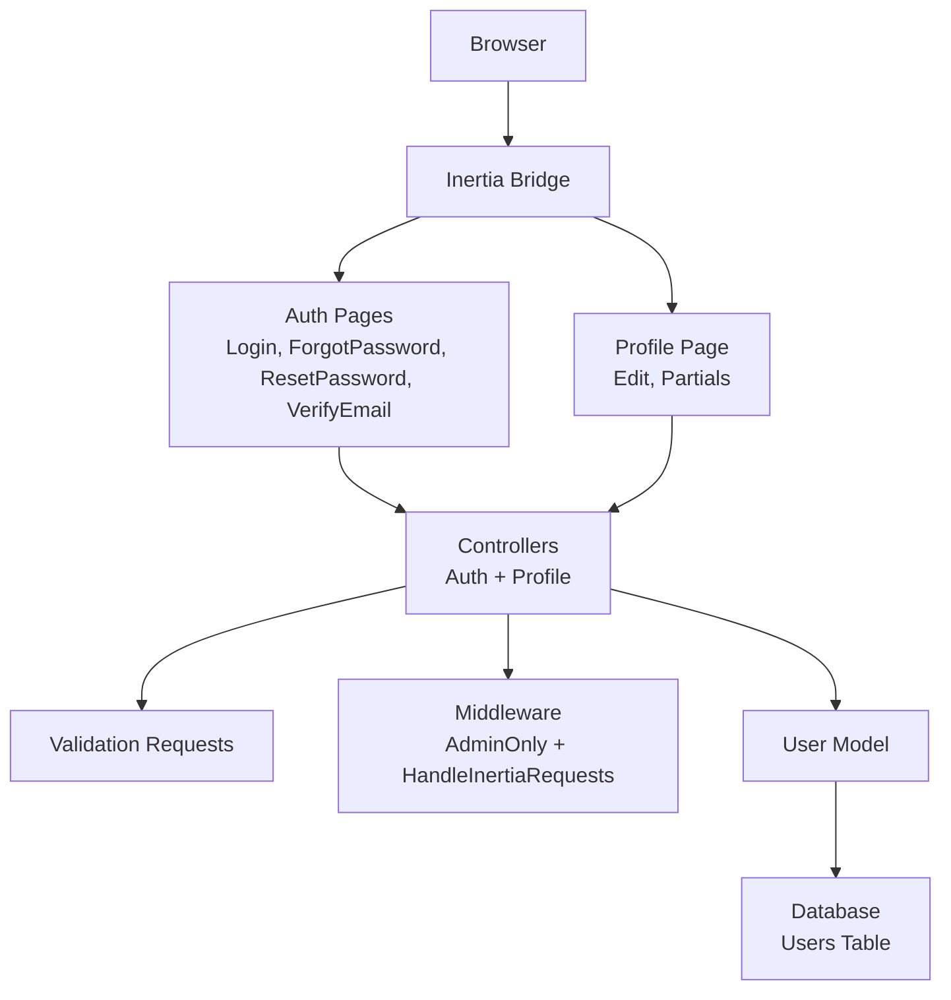

**Diagram sources**
- [Login.jsx](file://resources/js/Pages/Auth/Login.jsx)
- [ForgotPassword.jsx](file://resources/js/Pages/Auth/ForgotPassword.jsx)
- [ResetPassword.jsx](file://resources/js/Pages/Auth/ResetPassword.jsx)
- [VerifyEmail.jsx](file://resources/js/Pages/Auth/VerifyEmail.jsx)
- [Edit.jsx](file://resources/js/Pages/Profile/Edit.jsx)
- [AuthenticatedSessionController.php:13-58](file://app/Http/Controllers/Auth/AuthenticatedSessionController.php#L13-L58)
- [ProfileController.php:14-64](file://app/Http/Controllers/ProfileController.php#L14-L64)
- [AdminOnly.php:9-25](file://app/Http/Middleware/AdminOnly.php#L9-L25)
- [HandleInertiaRequests.php:8-40](file://app/Http/Middleware/HandleInertiaRequests.php#L8-L40)
- [User.php:15-47](file://app/Models/User.php#L15-L47)

## Detailed Component Analysis

### Authentication Flow

#### Login Process
The login process validates credentials, enforces rate limiting, regenerates sessions, and restricts access to administrators.

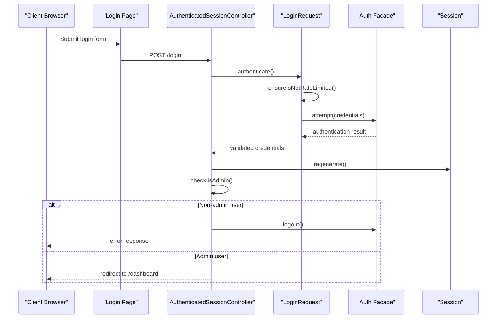

**Diagram sources**
- [AuthenticatedSessionController.php:28-43](file://app/Http/Controllers/Auth/AuthenticatedSessionController.php#L28-L43)
- [LoginRequest.php:41-54](file://app/Http/Requests/Auth/LoginRequest.php#L41-L54)
- [LoginRequest.php:61-77](file://app/Http/Requests/Auth/LoginRequest.php#L61-L77)

**Section sources**
- [AuthenticatedSessionController.php:18-43](file://app/Http/Controllers/Auth/AuthenticatedSessionController.php#L18-L43)
- [LoginRequest.php:41-87](file://app/Http/Requests/Auth/LoginRequest.php#L41-L87)

#### Password Reset Link Request
This flow sends a password reset link to the user's email.

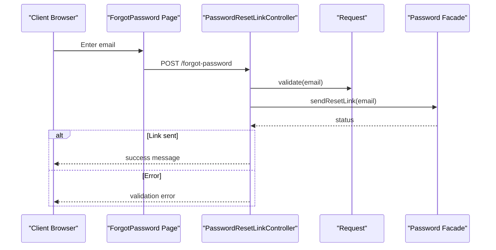

**Diagram sources**
- [PasswordResetLinkController.php:30-50](file://app/Http/Controllers/Auth/PasswordResetLinkController.php#L30-L50)

**Section sources**
- [PasswordResetLinkController.php:18-50](file://app/Http/Controllers/Auth/PasswordResetLinkController.php#L18-L50)

#### Reset Password
This flow validates the reset token and updates the user's password.

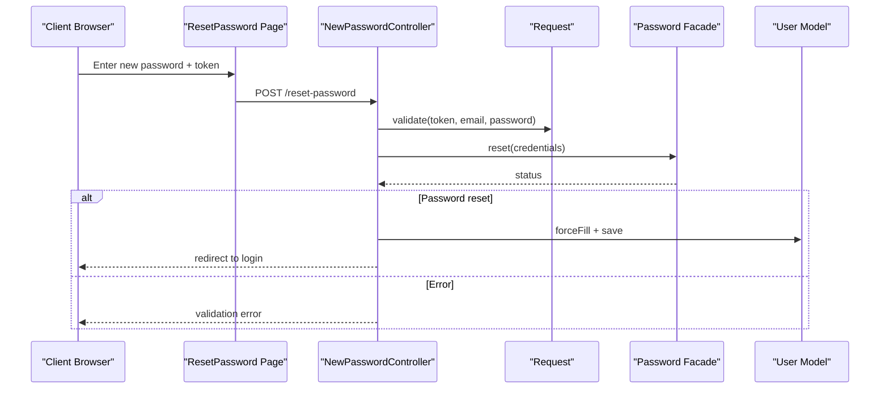

**Diagram sources**
- [NewPasswordController.php:35-68](file://app/Http/Controllers/Auth/NewPasswordController.php#L35-L68)

**Section sources**
- [NewPasswordController.php:22-68](file://app/Http/Controllers/Auth/NewPasswordController.php#L22-L68)

#### Email Verification
This flow marks the user's email as verified upon clicking the verification link.

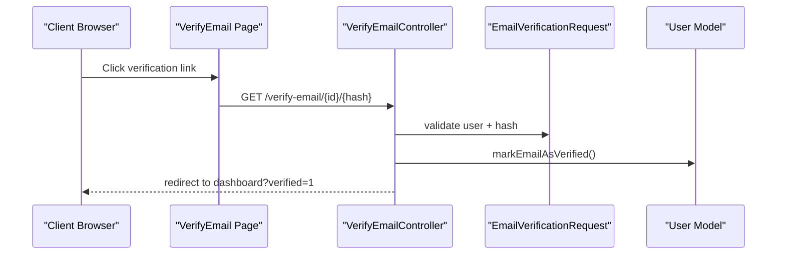

**Diagram sources**
- [VerifyEmailController.php:15-26](file://app/Http/Controllers/Auth/VerifyEmailController.php#L15-L26)

**Section sources**
- [VerifyEmailController.php:10-27](file://app/Http/Controllers/Auth/VerifyEmailController.php#L10-L27)

### Profile Management

#### Profile Editing
The profile edit page allows users to update personal information and change passwords.

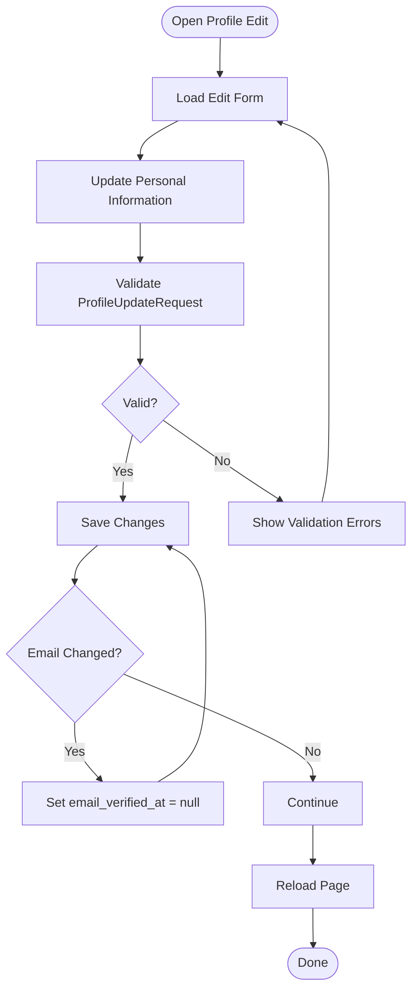

**Diagram sources**
- [ProfileController.php:19-41](file://app/Http/Controllers/ProfileController.php#L19-L41)
- [ProfileUpdateRequest.php:17-30](file://app/Http/Requests/ProfileUpdateRequest.php#L17-L30)

**Section sources**
- [ProfileController.php:19-41](file://app/Http/Controllers/ProfileController.php#L19-L41)
- [ProfileUpdateRequest.php:17-30](file://app/Http/Requests/ProfileUpdateRequest.php#L17-L30)

#### Password Change
Password changes are handled through dedicated partial forms within the profile edit page.

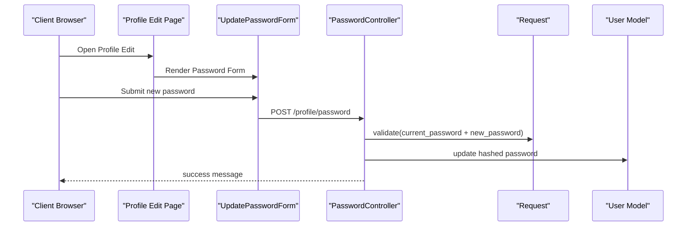

**Diagram sources**
- [UpdatePasswordForm.jsx](file://resources/js/Pages/Profile/Partials/UpdatePasswordForm.jsx)

### Role-Based Access Control and Middleware Protection

#### Admin-Only Middleware
Restricts access to administrative areas to users with appropriate roles.

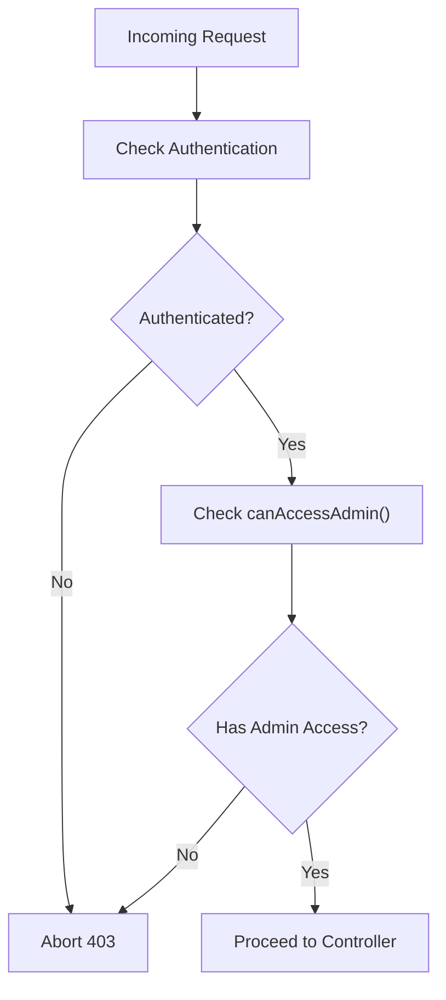

**Diagram sources**
- [AdminOnly.php:16-23](file://app/Http/Middleware/AdminOnly.php#L16-L23)
- [User.php:42-45](file://app/Models/User.php#L42-L45)

**Section sources**
- [AdminOnly.php:16-23](file://app/Http/Middleware/AdminOnly.php#L16-L23)
- [User.php:32-45](file://app/Models/User.php#L32-L45)

#### Session Management
Sessions are regenerated after successful authentication and properly invalidated during logout.

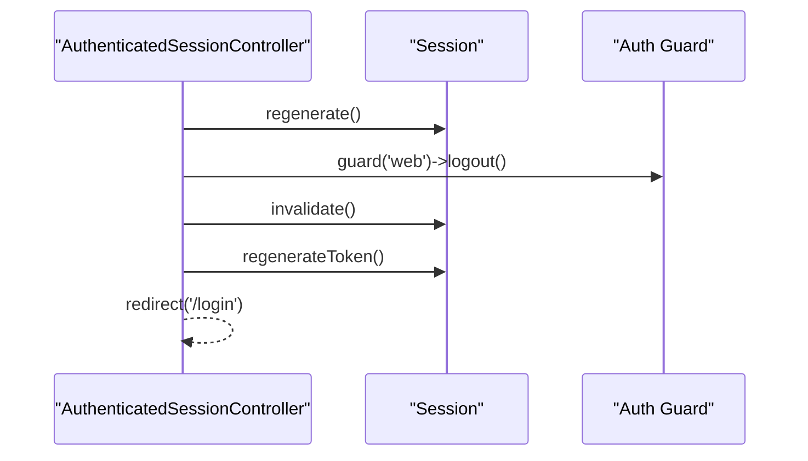

**Diagram sources**
- [AuthenticatedSessionController.php:48-57](file://app/Http/Controllers/Auth/AuthenticatedSessionController.php#L48-L57)

**Section sources**
- [AuthenticatedSessionController.php:32-57](file://app/Http/Controllers/Auth/AuthenticatedSessionController.php#L32-L57)

## Dependency Analysis
The authentication and profile management system exhibits strong cohesion within functional groups and clear separation of concerns. Controllers depend on validation requests for input sanitization and on middleware for access control. The User model centralizes role-based logic, reducing duplication across controllers.

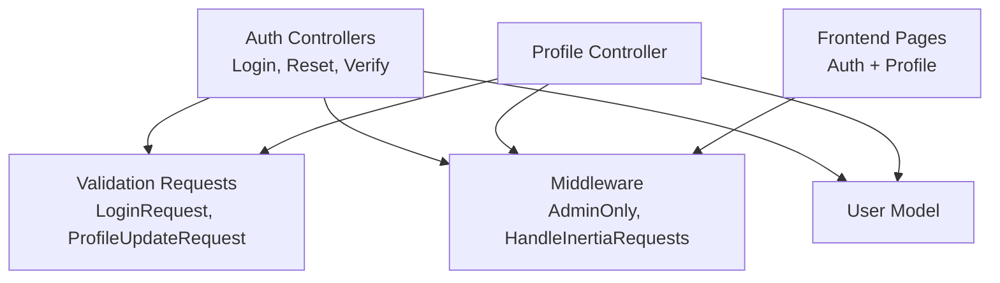

**Diagram sources**
- [AuthenticatedSessionController.php:1-58](file://app/Http/Controllers/Auth/AuthenticatedSessionController.php#L1-L58)
- [ProfileController.php:1-64](file://app/Http/Controllers/ProfileController.php#L1-L64)
- [LoginRequest.php:1-87](file://app/Http/Requests/Auth/LoginRequest.php#L1-L87)
- [ProfileUpdateRequest.php:1-32](file://app/Http/Requests/ProfileUpdateRequest.php#L1-L32)
- [AdminOnly.php:1-25](file://app/Http/Middleware/AdminOnly.php#L1-L25)
- [HandleInertiaRequests.php:1-40](file://app/Http/Middleware/HandleInertiaRequests.php#L1-L40)
- [User.php:1-47](file://app/Models/User.php#L1-L47)

**Section sources**
- [AuthenticatedSessionController.php:1-58](file://app/Http/Controllers/Auth/AuthenticatedSessionController.php#L1-L58)
- [ProfileController.php:1-64](file://app/Http/Controllers/ProfileController.php#L1-L64)
- [LoginRequest.php:1-87](file://app/Http/Requests/Auth/LoginRequest.php#L1-L87)
- [ProfileUpdateRequest.php:1-32](file://app/Http/Requests/ProfileUpdateRequest.php#L1-L32)
- [AdminOnly.php:1-25](file://app/Http/Middleware/AdminOnly.php#L1-L25)
- [HandleInertiaRequests.php:1-40](file://app/Http/Middleware/HandleInertiaRequests.php#L1-L40)
- [User.php:1-47](file://app/Models/User.php#L1-L47)

## Performance Considerations
- Rate Limiting: Login attempts are rate-limited to prevent brute-force attacks, with automatic lockout notifications.
- Session Regeneration: Sessions are regenerated after authentication to mitigate session fixation attacks.
- Database Casting: Password hashing and email verification timestamps are handled at the model level for efficient persistence.
- Middleware Sharing: Authentication state is shared via middleware to avoid redundant database queries in the frontend.

[No sources needed since this section provides general guidance]

## Security Measures and Compliance
- Password Policies: Password reset enforces strong password requirements through validation rules.
- Email Verification: Users must verify their email addresses before accessing certain features.
- Role-Based Access Control: Administrative areas are restricted to users with appropriate roles.
- Session Security: Sessions are invalidated and tokens regenerated during logout to prevent session hijacking.
- Data Privacy: Sensitive fields are hidden from serialization, and email uniqueness is enforced with case-insensitive rules.

**Section sources**
- [NewPasswordController.php:40-41](file://app/Http/Controllers/Auth/NewPasswordController.php#L40-L41)
- [VerifyEmailController.php:17-25](file://app/Http/Controllers/Auth/VerifyEmailController.php#L17-L25)
- [AdminOnly.php:18-20](file://app/Http/Middleware/AdminOnly.php#L18-L20)
- [AuthenticatedSessionController.php:52-54](file://app/Http/Controllers/Auth/AuthenticatedSessionController.php#L52-L54)
- [User.php:14-31](file://app/Models/User.php#L14-L31)
- [ProfileUpdateRequest.php:21-28](file://app/Http/Requests/ProfileUpdateRequest.php#L21-L28)

## Frontend Implementation
The frontend uses Inertia to render React components for authentication and profile management. Authentication pages include login, forgot password, reset password, and email verification. Profile editing includes separate partials for updating personal information and changing passwords. The dashboard serves as the primary authenticated landing page.

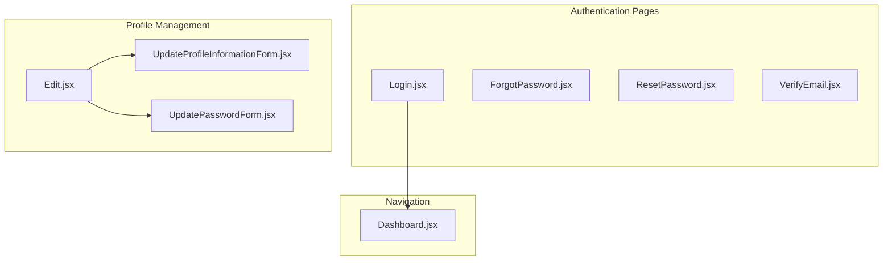

**Diagram sources**
- [Login.jsx](file://resources/js/Pages/Auth/Login.jsx)
- [ForgotPassword.jsx](file://resources/js/Pages/Auth/ForgotPassword.jsx)
- [ResetPassword.jsx](file://resources/js/Pages/Auth/ResetPassword.jsx)
- [VerifyEmail.jsx](file://resources/js/Pages/Auth/VerifyEmail.jsx)
- [Edit.jsx](file://resources/js/Pages/Profile/Edit.jsx)
- [UpdateProfileInformationForm.jsx](file://resources/js/Pages/Profile/Partials/UpdateProfileInformationForm.jsx)
- [UpdatePasswordForm.jsx](file://resources/js/Pages/Profile/Partials/UpdatePasswordForm.jsx)
- [Dashboard.jsx](file://resources/js/Pages/Dashboard.jsx)

**Section sources**
- [Login.jsx](file://resources/js/Pages/Auth/Login.jsx)
- [ForgotPassword.jsx](file://resources/js/Pages/Auth/ForgotPassword.jsx)
- [ResetPassword.jsx](file://resources/js/Pages/Auth/ResetPassword.jsx)
- [VerifyEmail.jsx](file://resources/js/Pages/Auth/VerifyEmail.jsx)
- [Edit.jsx](file://resources/js/Pages/Profile/Edit.jsx)
- [UpdateProfileInformationForm.jsx](file://resources/js/Pages/Profile/Partials/UpdateProfileInformationForm.jsx)
- [UpdatePasswordForm.jsx](file://resources/js/Pages/Profile/Partials/UpdatePasswordForm.jsx)
- [Dashboard.jsx](file://resources/js/Pages/Dashboard.jsx)

## Troubleshooting Guide
Common issues and resolutions:
- Login Failures: Verify credentials, check rate limiting messages, and ensure the user exists.
- Password Reset Errors: Confirm the reset link is valid and not expired, and that the email matches the user record.
- Email Verification: Ensure the verification link includes a valid hash and that the user's email is not already verified.
- Profile Update Errors: Validate that the email is unique and meets formatting requirements.
- Access Denied: Confirm the user has the required role for administrative areas.

**Section sources**
- [LoginRequest.php:45-51](file://app/Http/Requests/Auth/LoginRequest.php#L45-L51)
- [PasswordResetLinkController.php:39-49](file://app/Http/Controllers/Auth/PasswordResetLinkController.php#L39-L49)
- [NewPasswordController.php:46-56](file://app/Http/Controllers/Auth/NewPasswordController.php#L46-L56)
- [VerifyEmailController.php:21-23](file://app/Http/Controllers/Auth/VerifyEmailController.php#L21-L23)
- [ProfileUpdateRequest.php:21-28](file://app/Http/Requests/ProfileUpdateRequest.php#L21-L28)
- [AdminOnly.php:18-20](file://app/Http/Middleware/AdminOnly.php#L18-L20)

## Conclusion
The user authentication and profile management system provides a secure, role-based, and user-friendly experience. It leverages Laravel's built-in authentication mechanisms, Inertia for seamless frontend integration, and robust middleware for access control. The modular design ensures maintainability and scalability, while comprehensive validation and security measures protect user data and privacy.