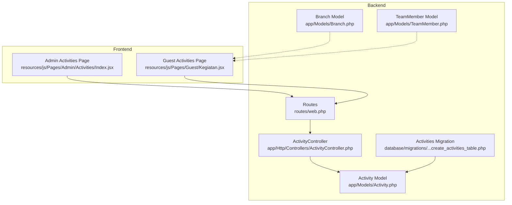
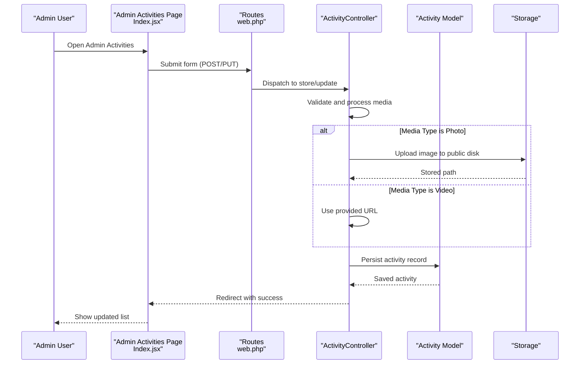
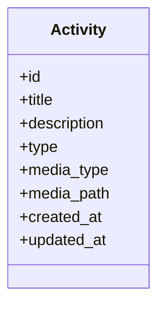
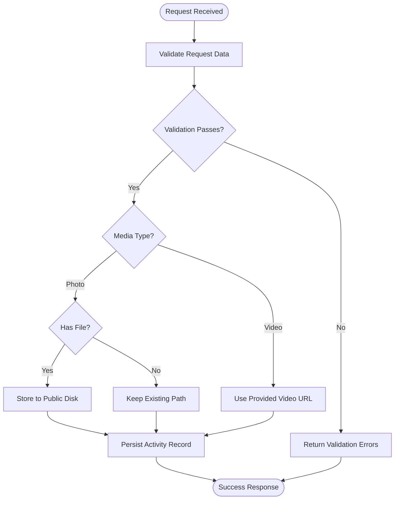
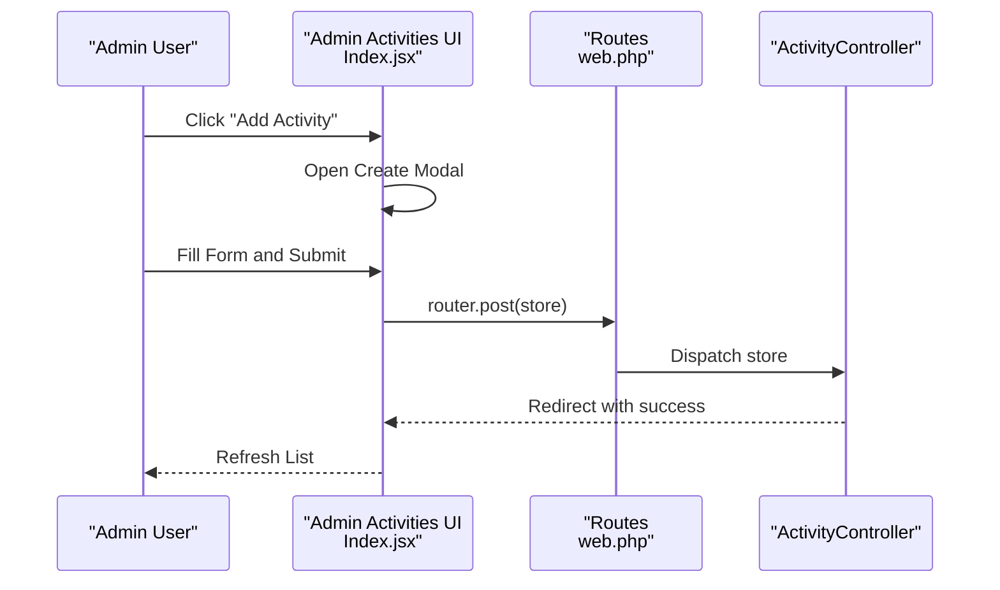
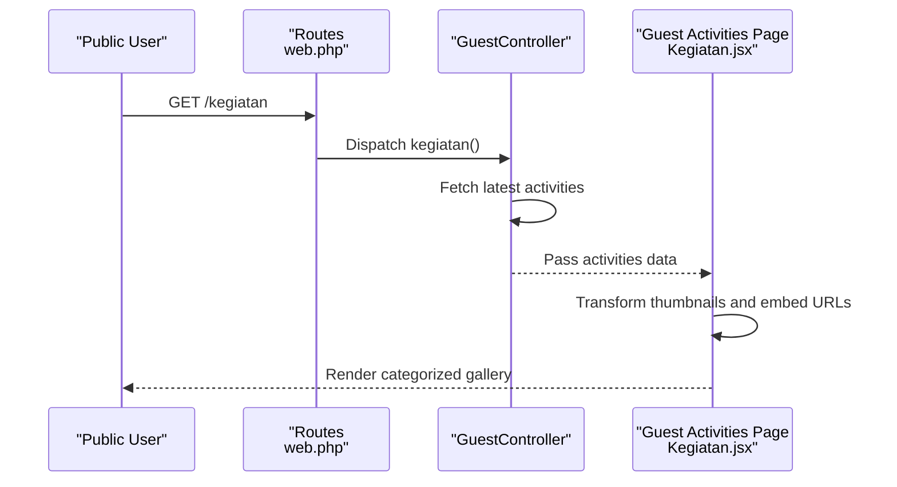
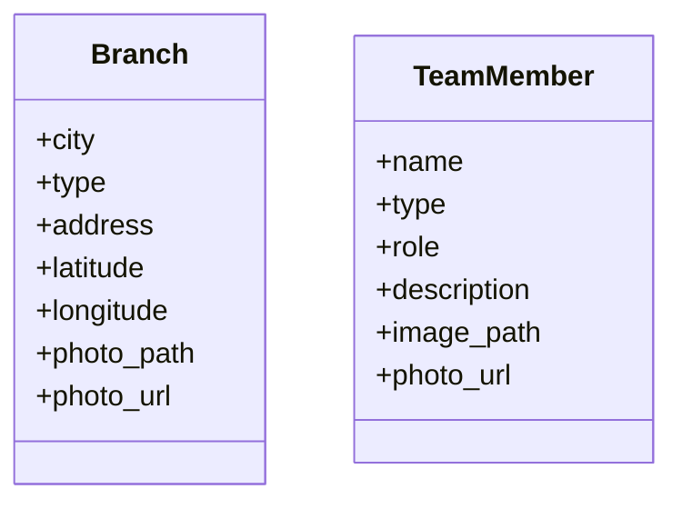
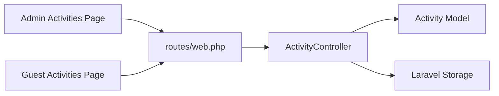

# Activity Model and Event Scheduling

<cite>
**Referenced Files in This Document**
- [Activity.php](file://app/Models/Activity.php)
- [ActivityController.php](file://app/Http/Controllers/ActivityController.php)
- [Branch.php](file://app/Models/Branch.php)
- [TeamMember.php](file://app/Models/TeamMember.php)
- [2026_04_30_045526_create_activities_table.php](file://database/migrations/2026_04_30_045526_create_activities_table.php)
- [web.php](file://routes/web.php)
- [GuestController.php](file://app/Http/Controllers/GuestController.php)
- [Index.jsx](file://resources/js/Pages/Admin/Activities/Index.jsx)
- [Kegiatan.jsx](file://resources/js/Pages/Guest/Kegiatan.jsx)
</cite>

## Table of Contents
1. [Introduction](#introduction)
2. [Project Structure](#project-structure)
3. [Core Components](#core-components)
4. [Architecture Overview](#architecture-overview)
5. [Detailed Component Analysis](#detailed-component-analysis)
6. [Dependency Analysis](#dependency-analysis)
7. [Performance Considerations](#performance-considerations)
8. [Troubleshooting Guide](#troubleshooting-guide)
9. [Conclusion](#conclusion)

## Introduction
This document provides comprehensive documentation for the Activity model and event scheduling system within the Edufa application. It covers activity attributes, relationships with branches and team members, administrative management via the admin panel, guest-facing activity presentation, media handling (photos/videos), and operational workflows such as creation, updates, deletion, and display. The current implementation focuses on activity content management and presentation rather than full event scheduling with dates, locations, or participant registration.

## Project Structure
The activity system spans backend Eloquent models, controllers, migrations, frontend admin components, and guest pages:
- Backend: Activity model and controller manage CRUD operations and media handling.
- Frontend Admin: React-based admin interface for creating, updating, and deleting activities.
- Guest Experience: Public page displaying activities as photo galleries and embedded videos.
- Routing: Admin routes bound to ActivityController; guest route renders activities for public viewing.

**Diagram sources**
- [Activity.php:1-11](file://app/Models/Activity.php#L1-L11)
- [ActivityController.php:1-107](file://app/Http/Controllers/ActivityController.php#L1-L107)
- [Branch.php:1-36](file://app/Models/Branch.php#L1-L36)
- [TeamMember.php:1-24](file://app/Models/TeamMember.php#L1-L24)
- [2026_04_30_045526_create_activities_table.php:1-33](file://database/migrations/2026_04_30_045526_create_activities_table.php#L1-L33)
- [web.php:86-132](file://routes/web.php#L86-L132)
- [Index.jsx:1-353](file://resources/js/Pages/Admin/Activities/Index.jsx#L1-L353)
- [Kegiatan.jsx:1-376](file://resources/js/Pages/Guest/Kegiatan.jsx#L1-L376)

**Section sources**
- [web.php:86-132](file://routes/web.php#L86-L132)
- [Activity.php:1-11](file://app/Models/Activity.php#L1-L11)
- [ActivityController.php:1-107](file://app/Http/Controllers/ActivityController.php#L1-L107)
- [2026_04_30_045526_create_activities_table.php:1-33](file://database/migrations/2026_04_30_045526_create_activities_table.php#L1-L33)
- [Index.jsx:1-353](file://resources/js/Pages/Admin/Activities/Index.jsx#L1-L353)
- [Kegiatan.jsx:1-376](file://resources/js/Pages/Guest/Kegiatan.jsx#L1-L376)

## Core Components
- Activity Model: Defines fillable attributes for title, description, type (terapi/kelas), media type (photo/video), and media path. It serves as the central entity for activity content.
- ActivityController: Handles admin CRUD operations, validates incoming data, manages file uploads for photos, and converts video URLs to embeddable links for display.
- Activities Migration: Creates the activities table with columns for id, title, description, type, media_type, media_path, and timestamps.
- Admin Activities Page: Provides a searchable, sortable table with create/edit/delete actions, media previews, and category filtering.
- Guest Activities Page: Renders activities as a categorized gallery of photos and videos, with modal viewers for expanded content.
- Branch and TeamMember Models: Supply related data for the broader platform (branches for venue context and team members for leadership context), though they are not directly linked to activities in the current schema.

Key implementation references:
- Model fillable attributes and basic structure: [Activity.php](file://app/Models/Activity.php#L9)
- Controller store/update/validation and media handling: [ActivityController.php:25-93](file://app/Http/Controllers/ActivityController.php#L25-L93)
- Activities table schema: [2026_04_30_045526_create_activities_table.php:14-22](file://database/migrations/2026_04_30_045526_create_activities_table.php#L14-L22)
- Admin UI form and submission: [Index.jsx:32-81](file://resources/js/Pages/Admin/Activities/Index.jsx#L32-L81)
- Guest gallery rendering and video embedding: [Kegiatan.jsx:203-376](file://resources/js/Pages/Guest/Kegiatan.jsx#L203-L376)

**Section sources**
- [Activity.php:1-11](file://app/Models/Activity.php#L1-L11)
- [ActivityController.php:25-93](file://app/Http/Controllers/ActivityController.php#L25-L93)
- [2026_04_30_045526_create_activities_table.php:14-22](file://database/migrations/2026_04_30_045526_create_activities_table.php#L14-L22)
- [Index.jsx:32-81](file://resources/js/Pages/Admin/Activities/Index.jsx#L32-L81)
- [Kegiatan.jsx:203-376](file://resources/js/Pages/Guest/Kegiatan.jsx#L203-L376)

## Architecture Overview
The system follows a classic MVC pattern with Inertia.js bridging Laravel backend and React frontend:
- Routes define admin and guest endpoints.
- Controllers fetch and transform data for Inertia-rendered pages.
- Models encapsulate persistence and attribute handling.
- Frontend components manage user interactions and data presentation.

**Diagram sources**
- [web.php:124-132](file://routes/web.php#L124-L132)
- [ActivityController.php:25-93](file://app/Http/Controllers/ActivityController.php#L25-L93)
- [Activity.php:1-11](file://app/Models/Activity.php#L1-L11)
- [Index.jsx:63-81](file://resources/js/Pages/Admin/Activities/Index.jsx#L63-L81)

## Detailed Component Analysis

### Activity Model
- Purpose: Central entity representing activity content with optional media.
- Attributes:
  - title: String, required for admin creation.
  - description: Text, optional.
  - type: Enum with values 'terapi' and 'kelas'.
  - media_type: Enum with values 'photo' and 'video'.
  - media_path: String storing either uploaded file path or external video URL.
- Behavior: Uses Eloquent ORM; fillable attributes configured for secure mass assignment.

**Diagram sources**
- [Activity.php:7-10](file://app/Models/Activity.php#L7-L10)
- [2026_04_30_045526_create_activities_table.php:14-22](file://database/migrations/2026_04_30_045526_create_activities_table.php#L14-L22)

**Section sources**
- [Activity.php:1-11](file://app/Models/Activity.php#L1-L11)
- [2026_04_30_045526_create_activities_table.php:14-22](file://database/migrations/2026_04_30_045526_create_activities_table.php#L14-L22)

### ActivityController
- Responsibilities:
  - Admin CRUD operations for activities.
  - Validation rules ensuring required fields and acceptable media formats.
  - Media handling:
    - Photos: Store uploaded images to the public disk and update stored paths.
    - Videos: Accept YouTube/GDrive URLs and convert to embeddable links on the guest page.
  - Cleanup: Delete associated media when an activity is removed.
- Workflows:
  - Store: Validates input, stores photo if present, otherwise uses video URL, then persists.
  - Update: Conditionally replaces media, preserving existing path if unchanged.
  - Destroy: Removes media file (if photo) and deletes the record.

**Diagram sources**
- [ActivityController.php:27-49](file://app/Http/Controllers/ActivityController.php#L27-L49)

**Section sources**
- [ActivityController.php:25-93](file://app/Http/Controllers/ActivityController.php#L25-L93)

### Admin Activities Management (React)
- Features:
  - Search by title or type.
  - Create/Edit modal with form validation.
  - Media selection between photo and video.
  - Preview of current media during edits.
  - Submission via Inertia with file upload support.
- Actions:
  - Create: Posts to store endpoint.
  - Edit: Prefills form with current values and posts to update endpoint.
  - Delete: Confirms and deletes via route.

**Diagram sources**
- [Index.jsx:42-81](file://resources/js/Pages/Admin/Activities/Index.jsx#L42-L81)
- [web.php:124-132](file://routes/web.php#L124-L132)
- [ActivityController.php:25-52](file://app/Http/Controllers/ActivityController.php#L25-L52)

**Section sources**
- [Index.jsx:22-188](file://resources/js/Pages/Admin/Activities/Index.jsx#L22-L188)
- [web.php:124-132](file://routes/web.php#L124-L132)

### Guest Activities Presentation
- Features:
  - Category tabs for 'Semua', 'Kegiatan di Kelas', and 'Terapi'.
  - Photo gallery with modal preview.
  - Video gallery with embedded players (YouTube/GDrive).
  - Thumbnail generation for videos and photo paths.
- Data Flow:
  - GuestController fetches latest activities.
  - Kegiatan.jsx transforms data for display and handles embed URL extraction.

**Diagram sources**
- [web.php](file://routes/web.php#L71)
- [GuestController.php:39-44](file://app/Http/Controllers/GuestController.php#L39-L44)
- [Kegiatan.jsx:203-376](file://resources/js/Pages/Guest/Kegiatan.jsx#L203-L376)

**Section sources**
- [GuestController.php:39-44](file://app/Http/Controllers/GuestController.php#L39-L44)
- [Kegiatan.jsx:203-376](file://resources/js/Pages/Guest/Kegiatan.jsx#L203-L376)

### Branches and Team Members Context
- Branch Model: Provides city, address, coordinates, and photo handling for venue context.
- TeamMember Model: Provides team member profiles with image handling.
- Current Implementation: These models are not directly linked to activities in the schema. They are used elsewhere in the application (e.g., team member listings, branch network) and could be extended to associate venues or leaders with activities in future iterations.

**Diagram sources**
- [Branch.php:12-21](file://app/Models/Branch.php#L12-L21)
- [TeamMember.php:9-15](file://app/Models/TeamMember.php#L9-L15)

**Section sources**
- [Branch.php:1-36](file://app/Models/Branch.php#L1-L36)
- [TeamMember.php:1-24](file://app/Models/TeamMember.php#L1-L24)

## Dependency Analysis
- Routes bind admin resource endpoints to ActivityController methods.
- ActivityController depends on Activity model and Laravel Storage for media.
- Admin UI depends on Inertia routes and form submission patterns.
- Guest UI depends on GuestController-provided data and client-side transformations.

**Diagram sources**
- [web.php:124-132](file://routes/web.php#L124-L132)
- [ActivityController.php:1-107](file://app/Http/Controllers/ActivityController.php#L1-L107)
- [Activity.php:1-11](file://app/Models/Activity.php#L1-L11)
- [Index.jsx:1-353](file://resources/js/Pages/Admin/Activities/Index.jsx#L1-L353)
- [Kegiatan.jsx:1-376](file://resources/js/Pages/Guest/Kegiatan.jsx#L1-L376)

**Section sources**
- [web.php:124-132](file://routes/web.php#L124-L132)
- [ActivityController.php:1-107](file://app/Http/Controllers/ActivityController.php#L1-L107)

## Performance Considerations
- Media Storage: Photos are stored on the public disk; ensure appropriate disk configuration and consider CDN integration for scalability.
- Image Optimization: Enforce consistent image sizes and formats to reduce load times.
- Pagination: For large datasets, implement pagination in the admin list and guest gallery.
- Embedding: Video embedding relies on external providers; cache embed URLs and thumbnails where feasible.
- Rendering: Virtualize long lists in admin and guest galleries to improve responsiveness.

## Troubleshooting Guide
- Validation Failures:
  - Ensure required fields are present and media type matches expectations.
  - For photos, confirm file MIME types and size limits meet validation rules.
- Media Upload Issues:
  - Verify public disk write permissions and storage configuration.
  - Confirm media path updates on edit and cleanup on delete.
- Guest Display Problems:
  - Validate video URL formats for YouTube/GDrive.
  - Check thumbnail generation fallbacks for missing or invalid media.

**Section sources**
- [ActivityController.php:27-49](file://app/Http/Controllers/ActivityController.php#L27-L49)
- [ActivityController.php:59-90](file://app/Http/Controllers/ActivityController.php#L59-L90)
- [Kegiatan.jsx:210-224](file://resources/js/Pages/Guest/Kegiatan.jsx#L210-L224)

## Conclusion
The current Activity system provides robust content management for activity documentation with integrated media handling and a streamlined admin interface. While it does not yet include date/time scheduling, location assignments, capacity limits, participant registration, or recurring patterns, the foundational model and controller structure can serve as a base for future enhancements. Extending the schema to include scheduling fields, venue relationships, and participant management would enable a complete event lifecycle system aligned with the existing admin and guest experiences.