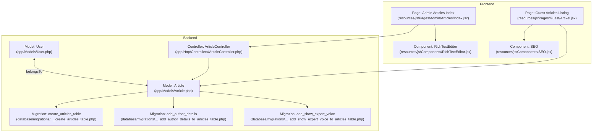
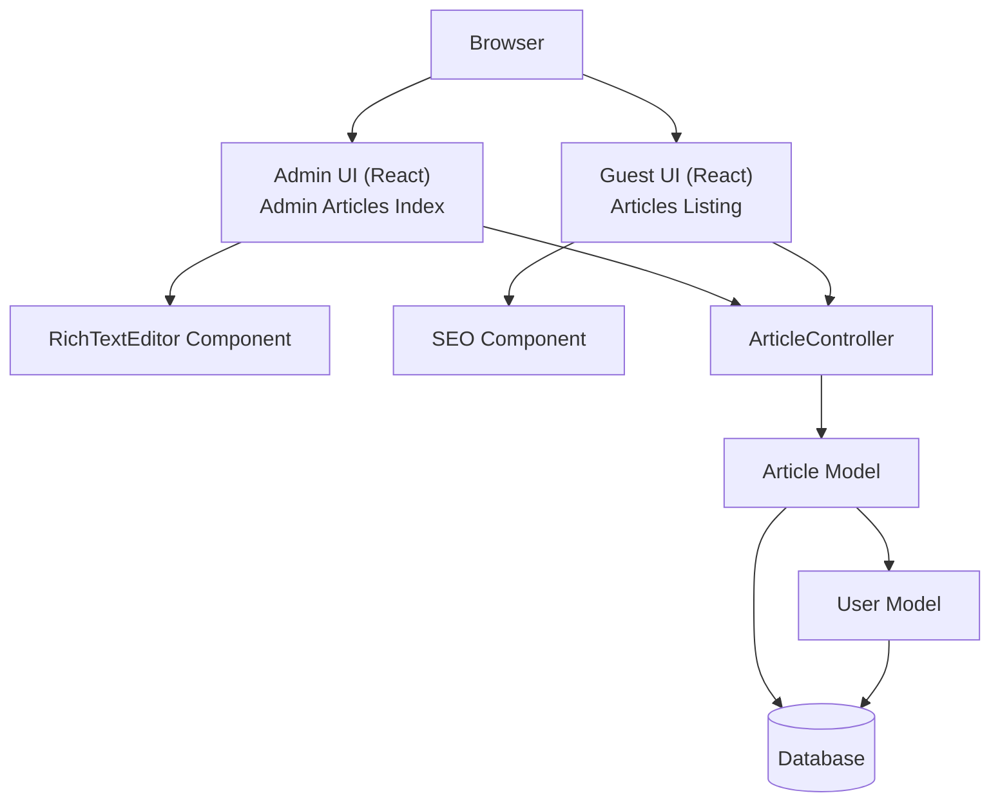
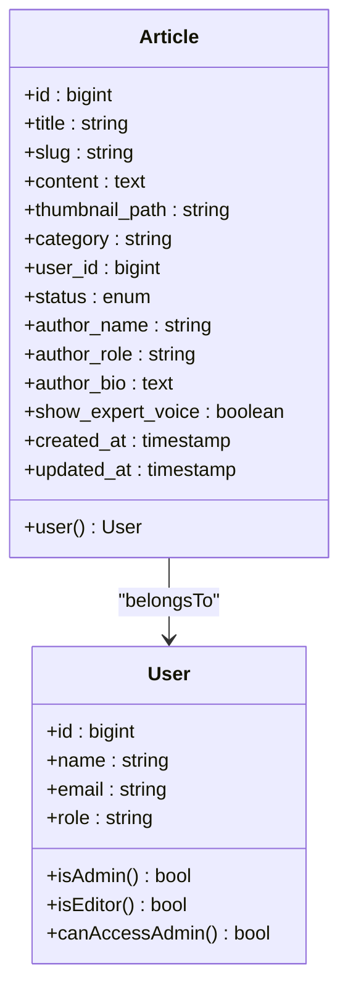
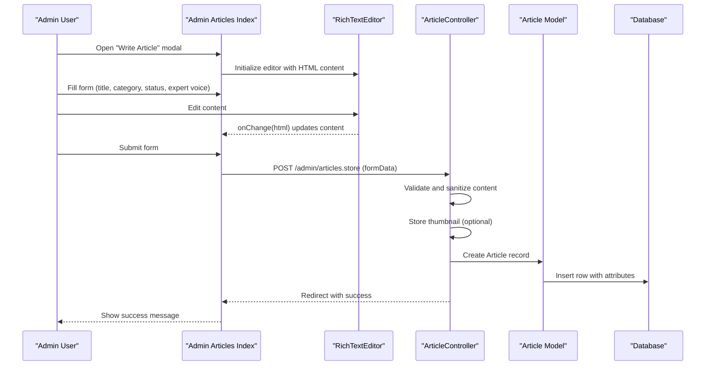
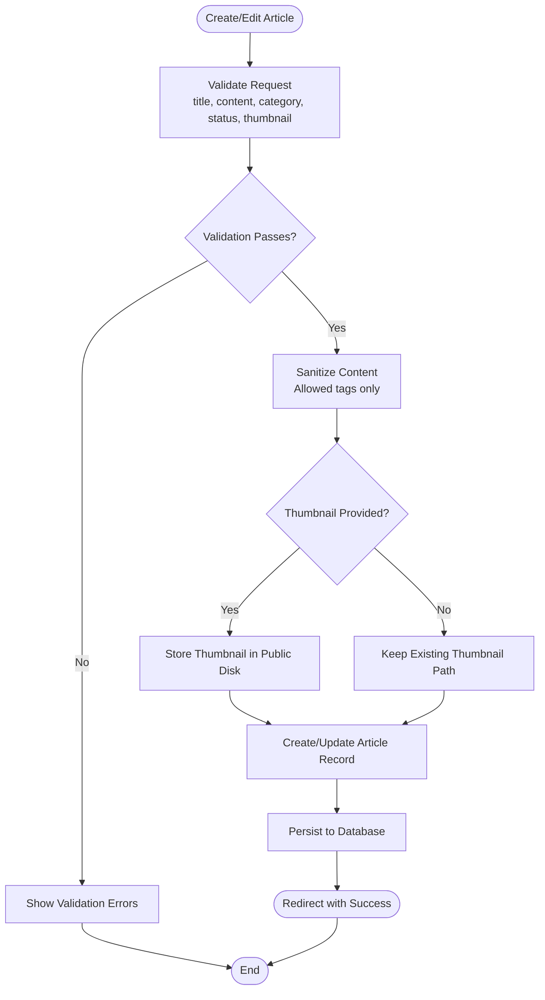
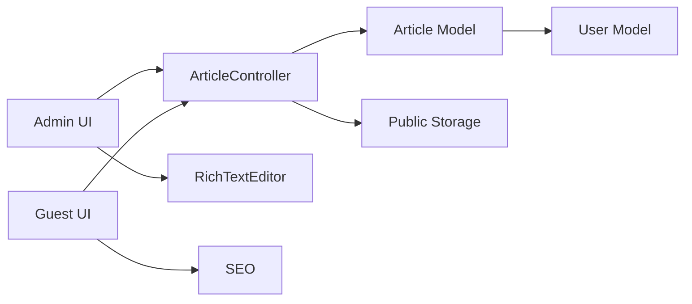

# Article Model and Content Management

<cite>
**Referenced Files in This Document**
- [Article.php](file://app/Models/Article.php)
- [User.php](file://app/Models/User.php)
- [ArticleController.php](file://app/Http/Controllers/ArticleController.php)
- [2026_04_30_050400_create_articles_table.php](file://database/migrations/2026_04_30_050400_create_articles_table.php)
- [2026_04_30_051304_add_author_details_to_articles_table.php](file://database/migrations/2026_04_30_051304_add_author_details_to_articles_table.php)
- [2026_04_30_051535_add_show_expert_voice_to_articles_table.php](file://database/migrations/2026_04_30_051535_add_show_expert_voice_to_articles_table.php)
- [Artikel.jsx](file://resources/js/Pages/Guest/Artikel.jsx)
- [Index.jsx](file://resources/js/Pages/Admin/Articles/Index.jsx)
- [RichTextEditor.jsx](file://resources/js/Components/RichTextEditor.jsx)
- [SEO.jsx](file://resources/js/Components/SEO.jsx)
</cite>

## Table of Contents
1. [Introduction](#introduction)
2. [Project Structure](#project-structure)
3. [Core Components](#core-components)
4. [Architecture Overview](#architecture-overview)
5. [Detailed Component Analysis](#detailed-component-analysis)
6. [Dependency Analysis](#dependency-analysis)
7. [Performance Considerations](#performance-considerations)
8. [Troubleshooting Guide](#troubleshooting-guide)
9. [Conclusion](#conclusion)

## Introduction
This document provides comprehensive documentation for the Article model and content management system. It covers article attributes, relationships with authors (User model), categories, editorial workflows, rich text content handling, media attachment management, SEO optimization, categorization and content discovery, draft management, and administrative interfaces. The goal is to enable both technical and non-technical users to understand how articles are modeled, created, edited, published, and discovered within the platform.

## Project Structure
The content management system spans backend Eloquent models and controllers, frontend React pages and components, and database migrations that define the schema. Key areas include:
- Backend models and controllers for persistence and business logic
- Frontend pages for guest browsing and admin management
- Rich text editor component for content authoring
- SEO component for search engine optimization
- Database migrations defining the articles table and related fields

**Diagram sources**
- [Article.php:1-28](file://app/Models/Article.php#L1-L28)
- [User.php:1-47](file://app/Models/User.php#L1-L47)
- [ArticleController.php:1-122](file://app/Http/Controllers/ArticleController.php#L1-L122)
- [2026_04_30_050400_create_articles_table.php:1-35](file://database/migrations/2026_04_30_050400_create_articles_table.php#L1-L35)
- [2026_04_30_051304_add_author_details_to_articles_table.php:1-31](file://database/migrations/2026_04_30_051304_add_author_details_to_articles_table.php#L1-L31)
- [2026_04_30_051535_add_show_expert_voice_to_articles_table.php:1-29](file://database/migrations/2026_04_30_051535_add_show_expert_voice_to_articles_table.php#L1-L29)
- [Artikel.jsx:1-469](file://resources/js/Pages/Guest/Artikel.jsx#L1-L469)
- [Index.jsx:1-398](file://resources/js/Pages/Admin/Articles/Index.jsx#L1-L398)
- [RichTextEditor.jsx:1-131](file://resources/js/Components/RichTextEditor.jsx#L1-L131)
- [SEO.jsx:1-239](file://resources/js/Components/SEO.jsx#L1-L239)

**Section sources**
- [Article.php:1-28](file://app/Models/Article.php#L1-L28)
- [User.php:1-47](file://app/Models/User.php#L1-L47)
- [ArticleController.php:1-122](file://app/Http/Controllers/ArticleController.php#L1-L122)
- [2026_04_30_050400_create_articles_table.php:1-35](file://database/migrations/2026_04_30_050400_create_articles_table.php#L1-L35)
- [2026_04_30_051304_add_author_details_to_articles_table.php:1-31](file://database/migrations/2026_04_30_051304_add_author_details_to_articles_table.php#L1-L31)
- [2026_04_30_051535_add_show_expert_voice_to_articles_table.php:1-29](file://database/migrations/2026_04_30_051535_add_show_expert_voice_to_articles_table.php#L1-L29)
- [Artikel.jsx:1-469](file://resources/js/Pages/Guest/Artikel.jsx#L1-L469)
- [Index.jsx:1-398](file://resources/js/Pages/Admin/Articles/Index.jsx#L1-L398)
- [RichTextEditor.jsx:1-131](file://resources/js/Components/RichTextEditor.jsx#L1-L131)
- [SEO.jsx:1-239](file://resources/js/Components/SEO.jsx#L1-L239)

## Core Components
This section outlines the primary components involved in article management and their responsibilities.

- Article Model
  - Defines fillable attributes including title, slug, content, thumbnail_path, category, user_id, status, author_name, author_role, author_bio, and show_expert_voice.
  - Establishes a belongsTo relationship with the User model via user_id.
  - Provides the foundation for persistence and retrieval of articles.

- User Model
  - Represents users with role-based permissions.
  - Supports administrative checks (isAdmin, isEditor, canAccessAdmin) used to control access to content management features.

- ArticleController
  - Handles CRUD operations for articles.
  - Validates incoming requests, sanitizes content to prevent XSS, manages thumbnail uploads, and integrates with storage.
  - Supports both creation and updates, including conditional thumbnail replacement and deletion.

- Database Migrations
  - Create the articles table with essential fields and constraints.
  - Add author-related fields and expert voice toggle.
  - Define enums for status and foreign keys for user relationships.

- Frontend Pages and Components
  - Admin Articles Index: Provides a management interface for creating, editing, and deleting articles, including rich text editing and expert voice customization.
  - Guest Articles Listing: Displays articles with filtering, pagination, and SEO metadata.
  - RichTextEditor: A tip-based editor enabling rich text formatting.
  - SEO: Generates structured data and meta tags for improved search visibility.

**Section sources**
- [Article.php:9-26](file://app/Models/Article.php#L9-L26)
- [User.php:32-45](file://app/Models/User.php#L32-L45)
- [ArticleController.php:26-120](file://app/Http/Controllers/ArticleController.php#L26-L120)
- [2026_04_30_050400_create_articles_table.php:14-24](file://database/migrations/2026_04_30_050400_create_articles_table.php#L14-L24)
- [2026_04_30_051304_add_author_details_to_articles_table.php:14-18](file://database/migrations/2026_04_30_051304_add_author_details_to_articles_table.php#L14-L18)
- [2026_04_30_051535_add_show_expert_voice_to_articles_table.php:14-16](file://database/migrations/2026_04_30_051535_add_show_expert_voice_to_articles_table.php#L14-L16)
- [Index.jsx:24-94](file://resources/js/Pages/Admin/Articles/Index.jsx#L24-L94)
- [Artikel.jsx:207-246](file://resources/js/Pages/Guest/Artikel.jsx#L207-L246)
- [RichTextEditor.jsx:101-130](file://resources/js/Components/RichTextEditor.jsx#L101-L130)
- [SEO.jsx:3-26](file://resources/js/Components/SEO.jsx#L3-L26)

## Architecture Overview
The system follows a layered architecture:
- Presentation Layer: React pages and components render content and capture user actions.
- Application Layer: Controllers orchestrate requests, enforce validation, sanitize content, manage uploads, and delegate to models.
- Domain Layer: Eloquent models encapsulate business logic and relationships.
- Data Access Layer: Migrations define the schema and constraints.

**Diagram sources**
- [ArticleController.php:16-120](file://app/Http/Controllers/ArticleController.php#L16-L120)
- [Article.php:23-26](file://app/Models/Article.php#L23-L26)
- [User.php:1-47](file://app/Models/User.php#L1-L47)
- [Index.jsx:292-296](file://resources/js/Pages/Admin/Articles/Index.jsx#L292-L296)
- [Artikel.jsx:243-255](file://resources/js/Pages/Guest/Artikel.jsx#L243-L255)

## Detailed Component Analysis

### Article Model and Attributes
The Article model defines the core attributes and relationships:
- Identifiers and Metadata
  - id: auto-incrementing primary key
  - slug: unique identifier for URLs
  - timestamps: created_at and updated_at
- Content Fields
  - title: string, required
  - content: text, required
  - category: string, nullable
  - thumbnail_path: string, nullable
- Publication and Ownership
  - user_id: foreign key to users
  - status: enum with values 'published' and 'draft', default 'draft'
- Author Attribution
  - author_name: string, nullable
  - author_role: string, nullable
  - author_bio: text, nullable
  - show_expert_voice: boolean, default true

Relationships:
- Article belongs to User via user_id, enabling attribution to the creator.

**Diagram sources**
- [Article.php:9-26](file://app/Models/Article.php#L9-L26)
- [User.php:13-45](file://app/Models/User.php#L13-L45)

**Section sources**
- [Article.php:9-26](file://app/Models/Article.php#L9-L26)
- [2026_04_30_050400_create_articles_table.php:14-24](file://database/migrations/2026_04_30_050400_create_articles_table.php#L14-L24)
- [2026_04_30_051304_add_author_details_to_articles_table.php:14-18](file://database/migrations/2026_04_30_051304_add_author_details_to_articles_table.php#L14-L18)
- [2026_04_30_051535_add_show_expert_voice_to_articles_table.php:14-16](file://database/migrations/2026_04_30_051535_add_show_expert_voice_to_articles_table.php#L14-L16)

### Content Creation and Editing Workflow
The admin interface supports creating and editing articles with rich text content and optional expert voice attribution.

**Diagram sources**
- [Index.jsx:71-88](file://resources/js/Pages/Admin/Articles/Index.jsx#L71-L88)
- [RichTextEditor.jsx:101-130](file://resources/js/Components/RichTextEditor.jsx#L101-L130)
- [ArticleController.php:26-64](file://app/Http/Controllers/ArticleController.php#L26-L64)
- [Article.php:9-21](file://app/Models/Article.php#L9-L21)

**Section sources**
- [Index.jsx:292-296](file://resources/js/Pages/Admin/Articles/Index.jsx#L292-L296)
- [RichTextEditor.jsx:101-130](file://resources/js/Components/RichTextEditor.jsx#L101-L130)
- [ArticleController.php:26-64](file://app/Http/Controllers/ArticleController.php#L26-L64)

### Publishing Pipeline and Status Management
Articles support two publication states: draft and published. The controller enforces validation for status and handles transitions during creation and updates.

**Diagram sources**
- [ArticleController.php:28-61](file://app/Http/Controllers/ArticleController.php#L28-L61)
- [2026_04_30_050400_create_articles_table.php:22-22](file://database/migrations/2026_04_30_050400_create_articles_table.php#L22-L22)

**Section sources**
- [ArticleController.php:28-61](file://app/Http/Controllers/ArticleController.php#L28-L61)
- [2026_04_30_050400_create_articles_table.php:22-22](file://database/migrations/2026_04_30_050400_create_articles_table.php#L22-L22)

### Rich Text Content Handling
The rich text editor leverages TipTap with a starter kit, allowing formatting such as bold, italic, headings, lists, blockquotes, undo/redo, and more. The editor emits HTML content onChange, which is validated and sanitized server-side.

Key capabilities:
- Formatting toolbar with active state indicators
- Content synchronization between props and internal state
- Prose-focused styling classes for consistent rendering

**Section sources**
- [RichTextEditor.jsx:16-99](file://resources/js/Components/RichTextEditor.jsx#L16-L99)
- [RichTextEditor.jsx:101-130](file://resources/js/Components/RichTextEditor.jsx#L101-L130)
- [ArticleController.php:40-42](file://app/Http/Controllers/ArticleController.php#L40-L42)

### Media Attachment Management
Article thumbnails are optional and managed via file uploads:
- Upload validation ensures acceptable formats and size limits
- On update, existing thumbnails are deleted before replacing with new ones
- Storage uses the public disk with a dedicated articles directory

Operational flow:
- Validate thumbnail presence and type
- Store new file and update thumbnail_path
- Delete old file when replacing

**Section sources**
- [ArticleController.php:33-47](file://app/Http/Controllers/ArticleController.php#L33-L47)
- [ArticleController.php:87-93](file://app/Http/Controllers/ArticleController.php#L87-L93)

### SEO Optimization Features
The SEO component generates:
- Primary meta tags (title, description, keywords, robots)
- Open Graph and Twitter meta tags for social sharing
- Structured data (JSON-LD) including Organization, WebSite, BreadcrumbList, and optional Article schema
- Canonical links and hreflang alternates
- Local business schema with contact and opening hours

Frontend integration:
- The guest listing page composes SEO metadata dynamically based on filters and tags

**Section sources**
- [SEO.jsx:3-26](file://resources/js/Components/SEO.jsx#L3-L26)
- [SEO.jsx:140-152](file://resources/js/Components/SEO.jsx#L140-L152)
- [Artikel.jsx:243-255](file://resources/js/Pages/Guest/Artikel.jsx#L243-L255)

### Content Discovery and Filtering
The guest listing page enables:
- Category filtering with counts per category
- Keyword search across titles and excerpts
- Pagination with load-more functionality
- Featured article highlighting for the first result under specific conditions

Frontend logic:
- Computes categories from existing articles
- Filters by category and search term
- Slices results for pagination
- Highlights featured article when appropriate

**Section sources**
- [Artikel.jsx:207-246](file://resources/js/Pages/Guest/Artikel.jsx#L207-L246)
- [Artikel.jsx:214-224](file://resources/js/Pages/Guest/Artikel.jsx#L214-L224)

### Draft Management and Expert Voice
Draft management:
- Articles can be saved as drafts and later published
- Admin interface clearly indicates draft vs published status

Expert voice customization:
- Optional override of author attribution with custom name, role, and bio
- Toggle to show expert voice or default to the system user
- Defaults pre-filled in the admin form for convenience

**Section sources**
- [ArticleController.php:37-37](file://app/Http/Controllers/ArticleController.php#L37-L37)
- [Index.jsx:299-348](file://resources/js/Pages/Admin/Articles/Index.jsx#L299-L348)
- [Artikel.jsx:104-112](file://resources/js/Pages/Guest/Artikel.jsx#L104-L112)

### Administrative Workflows
Administrative capabilities include:
- Listing articles with search and filter
- Creating new articles with rich text editor and expert voice options
- Editing existing articles with thumbnail replacement
- Deleting articles with associated media cleanup
- Previewing articles via external links

UI highlights:
- Status badges for quick identification
- Action buttons for preview, edit, and delete
- Form validation feedback and loading states

**Section sources**
- [Index.jsx:24-94](file://resources/js/Pages/Admin/Articles/Index.jsx#L24-L94)
- [ArticleController.php:113-120](file://app/Http/Controllers/ArticleController.php#L113-L120)

## Dependency Analysis
The system exhibits clear separation of concerns with explicit dependencies:
- Controllers depend on models and storage
- Models depend on database schema and relationships
- Frontend pages depend on components and routing
- Components depend on third-party libraries (TipTap)

**Diagram sources**
- [ArticleController.php:1-122](file://app/Http/Controllers/ArticleController.php#L1-L122)
- [Article.php:1-28](file://app/Models/Article.php#L1-L28)
- [User.php:1-47](file://app/Models/User.php#L1-L47)
- [Index.jsx:1-398](file://resources/js/Pages/Admin/Articles/Index.jsx#L1-L398)
- [Artikel.jsx:1-469](file://resources/js/Pages/Guest/Artikel.jsx#L1-L469)
- [RichTextEditor.jsx:1-131](file://resources/js/Components/RichTextEditor.jsx#L1-L131)
- [SEO.jsx:1-239](file://resources/js/Components/SEO.jsx#L1-L239)

**Section sources**
- [ArticleController.php:1-122](file://app/Http/Controllers/ArticleController.php#L1-L122)
- [Article.php:1-28](file://app/Models/Article.php#L1-L28)
- [User.php:1-47](file://app/Models/User.php#L1-L47)
- [Index.jsx:1-398](file://resources/js/Pages/Admin/Articles/Index.jsx#L1-L398)
- [Artikel.jsx:1-469](file://resources/js/Pages/Guest/Artikel.jsx#L1-L469)
- [RichTextEditor.jsx:1-131](file://resources/js/Components/RichTextEditor.jsx#L1-L131)
- [SEO.jsx:1-239](file://resources/js/Components/SEO.jsx#L1-L239)

## Performance Considerations
- Database indexing: The slug field is unique, ensuring efficient lookups by URL identifier.
- Lazy loading and pagination: Guest listing uses pagination to limit DOM and network payload.
- Thumbnail storage: Public disk storage with size limits prevents excessive memory usage.
- Content sanitization: Allowed tags list reduces XSS risk and keeps stored content minimal.
- Frontend memoization: Filtering and pagination computations are optimized with useMemo and slicing.

[No sources needed since this section provides general guidance]

## Troubleshooting Guide
Common issues and resolutions:
- Validation errors on submission
  - Ensure title length, content presence, and status enum values meet validation rules.
  - Check thumbnail format and size constraints.
  - Reference: [ArticleController.php:28-38](file://app/Http/Controllers/ArticleController.php#L28-L38)

- Rich text content not saving properly
  - Verify the editor's onChange handler updates the form state.
  - Confirm server-side sanitization aligns with expected allowed tags.
  - Reference: [RichTextEditor.jsx:107-109](file://resources/js/Components/RichTextEditor.jsx#L107-L109), [ArticleController.php:40-42](file://app/Http/Controllers/ArticleController.php#L40-L42)

- Thumbnail replacement failures
  - Confirm file upload validation passes and storage path is writable.
  - Ensure old thumbnail deletion occurs before storing new file.
  - Reference: [ArticleController.php:87-93](file://app/Http/Controllers/ArticleController.php#L87-L93)

- SEO metadata inconsistencies
  - Validate dynamic title, description, and breadcrumbs generation.
  - Confirm canonical and alternate links are absolute URLs.
  - Reference: [SEO.jsx:17-26](file://resources/js/Components/SEO.jsx#L17-L26), [SEO.jsx:223-229](file://resources/js/Components/SEO.jsx#L223-L229)

**Section sources**
- [ArticleController.php:28-38](file://app/Http/Controllers/ArticleController.php#L28-L38)
- [ArticleController.php:40-42](file://app/Http/Controllers/ArticleController.php#L40-L42)
- [ArticleController.php:87-93](file://app/Http/Controllers/ArticleController.php#L87-L93)
- [SEO.jsx:17-26](file://resources/js/Components/SEO.jsx#L17-L26)
- [SEO.jsx:223-229](file://resources/js/Components/SEO.jsx#L223-L229)

## Conclusion
The Article model and content management system provide a robust foundation for creating, managing, and discovering educational content. With rich text editing, expert voice customization, SEO optimization, and administrative controls, the platform supports both creators and consumers of content effectively. The modular architecture and clear data flows facilitate maintainability and future enhancements.

[No sources needed since this section summarizes without analyzing specific files]