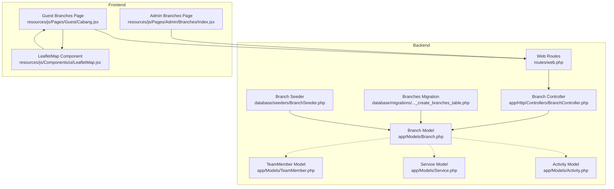
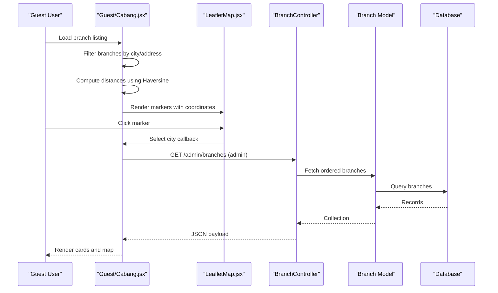
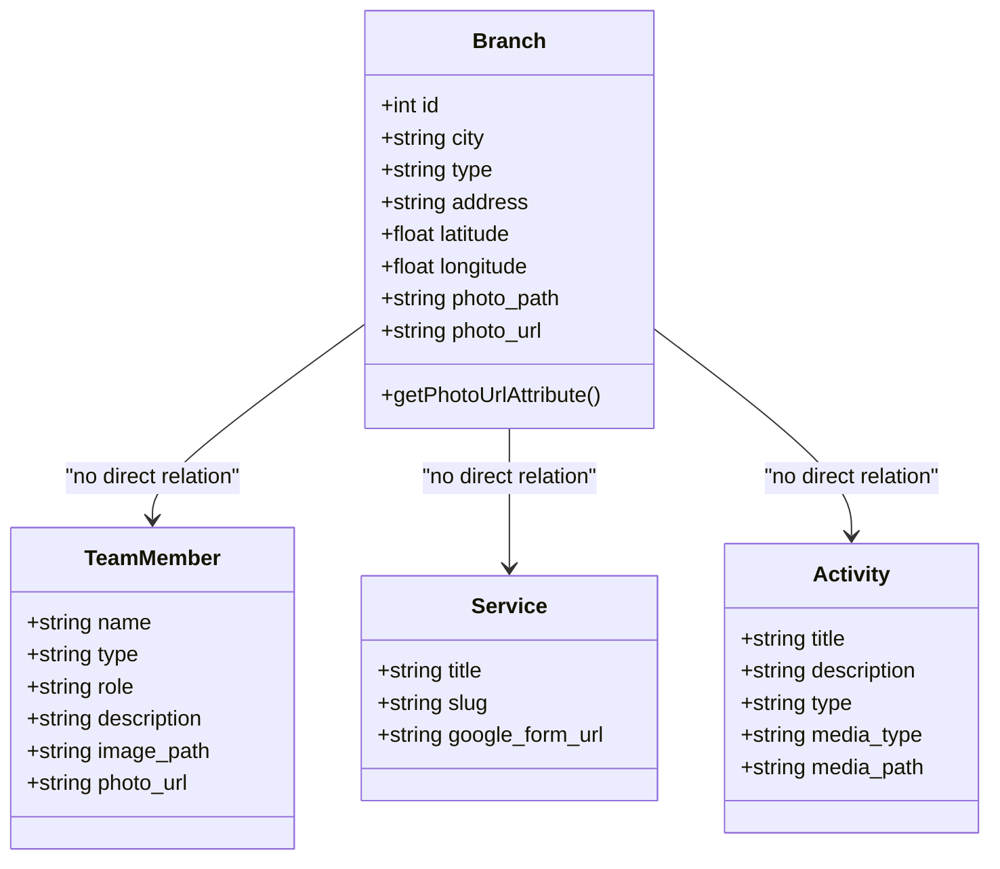
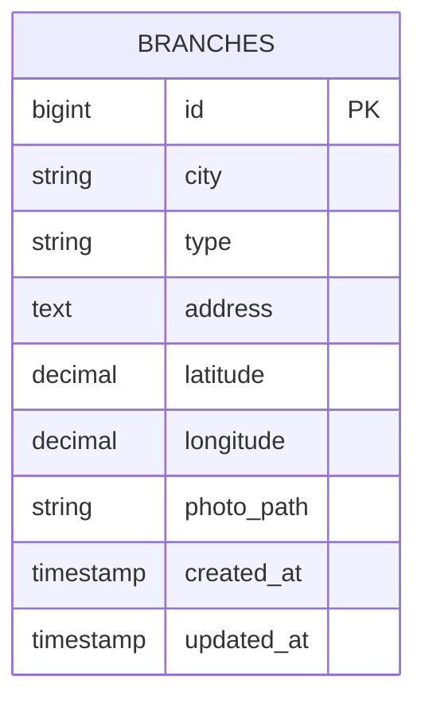
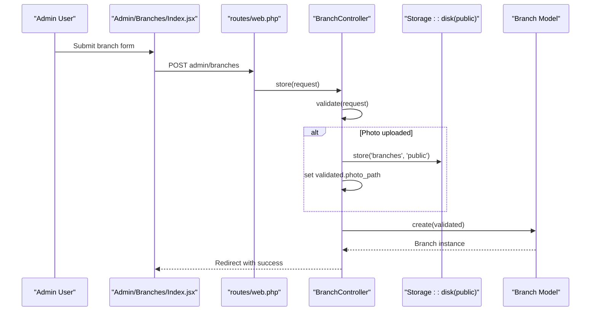
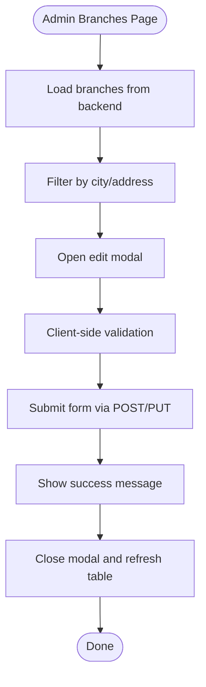
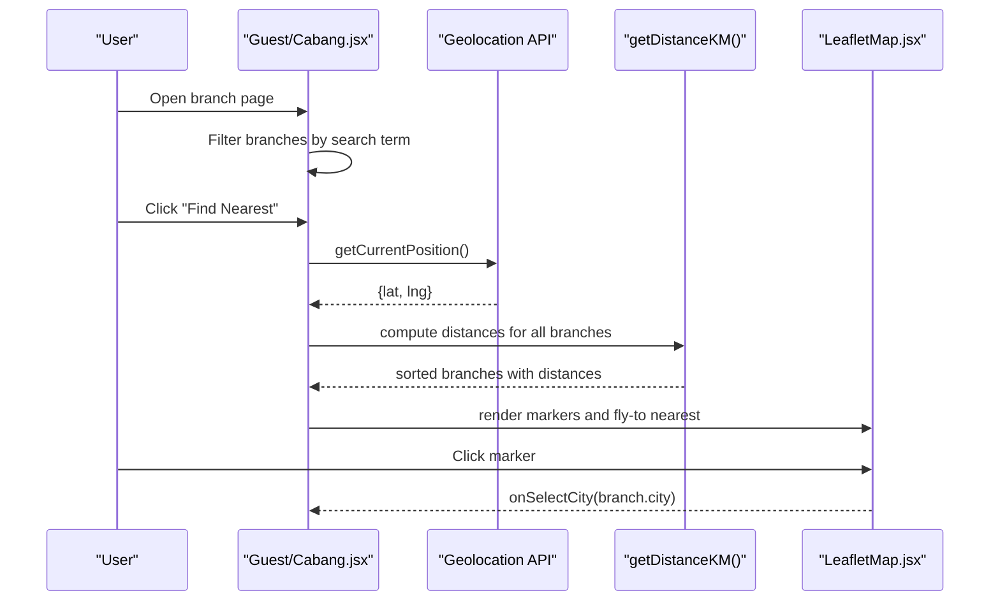
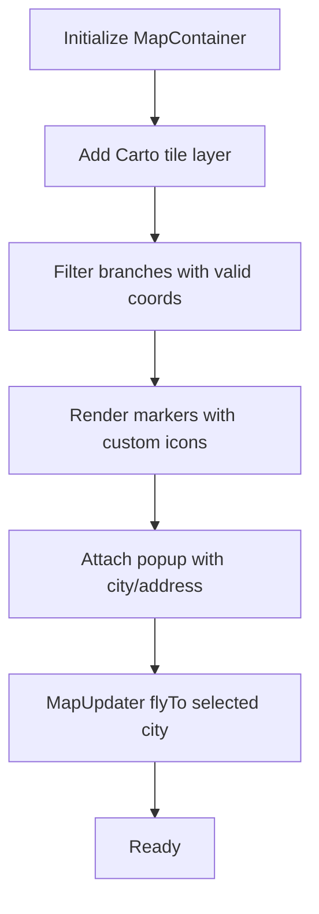
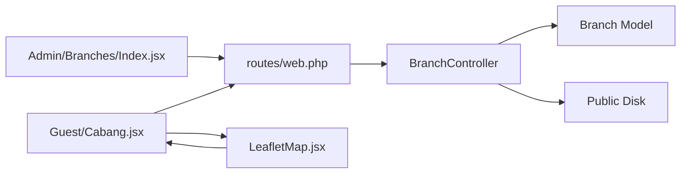

# Branch Model and Location Management

<cite>
**Referenced Files in This Document**
- [Branch.php](file://app/Models/Branch.php)
- [2026_04_20_133158_create_branches_table.php](file://database/migrations/2026_04_20_133158_create_branches_table.php)
- [BranchController.php](file://app/Http/Controllers/BranchController.php)
- [Index.jsx](file://resources/js/Pages/Admin/Branches/Index.jsx)
- [Cabang.jsx](file://resources/js/Pages/Guest/Cabang.jsx)
- [LeafletMap.jsx](file://resources/js/Components/ui/LeafletMap.jsx)
- [BranchSeeder.php](file://database/seeders/BranchSeeder.php)
- [web.php](file://routes/web.php)
- [TeamMember.php](file://app/Models/TeamMember.php)
- [Service.php](file://app/Models/Service.php)
- [Activity.php](file://app/Models/Activity.php)
</cite>

## Table of Contents
1. [Introduction](#introduction)
2. [Project Structure](#project-structure)
3. [Core Components](#core-components)
4. [Architecture Overview](#architecture-overview)
5. [Detailed Component Analysis](#detailed-component-analysis)
6. [Dependency Analysis](#dependency-analysis)
7. [Performance Considerations](#performance-considerations)
8. [Troubleshooting Guide](#troubleshooting-guide)
9. [Conclusion](#conclusion)

## Introduction
This document provides comprehensive documentation for the Branch model and geographic location management system. It covers branch attributes, geographic data handling, coordinate systems, location-based queries, validation rules, image upload handling, and location verification processes. It also explains relationships with team members, services, and activity scheduling, along with practical examples for branch listing, location filtering, distance calculations, and branch-specific content management.

## Project Structure
The Branch system spans backend Eloquent models, database migrations, controller actions, frontend admin and guest pages, and reusable UI components for map visualization.

**Diagram sources**
- [Branch.php:1-36](file://app/Models/Branch.php#L1-L36)
- [2026_04_20_133158_create_branches_table.php:1-34](file://database/migrations/2026_04_20_133158_create_branches_table.php#L1-L34)
- [BranchController.php:1-88](file://app/Http/Controllers/BranchController.php#L1-L88)
- [Index.jsx:1-340](file://resources/js/Pages/Admin/Branches/Index.jsx#L1-L340)
- [Cabang.jsx:1-393](file://resources/js/Pages/Guest/Cabang.jsx#L1-L393)
- [LeafletMap.jsx:1-78](file://resources/js/Components/ui/LeafletMap.jsx#L1-L78)
- [BranchSeeder.php:1-67](file://database/seeders/BranchSeeder.php#L1-L67)
- [web.php:1-155](file://routes/web.php#L1-L155)
- [TeamMember.php:1-24](file://app/Models/TeamMember.php#L1-L24)
- [Service.php:1-15](file://app/Models/Service.php#L1-L15)
- [Activity.php:1-11](file://app/Models/Activity.php#L1-L11)

**Section sources**
- [Branch.php:1-36](file://app/Models/Branch.php#L1-L36)
- [2026_04_20_133158_create_branches_table.php:1-34](file://database/migrations/2026_04_20_133158_create_branches_table.php#L1-L34)
- [BranchController.php:1-88](file://app/Http/Controllers/BranchController.php#L1-L88)
- [Index.jsx:1-340](file://resources/js/Pages/Admin/Branches/Index.jsx#L1-L340)
- [Cabang.jsx:1-393](file://resources/js/Pages/Guest/Cabang.jsx#L1-L393)
- [LeafletMap.jsx:1-78](file://resources/js/Components/ui/LeafletMap.jsx#L1-L78)
- [BranchSeeder.php:1-67](file://database/seeders/BranchSeeder.php#L1-L67)
- [web.php:1-155](file://routes/web.php#L1-L155)
- [TeamMember.php:1-24](file://app/Models/TeamMember.php#L1-L24)
- [Service.php:1-15](file://app/Models/Service.php#L1-L15)
- [Activity.php:1-11](file://app/Models/Activity.php#L1-L11)

## Core Components
- Branch Model: Defines fillable attributes, computed photo URL, and geographic fields (latitude/longitude).
- Branches Database Migration: Creates the branches table with city, type, address, coordinates, and optional photo path.
- Branch Controller: Handles listing, creation, updates, and deletion with validation and image storage.
- Admin Branches Page: Provides CRUD interface with search, form validation, and modal-based editing.
- Guest Branches Page: Displays branches with map visualization, search, and nearest-branch calculation using Haversine formula.
- LeafletMap Component: Renders interactive map markers with custom icons and fly-to behavior.
- Branch Seeder: Seeds realistic branch data with coordinates for demonstration and testing.
- Routes: Exposes admin resource endpoints for branches and guest endpoint for branch listing.

Key branch attributes:
- city: string, required
- type: string, nullable
- address: text, required
- latitude: decimal (10,8), nullable
- longitude: decimal (11,8), nullable
- photo_path: string, nullable

Computed attribute:
- photo_url: resolves to either external URL or Laravel asset path

Validation rules:
- city: required, string, max 255
- type: nullable, string, max 255
- address: required, string
- latitude: nullable, numeric
- longitude: nullable, numeric
- photo: nullable, image, mime types jpeg,png,jpg,webp, max 2048KB

Image handling:
- Stores uploads under public disk in branches folder
- Deletes previous image on update unless stored as external URL
- Resolves photo_url via model accessor

**Section sources**
- [Branch.php:12-34](file://app/Models/Branch.php#L12-L34)
- [2026_04_20_133158_create_branches_table.php:14-22](file://database/migrations/2026_04_20_133158_create_branches_table.php#L14-L22)
- [BranchController.php:29-67](file://app/Http/Controllers/BranchController.php#L29-L67)
- [Index.jsx:30-39](file://resources/js/Pages/Admin/Branches/Index.jsx#L30-L39)
- [Cabang.jsx:33-44](file://resources/js/Pages/Guest/Cabang.jsx#L33-L44)
- [LeafletMap.jsx:6-17](file://resources/js/Components/ui/LeafletMap.jsx#L6-L17)
- [BranchSeeder.php:17-53](file://database/seeders/BranchSeeder.php#L17-L53)
- [web.php:104-112](file://routes/web.php#L104-L112)

## Architecture Overview
The Branch system follows a layered architecture:
- Presentation Layer: Admin page for CRUD and Guest page for discovery
- Controller Layer: BranchController orchestrates requests, validation, persistence, and file operations
- Domain Layer: Branch model encapsulates business logic and computed attributes
- Persistence Layer: Eloquent ORM with database migration schema
- Frontend UI: Reusable LeafletMap component for geographic visualization

**Diagram sources**
- [Cabang.jsx:46-95](file://resources/js/Pages/Guest/Cabang.jsx#L46-L95)
- [LeafletMap.jsx:36-77](file://resources/js/Components/ui/LeafletMap.jsx#L36-L77)
- [BranchController.php:17-22](file://app/Http/Controllers/BranchController.php#L17-L22)
- [Branch.php:8-34](file://app/Models/Branch.php#L8-L34)

## Detailed Component Analysis

### Branch Model
The Branch model defines the domain entity for geographic locations with computed photo resolution and minimal relationships to other entities.

**Diagram sources**
- [Branch.php:8-34](file://app/Models/Branch.php#L8-L34)
- [TeamMember.php:7-23](file://app/Models/TeamMember.php#L7-L23)
- [Service.php:7-14](file://app/Models/Service.php#L7-L14)
- [Activity.php:7-10](file://app/Models/Activity.php#L7-L10)

**Section sources**
- [Branch.php:12-34](file://app/Models/Branch.php#L12-L34)

### Branches Database Migration
Defines the schema for storing branch records with appropriate precision for geographic coordinates.

**Diagram sources**
- [2026_04_20_133158_create_branches_table.php:14-22](file://database/migrations/2026_04_20_133158_create_branches_table.php#L14-L22)

**Section sources**
- [2026_04_20_133158_create_branches_table.php:12-23](file://database/migrations/2026_04_20_133158_create_branches_table.php#L12-L23)

### Branch Controller
Handles branch lifecycle operations with validation, image storage, and cleanup.

**Diagram sources**
- [BranchController.php:27-45](file://app/Http/Controllers/BranchController.php#L27-L45)
- [Index.jsx:62-81](file://resources/js/Pages/Admin/Branches/Index.jsx#L62-L81)
- [web.php:104-112](file://routes/web.php#L104-L112)

**Section sources**
- [BranchController.php:27-72](file://app/Http/Controllers/BranchController.php#L27-L72)

### Admin Branches Page
Provides a searchable, sortable table with create/edit modals and image preview.

**Diagram sources**
- [Index.jsx:20-87](file://resources/js/Pages/Admin/Branches/Index.jsx#L20-L87)

**Section sources**
- [Index.jsx:20-87](file://resources/js/Pages/Admin/Branches/Index.jsx#L20-L87)

### Guest Branches Page and Distance Calculation
Implements location-based discovery with geolocation and Haversine distance computation.

**Diagram sources**
- [Cabang.jsx:60-95](file://resources/js/Pages/Guest/Cabang.jsx#L60-L95)
- [Cabang.jsx:33-44](file://resources/js/Pages/Guest/Cabang.jsx#L33-L44)
- [LeafletMap.jsx:36-77](file://resources/js/Components/ui/LeafletMap.jsx#L36-L77)

**Section sources**
- [Cabang.jsx:46-95](file://resources/js/Pages/Guest/Cabang.jsx#L46-L95)

### LeafletMap Component
Renders an interactive map with custom markers and fly-to behavior.

**Diagram sources**
- [LeafletMap.jsx:36-77](file://resources/js/Components/ui/LeafletMap.jsx#L36-L77)

**Section sources**
- [LeafletMap.jsx:19-77](file://resources/js/Components/ui/LeafletMap.jsx#L19-L77)

### Branch Seeder
Seeds realistic branch data with coordinates for demonstration.

**Section sources**
- [BranchSeeder.php:15-65](file://database/seeders/BranchSeeder.php#L15-L65)

## Dependency Analysis
- Routes define admin resource endpoints for branches and guest endpoint for branch listing.
- BranchController depends on Branch model, request validation, and storage.
- Admin page depends on BranchController endpoints and Inertia rendering.
- Guest page depends on BranchController for listing and LeafletMap for visualization.
- LeafletMap depends on react-leaflet and consumes branch coordinates.

**Diagram sources**
- [web.php:104-112](file://routes/web.php#L104-L112)
- [BranchController.php:1-88](file://app/Http/Controllers/BranchController.php#L1-L88)
- [Index.jsx:1-340](file://resources/js/Pages/Admin/Branches/Index.jsx#L1-L340)
- [Cabang.jsx:1-393](file://resources/js/Pages/Guest/Cabang.jsx#L1-L393)
- [LeafletMap.jsx:1-78](file://resources/js/Components/ui/LeafletMap.jsx#L1-L78)

**Section sources**
- [web.php:104-112](file://routes/web.php#L104-L112)
- [BranchController.php:1-88](file://app/Http/Controllers/BranchController.php#L1-L88)

## Performance Considerations
- Coordinate storage precision: latitude (10,8) and longitude (11,8) provide sufficient accuracy for branch-level positioning.
- Image size limit: 2MB ensures manageable assets; consider CDN for production.
- Frontend filtering: Client-side filter reduces server load but may need pagination for large datasets.
- Distance computation: Haversine calculation per request; consider caching or server-side sorting for frequent nearest queries.
- Map rendering: Only markers with valid coordinates are rendered to minimize DOM overhead.

## Troubleshooting Guide
Common issues and resolutions:
- Invalid coordinates: Ensure latitude/longitude are numeric and within valid ranges; validation accepts nullable numeric values.
- Image upload failures: Verify file MIME type and size limits; confirm public disk write permissions.
- External URLs vs local storage: photo_url resolves external URLs directly; local images use Laravel asset path.
- Geolocation errors: Handle browser support and permission prompts gracefully; display user-friendly messages.
- Map markers missing: Coordinates must be present; the map filters out entries without valid latitude/longitude.

**Section sources**
- [BranchController.php:33-36](file://app/Http/Controllers/BranchController.php#L33-L36)
- [BranchController.php:61-67](file://app/Http/Controllers/BranchController.php#L61-L67)
- [Cabang.jsx:63-94](file://resources/js/Pages/Guest/Cabang.jsx#L63-L94)
- [LeafletMap.jsx:55-71](file://resources/js/Components/ui/LeafletMap.jsx#L55-L71)

## Conclusion
The Branch model and geographic location management system integrates backend validation, image handling, and frontend visualization to deliver a robust solution for branch administration and discovery. The system supports branch listing, filtering, distance calculations, and map-based navigation, with clear separation of concerns and extensible architecture for future enhancements such as capacity management and resource allocation.