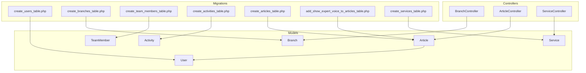
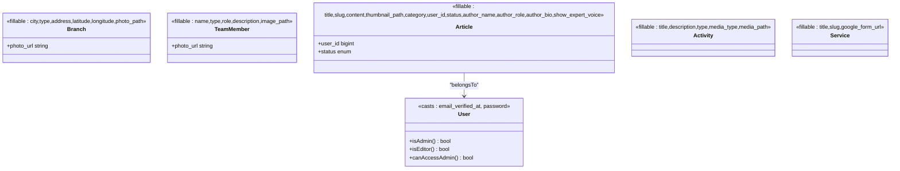

# Core Entities and Relationships

<cite>
**Referenced Files in This Document**
- [User.php](file://app/Models/User.php)
- [Branch.php](file://app/Models/Branch.php)
- [TeamMember.php](file://app/Models/TeamMember.php)
- [Article.php](file://app/Models/Article.php)
- [Activity.php](file://app/Models/Activity.php)
- [Service.php](file://app/Models/Service.php)
- [create_users_table.php](file://database/migrations/0001_01_01_000000_create_users_table.php)
- [create_branches_table.php](file://database/migrations/2026_04_20_133158_create_branches_table.php)
- [create_team_members_table.php](file://database/migrations/2026_04_25_153659_create_team_members_table.php)
- [create_activities_table.php](file://database/migrations/2026_04_30_045526_create_activities_table.php)
- [create_articles_table.php](file://database/migrations/2026_04_30_050400_create_articles_table.php)
- [add_author_details_to_articles_table.php](file://database/migrations/2026_04_30_051304_add_author_details_to_articles_table.php)
- [add_show_expert_voice_to_articles_table.php](file://database/migrations/2026_04_30_051535_add_show_expert_voice_to_articles_table.php)
- [create_services_table.php](file://database/migrations/2026_04_30_055559_create_services_table.php)
- [BranchController.php](file://app/Http/Controllers/BranchController.php)
- [ArticleController.php](file://app/Http/Controllers/ArticleController.php)
- [ServiceController.php](file://app/Http/Controllers/ServiceController.php)
</cite>

## Table of Contents
1. [Introduction](#introduction)
2. [Project Structure](#project-structure)
3. [Core Components](#core-components)
4. [Architecture Overview](#architecture-overview)
5. [Detailed Component Analysis](#detailed-component-analysis)
6. [Dependency Analysis](#dependency-analysis)
7. [Performance Considerations](#performance-considerations)
8. [Troubleshooting Guide](#troubleshooting-guide)
9. [Conclusion](#conclusion)

## Introduction
This document describes EDUfa’s core data entities and their business relationships. It covers the purpose, attributes, validation rules, accessors/mutators, and business logic for:
- User roles and permissions
- Branch location management
- TeamMember profiles
- Article content management
- Activity scheduling
- Service offerings

It also explains foreign key associations, cascading behaviors, referential integrity constraints, and common query patterns.

## Project Structure
The application follows a Laravel Eloquent model-centric design with dedicated controllers for administrative CRUD operations. Models define fillable attributes, accessors, and relationships. Migrations define the relational schema and constraints.



**Diagram sources**
- [User.php:13-46](file://app/Models/User.php#L13-L46)
- [Branch.php:12-35](file://app/Models/Branch.php#L12-L35)
- [TeamMember.php:9-23](file://app/Models/TeamMember.php#L9-L23)
- [Article.php:9-26](file://app/Models/Article.php#L9-L26)
- [Activity.php:9-10](file://app/Models/Activity.php#L9-L10)
- [Service.php:9-14](file://app/Models/Service.php#L9-L14)
- [BranchController.php:17-45](file://app/Http/Controllers/BranchController.php#L17-L45)
- [ArticleController.php:26-64](file://app/Http/Controllers/ArticleController.php#L26-L64)
- [ServiceController.php:11-29](file://app/Http/Controllers/ServiceController.php#L11-L29)
- [create_users_table.php:16-25](file://database/migrations/0001_01_01_000000_create_users_table.php#L16-L25)
- [create_branches_table.php:14-22](file://database/migrations/2026_04_20_133158_create_branches_table.php#L14-L22)
- [create_team_members_table.php:14-21](file://database/migrations/2026_04_25_153659_create_team_members_table.php#L14-L21)
- [create_activities_table.php:14-21](file://database/migrations/2026_04_30_045526_create_activities_table.php#L14-L21)
- [create_articles_table.php:14-23](file://database/migrations/2026_04_30_050400_create_articles_table.php#L14-L23)
- [add_show_expert_voice_to_articles_table.php:14-15](file://database/migrations/2026_04_30_051535_add_show_expert_voice_to_articles_table.php#L14-L15)
- [create_services_table.php:14-19](file://database/migrations/2026_04_30_055559_create_services_table.php#L14-L19)

**Section sources**
- [User.php:13-46](file://app/Models/User.php#L13-L46)
- [Branch.php:12-35](file://app/Models/Branch.php#L12-L35)
- [TeamMember.php:9-23](file://app/Models/TeamMember.php#L9-L23)
- [Article.php:9-26](file://app/Models/Article.php#L9-L26)
- [Activity.php:9-10](file://app/Models/Activity.php#L9-L10)
- [Service.php:9-14](file://app/Models/Service.php#L9-L14)
- [create_users_table.php:16-25](file://database/migrations/0001_01_01_000000_create_users_table.php#L16-L25)
- [create_branches_table.php:14-22](file://database/migrations/2026_04_20_133158_create_branches_table.php#L14-L22)
- [create_team_members_table.php:14-21](file://database/migrations/2026_04_25_153659_create_team_members_table.php#L14-L21)
- [create_activities_table.php:14-21](file://database/migrations/2026_04_30_045526_create_activities_table.php#L14-L21)
- [create_articles_table.php:14-23](file://database/migrations/2026_04_30_050400_create_articles_table.php#L14-L23)
- [add_show_expert_voice_to_articles_table.php:14-15](file://database/migrations/2026_04_30_051535_add_show_expert_voice_to_articles_table.php#L14-L15)
- [create_services_table.php:14-19](file://database/migrations/2026_04_30_055559_create_services_table.php#L14-L19)

## Core Components
This section summarizes each entity’s purpose, attributes, validation rules, and accessors/mutators.

- User
  - Purpose: Authentication and authorization backbone. Roles include admin and editor. Provides helper methods to check roles and admin access eligibility.
  - Attributes: name, email, email_verified_at, password, role, remember_token.
  - Accessors/Mutators: email_verified_at and password are cast to datetime and hashed respectively.
  - Business logic: Role checks via isAdmin(), isEditor(), and canAccessAdmin().
  - Validation: N/A (handled by auth requests and middleware).
  - Section sources
    - [User.php:13-46](file://app/Models/User.php#L13-L46)
    - [create_users_table.php:16-25](file://database/migrations/0001_01_01_000000_create_users_table.php#L16-L25)

- Branch
  - Purpose: Manage branch locations with city, type, address, and geolocation.
  - Attributes: city, type, address, latitude, longitude, photo_path.
  - Accessors: photo_url computed attribute resolves absolute URLs for stored photos.
  - Business logic: Photo handling via controller validation and storage lifecycle.
  - Validation: Controlled by BranchController rules for city, type, address, coordinates, and image upload.
  - Section sources
    - [Branch.php:12-35](file://app/Models/Branch.php#L12-L35)
    - [create_branches_table.php:14-22](file://database/migrations/2026_04_20_133158_create_branches_table.php#L14-L22)
    - [BranchController.php:29-44](file://app/Http/Controllers/BranchController.php#L29-L44)

- TeamMember
  - Purpose: Represent team members (e.g., therapists/staff) with profile details and optional image.
  - Attributes: name, type, role, description, image_path.
  - Accessors: photo_url computed attribute resolves absolute URLs for stored images.
  - Business logic: Image storage handled by controller validations.
  - Section sources
    - [TeamMember.php:9-23](file://app/Models/TeamMember.php#L9-L23)

- Article
  - Purpose: Content management for articles with author metadata and expert voice toggle.
  - Attributes: title, slug, content, thumbnail_path, category, user_id, status, author_name, author_role, author_bio, show_expert_voice.
  - Relationships: Belongs to User (author).
  - Accessors: None explicitly defined; computed photo_url exists on Branch but not on Article.
  - Business logic: Content sanitization, slug generation, author metadata, expert voice flag, and deletion cleanup.
  - Validation: Controlled by ArticleController rules for title, content, category, status, thumbnail, and author fields.
  - Section sources
    - [Article.php:9-26](file://app/Models/Article.php#L9-L26)
    - [create_articles_table.php:14-23](file://database/migrations/2026_04_30_050400_create_articles_table.php#L14-L23)
    - [add_author_details_to_articles_table.php:14-18](file://database/migrations/2026_04_30_051304_add_author_details_to_articles_table.php#L14-L18)
    - [add_show_expert_voice_to_articles_table.php:14-15](file://database/migrations/2026_04_30_051535_add_show_expert_voice_to_articles_table.php#L14-L15)
    - [ArticleController.php:28-64](file://app/Http/Controllers/ArticleController.php#L28-L64)

- Activity
  - Purpose: Track activity entries with media assets.
  - Attributes: title, description, type, media_type, media_path.
  - Business logic: Media type determines whether media_path stores a URL or a local path.
  - Section sources
    - [Activity.php:9-10](file://app/Models/Activity.php#L9-L10)
    - [create_activities_table.php:14-21](file://database/migrations/2026_04_30_045526_create_activities_table.php#L14-L21)

- Service
  - Purpose: Offerings with optional Google Form link.
  - Attributes: title, slug, google_form_url.
  - Business logic: Optional external form linkage managed via controller update.
  - Section sources
    - [Service.php:9-14](file://app/Models/Service.php#L9-L14)
    - [create_services_table.php:14-19](file://database/migrations/2026_04_30_055559_create_services_table.php#L14-L19)
    - [ServiceController.php:18-29](file://app/Http/Controllers/ServiceController.php#L18-L29)

## Architecture Overview
The system uses Eloquent models to encapsulate domain logic and persistence. Controllers coordinate validation, storage, and response rendering. Migrations define schema and referential integrity.



**Diagram sources**
- [User.php:25-31](file://app/Models/User.php#L25-L31)
- [Branch.php:12-35](file://app/Models/Branch.php#L12-L35)
- [TeamMember.php:9-23](file://app/Models/TeamMember.php#L9-L23)
- [Article.php:9-26](file://app/Models/Article.php#L9-L26)
- [Activity.php:9-10](file://app/Models/Activity.php#L9-L10)
- [Service.php:9-14](file://app/Models/Service.php#L9-L14)

## Detailed Component Analysis

### User Model and Permissions
- Purpose: Centralized authentication and role-based access control.
- Attributes and casting:
  - email_verified_at: datetime
  - password: hashed
- Accessors/mutators: None; casting ensures secure storage and retrieval.
- Business logic:
  - Role checks: admin/editor roles gate administrative actions.
  - Admin eligibility: canAccessAdmin() allows both admin and editor to access admin pages.
- Practical usage patterns:
  - Use canAccessAdmin() to protect admin routes.
  - Use isAdmin()/isEditor() to tailor UI and workflows per role.
- Section sources
  - [User.php:25-46](file://app/Models/User.php#L25-L46)
  - [create_users_table.php:16-25](file://database/migrations/0001_01_01_000000_create_users_table.php#L16-L25)

### Branch Management
- Purpose: Store branch information and resolve photo URLs.
- Attributes:
  - city, type, address, latitude, longitude, photo_path.
- Accessors:
  - photo_url: resolves absolute URLs for stored images; supports direct URLs.
- Business logic:
  - Controller validates presence of required fields, numeric coordinates, and image uploads.
  - On update/delete, existing stored images are removed from storage.
- Practical usage patterns:
  - Listing branches ordered by city for admin dashboard.
  - Rendering branch cards with photo_url.
- Section sources
  - [Branch.php:12-35](file://app/Models/Branch.php#L12-L35)
  - [BranchController.php:29-86](file://app/Http/Controllers/BranchController.php#L29-L86)
  - [create_branches_table.php:14-22](file://database/migrations/2026_04_20_133158_create_branches_table.php#L14-L22)

### TeamMember Profiles
- Purpose: Maintain team member profiles with optional images.
- Attributes:
  - name, type, role, description, image_path.
- Accessors:
  - photo_url: resolves absolute URLs for stored images.
- Practical usage patterns:
  - Display team member grids with profile photos.
- Section sources
  - [TeamMember.php:9-23](file://app/Models/TeamMember.php#L9-L23)

### Article Content Management
- Purpose: Publish and manage articles with author attribution and expert voice toggle.
- Attributes:
  - title, slug, content, thumbnail_path, category, user_id, status, author_name, author_role, author_bio, show_expert_voice.
- Relationships:
  - Article belongs to User (author).
- Business logic:
  - Slug generation uses title plus random suffix.
  - Content sanitized to allow safe HTML subset.
  - Author metadata and expert voice flag persisted.
  - Thumbnail cleanup on update/delete.
- Validation rules:
  - Title and content required; category max length; status restricted to published/draft.
  - Thumbnail image constraints; author fields nullable.
- Practical usage patterns:
  - Admin listing with eager-loaded user.
  - Creating/updating articles with sanitized content and optional author details.
- Section sources
  - [Article.php:9-26](file://app/Models/Article.php#L9-L26)
  - [ArticleController.php:28-108](file://app/Http/Controllers/ArticleController.php#L28-L108)
  - [create_articles_table.php:14-23](file://database/migrations/2026_04_30_050400_create_articles_table.php#L14-L23)
  - [add_author_details_to_articles_table.php:14-18](file://database/migrations/2026_04_30_051304_add_author_details_to_articles_table.php#L14-L18)
  - [add_show_expert_voice_to_articles_table.php:14-15](file://database/migrations/2026_04_30_051535_add_show_expert_voice_to_articles_table.php#L14-L15)

### Activity Scheduling
- Purpose: Record activities with associated media assets.
- Attributes:
  - title, description, type, media_type, media_path.
- Business logic:
  - media_type indicates whether media_path is a URL or a local path.
- Practical usage patterns:
  - Display activity galleries filtered by type.
- Section sources
  - [Activity.php:9-10](file://app/Models/Activity.php#L9-L10)
  - [create_activities_table.php:14-21](file://database/migrations/2026_04_30_045526_create_activities_table.php#L14-L21)

### Service Offerings
- Purpose: Manage service listings with optional Google Form link.
- Attributes:
  - title, slug, google_form_url.
- Business logic:
  - Update controller validates URL format and persists link.
- Practical usage patterns:
  - Render service cards linking to external forms.
- Section sources
  - [Service.php:9-14](file://app/Models/Service.php#L9-L14)
  - [ServiceController.php:18-29](file://app/Http/Controllers/ServiceController.php#L18-L29)
  - [create_services_table.php:14-19](file://database/migrations/2026_04_30_055559_create_services_table.php#L14-L19)

## Dependency Analysis
This section maps foreign keys, cascading behaviors, and referential integrity constraints.

```mermaid
erDiagram
USERS {
bigint id PK
string name
string email UK
timestamp email_verified_at
string password
enum role
remember_token
timestamps
}
BRANCHES {
bigint id PK
string city
string type
text address
decimal latitude
decimal longitude
string photo_path
timestamps
}
TEAM_MEMBERS {
bigint id PK
string name
string type
string role
text description
string image_path
timestamps
}
ACTIVITIES {
bigint id PK
string title
text description
enum type
enum media_type
string media_path
timestamps
}
ARTICLES {
bigint id PK
string title
string slug UK
text content
string thumbnail_path
string category
bigint user_id FK
enum status
string author_name
string author_role
text author_bio
boolean show_expert_voice
timestamps
}
SERVICES {
bigint id PK
string title
string slug UK
string google_form_url
timestamps
}
ARTICLES }o--|| USERS : "author (user_id)"
```

**Diagram sources**
- [create_users_table.php:16-25](file://database/migrations/0001_01_01_000000_create_users_table.php#L16-L25)
- [create_articles_table.php:21-23](file://database/migrations/2026_04_30_050400_create_articles_table.php#L21-L23)
- [create_branches_table.php:14-22](file://database/migrations/2026_04_20_133158_create_branches_table.php#L14-L22)
- [create_team_members_table.php:14-21](file://database/migrations/2026_04_25_153659_create_team_members_table.php#L14-L21)
- [create_activities_table.php:14-21](file://database/migrations/2026_04_30_045526_create_activities_table.php#L14-L21)
- [create_services_table.php:14-19](file://database/migrations/2026_04_30_055559_create_services_table.php#L14-L19)

Key relationships and constraints:
- Article.user_id references Users.id with cascade delete on the migration level.
- Branch, TeamMember, Activity, and Service have no foreign keys; they are standalone entities.
- Unique constraints:
  - Users.email is unique.
  - Articles.slug is unique.
  - Services.slug is unique.

**Section sources**
- [create_articles_table.php:21-23](file://database/migrations/2026_04_30_050400_create_articles_table.php#L21-L23)
- [create_users_table.php:19-19](file://database/migrations/0001_01_01_000000_create_users_table.php#L19-L19)
- [create_articles_table.php:17-17](file://database/migrations/2026_04_30_050400_create_articles_table.php#L17-L17)
- [create_services_table.php:17-17](file://database/migrations/2026_04_30_055559_create_services_table.php#L17-L17)

## Performance Considerations
- Eager loading: Use with('user') when listing articles to avoid N+1 queries.
- Selective attributes: Limit retrieved columns for lists (e.g., branch listing only needs city and photo_url).
- Image handling: Prefer storing thumbnails and avoid serving large images directly.
- Validation batching: Consolidate validation rules in controllers to reduce overhead.
- Indexes: Consider adding indexes for frequently filtered columns (e.g., articles.category, activities.type).

## Troubleshooting Guide
Common issues and resolutions:
- Deleted author leaves orphaned articles:
  - The migration defines onDelete('cascade'), ensuring articles are deleted when a user is removed. If this behavior is undesired, adjust the migration constraint accordingly.
- Invalid image uploads:
  - BranchController and ArticleController enforce image validation; ensure client-side previews and server-side checks align with rules.
- Missing photo_url:
  - Branch and TeamMember compute photo_url; verify storage disk configuration and that image_path is set.
- Content injection risks:
  - ArticleController sanitizes content; ensure allowed HTML tags remain minimal and appropriate.
- Service form links:
  - ServiceController.update validates URL format; confirm scheme and host are acceptable.

**Section sources**
- [create_articles_table.php:21-23](file://database/migrations/2026_04_30_050400_create_articles_table.php#L21-L23)
- [BranchController.php:29-86](file://app/Http/Controllers/BranchController.php#L29-L86)
- [ArticleController.php:28-108](file://app/Http/Controllers/ArticleController.php#L28-L108)
- [ServiceController.php:18-29](file://app/Http/Controllers/ServiceController.php#L18-L29)
- [Branch.php:23-34](file://app/Models/Branch.php#L23-L34)
- [TeamMember.php:19-22](file://app/Models/TeamMember.php#L19-L22)

## Conclusion
EDUfa’s core entities are modeled around clear responsibilities: Users govern access, Branches and TeamMembers represent organizational presence and people, Articles manage content with authorship and expert voice controls, Activities track media-rich events, and Services link to external forms. Migrations define referential integrity and uniqueness, while controllers enforce validation and storage lifecycles. Applying eager loading, selective selects, and robust validation ensures maintainable and performant operations across the platform.