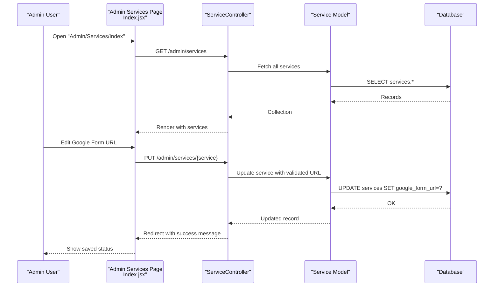
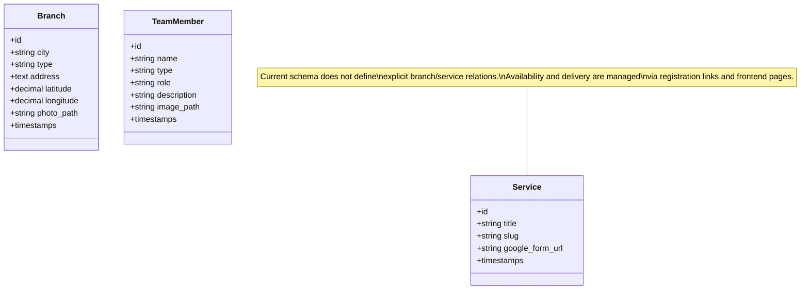
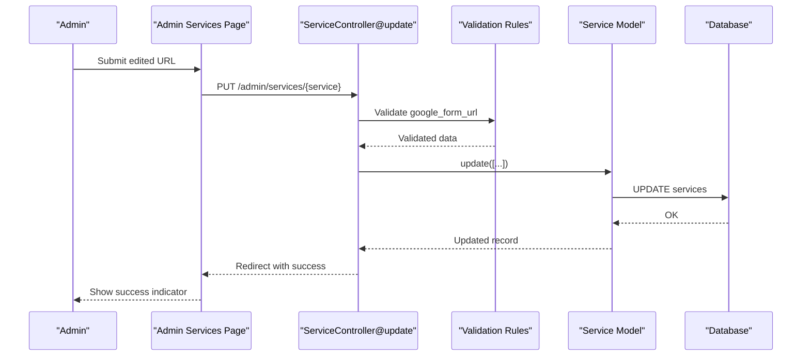
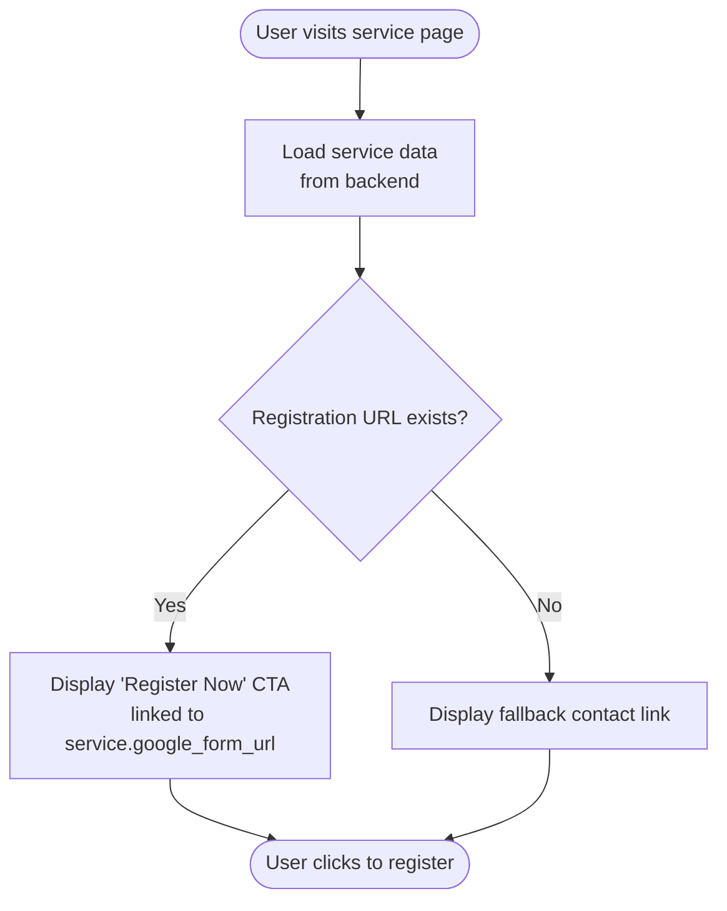
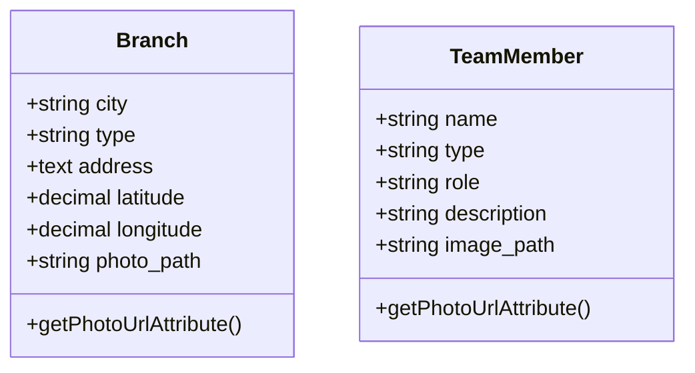
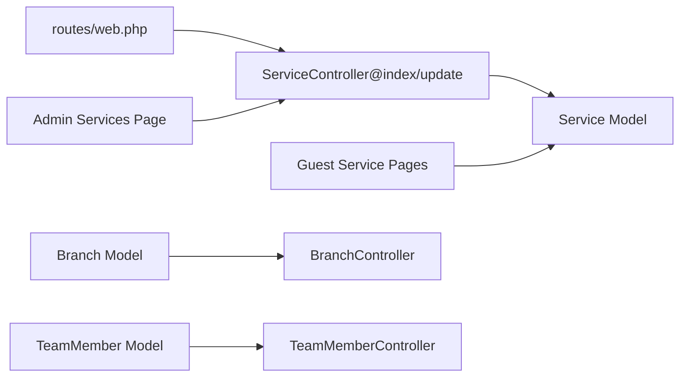

# Service Model and Offerings Management

<cite>
**Referenced Files in This Document**
- [Service.php](file://app/Models/Service.php)
- [create_services_table.php](file://database/migrations/2026_04_30_055559_create_services_table.php)
- [ServiceController.php](file://app/Http/Controllers/ServiceController.php)
- [Index.jsx](file://resources/js/Pages/Admin/Services/Index.jsx)
- [ServiceSeeder.php](file://database/seeders/ServiceSeeder.php)
- [web.php](file://routes/web.php)
- [Branch.php](file://app/Models/Branch.php)
- [TeamMember.php](file://app/Models/TeamMember.php)
- [BranchController.php](file://app/Http/Controllers/BranchController.php)
- [TeamMemberController.php](file://app/Http/Controllers/TeamMemberController.php)
- [Cabang.jsx](file://resources/js/Pages/Guest/Cabang.jsx)
- [Terapis.jsx](file://resources/js/Pages/Guest/Terapis.jsx)
- [AsesmenPsikologi.jsx](file://resources/js/Pages/Guest/Pelayanan/AsesmenPsikologi.jsx)
- [Konseling.jsx](file://resources/js/Pages/Guest/Pelayanan/Konseling.jsx)
- [Terapi.jsx](file://resources/js/Pages/Guest/Pelayanan/Terapi.jsx)
</cite>

## Table of Contents
1. [Introduction](#introduction)
2. [Project Structure](#project-structure)
3. [Core Components](#core-components)
4. [Architecture Overview](#architecture-overview)
5. [Detailed Component Analysis](#detailed-component-analysis)
6. [Dependency Analysis](#dependency-analysis)
7. [Performance Considerations](#performance-considerations)
8. [Troubleshooting Guide](#troubleshooting-guide)
9. [Conclusion](#conclusion)

## Introduction
This document provides comprehensive documentation for the Service model and service offerings management system within the EduFA platform. It covers service attributes, relationships with branches and team members, administrative management capabilities, frontend presentation, and operational workflows. The system currently focuses on managing registration links for services and exposing service metadata to the frontend for user engagement.

## Project Structure
The service management system spans backend Eloquent models, controllers, migrations, and frontend pages. Administrative management is handled via an Inertia-based interface, while frontend pages present service details and integrate with external registration systems.

```mermaid
graph TB
subgraph "Backend"
M_Service["Service Model<br/>app/Models/Service.php"]
C_Service["Service Controller<br/>app/Http/Controllers/ServiceController.php"]
M_Branch["Branch Model<br/>app/Models/Branch.php"]
M_Team["TeamMember Model<br/>app/Models/TeamMember.php"]
C_Branch["Branch Controller<br/>app/Http/Controllers/BranchController.php"]
C_Team["TeamMember Controller<br/>app/Http/Controllers/TeamMemberController.php"]
R_Routes["Routes<br/>routes/web.php"]
M_Migration["Services Migration<br/>database/migrations/...create_services_table.php"]
S_Seed["Service Seeder<br/>database/seeders/ServiceSeeder.php"]
end
subgraph "Frontend"
F_Admin["Admin Services Page<br/>resources/js/Pages/Admin/Services/Index.jsx"]
F_Cabang["Branch Locator<br/>resources/js/Pages/Guest/Cabang.jsx"]
F_Terapis["Team Members<br/>resources/js/Pages/Guest/Terapis.jsx"]
F_Asesmen["Asesmen Psikologi<br/>resources/js/Pages/Guest/Pelayanan/AsesmenPsikologi.jsx"]
F_Konseling["Konseling<br/>resources/js/Pages/Guest/Pelayanan/Konseling.jsx"]
F_Terapi["Terapi<br/>resources/js/Pages/Guest/Pelayanan/Terapi.jsx"]
end
R_Routes --> C_Service
R_Routes --> C_Branch
R_Routes --> C_Team
C_Service --> M_Service
C_Branch --> M_Branch
C_Team --> M_Team
M_Migration --> M_Service
S_Seed --> M_Service
F_Admin --> C_Service
F_Cabang --> M_Branch
F_Terapis --> M_Team
F_Asesmen --> M_Service
F_Konseling --> M_Service
F_Terapi --> M_Service
```

**Diagram sources**
- [Service.php:1-15](file://app/Models/Service.php#L1-L15)
- [ServiceController.php:1-31](file://app/Http/Controllers/ServiceController.php#L1-L31)
- [Branch.php:1-36](file://app/Models/Branch.php#L1-L36)
- [TeamMember.php:1-24](file://app/Models/TeamMember.php#L1-L24)
- [BranchController.php:1-88](file://app/Http/Controllers/BranchController.php#L1-L88)
- [TeamMemberController.php:1-72](file://app/Http/Controllers/TeamMemberController.php#L1-L72)
- [web.php:101-112](file://routes/web.php#L101-L112)
- [create_services_table.php:1-31](file://database/migrations/2026_04_30_055559_create_services_table.php#L1-L31)
- [ServiceSeeder.php:1-58](file://database/seeders/ServiceSeeder.php#L1-L58)
- [Index.jsx:1-135](file://resources/js/Pages/Admin/Services/Index.jsx#L1-L135)
- [Cabang.jsx:1-393](file://resources/js/Pages/Guest/Cabang.jsx#L1-L393)
- [Terapis.jsx:1-342](file://resources/js/Pages/Guest/Terapis.jsx#L1-L342)
- [AsesmenPsikologi.jsx:1-209](file://resources/js/Pages/Guest/Pelayanan/AsesmenPsikologi.jsx#L1-L209)
- [Konseling.jsx:1-207](file://resources/js/Pages/Guest/Pelayanan/Konseling.jsx#L1-L207)
- [Terapi.jsx:1-208](file://resources/js/Pages/Guest/Pelayanan/Terapi.jsx#L1-L208)

**Section sources**
- [Service.php:1-15](file://app/Models/Service.php#L1-L15)
- [create_services_table.php:1-31](file://database/migrations/2026_04_30_055559_create_services_table.php#L1-L31)
- [ServiceController.php:1-31](file://app/Http/Controllers/ServiceController.php#L1-L31)
- [Index.jsx:1-135](file://resources/js/Pages/Admin/Services/Index.jsx#L1-L135)
- [ServiceSeeder.php:1-58](file://database/seeders/ServiceSeeder.php#L1-L58)
- [web.php:101-112](file://routes/web.php#L101-L112)

## Core Components
This section documents the primary components involved in service offerings management.

- Service Model
  - Purpose: Represents service offerings with essential metadata and registration link.
  - Attributes: title, slug, google_form_url.
  - Validation: Admin updates enforce URL validation for the registration link.
  - Relationship: No explicit branch/service relationship exists in current schema; service availability is managed externally via registration links.

- Service Controller
  - Index action: Renders admin page displaying all services with editable registration links.
  - Update action: Validates and persists Google Form URL for a given service.

- Admin Services Page
  - UI: Table listing services with live status indicator and editable URL field.
  - Functionality: Real-time validation and submission of registration URLs with success feedback.

- Service Seeder
  - Purpose: Seeds predefined services with titles, slugs, and registration links for quick setup.

- Frontend Service Pages
  - Asesmen Psikologi, Konseling, Terapi: Present service details and provide registration links derived from the Service model.
  - Integration: Uses service.google_form_url; falls back to a default contact link if unavailable.

- Branch and Team Member Models
  - While not directly part of service catalog, they support the broader ecosystem:
    - Branch: Geographic presence and location data for service delivery points.
    - TeamMember: Professional profiles supporting service delivery.

**Section sources**
- [Service.php:1-15](file://app/Models/Service.php#L1-L15)
- [ServiceController.php:11-30](file://app/Http/Controllers/ServiceController.php#L11-L30)
- [Index.jsx:9-92](file://resources/js/Pages/Admin/Services/Index.jsx#L9-L92)
- [ServiceSeeder.php:15-55](file://database/seeders/ServiceSeeder.php#L15-L55)
- [AsesmenPsikologi.jsx:32-34](file://resources/js/Pages/Guest/Pelayanan/AsesmenPsikologi.jsx#L32-L34)
- [Konseling.jsx:32-34](file://resources/js/Pages/Guest/Pelayanan/Konseling.jsx#L32-L34)
- [Terapi.jsx:32-34](file://resources/js/Pages/Guest/Pelayanan/Terapi.jsx#L32-L34)
- [Branch.php:1-36](file://app/Models/Branch.php#L1-L36)
- [TeamMember.php:1-24](file://app/Models/TeamMember.php#L1-L24)

## Architecture Overview
The service management architecture follows a clean separation of concerns:
- Backend: Laravel Eloquent models and controllers manage service data and administrative actions.
- Frontend: Inertia-driven React pages consume service data and registration links.
- Routing: Named routes enable consistent navigation and form submissions.

**Diagram sources**
- [web.php:101-102](file://routes/web.php#L101-L102)
- [ServiceController.php:11-30](file://app/Http/Controllers/ServiceController.php#L11-L30)
- [Index.jsx:14-19](file://resources/js/Pages/Admin/Services/Index.jsx#L14-L19)
- [Service.php:9-13](file://app/Models/Service.php#L9-L13)

## Detailed Component Analysis

### Service Model and Database Schema
- Model definition: Declares fillable attributes for title, slug, and google_form_url.
- Migration: Creates services table with unique slug, optional registration URL, and timestamps.
- Seeding: Initializes multiple services with realistic titles and slugs.

**Diagram sources**
- [Service.php:7-14](file://app/Models/Service.php#L7-L14)
- [create_services_table.php:14-20](file://database/migrations/2026_04_30_055559_create_services_table.php#L14-L20)
- [Branch.php:8-35](file://app/Models/Branch.php#L8-L35)
- [TeamMember.php:7-23](file://app/Models/TeamMember.php#L7-L23)

**Section sources**
- [Service.php:1-15](file://app/Models/Service.php#L1-L15)
- [create_services_table.php:1-31](file://database/migrations/2026_04_30_055559_create_services_table.php#L1-L31)
- [ServiceSeeder.php:15-55](file://database/seeders/ServiceSeeder.php#L15-L55)

### Service Controller and Admin Workflow
- Index: Returns all services to the admin page for bulk management.
- Update: Validates incoming URL and persists it to the service record, enabling dynamic registration link updates.

**Diagram sources**
- [ServiceController.php:18-29](file://app/Http/Controllers/ServiceController.php#L18-L29)
- [Index.jsx:9-19](file://resources/js/Pages/Admin/Services/Index.jsx#L9-L19)

**Section sources**
- [ServiceController.php:11-30](file://app/Http/Controllers/ServiceController.php#L11-L30)
- [Index.jsx:9-92](file://resources/js/Pages/Admin/Services/Index.jsx#L9-L92)

### Frontend Service Presentation and Booking Integration
- Service pages (Asesmen Psikologi, Konseling, Terapi) render detailed content and provide registration links.
- Registration links are sourced from the Service model; if unavailable, a fallback contact link is used.
- Branch and team pages complement service delivery by showcasing geographic presence and professional profiles.

**Diagram sources**
- [AsesmenPsikologi.jsx:32-34](file://resources/js/Pages/Guest/Pelayanan/AsesmenPsikologi.jsx#L32-L34)
- [Konseling.jsx:32-34](file://resources/js/Pages/Guest/Pelayanan/Konseling.jsx#L32-L34)
- [Terapi.jsx:32-34](file://resources/js/Pages/Guest/Pelayanan/Terapi.jsx#L32-L34)
- [Service.php:9-13](file://app/Models/Service.php#L9-L13)

**Section sources**
- [AsesmenPsikologi.jsx:1-209](file://resources/js/Pages/Guest/Pelayanan/AsesmenPsikologi.jsx#L1-L209)
- [Konseling.jsx:1-207](file://resources/js/Pages/Guest/Pelayanan/Konseling.jsx#L1-L207)
- [Terapi.jsx:1-208](file://resources/js/Pages/Guest/Pelayanan/Terapi.jsx#L1-L208)

### Branch and Team Member Integration
- Branch model supports geographic presence with address, coordinates, and photo handling.
- TeamMember model supports professional profiles with image handling and appended photo URL resolution.
- These models underpin service delivery logistics but are not directly linked to services in the current schema.

**Diagram sources**
- [Branch.php:8-35](file://app/Models/Branch.php#L8-L35)
- [TeamMember.php:7-23](file://app/Models/TeamMember.php#L7-L23)

**Section sources**
- [Branch.php:1-36](file://app/Models/Branch.php#L1-L36)
- [TeamMember.php:1-24](file://app/Models/TeamMember.php#L1-L24)
- [BranchController.php:1-88](file://app/Http/Controllers/BranchController.php#L1-L88)
- [TeamMemberController.php:1-72](file://app/Http/Controllers/TeamMemberController.php#L1-L72)

## Dependency Analysis
The system exhibits clear separation between models, controllers, routes, and frontend components. Current dependencies include:
- Routes depend on controllers for service management endpoints.
- Controllers depend on models for data persistence.
- Admin page depends on controller actions for rendering and updating service registration links.
- Frontend service pages depend on service data for registration link integration.

**Diagram sources**
- [web.php:101-112](file://routes/web.php#L101-L112)
- [ServiceController.php:1-31](file://app/Http/Controllers/ServiceController.php#L1-L31)
- [Service.php:1-15](file://app/Models/Service.php#L1-L15)
- [Index.jsx:1-135](file://resources/js/Pages/Admin/Services/Index.jsx#L1-L135)
- [AsesmenPsikologi.jsx:1-209](file://resources/js/Pages/Guest/Pelayanan/AsesmenPsikologi.jsx#L1-L209)
- [Branch.php:1-36](file://app/Models/Branch.php#L1-L36)
- [TeamMember.php:1-24](file://app/Models/TeamMember.php#L1-L24)

**Section sources**
- [web.php:101-112](file://routes/web.php#L101-L112)
- [ServiceController.php:1-31](file://app/Http/Controllers/ServiceController.php#L1-L31)
- [Service.php:1-15](file://app/Models/Service.php#L1-L15)
- [Index.jsx:1-135](file://resources/js/Pages/Admin/Services/Index.jsx#L1-L135)

## Performance Considerations
- Database queries: The admin index fetches all services; consider pagination or lazy loading for large catalogs.
- Image handling: Branch and team member photos are stored and resolved via asset URLs; ensure appropriate sizing and caching.
- Frontend responsiveness: Use client-side validation and optimistic UI updates for smoother admin editing experiences.

## Troubleshooting Guide
- Invalid registration URL: Ensure URLs start with http:// or https://; validation prevents malformed entries.
- Photo deletion: Branch and team member controllers handle existing photo cleanup during updates; verify storage permissions and paths.
- Service seeding: Seed script uses updateOrCreate based on slug; confirm slugs remain unique to avoid unintended merges.

**Section sources**
- [ServiceController.php:20-22](file://app/Http/Controllers/ServiceController.php#L20-L22)
- [BranchController.php:61-67](file://app/Http/Controllers/BranchController.php#L61-L67)
- [TeamMemberController.php:49-54](file://app/Http/Controllers/TeamMemberController.php#L49-L54)
- [ServiceSeeder.php:53-55](file://database/seeders/ServiceSeeder.php#L53-L55)

## Conclusion
The current service offerings management system centers on a lightweight Service model with registration link administration and frontend integration. While explicit branch and team member relationships are not defined in the schema, the ecosystem supports geographic presence and professional profiles that complement service delivery. Future enhancements could include service categorization, availability scheduling, and explicit linking to branches and team members for richer service management and cross-selling opportunities.