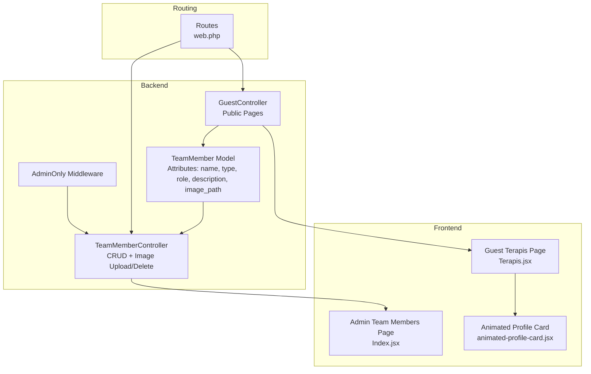
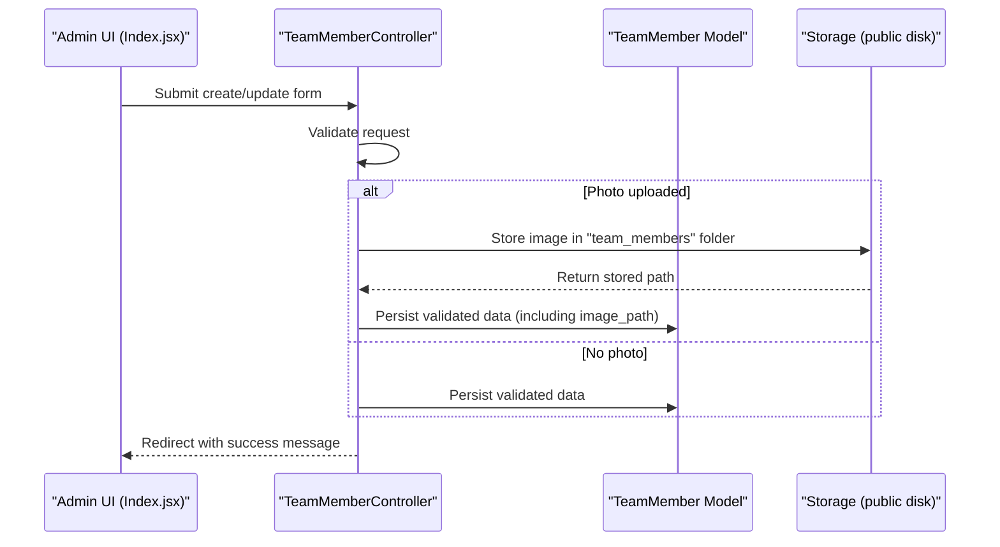
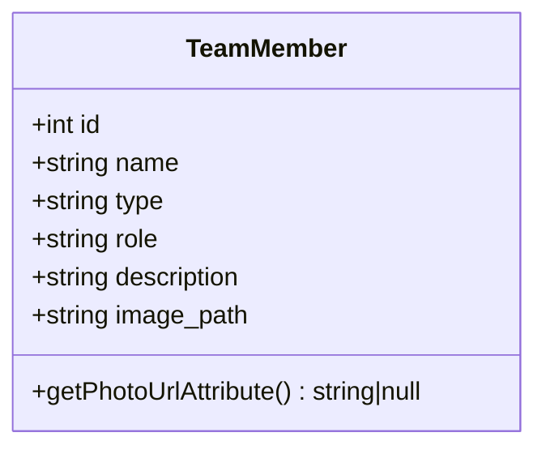
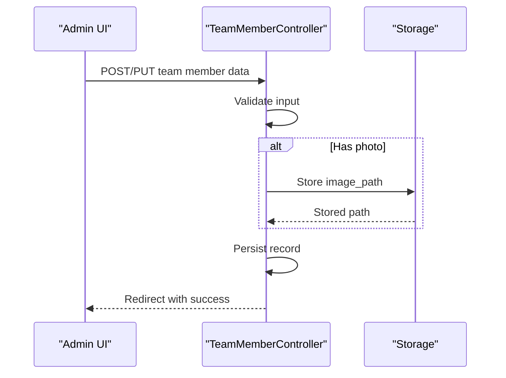
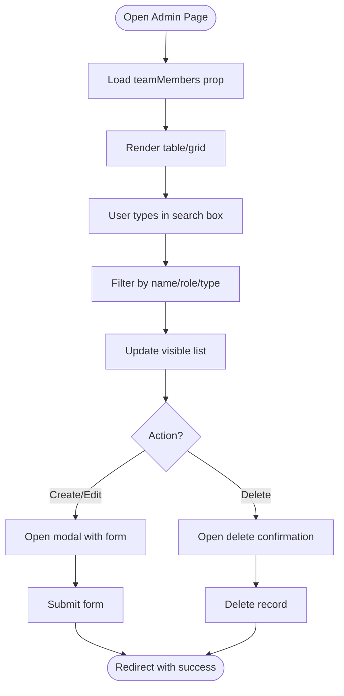
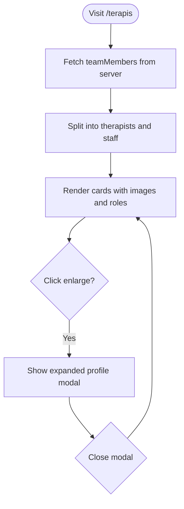
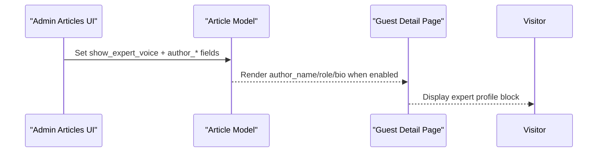
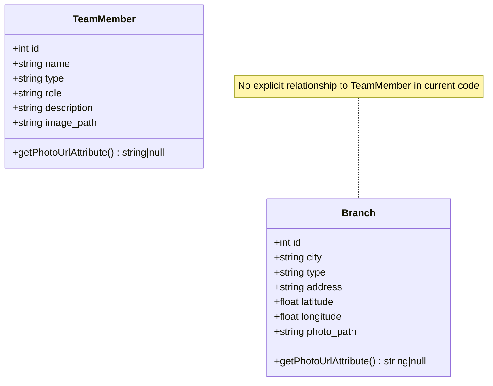
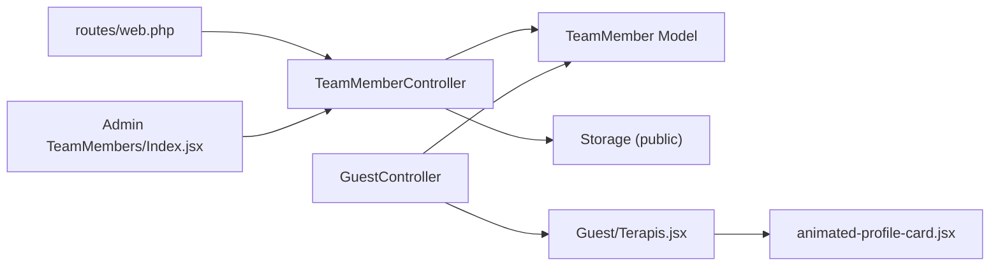

# Team Member Model and Expert Profiles

<cite>
**Referenced Files in This Document**
- [TeamMember.php](file://app/Models/TeamMember.php)
- [create_team_members_table.php](file://database/migrations/2026_04_25_153659_create_team_members_table.php)
- [TeamMemberController.php](file://app/Http/Controllers/TeamMemberController.php)
- [Index.jsx](file://resources/js/Pages/Admin/TeamMembers/Index.jsx)
- [Terapis.jsx](file://resources/js/Pages/Guest/Terapis.jsx)
- [GuestController.php](file://app/Http/Controllers/GuestController.php)
- [web.php](file://routes/web.php)
- [Branch.php](file://app/Models/Branch.php)
- [Article.php](file://app/Models/Article.php)
- [AdminOnly.php](file://app/Http/Middleware/AdminOnly.php)
- [animated-profile-card.jsx](file://resources/js/Components/ui/animated-profile-card.jsx)
</cite>

## Table of Contents
1. [Introduction](#introduction)
2. [Project Structure](#project-structure)
3. [Core Components](#core-components)
4. [Architecture Overview](#architecture-overview)
5. [Detailed Component Analysis](#detailed-component-analysis)
6. [Dependency Analysis](#dependency-analysis)
7. [Performance Considerations](#performance-considerations)
8. [Troubleshooting Guide](#troubleshooting-guide)
9. [Conclusion](#conclusion)

## Introduction
This document describes the TeamMember model and expert profile management system in the EduFA project. It covers team member attributes, professional details, image management, and how expert profiles integrate with guest-facing pages. It also documents administrative controls, search and filtering capabilities, and the optional expert voice feature used in articles.

## Project Structure
The system spans backend Eloquent models, controllers, frontend admin pages, guest pages, routing, and middleware. The TeamMember model stores personal and professional details, manages profile images, and exposes computed photo URLs. The admin interface allows CRUD operations, while the guest pages render team member profiles for public consumption.

**Diagram sources**
- [TeamMember.php:1-24](file://app/Models/TeamMember.php#L1-L24)
- [TeamMemberController.php:1-72](file://app/Http/Controllers/TeamMemberController.php#L1-L72)
- [GuestController.php:1-162](file://app/Http/Controllers/GuestController.php#L1-L162)
- [Index.jsx:1-374](file://resources/js/Pages/Admin/TeamMembers/Index.jsx#L1-L374)
- [Terapis.jsx:1-342](file://resources/js/Pages/Guest/Terapis.jsx#L1-L342)
- [web.php:1-155](file://routes/web.php#L1-L155)
- [AdminOnly.php:1-25](file://app/Http/Middleware/AdminOnly.php#L1-L25)
- [animated-profile-card.jsx:1-224](file://resources/js/Components/ui/animated-profile-card.jsx#L1-L224)

**Section sources**
- [TeamMember.php:1-24](file://app/Models/TeamMember.php#L1-L24)
- [TeamMemberController.php:1-72](file://app/Http/Controllers/TeamMemberController.php#L1-L72)
- [GuestController.php:1-162](file://app/Http/Controllers/GuestController.php#L1-L162)
- [Index.jsx:1-374](file://resources/js/Pages/Admin/TeamMembers/Index.jsx#L1-L374)
- [Terapis.jsx:1-342](file://resources/js/Pages/Guest/Terapis.jsx#L1-L342)
- [web.php:1-155](file://routes/web.php#L1-L155)
- [AdminOnly.php:1-25](file://app/Http/Middleware/AdminOnly.php#L1-L25)
- [animated-profile-card.jsx:1-224](file://resources/js/Components/ui/animated-profile-card.jsx#L1-L224)

## Core Components
- TeamMember model: Defines fillable attributes, computed photo URL, and storage of image paths.
- TeamMemberController: Handles admin CRUD actions, validates inputs, uploads/deletes images, and redirects with feedback.
- Admin UI (Index.jsx): Provides search, create/edit forms, and confirmation modals for team members.
- Guest UI (Terapis.jsx): Renders therapist and staff profiles with lazy loading and modal preview.
- GuestController: Supplies team members to guest pages and serves public routes.
- Routing: Exposes admin resource routes for team members and public routes for guest pages.
- Middleware: Restricts admin-only access to management routes.
- Expert voice integration: Optional author metadata for articles, surfaced on guest detail pages.

**Section sources**
- [TeamMember.php:1-24](file://app/Models/TeamMember.php#L1-L24)
- [TeamMemberController.php:1-72](file://app/Http/Controllers/TeamMemberController.php#L1-L72)
- [Index.jsx:1-374](file://resources/js/Pages/Admin/TeamMembers/Index.jsx#L1-L374)
- [Terapis.jsx:1-342](file://resources/js/Pages/Guest/Terapis.jsx#L1-L342)
- [GuestController.php:1-162](file://app/Http/Controllers/GuestController.php#L1-L162)
- [web.php:114-122](file://routes/web.php#L114-L122)
- [AdminOnly.php:1-25](file://app/Http/Middleware/AdminOnly.php#L1-L25)
- [Article.php:1-28](file://app/Models/Article.php#L1-L28)

## Architecture Overview
The system follows a layered architecture:
- Presentation layer: Inertia-driven React pages for admin and guest experiences.
- Application layer: Controllers orchestrate requests, validation, persistence, and image management.
- Domain layer: Eloquent models encapsulate data and computed attributes.
- Persistence layer: Laravel filesystem stores images under the public disk.

**Diagram sources**
- [TeamMemberController.php:20-59](file://app/Http/Controllers/TeamMemberController.php#L20-L59)
- [TeamMember.php:9-22](file://app/Models/TeamMember.php#L9-L22)

**Section sources**
- [TeamMemberController.php:1-72](file://app/Http/Controllers/TeamMemberController.php#L1-L72)
- [TeamMember.php:1-24](file://app/Models/TeamMember.php#L1-L24)

## Detailed Component Analysis

### TeamMember Model
The TeamMember model defines the schema and computed attributes:
- Fillable fields include personal and professional details plus an optional image path.
- Computed attribute photo_url resolves to a public asset URL when an image exists.

**Diagram sources**
- [TeamMember.php:7-23](file://app/Models/TeamMember.php#L7-L23)

**Section sources**
- [TeamMember.php:1-24](file://app/Models/TeamMember.php#L1-L24)
- [create_team_members_table.php:14-22](file://database/migrations/2026_04_25_153659_create_team_members_table.php#L14-L22)

### TeamMemberController
Responsibilities:
- Admin-only CRUD operations for team members.
- Validation rules for required fields and optional image upload.
- Image lifecycle: store on create/update, replace/delete on update, delete on removal.
- Redirects with success messages after operations.

**Diagram sources**
- [TeamMemberController.php:20-59](file://app/Http/Controllers/TeamMemberController.php#L20-L59)

**Section sources**
- [TeamMemberController.php:1-72](file://app/Http/Controllers/TeamMemberController.php#L1-L72)

### Admin Team Members Page (Index.jsx)
Key features:
- Real-time search across name, role, and type.
- Create/edit modal with form validation and preview of selected photo.
- Confirmation modals for save and delete actions.
- Displays photo_url from the model and falls back to a default icon when absent.

**Diagram sources**
- [Index.jsx:23-107](file://resources/js/Pages/Admin/TeamMembers/Index.jsx#L23-L107)

**Section sources**
- [Index.jsx:1-374](file://resources/js/Pages/Admin/TeamMembers/Index.jsx#L1-L374)

### Guest Terapis Page (Terapis.jsx)
Highlights:
- Filters team members into therapists and staff.
- Uses photo_url for profile images, falling back to a default when missing.
- Implements a modal to enlarge and display profile details.
- Integrates animations and responsive layouts for an engaging experience.

**Diagram sources**
- [Terapis.jsx:31-67](file://resources/js/Pages/Guest/Terapis.jsx#L31-L67)

**Section sources**
- [Terapis.jsx:1-342](file://resources/js/Pages/Guest/Terapis.jsx#L1-L342)
- [GuestController.php:29-34](file://app/Http/Controllers/GuestController.php#L29-L34)

### Expert Voice Integration (Articles)
While the TeamMember model does not directly manage expert credentials, the Article model supports an expert voice feature:
- Fields for author_name, author_role, author_bio, and show_expert_voice toggle.
- On guest detail pages, the author identity switches between the expert voice and the assigned user when enabled.

**Diagram sources**
- [Article.php:9-21](file://app/Models/Article.php#L9-L21)
- [GuestController.php:65-83](file://app/Http/Controllers/GuestController.php#L65-L83)

**Section sources**
- [Article.php:1-28](file://app/Models/Article.php#L1-L28)
- [GuestController.php:1-162](file://app/Http/Controllers/GuestController.php#L1-L162)

### Branch Relationship and Location Assignment
The Branch model includes address and geolocation fields but does not declare a direct relationship to TeamMember in the current codebase. Therefore, location assignment for team members is not implemented here. If needed, a belongsToMany or belongsTo relationship can be introduced in future iterations.

**Diagram sources**
- [Branch.php:8-35](file://app/Models/Branch.php#L8-L35)
- [TeamMember.php:7-23](file://app/Models/TeamMember.php#L7-L23)

**Section sources**
- [Branch.php:1-36](file://app/Models/Branch.php#L1-L36)
- [TeamMember.php:1-24](file://app/Models/TeamMember.php#L1-L24)

### Image Management and Display Optimization
- Storage: Images are stored under the public disk in a dedicated folder for team members.
- Computed URL: photo_url attribute resolves to a public asset URL when image_path exists.
- Lazy loading: Guest pages use lazy loading for profile images to improve performance.
- Fallbacks: Empty states and default icons are shown when images are unavailable.

**Section sources**
- [TeamMemberController.php:30-32](file://app/Http/Controllers/TeamMemberController.php#L30-L32)
- [TeamMember.php:17-22](file://app/Models/TeamMember.php#L17-L22)
- [Terapis.jsx:204-208](file://resources/js/Pages/Guest/Terapis.jsx#L204-L208)

### Visibility Controls and Permissions
- Admin-only routes: Resource routes for team members are guarded by middleware that checks authentication and admin access.
- Access enforcement: Requests without proper credentials receive a forbidden response.

**Section sources**
- [web.php:114-122](file://routes/web.php#L114-L122)
- [AdminOnly.php:16-23](file://app/Http/Middleware/AdminOnly.php#L16-L23)

## Dependency Analysis
The following diagram shows key dependencies among components involved in team member management and expert profiles.

**Diagram sources**
- [web.php:114-122](file://routes/web.php#L114-L122)
- [TeamMemberController.php:1-72](file://app/Http/Controllers/TeamMemberController.php#L1-L72)
- [TeamMember.php:1-24](file://app/Models/TeamMember.php#L1-L24)
- [GuestController.php:29-34](file://app/Http/Controllers/GuestController.php#L29-L34)
- [Index.jsx:1-374](file://resources/js/Pages/Admin/TeamMembers/Index.jsx#L1-L374)
- [Terapis.jsx:1-342](file://resources/js/Pages/Guest/Terapis.jsx#L1-L342)
- [animated-profile-card.jsx:1-224](file://resources/js/Components/ui/animated-profile-card.jsx#L1-L224)

**Section sources**
- [web.php:1-155](file://routes/web.php#L1-L155)
- [TeamMemberController.php:1-72](file://app/Http/Controllers/TeamMemberController.php#L1-L72)
- [TeamMember.php:1-24](file://app/Models/TeamMember.php#L1-L24)
- [GuestController.php:1-162](file://app/Http/Controllers/GuestController.php#L1-L162)
- [Index.jsx:1-374](file://resources/js/Pages/Admin/TeamMembers/Index.jsx#L1-L374)
- [Terapis.jsx:1-342](file://resources/js/Pages/Guest/Terapis.jsx#L1-L342)
- [animated-profile-card.jsx:1-224](file://resources/js/Components/ui/animated-profile-card.jsx#L1-L224)

## Performance Considerations
- Image optimization: Limit file size and choose modern formats to reduce bandwidth.
- Lazy loading: Already implemented in guest pages for profile images.
- Minimal queries: Admin lists fetch all records; consider pagination for large datasets.
- CDN: Serve static assets via CDN for improved global performance.

## Troubleshooting Guide
Common issues and resolutions:
- Image upload fails: Verify storage permissions and disk configuration for the public disk.
- Broken image links: Ensure image_path is present and photo_url is computed correctly.
- Admin access denied: Confirm authentication and that the user has admin privileges.
- Search yields no results: Check that searchable fields (name, role, type) are populated.

**Section sources**
- [TeamMemberController.php:30-32](file://app/Http/Controllers/TeamMemberController.php#L30-L32)
- [TeamMember.php:17-22](file://app/Models/TeamMember.php#L17-L22)
- [AdminOnly.php:16-23](file://app/Http/Middleware/AdminOnly.php#L16-L23)

## Conclusion
The TeamMember model and expert profile system provide a solid foundation for managing team member details, professional roles, and public display. The admin interface offers efficient CRUD operations with image handling, while the guest pages deliver an optimized, visually engaging presentation. Optional expert voice support in articles complements the profile system for content attribution. Future enhancements could include credential management, certification tracking, and location assignment through branch relationships.