# User Model and Authentication

<cite>
**Referenced Files in This Document**
- [User.php](file://app/Models/User.php)
- [create_users_table.php](file://database/migrations/0001_01_01_000000_create_users_table.php)
- [auth.php](file://config/auth.php)
- [session.php](file://config/session.php)
- [AdminOnly.php](file://app/Http/Middleware/AdminOnly.php)
- [auth.php](file://routes/auth.php)
- [AuthenticatedSessionController.php](file://app/Http/Controllers/Auth/AuthenticatedSessionController.php)
- [LoginRequest.php](file://app/Http/Requests/Auth/LoginRequest.php)
- [PasswordResetLinkController.php](file://app/Http/Controllers/Auth/PasswordResetLinkController.php)
- [NewPasswordController.php](file://app/Http/Controllers/Auth/NewPasswordController.php)
- [VerifyEmailController.php](file://app/Http/Controllers/Auth/VerifyEmailController.php)
- [ProfileController.php](file://app/Http/Controllers/ProfileController.php)
- [ProfileUpdateRequest.php](file://app/Http/Requests/ProfileUpdateRequest.php)
- [Login.jsx](file://resources/js/Pages/Auth/Login.jsx)
- [Edit.jsx](file://resources/js/Pages/Profile/Edit.jsx)
</cite>

## Table of Contents
1. [Introduction](#introduction)
2. [Project Structure](#project-structure)
3. [Core Components](#core-components)
4. [Architecture Overview](#architecture-overview)
5. [Detailed Component Analysis](#detailed-component-analysis)
6. [Dependency Analysis](#dependency-analysis)
7. [Performance Considerations](#performance-considerations)
8. [Troubleshooting Guide](#troubleshooting-guide)
9. [Conclusion](#conclusion)

## Introduction
This document provides comprehensive documentation for the User model and authentication system. It covers the User model attributes, role-based access control (RBAC), authentication flows, password handling, email verification, session management, and middleware protections. Practical examples illustrate registration, login/logout, password reset, and profile management. Security considerations and user state management are addressed throughout.

## Project Structure
The authentication system spans backend Eloquent models, controllers, requests, middleware, configuration, and frontend pages. Routes define guest and authenticated flows, while controllers orchestrate business logic and integrate with the session and password reset mechanisms.

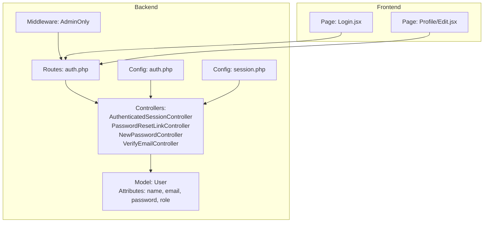

**Diagram sources**
- [User.php:13-46](file://app/Models/User.php#L13-L46)
- [AuthenticatedSessionController.php:13-58](file://app/Http/Controllers/Auth/AuthenticatedSessionController.php#L13-L58)
- [PasswordResetLinkController.php:13-52](file://app/Http/Controllers/Auth/PasswordResetLinkController.php#L13-L52)
- [NewPasswordController.php:17-70](file://app/Http/Controllers/Auth/NewPasswordController.php#L17-L70)
- [VerifyEmailController.php:10-28](file://app/Http/Controllers/Auth/VerifyEmailController.php#L10-L28)
- [auth.php:1-44](file://routes/auth.php#L1-L44)
- [AdminOnly.php:9-25](file://app/Http/Middleware/AdminOnly.php#L9-L25)
- [auth.php:5-118](file://config/auth.php#L5-L118)
- [session.php:21-234](file://config/session.php#L21-L234)
- [Login.jsx:8-204](file://resources/js/Pages/Auth/Login.jsx#L8-L204)
- [Edit.jsx:6-35](file://resources/js/Pages/Profile/Edit.jsx#L6-L35)

**Section sources**
- [auth.php:1-44](file://routes/auth.php#L1-L44)
- [auth.php:5-118](file://config/auth.php#L5-L118)
- [session.php:21-234](file://config/session.php#L21-L234)

## Core Components
- User model
  - Attributes: name, email, password, role
  - Hidden fields: password, remember_token
  - Role helpers: isAdmin, isEditor, canAccessAdmin
  - Casts: email_verified_at as datetime, password as hashed
- Database schema
  - Users table with unique email, optional email_verified_at, role enum defaulting to admin, rememberToken
  - Sessions table for database-backed sessions
  - Password reset tokens table
- Authentication configuration
  - Guard: session with Eloquent provider
  - Password broker: users with token table and expiration/throttle
- Middleware
  - AdminOnly: restricts access to admin/editor routes

**Section sources**
- [User.php:13-46](file://app/Models/User.php#L13-L46)
- [create_users_table.php:16-41](file://database/migrations/0001_01_01_000000_create_users_table.php#L16-L41)
- [auth.php:40-102](file://config/auth.php#L40-L102)
- [AdminOnly.php:16-23](file://app/Http/Middleware/AdminOnly.php#L16-L23)

## Architecture Overview
The authentication architecture integrates route-driven flows, controller actions, request validation, model interactions, and session/token management. Frontend pages submit forms routed to controllers that enforce rate limits, authenticate credentials, and manage sessions.

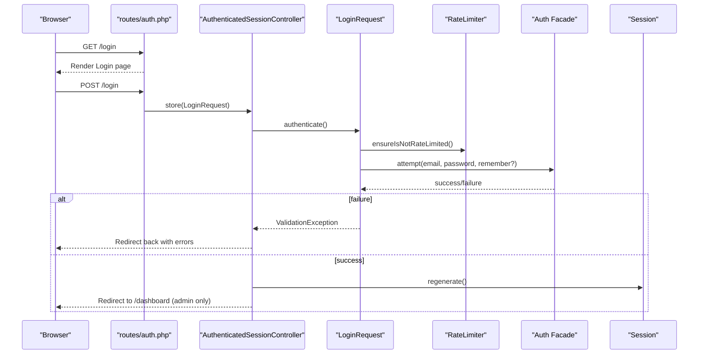

**Diagram sources**
- [auth.php:13-31](file://routes/auth.php#L13-L31)
- [AuthenticatedSessionController.php:28-43](file://app/Http/Controllers/Auth/AuthenticatedSessionController.php#L28-L43)
- [LoginRequest.php:41-54](file://app/Http/Requests/Auth/LoginRequest.php#L41-L54)
- [LoginRequest.php:61-77](file://app/Http/Requests/Auth/LoginRequest.php#L61-L77)

## Detailed Component Analysis

### User Model
The User model extends the framework’s Authenticatable and adds role-based helpers and attribute visibility/casting.

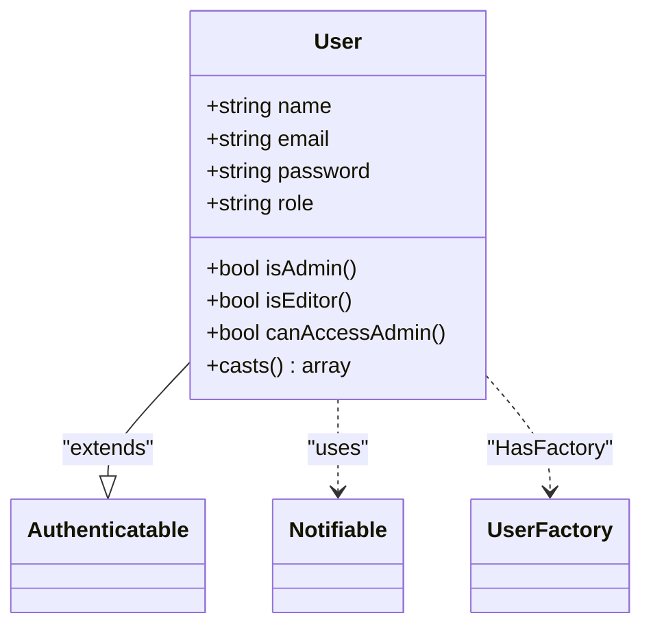

- Attributes and visibility
  - Fillable: name, email, password, role
  - Hidden: password, remember_token
- Role-based helpers
  - isAdmin: role equals admin
  - isEditor: role equals editor
  - canAccessAdmin: role equals admin or editor
- Casting
  - email_verified_at: datetime
  - password: hashed

**Diagram sources**
- [User.php:13-46](file://app/Models/User.php#L13-L46)

**Section sources**
- [User.php:13-46](file://app/Models/User.php#L13-L46)

### Database Schema
Users table migration defines the schema and supporting tables for sessions and password resets.

```mermaid
erDiagram
USERS {
bigint id PK
string name
string email UK
timestamp email_verified_at
string password
enum role
string remember_token
timestamps created_at, updated_at
}
PASSWORD_RESET_TOKENS {
string email PK
string token
timestamp created_at
}
SESSIONS {
string id PK
bigint user_id FK
string ip_address
text user_agent
longtext payload
int last_activity
}
```

- Users table includes unique email, optional email verification timestamp, role enum defaulting to admin, rememberToken, and timestamps.
- Password reset tokens table supports password reset flows.
- Sessions table enables database-backed session storage.

**Diagram sources**
- [create_users_table.php:16-41](file://database/migrations/0001_01_01_000000_create_users_table.php#L16-L41)

**Section sources**
- [create_users_table.php:16-41](file://database/migrations/0001_01_01_000000_create_users_table.php#L16-L41)

### Authentication Configuration
Authentication and session configurations define guards, providers, password brokers, and session storage.

- Guards
  - web: session driver with users provider
- Providers
  - users: Eloquent provider using User model
- Passwords
  - users broker: token table, expiry (minutes), throttle (seconds)
- Session
  - driver: database by default
  - lifetime: configurable minutes
  - cookie policy: http_only, secure, same_site, partitioned options

**Section sources**
- [auth.php:40-102](file://config/auth.php#L40-L102)
- [session.php:21-234](file://config/session.php#L21-L234)

### Login Flow
The login flow validates credentials, enforces rate limiting, regenerates the session, and redirects to the dashboard. Admin-only enforcement occurs during login.

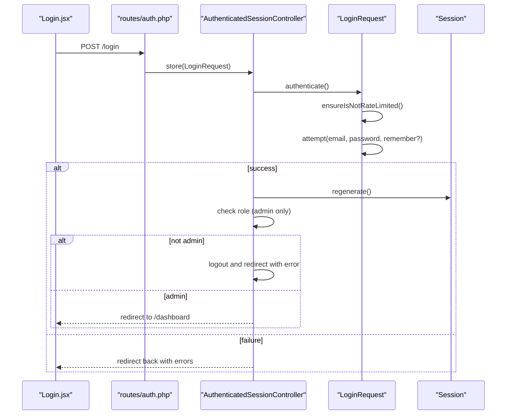

**Diagram sources**
- [Login.jsx:8-204](file://resources/js/Pages/Auth/Login.jsx#L8-L204)
- [auth.php:13-31](file://routes/auth.php#L13-L31)
- [AuthenticatedSessionController.php:28-43](file://app/Http/Controllers/Auth/AuthenticatedSessionController.php#L28-L43)
- [LoginRequest.php:41-77](file://app/Http/Requests/Auth/LoginRequest.php#L41-L77)

**Section sources**
- [AuthenticatedSessionController.php:18-43](file://app/Http/Controllers/Auth/AuthenticatedSessionController.php#L18-L43)
- [LoginRequest.php:41-77](file://app/Http/Requests/Auth/LoginRequest.php#L41-L77)

### Password Reset Procedures
Password reset involves requesting a reset link and then setting a new password using the token.

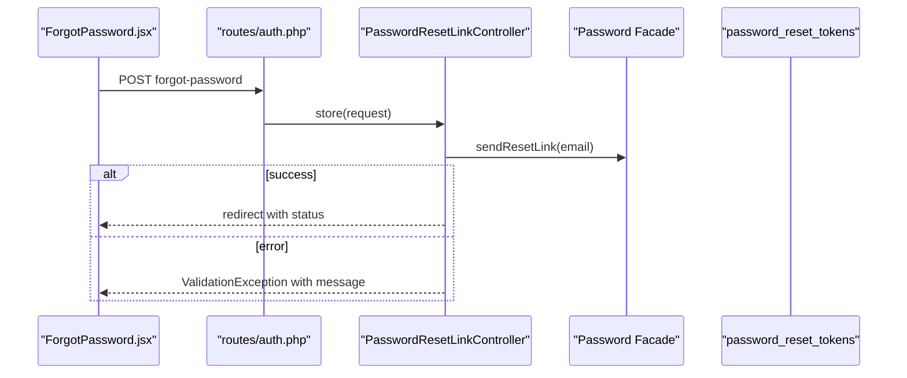

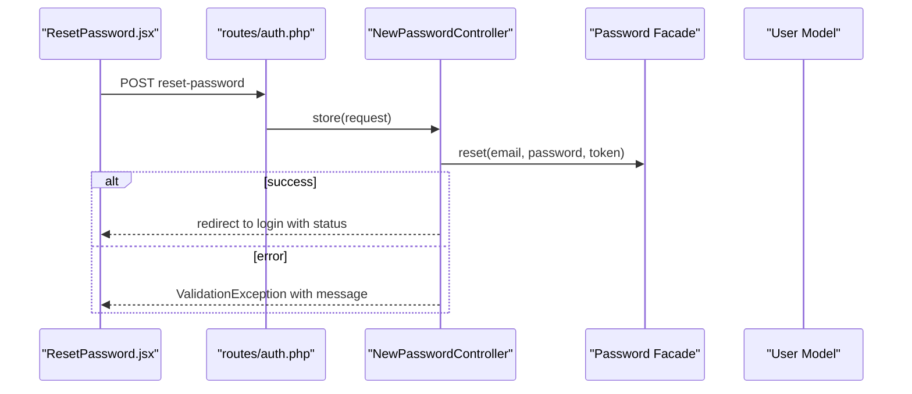

**Diagram sources**
- [PasswordResetLinkController.php:30-50](file://app/Http/Controllers/Auth/PasswordResetLinkController.php#L30-L50)
- [NewPasswordController.php:35-68](file://app/Http/Controllers/Auth/NewPasswordController.php#L35-L68)

**Section sources**
- [PasswordResetLinkController.php:18-50](file://app/Http/Controllers/Auth/PasswordResetLinkController.php#L18-L50)
- [NewPasswordController.php:22-68](file://app/Http/Controllers/Auth/NewPasswordController.php#L22-L68)

### Email Verification
Email verification marks the user's email as verified and emits a verification event.

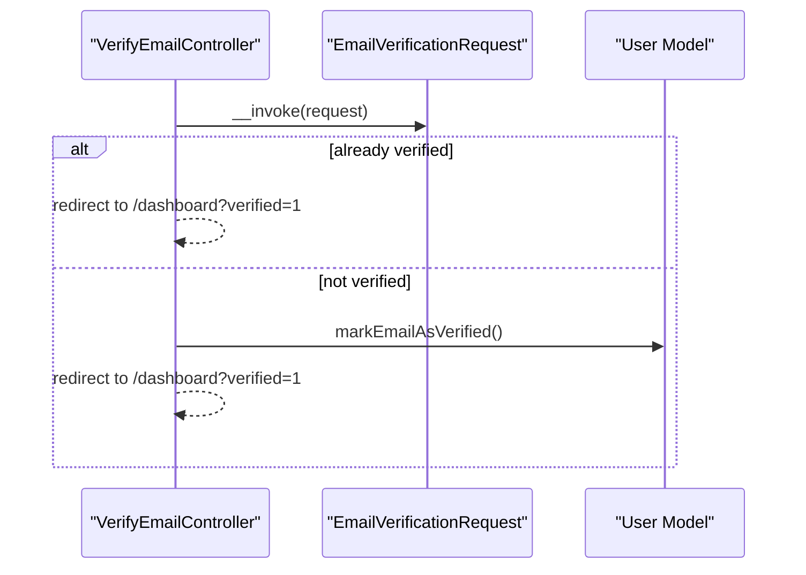

**Diagram sources**
- [VerifyEmailController.php:15-26](file://app/Http/Controllers/Auth/VerifyEmailController.php#L15-L26)

**Section sources**
- [VerifyEmailController.php:10-28](file://app/Http/Controllers/Auth/VerifyEmailController.php#L10-L28)

### Session Management
Session configuration supports database-backed sessions with configurable lifetime, cookie policies, and serialization.

- Driver: database
- Lifetime: minutes
- Cookie: http_only, secure, same_site, partitioned
- Serialization: json

**Section sources**
- [session.php:21-234](file://config/session.php#L21-L234)

### Middleware Protection: AdminOnly
The AdminOnly middleware checks authentication and role eligibility before allowing access to protected routes.

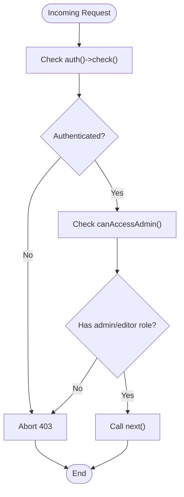

**Diagram sources**
- [AdminOnly.php:16-23](file://app/Http/Middleware/AdminOnly.php#L16-L23)

**Section sources**
- [AdminOnly.php:9-25](file://app/Http/Middleware/AdminOnly.php#L9-L25)

### Profile Management
Profile updates validate and save user information, resetting email verification when email changes.

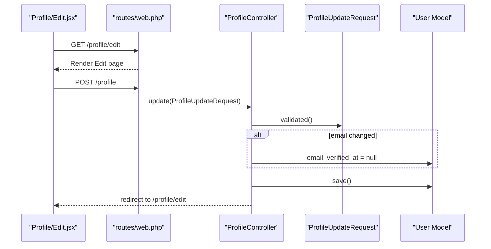

**Diagram sources**
- [Edit.jsx:6-35](file://resources/js/Pages/Profile/Edit.jsx#L6-L35)
- [ProfileController.php:30-41](file://app/Http/Controllers/ProfileController.php#L30-L41)
- [ProfileUpdateRequest.php:17-30](file://app/Http/Requests/ProfileUpdateRequest.php#L17-L30)

**Section sources**
- [ProfileController.php:19-41](file://app/Http/Controllers/ProfileController.php#L19-L41)
- [ProfileUpdateRequest.php:10-32](file://app/Http/Requests/ProfileUpdateRequest.php#L10-L32)

### Logout Flow
Logout clears the current session, invalidates the session, regenerates the CSRF token, and redirects to the login page.

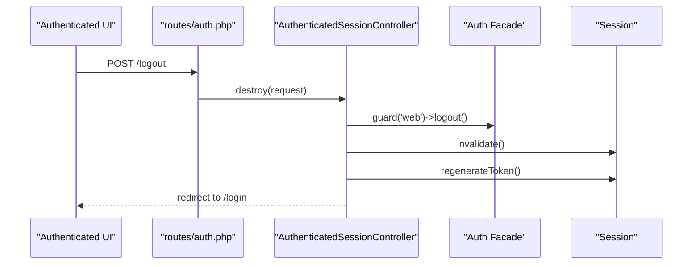

**Diagram sources**
- [auth.php:41-43](file://routes/auth.php#L41-L43)
- [AuthenticatedSessionController.php:48-57](file://app/Http/Controllers/Auth/AuthenticatedSessionController.php#L48-L57)

**Section sources**
- [AuthenticatedSessionController.php:48-57](file://app/Http/Controllers/Auth/AuthenticatedSessionController.php#L48-L57)

## Dependency Analysis
The authentication system exhibits clear separation of concerns:
- Routes delegate to controllers
- Controllers depend on requests for validation and Auth facade for authentication
- Models encapsulate role logic and attribute casting
- Middleware enforces authorization policies
- Configuration files centralize guard/provider/password/session settings

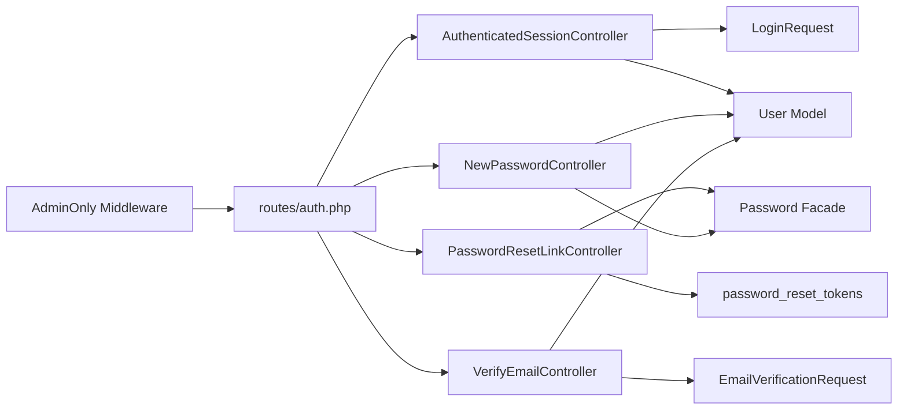

**Diagram sources**
- [auth.php:1-44](file://routes/auth.php#L1-L44)
- [AuthenticatedSessionController.php:13-58](file://app/Http/Controllers/Auth/AuthenticatedSessionController.php#L13-L58)
- [PasswordResetLinkController.php:13-52](file://app/Http/Controllers/Auth/PasswordResetLinkController.php#L13-L52)
- [NewPasswordController.php:17-70](file://app/Http/Controllers/Auth/NewPasswordController.php#L17-L70)
- [VerifyEmailController.php:10-28](file://app/Http/Controllers/Auth/VerifyEmailController.php#L10-L28)
- [AdminOnly.php:9-25](file://app/Http/Middleware/AdminOnly.php#L9-L25)

**Section sources**
- [auth.php:1-44](file://routes/auth.php#L1-L44)
- [auth.php:40-102](file://config/auth.php#L40-L102)

## Performance Considerations
- Session storage: Database sessions offer durability and scalability; ensure appropriate indexing on user_id and last_activity.
- Password hashing: The model casts passwords as hashed; rely on framework defaults for cost factors.
- Rate limiting: Login attempts are throttled to mitigate brute force; adjust limits per deployment needs.
- Token lifetimes: Password reset tokens expire after a configured duration; balance usability with security.

## Troubleshooting Guide
- Login failures
  - Exceeding rate limit triggers lockout messages; wait for cooldown or adjust limits.
  - Incorrect credentials produce authentication failure messages.
- Password reset issues
  - Invalid or expired tokens cause reset failures; ensure correct token and timely submission.
  - Email delivery problems require verifying mail configuration.
- Email verification
  - Already verified emails redirect without changes; newly verified emails receive a success indicator.
- Session problems
  - Database session cleanup requires periodic maintenance; verify table existence and permissions.
  - Cookie policy misconfiguration can block session persistence; confirm secure/http_only/same_site settings.

**Section sources**
- [LoginRequest.php:61-77](file://app/Http/Requests/Auth/LoginRequest.php#L61-L77)
- [AuthenticatedSessionController.php:38-41](file://app/Http/Controllers/Auth/AuthenticatedSessionController.php#L38-L41)
- [PasswordResetLinkController.php:39-50](file://app/Http/Controllers/Auth/PasswordResetLinkController.php#L39-L50)
- [NewPasswordController.php:46-68](file://app/Http/Controllers/Auth/NewPasswordController.php#L46-L68)
- [VerifyEmailController.php:17-25](file://app/Http/Controllers/Auth/VerifyEmailController.php#L17-L25)
- [session.php:89-90](file://config/session.php#L89-L90)

## Conclusion
The User model and authentication system implement a robust, role-aware, and secure foundation. AdminOnly middleware, database sessions, and validated request flows ensure strong access control and user state management. Password reset and email verification are integrated with clear error handling and user feedback. Adjust configuration parameters to align with deployment requirements and maintain security best practices.