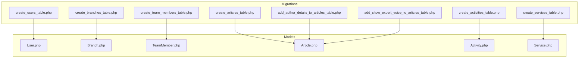
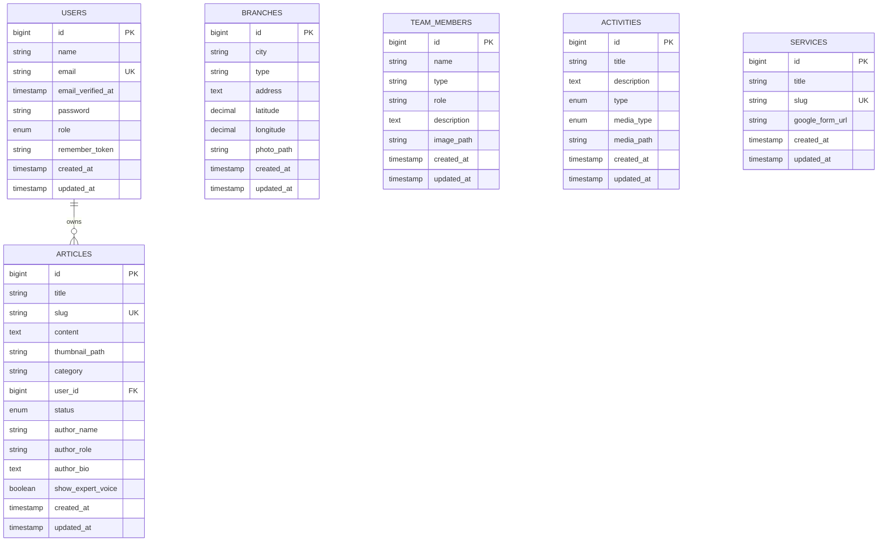
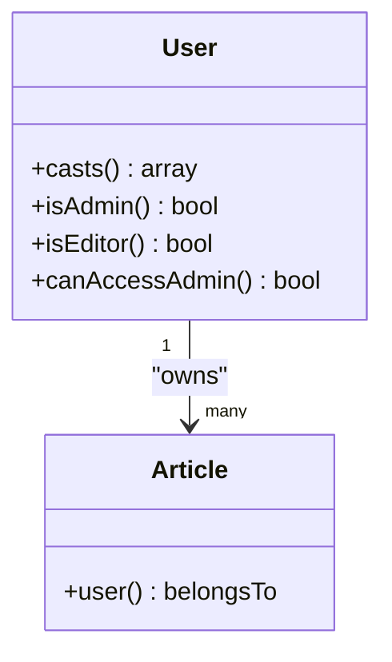
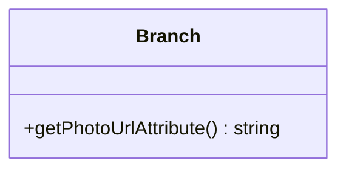
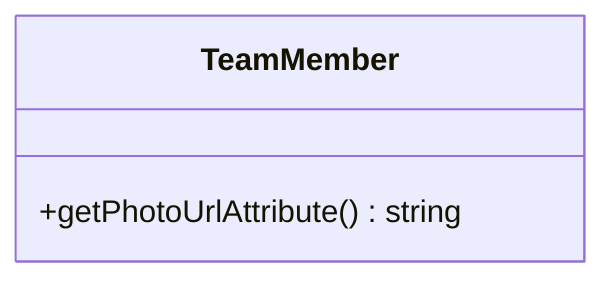
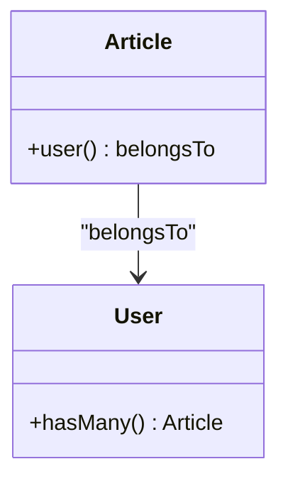
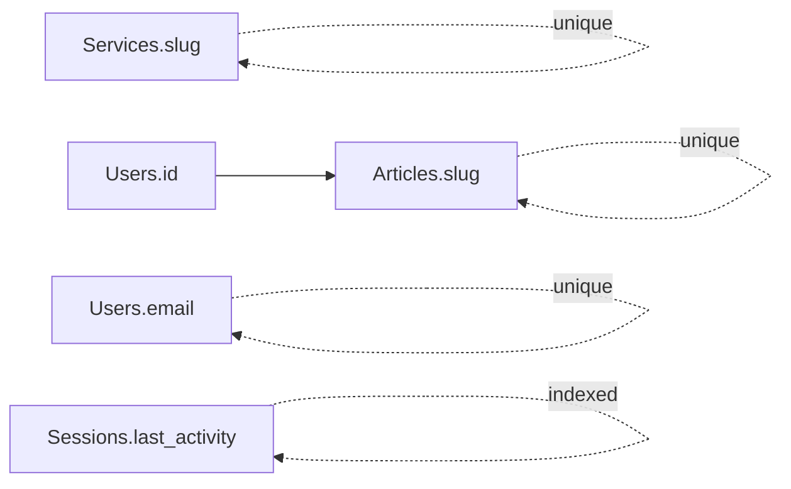

# Data Models and Database Design

<cite>
**Referenced Files in This Document**
- [0001_01_01_000000_create_users_table.php](file://database/migrations/0001_01_01_000000_create_users_table.php)
- [2026_04_20_133158_create_branches_table.php](file://database/migrations/2026_04_20_133158_create_branches_table.php)
- [2026_04_25_153659_create_team_members_table.php](file://database/migrations/2026_04_25_153659_create_team_members_table.php)
- [2026_04_30_045526_create_activities_table.php](file://database/migrations/2026_04_30_045526_create_activities_table.php)
- [2026_04_30_050400_create_articles_table.php](file://database/migrations/2026_04_30_050400_create_articles_table.php)
- [2026_04_30_051304_add_author_details_to_articles_table.php](file://database/migrations/2026_04_30_051304_add_author_details_to_articles_table.php)
- [2026_04_30_051535_add_show_expert_voice_to_articles_table.php](file://database/migrations/2026_04_30_051535_add_show_expert_voice_to_articles_table.php)
- [2026_04_30_055559_create_services_table.php](file://database/migrations/2026_04_30_055559_create_services_table.php)
- [User.php](file://app/Models/User.php)
- [Branch.php](file://app/Models/Branch.php)
- [TeamMember.php](file://app/Models/TeamMember.php)
- [Article.php](file://app/Models/Article.php)
- [Activity.php](file://app/Models/Activity.php)
- [Service.php](file://app/Models/Service.php)
- [UserFactory.php](file://database/factories/UserFactory.php)
- [BranchSeeder.php](file://database/seeders/BranchSeeder.php)
- [ServiceSeeder.php](file://database/seeders/ServiceSeeder.php)
- [DatabaseSeeder.php](file://database/seeders/DatabaseSeeder.php)
</cite>

## Table of Contents
1. [Introduction](#introduction)
2. [Project Structure](#project-structure)
3. [Core Components](#core-components)
4. [Architecture Overview](#architecture-overview)
5. [Detailed Component Analysis](#detailed-component-analysis)
6. [Dependency Analysis](#dependency-analysis)
7. [Performance Considerations](#performance-considerations)
8. [Troubleshooting Guide](#troubleshooting-guide)
9. [Conclusion](#conclusion)
10. [Appendices](#appendices)

## Introduction
This document provides comprehensive data model documentation for the EDUfa database schema and entity relationships. It focuses on Users, Branches, TeamMembers, Articles, Activities, and Services. The documentation covers table structures, field definitions, data types, validation rules, primary and foreign key relationships, referential integrity, indexing strategies, data access patterns, query optimization, lifecycle management, retention, archival, security and privacy controls, and migration and seeding strategies for development and testing.

## Project Structure
The data model is implemented via Laravel migrations and Eloquent models. Migrations define schema creation and alterations, while models encapsulate fillable attributes, relationships, and computed accessors. Factories and seeders support development and testing data generation.

**Diagram sources**
- [0001_01_01_000000_create_users_table.php:12-51](file://database/migrations/0001_01_01_000000_create_users_table.php#L12-L51)
- [2026_04_20_133158_create_branches_table.php:14-23](file://database/migrations/2026_04_20_133158_create_branches_table.php#L14-L23)
- [2026_04_25_153659_create_team_members_table.php:14-22](file://database/migrations/2026_04_25_153659_create_team_members_table.php#L14-L22)
- [2026_04_30_045526_create_activities_table.php:14-22](file://database/migrations/2026_04_30_045526_create_activities_table.php#L14-L22)
- [2026_04_30_050400_create_articles_table.php:14-24](file://database/migrations/2026_04_30_050400_create_articles_table.php#L14-L24)
- [2026_04_30_051304_add_author_details_to_articles_table.php:14-18](file://database/migrations/2026_04_30_051304_add_author_details_to_articles_table.php#L14-L18)
- [2026_04_30_051535_add_show_expert_voice_to_articles_table.php:14-15](file://database/migrations/2026_04_30_051535_add_show_expert_voice_to_articles_table.php#L14-L15)
- [2026_04_30_055559_create_services_table.php:14-20](file://database/migrations/2026_04_30_055559_create_services_table.php#L14-L20)
- [User.php:13-31](file://app/Models/User.php#L13-L31)
- [Branch.php:12-34](file://app/Models/Branch.php#L12-L34)
- [TeamMember.php:9-22](file://app/Models/TeamMember.php#L9-L22)
- [Article.php:9-26](file://app/Models/Article.php#L9-L26)
- [Activity.php](file://app/Models/Activity.php#L9)
- [Service.php:9-13](file://app/Models/Service.php#L9-L13)

**Section sources**
- [0001_01_01_000000_create_users_table.php:12-51](file://database/migrations/0001_01_01_000000_create_users_table.php#L12-L51)
- [2026_04_20_133158_create_branches_table.php:14-23](file://database/migrations/2026_04_20_133158_create_branches_table.php#L14-L23)
- [2026_04_25_153659_create_team_members_table.php:14-22](file://database/migrations/2026_04_25_153659_create_team_members_table.php#L14-L22)
- [2026_04_30_045526_create_activities_table.php:14-22](file://database/migrations/2026_04_30_045526_create_activities_table.php#L14-L22)
- [2026_04_30_050400_create_articles_table.php:14-24](file://database/migrations/2026_04_30_050400_create_articles_table.php#L14-L24)
- [2026_04_30_051304_add_author_details_to_articles_table.php:14-18](file://database/migrations/2026_04_30_051304_add_author_details_to_articles_table.php#L14-L18)
- [2026_04_30_051535_add_show_expert_voice_to_articles_table.php:14-15](file://database/migrations/2026_04_30_051535_add_show_expert_voice_to_articles_table.php#L14-L15)
- [2026_04_30_055559_create_services_table.php:14-20](file://database/migrations/2026_04_30_055559_create_services_table.php#L14-L20)

## Core Components
This section documents each model’s fields, data types, validation rules, and relationships.

- Users
  - Purpose: Authentication and authorization for administrative operations.
  - Fields and Types:
    - id: bigint (auto-increment, primary key)
    - name: string
    - email: string (unique)
    - email_verified_at: timestamp (nullable)
    - password: string
    - role: enum ['admin'] (default 'admin')
    - remember_token: string
    - created_at, updated_at: timestamps
  - Validation Rules:
    - Required: name, email, password
    - Unique: email
    - Enum: role restricted to 'admin'
    - Timestamps handled automatically
  - Relationships:
    - One-to-many with Articles via user_id (onDelete cascade implied by Article migration)
  - Access Control:
    - Role checks via helpers (admin/editor roles)
  - Security:
    - Password hashed via model cast
    - Sensitive attributes hidden by default

- Branches
  - Purpose: Store branch location data and optional photo metadata.
  - Fields and Types:
    - id: bigint (auto-increment, primary key)
    - city: string
    - type: string (nullable)
    - address: text
    - latitude: decimal(10, 8) (nullable)
    - longitude: decimal(11, 8) (nullable)
    - photo_path: string (nullable)
    - created_at, updated_at: timestamps
  - Validation Rules:
    - Required: city, address
    - Optional: type, latitude, longitude, photo_path
    - Coordinates constrained by precision/scale
  - Relationships:
    - No foreign keys; independent dimension table
  - Accessors:
    - photo_url computed accessor resolves absolute URL from storage path

- TeamMembers
  - Purpose: Store team member profiles and images.
  - Fields and Types:
    - id: bigint (auto-increment, primary key)
    - name: string
    - type: string (e.g., 'terapis', 'staf')
    - role: string (e.g., "Terapis Pendidikan")
    - description: text (nullable)
    - image_path: string (nullable)
    - created_at, updated_at: timestamps
  - Validation Rules:
    - Required: name, type, role
    - Optional: description, image_path
  - Relationships:
    - No foreign keys; independent dimension table
  - Accessors:
    - photo_url computed accessor resolves absolute URL from storage path

- Articles
  - Purpose: Content management with author attribution and status.
  - Fields and Types:
    - id: bigint (auto-increment, primary key)
    - title: string
    - slug: string (unique)
    - content: text
    - thumbnail_path: string (nullable)
    - category: string (nullable)
    - user_id: bigint (foreign key to users.id)
    - status: enum ['published', 'draft'] (default 'draft')
    - author_name: string (nullable)
    - author_role: string (nullable)
    - author_bio: text (nullable)
    - show_expert_voice: boolean (default true)
    - created_at, updated_at: timestamps
  - Validation Rules:
    - Required: title, slug, content, user_id
    - Unique: slug
    - Enum: status
    - Optional: thumbnail_path, category, author_* fields
  - Relationships:
    - Belongs to User (author)
  - Accessors:
    - None explicitly defined in model; computed via controller or view logic as needed

- Activities
  - Purpose: Media-rich activity records (photos/videos).
  - Fields and Types:
    - id: bigint (auto-increment, primary key)
    - title: string
    - description: text (nullable)
    - type: enum ['terapi', 'kelas']
    - media_type: enum ['photo', 'video']
    - media_path: string (URL for video or path for photo)
    - created_at, updated_at: timestamps
  - Validation Rules:
    - Required: title, type, media_type, media_path
    - Enum: type, media_type
  - Relationships:
    - No foreign keys; independent dimension table

- Services
  - Purpose: Service catalog entries linked to external forms.
  - Fields and Types:
    - id: bigint (auto-increment, primary key)
    - title: string
    - slug: string (unique)
    - google_form_url: string (nullable)
    - created_at, updated_at: timestamps
  - Validation Rules:
    - Required: title, slug
    - Unique: slug
    - Optional: google_form_url
  - Relationships:
    - No foreign keys; independent dimension table

**Section sources**
- [User.php:13-31](file://app/Models/User.php#L13-L31)
- [Branch.php:12-34](file://app/Models/Branch.php#L12-L34)
- [TeamMember.php:9-22](file://app/Models/TeamMember.php#L9-L22)
- [Article.php:9-26](file://app/Models/Article.php#L9-L26)
- [Activity.php](file://app/Models/Activity.php#L9)
- [Service.php:9-13](file://app/Models/Service.php#L9-L13)
- [2026_04_30_050400_create_articles_table.php:14-24](file://database/migrations/2026_04_30_050400_create_articles_table.php#L14-L24)
- [2026_04_30_051304_add_author_details_to_articles_table.php:14-18](file://database/migrations/2026_04_30_051304_add_author_details_to_articles_table.php#L14-L18)
- [2026_04_30_051535_add_show_expert_voice_to_articles_table.php:14-15](file://database/migrations/2026_04_30_051535_add_show_expert_voice_to_articles_table.php#L14-L15)

## Architecture Overview
The database architecture centers around six tables with explicit foreign keys and enums. Users own Articles. Branches, TeamMembers, Activities, and Services are independent dimension tables. The schema supports content publishing, geographic presence, team profiles, activity media, and service listings.

**Diagram sources**
- [0001_01_01_000000_create_users_table.php:16-25](file://database/migrations/0001_01_01_000000_create_users_table.php#L16-L25)
- [2026_04_30_050400_create_articles_table.php:14-24](file://database/migrations/2026_04_30_050400_create_articles_table.php#L14-L24)
- [2026_04_20_133158_create_branches_table.php:14-23](file://database/migrations/2026_04_20_133158_create_branches_table.php#L14-L23)
- [2026_04_25_153659_create_team_members_table.php:14-22](file://database/migrations/2026_04_25_153659_create_team_members_table.php#L14-L22)
- [2026_04_30_045526_create_activities_table.php:14-22](file://database/migrations/2026_04_30_045526_create_activities_table.php#L14-L22)
- [2026_04_30_055559_create_services_table.php:14-20](file://database/migrations/2026_04_30_055559_create_services_table.php#L14-L20)

## Detailed Component Analysis

### Users Model
- Responsibilities:
  - Authentication and authorization
  - Role-based access control helpers
  - Attribute casting for secure storage
- Relationships:
  - Owns Articles (one-to-many)
- Security and Validation:
  - Password hashing via cast
  - Hidden sensitive attributes
  - Role restriction enforced via enum-like constraints

**Diagram sources**
- [User.php:25-45](file://app/Models/User.php#L25-L45)
- [Article.php:23-26](file://app/Models/Article.php#L23-L26)

**Section sources**
- [User.php:13-45](file://app/Models/User.php#L13-L45)
- [Article.php:23-26](file://app/Models/Article.php#L23-L26)

### Branches Model
- Responsibilities:
  - Geographic presence representation
  - Computed photo URL resolution
- Validation:
  - Required fields: city, address
  - Optional coordinates and photo path
- Accessors:
  - photo_url resolves either absolute URL or storage path

**Diagram sources**
- [Branch.php:23-34](file://app/Models/Branch.php#L23-L34)

**Section sources**
- [Branch.php:12-34](file://app/Models/Branch.php#L12-L34)
- [2026_04_20_133158_create_branches_table.php:14-23](file://database/migrations/2026_04_20_133158_create_branches_table.php#L14-L23)

### TeamMembers Model
- Responsibilities:
  - Team profile management
  - Image URL resolution
- Validation:
  - Required: name, type, role
  - Optional: description, image_path

**Diagram sources**
- [TeamMember.php:19-22](file://app/Models/TeamMember.php#L19-L22)

**Section sources**
- [TeamMember.php:9-22](file://app/Models/TeamMember.php#L9-L22)
- [2026_04_25_153659_create_team_members_table.php:14-22](file://database/migrations/2026_04_25_153659_create_team_members_table.php#L14-L22)

### Articles Model
- Responsibilities:
  - Content management with author attribution
  - Status control (published/draft)
  - Author metadata and expert voice toggle
- Relationships:
  - Belongs to User (author)
- Validation:
  - Unique slug
  - Enumerated status
  - Optional author fields and expert voice flag

**Diagram sources**
- [Article.php:23-26](file://app/Models/Article.php#L23-L26)
- [User.php:13-31](file://app/Models/User.php#L13-L31)

**Section sources**
- [Article.php:9-26](file://app/Models/Article.php#L9-L26)
- [2026_04_30_050400_create_articles_table.php:14-24](file://database/migrations/2026_04_30_050400_create_articles_table.php#L14-L24)
- [2026_04_30_051304_add_author_details_to_articles_table.php:14-18](file://database/migrations/2026_04_30_051304_add_author_details_to_articles_table.php#L14-L18)
- [2026_04_30_051535_add_show_expert_voice_to_articles_table.php:14-15](file://database/migrations/2026_04_30_051535_add_show_expert_voice_to_articles_table.php#L14-L15)

### Activities Model
- Responsibilities:
  - Activity media records
- Validation:
  - Enumerated type and media_type
  - Required fields: title, type, media_type, media_path

**Diagram sources**
- [Activity.php](file://app/Models/Activity.php#L9)

**Section sources**
- [Activity.php](file://app/Models/Activity.php#L9)
- [2026_04_30_045526_create_activities_table.php:14-22](file://database/migrations/2026_04_30_045526_create_activities_table.php#L14-L22)

### Services Model
- Responsibilities:
  - Service catalog entries
- Validation:
  - Unique slug
  - Optional Google Form URL

**Diagram sources**
- [Service.php:9-13](file://app/Models/Service.php#L9-L13)

**Section sources**
- [Service.php:9-13](file://app/Models/Service.php#L9-L13)
- [2026_04_30_055559_create_services_table.php:14-20](file://database/migrations/2026_04_30_055559_create_services_table.php#L14-L20)

## Dependency Analysis
- Foreign Keys:
  - Articles.user_id references Users.id
- Enums:
  - Users.role: ['admin']
  - Articles.status: ['published', 'draft']
  - Activities.type: ['terapi', 'kelas']
  - Activities.media_type: ['photo', 'video']
- Indexes:
  - Users.email: unique
  - Articles.slug: unique
  - Services.slug: unique
  - Sessions.user_id: indexed
  - Sessions.last_activity: indexed

**Diagram sources**
- [0001_01_01_000000_create_users_table.php:19-20](file://database/migrations/0001_01_01_000000_create_users_table.php#L19-L20)
- [2026_04_30_050400_create_articles_table.php](file://database/migrations/2026_04_30_050400_create_articles_table.php#L17)
- [2026_04_30_055559_create_services_table.php](file://database/migrations/2026_04_30_055559_create_services_table.php#L17)
- [0001_01_01_000000_create_users_table.php:35-39](file://database/migrations/0001_01_01_000000_create_users_table.php#L35-L39)

**Section sources**
- [0001_01_01_000000_create_users_table.php:19-20](file://database/migrations/0001_01_01_000000_create_users_table.php#L19-L20)
- [2026_04_30_050400_create_articles_table.php](file://database/migrations/2026_04_30_050400_create_articles_table.php#L17)
- [2026_04_30_055559_create_services_table.php](file://database/migrations/2026_04_30_055559_create_services_table.php#L17)
- [0001_01_01_000000_create_users_table.php:35-39](file://database/migrations/0001_01_01_000000_create_users_table.php#L35-L39)

## Performance Considerations
- Indexing Strategies:
  - Unique indexes on email (Users), slug (Articles, Services) to prevent duplicates and speed lookups.
  - Index on Sessions.user_id and Sessions.last_activity to optimize session queries.
- Query Patterns:
  - Prefer eager loading for relationships (e.g., articles with author) to avoid N+1 queries.
  - Use where clauses on enums and slugs for fast filtering.
- Storage:
  - Store minimal metadata in DB; rely on storage URLs for media to reduce DB size.
- Caching:
  - Cache frequently accessed lists (e.g., published articles, services) with appropriate invalidation.

## Troubleshooting Guide
- Duplicate Slug Errors:
  - Ensure slug uniqueness during creation/update; handle conflicts gracefully.
- Session Issues:
  - Verify sessions table indexes and last_activity timing for session cleanup.
- Media Resolution:
  - Use computed accessors for photo_url/image_path to normalize storage URLs.
- Role-Based Access:
  - Validate role checks before granting admin/editor privileges.

**Section sources**
- [Branch.php:23-34](file://app/Models/Branch.php#L23-L34)
- [TeamMember.php:19-22](file://app/Models/TeamMember.php#L19-L22)
- [0001_01_01_000000_create_users_table.php:35-39](file://database/migrations/0001_01_01_000000_create_users_table.php#L35-L39)

## Conclusion
The EDUfa schema establishes a clean separation between content (Articles), users (authentication/authorization), and auxiliary entities (Branches, TeamMembers, Activities, Services). Foreign keys and enums enforce referential integrity and domain constraints. Computed accessors simplify media URL handling. With proper indexing, caching, and validation, the schema supports scalable content delivery and administration.

## Appendices

### Data Lifecycle Management
- Retention:
  - Draft Articles: retain until publication or manual deletion.
  - Published Articles: maintain indefinitely with periodic review.
- Archival:
  - Move inactive branches/team members/services to archived status if introduced later.
- Deletion:
  - Cascade delete for Articles on User deletion per migration constraint.

### Security and Privacy
- Authentication:
  - Passwords hashed via model cast; sensitive attributes hidden by default.
- Authorization:
  - Role checks (admin/editor) govern access to administrative features.
- Data Exposure:
  - Use accessors for media URLs; avoid exposing raw storage paths externally.

### Migration Examples
- Create Users, Password Reset Tokens, Sessions:
  - [0001_01_01_000000_create_users_table.php:12-51](file://database/migrations/0001_01_01_000000_create_users_table.php#L12-L51)
- Create Branches:
  - [2026_04_20_133158_create_branches_table.php:14-23](file://database/migrations/2026_04_20_133158_create_branches_table.php#L14-L23)
- Create TeamMembers:
  - [2026_04_25_153659_create_team_members_table.php:14-22](file://database/migrations/2026_04_25_153659_create_team_members_table.php#L14-L22)
- Create Activities:
  - [2026_04_30_045526_create_activities_table.php:14-22](file://database/migrations/2026_04_30_045526_create_activities_table.php#L14-L22)
- Create Articles:
  - [2026_04_30_050400_create_articles_table.php:14-24](file://database/migrations/2026_04_30_050400_create_articles_table.php#L14-L24)
- Add Author Details to Articles:
  - [2026_04_30_051304_add_author_details_to_articles_table.php:14-18](file://database/migrations/2026_04_30_051304_add_author_details_to_articles_table.php#L14-L18)
- Add Expert Voice Toggle to Articles:
  - [2026_04_30_051535_add_show_expert_voice_to_articles_table.php:14-15](file://database/migrations/2026_04_30_051535_add_show_expert_voice_to_articles_table.php#L14-L15)
- Create Services:
  - [2026_04_30_055559_create_services_table.php:14-20](file://database/migrations/2026_04_30_055559_create_services_table.php#L14-L20)

### Data Seeding Strategies
- Admin User:
  - [DatabaseSeeder.php:16-24](file://database/seeders/DatabaseSeeder.php#L16-L24)
- Branches:
  - [BranchSeeder.php:17-64](file://database/seeders/BranchSeeder.php#L17-L64)
- Services:
  - [ServiceSeeder.php:15-55](file://database/seeders/ServiceSeeder.php#L15-L55)
- Development Data:
  - [UserFactory.php:25-34](file://database/factories/UserFactory.php#L25-L34)