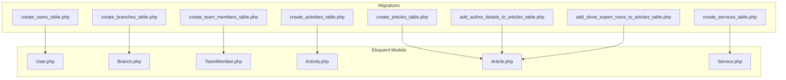
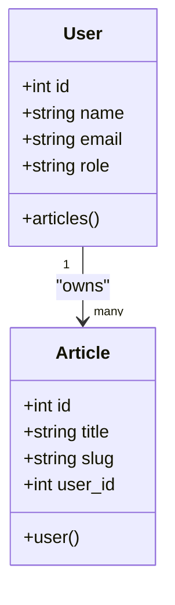

# Database Schema Overview

<cite>
**Referenced Files in This Document**
- [0001_01_01_000000_create_users_table.php](file://database/migrations/0001_01_01_000000_create_users_table.php)
- [2026_04_20_133158_create_branches_table.php](file://database/migrations/2026_04_20_133158_create_branches_table.php)
- [2026_04_25_153659_create_team_members_table.php](file://database/migrations/2026_04_25_153659_create_team_members_table.php)
- [2026_04_30_045526_create_activities_table.php](file://database/migrations/2026_04_30_045526_create_activities_table.php)
- [2026_04_30_050400_create_articles_table.php](file://database/migrations/2026_04_30_050400_create_articles_table.php)
- [2026_04_30_051304_add_author_details_to_articles_table.php](file://database/migrations/2026_04_30_051304_add_author_details_to_articles_table.php)
- [2026_04_30_051535_add_show_expert_voice_to_articles_table.php](file://database/migrations/2026_04_30_051535_add_show_expert_voice_to_articles_table.php)
- [2026_04_30_055559_create_services_table.php](file://database/migrations/2026_04_30_055559_create_services_table.php)
- [User.php](file://app/Models/User.php)
- [Branch.php](file://app/Models/Branch.php)
- [TeamMember.php](file://app/Models/TeamMember.php)
- [Activity.php](file://app/Models/Activity.php)
- [Article.php](file://app/Models/Article.php)
- [Service.php](file://app/Models/Service.php)
</cite>

## Table of Contents
1. [Introduction](#introduction)
2. [Project Structure](#project-structure)
3. [Core Components](#core-components)
4. [Architecture Overview](#architecture-overview)
5. [Detailed Component Analysis](#detailed-component-analysis)
6. [Dependency Analysis](#dependency-analysis)
7. [Performance Considerations](#performance-considerations)
8. [Troubleshooting Guide](#troubleshooting-guide)
9. [Conclusion](#conclusion)
10. [Appendices](#appendices)

## Introduction
This document provides a comprehensive overview of EDUfa’s relational database schema. It documents the design philosophy, normalization strategies, and the current structure of key tables: users, branches, team_members, activities, articles, and services. It also explains primary key strategies, auto-increment patterns, unique constraints, indexes, and outlines migration history and schema evolution. Guidance on performance considerations and troubleshooting is included to support efficient operation and maintenance.

## Project Structure
EDUfa uses Laravel migrations to define and evolve the database schema. Migrations are grouped under database/migrations and correspond to logical features such as users, branches, team members, activities, articles, and services. Eloquent models in app/Models define fillable attributes and relationships that reflect the underlying schema.



**Diagram sources**
- [0001_01_01_000000_create_users_table.php:1-53](file://database/migrations/0001_01_01_000000_create_users_table.php#L1-L53)
- [2026_04_20_133158_create_branches_table.php:1-34](file://database/migrations/2026_04_20_133158_create_branches_table.php#L1-L34)
- [2026_04_25_153659_create_team_members_table.php:1-33](file://database/migrations/2026_04_25_153659_create_team_members_table.php#L1-L33)
- [2026_04_30_045526_create_activities_table.php:1-33](file://database/migrations/2026_04_30_045526_create_activities_table.php#L1-L33)
- [2026_04_30_050400_create_articles_table.php:1-35](file://database/migrations/2026_04_30_050400_create_articles_table.php#L1-L35)
- [2026_04_30_051304_add_author_details_to_articles_table.php:1-31](file://database/migrations/2026_04_30_051304_add_author_details_to_articles_table.php#L1-L31)
- [2026_04_30_051535_add_show_expert_voice_to_articles_table.php:1-29](file://database/migrations/2026_04_30_051535_add_show_expert_voice_to_articles_table.php#L1-L29)
- [2026_04_30_055559_create_services_table.php:1-31](file://database/migrations/2026_04_30_055559_create_services_table.php#L1-L31)

**Section sources**
- [0001_01_01_000000_create_users_table.php:1-53](file://database/migrations/0001_01_01_000000_create_users_table.php#L1-L53)
- [2026_04_20_133158_create_branches_table.php:1-34](file://database/migrations/2026_04_20_133158_create_branches_table.php#L1-L34)
- [2026_04_25_153659_create_team_members_table.php:1-33](file://database/migrations/2026_04_25_153659_create_team_members_table.php#L1-L33)
- [2026_04_30_045526_create_activities_table.php:1-33](file://database/migrations/2026_04_30_045526_create_activities_table.php#L1-L33)
- [2026_04_30_050400_create_articles_table.php:1-35](file://database/migrations/2026_04_30_050400_create_articles_table.php#L1-L35)
- [2026_04_30_051304_add_author_details_to_articles_table.php:1-31](file://database/migrations/2026_04_30_051304_add_author_details_to_articles_table.php#L1-L31)
- [2026_04_30_051535_add_show_expert_voice_to_articles_table.php:1-29](file://database/migrations/2026_04_30_051535_add_show_expert_voice_to_articles_table.php#L1-L29)
- [2026_04_30_055559_create_services_table.php:1-31](file://database/migrations/2026_04_30_055559_create_services_table.php#L1-L31)

## Core Components
This section summarizes the six core relational tables and their roles in the system.

- Users: Central authentication and authorization table with role-based access control.
- Branches: Geographic locations with optional coordinates and photos.
- Team Members: Staff and therapists with roles and optional images.
- Activities: Media-rich activity records with type and media metadata.
- Articles: Content posts authored by users with optional author attribution and visibility controls.
- Services: Service offerings with slug-based URLs and optional external form links.

Primary keys are auto-incremented integers via id(). Unique constraints are enforced on email (users), slug (articles/services), and composite identifiers where applicable. Timestamps are consistently used for audit trails.

**Section sources**
- [0001_01_01_000000_create_users_table.php:16-25](file://database/migrations/0001_01_01_000000_create_users_table.php#L16-L25)
- [2026_04_20_133158_create_branches_table.php:14-23](file://database/migrations/2026_04_20_133158_create_branches_table.php#L14-L23)
- [2026_04_25_153659_create_team_members_table.php:14-22](file://database/migrations/2026_04_25_153659_create_team_members_table.php#L14-L22)
- [2026_04_30_045526_create_activities_table.php:14-22](file://database/migrations/2026_04_30_045526_create_activities_table.php#L14-L22)
- [2026_04_30_050400_create_articles_table.php:14-24](file://database/migrations/2026_04_30_050400_create_articles_table.php#L14-L24)
- [2026_04_30_055559_create_services_table.php:14-20](file://database/migrations/2026_04_30_055559_create_services_table.php#L14-L20)

## Architecture Overview
The schema follows a normalized design with clear separation of concerns:
- Users own Articles (one-to-many).
- Branches, Team Members, and Activities are standalone entities with no cross-references.
- Services are independent service entries with optional external form integration.

```mermaid
erDiagram
USERS {
int id PK
string name
string email UK
timestamp email_verified_at
string password
string role
string remember_token
timestamps
}
BRANCHES {
int id PK
string city
string type
text address
decimal latitude
decimal longitude
string photo_path
timestamps
}
TEAM_MEMBERS {
int id PK
string name
string type
string role
text description
string image_path
timestamps
}
ACTIVITIES {
int id PK
string title
text description
enum type
enum media_type
string media_path
timestamps
}
ARTICLES {
int id PK
string title
string slug UK
text content
string thumbnail_path
string category
int user_id FK
enum status
string author_name
string author_role
text author_bio
boolean show_expert_voice
timestamps
}
SERVICES {
int id PK
string title
string slug UK
string google_form_url
timestamps
}
USERS ||--o{ ARTICLES : "owns"
```

**Diagram sources**
- [0001_01_01_000000_create_users_table.php:16-25](file://database/migrations/0001_01_01_000000_create_users_table.php#L16-L25)
- [2026_04_30_050400_create_articles_table.php:14-24](file://database/migrations/2026_04_30_050400_create_articles_table.php#L14-L24)
- [2026_04_30_055559_create_services_table.php:14-20](file://database/migrations/2026_04_30_055559_create_services_table.php#L14-L20)

## Detailed Component Analysis

### Users Table
- Purpose: Store authentication credentials, roles, and session-related tokens.
- Primary Key: Auto-incremented integer id.
- Unique Constraints: email.
- Additional Fields: name, password (hashed), role (enum), email_verified_at, remember_token, timestamps.
- Notes: Sessions table references user_id for session management.

**Section sources**
- [0001_01_01_000000_create_users_table.php:16-25](file://database/migrations/0001_01_01_000000_create_users_table.php#L16-L25)
- [0001_01_01_000000_create_users_table.php:33-40](file://database/migrations/0001_01_01_000000_create_users_table.php#L33-L40)
- [User.php:13-31](file://app/Models/User.php#L13-L31)

### Branches Table
- Purpose: Represent branch locations with optional geographic coordinates and photos.
- Primary Key: Auto-incremented integer id.
- Unique Constraints: None.
- Additional Fields: city, type, address, latitude, longitude, photo_path, timestamps.
- Indexes: None declared in migration; consider adding spatial/geographic indexes if queries filter by proximity.

**Section sources**
- [2026_04_20_133158_create_branches_table.php:14-23](file://database/migrations/2026_04_20_133158_create_branches_table.php#L14-L23)
- [Branch.php:12-34](file://app/Models/Branch.php#L12-L34)

### Team Members Table
- Purpose: Store staff and therapist profiles with roles and optional images.
- Primary Key: Auto-incremented integer id.
- Unique Constraints: None.
- Additional Fields: name, type, role, description, image_path, timestamps.
- Notes: Provides polymorphic-like categorization via type and role fields.

**Section sources**
- [2026_04_25_153659_create_team_members_table.php:14-22](file://database/migrations/2026_04_25_153659_create_team_members_table.php#L14-L22)
- [TeamMember.php:9-22](file://app/Models/TeamMember.php#L9-L22)

### Activities Table
- Purpose: Record activity content with media metadata.
- Primary Key: Auto-incremented integer id.
- Unique Constraints: None.
- Additional Fields: title, description, type (enum: terapi, kelas), media_type (enum: photo, video), media_path, timestamps.
- Notes: media_path stores either a URL (video) or a path (photo).

**Section sources**
- [2026_04_30_045526_create_activities_table.php:14-22](file://database/migrations/2026_04_30_045526_create_activities_table.php#L14-L22)
- [Activity.php](file://app/Models/Activity.php#L9)

### Articles Table
- Purpose: Publish content posts with authorship and optional expert voice display.
- Primary Key: Auto-incremented integer id.
- Unique Constraints: slug; user_id constrained to users.
- Additional Fields: title, slug, content, thumbnail_path, category, user_id, status (enum: published, draft), author_name, author_role, author_bio, show_expert_voice, timestamps.
- Relationships: Belongs to User via user_id.

**Section sources**
- [2026_04_30_050400_create_articles_table.php:14-24](file://database/migrations/2026_04_30_050400_create_articles_table.php#L14-L24)
- [2026_04_30_051304_add_author_details_to_articles_table.php:14-18](file://database/migrations/2026_04_30_051304_add_author_details_to_articles_table.php#L14-L18)
- [2026_04_30_051535_add_show_expert_voice_to_articles_table.php:14-15](file://database/migrations/2026_04_30_051535_add_show_expert_voice_to_articles_table.php#L14-L15)
- [Article.php:23-26](file://app/Models/Article.php#L23-L26)

### Services Table
- Purpose: Define service offerings with slug-based routing and optional Google Form integration.
- Primary Key: Auto-incremented integer id.
- Unique Constraints: slug.
- Additional Fields: title, slug, google_form_url, timestamps.

**Section sources**
- [2026_04_30_055559_create_services_table.php:14-20](file://database/migrations/2026_04_30_055559_create_services_table.php#L14-L20)
- [Service.php:9-13](file://app/Models/Service.php#L9-L13)

## Dependency Analysis
This section maps foreign key relationships and model-level associations.



**Diagram sources**
- [Article.php:23-26](file://app/Models/Article.php#L23-L26)
- [2026_04_30_050400_create_articles_table.php](file://database/migrations/2026_04_30_050400_create_articles_table.php#L21)

**Section sources**
- [Article.php:23-26](file://app/Models/Article.php#L23-L26)
- [2026_04_30_050400_create_articles_table.php](file://database/migrations/2026_04_30_050400_create_articles_table.php#L21)

## Performance Considerations
- Indexes
  - Consider adding indexes on frequently filtered columns:
    - articles.user_id for author-based queries.
    - articles.category for category-based filtering.
    - articles.status for draft/published filtering.
    - branches.city for location-based lookups.
- Full-Text Search
  - For content-heavy tables like articles.content, consider full-text indexes to optimize search performance.
- Caching
  - Frequently accessed static lists (e.g., branches, services) can benefit from caching strategies to reduce database load.
- Query Patterns
  - Prefer selective column retrieval and pagination for large result sets.
  - Use eager loading for relationships to avoid N+1 query problems.

[No sources needed since this section provides general guidance]

## Troubleshooting Guide
- Duplicate Slug Errors
  - Symptom: Insertion failures on articles or services slugs.
  - Resolution: Ensure slug uniqueness during creation/update; consider canonicalization or suffix generation.
- Orphaned Records
  - Symptom: Articles without associated users.
  - Resolution: Enforce referential integrity; cascade deletes if appropriate for content lifecycle.
- Photo/Image Paths
  - Symptom: Broken image URLs.
  - Resolution: Use model accessors to normalize absolute vs. storage paths; verify storage disk availability.

**Section sources**
- [2026_04_30_050400_create_articles_table.php](file://database/migrations/2026_04_30_050400_create_articles_table.php#L17)
- [2026_04_30_055559_create_services_table.php](file://database/migrations/2026_04_30_055559_create_services_table.php#L17)
- [Branch.php:23-34](file://app/Models/Branch.php#L23-L34)
- [TeamMember.php:19-22](file://app/Models/TeamMember.php#L19-L22)

## Conclusion
EDUfa’s schema emphasizes simplicity and clarity with normalized relations and explicit ownership semantics. The design supports content publishing, location management, team profiles, activity media, and service listings. Future enhancements can focus on targeted indexing, full-text search, and caching to improve query performance and user experience.

[No sources needed since this section summarizes without analyzing specific files]

## Appendices

### Migration History and Evolution
- Initial Setup
  - Users, password reset tokens, and sessions tables created.
- Branches
  - Added branches table for location management.
- Team Members
  - Added team_members table for staff and therapist profiles.
- Activities
  - Added activities table for media-driven content.
- Articles
  - Created articles table with user ownership.
  - Enhanced with author details (name, role, bio).
  - Added show_expert_voice toggle.
- Services
  - Created services table with slug and optional Google Form URL.

**Section sources**
- [0001_01_01_000000_create_users_table.php:12-51](file://database/migrations/0001_01_01_000000_create_users_table.php#L12-L51)
- [2026_04_20_133158_create_branches_table.php:12-32](file://database/migrations/2026_04_20_133158_create_branches_table.php#L12-L32)
- [2026_04_25_153659_create_team_members_table.php:12-31](file://database/migrations/2026_04_25_153659_create_team_members_table.php#L12-L31)
- [2026_04_30_045526_create_activities_table.php:12-31](file://database/migrations/2026_04_30_045526_create_activities_table.php#L12-L31)
- [2026_04_30_050400_create_articles_table.php:12-33](file://database/migrations/2026_04_30_050400_create_articles_table.php#L12-L33)
- [2026_04_30_051304_add_author_details_to_articles_table.php:12-29](file://database/migrations/2026_04_30_051304_add_author_details_to_articles_table.php#L12-L29)
- [2026_04_30_051535_add_show_expert_voice_to_articles_table.php:12-27](file://database/migrations/2026_04_30_051535_add_show_expert_voice_to_articles_table.php#L12-L27)
- [2026_04_30_055559_create_services_table.php:12-29](file://database/migrations/2026_04_30_055559_create_services_table.php#L12-L29)