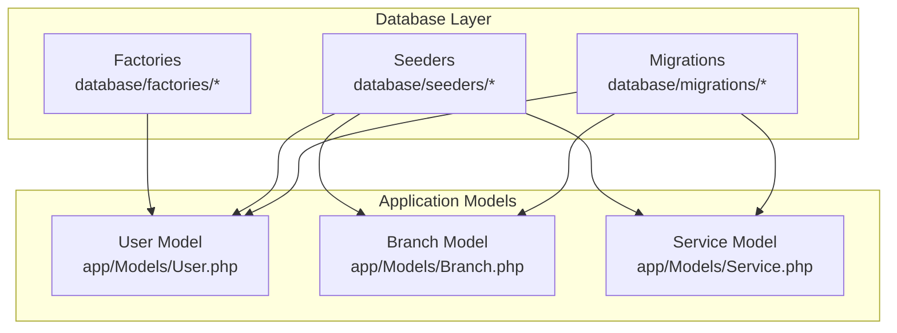
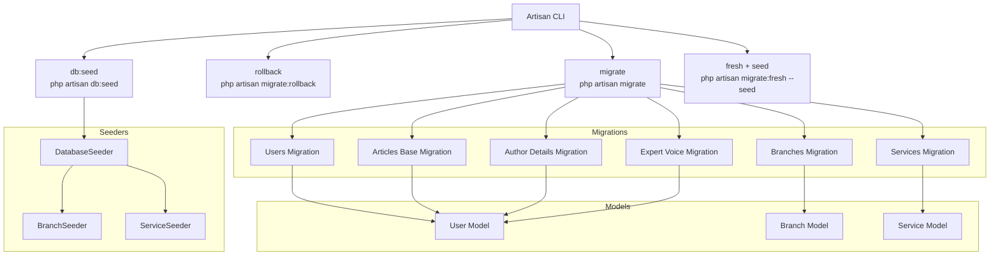
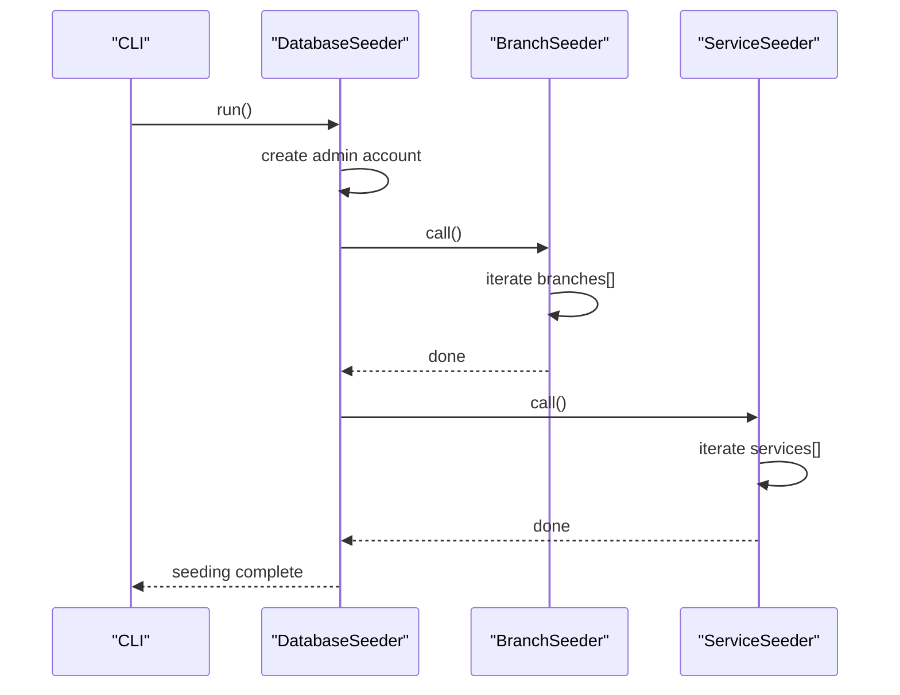
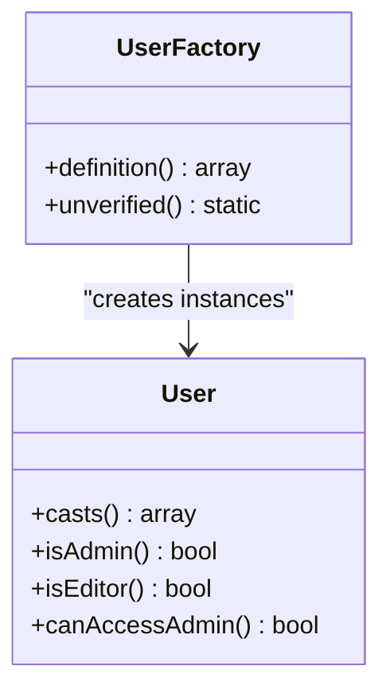
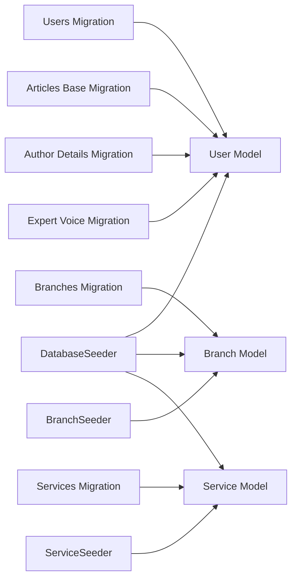

# Migration and Seed Management

<cite>
**Referenced Files in This Document**
- [0001_01_01_000000_create_users_table.php](file://database/migrations/0001_01_01_000000_create_users_table.php)
- [2026_04_20_133158_create_branches_table.php](file://database/migrations/2026_04_20_133158_create_branches_table.php)
- [2026_04_30_055559_create_services_table.php](file://database/migrations/2026_04_30_055559_create_services_table.php)
- [2026_04_25_153659_create_team_members_table.php](file://database/migrations/2026_04_25_153659_create_team_members_table.php)
- [2026_04_30_045526_create_activities_table.php](file://database/migrations/2026_04_30_045526_create_activities_table.php)
- [2026_04_30_050400_create_articles_table.php](file://database/migrations/2026_04_30_050400_create_articles_table.php)
- [2026_04_30_051304_add_author_details_to_articles_table.php](file://database/migrations/2026_04_30_051304_add_author_details_to_articles_table.php)
- [2026_04_30_051535_add_show_expert_voice_to_articles_table.php](file://database/migrations/2026_04_30_051535_add_show_expert_voice_to_articles_table.php)
- [DatabaseSeeder.php](file://database/seeders/DatabaseSeeder.php)
- [BranchSeeder.php](file://database/seeders/BranchSeeder.php)
- [ServiceSeeder.php](file://database/seeders/ServiceSeeder.php)
- [UserFactory.php](file://database/factories/UserFactory.php)
- [User.php](file://app/Models/User.php)
- [Branch.php](file://app/Models/Branch.php)
- [Service.php](file://app/Models/Service.php)
</cite>

## Table of Contents
1. [Introduction](#introduction)
2. [Project Structure](#project-structure)
3. [Core Components](#core-components)
4. [Architecture Overview](#architecture-overview)
5. [Detailed Component Analysis](#detailed-component-analysis)
6. [Dependency Analysis](#dependency-analysis)
7. [Performance Considerations](#performance-considerations)
8. [Troubleshooting Guide](#troubleshooting-guide)
9. [Conclusion](#conclusion)
10. [Appendices](#appendices)

## Introduction
This document explains EDUfa’s database migration and seeding strategy. It covers the migration lifecycle (creation, execution, rollback, and version management), the seeder architecture for initial data population (including BranchSeeder, ServiceSeeder, and DatabaseSeeder), and the factory pattern for generating test data via UserFactory. It also provides best practices for writing maintainable migrations, handling schema changes, managing production deployments, and strategies for seeding across environments. Finally, it outlines troubleshooting steps, common pitfalls, and recovery procedures.

## Project Structure
The migration and seeding assets are organized under the database directory:
- Migrations: Stored under database/migrations with timestamped filenames indicating order and logical grouping.
- Seeders: Stored under database/seeders with dedicated classes for different domains.
- Factories: Stored under database/factories for model data generation.

**Diagram sources**
- [0001_01_01_000000_create_users_table.php:1-53](file://database/migrations/0001_01_01_000000_create_users_table.php#L1-L53)
- [2026_04_20_133158_create_branches_table.php:1-34](file://database/migrations/2026_04_20_133158_create_branches_table.php#L1-L34)
- [2026_04_30_055559_create_services_table.php:1-31](file://database/migrations/2026_04_30_055559_create_services_table.php#L1-L31)
- [DatabaseSeeder.php:1-32](file://database/seeders/DatabaseSeeder.php#L1-L32)
- [BranchSeeder.php:1-67](file://database/seeders/BranchSeeder.php#L1-L67)
- [ServiceSeeder.php:1-58](file://database/seeders/ServiceSeeder.php#L1-L58)
- [UserFactory.php:1-46](file://database/factories/UserFactory.php#L1-L46)
- [User.php:1-47](file://app/Models/User.php#L1-L47)
- [Branch.php:1-36](file://app/Models/Branch.php#L1-L36)
- [Service.php:1-15](file://app/Models/Service.php#L1-L15)

**Section sources**
- [0001_01_01_000000_create_users_table.php:1-53](file://database/migrations/0001_01_01_000000_create_users_table.php#L1-L53)
- [DatabaseSeeder.php:1-32](file://database/seeders/DatabaseSeeder.php#L1-L32)
- [UserFactory.php:1-46](file://database/factories/UserFactory.php#L1-L46)

## Core Components
- Migrations: Each migration encapsulates a single schema change with an up() method to apply and a down() method to revert. Timestamps ensure deterministic ordering.
- Seeders: Domain-specific seeders populate initial data. DatabaseSeeder orchestrates seeding order and creates the admin account.
- Factories: UserFactory generates realistic test records with hashed passwords and optional verification states.

Key implementation highlights:
- Users, sessions, and password reset tokens are created in a single migration.
- Branches and services are seeded via dedicated seeders.
- UserFactory defines default attributes and supports an unverified state.

**Section sources**
- [0001_01_01_000000_create_users_table.php:12-51](file://database/migrations/0001_01_01_000000_create_users_table.php#L12-L51)
- [2026_04_20_133158_create_branches_table.php:12-32](file://database/migrations/2026_04_20_133158_create_branches_table.php#L12-L32)
- [2026_04_30_055559_create_services_table.php:12-29](file://database/migrations/2026_04_30_055559_create_services_table.php#L12-L29)
- [DatabaseSeeder.php:14-30](file://database/seeders/DatabaseSeeder.php#L14-L30)
- [BranchSeeder.php:15-66](file://database/seeders/BranchSeeder.php#L15-L66)
- [ServiceSeeder.php:13-56](file://database/seeders/ServiceSeeder.php#L13-L56)
- [UserFactory.php:25-44](file://database/factories/UserFactory.php#L25-L44)

## Architecture Overview
The migration and seeding architecture follows Laravel conventions:
- Migrations define schema changes and are executed in timestamp order.
- Seeders depend on models and can call other seeders to build layered datasets.
- Factories support repeatable, randomized test data generation.

**Diagram sources**
- [0001_01_01_000000_create_users_table.php:1-53](file://database/migrations/0001_01_01_000000_create_users_table.php#L1-L53)
- [2026_04_20_133158_create_branches_table.php:1-34](file://database/migrations/2026_04_20_133158_create_branches_table.php#L1-L34)
- [2026_04_30_055559_create_services_table.php:1-31](file://database/migrations/2026_04_30_055559_create_services_table.php#L1-L31)
- [2026_04_30_050400_create_articles_table.php:1-35](file://database/migrations/2026_04_30_050400_create_articles_table.php#L1-L35)
- [2026_04_30_051304_add_author_details_to_articles_table.php:1-31](file://database/migrations/2026_04_30_051304_add_author_details_to_articles_table.php#L1-L31)
- [2026_04_30_051535_add_show_expert_voice_to_articles_table.php:1-29](file://database/migrations/2026_04_30_051535_add_show_expert_voice_to_articles_table.php#L1-L29)
- [DatabaseSeeder.php:1-32](file://database/seeders/DatabaseSeeder.php#L1-L32)
- [BranchSeeder.php:1-67](file://database/seeders/BranchSeeder.php#L1-L67)
- [ServiceSeeder.php:1-58](file://database/seeders/ServiceSeeder.php#L1-L58)
- [User.php:1-47](file://app/Models/User.php#L1-L47)
- [Branch.php:1-36](file://app/Models/Branch.php#L1-L36)
- [Service.php:1-15](file://app/Models/Service.php#L1-L15)

## Detailed Component Analysis

### Migration Lifecycle
Each migration implements:
- up(): Apply schema changes.
- down(): Revert schema changes.

Lifecycle stages:
- Creation: Add a new timestamped migration file.
- Execution: Run php artisan migrate to apply pending migrations.
- Rollback: Run php artisan migrate:rollback to revert the last batch.
- Version management: Use php artisan migrate:status to inspect applied versions; timestamps control ordering.

Best practices:
- Keep migrations atomic and reversible.
- Use Schema::table for alterations; avoid destructive operations without proper down().
- Add indexes for foreign keys and frequently queried columns.
- Prefer nullable columns for optional data and defaults for booleans.

Common pitfalls:
- Modifying primary keys or unique constraints without down() support.
- Omitting foreign key constraints leading to orphaned records.
- Large data transformations in migrations; move heavy work to seeders or jobs.

Recovery:
- Use migrate:fresh to rebuild schema and re-seed in development.
- For production rollbacks, coordinate with DBAs and maintain backups.

**Section sources**
- [0001_01_01_000000_create_users_table.php:12-51](file://database/migrations/0001_01_01_000000_create_users_table.php#L12-L51)
- [2026_04_20_133158_create_branches_table.php:12-32](file://database/migrations/2026_04_20_133158_create_branches_table.php#L12-L32)
- [2026_04_30_055559_create_services_table.php:12-29](file://database/migrations/2026_04_30_055559_create_services_table.php#L12-L29)
- [2026_04_30_050400_create_articles_table.php:12-33](file://database/migrations/2026_04_30_050400_create_articles_table.php#L12-L33)
- [2026_04_30_051304_add_author_details_to_articles_table.php:12-29](file://database/migrations/2026_04_30_051304_add_author_details_to_articles_table.php#L12-L29)
- [2026_04_30_051535_add_show_expert_voice_to_articles_table.php:12-27](file://database/migrations/2026_04_30_051535_add_show_expert_voice_to_articles_table.php#L12-L27)

### Seeder Architecture
DatabaseSeeder orchestrates seeding:
- Creates a default admin account using environment variables.
- Calls BranchSeeder and ServiceSeeder in sequence.

BranchSeeder:
- Seeds branch locations with city, type, address, latitude, longitude, and placeholder photo_path.

ServiceSeeder:
- Seeds service entries ensuring uniqueness by slug using updateOrCreate.

**Diagram sources**
- [DatabaseSeeder.php:14-30](file://database/seeders/DatabaseSeeder.php#L14-L30)
- [BranchSeeder.php:15-66](file://database/seeders/BranchSeeder.php#L15-L66)
- [ServiceSeeder.php:13-56](file://database/seeders/ServiceSeeder.php#L13-L56)

**Section sources**
- [DatabaseSeeder.php:14-30](file://database/seeders/DatabaseSeeder.php#L14-L30)
- [BranchSeeder.php:15-66](file://database/seeders/BranchSeeder.php#L15-L66)
- [ServiceSeeder.php:13-56](file://database/seeders/ServiceSeeder.php#L13-L56)

### Factory Pattern for Test Data
UserFactory:
- Generates realistic default attributes including hashed passwords.
- Supports an unverified state via unverified() method.

Usage patterns:
- Generate a single user record for tests.
- Use unverified() to simulate unconfirmed emails.
- Combine with model relations for complex fixtures.

**Diagram sources**
- [UserFactory.php:13-45](file://database/factories/UserFactory.php#L13-L45)
- [User.php:15-46](file://app/Models/User.php#L15-L46)

**Section sources**
- [UserFactory.php:25-44](file://database/factories/UserFactory.php#L25-L44)
- [User.php:25-46](file://app/Models/User.php#L25-L46)

### Data Seeding Strategies by Environment
- Local development: Seed with small, representative datasets using BranchSeeder and ServiceSeeder.
- Staging: Mirror production-like data volumes; consider using factories for randomized content.
- Production: Seed minimal viable data (e.g., admin account) and rely on controlled updates via migrations. Avoid heavy data in seeders; prefer import scripts or jobs.

Environment variables for seeding:
- ADMIN_EMAIL, ADMIN_NAME, ADMIN_PASSWORD to provision the admin account.

**Section sources**
- [DatabaseSeeder.php:16-24](file://database/seeders/DatabaseSeeder.php#L16-L24)

## Dependency Analysis
Migrations and seeders depend on models and database schema. The following diagram shows how migrations relate to models and how seeders depend on models.

**Diagram sources**
- [0001_01_01_000000_create_users_table.php:1-53](file://database/migrations/0001_01_01_000000_create_users_table.php#L1-L53)
- [2026_04_20_133158_create_branches_table.php:1-34](file://database/migrations/2026_04_20_133158_create_branches_table.php#L1-L34)
- [2026_04_30_055559_create_services_table.php:1-31](file://database/migrations/2026_04_30_055559_create_services_table.php#L1-L31)
- [2026_04_30_050400_create_articles_table.php:1-35](file://database/migrations/2026_04_30_050400_create_articles_table.php#L1-L35)
- [2026_04_30_051304_add_author_details_to_articles_table.php:1-31](file://database/migrations/2026_04_30_051304_add_author_details_to_articles_table.php#L1-L31)
- [2026_04_30_051535_add_show_expert_voice_to_articles_table.php:1-29](file://database/migrations/2026_04_30_051535_add_show_expert_voice_to_articles_table.php#L1-L29)
- [DatabaseSeeder.php:1-32](file://database/seeders/DatabaseSeeder.php#L1-L32)
- [BranchSeeder.php:1-67](file://database/seeders/BranchSeeder.php#L1-L67)
- [ServiceSeeder.php:1-58](file://database/seeders/ServiceSeeder.php#L1-L58)
- [User.php:1-47](file://app/Models/User.php#L1-L47)
- [Branch.php:1-36](file://app/Models/Branch.php#L1-L36)
- [Service.php:1-15](file://app/Models/Service.php#L1-L15)

**Section sources**
- [User.php:1-47](file://app/Models/User.php#L1-L47)
- [Branch.php:1-36](file://app/Models/Branch.php#L1-L36)
- [Service.php:1-15](file://app/Models/Service.php#L1-L15)

## Performance Considerations
- Batch operations: Use chunked inserts in seeders for large datasets.
- Indexing: Add indexes on foreign keys and frequently filtered columns.
- Transactions: Wrap heavy seeding in transactions to reduce overhead and enable rollback.
- Factories: Use factories for targeted, randomized data without loading large fixtures.

## Troubleshooting Guide
Common issues and resolutions:
- Duplicate key errors during seeding: Use updateOrCreate for slug-based uniqueness.
- Foreign key constraint failures: Ensure dependent migrations are applied in the correct order.
- Forgotten admin credentials: Recreate the admin account via DatabaseSeeder using environment variables.
- Rollback failures: Verify down() methods exist and handle column drops gracefully.

Recovery procedures:
- Reset development database: migrate:fresh followed by db:seed.
- Partial rollback: migrate:rollback to revert the last batch.
- Inspect status: migrate:status to review applied migrations.

**Section sources**
- [ServiceSeeder.php:54-55](file://database/seeders/ServiceSeeder.php#L54-L55)
- [DatabaseSeeder.php:16-24](file://database/seeders/DatabaseSeeder.php#L16-L24)

## Conclusion
EDUfa’s migration and seeding strategy leverages Laravel’s conventions to maintain a clean, ordered schema evolution and reproducible dataset initialization. By keeping migrations atomic, seeders domain-focused, and factories for test data, teams can confidently manage schema changes and deploy reliable environments. Adhering to best practices and using the troubleshooting procedures outlined here ensures smooth development and production operations.

## Appendices
- Best practices checklist:
  - Always write reversible migrations.
  - Use updateOrCreate in seeders for idempotent data.
  - Keep seeders lightweight; defer heavy data to import jobs.
  - Use factories for randomized, repeatable test data.
  - Review migrate:status regularly to track applied changes.