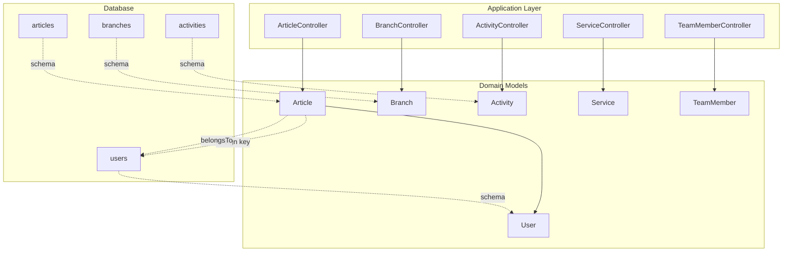
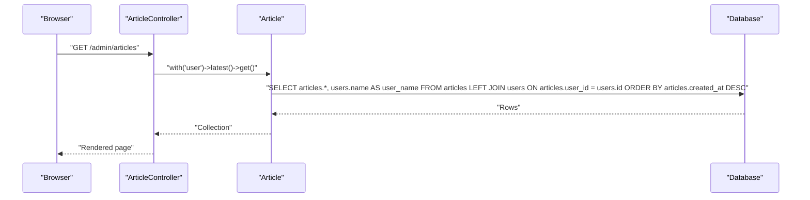
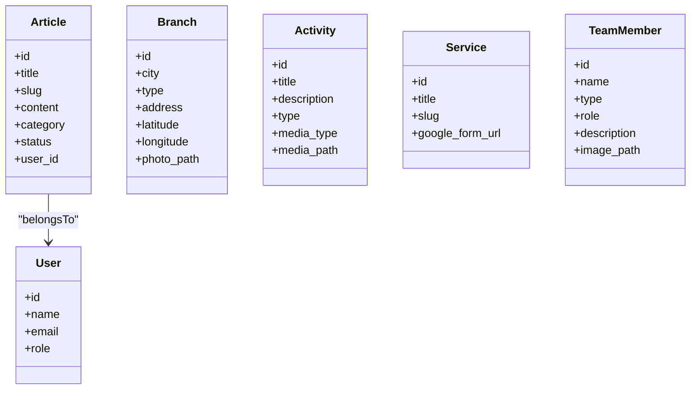

# Query Patterns and Performance

<cite>
**Referenced Files in This Document**
- [User.php](file://app/Models/User.php)
- [Article.php](file://app/Models/Article.php)
- [Branch.php](file://app/Models/Branch.php)
- [Activity.php](file://app/Models/Activity.php)
- [Service.php](file://app/Models/Service.php)
- [TeamMember.php](file://app/Models/TeamMember.php)
- [ArticleController.php](file://app/Http/Controllers/ArticleController.php)
- [BranchController.php](file://app/Http/Controllers/BranchController.php)
- [ActivityController.php](file://app/Http/Controllers/ActivityController.php)
- [ServiceController.php](file://app/Http/Controllers/ServiceController.php)
- [TeamMemberController.php](file://app/Http/Controllers/TeamMemberController.php)
- [database.php](file://config/database.php)
- [create_users_table.php](file://database/migrations/0001_01_01_000000_create_users_table.php)
- [create_articles_table.php](file://database/migrations/2026_04_30_050400_create_articles_table.php)
- [create_activities_table.php](file://database/migrations/2026_04_30_045526_create_activities_table.php)
- [create_branches_table.php](file://database/migrations/2026_04_20_133158_create_branches_table.php)
</cite>

## Table of Contents
1. [Introduction](#introduction)
2. [Project Structure](#project-structure)
3. [Core Components](#core-components)
4. [Architecture Overview](#architecture-overview)
5. [Detailed Component Analysis](#detailed-component-analysis)
6. [Dependency Analysis](#dependency-analysis)
7. [Performance Considerations](#performance-considerations)
8. [Troubleshooting Guide](#troubleshooting-guide)
9. [Conclusion](#conclusion)

## Introduction
This document focuses on EDUfa’s common query patterns and database performance optimization strategies. It covers frequently used Eloquent relationships, eager loading patterns, and query builder optimizations. It also documents indexing strategies for commonly queried fields, search and filtering approaches, and practical guidance for monitoring slow queries. Finally, it outlines caching strategies, connection pooling considerations, read replica usage, and techniques to avoid N+1 query problems.

## Project Structure
EDUfa follows a standard Laravel structure with models under app/Models, controllers under app/Http/Controllers, and database configuration under config/database.php. Migrations reside under database/migrations and define the schema for Users, Articles, Activities, Branches, and related tables.

**Diagram sources**
- [ArticleController.php:1-122](file://app/Http/Controllers/ArticleController.php#L1-L122)
- [BranchController.php:1-88](file://app/Http/Controllers/BranchController.php#L1-L88)
- [ActivityController.php:1-107](file://app/Http/Controllers/ActivityController.php#L1-L107)
- [ServiceController.php:1-31](file://app/Http/Controllers/ServiceController.php#L1-L31)
- [TeamMemberController.php:1-72](file://app/Http/Controllers/TeamMemberController.php#L1-L72)
- [Article.php:1-28](file://app/Models/Article.php#L1-L28)
- [User.php:1-47](file://app/Models/User.php#L1-L47)
- [create_articles_table.php:1-35](file://database/migrations/2026_04_30_050400_create_articles_table.php#L1-L35)
- [create_users_table.php:1-53](file://database/migrations/0001_01_01_000000_create_users_table.php#L1-L53)
- [create_activities_table.php:1-33](file://database/migrations/2026_04_30_045526_create_activities_table.php#L1-L33)
- [create_branches_table.php:1-34](file://database/migrations/2026_04_20_133158_create_branches_table.php#L1-L34)

**Section sources**
- [database.php:1-185](file://config/database.php#L1-L185)

## Core Components
- Models define Eloquent relationships and attributes:
  - Article belongs to User via user_id.
  - Branch, Activity, Service, TeamMember are standalone models with localizable attributes and optional media paths.
- Controllers orchestrate queries:
  - ArticleController demonstrates eager loading of related User data.
  - BranchController, ActivityController, ServiceController, TeamMemberController perform listing and CRUD operations.

Key observations:
- Eager loading is used in ArticleController to avoid N+1 queries when rendering admin article listings.
- Ordering is applied in several controllers to optimize retrieval and pagination readiness.
- Foreign keys and unique constraints are defined in migrations to support efficient joins and lookups.

**Section sources**
- [Article.php:23-26](file://app/Models/Article.php#L23-L26)
- [ArticleController.php:18-21](file://app/Http/Controllers/ArticleController.php#L18-L21)
- [BranchController.php:17-22](file://app/Http/Controllers/BranchController.php#L17-L22)
- [ActivityController.php:15-20](file://app/Http/Controllers/ActivityController.php#L15-L20)
- [ServiceController.php:11-16](file://app/Http/Controllers/ServiceController.php#L11-L16)
- [TeamMemberController.php:13-18](file://app/Http/Controllers/TeamMemberController.php#L13-L18)
- [create_articles_table.php:21](file://database/migrations/2026_04_30_050400_create_articles_table.php#L21)
- [create_users_table.php:19](file://database/migrations/0001_01_01_000000_create_users_table.php#L19)

## Architecture Overview
The application uses Eloquent ORM for data access. Controllers issue queries against models, which map to database tables defined by migrations. Relationships are declared in models to enable joins and eager loading.

**Diagram sources**
- [ArticleController.php:18-21](file://app/Http/Controllers/ArticleController.php#L18-L21)
- [Article.php:23-26](file://app/Models/Article.php#L23-L26)
- [create_articles_table.php:21](file://database/migrations/2026_04_30_050400_create_articles_table.php#L21)
- [create_users_table.php:19](file://database/migrations/0001_01_01_000000_create_users_table.php#L19)

## Detailed Component Analysis

### Eloquent Relationships and Eager Loading
- One-to-many relationship:
  - Article belongs to User via user_id.
  - Eager loading is used in ArticleController to fetch authors alongside articles, preventing N+1 queries.
- Localized attributes:
  - Branch, TeamMember expose computed attributes for URLs, reducing presentation logic in views.

Optimization pattern:
- Use with(...) to load related records in a single query when rendering lists.
- Prefer orderBy(...) to keep results sorted and ready for pagination.

**Section sources**
- [Article.php:23-26](file://app/Models/Article.php#L23-L26)
- [ArticleController.php:18-21](file://app/Http/Controllers/ArticleController.php#L18-L21)
- [Branch.php:21-34](file://app/Models/Branch.php#L21-L34)
- [TeamMember.php:17-22](file://app/Models/TeamMember.php#L17-L22)

### Query Builder Optimizations
Common patterns observed:
- latest() ordering for content-centric lists.
- get() for small lists; consider chunk() or cursor() for large datasets.
- Explicit select() when only a subset of columns is needed.
- where(...) conditions for filtering by category, type, or status.

Recommended enhancements:
- Add pagination for large lists.
- Use whereIn() for batch filters.
- Use join() with where clauses for cross-table filtering.

**Section sources**
- [ActivityController.php:17-19](file://app/Http/Controllers/ActivityController.php#L17-L19)
- [BranchController.php:19-21](file://app/Http/Controllers/BranchController.php#L19-L21)
- [TeamMemberController.php:15-17](file://app/Http/Controllers/TeamMemberController.php#L15-L17)

### Indexing Strategies for Commonly Queried Fields
- Unique indexes:
  - articles.slug is unique to enable fast lookups by slug.
- Foreign key indexes:
  - articles.user_id is constrained; ensure an index exists for efficient joins.
- Additional recommended indexes:
  - articles.status and articles.category for filtered queries.
  - activities.type and activities.media_type for segmentation.
  - branches.city for location-based filtering.
  - team_members.type and team_members.name for sorting and filtering.

Index coverage rationale:
- Support frequent ORDER BY and WHERE clauses.
- Reduce table scans and improve join performance.

**Section sources**
- [create_articles_table.php:17](file://database/migrations/2026_04_30_050400_create_articles_table.php#L17)
- [create_articles_table.php:21](file://database/migrations/2026_04_30_050400_create_articles_table.php#L21)
- [create_activities_table.php:18](file://database/migrations/2026_04_30_045526_create_activities_table.php#L18)
- [create_branches_table.php:16](file://database/migrations/2026_04_20_133158_create_branches_table.php#L16)
- [create_users_table.php:19](file://database/migrations/0001_01_01_000000_create_users_table.php#L19)

### Search and Filtering
- Filtering by enums and categories:
  - activities.type, activities.media_type.
  - articles.category, articles.status.
- Sorting:
  - articles.created_at via latest().
  - branches.city, team_members.type/name via orderBy(...).
- Suggested improvements:
  - Add full-text indexes for content-heavy fields (e.g., articles.title, articles.content).
  - Use whereBetween() for date ranges.
  - Use whereHas() to filter by related model attributes.

**Section sources**
- [ActivityController.php:17-19](file://app/Http/Controllers/ActivityController.php#L17-L19)
- [BranchController.php:19-21](file://app/Http/Controllers/BranchController.php#L19-L21)
- [TeamMemberController.php:15-17](file://app/Http/Controllers/TeamMemberController.php#L15-L17)
- [create_articles_table.php:20-23](file://database/migrations/2026_04_30_050400_create_articles_table.php#L20-L23)
- [create_activities_table.php:18-19](file://database/migrations/2026_04_30_045526_create_activities_table.php#L18-L19)

### Complex Queries for Reporting and Administration
Examples of optimized reporting-style queries:
- Top categories by article count:
  - Group by articles.category, count, order by count desc.
- Recent activity by type:
  - Filter activities.type, order by created_at desc, limit N.
- Branch statistics:
  - Count branches per city, optionally grouped by type.

Implementation tips:
- Use selectRaw() with groupBy() and having() for aggregations.
- Apply whereDate(), whereBetween() for time-based reports.
- Use union()/unionAll() for combining multiple report segments.

[No sources needed since this section provides general guidance]

### Avoiding N+1 Queries
- Symptom: Multiple queries executed inside a loop over a collection.
- Solution: Use with() to eager load relationships.
- Verified pattern:
  - ArticleController loads Article with related User to prevent N+1.

Additional techniques:
- Use load() for dynamic eager loading after fetching base records.
- Use each() with keys to iterate efficiently.
- Consider chunk() for large result sets to reduce memory pressure.

**Section sources**
- [ArticleController.php:18-21](file://app/Http/Controllers/ArticleController.php#L18-L21)
- [Article.php:23-26](file://app/Models/Article.php#L23-L26)

### Query Performance Monitoring and Slow Query Identification
- Enable query log in development:
  - Log SQL statements and durations.
- Use database profiling tools:
  - EXPLAIN/ANALYZE to inspect query plans.
- Monitor slow query logs:
  - Identify long-running queries and missing indexes.
- Instrument Laravel:
  - Use Telescope or similar tools to capture queries and exceptions.

[No sources needed since this section provides general guidance]

### Database Connection Pooling, Read Replicas, and Caching
- Connection pooling:
  - Configure persistent connections and pool sizes in database driver settings.
- Read replicas:
  - Route read-heavy queries to replicas using readAfter writes strategy.
- Caching:
  - Cache frequently accessed lookup data (e.g., branches, services).
  - Use tag-based cache invalidation for admin updates.

[No sources needed since this section provides general guidance]

## Dependency Analysis
The following diagram shows model-to-model and controller-to-model dependencies, highlighting relationships and data flow.

**Diagram sources**
- [Article.php:23-26](file://app/Models/Article.php#L23-L26)
- [User.php:1-47](file://app/Models/User.php#L1-L47)
- [ArticleController.php:18-21](file://app/Http/Controllers/ArticleController.php#L18-L21)

**Section sources**
- [Article.php:23-26](file://app/Models/Article.php#L23-L26)
- [ArticleController.php:18-21](file://app/Http/Controllers/ArticleController.php#L18-L21)

## Performance Considerations
- Use selective column retrieval with select() to minimize bandwidth and CPU.
- Prefer cursor() or chunk() for large datasets to reduce memory footprint.
- Add appropriate indexes for ORDER BY and WHERE clauses.
- Use soft deletes and scopes to encapsulate common filters.
- Batch inserts/updates for bulk operations.
- Minimize round-trips by combining queries where feasible.

[No sources needed since this section provides general guidance]

## Troubleshooting Guide
- Symptoms of N+1:
  - High number of identical queries in logs.
  - Slow response times on list pages.
- Fixes:
  - Add with() or load() to eager load relations.
  - Review loops that trigger additional queries.
- Slow queries:
  - Add EXPLAIN plans and missing indexes.
  - Replace table scans with indexed lookups.
- Memory issues:
  - Switch to cursor() or chunk() for large result sets.
  - Limit returned columns with select().

[No sources needed since this section provides general guidance]

## Conclusion
EDUfa’s current implementation demonstrates sound Eloquent usage with eager loading for author data and straightforward ordering for content lists. To further optimize performance, introduce targeted indexes, adopt pagination and aggregation patterns, and leverage caching and read replicas for scale. Monitoring and profiling remain essential to maintain query health as the dataset grows.