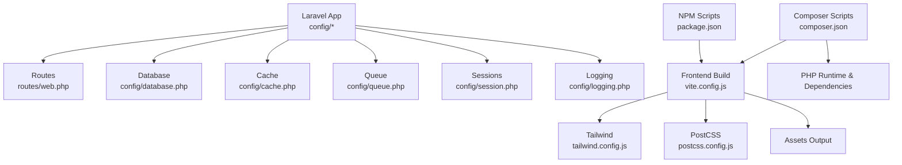
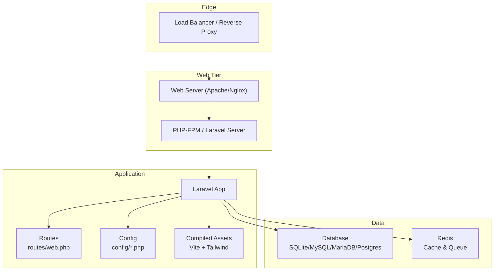
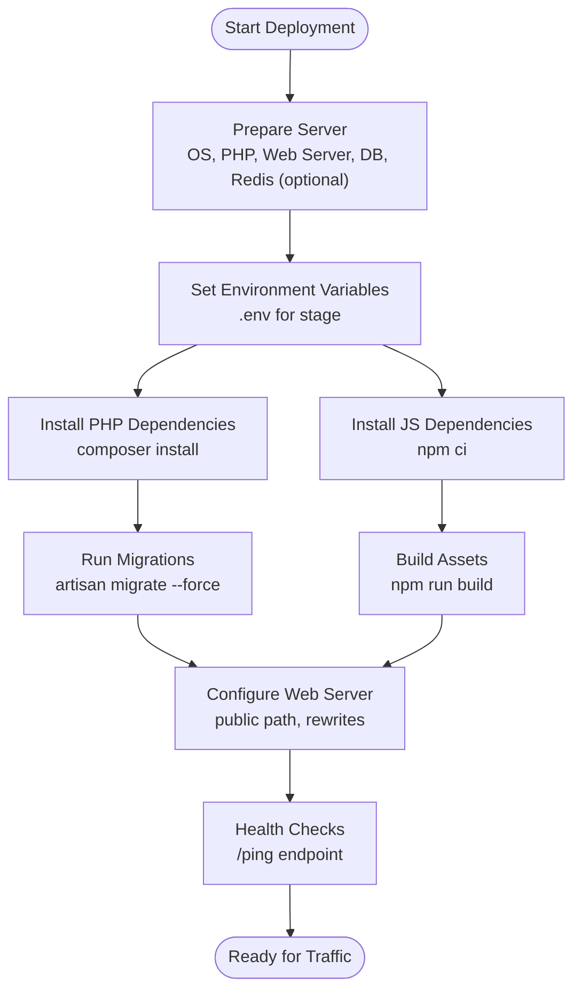
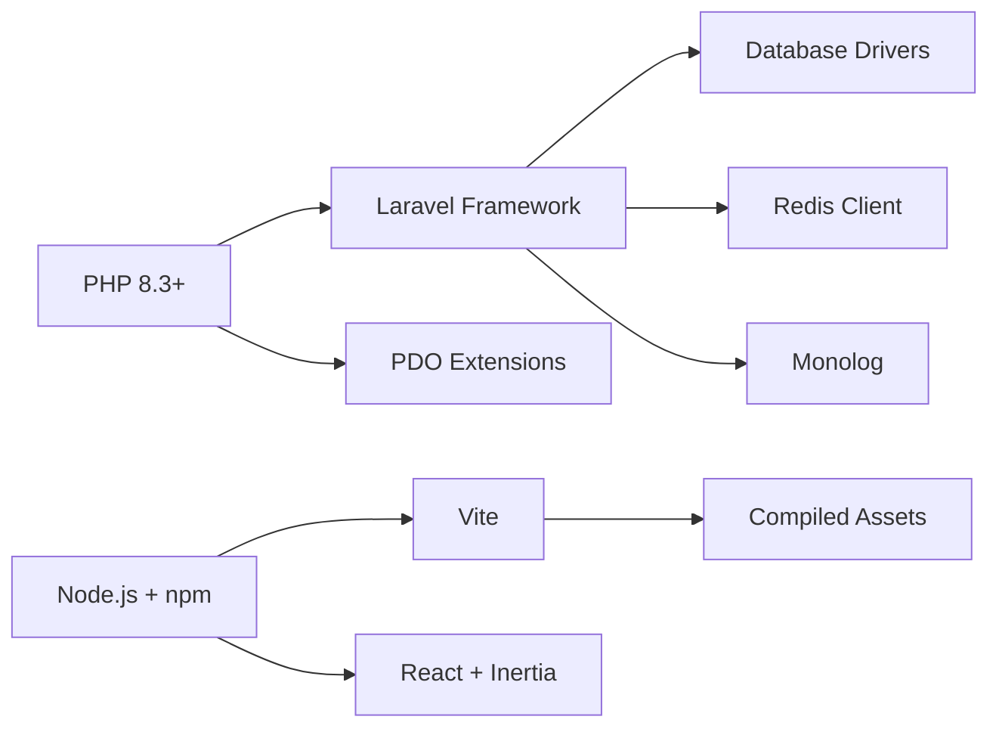

# Deployment and Operations

<cite>
**Referenced Files in This Document**
- [composer.json](file://composer.json)
- [package.json](file://package.json)
- [vite.config.js](file://vite.config.js)
- [tailwind.config.js](file://tailwind.config.js)
- [postcss.config.js](file://postcss.config.js)
- [config/app.php](file://config/app.php)
- [config/database.php](file://config/database.php)
- [config/cache.php](file://config/cache.php)
- [config/session.php](file://config/session.php)
- [config/queue.php](file://config/queue.php)
- [config/logging.php](file://config/logging.php)
- [routes/web.php](file://routes/web.php)
- [database/migrations/0001_01_01_000000_create_users_table.php](file://database/migrations/0001_01_01_000000_create_users_table.php)
- [database/migrations/2026_04_20_133158_create_branches_table.php](file://database/migrations/2026_04_20_133158_create_branches_table.php)
- [database/migrations/2026_04_30_045526_create_activities_table.php](file://database/migrations/2026_04_30_045526_create_activities_table.php)
</cite>

## Table of Contents
1. [Introduction](#introduction)
2. [Project Structure](#project-structure)
3. [Core Components](#core-components)
4. [Architecture Overview](#architecture-overview)
5. [Detailed Component Analysis](#detailed-component-analysis)
6. [Dependency Analysis](#dependency-analysis)
7. [Performance Considerations](#performance-considerations)
8. [Troubleshooting Guide](#troubleshooting-guide)
9. [Conclusion](#conclusion)
10. [Appendices](#appendices)

## Introduction
This document provides comprehensive guidance for deploying and operating EDUfa in production. It covers environment configuration across development, staging, and production, production deployment procedures (server requirements, database setup, asset compilation), monitoring and logging strategies, maintenance procedures (backups, cache clearing, log rotation), security considerations (SSL, firewall, access controls), scaling and load balancing, troubleshooting, performance optimization, and backup/disaster recovery.

## Project Structure
EDUfa is a Laravel application with an Inertia-based React frontend built via Vite. The repository includes configuration for databases, caching, queues, sessions, logging, and routing. Build assets are produced using Vite and Tailwind CSS with PostCSS.

**Diagram sources**
- [config/app.php:1-127](file://config/app.php#L1-L127)
- [routes/web.php:1-137](file://routes/web.php#L1-L137)
- [config/database.php:1-185](file://config/database.php#L1-L185)
- [config/cache.php:1-131](file://config/cache.php#L1-L131)
- [config/queue.php:1-130](file://config/queue.php#L1-L130)
- [config/session.php:1-234](file://config/session.php#L1-L234)
- [config/logging.php:1-133](file://config/logging.php#L1-L133)
- [vite.config.js:1-14](file://vite.config.js#L1-L14)
- [tailwind.config.js:1-42](file://tailwind.config.js#L1-L42)
- [postcss.config.js:1-7](file://postcss.config.js#L1-L7)
- [composer.json:1-91](file://composer.json#L1-L91)
- [package.json:1-49](file://package.json#L1-L49)

**Section sources**
- [composer.json:1-91](file://composer.json#L1-L91)
- [package.json:1-49](file://package.json#L1-L49)
- [vite.config.js:1-14](file://vite.config.js#L1-L14)
- [tailwind.config.js:1-42](file://tailwind.config.js#L1-L42)
- [postcss.config.js:1-7](file://postcss.config.js#L1-L7)
- [config/app.php:1-127](file://config/app.php#L1-L127)
- [routes/web.php:1-137](file://routes/web.php#L1-L137)

## Core Components
- Application configuration: environment, debug, URL, timezone, locale, encryption key, maintenance mode.
- Database connectivity: SQLite by default, with MySQL/MariaDB/Postgres/SQLServer options and Redis support.
- Cache: database-backed default with optional file, memcached, redis, dynamodb, octane, failover.
- Sessions: database-backed default with cookie and cache options.
- Queues: database-backed default with redis, sqs, beanstalkd, sync, and failover.
- Logging: stack/single/daily/slack/syslog/stderr/papertrail with configurable levels and channels.
- Routing: sitemap generation and guest/admin routes with ping endpoint for health checks.

**Section sources**
- [config/app.php:1-127](file://config/app.php#L1-L127)
- [config/database.php:1-185](file://config/database.php#L1-L185)
- [config/cache.php:1-131](file://config/cache.php#L1-L131)
- [config/session.php:1-234](file://config/session.php#L1-L234)
- [config/queue.php:1-130](file://config/queue.php#L1-L130)
- [config/logging.php:1-133](file://config/logging.php#L1-L133)
- [routes/web.php:1-137](file://routes/web.php#L1-L137)

## Architecture Overview
Production architecture integrates a web server proxying to PHP-FPM or a Laravel server process, serving static assets compiled by Vite. Database access is configured per environment, with Redis optionally used for cache and queues. Logging aggregates to local files or external systems. Health checks and sitemaps are exposed via routes.

**Diagram sources**
- [routes/web.php:1-137](file://routes/web.php#L1-L137)
- [config/database.php:1-185](file://config/database.php#L1-L185)
- [config/cache.php:1-131](file://config/cache.php#L1-L131)
- [config/queue.php:1-130](file://config/queue.php#L1-L130)
- [vite.config.js:1-14](file://vite.config.js#L1-L14)
- [tailwind.config.js:1-42](file://tailwind.config.js#L1-L42)

## Detailed Component Analysis

### Environment Configuration by Stage
- Development
  - APP_ENV: development
  - APP_DEBUG: true
  - LOG_LEVEL: debug or info
  - CACHE_STORE: file or array for speed
  - QUEUE_CONNECTION: sync or database for local testing
  - SESSION_DRIVER: file or database
  - DB_CONNECTION: sqlite for local simplicity
- Staging
  - APP_ENV: staging
  - APP_DEBUG: false
  - LOG_LEVEL: warn or notice
  - CACHE_STORE: database or redis
  - QUEUE_CONNECTION: database or redis
  - SESSION_DRIVER: database or redis
  - DB_CONNECTION: mysql/mariadb/postgres depending on provider
- Production
  - APP_ENV: production
  - APP_DEBUG: false
  - LOG_LEVEL: error or warning
  - CACHE_STORE: redis
  - QUEUE_CONNECTION: redis
  - SESSION_DRIVER: database or redis
  - DB_CONNECTION: mysql/mariadb/postgres with SSL/TLS where applicable
  - APP_URL: https with proper hostname
  - SESSION_SECURE_COOKIE: true
  - SESSION_SAME_SITE: strict
  - MAINTENANCE_MODE: cache-based for coordinated rollouts

Operational notes:
- Generate and store APP_KEY securely.
- Use environment-specific .env files and restrict access.
- Validate APP_URL matches deployed hostname and scheme.

**Section sources**
- [config/app.php:1-127](file://config/app.php#L1-L127)
- [config/cache.php:1-131](file://config/cache.php#L1-L131)
- [config/session.php:1-234](file://config/session.php#L1-L234)
- [config/queue.php:1-130](file://config/queue.php#L1-L130)
- [config/database.php:1-185](file://config/database.php#L1-L185)

### Production Deployment Procedures
- Server requirements
  - PHP 8.3+ with pdo extensions for chosen DB driver.
  - Composer for PHP dependencies.
  - Node.js and npm/yarn for asset build.
  - Web server (Apache/Nginx) and PHP runtime (FPM or server).
  - Optional: Redis server for cache and queues.
- Database setup
  - Choose DB_CONNECTION appropriate for environment (mysql/mariadb/pgsql/sqlsrv).
  - Configure credentials and SSL/TLS parameters where required.
  - Run migrations to create tables defined in migrations.
  - Seed initial data if needed.
- Asset compilation
  - Install PHP dependencies via Composer.
  - Install JS dependencies via npm.
  - Build assets using Vite production build script.
  - Serve compiled assets from public path.
- Initial application setup
  - Copy .env.example to .env and fill environment variables.
  - Generate APP_KEY.
  - Run migrations and seeders.
  - Build assets.

**Diagram sources**
- [composer.json:1-91](file://composer.json#L1-L91)
- [package.json:1-49](file://package.json#L1-L49)
- [routes/web.php:131-133](file://routes/web.php#L131-L133)
- [config/database.php:1-185](file://config/database.php#L1-L185)

**Section sources**
- [composer.json:1-91](file://composer.json#L1-L91)
- [package.json:1-49](file://package.json#L1-L49)
- [vite.config.js:1-14](file://vite.config.js#L1-L14)
- [routes/web.php:1-137](file://routes/web.php#L1-L137)
- [config/database.php:1-185](file://config/database.php#L1-L185)

### Monitoring and Logging Strategies
- Channels
  - daily: rotate logs by day with retention window.
  - slack: send critical alerts to Slack.
  - syslog/stderr: integrate with system logging or container log streams.
  - papertrail: forward logs to external log aggregation.
- Levels
  - production: error or warning; staging: warn; development: debug.
- Collection
  - Centralize logs on the host or in containers; expose structured logs.
  - Use log rotation policies to limit disk usage.
- Health checks
  - Use the /ping route for liveness/readiness probes.

**Section sources**
- [config/logging.php:1-133](file://config/logging.php#L1-L133)
- [routes/web.php:131-133](file://routes/web.php#L131-L133)

### Maintenance Procedures
- Database backups
  - Schedule regular logical backups (mysqldump, pg_dump, etc.) or physical snapshots.
  - Test restore procedures periodically.
- Cache clearing
  - Clear application cache and stale locks after deployments.
  - For redis, flush or target keys with appropriate prefix.
- Log rotation
  - Configure logrotate or equivalent to rotate and compress logs.
  - Enforce max file sizes and retention windows.
- Queue maintenance
  - Monitor failed jobs and retry or inspect failures.
  - Periodically prune old jobs if needed.

Note: Specific commands are environment-dependent and should be scripted for automation.

**Section sources**
- [config/cache.php:1-131](file://config/cache.php#L1-L131)
- [config/queue.php:1-130](file://config/queue.php#L1-L130)
- [config/logging.php:1-133](file://config/logging.php#L1-L133)

### Security Considerations
- SSL/TLS
  - Set APP_URL to https and terminate TLS at the reverse proxy or web server.
  - Ensure certificates are current and ciphers are modern.
- Firewall and network
  - Restrict inbound ports to necessary services (e.g., 443, 80, SSH).
  - Allow outbound only to required services (DB, Redis, external APIs).
- Access controls
  - Limit file permissions on .env and storage directories.
  - Use environment variables for secrets; never commit to source control.
- Cookies and sessions
  - Enable SESSION_SECURE_COOKIE and set SESSION_SAME_SITE to strict.
  - Use database-backed sessions for multi-node deployments.
- Maintenance mode
  - Use cache-based maintenance driver for coordinated outages.

**Section sources**
- [config/app.php:1-127](file://config/app.php#L1-L127)
- [config/session.php:1-234](file://config/session.php#L1-L234)
- [config/database.php:1-185](file://config/database.php#L1-L185)

### Scaling and Load Balancing
- Stateless application
  - Store sessions in database or redis; avoid file-based sessions.
  - Keep application stateless; scale horizontally behind a load balancer.
- Queues
  - Use redis-backed queues for async workloads; run queue workers on separate nodes.
- Caching
  - Use redis for cache to share state across instances.
- Health checks
  - Use /ping for readiness probes; monitor queue backlog and DB latency.

[No sources needed since this section provides general guidance]

### Troubleshooting Guide
- Application fails to start or serves blank pages
  - Verify APP_KEY is generated and correct.
  - Check APP_DEBUG and LOG_LEVEL; review logs.
- Database connection errors
  - Validate DB_* variables and credentials; confirm service availability and TLS settings.
- Assets not loading
  - Rebuild assets with npm run build; verify public path and web server alias.
- Slow performance
  - Enable redis cache and queues; monitor queue backlog; review DB queries.
- Health probe failing
  - Confirm /ping responds with JSON; check reverse proxy configuration.

**Section sources**
- [routes/web.php:131-133](file://routes/web.php#L131-L133)
- [config/app.php:1-127](file://config/app.php#L1-L127)
- [config/database.php:1-185](file://config/database.php#L1-L185)
- [config/logging.php:1-133](file://config/logging.php#L1-L133)

### Performance Optimization Techniques
- Use redis for cache and queues.
- Enable query result caching where appropriate.
- Optimize database indexes based on query patterns.
- Minimize heavy synchronous tasks; offload to queues.
- Compress and cache static assets; leverage CDN if needed.

[No sources needed since this section provides general guidance]

### Backup and Disaster Recovery
- Backups
  - Database: schedule automated logical backups and test restores.
  - Application: snapshot application code and configuration.
  - Assets: back up public storage if applicable.
- Recovery
  - Document restore playbooks for database, application, and assets.
  - Practice RTO/RPO targets; automate recovery steps where possible.

[No sources needed since this section provides general guidance]

## Dependency Analysis
Key runtime dependencies and build pipeline:

**Diagram sources**
- [composer.json:8-16](file://composer.json#L8-L16)
- [package.json:9-23](file://package.json#L9-L23)
- [vite.config.js:1-14](file://vite.config.js#L1-L14)

**Section sources**
- [composer.json:1-91](file://composer.json#L1-L91)
- [package.json:1-49](file://package.json#L1-L49)
- [vite.config.js:1-14](file://vite.config.js#L1-L14)

## Performance Considerations
- Use redis for cache and queues to reduce DB load.
- Tune queue worker concurrency and retry policies.
- Enable database query logging and slow query detection.
- Monitor memory usage and optimize PHP-FPM settings.
- Employ CDN for static assets and consider HTTP/2 or HTTP/3.

[No sources needed since this section provides general guidance]

## Troubleshooting Guide
Common production issues and resolutions:
- Blank page after deploy
  - Regenerate APP_KEY if missing; verify .env correctness; increase log level temporarily.
- Database connectivity failures
  - Validate host/port/credentials; enable SSL/TLS where required; check firewall rules.
- Asset 404 errors
  - Re-run npm run build; confirm web server serves public path; clear browser cache.
- High latency
  - Inspect queue backlog; enable redis cache; review DB indexes and queries.
- Health check failures
  - Confirm /ping route is reachable; check reverse proxy configuration and timeouts.

**Section sources**
- [routes/web.php:131-133](file://routes/web.php#L131-L133)
- [config/app.php:1-127](file://config/app.php#L1-L127)
- [config/database.php:1-185](file://config/database.php#L1-L185)
- [config/logging.php:1-133](file://config/logging.php#L1-L133)

## Conclusion
Deploying EDUfa in production requires careful environment configuration, robust database and cache setup, reliable asset builds, and strong operational practices. By following the outlined procedures for environment stages, deployment, monitoring, maintenance, security, scaling, troubleshooting, and disaster recovery, teams can achieve a resilient and maintainable platform.

## Appendices
- Database schema highlights
  - Users table with roles and sessions.
  - Branches table for locations.
  - Activities table for media entries.
  - Additional tables for cache, jobs, and migrations are supported by configuration.

**Section sources**
- [database/migrations/0001_01_01_000000_create_users_table.php:1-53](file://database/migrations/0001_01_01_000000_create_users_table.php#L1-L53)
- [database/migrations/2026_04_20_133158_create_branches_table.php:1-34](file://database/migrations/2026_04_20_133158_create_branches_table.php#L1-L34)
- [database/migrations/2026_04_30_045526_create_activities_table.php:1-33](file://database/migrations/2026_04_30_045526_create_activities_table.php#L1-L33)
- [config/database.php:1-185](file://config/database.php#L1-L185)