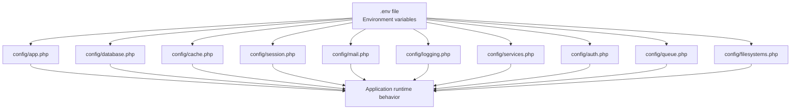
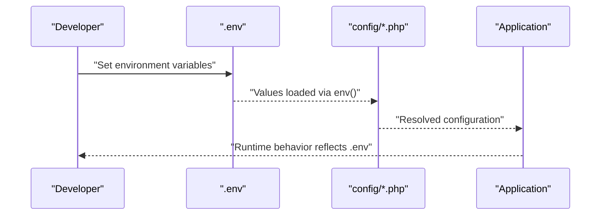
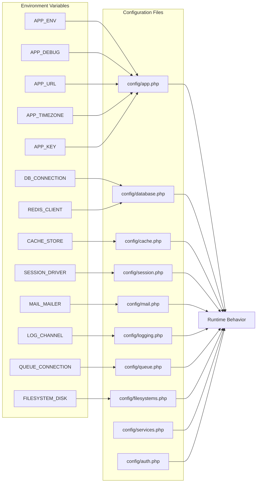

# Environment Configuration

<cite>
**Referenced Files in This Document**
- [app.php](file://config/app.php)
- [database.php](file://config/database.php)
- [cache.php](file://config/cache.php)
- [session.php](file://config/session.php)
- [mail.php](file://config/mail.php)
- [logging.php](file://config/logging.php)
- [services.php](file://config/services.php)
- [auth.php](file://config/auth.php)
- [queue.php](file://config/queue.php)
- [filesystems.php](file://config/filesystems.php)
- [composer.json](file://composer.json)
</cite>

## Table of Contents
1. [Introduction](#introduction)
2. [Project Structure](#project-structure)
3. [Core Components](#core-components)
4. [Architecture Overview](#architecture-overview)
5. [Detailed Component Analysis](#detailed-component-analysis)
6. [Dependency Analysis](#dependency-analysis)
7. [Performance Considerations](#performance-considerations)
8. [Troubleshooting Guide](#troubleshooting-guide)
9. [Conclusion](#conclusion)
10. [Appendices](#appendices)

## Introduction
This document explains how to configure the EDUfa environment across development, staging, and production deployments. It focuses on environment variables used by the application’s configuration files, including application identity, database connectivity, caching, sessions, mail delivery, logging, queues, and filesystems. Guidance is provided for timezone, debug mode, and application key management, along with environment-specific security and performance recommendations. Example .env configurations are outlined per environment, with explanations of each parameter’s role.

## Project Structure
The environment configuration is primarily governed by configuration files under config/*. Each file reads values from environment variables via the env() helper. Composer scripts demonstrate how the application expects a .env file to exist and be populated during setup.

**Diagram sources**
- [app.php](file://config/app.php)
- [database.php](file://config/database.php)
- [cache.php](file://config/cache.php)
- [session.php](file://config/session.php)
- [mail.php](file://config/mail.php)
- [logging.php](file://config/logging.php)
- [services.php](file://config/services.php)
- [auth.php](file://config/auth.php)
- [queue.php](file://config/queue.php)
- [filesystems.php](file://config/filesystems.php)

**Section sources**
- [composer.json](file://composer.json)

## Core Components
This section summarizes the primary environment-controlled areas and their purpose.

- Application identity and lifecycle
  - Application name, environment, debug mode, URL, timezone, locale, encryption key, and maintenance mode driver.
- Database connectivity
  - Default connection, per-driver settings (SQLite, MySQL/MariaDB, PostgreSQL, SQL Server), URL overrides, charset/collation, SSL options, and Redis client configuration.
- Caching
  - Default store, supported drivers, database-backed cache table/connection, Redis cache configuration, and cache key prefixing.
- Sessions
  - Driver selection, lifetime, encryption, database/Redis-backed storage, cookie policy (domain, path, secure, httpOnly, same-site, partitioned), and serialization.
- Mail delivery
  - Default mailer, SMTP host/port/credentials, SES, Postmark, Resend, Sendmail, log/array transports, global From address/name, and EHLO domain derived from APP_URL.
- Logging
  - Default channel, deprecation logging, stack composition, daily rotation, Slack/Papertrail integrations, syslog/errorlog handlers, and level thresholds.
- Queues
  - Default connection, database/Redis/SQS/Beanstalkd backends, retry timing, and failed job storage.
- Filesystems
  - Default disk, local/public, and S3-backed storage credentials and endpoint configuration.
- Third-party services
  - Postmark, Resend, AWS SES credentials and regions, and Slack bot token/channel.

**Section sources**
- [app.php](file://config/app.php)
- [database.php](file://config/database.php)
- [cache.php](file://config/cache.php)
- [session.php](file://config/session.php)
- [mail.php](file://config/mail.php)
- [logging.php](file://config/logging.php)
- [services.php](file://config/services.php)
- [auth.php](file://config/auth.php)
- [queue.php](file://config/queue.php)
- [filesystems.php](file://config/filesystems.php)

## Architecture Overview
The environment variables flow from .env into configuration files, which then influence runtime behavior across the application.

[No sources needed since this diagram shows conceptual workflow, not actual code structure]

## Detailed Component Analysis

### Application Identity and Lifecycle
Key parameters:
- APP_NAME: Human-readable application name.
- APP_ENV: Environment identifier (development, staging, production).
- APP_DEBUG: Enables detailed error pages; disable in production.
- APP_URL: Base URL used for CLI and generated URLs.
- APP_TIMEZONE: Timezone applied to date/time functions.
- APP_LOCALE/APP_FALLBACK_LOCALE/APP_FAKER_LOCALE: Localization defaults.
- APP_KEY: 32-character encryption key for encrypted values.
- APP_PREVIOUS_KEYS: Comma-separated list of previous keys for seamless rotation.
- APP_MAINTENANCE_DRIVER/APP_MAINTENANCE_STORE: Maintenance mode driver and store.

Security and performance notes:
- APP_DEBUG should be false in production to avoid leaking sensitive stack traces.
- APP_KEY must be set to a secure, random 32-character string before deployment.
- APP_TIMEZONE should match the operational region to avoid off-by-zone errors.

**Section sources**
- [app.php](file://config/app.php)

### Database Connectivity
Default connection:
- DB_CONNECTION: sqlite by default; switch to mysql, mariadb, pgsql, sqlsrv in production.

Connection parameters:
- DB_URL: Single URL override for drivers supporting it.
- DB_HOST/DB_PORT/DB_DATABASE/DB_USERNAME/DB_PASSWORD: Host/port/database/credentials.
- DB_SOCKET: Unix socket for MySQL/MariaDB.
- DB_CHARSET/DB_COLLATION: Character set and collation.
- DB_SSLMODE (PostgreSQL): SSL behavior preference.
- MYSQL_ATTR_SSL_CA (MySQL/MariaDB): Optional CA bundle path for SSL.

Redis client:
- REDIS_CLIENT: phpredis recommended.
- REDIS_CLUSTER/REDIS_PREFIX/REDIS_PERSISTENT: Cluster, key prefix, persistence.
- REDIS_URL/HOST/PORT/DB: Connection details; REDIS_DB vs REDIS_CACHE_DB for separate databases.
- REDIS_MAX_RETRIES/BACKOFF_*: Retry policy for Redis operations.

Operational guidance:
- Prefer managed databases in production; use DB_URL for simplified configuration.
- Enable SSL/TLS for remote connections; set appropriate charset/collation for data integrity.
- Separate Redis databases for application and cache workloads.

**Section sources**
- [database.php](file://config/database.php)

### Caching
Default store:
- CACHE_STORE: database by default; alternatives include file, memcached, redis, dynamodb, octane, failover.

Database-backed cache:
- DB_CACHE_CONNECTION/DB_CACHE_TABLE/DB_CACHE_LOCK_CONNECTION/DB_CACHE_LOCK_TABLE: Configure cache and lock tables.

Memcached:
- MEMCACHED_HOST/MEMCACHED_PORT/MEMCACHED_USERNAME/PASSWORD: Servers and credentials.

Redis-backed cache:
- REDIS_CACHE_CONNECTION/REDIS_CACHE_LOCK_CONNECTION: Select cache and lock connections.

Key prefixing:
- CACHE_PREFIX: Prevents key collisions across applications.

Serialization:
- serializable_classes: Keep disabled to avoid gadget chain risks if APP_KEY is compromised.

**Section sources**
- [cache.php](file://config/cache.php)

### Sessions
Driver and lifetime:
- SESSION_DRIVER: database recommended for shared environments.
- SESSION_LIFETIME: minutes until idle expiration.
- SESSION_EXPIRE_ON_CLOSE: immediate expiration when the browser closes.

Storage backends:
- SESSION_CONNECTION/SESSION_TABLE: Database-backed sessions.
- REDIS_* equivalents for Redis-backed sessions.

Cookie policy:
- SESSION_COOKIE/SESSION_PATH/SESSION_DOMAIN: Cookie identity and scope.
- SESSION_SECURE_COOKIE: HTTPS-only cookies.
- SESSION_HTTP_ONLY: XSS protection.
- SESSION_SAME_SITE: CSRF protection; use strict in production contexts.
- SESSION_PARTITIONED_COOKIE: Top-level site binding for cross-site contexts.

Encryption and serialization:
- SESSION_ENCRYPT: Encrypt session payload.
- serialization: JSON by default; avoid PHP serialization to reduce attack surface.

**Section sources**
- [session.php](file://config/session.php)

### Mail Delivery
Default mailer:
- MAIL_MAILER: smtp, ses, postmark, resend, sendmail, log, array, failover, roundrobin.

SMTP:
- MAIL_SCHEME/MAIL_URL: Transport scheme and URL override.
- MAIL_HOST/MAIL_PORT: Server and port.
- MAIL_USERNAME/MAIL_PASSWORD: Credentials.
- MAIL_EHLO_DOMAIN: Local domain for HELO/EHLO; defaults to APP_URL host.

SES/Postmark/Resend:
- Credentials via services.php (AWS keys, Postmark/Resend API keys).

Sendmail/log/array:
- Sendmail path override.
- Log channel selection.
- Array transport for tests.

Global sender:
- MAIL_FROM_ADDRESS/MAIL_FROM_NAME: Default From address and name.

**Section sources**
- [mail.php](file://config/mail.php)
- [services.php](file://config/services.php)

### Logging
Channels:
- LOG_CHANNEL: Default channel (stack by default).
- LOG_STACK: Comma-separated list of channels aggregated by stack.
- LOG_LEVEL: Threshold for log entries.
- LOG_DAILY_DAYS: Retention period for daily logs.
- LOG_SLACK_WEBHOOK_URL/LOG_SLACK_USERNAME/LOG_SLACK_EMOJI: Slack notifications.
- LOG_PAPERTRAIL_HANDLER/PAPERTRAIL_URL/PAPERTRAIL_PORT: Remote syslog.
- LOG_STDERR_FORMATTER: Formatter for stderr handler.
- LOG_SYSLOG_FACILITY: Syslog facility.

Deprecations:
- LOG_DEPRECATIONS_CHANNEL/LOG_DEPRECATIONS_TRACE: Track deprecated features.

**Section sources**
- [logging.php](file://config/logging.php)

### Queues
Default connection:
- QUEUE_CONNECTION: database by default; alternatives include sync, beanstalkd, sqs, redis.

Database:
- DB_QUEUE_CONNECTION/DB_QUEUE_TABLE/DB_QUEUE/DB_QUEUE_RETRY_AFTER: Job table and retry behavior.

Redis:
- REDIS_QUEUE_CONNECTION/REDIS_QUEUE/REDIS_QUEUE_RETRY_AFTER: Queue database and retry.

SQS:
- AWS_ACCESS_KEY_ID/AWS_SECRET_ACCESS_KEY/AWS_DEFAULT_REGION/SQS_*: AWS SQS configuration.

Failed jobs:
- QUEUE_FAILED_DRIVER/DB_CONNECTION/failed_jobs table: Storage for failed jobs.

**Section sources**
- [queue.php](file://config/queue.php)

### Filesystems
Default disk:
- FILESYSTEM_DISK: local by default; switch to s3 in production.

Local/public:
- public disk URL derived from APP_URL; serves files under /storage.

S3:
- AWS_ACCESS_KEY_ID/AWS_SECRET_ACCESS_KEY/AWS_DEFAULT_REGION/AWS_BUCKET/AWS_URL/AWS_ENDPOINT/AWS_USE_PATH_STYLE_ENDPOINT: S3-compatible storage.

**Section sources**
- [filesystems.php](file://config/filesystems.php)

### Authentication and Authorization
- AUTH_GUARD/AUTH_PASSWORD_BROKER: Guard and broker identifiers.
- AUTH_MODEL: Eloquent model for authentication.
- AUTH_PASSWORD_RESET_TOKEN_TABLE: Token table for password resets.
- AUTH_PASSWORD_TIMEOUT: Password confirmation timeout.

**Section sources**
- [auth.php](file://config/auth.php)

## Dependency Analysis
Environment variables are resolved by configuration files. The following diagram maps selected environment variables to their consuming configuration files.

**Diagram sources**
- [app.php](file://config/app.php)
- [database.php](file://config/database.php)
- [cache.php](file://config/cache.php)
- [session.php](file://config/session.php)
- [mail.php](file://config/mail.php)
- [logging.php](file://config/logging.php)
- [queue.php](file://config/queue.php)
- [filesystems.php](file://config/filesystems.php)
- [services.php](file://config/services.php)
- [auth.php](file://config/auth.php)

**Section sources**
- [app.php](file://config/app.php)
- [database.php](file://config/database.php)
- [cache.php](file://config/cache.php)
- [session.php](file://config/session.php)
- [mail.php](file://config/mail.php)
- [logging.php](file://config/logging.php)
- [queue.php](file://config/queue.php)
- [filesystems.php](file://config/filesystems.php)
- [services.php](file://config/services.php)
- [auth.php](file://config/auth.php)

## Performance Considerations
- Database
  - Use URL-based configuration for simplified setups; enable SSL/TLS for remote connections.
  - Tune charset/collation for optimal storage and query performance.
- Cache
  - Prefer Redis for high-throughput caching; separate databases for application and cache.
  - Use CACHE_PREFIX to avoid key collisions in shared environments.
- Sessions
  - Use database or Redis-backed sessions for horizontal scaling.
  - Set appropriate SESSION_LIFETIME and enable SESSION_ENCRYPT.
- Queues
  - Use Redis or SQS for scalable job processing; configure retry policies and failed job storage.
- Logging
  - Use daily rotation and appropriate LOG_LEVEL to balance observability and disk usage.
- Filesystems
  - Use S3 for scalable asset storage in production; configure endpoint and path-style options appropriately.

[No sources needed since this section provides general guidance]

## Troubleshooting Guide
Common issues and resolutions:
- Missing APP_KEY
  - Symptom: Encryption failures or inability to decrypt values.
  - Resolution: Generate and set a 32-character APP_KEY; rotate gracefully using APP_PREVIOUS_KEYS.
- Incorrect APP_DEBUG
  - Symptom: Detailed error pages in production.
  - Resolution: Set APP_DEBUG=false in production; enable only during development.
- Database connectivity
  - Symptom: Connection refused or invalid credentials.
  - Resolution: Verify DB_* variables; confirm DB_URL, DB_HOST, DB_PORT, DB_DATABASE, DB_USERNAME, DB_PASSWORD; enable SSL where required.
- Redis connectivity
  - Symptom: Cache/session/queue failures.
  - Resolution: Confirm REDIS_* variables; ensure REDIS_CLIENT and REDIS_CLUSTER are set; verify network access and credentials.
- Mail delivery
  - Symptom: Emails not sent or delivered.
  - Resolution: Choose MAIL_MAILER and set host/port/credentials; verify MAIL_FROM_*; for SES/Postmark/Resend, set keys in services.php.
- Logging
  - Symptom: No logs or excessive disk usage.
  - Resolution: Adjust LOG_LEVEL, LOG_DAILY_DAYS, and channel composition; configure external sinks like Slack/Papertrail.
- Filesystems
  - Symptom: Assets not served or uploaded.
  - Resolution: Set FILESYSTEM_DISK and S3 credentials; ensure public disk URL alignment with APP_URL.

**Section sources**
- [app.php](file://config/app.php)
- [database.php](file://config/database.php)
- [cache.php](file://config/cache.php)
- [session.php](file://config/session.php)
- [mail.php](file://config/mail.php)
- [logging.php](file://config/logging.php)
- [queue.php](file://config/queue.php)
- [filesystems.php](file://config/filesystems.php)
- [services.php](file://config/services.php)

## Conclusion
Environment configuration in EDUfa is centralized through config/*.php files that read from environment variables. Correctly setting environment variables ensures secure, performant, and maintainable deployments across development, staging, and production. Use the guidance and examples below to tailor .env files to your environment while following security and performance best practices.

[No sources needed since this section summarizes without analyzing specific files]

## Appendices

### Environment-Specific .env Examples
Below are example outlines for each environment. Replace placeholder values with your infrastructure credentials and settings.

- Development (.env.development)
  - APP_ENV=development
  - APP_DEBUG=true
  - APP_URL=http://localhost
  - APP_TIMEZONE=UTC
  - APP_KEY=<generate-a-32-char-key>
  - DB_CONNECTION=sqlite
  - CACHE_STORE=redis
  - SESSION_DRIVER=database
  - MAIL_MAILER=log
  - LOG_CHANNEL=stack
  - QUEUE_CONNECTION=database
  - FILESYSTEM_DISK=local

- Staging (.env.staging)
  - APP_ENV=staging
  - APP_DEBUG=false
  - APP_URL=https://staging.example.com
  - APP_TIMEZONE=UTC
  - APP_KEY=<generate-a-32-char-key>
  - DB_CONNECTION=mysql
  - DB_HOST=db-staging.internal
  - DB_PORT=3306
  - DB_DATABASE=edufa_staging
  - DB_USERNAME=user
  - DB_PASSWORD=pass
  - CACHE_STORE=redis
  - REDIS_HOST=redis-staging.internal
  - SESSION_DRIVER=redis
  - MAIL_MAILER=smtp
  - MAIL_HOST=smtp.internal
  - MAIL_PORT=587
  - LOG_CHANNEL=daily
  - QUEUE_CONNECTION=redis
  - FILESYSTEM_DISK=s3

- Production (.env.production)
  - APP_ENV=production
  - APP_DEBUG=false
  - APP_URL=https://app.example.com
  - APP_TIMEZONE=Asia/Jakarta
  - APP_KEY=<generate-a-32-char-key>
  - DB_CONNECTION=mysql
  - DB_HOST=rds-cluster.cluster-xxxxxx.region.rds.amazonaws.com
  - DB_PORT=3306
  - DB_DATABASE=edufa_prod
  - DB_USERNAME=user
  - DB_PASSWORD=pass
  - CACHE_STORE=redis
  - REDIS_HOST=redis-prod.cache.amazonaws.com
  - REDIS_DB=0
  - SESSION_DRIVER=database
  - MAIL_MAILER=ses
  - LOG_CHANNEL=daily
  - QUEUE_CONNECTION=database
  - FILESYSTEM_DISK=s3
  - AWS_ACCESS_KEY_ID=key
  - AWS_SECRET_ACCESS_KEY=secret
  - AWS_DEFAULT_REGION=region
  - AWS_BUCKET=bucket-name

Notes:
- Always rotate APP_KEY safely; add previous keys to APP_PREVIOUS_KEYS for seamless transitions.
- Use HTTPS-only cookies and strict SameSite policies in production.
- Enable SSL/TLS for database and Redis connections where applicable.
- Monitor logs and configure external sinks for alerting in staging/production.

[No sources needed since this section provides general guidance]