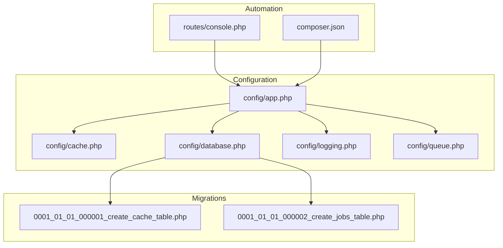
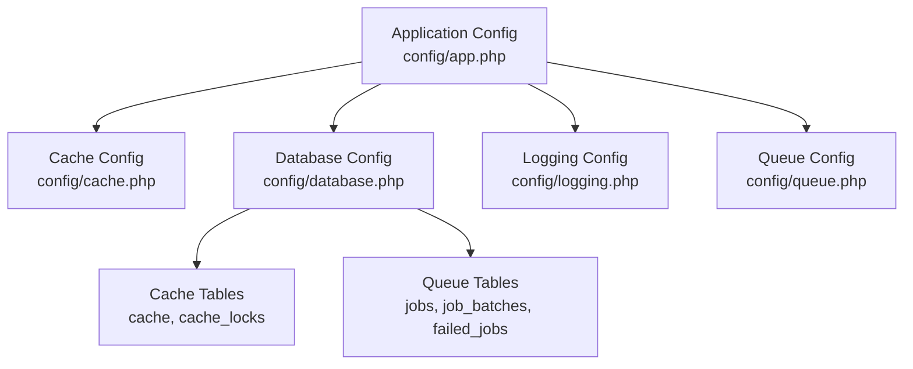
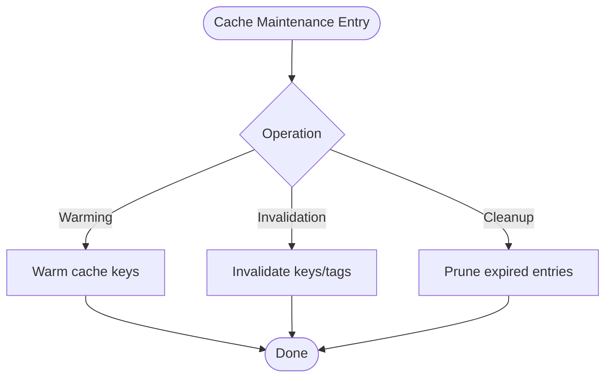
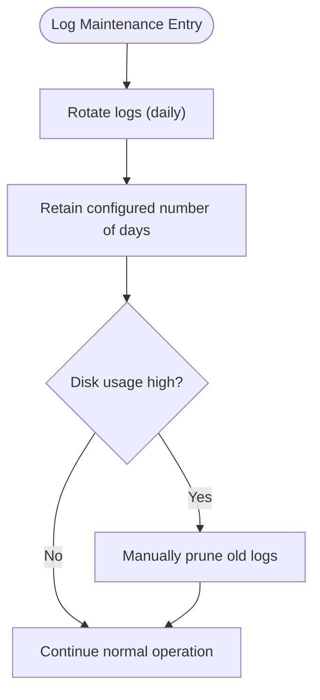
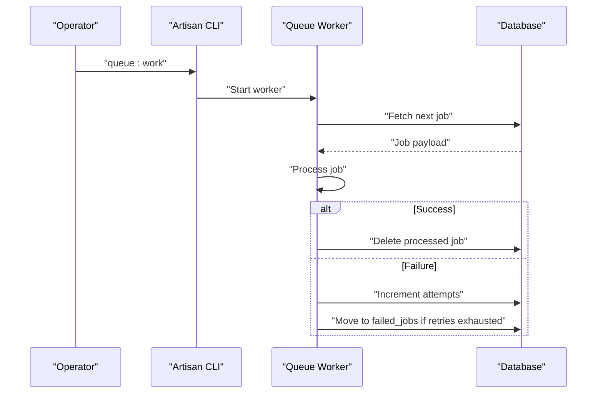
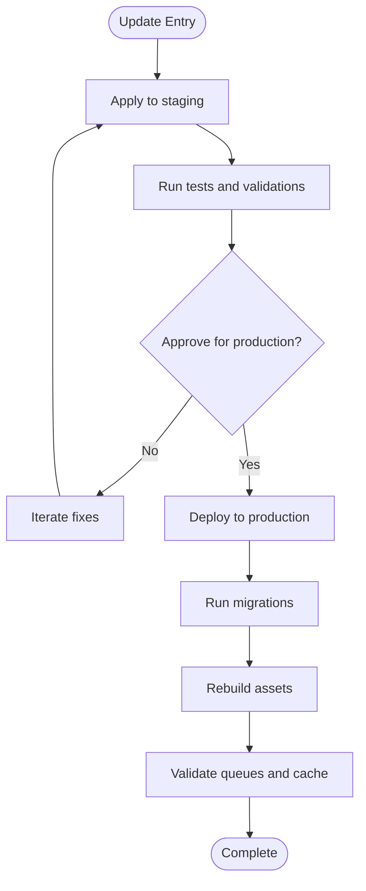
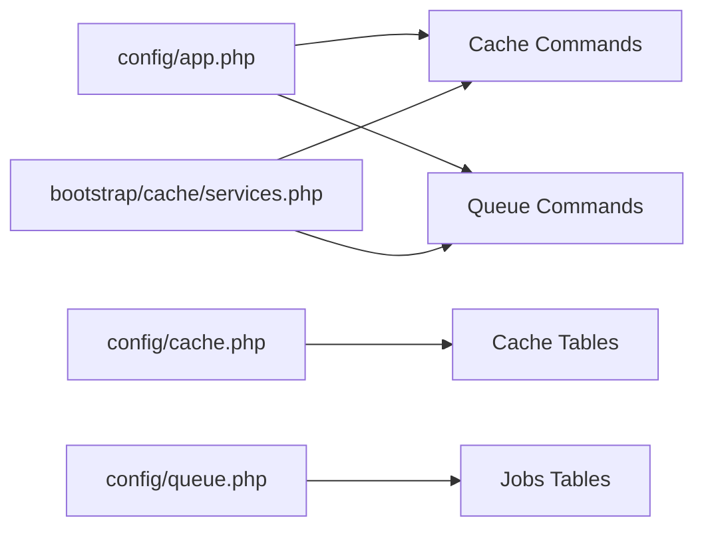

# Maintenance Procedures

<cite>
**Referenced Files in This Document**
- [config/app.php](file://config/app.php)
- [config/cache.php](file://config/cache.php)
- [config/database.php](file://config/database.php)
- [config/logging.php](file://config/logging.php)
- [config/queue.php](file://config/queue.php)
- [database/migrations/0001_01_01_000001_create_cache_table.php](file://database/migrations/0001_01_01_000001_create_cache_table.php)
- [database/migrations/0001_01_01_000002_create_jobs_table.php](file://database/migrations/0001_01_01_000002_create_jobs_table.php)
- [routes/console.php](file://routes/console.php)
- [composer.json](file://composer.json)
- [storage/logs/.gitignore](file://storage/logs/.gitignore)
- [storage/framework/cache/.gitignore](file://storage/framework/cache/.gitignore)
- [bootstrap/cache/services.php](file://bootstrap/cache/services.php)
</cite>

## Table of Contents
1. [Introduction](#introduction)
2. [Project Structure](#project-structure)
3. [Core Components](#core-components)
4. [Architecture Overview](#architecture-overview)
5. [Detailed Component Analysis](#detailed-component-analysis)
6. [Dependency Analysis](#dependency-analysis)
7. [Performance Considerations](#performance-considerations)
8. [Troubleshooting Guide](#troubleshooting-guide)
9. [Conclusion](#conclusion)
10. [Appendices](#appendices)

## Introduction
This document provides comprehensive maintenance procedures for EDUfa, focusing on routine system upkeep and operational housekeeping. It covers database backup strategies, cache management, log rotation and cleanup, queue worker management and monitoring, application updates and patch management, security maintenance, and practical maintenance checklists with pointers to automated maintenance scripts.

## Project Structure
EDUfa is a Laravel 13 application. Maintenance-relevant configuration is centralized in the config directory, with database schema definitions in migrations and maintenance commands registered in routes/console.php. Composer scripts automate common maintenance tasks during setup and development.

**Diagram sources**
- [config/app.php:1-127](file://config/app.php#L1-L127)
- [config/cache.php:1-131](file://config/cache.php#L1-L131)
- [config/database.php:1-185](file://config/database.php#L1-L185)
- [config/logging.php:1-133](file://config/logging.php#L1-L133)
- [config/queue.php:1-130](file://config/queue.php#L1-L130)
- [database/migrations/0001_01_01_000001_create_cache_table.php:1-36](file://database/migrations/0001_01_01_000001_create_cache_table.php#L1-L36)
- [database/migrations/0001_01_01_000002_create_jobs_table.php:1-58](file://database/migrations/0001_01_01_000002_create_jobs_table.php#L1-L58)
- [routes/console.php:1-9](file://routes/console.php#L1-L9)
- [composer.json:1-91](file://composer.json#L1-L91)

**Section sources**
- [config/app.php:1-127](file://config/app.php#L1-L127)
- [config/cache.php:1-131](file://config/cache.php#L1-L131)
- [config/database.php:1-185](file://config/database.php#L1-L185)
- [config/logging.php:1-133](file://config/logging.php#L1-L133)
- [config/queue.php:1-130](file://config/queue.php#L1-L130)
- [database/migrations/0001_01_01_000001_create_cache_table.php:1-36](file://database/migrations/0001_01_01_000001_create_cache_table.php#L1-L36)
- [database/migrations/0001_01_01_000002_create_jobs_table.php:1-58](file://database/migrations/0001_01_01_000002_create_jobs_table.php#L1-L58)
- [routes/console.php:1-9](file://routes/console.php#L1-L9)
- [composer.json:1-91](file://composer.json#L1-L91)

## Core Components
- Maintenance mode driver and store: Configured via application configuration to support centralized maintenance mode across environments.
- Cache subsystem: Database-backed cache with optional failover and prefixing for multi-application isolation.
- Logging: Daily rotation with configurable retention and multiple channel options.
- Queues: Database-backed queues with retry and failed-job tracking; supports Redis and other drivers.
- Database: SQLite by default with support for MySQL/MariaDB/PostgreSQL/SQLServer; migrations define cache and job tables.
- Automation: Composer scripts for setup, development, and asset publishing; Artisan commands registered for inspiration and potential future maintenance commands.

**Section sources**
- [config/app.php:121-124](file://config/app.php#L121-L124)
- [config/cache.php:18](file://config/cache.php#L18)
- [config/cache.php:35-102](file://config/cache.php#L35-L102)
- [config/cache.php:115](file://config/cache.php#L115)
- [config/logging.php:21](file://config/logging.php#L21)
- [config/logging.php:68-74](file://config/logging.php#L68-L74)
- [config/queue.php:16](file://config/queue.php#L16)
- [config/queue.php:38-45](file://config/queue.php#L38-L45)
- [config/queue.php:123-127](file://config/queue.php#L123-L127)
- [config/database.php:20](file://config/database.php#L20)
- [config/database.php:35-85](file://config/database.php#L35-L85)
- [database/migrations/0001_01_01_000001_create_cache_table.php:14-24](file://database/migrations/0001_01_01_000001_create_cache_table.php#L14-L24)
- [database/migrations/0001_01_01_000002_create_jobs_table.php:14-45](file://database/migrations/0001_01_01_000002_create_jobs_table.php#L14-L45)
- [routes/console.php:6-8](file://routes/console.php#L6-L8)
- [composer.json:38-72](file://composer.json#L38-L72)

## Architecture Overview
The maintenance architecture integrates configuration-driven behavior with database-backed persistence and queue-driven background processing. Maintenance mode, cache, logs, and queues are coordinated through Laravel’s service container and configuration layers.

**Diagram sources**
- [config/app.php:1-127](file://config/app.php#L1-L127)
- [config/cache.php:1-131](file://config/cache.php#L1-L131)
- [config/database.php:1-185](file://config/database.php#L1-L185)
- [config/logging.php:1-133](file://config/logging.php#L1-L133)
- [config/queue.php:1-130](file://config/queue.php#L1-L130)
- [database/migrations/0001_01_01_000001_create_cache_table.php:14-24](file://database/migrations/0001_01_01_000001_create_cache_table.php#L14-L24)
- [database/migrations/0001_01_01_000002_create_jobs_table.php:14-45](file://database/migrations/0001_01_01_000002_create_jobs_table.php#L14-L45)

## Detailed Component Analysis

### Database Backup Strategies
- Current state: The application defaults to an in-memory or local SQLite database and does not include built-in automated backup scheduling. Cache and job tables are migrated by default.
- Recommended approach:
  - Schedule periodic logical backups using your database client or OS-level scheduler. For SQLite, export SQL snapshots; for MySQL/MariaDB/PostgreSQL, use native dump utilities.
  - Automate backups with cron/systemd timers to run at off-peak hours.
  - Retain multiple generations with rotation (e.g., daily for two weeks, weekly for a month).
  - Test restoration regularly by restoring to a staging environment.
  - Document backup locations, retention periods, and restore procedures in your ops playbook.
- Operational notes:
  - Cache and jobs tables are essential for normal operation; ensure they are included in backups.
  - For production deployments, consider point-in-time recovery (e.g., binary logs) where applicable.

**Section sources**
- [config/database.php:20](file://config/database.php#L20)
- [database/migrations/0001_01_01_000001_create_cache_table.php:14-24](file://database/migrations/0001_01_01_000001_create_cache_table.php#L14-L24)
- [database/migrations/0001_01_01_000002_create_jobs_table.php:14-45](file://database/migrations/0001_01_01_000002_create_jobs_table.php#L14-L45)

### Cache Management
- Default store: Database-backed cache with dedicated tables for cache entries and locks.
- Warming:
  - Warm frequently accessed computed views or lookup data after deploys.
  - Use cache tagging where appropriate to invalidate groups efficiently.
- Invalidation:
  - Clear stale keys after schema changes or data migrations.
  - Use cache forget commands for targeted removal.
- Cleanup:
  - Prune expired cache entries periodically to keep the cache table compact.
  - Consider cache prefixing to isolate environments.
- Failover and serialization:
  - Enable failover store for resilience.
  - Keep serializable classes disabled to mitigate gadget chain risks.

**Section sources**
- [config/cache.php:18](file://config/cache.php#L18)
- [config/cache.php:35-102](file://config/cache.php#L35-L102)
- [config/cache.php:115](file://config/cache.php#L115)
- [database/migrations/0001_01_01_000001_create_cache_table.php:14-24](file://database/migrations/0001_01_01_000001_create_cache_table.php#L14-L24)

### Log Rotation and Cleanup Policies
- Default channel: Stack of channels; daily rotation enabled with configurable retention.
- Cleanup policy:
  - Retention period is governed by days configuration; adjust per compliance and disk constraints.
  - Use daily driver to split logs by day and cap total files retained.
  - Monitor disk usage and alert thresholds; prune older logs manually if needed.
- Operational notes:
  - Logs are written under storage/logs; ensure adequate disk space and rotation.
  - Consider shipping logs to centralized systems for long-term retention.

**Section sources**
- [config/logging.php:21](file://config/logging.php#L21)
- [config/logging.php:68-74](file://config/logging.php#L68-L74)
- [storage/logs/.gitignore](file://storage/logs/.gitignore)

### Queue Worker Management and Job Monitoring
- Default connection: Database-backed queues with retry and failed-job tracking.
- Worker lifecycle:
  - Start workers with listen or work commands; monitor for stuck or failing jobs.
  - Pause/resume workers during maintenance windows.
  - Restart workers after configuration changes.
- Monitoring:
  - Track failed jobs and retry batches.
  - Observe queue depth and latency.
- Operational notes:
  - Jobs, job batches, and failed jobs tables are created by migrations.
  - Use queue:restart to reload workers cleanly.

**Section sources**
- [config/queue.php:16](file://config/queue.php#L16)
- [config/queue.php:38-45](file://config/queue.php#L38-L45)
- [config/queue.php:123-127](file://config/queue.php#L123-L127)
- [database/migrations/0001_01_01_000002_create_jobs_table.php:14-45](file://database/migrations/0001_01_01_000002_create_jobs_table.php#L14-L45)
- [bootstrap/cache/services.php:106-115](file://bootstrap/cache/services.php#L106-L115)

### Application Updates and Patch Management
- Composer automation:
  - Setup script installs dependencies, generates keys, runs migrations, builds assets.
  - Development script runs server, queue worker, and Vite concurrently.
  - Asset publishing is handled post-update.
- Patch management checklist:
  - Review composer.lock for dependency changes.
  - Run composer update in a staging environment first.
  - Apply database migrations and rebuild assets.
  - Validate queue and cache behavior after updates.
  - Re-test critical flows and monitor logs.

**Section sources**
- [composer.json:38-72](file://composer.json#L38-L72)

### Security Maintenance
- Dependency updates:
  - Pin versions appropriately; monitor advisory feeds.
  - Run composer audit regularly and address critical/high severity issues.
- Vulnerability scanning:
  - Integrate static analysis and SAST tools in CI.
  - Scan frontend dependencies periodically.
- Operational hygiene:
  - Keep APP_KEY secret and rotate keys safely.
  - Limit cache serializable classes to reduce attack surface.
  - Use maintenance mode during sensitive updates.

**Section sources**
- [config/app.php:100](file://config/app.php#L100)
- [config/cache.php:128](file://config/cache.php#L128)

### Maintenance Checklists and Automated Scripts
- Routine maintenance checklist:
  - Verify cache health and prune expired entries.
  - Rotate and retain logs per policy; monitor disk usage.
  - Inspect failed jobs and retry or purge as needed.
  - Confirm queue workers are healthy and responsive.
  - Validate database connectivity and migrations.
  - Review Composer lock and run audits.
- Automated maintenance scripts:
  - Composer scripts provide setup, dev orchestration, and asset publishing hooks.
  - Artisan commands can be extended for inspiration and future maintenance commands.

**Section sources**
- [routes/console.php:6-8](file://routes/console.php#L6-L8)
- [composer.json:38-72](file://composer.json#L38-L72)

## Dependency Analysis
The maintenance subsystem depends on configuration-driven behavior and database-backed persistence. The service container registers queue and cache commands, enabling maintenance operations.

**Diagram sources**
- [config/app.php:1-127](file://config/app.php#L1-L127)
- [config/cache.php:1-131](file://config/cache.php#L1-L131)
- [config/queue.php:1-130](file://config/queue.php#L1-L130)
- [bootstrap/cache/services.php:70-115](file://bootstrap/cache/services.php#L70-L115)

**Section sources**
- [bootstrap/cache/services.php:70-115](file://bootstrap/cache/services.php#L70-L115)

## Performance Considerations
- Cache sizing and TTL: Tune cache TTLs and consider memory vs. disk stores for hot data.
- Queue concurrency: Adjust worker concurrency and retry delays to balance throughput and resource usage.
- Log volume: Reduce verbosity in production and enforce strict retention to save disk space.
- Database I/O: Batch cache and job operations where possible; monitor slow queries.

## Troubleshooting Guide
- Maintenance mode not applying:
  - Verify maintenance driver and store configuration.
- Cache misses or stale data:
  - Clear cache and warm keys; confirm prefix correctness.
- Disk pressure from logs:
  - Reduce retention or switch to compressed daily logs; prune manually if needed.
- Queue backlog:
  - Increase worker count, inspect failed jobs, and scale retry timing.
- Update failures:
  - Re-run migrations, rebuild assets, and restart workers.

**Section sources**
- [config/app.php:121-124](file://config/app.php#L121-L124)
- [config/logging.php:68-74](file://config/logging.php#L68-L74)
- [config/queue.php:123-127](file://config/queue.php#L123-L127)

## Conclusion
By leveraging configuration-driven maintenance modes, database-backed cache and queues, and daily log rotation, EDUfa can sustain reliable operations. Combine these built-in capabilities with scheduled backups, proactive queue monitoring, and disciplined update and security practices to maintain a resilient system.

## Appendices
- Appendix A: Cache table schema
  - Primary key: cache.key
  - Columns: cache.value, cache.expiration
  - Locks table: cache_locks.key, owner, expiration
- Appendix B: Jobs table schema
  - jobs: queue, payload, attempts, reserved_at, available_at, created_at
  - job_batches: id, name, total_jobs, pending_jobs, failed_jobs, failed_job_ids, options, cancelled_at, created_at, finished_at
  - failed_jobs: uuid, connection, queue, payload, exception, failed_at

**Section sources**
- [database/migrations/0001_01_01_000001_create_cache_table.php:14-24](file://database/migrations/0001_01_01_000001_create_cache_table.php#L14-L24)
- [database/migrations/0001_01_01_000002_create_jobs_table.php:14-45](file://database/migrations/0001_01_01_000002_create_jobs_table.php#L14-L45)