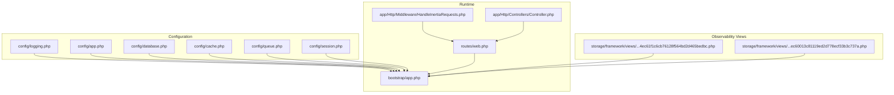
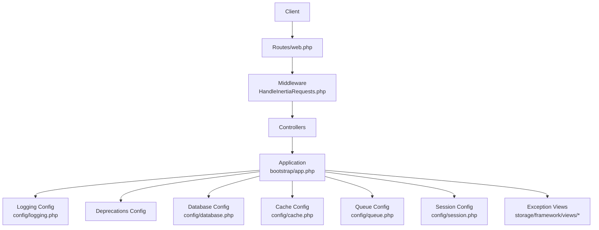
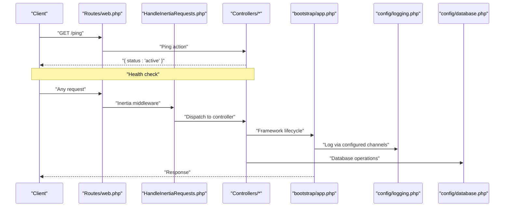
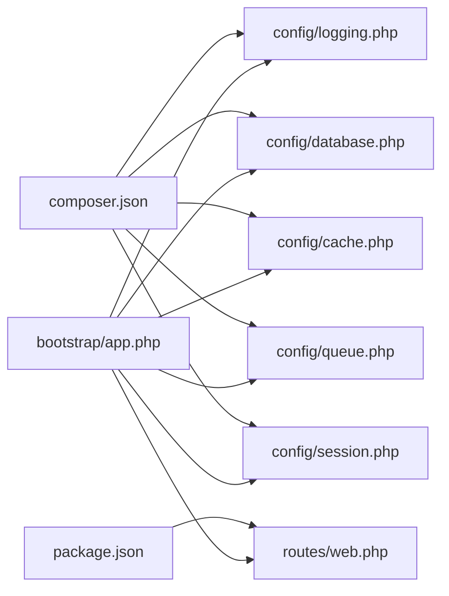

# Monitoring and Logging

<cite>
**Referenced Files in This Document**
- [logging.php](file://config/logging.php)
- [app.php](file://config/app.php)
- [database.php](file://config/database.php)
- [app.php](file://bootstrap/app.php)
- [HandleInertiaRequests.php](file://app\Http\Middleware\HandleInertiaRequests.php)
- [cache.php](file://config\cache.php)
- [queue.php](file://config\queue.php)
- [session.php](file://config\session.php)
- [web.php](file://routes\web.php)
- [composer.json](file://composer.json)
- [package.json](file://package.json)
- [Controller.php](file://app\Http\Controllers\Controller.php)
- [4ec61f1c6cb76128f564bd2d465bedbc.php](file://storage\framework\views\4ec61f1c6cb76128f564bd2d465bedbc.php)
- [ec60013c81119ed2d778ecf33b3c737a.php](file://storage\framework\views\ec60013c81119ed2d778ecf33b3c737a.php)
</cite>

## Table of Contents
1. [Introduction](#introduction)
2. [Project Structure](#project-structure)
3. [Core Components](#core-components)
4. [Architecture Overview](#architecture-overview)
5. [Detailed Component Analysis](#detailed-component-analysis)
6. [Dependency Analysis](#dependency-analysis)
7. [Performance Considerations](#performance-considerations)
8. [Troubleshooting Guide](#troubleshooting-guide)
9. [Conclusion](#conclusion)
10. [Appendices](#appendices)

## Introduction
This document provides comprehensive guidance for monitoring and logging in the EDUfa application with a focus on application health tracking, performance observation, error monitoring, database performance, and integration with external monitoring services. It explains logging configuration across channels (including daily rotation), metrics collection approaches, error tracking and alerting, database query insights, and system resource monitoring. It also outlines practical steps for integrating with log aggregation platforms and provides troubleshooting workflows grounded in the repository’s configuration and runtime behavior.

## Project Structure
The monitoring and logging surface in EDUfa spans configuration files, routing, middleware, controllers, and built-in exception rendering views. Key areas include:
- Logging configuration and channels
- Application environment and debug settings
- Database connectivity and Redis options
- Caching, queues, and sessions
- Health endpoint and ping route
- Exception renderer views exposing database query details

**Diagram sources**
- [logging.php:1-133](file://config/logging.php#L1-L133)
- [app.php:1-127](file://config/app.php#L1-L127)
- [database.php:1-185](file://config/database.php#L1-L185)
- [cache.php:1-131](file://config\cache.php#L1-L131)
- [queue.php:1-130](file://config\queue.php#L1-L130)
- [session.php:1-234](file://config\session.php#L1-L234)
- [app.php:1-28](file://bootstrap\app.php#L1-L28)
- [web.php:1-137](file://routes\web.php#L1-L137)
- [HandleInertiaRequests.php:1-40](file://app\Http\Middleware\HandleInertiaRequests.php#L1-L40)
- [Controller.php:1-9](file://app\Http\Controllers\Controller.php#L1-L9)
- [4ec61f1c6cb76128f564bd2d465bedbc.php:1-250](file://storage\framework\views\4ec61f1c6cb76128f564bd2d465bedbc.php#L1-L250)
- [ec60013c81119ed2d778ecf33b3c737a.php:1-250](file://storage\framework\views\ec60013c81119ed2d778ecf33b3c737a.php#L1-L250)

**Section sources**
- [logging.php:1-133](file://config/logging.php#L1-L133)
- [app.php:1-127](file://config/app.php#L1-L127)
- [database.php:1-185](file://config/database.php#L1-L185)
- [cache.php:1-131](file://config\cache.php#L1-L131)
- [queue.php:1-130](file://config\queue.php#L1-L130)
- [session.php:1-234](file://config\session.php#L1-L234)
- [app.php:1-28](file://bootstrap\app.php#L1-L28)
- [web.php:1-137](file://routes\web.php#L1-L137)
- [HandleInertiaRequests.php:1-40](file://app\Http\Middleware\HandleInertiaRequests.php#L1-L40)
- [Controller.php:1-9](file://app\Http\Controllers\Controller.php#L1-L9)
- [4ec61f1c6cb76128f564bd2d465bedbc.php:1-250](file://storage\framework\views\4ec61f1c6cb76128f564bd2d465bedbc.php#L1-L250)
- [ec60013c81119ed2d778ecf33b3c737a.php:1-250](file://storage\framework\views\ec60013c81119ed2d778ecf33b3c737a.php#L1-L250)

## Core Components
- Logging configuration and channels: Centralized in the logging configuration, supporting stack composition, single/daily rotation, syslog, stderr, Slack, and Papertrail handlers. Deprecation logging is configurable separately.
- Application environment and debug: Controls environment, debug mode, and locale; debug impacts error verbosity.
- Database connectivity: Defines default connection and multiple drivers (sqlite, mysql, mariadb, pgsql, sqlsrv) with Redis options for caching and queues.
- Caching, queues, sessions: Provides store configurations and queue backends; sessions integrate with cache/store backends.
- Health and ping: A dedicated ping route exposes application liveness; the framework health endpoint is registered.
- Exception renderer: Built-in exception views expose request context, headers, route context, parameters, and database queries executed during the request.

**Section sources**
- [logging.php:1-133](file://config/logging.php#L1-L133)
- [app.php:1-127](file://config/app.php#L1-L127)
- [database.php:1-185](file://config/database.php#L1-L185)
- [cache.php:1-131](file://config\cache.php#L1-L131)
- [queue.php:1-130](file://config\queue.php#L1-L130)
- [session.php:1-234](file://config\session.php#L1-L234)
- [web.php:1-137](file://routes\web.php#L1-L137)
- [4ec61f1c6cb76128f564bd2d465bedbc.php:1-250](file://storage\framework\views\4ec61f1c6cb76128f564bd2d465bedbc.php#L1-L250)
- [ec60013c81119ed2d778ecf33b3c737a.php:1-250](file://storage\framework\views\ec60013c81119ed2d778ecf33b3c737a.php#L1-L250)

## Architecture Overview
The monitoring architecture leverages Laravel’s logging stack and exception rendering pipeline. Logs are routed through configured channels, while exception pages surface database query details for diagnosis. Health and ping endpoints provide lightweight application health signals.

**Diagram sources**
- [web.php:1-137](file://routes\web.php#L1-L137)
- [HandleInertiaRequests.php:1-40](file://app\Http\Middleware\HandleInertiaRequests.php#L1-L40)
- [app.php:1-28](file://bootstrap\app.php#L1-L28)
- [logging.php:1-133](file://config/logging.php#L1-L133)
- [database.php:1-185](file://config/database.php#L1-L185)
- [cache.php:1-131](file://config\cache.php#L1-L131)
- [queue.php:1-130](file://config\queue.php#L1-L130)
- [session.php:1-234](file://config\session.php#L1-L234)
- [4ec61f1c6cb76128f564bd2d465bedbc.php:1-250](file://storage\framework\views\4ec61f1c6cb76128f564bd2d465bedbc.php#L1-L250)
- [ec60013c81119ed2d778ecf33b3c737a.php:1-250](file://storage\framework\views\ec60013c81119ed2d778ecf33b3c737a.php#L1-L250)

## Detailed Component Analysis

### Logging Configuration and Channels
- Default channel selection and deprecation logging are configurable.
- Stack channel composes multiple channels; single and daily handlers support level thresholds and placeholder replacement.
- Slack and Papertrail handlers enable alerting and offsite log shipping.
- stderr and syslog handlers support containerized and system logging.
- Emergency fallback ensures logs persist to disk.

Recommended practices:
- Use the daily channel for production to cap retention and manage disk usage.
- Configure Slack/Papertrail for critical alerts and centralized log aggregation.
- Keep deprecation logging enabled in development to track library updates.

**Section sources**
- [logging.php:1-133](file://config/logging.php#L1-L133)

### Application Environment and Debugging
- Environment, debug flag, and locale are defined centrally.
- Debug mode increases error verbosity and stack traces, aiding troubleshooting.
- Maintenance mode driver and store are configurable.

Operational guidance:
- Enable debug locally for detailed diagnostics; disable in production.
- Use maintenance mode driver and store to coordinate maintenance actions.

**Section sources**
- [app.php:1-127](file://config/app.php#L1-L127)

### Database Connectivity and Redis Options
- Default connection is configurable; multiple drivers supported.
- Redis client, cluster, prefix, persistence, and retry/backoff options are tunable.
- Useful for cache and queue backends.

Performance tips:
- Tune Redis backoff and retry settings for resilience under load.
- Select appropriate charset/collation for MySQL/MariaDB.

**Section sources**
- [database.php:1-185](file://config/database.php#L1-L185)

### Caching, Queues, and Sessions
- Cache stores include database, file, memcached, redis, dynamodb, octane, failover, and null.
- Queue backends include sync, database, beanstalkd, sqs, redis, deferred, background, failover.
- Sessions support file, cookie, database, memcached, redis, dynamodb, array with encryption and cookie attributes.

Observability implications:
- Database-backed cache/queue improves durability and horizontal scaling.
- Redis-backed cache/queue reduces latency and supports advanced operations.

**Section sources**
- [cache.php:1-131](file://config\cache.php#L1-L131)
- [queue.php:1-130](file://config\queue.php#L1-L130)
- [session.php:1-234](file://config\session.php#L1-L234)

### Health Endpoint and Ping Route
- A dedicated ping route returns a simple heartbeat payload.
- The framework health endpoint is registered at the application bootstrap.

Monitoring checklist:
- Ensure the health endpoint is reachable behind load balancers/firewalls.
- Integrate the ping route into uptime checks for basic availability.

**Section sources**
- [web.php:1-137](file://routes\web.php#L1-L137)
- [app.php:1-28](file://bootstrap\app.php#L1-L28)

### Exception Renderer and Database Query Visibility
- Exception renderer views include request method/path, headers, route context, parameters, and database queries with timing.
- This enables quick identification of slow or failing queries during error scenarios.

Actionable insights:
- Review query timings to spot hotspots.
- Correlate headers and route parameters with errors for reproducibility.

**Section sources**
- [4ec61f1c6cb76128f564bd2d465bedbc.php:1-250](file://storage\framework\views\4ec61f1c6cb76128f564bd2d465bedbc.php#L1-L250)
- [ec60013c81119ed2d778ecf33b3c737a.php:1-250](file://storage\framework\views\ec60013c81119ed2d778ecf33b3c737a.php#L1-L250)

### Middleware and Controller Surface
- Inertia middleware shares authentication context and assets.
- Base controller class establishes controller foundation.

Observability relevance:
- Middleware can be extended to record request/response metrics.
- Controllers can emit structured logs for business events.

**Section sources**
- [HandleInertiaRequests.php:1-40](file://app\Http\Middleware\HandleInertiaRequests.php#L1-L40)
- [Controller.php:1-9](file://app\Http\Controllers\Controller.php#L1-L9)

## Architecture Overview

**Diagram sources**
- [web.php:1-137](file://routes\web.php#L1-L137)
- [HandleInertiaRequests.php:1-40](file://app\Http\Middleware\HandleInertiaRequests.php#L1-L40)
- [app.php:1-28](file://bootstrap\app.php#L1-L28)
- [logging.php:1-133](file://config/logging.php#L1-L133)
- [database.php:1-185](file://config/database.php#L1-L185)

## Detailed Component Analysis

### Logging Channels and Daily Rotation
- Stack channel aggregates multiple handlers.
- Single and daily handlers support level thresholds and placeholder replacement.
- Daily rotation configurable by days retained.

Implementation guidance:
- Use daily channel with appropriate retention for long-term observability.
- Combine stderr/syslog for container/system ingestion alongside file rotation.

**Section sources**
- [logging.php:53-74](file://config/logging.php#L53-L74)

### Error Tracking and Alerting
- Slack handler configured with webhook URL, username, emoji, and level threshold.
- Papertrail handler configured for syslog over UDP/TLS.
- Emergency channel ensures persistent fallback.

Alerting recommendations:
- Route critical events (critical and higher) to Slack.
- Ship structured logs to Papertrail for centralized querying.

**Section sources**
- [logging.php:76-95](file://config/logging.php#L76-L95)
- [logging.php:126-128](file://config/logging.php#L126-L128)

### Application Metrics Collection
- Response times: Track via middleware around controller dispatch and response generation.
- Memory usage: Capture via process_get_peak_usage or OS-level metrics.
- Database query performance: Leverage exception renderer’s query list and timings.

Collection approach:
- Extend Inertia middleware to measure duration and attach metrics to logs.
- Record query counts and total execution time per request.

**Section sources**
- [HandleInertiaRequests.php:1-40](file://app\Http\Middleware\HandleInertiaRequests.php#L1-L40)
- [4ec61f1c6cb76128f564bd2d465bedbc.php:1-250](file://storage\framework\views\4ec61f1c6cb76128f564bd2d465bedbc.php#L1-L250)
- [ec60013c81119ed2d778ecf33b3c737a.php:1-250](file://storage\framework\views\ec60013c81119ed2d778ecf33b3c737a.php#L1-L250)

### Error Monitoring Setup and Alerting
- Use Slack handler for critical alerts.
- Use Papertrail handler for searchable log archival.
- Configure deprecation logging to catch legacy code early.

Operational checklist:
- Verify webhook URL and credentials for Slack.
- Verify Papertrail host/port and TLS settings.
- Monitor emergency channel logs for unexpected failures.

**Section sources**
- [logging.php:34-37](file://config/logging.php#L34-L37)
- [logging.php:76-95](file://config/logging.php#L76-L95)
- [logging.php:126-128](file://config/logging.php#L126-L128)

### Database Performance Monitoring and Slow Query Detection
- Exception renderer displays executed queries with connection name and timing.
- Use this to identify slow queries and repeated N+1 patterns.

Workflow:
- Reproduce failing requests and inspect rendered exception view.
- Filter by timing thresholds to identify bottlenecks.
- Optimize queries and add indexes as needed.

**Section sources**
- [4ec61f1c6cb76128f564bd2d465bedbc.php:71-78](file://storage\framework\views\4ec61f1c6cb76128f564bd2d465bedbc.php#L71-L78)
- [ec60013c81119ed2d778ecf33b3c737a.php:161-213](file://storage\framework\views\ec60013c81119ed2d778ecf33b3c737a.php#L161-L213)

### System Resource Monitoring (CPU, Memory, Disk)
- CPU and memory: Collect via OS-level metrics (e.g., container stats, system daemons).
- Disk: Monitor retention and rotation via daily channel settings and filesystem quotas.
- Integrate with external monitoring systems for dashboards and alerts.

Recommendations:
- Track peak memory usage per request in middleware.
- Enforce daily log rotation limits to prevent disk exhaustion.

**Section sources**
- [logging.php:68-74](file://config/logging.php#L68-L74)

### Integrating with External Monitoring Services and Log Aggregation Platforms
- Slack: Configure webhook URL and level threshold for critical alerts.
- Papertrail: Configure host/port and TLS; ensure firewall allows outbound UDP/TLS.
- Standard streams: Use stderr/syslog handlers for container log collectors.

Integration steps:
- Provision credentials/secrets for external services.
- Validate connectivity from application host/container.
- Test alert delivery and log ingestion end-to-end.

**Section sources**
- [logging.php:76-95](file://config/logging.php#L76-L95)
- [logging.php:97-113](file://config/logging.php#L97-L113)

### Log Analysis Techniques and Troubleshooting Workflows
- Use exception renderer to correlate request metadata with database queries.
- Filter logs by level, channel, and time window.
- Build dashboards for error rates, response time percentiles, and slow queries.

Troubleshooting flow:
- Reproduce issue and capture exception view.
- Extract SQL and timings; compare against expected performance.
- Adjust configuration (e.g., cache/queue backends) and retest.

**Section sources**
- [4ec61f1c6cb76128f564bd2d465bedbc.php:39-78](file://storage\framework\views\4ec61f1c6cb76128f564bd2d465bedbc.php#L39-L78)
- [ec60013c81119ed2d778ecf33b3c737a.php:34-221](file://storage\framework\views\ec60013c81119ed2d778ecf33b3c737a.php#L34-L221)

## Dependency Analysis

**Diagram sources**
- [composer.json:1-91](file://composer.json#L1-L91)
- [package.json:1-49](file://package.json#L1-L49)
- [logging.php:1-133](file://config/logging.php#L1-L133)
- [database.php:1-185](file://config/database.php#L1-L185)
- [cache.php:1-131](file://config\cache.php#L1-L131)
- [queue.php:1-130](file://config\queue.php#L1-L130)
- [session.php:1-234](file://config\session.php#L1-L234)
- [web.php:1-137](file://routes\web.php#L1-L137)
- [app.php:1-28](file://bootstrap\app.php#L1-L28)

**Section sources**
- [composer.json:1-91](file://composer.json#L1-L91)
- [package.json:1-49](file://package.json#L1-L49)
- [logging.php:1-133](file://config/logging.php#L1-L133)
- [database.php:1-185](file://config/database.php#L1-L185)
- [cache.php:1-131](file://config\cache.php#L1-L131)
- [queue.php:1-130](file://config\queue.php#L1-L130)
- [session.php:1-234](file://config\session.php#L1-L234)
- [web.php:1-137](file://routes\web.php#L1-L137)
- [app.php:1-28](file://bootstrap\app.php#L1-L28)

## Performance Considerations
- Prefer daily log rotation with bounded retention to control disk usage.
- Use Redis-backed cache/queue for low-latency operations; tune retry/backoff for resilience.
- Monitor peak memory usage per request and optimize heavy operations.
- Use database query timings from exception views to guide indexing and query optimization.

[No sources needed since this section provides general guidance]

## Troubleshooting Guide
- Health checks: Verify the ping route responds with a healthy status.
- Error visibility: Inspect exception renderer for request context and database queries.
- Log ingestion: Confirm stderr/syslog and Slack/Papertrail handlers are configured and reachable.
- Slow queries: Use exception renderer’s query list to identify and address performance bottlenecks.

**Section sources**
- [web.php:131-133](file://routes\web.php#L131-L133)
- [4ec61f1c6cb76128f564bd2d465bedbc.php:39-78](file://storage\framework\views\4ec61f1c6cb76128f564bd2d465bedbc.php#L39-L78)
- [logging.php:76-95](file://config/logging.php#L76-L95)

## Conclusion
EDUfa’s monitoring and logging foundation is centered on Laravel’s robust logging stack, configurable channels, and exception rendering. By leveraging daily rotation, Slack/Papertrail integration, and the exception renderer’s query insights, teams can observe application health, detect performance regressions, and troubleshoot effectively. Extending middleware and integrating with external monitoring platforms completes a comprehensive observability strategy.

[No sources needed since this section summarizes without analyzing specific files]

## Appendices
- Dependencies: Laravel framework, Inertia, Sanctum, Tinker, Sitemap, and development tools are declared in the project configuration.
- Scripts: Development and setup scripts streamline local environment provisioning.

**Section sources**
- [composer.json:1-91](file://composer.json#L1-L91)
- [package.json:1-49](file://package.json#L1-L49)