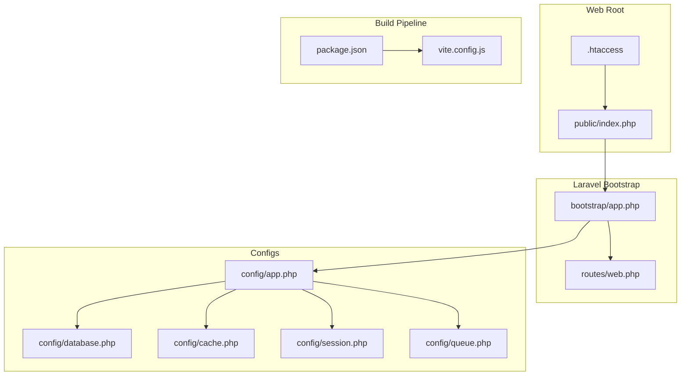
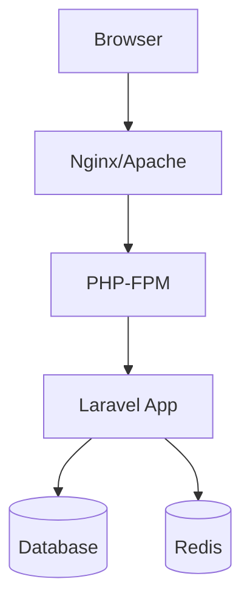
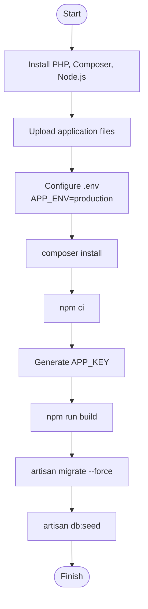
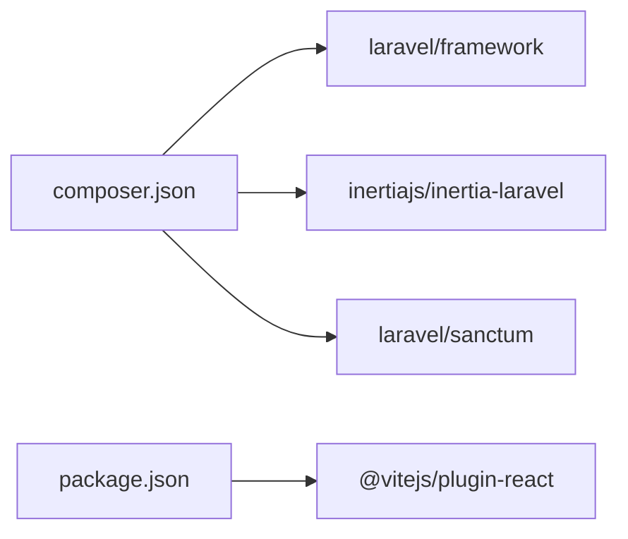

# Production Deployment

<cite>
**Referenced Files in This Document**
- [composer.json](file://composer.json)
- [package.json](file://package.json)
- [vite.config.js](file://vite.config.js)
- [public/.htaccess](file://public/.htaccess)
- [config/app.php](file://config/app.php)
- [config/database.php](file://config/database.php)
- [config/cache.php](file://config/cache.php)
- [config/session.php](file://config/session.php)
- [config/queue.php](file://config/queue.php)
- [routes/web.php](file://routes/web.php)
- [bootstrap/app.php](file://bootstrap/app.php)
- [database/migrations/0001_01_01_000000_create_users_table.php](file://database/migrations/0001_01_01_000000_create_users_table.php)
- [database/migrations/2026_04_20_133158_create_branches_table.php](file://database/migrations/2026_04_20_133158_create_branches_table.php)
- [database/seeders/DatabaseSeeder.php](file://database/seeders/DatabaseSeeder.php)
</cite>

## Table of Contents
1. [Introduction](#introduction)
2. [Project Structure](#project-structure)
3. [Core Components](#core-components)
4. [Architecture Overview](#architecture-overview)
5. [Detailed Component Analysis](#detailed-component-analysis)
6. [Dependency Analysis](#dependency-analysis)
7. [Performance Considerations](#performance-considerations)
8. [Troubleshooting Guide](#troubleshooting-guide)
9. [Conclusion](#conclusion)
10. [Appendices](#appendices)

## Introduction
This document provides a comprehensive production deployment guide for EDUfa, focusing on server setup, deployment procedures, database migrations, asset compilation, reverse proxy configuration, security hardening, and operational best practices. It consolidates requirements and steps derived from the repository’s configuration and application structure to enable repeatable, reliable deployments.

## Project Structure
EDUfa is a Laravel 13 application with React-based frontend assets built via Vite. The repository includes:
- Laravel application bootstrapping and routing
- Configuration for database, cache, sessions, queues, and app behavior
- Frontend build pipeline using Vite and React
- Apache-style rewrite rules for the public web root
- Database migrations and seeders for initial data

**Diagram sources**
- [public/.htaccess:1-26](file://public/.htaccess#L1-L26)
- [bootstrap/app.php:1-28](file://bootstrap/app.php#L1-L28)
- [routes/web.php:1-137](file://routes/web.php#L1-L137)
- [config/app.php:1-127](file://config/app.php#L1-L127)
- [config/database.php:1-185](file://config/database.php#L1-L185)
- [config/cache.php:1-131](file://config/cache.php#L1-L131)
- [config/session.php:1-234](file://config/session.php#L1-L234)
- [config/queue.php:1-130](file://config/queue.php#L1-L130)
- [package.json:1-49](file://package.json#L1-L49)
- [vite.config.js:1-14](file://vite.config.js#L1-L14)

**Section sources**
- [bootstrap/app.php:1-28](file://bootstrap/app.php#L1-L28)
- [routes/web.php:1-137](file://routes/web.php#L1-L137)
- [config/app.php:1-127](file://config/app.php#L1-L127)
- [config/database.php:1-185](file://config/database.php#L1-L185)
- [config/cache.php:1-131](file://config/cache.php#L1-L131)
- [config/session.php:1-234](file://config/session.php#L1-L234)
- [config/queue.php:1-130](file://config/queue.php#L1-L130)
- [public/.htaccess:1-26](file://public/.htaccess#L1-L26)
- [package.json:1-49](file://package.json#L1-L49)
- [vite.config.js:1-14](file://vite.config.js#L1-L14)

## Core Components
- PHP runtime and extensions: The application requires PHP 8.3+ and PDO-based database drivers for MySQL/MariaDB/SQLite/PostgreSQL/SQL Server as configured.
- Web server: Apache with mod_rewrite and mod_negotiation is supported via the included .htaccess. Nginx can be used with appropriate rewrite rules.
- Database: SQLite is default; MySQL/MariaDB/PostgreSQL/SQL Server are supported via environment variables.
- Cache and Sessions: Database-backed cache and sessions are configured by default; Redis is available as an alternative.
- Queues: Database-backed queues are enabled by default; Redis is available as an alternative.
- Asset pipeline: Vite builds React assets; production builds are executed via npm scripts.

**Section sources**
- [composer.json:8-16](file://composer.json#L8-L16)
- [config/database.php:20-116](file://config/database.php#L20-L116)
- [config/cache.php:18-102](file://config/cache.php#L18-L102)
- [config/session.php:21-104](file://config/session.php#L21-L104)
- [config/queue.php:16-92](file://config/queue.php#L16-L92)
- [package.json:5-8](file://package.json#L5-L8)
- [vite.config.js:1-14](file://vite.config.js#L1-L14)

## Architecture Overview
The production runtime comprises:
- Web server (Apache or Nginx) serving the public directory
- PHP-FPM running the Laravel application
- Database (SQLite/MySQL/MariaDB/PostgreSQL/SQL Server)
- Optional Redis for cache/queue
- Static assets served by the web server after Vite build

[No sources needed since this diagram shows conceptual workflow, not actual code structure]

## Detailed Component Analysis

### Server Requirements and Web Server Configuration
- PHP version: PHP 8.3+ is required.
- Extensions: PDO-based drivers for the chosen database (e.g., pdo_mysql for MySQL/MariaDB).
- Web server: Apache with mod_rewrite and mod_negotiation; Nginx equivalent rewrites are supported conceptually.
- Public directory: Serve the public folder as the document root.

Key configuration references:
- PHP requirement and framework dependencies
- .htaccess rewrite rules for trailing slashes and front controller pattern
- Application URL and environment settings

**Section sources**
- [composer.json:8-16](file://composer.json#L8-L16)
- [public/.htaccess:1-26](file://public/.htaccess#L1-L26)
- [config/app.php:29-56](file://config/app.php#L29-L56)

### Step-by-Step Deployment Procedure
1. Prepare target server
   - Install PHP 8.3+ and required extensions (PDO and the driver for your database).
   - Install Composer and Node.js/npm.
   - Configure web server to serve the public directory as the document root.

2. Upload application code
   - Copy application files to the target server under the web root.
   - Ensure ownership and permissions allow the web server to read files and write to storage and bootstrap/cache.

3. Environment configuration
   - Create or copy .env from .env.example.
   - Set APP_ENV=production, APP_DEBUG=false, APP_URL to your domain, and database credentials.
   - Configure CACHE_STORE, SESSION_DRIVER, QUEUE_CONNECTION as desired (database or redis).

4. Install dependencies
   - Run Composer install to fetch PHP dependencies.
   - Run npm ci to install frontend dependencies.

5. Generate application key
   - Generate and store APP_KEY securely.

6. Build assets
   - Run the production build script to compile React assets via Vite.

7. Database setup
   - Run migrations to create and update schema.
   - Seed initial data (admin user and related records).

8. Finalize permissions
   - Ensure storage and bootstrap/cache are writable by the web server during setup, then restrict permissions afterward.

[No sources needed since this diagram shows conceptual workflow, not actual code structure]

**Section sources**
- [composer.json:38-50](file://composer.json#L38-L50)
- [package.json:5-8](file://package.json#L5-L8)
- [config/app.php:29-42](file://config/app.php#L29-L42)

### Database Migrations and Seeding
- Migrations: The application defines core tables (users, sessions, password reset tokens) and feature tables (branches, activities, articles, services). Migrations are designed to be run in order.
- Seeding: The DatabaseSeeder creates an admin user and invokes branch and service seeders. It reads defaults from environment variables.

Operational notes:
- Use --force when running migrations in production.
- Seeders rely on environment variables for admin credentials.

**Section sources**
- [database/migrations/0001_01_01_000000_create_users_table.php:1-53](file://database/migrations/0001_01_01_000000_create_users_table.php#L1-L53)
- [database/migrations/2026_04_20_133158_create_branches_table.php:1-34](file://database/migrations/2026_04_20_133158_create_branches_table.php#L1-L34)
- [database/seeders/DatabaseSeeder.php:1-32](file://database/seeders/DatabaseSeeder.php#L1-L32)

### Asset Compilation
- Build command: npm run build compiles React assets using Vite.
- Vite configuration specifies the input entry and plugin chain.

Recommendations:
- Commit built assets to version control if your deployment strategy requires it; otherwise, ensure the build runs on the target server or in CI.

**Section sources**
- [package.json:5-8](file://package.json#L5-L8)
- [vite.config.js:1-14](file://vite.config.js#L1-L14)

### Reverse Proxy Setup (Nginx/Apache)
- Apache: The included .htaccess handles Authorization header passthrough, XSRF token handling, trailing slash redirects, and routing to index.php.
- Nginx: Use equivalent rewrite rules to route non-file/non-directory requests to index.php and pass Authorization/XSRF headers appropriately.

Security considerations:
- Ensure HTTPS termination is handled upstream (e.g., TLS certificates installed on the load balancer or reverse proxy).

**Section sources**
- [public/.htaccess:1-26](file://public/.htaccess#L1-L26)

### Load Balancer Configuration
- Place a reverse proxy/load balancer in front of one or more PHP-FPM workers.
- Configure health checks using the /up endpoint exposed by the framework.
- Ensure sticky sessions are disabled since sessions are backed by the database.

**Section sources**
- [bootstrap/app.php:11-11](file://bootstrap/app.php#L11-L11)
- [config/session.php:21-77](file://config/session.php#L21-L77)

### SSL Certificate Installation and Security Hardening
- TLS: Install a trusted SSL certificate on the reverse proxy/load balancer or directly on the web server.
- Headers: Enforce HTTPS, HSTS, and security headers at the reverse proxy level.
- File permissions: Restrict write permissions to storage and bootstrap/cache directories; ensure only necessary directories are writable by the web server.
- Environment: Keep APP_DEBUG=false in production.

**Section sources**
- [config/app.php:29-42](file://config/app.php#L29-L42)
- [config/session.php:171-202](file://config/session.php#L171-L202)

### Deployment Automation and CI/CD
- Composer install and npm ci are defined as Composer scripts.
- The setup script automates Composer install, .env creation, key generation, migrations, npm install, and build.
- Recommended CI/CD tasks:
  - Install dependencies (Composer and npm)
  - Run tests
  - Build assets
  - Run migrations
  - Seed data
  - Restart PHP-FPM and invalidate cache

**Section sources**
- [composer.json:38-72](file://composer.json#L38-L72)
- [package.json:5-8](file://package.json#L5-L8)

### Rollback Procedures and Zero-Downtime Strategies
- Zero downtime:
  - Use blue/green deployment or rolling restarts behind a load balancer.
  - Keep database migrations reversible where necessary; maintain backups before applying migrations.
- Rollback:
  - Revert to the previous release, roll back database migrations if needed, and restore backups for data.
  - Switch traffic back to the stable environment.

[No sources needed since this section provides general guidance]

## Dependency Analysis
The application depends on Laravel 13, Inertia for SSR-like UX, Sanctum for API authentication, and Vite/React for the frontend. Database connectivity is configurable via environment variables.

**Diagram sources**
- [composer.json:8-16](file://composer.json#L8-L16)
- [package.json:14-22](file://package.json#L14-L22)

**Section sources**
- [composer.json:8-16](file://composer.json#L8-L16)
- [package.json:14-22](file://package.json#L14-L22)

## Performance Considerations
- Use database-backed cache and sessions for simplicity; switch to Redis for higher throughput.
- Enable OPcache and configure PHP-FPM pm settings according to workload.
- Pre-warm OPCache after deploys.
- Serve static assets directly via the web server; ensure long-lived caching headers.
- Use queue workers for background tasks.

[No sources needed since this section provides general guidance]

## Troubleshooting Guide
- Health check endpoint: Use /up to verify application readiness behind a load balancer.
- Common issues:
  - Permissions: Ensure storage and bootstrap/cache are writable during setup; lock down afterward.
  - Database connectivity: Verify DB_* environment variables and driver availability.
  - Assets: Confirm npm run build completes without errors and public/build exists.
  - Routes: Ensure web server forwards non-existing files/dirs to index.php.

**Section sources**
- [bootstrap/app.php:11-11](file://bootstrap/app.php#L11-L11)
- [public/.htaccess:16-24](file://public/.htaccess#L16-L24)

## Conclusion
By aligning server configuration with the application’s requirements, carefully managing environment variables, and following the step-by-step deployment procedure, EDUfa can be reliably deployed and operated in production. Combine the outlined practices with CI/CD automation, load balancing, and robust monitoring to achieve scalable, secure, and maintainable operations.

## Appendices

### Appendix A: Environment Variables Reference
- Application
  - APP_ENV, APP_DEBUG, APP_URL, APP_KEY
- Database
  - DB_CONNECTION, DB_HOST, DB_PORT, DB_DATABASE, DB_USERNAME, DB_PASSWORD, DB_URL, DB_CHARSET, DB_COLLATION, DB_SSLMODE, MYSQL_ATTR_SSL_CA
- Cache
  - CACHE_STORE, CACHE_PREFIX
- Sessions
  - SESSION_DRIVER, SESSION_LIFETIME, SESSION_ENCRYPT, SESSION_TABLE, SESSION_CONNECTION, SESSION_COOKIE, SESSION_SECURE_COOKIE, SESSION_SAME_SITE
- Queues
  - QUEUE_CONNECTION, DB_QUEUE_CONNECTION, DB_QUEUE_TABLE, DB_QUEUE_RETRY_AFTER, REDIS_QUEUE_CONNECTION, REDIS_QUEUE
- Redis
  - REDIS_CLIENT, REDIS_HOST, REDIS_PORT, REDIS_DB, REDIS_PASSWORD, REDIS_PREFIX

**Section sources**
- [config/app.php:29-106](file://config/app.php#L29-L106)
- [config/database.php:20-116](file://config/database.php#L20-L116)
- [config/cache.php:18-115](file://config/cache.php#L18-L115)
- [config/session.php:21-202](file://config/session.php#L21-L202)
- [config/queue.php:16-92](file://config/queue.php#L16-L92)