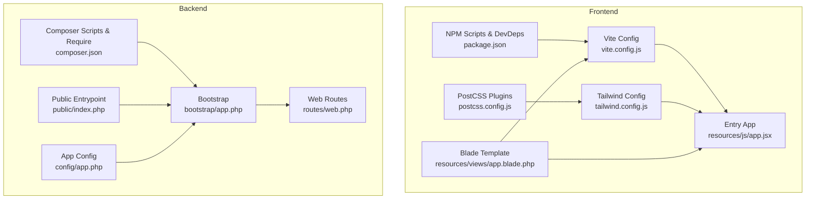
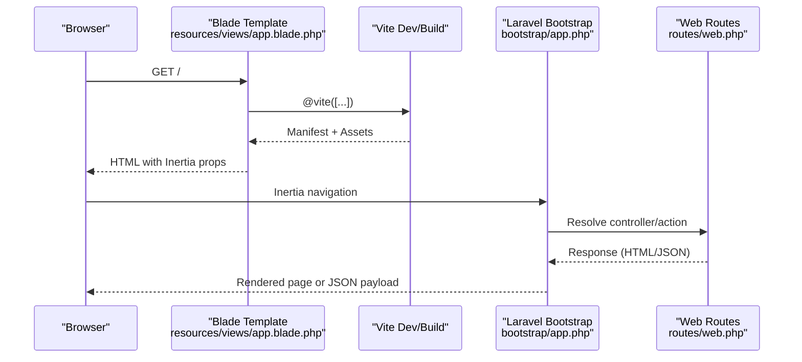
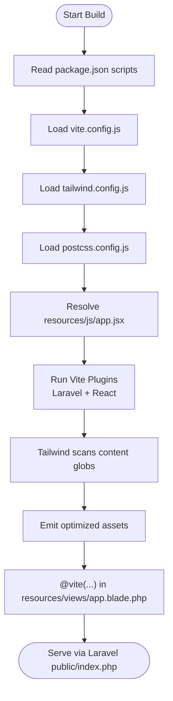
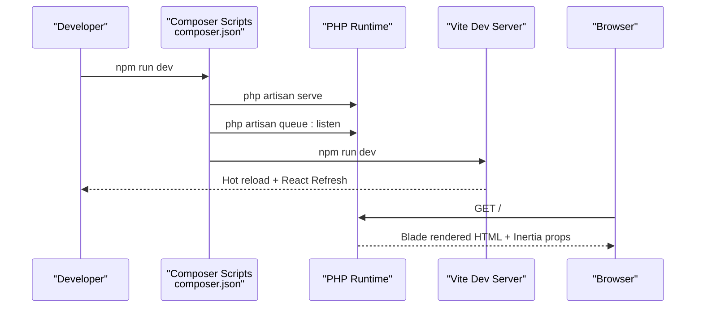
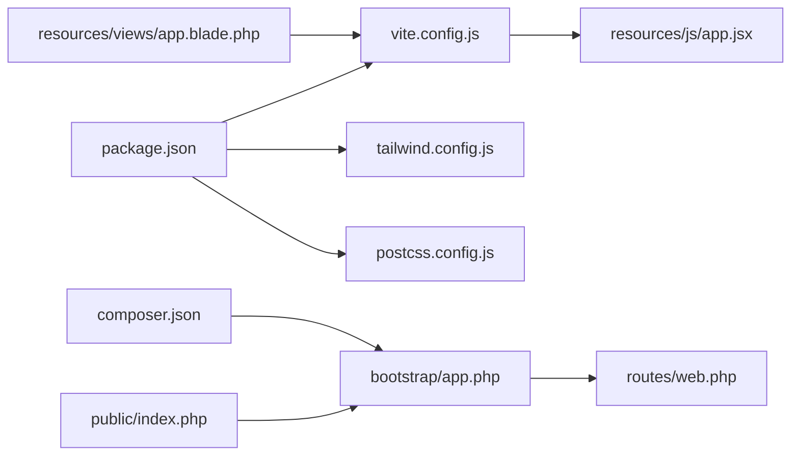

# Build Process and Deployment

<cite>
**Referenced Files in This Document**
- [vite.config.js](file://vite.config.js)
- [package.json](file://package.json)
- [postcss.config.js](file://postcss.config.js)
- [tailwind.config.js](file://tailwind.config.js)
- [resources/js/app.jsx](file://resources/js/app.jsx)
- [resources/views/app.blade.php](file://resources/views/app.blade.php)
- [jsconfig.json](file://jsconfig.json)
- [composer.json](file://composer.json)
- [config/app.php](file://config/app.php)
- [bootstrap/app.php](file://bootstrap/app.php)
- [routes/web.php](file://routes/web.php)
- [public/index.php](file://public/index.php)
</cite>

## Table of Contents
1. [Introduction](#introduction)
2. [Project Structure](#project-structure)
3. [Core Components](#core-components)
4. [Architecture Overview](#architecture-overview)
5. [Detailed Component Analysis](#detailed-component-analysis)
6. [Dependency Analysis](#dependency-analysis)
7. [Performance Considerations](#performance-considerations)
8. [Troubleshooting Guide](#troubleshooting-guide)
9. [Conclusion](#conclusion)
10. [Appendices](#appendices)

## Introduction
This document describes the complete build and deployment process for the EDUfa application. It covers the frontend build pipeline using Vite and React with Tailwind CSS, Laravel backend build and runtime behaviors, environment configuration, and practical deployment strategies. It also outlines CI/CD considerations, zero-downtime deployment patterns, rollback procedures, and environment synchronization. Guidance is provided for different hosting environments and troubleshooting common deployment issues.

## Project Structure
The EDUfa application follows a modern full-stack architecture:
- Frontend: React with Inertia, built by Vite, styled with Tailwind CSS.
- Backend: Laravel 13 with Blade templates and Inertia for SSR-like rendering.
- Asset pipeline: Laravel Vite Plugin integrates Vite builds into Laravel’s asset serving.
- Routing and middleware: Laravel routes define pages and admin areas; middleware handles Inertia requests and preloaded assets.

**Diagram sources**
- [vite.config.js:1-14](file://vite.config.js#L1-L14)
- [package.json:1-49](file://package.json#L1-L49)
- [resources/js/app.jsx:1-26](file://resources/js/app.jsx#L1-L26)
- [resources/views/app.blade.php:1-57](file://resources/views/app.blade.php#L1-L57)
- [postcss.config.js:1-7](file://postcss.config.js#L1-L7)
- [tailwind.config.js:1-42](file://tailwind.config.js#L1-L42)
- [composer.json:1-91](file://composer.json#L1-L91)
- [config/app.php:1-127](file://config/app.php#L1-L127)
- [bootstrap/app.php:1-51](file://bootstrap/app.php#L1-L51)
- [routes/web.php:1-155](file://routes/web.php#L1-L155)
- [public/index.php:1-21](file://public/index.php#L1-L21)

**Section sources**
- [vite.config.js:1-14](file://vite.config.js#L1-L14)
- [package.json:1-49](file://package.json#L1-L49)
- [postcss.config.js:1-7](file://postcss.config.js#L1-L7)
- [tailwind.config.js:1-42](file://tailwind.config.js#L1-L42)
- [resources/js/app.jsx:1-26](file://resources/js/app.jsx#L1-L26)
- [resources/views/app.blade.php:1-57](file://resources/views/app.blade.php#L1-L57)
- [composer.json:1-91](file://composer.json#L1-L91)
- [config/app.php:1-127](file://config/app.php#L1-L127)
- [bootstrap/app.php:1-51](file://bootstrap/app.php#L1-L51)
- [routes/web.php:1-155](file://routes/web.php#L1-L155)
- [public/index.php:1-21](file://public/index.php#L1-L21)

## Core Components
- Frontend build pipeline
  - Vite configuration defines the Laravel plugin, React plugin, and entry point.
  - NPM scripts expose development and production build commands.
  - Tailwind CSS and PostCSS are configured for utility-first styling.
  - The React app initializes via Inertia and renders Blade-rendered pages.
- Backend build and runtime
  - Composer scripts orchestrate installation, key generation, migrations, and frontend build.
  - Laravel bootstrap wires routing, middleware, and exception handling.
  - Routes define public pages, sitemap generation, and admin CRUD endpoints.
  - The public entrypoint boots Laravel and serves requests.

Key build and runtime behaviors:
- Frontend
  - Development: Vite dev server with hot module replacement and React Fast Refresh.
  - Production: Vite build generates hashed assets consumed by Laravel’s @vite directive.
- Backend
  - Development: Concurrent dev script runs Laravel server, queue listener, and Vite dev.
  - Production: Composer autoload optimization and vendor publishing for assets.

**Section sources**
- [vite.config.js:1-14](file://vite.config.js#L1-L14)
- [package.json:1-49](file://package.json#L1-L49)
- [postcss.config.js:1-7](file://postcss.config.js#L1-L7)
- [tailwind.config.js:1-42](file://tailwind.config.js#L1-L42)
- [resources/js/app.jsx:1-26](file://resources/js/app.jsx#L1-L26)
- [resources/views/app.blade.php:1-57](file://resources/views/app.blade.php#L1-L57)
- [composer.json:1-91](file://composer.json#L1-L91)
- [bootstrap/app.php:1-51](file://bootstrap/app.php#L1-L51)
- [routes/web.php:1-155](file://routes/web.php#L1-L155)
- [public/index.php:1-21](file://public/index.php#L1-L21)

## Architecture Overview
The frontend and backend collaborate through Inertia:
- Blade renders the HTML shell and injects Vite assets.
- Inertia loads React pages on the client while preserving server-side rendering semantics.
- Laravel routes and controllers serve both static and dynamic content.

**Diagram sources**
- [resources/views/app.blade.php:1-57](file://resources/views/app.blade.php#L1-L57)
- [vite.config.js:1-14](file://vite.config.js#L1-L14)
- [bootstrap/app.php:1-51](file://bootstrap/app.php#L1-L51)
- [routes/web.php:1-155](file://routes/web.php#L1-L155)

## Detailed Component Analysis

### Frontend Build Pipeline (Vite + React + Tailwind)
- Vite configuration
  - Uses Laravel Vite Plugin with a single entry and refresh support.
  - Integrates React plugin for JSX transformation.
- NPM scripts
  - Provides “dev” and “build” commands for local development and production bundling.
- Tailwind and PostCSS
  - Tailwind scans Blade and JS files for class usage.
  - PostCSS applies Tailwind and Autoprefixer during build.
- Entry point and Inertia integration
  - React app bootstraps via Inertia, resolving pages dynamically.
  - Progress bar and app name are configured at the entry point.
- Blade integration
  - Blade template injects Vite assets and enables React Refresh in development.

**Diagram sources**
- [package.json:1-49](file://package.json#L1-L49)
- [vite.config.js:1-14](file://vite.config.js#L1-L14)
- [tailwind.config.js:1-42](file://tailwind.config.js#L1-L42)
- [postcss.config.js:1-7](file://postcss.config.js#L1-L7)
- [resources/js/app.jsx:1-26](file://resources/js/app.jsx#L1-L26)
- [resources/views/app.blade.php:1-57](file://resources/views/app.blade.php#L1-L57)
- [public/index.php:1-21](file://public/index.php#L1-L21)

**Section sources**
- [vite.config.js:1-14](file://vite.config.js#L1-L14)
- [package.json:1-49](file://package.json#L1-L49)
- [postcss.config.js:1-7](file://postcss.config.js#L1-L7)
- [tailwind.config.js:1-42](file://tailwind.config.js#L1-L42)
- [resources/js/app.jsx:1-26](file://resources/js/app.jsx#L1-L26)
- [resources/views/app.blade.php:1-57](file://resources/views/app.blade.php#L1-L57)
- [jsconfig.json:1-11](file://jsconfig.json#L1-L11)

### Laravel Backend Build and Runtime
- Composer scripts
  - setup: installs PHP deps, ensures .env, generates APP_KEY, migrates DB, installs JS deps, and builds frontend.
  - dev: runs Laravel server, queue listener, and Vite dev concurrently.
  - test: clears config cache and executes tests.
  - post-autoload-dump and post-update-cmd: discover packages and publish assets.
- Bootstrap and middleware
  - Registers web routes, console commands, health check endpoint, and middleware stack.
  - Adds Inertia request handling and preloaded asset headers.
  - Exception handler renders Inertia-friendly error pages for common HTTP errors.
- Routes
  - Defines sitemap generation, guest pages, service pages, and admin CRUD endpoints.
  - Includes ping endpoint for health checks.
- Public entrypoint
  - Boots Laravel, checks maintenance mode, and dispatches the request.

**Diagram sources**
- [composer.json:1-91](file://composer.json#L1-L91)
- [bootstrap/app.php:1-51](file://bootstrap/app.php#L1-L51)
- [routes/web.php:1-155](file://routes/web.php#L1-L155)
- [public/index.php:1-21](file://public/index.php#L1-L21)

**Section sources**
- [composer.json:1-91](file://composer.json#L1-L91)
- [bootstrap/app.php:1-51](file://bootstrap/app.php#L1-L51)
- [routes/web.php:1-155](file://routes/web.php#L1-L155)
- [public/index.php:1-21](file://public/index.php#L1-L21)

### Environment Configuration Management
- Laravel environment
  - Application name, environment, debug flag, URL, timezone, locales, encryption key, and maintenance driver are read from .env.
  - APP_KEY must be present in production.
- Frontend environment
  - Vite reads environment variables prefixed with VITE_.
  - The app name is sourced from import.meta.env.VITE_APP_NAME.
- .env handling
  - Composer scripts ensure .env exists and generate APP_KEY on setup.
  - Example .env is copied if missing during project creation.

Best practices:
- Keep APP_ENV=production for production deploys.
- Set APP_DEBUG=false for production.
- Configure APP_URL to the production domain.
- Ensure APP_KEY is generated and stored securely.

**Section sources**
- [config/app.php:1-127](file://config/app.php#L1-L127)
- [resources/js/app.jsx:1-26](file://resources/js/app.jsx#L1-L26)
- [composer.json:1-91](file://composer.json#L1-L91)

### Deployment Strategies
Recommended production deployment flow:
- Prerequisites
  - PHP 8.3+ with required extensions (commonly enabled by default).
  - Node.js 18+ for building assets.
  - Composer 2.x and NPM/Yarn installed.
- Steps
  - Install PHP dependencies: composer install --no-dev --optimize-autoloader.
  - Install and build frontend: npm ci && npm run build.
  - Prepare environment: copy .env, generate APP_KEY if missing, run migrations.
  - Clear and warm caches: config, route, view, and event caches.
  - Serve via web server (Apache/Nginx) pointing to public/.
- Zero-downtime deployment
  - Deploy to a new release directory.
  - Point symlink or virtual host to the new directory atomically.
  - Warm caches and run migrations after switch.
  - Keep old release around for quick rollback.
- Rollback
  - Switch symlink or virtual host back to previous release.
  - Optionally re-run cache warming.
- Environment synchronization
  - Sync .env across environments.
  - Use identical PHP and Node.js versions.
  - Keep Composer and NPM lockfiles consistent.

[No sources needed since this section provides general guidance]

### CI/CD Pipeline Setup
Proposed pipeline stages:
- Install dependencies
  - composer install --no-dev --classmap-authoritative
  - npm ci
- Lint and test
  - composer run test
- Build assets
  - npm run build
- Deploy
  - Upload artifacts to target environment
  - Swap symlink or update virtual host
  - Run migrations and cache warm-up

[No sources needed since this section provides general guidance]

### Server Requirements and Dependencies
- PHP
  - Version: ^8.3
  - Extensions: commonly required extensions (e.g., OpenSSL, PDO, Mbstring, Tokenizer, XML, Ctype, JSON, PCRE).
- Node.js
  - Recommended: 18+ LTS for compatibility with Vite 7 and toolchain.
- Composer
  - Version: 2.x
- NPM
  - Version: latest LTS

**Section sources**
- [composer.json:8-16](file://composer.json#L8-L16)
- [package.json:1-49](file://package.json#L1-L49)

## Dependency Analysis
- Frontend
  - Vite orchestrates asset builds; React plugin transforms JSX; Laravel Vite Plugin integrates with Blade.
  - Tailwind and PostCSS provide utility-first styling.
- Backend
  - Laravel framework, Inertia, Sanctum, Sitemap, Ziggy, and Tinker form the core stack.
  - Composer scripts coordinate setup, dev, and test tasks.
- Interactions
  - Blade template injects Vite assets into the DOM.
  - Inertia bridges server routes and client React pages.

**Diagram sources**
- [package.json:1-49](file://package.json#L1-L49)
- [vite.config.js:1-14](file://vite.config.js#L1-L14)
- [tailwind.config.js:1-42](file://tailwind.config.js#L1-L42)
- [postcss.config.js:1-7](file://postcss.config.js#L1-L7)
- [resources/js/app.jsx:1-26](file://resources/js/app.jsx#L1-L26)
- [resources/views/app.blade.php:1-57](file://resources/views/app.blade.php#L1-L57)
- [composer.json:1-91](file://composer.json#L1-L91)
- [bootstrap/app.php:1-51](file://bootstrap/app.php#L1-L51)
- [routes/web.php:1-155](file://routes/web.php#L1-L155)
- [public/index.php:1-21](file://public/index.php#L1-L21)

**Section sources**
- [package.json:1-49](file://package.json#L1-L49)
- [composer.json:1-91](file://composer.json#L1-L91)
- [resources/views/app.blade.php:1-57](file://resources/views/app.blade.php#L1-L57)

## Performance Considerations
- Frontend
  - Enable production builds with asset hashing and minification via Vite.
  - Leverage Tailwind purging by scoping content globs appropriately.
  - Split code and lazy-load heavy components where possible.
- Backend
  - Use OPcache and opcode caching in production PHP.
  - Optimize Composer autoloader and enable classmap authoritatively for production.
  - Cache routes, configs, and views to reduce boot overhead.
- Observability
  - Add health check endpoint (/ping) for load balancers and monitoring.
  - Monitor queue workers for background jobs.

[No sources needed since this section provides general guidance]

## Troubleshooting Guide
Common issues and resolutions:
- Missing APP_KEY
  - Cause: .env not present or APP_KEY unset.
  - Fix: composer run setup or manually generate and set APP_KEY.
- Maintenance mode
  - Cause: maintenance.php exists in storage/framework.
  - Fix: remove maintenance file or disable maintenance driver.
- Asset not found in production
  - Cause: assets not built or cached manifest mismatch.
  - Fix: rebuild assets, clear Laravel caches, and re-deploy.
- Inertia error pages not rendering
  - Cause: exception handler not returning Inertia responses.
  - Fix: verify exception handler logic for 404/500/503.
- Health checks failing
  - Cause: misconfigured APP_URL or missing /ping route.
  - Fix: set APP_URL and ensure /ping route returns 200.

**Section sources**
- [composer.json:1-91](file://composer.json#L1-L91)
- [public/index.php:1-21](file://public/index.php#L1-L21)
- [bootstrap/app.php:1-51](file://bootstrap/app.php#L1-L51)
- [routes/web.php:149-152](file://routes/web.php#L149-L152)

## Conclusion
The EDUfa application combines a modern React frontend built by Vite with a Laravel backend leveraging Inertia. The provided configuration and scripts streamline development and production builds, while Composer scripts automate setup and testing. By following the deployment strategies, environment synchronization practices, and troubleshooting steps outlined here, teams can reliably deploy and operate EDUfa across diverse hosting environments.

## Appendices
- Step-by-step deployment checklist
  - Prepare environment (PHP 8.3+, Node.js 18+, Composer 2.x).
  - composer install --no-dev --optimize-autoloader.
  - npm ci && npm run build.
  - Copy .env, generate APP_KEY, run migrations.
  - Clear and warm caches.
  - Serve via web server and verify /ping.
- Zero-downtime deployment checklist
  - Deploy to new release directory.
  - Atomically switch symlink or virtual host.
  - Run migrations and cache warm-up.
  - Monitor health and rollback window.

[No sources needed since this section provides general guidance]