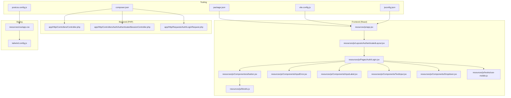
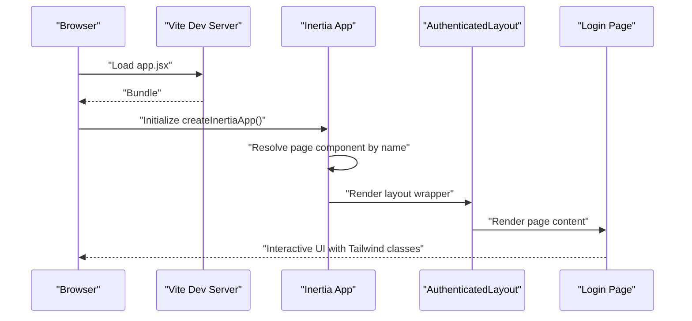
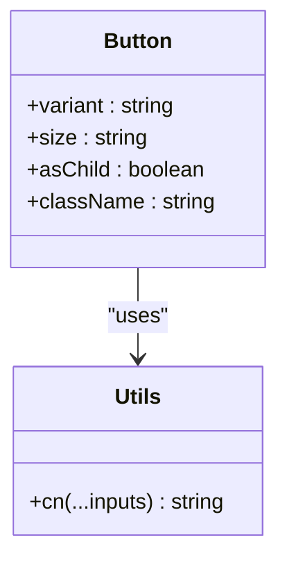
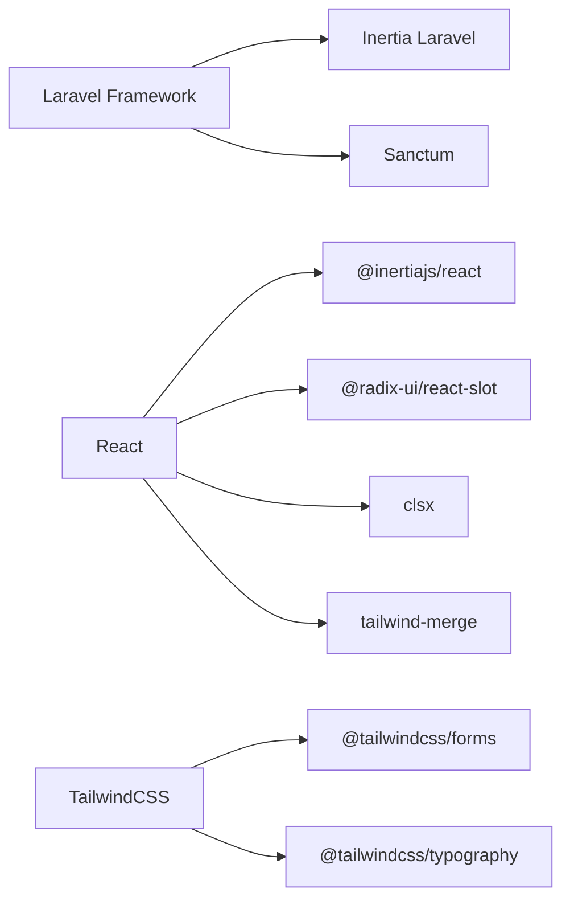

# Coding Standards and Conventions

<cite>
**Referenced Files in This Document**
- [Controller.php](file://app/Http/Controllers/Controller.php)
- [AuthenticatedSessionController.php](file://app/Http/Controllers/Auth/AuthenticatedSessionController.php)
- [LoginRequest.php](file://app/Http/Requests/Auth/LoginRequest.php)
- [app.jsx](file://resources/js/app.jsx)
- [AuthenticatedLayout.jsx](file://resources/js/Layouts/AuthenticatedLayout.jsx)
- [Login.jsx](file://resources/js/Pages/Auth/Login.jsx)
- [button.jsx](file://resources/js/Components/ui/button.jsx)
- [InputError.jsx](file://resources/js/Components/InputError.jsx)
- [InputLabel.jsx](file://resources/js/Components/InputLabel.jsx)
- [TextInput.jsx](file://resources/js/Components/TextInput.jsx)
- [Dropdown.jsx](file://resources/js/Components/Dropdown.jsx)
- [use-mobile.js](file://resources/js/hooks/use-mobile.js)
- [utils.js](file://resources/js/lib/utils.js)
- [app.css](file://resources/css/app.css)
- [tailwind.config.js](file://tailwind.config.js)
- [composer.json](file://composer.json)
- [package.json](file://package.json)
- [vite.config.js](file://vite.config.js)
- [jsconfig.json](file://jsconfig.json)
- [postcss.config.js](file://postcss.config.js)
</cite>

## Table of Contents
1. [Introduction](#introduction)
2. [Project Structure](#project-structure)
3. [Core Components](#core-components)
4. [Architecture Overview](#architecture-overview)
5. [Detailed Component Analysis](#detailed-component-analysis)
6. [Dependency Analysis](#dependency-analysis)
7. [Performance Considerations](#performance-considerations)
8. [Troubleshooting Guide](#troubleshooting-guide)
9. [Conclusion](#conclusion)
10. [Appendices](#appendices)

## Introduction
This document defines the coding standards and conventions for the EDUfa full-stack application. It consolidates PHP standards aligned with PSR guidelines, JavaScript/JSX React conventions, and TailwindCSS styling practices observed in the repository. The goal is to ensure readability, maintainability, and consistency across Laravel backend controllers, models, and React frontend components.

## Project Structure
The project follows a standard Laravel application layout with a modern React frontend powered by Vite and Inertia. Key conventions:
- PHP namespace and autoloading via PSR-4 in Composer configuration
- Blade templates under resources/views and React pages under resources/js/Pages
- Shared UI components under resources/js/Components
- Layouts under resources/js/Layouts
- Utility functions under resources/js/lib
- Hooks under resources/js/hooks
- TailwindCSS configuration and layered styles under resources/css

**Diagram sources**
- [Controller.php:1-9](file://app/Http/Controllers/Controller.php#L1-L9)
- [AuthenticatedSessionController.php:1-58](file://app/Http/Controllers/Auth/AuthenticatedSessionController.php#L1-L58)
- [LoginRequest.php](file://app/Http/Requests/Auth/LoginRequest.php)
- [app.jsx:1-26](file://resources/js/app.jsx#L1-L26)
- [AuthenticatedLayout.jsx:1-54](file://resources/js/Layouts/AuthenticatedLayout.jsx#L1-L54)
- [Login.jsx:1-204](file://resources/js/Pages/Auth/Login.jsx#L1-L204)
- [button.jsx:1-49](file://resources/js/Components/ui/button.jsx#L1-L49)
- [InputError.jsx](file://resources/js/Components/InputError.jsx)
- [InputLabel.jsx:1-19](file://resources/js/Components/InputLabel.jsx#L1-L19)
- [TextInput.jsx:1-31](file://resources/js/Components/TextInput.jsx#L1-L31)
- [Dropdown.jsx:1-108](file://resources/js/Components/Dropdown.jsx#L1-L108)
- [use-mobile.js:1-20](file://resources/js/hooks/use-mobile.js#L1-L20)
- [utils.js:1-7](file://resources/js/lib/utils.js#L1-L7)
- [app.css:1-30](file://resources/css/app.css#L1-L30)
- [tailwind.config.js:1-42](file://tailwind.config.js#L1-L42)
- [composer.json:1-91](file://composer.json#L1-L91)
- [package.json](file://package.json)
- [vite.config.js](file://vite.config.js)
- [jsconfig.json](file://jsconfig.json)
- [postcss.config.js](file://postcss.config.js)

**Section sources**
- [composer.json:26-37](file://composer.json#L26-L37)
- [jsconfig.json](file://jsconfig.json)
- [vite.config.js](file://vite.config.js)
- [postcss.config.js](file://postcss.config.js)

## Core Components
This section documents the foundational standards derived from the existing codebase.

- PHP (PSR-aligned)
  - Namespace and class naming: PascalCase for classes, namespaces match directory structure
  - Autoloading: PSR-4 configured in Composer autoload sections
  - Controllers: Extend a base controller class; methods return appropriate response types (Inertia Response or RedirectResponse)
  - Requests: Validation and authorization encapsulated in dedicated Request classes
  - Comments: PHPDoc blocks present for method documentation in controllers

- JavaScript/JSX (React)
  - Component structure: Function components with explicit props and minimal imperative logic
  - Hook usage: React hooks applied for state, effects, refs, and custom hooks
  - Prop naming: camelCase props; boolean props often prefixed for clarity
  - Composition: Higher-order components and context patterns used for dropdowns
  - Styling: Tailwind utility classes; shared cn utility for merging classes

- CSS/TailwindCSS
  - Utility-first approach: Classes define spacing, colors, typography, and layout
  - Layered styles: Tailwind directives with custom @layer base for theme tokens
  - Theme configuration: Custom colors and fonts extended in Tailwind config
  - Responsive utilities: Breakpoint suffixes used across components

**Section sources**
- [Controller.php:1-9](file://app/Http/Controllers/Controller.php#L1-L9)
- [AuthenticatedSessionController.php:1-58](file://app/Http/Controllers/Auth/AuthenticatedSessionController.php#L1-L58)
- [LoginRequest.php](file://app/Http/Requests/Auth/LoginRequest.php)
- [app.jsx:1-26](file://resources/js/app.jsx#L1-L26)
- [AuthenticatedLayout.jsx:1-54](file://resources/js/Layouts/AuthenticatedLayout.jsx#L1-L54)
- [Login.jsx:1-204](file://resources/js/Pages/Auth/Login.jsx#L1-L204)
- [button.jsx:1-49](file://resources/js/Components/ui/button.jsx#L1-L49)
- [utils.js:1-7](file://resources/js/lib/utils.js#L1-L7)
- [app.css:1-30](file://resources/css/app.css#L1-L30)
- [tailwind.config.js:1-42](file://tailwind.config.js#L1-L42)

## Architecture Overview
The frontend initializes Inertia with Vite, resolving page components dynamically. Layouts wrap pages and manage navigation and session keep-alive. Components are organized by feature and reused across pages.

**Diagram sources**
- [app.jsx:10-25](file://resources/js/app.jsx#L10-L25)
- [AuthenticatedLayout.jsx:11-53](file://resources/js/Layouts/AuthenticatedLayout.jsx#L11-L53)
- [Login.jsx:8-20](file://resources/js/Pages/Auth/Login.jsx#L8-L20)

## Detailed Component Analysis

### PHP Controllers (PSR-1/PSR-12)
- Naming and structure
  - Base controller exists for shared behavior
  - Concrete controllers use PascalCase and suffix with Controller
- Method visibility and return types
  - Public methods returning Inertia Response or RedirectResponse
  - Clear separation of concerns: render vs. store vs. destroy
- Request handling
  - Use dedicated Request classes for validation and authorization
- Comments
  - PHPDoc blocks describe method purpose and return types

Recommended additions for consistency:
- Enforce PSR-12 method signatures (aligned indents, single space around array keys)
- Add consistent PHPDoc for parameters and exceptions
- Group use statements per namespace and sort alphabetically

**Section sources**
- [Controller.php:1-9](file://app/Http/Controllers/Controller.php#L1-L9)
- [AuthenticatedSessionController.php:13-58](file://app/Http/Controllers/Auth/AuthenticatedSessionController.php#L13-L58)
- [LoginRequest.php](file://app/Http/Requests/Auth/LoginRequest.php)

### React Components and Hooks
- Component composition
  - Presentational components accept props and render Tailwind classes
  - Layouts wrap pages and manage global UI state
- Hook usage
  - useState for local state toggles
  - useEffect for side effects (keep-alive ping)
  - Custom hooks for reusable logic (mobile detection)
- Props and refs
  - forwardRef for inputs to expose imperative methods
  - Controlled form inputs via Inertia useForm
- Styling
  - Utility classes for layout and design
  - Shared cn utility merges conditional classes safely

Recommended additions for consistency:
- Use TypeScript for strong typing (optional)
- Prefer named exports for components
- Keep components small and focused; extract reusable pieces
- Use ESLint with React and JSX rules

**Section sources**
- [AuthenticatedLayout.jsx:14-23](file://resources/js/Layouts/AuthenticatedLayout.jsx#L14-L23)
- [Login.jsx:8-20](file://resources/js/Pages/Auth/Login.jsx#L8-L20)
- [TextInput.jsx:1-31](file://resources/js/Components/TextInput.jsx#L1-L31)
- [Dropdown.jsx:1-108](file://resources/js/Components/Dropdown.jsx#L1-L108)
- [use-mobile.js:1-20](file://resources/js/hooks/use-mobile.js#L1-L20)
- [utils.js:1-7](file://resources/js/lib/utils.js#L1-L7)

### UI Components and Variants
- Button component demonstrates variant and size composition using class variance authority
- Shared cn utility merges clsx and tailwind-merge to avoid conflicting classes
- Consistent prop naming: variant, size, asChild, className

Recommended additions for consistency:
- Define a shared design system (tokens) for colors and spacing
- Centralize variant definitions and export types
- Add unit tests for component behavior

**Diagram sources**
- [button.jsx:36-45](file://resources/js/Components/ui/button.jsx#L36-L45)
- [utils.js:4-6](file://resources/js/lib/utils.js#L4-L6)

**Section sources**
- [button.jsx:1-49](file://resources/js/Components/ui/button.jsx#L1-L49)
- [utils.js:1-7](file://resources/js/lib/utils.js#L1-L7)

### Styling Conventions (TailwindCSS)
- Utility-first: Tailwind classes compose layout, colors, and effects
- Layered base: Custom CSS variables and dark mode tokens under @layer base
- Theme extension: Custom brand colors and semantic sidebar palette
- Responsive utilities: Breakpoints applied consistently across components

Recommended additions for consistency:
- Establish naming conventions for breakpoints and spacing scales
- Document color tokens and semantic roles
- Use Tailwind Playgrounds or Storybook for component libraries

**Section sources**
- [app.css:5-29](file://resources/css/app.css#L5-L29)
- [tailwind.config.js:14-38](file://tailwind.config.js#L14-L38)

### File Organization and Imports
- PHP
  - PSR-4 autoload maps namespaces to directories
  - Controllers grouped by domain (Auth, Admin, etc.)
- JavaScript
  - Feature-based grouping (Components, Layouts, Pages, hooks, lib)
  - Relative imports with explicit extensions (.jsx, .js)
- Tooling
  - Vite resolves pages and assets
  - PostCSS and Tailwind process CSS
  - JS config supports path aliases

Recommended additions for consistency:
- Enforce import order (external, internal, relative)
- Standardize file naming (PascalCase for components, kebab-case for pages)
- Add ESLint and Prettier configurations

**Section sources**
- [composer.json:26-37](file://composer.json#L26-L37)
- [app.jsx:1-26](file://resources/js/app.jsx#L1-L26)
- [vite.config.js](file://vite.config.js)
- [postcss.config.js](file://postcss.config.js)

## Dependency Analysis
The application integrates Laravel, Inertia, React, and TailwindCSS. Dependencies are declared in Composer and NPM configuration files.

**Diagram sources**
- [composer.json:8-25](file://composer.json#L8-L25)
- [package.json](file://package.json)
- [tailwind.config.js:1-42](file://tailwind.config.js#L1-L42)

**Section sources**
- [composer.json:1-91](file://composer.json#L1-L91)
- [package.json](file://package.json)

## Performance Considerations
- Frontend
  - Lazy-load heavy components and images
  - Minimize unnecessary re-renders; memoize derived data
  - Use CSS containment and contain: layout for large lists
- Backend
  - Eager load relationships in controllers
  - Cache expensive computations and paginated queries
  - Use database indexing for frequent filters

## Troubleshooting Guide
- Authentication flow
  - Ensure the admin-only middleware check is enforced before redirecting to dashboard
  - Validate session regeneration after successful login
- Keep-alive mechanism
  - Monitor periodic ping endpoint for failures and adjust intervals
- Styling issues
  - Verify Tailwind directives are processed and custom tokens are defined
  - Check for conflicting classes resolved by cn utility

**Section sources**
- [AuthenticatedSessionController.php:35-42](file://app/Http/Controllers/Auth/AuthenticatedSessionController.php#L35-L42)
- [AuthenticatedLayout.jsx:14-23](file://resources/js/Layouts/AuthenticatedLayout.jsx#L14-L23)
- [app.css:1-30](file://resources/css/app.css#L1-L30)
- [utils.js:1-7](file://resources/js/lib/utils.js#L1-L7)

## Conclusion
By adhering to PSR-compliant PHP practices, consistent React component patterns, and Tailwind utility-first conventions, EDUfa maintains a clean, scalable, and cohesive codebase. The recommended additions further enhance readability and long-term maintainability.

## Appendices
- Example references for well-structured components
  - Controller: [AuthenticatedSessionController.php:13-58](file://app/Http/Controllers/Auth/AuthenticatedSessionController.php#L13-L58)
  - React Page: [Login.jsx:8-20](file://resources/js/Pages/Auth/Login.jsx#L8-L20)
  - UI Component: [button.jsx:36-45](file://resources/js/Components/ui/button.jsx#L36-L45)
  - Layout: [AuthenticatedLayout.jsx:11-53](file://resources/js/Layouts/AuthenticatedLayout.jsx#L11-L53)
  - Styling: [app.css:5-29](file://resources/css/app.css#L5-L29), [tailwind.config.js:14-38](file://tailwind.config.js#L14-L38)