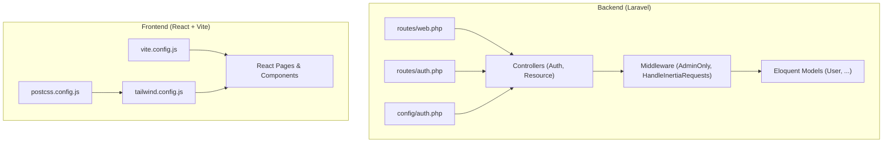
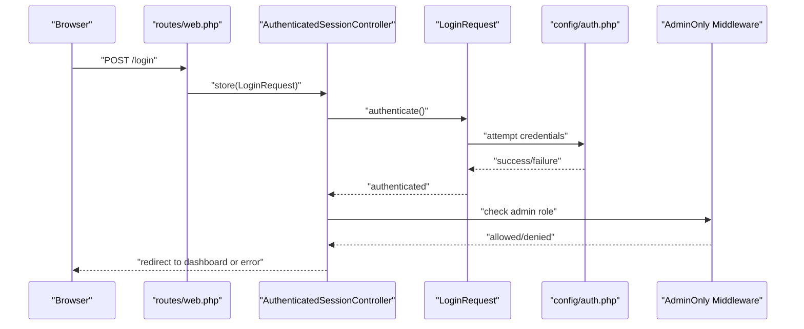
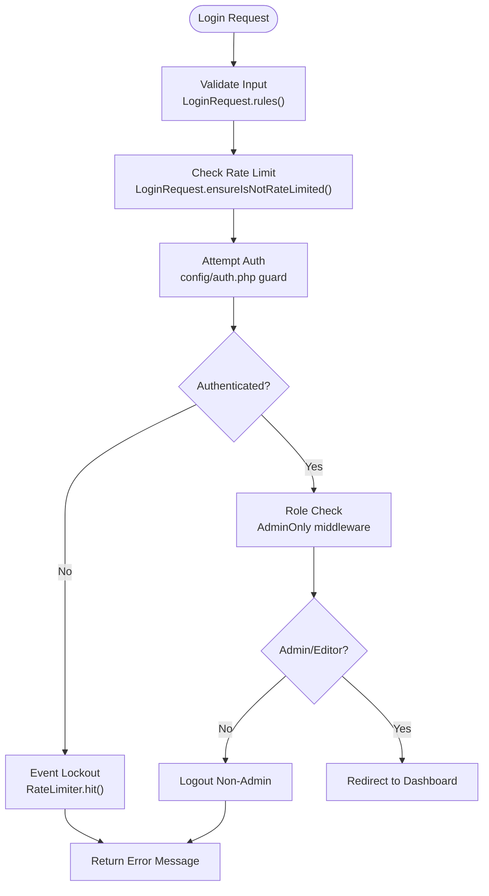
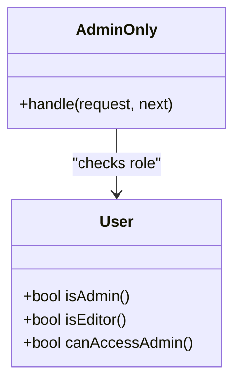
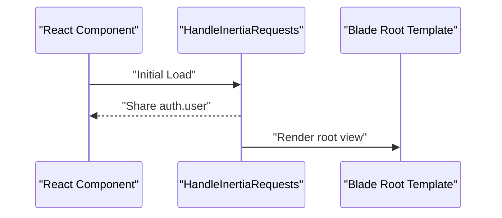
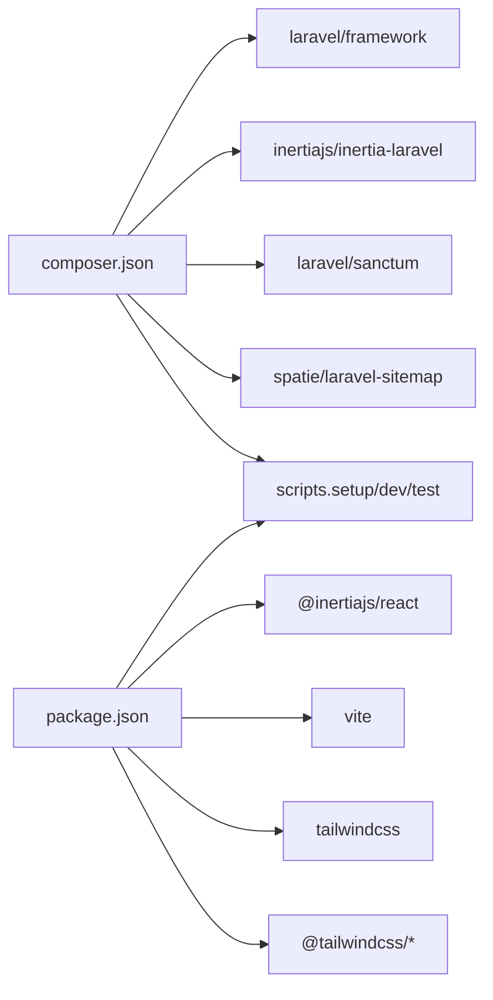

# Development Guidelines

<cite>
**Referenced Files in This Document**
- [composer.json](file://composer.json)
- [package.json](file://package.json)
- [phpunit.xml](file://phpunit.xml)
- [vite.config.js](file://vite.config.js)
- [tailwind.config.js](file://tailwind.config.js)
- [postcss.config.js](file://postcss.config.js)
- [routes/web.php](file://routes/web.php)
- [routes/auth.php](file://routes/auth.php)
- [config/auth.php](file://config/auth.php)
- [app/Http/Middleware/AdminOnly.php](file://app/Http/Middleware/AdminOnly.php)
- [app/Http/Middleware/HandleInertiaRequests.php](file://app/Http/Middleware/HandleInertiaRequests.php)
- [app/Http/Controllers/Auth/AuthenticatedSessionController.php](file://app/Http/Controllers/Auth/AuthenticatedSessionController.php)
- [app/Http/Controllers/Controller.php](file://app/Http/Controllers/Controller.php)
- [app/Http/Requests/Auth/LoginRequest.php](file://app/Http/Requests/Auth/LoginRequest.php)
- [app/Http/Requests/ProfileUpdateRequest.php](file://app/Http/Requests/ProfileUpdateRequest.php)
- [app/Models/User.php](file://app/Models/User.php)
- [tests/Feature/Auth/AuthenticationTest.php](file://tests/Feature/Auth/AuthenticationTest.php)
- [tests/TestCase.php](file://tests/TestCase.php)
</cite>

## Table of Contents
1. [Introduction](#introduction)
2. [Project Structure](#project-structure)
3. [Core Components](#core-components)
4. [Architecture Overview](#architecture-overview)
5. [Detailed Component Analysis](#detailed-component-analysis)
6. [Dependency Analysis](#dependency-analysis)
7. [Performance Considerations](#performance-considerations)
8. [Security Best Practices](#security-best-practices)
9. [Testing Strategies](#testing-strategies)
10. [Build Processes and Asset Management](#build-processes-and-asset-management)
11. [Deployment Preparation](#deployment-preparation)
12. [Debugging and Logging](#debugging-and-logging)
13. [Code Review and Version Control](#code-review-and-version-control)
14. [Troubleshooting Guide](#troubleshooting-guide)
15. [Conclusion](#conclusion)

## Introduction
This document provides comprehensive development guidelines for the EDUfa project, focusing on coding standards, testing strategies, performance optimization, security practices, build and deployment processes, and collaborative workflows. It synthesizes the existing project structure and implementation patterns to establish clear expectations for contributors while remaining accessible to developers with varying levels of experience.

## Project Structure
EDUfa follows a modern full-stack architecture combining Laravel (PHP) for the backend and React (TypeScript/JSX) for the frontend, with Inertia.js enabling seamless integration between Blade templates and React components. Key characteristics:
- Backend: Laravel 13 with Inertia middleware, Eloquent models, form requests, and route-based resource controllers.
- Frontend: React with Vite for fast development builds and Tailwind CSS for styling.
- Routing: Centralized in web.php with dedicated auth routes and middleware guards.
- Authentication: Session-based guard with rate-limiting and role-based access control.
- Testing: PHPUnit configured for unit and feature suites with SQLite memory database for speed.

**Diagram sources**
- [routes/web.php:1-137](file://routes/web.php#L1-L137)
- [routes/auth.php:1-44](file://routes/auth.php#L1-L44)
- [app/Http/Middleware/AdminOnly.php:1-25](file://app/Http/Middleware/AdminOnly.php#L1-L25)
- [app/Http/Middleware/HandleInertiaRequests.php:1-40](file://app/Http/Middleware/HandleInertiaRequests.php#L1-L40)
- [app/Models/User.php:1-47](file://app/Models/User.php#L1-L47)
- [config/auth.php:1-118](file://config/auth.php#L1-L118)
- [vite.config.js:1-14](file://vite.config.js#L1-L14)
- [tailwind.config.js:1-42](file://tailwind.config.js#L1-L42)
- [postcss.config.js:1-7](file://postcss.config.js#L1-L7)

**Section sources**
- [routes/web.php:1-137](file://routes/web.php#L1-L137)
- [routes/auth.php:1-44](file://routes/auth.php#L1-L44)
- [config/auth.php:1-118](file://config/auth.php#L1-L118)
- [app/Http/Middleware/AdminOnly.php:1-25](file://app/Http/Middleware/AdminOnly.php#L1-L25)
- [app/Http/Middleware/HandleInertiaRequests.php:1-40](file://app/Http/Middleware/HandleInertiaRequests.php#L1-L40)
- [app/Models/User.php:1-47](file://app/Models/User.php#L1-L47)
- [vite.config.js:1-14](file://vite.config.js#L1-L14)
- [tailwind.config.js:1-42](file://tailwind.config.js#L1-L42)
- [postcss.config.js:1-7](file://postcss.config.js#L1-L7)

## Core Components
- Authentication and Authorization
  - Session-based guard with configurable provider and password reset behavior.
  - Role-based checks via middleware and model helpers for admin/editor access.
  - Rate-limited login attempts with lockout events and throttling messages.
- Controllers and Requests
  - Resource-style controllers for admin CRUD operations.
  - Form requests encapsulate validation and credential authentication.
- Middleware
  - Inertia root view sharing and asset versioning.
  - Admin-only gate enforcing role-based access.
- Models
  - Eloquent model with attribute-level fillable and hidden properties.
  - Helper methods to determine roles and permissions.
- Routing
  - Public pages, service pages, sitemap generation, and admin resource routes.
  - Auth routes grouped under guest and auth middleware.

**Section sources**
- [config/auth.php:1-118](file://config/auth.php#L1-L118)
- [app/Models/User.php:1-47](file://app/Models/User.php#L1-L47)
- [app/Http/Middleware/AdminOnly.php:1-25](file://app/Http/Middleware/AdminOnly.php#L1-L25)
- [app/Http/Middleware/HandleInertiaRequests.php:1-40](file://app/Http/Middleware/HandleInertiaRequests.php#L1-L40)
- [app/Http/Controllers/Auth/AuthenticatedSessionController.php:1-58](file://app/Http/Controllers/Auth/AuthenticatedSessionController.php#L1-L58)
- [app/Http/Requests/Auth/LoginRequest.php:1-87](file://app/Http/Requests/Auth/LoginRequest.php#L1-L87)
- [routes/web.php:1-137](file://routes/web.php#L1-L137)
- [routes/auth.php:1-44](file://routes/auth.php#L1-L44)

## Architecture Overview
The system uses Inertia to render React pages server-side via Blade while maintaining Laravel’s routing, middleware, and controllers. Authentication is enforced at the route level and via middleware, with role checks integrated into the admin-only middleware.

**Diagram sources**
- [routes/auth.php:13-31](file://routes/auth.php#L13-L31)
- [app/Http/Controllers/Auth/AuthenticatedSessionController.php:28-42](file://app/Http/Controllers/Auth/AuthenticatedSessionController.php#L28-L42)
- [app/Http/Requests/Auth/LoginRequest.php:41-54](file://app/Http/Requests/Auth/LoginRequest.php#L41-L54)
- [config/auth.php:40-45](file://config/auth.php#L40-L45)
- [app/Http/Middleware/AdminOnly.php:16-23](file://app/Http/Middleware/AdminOnly.php#L16-L23)

## Detailed Component Analysis

### Authentication Flow
- LoginRequest validates credentials and enforces rate limits using Laravel’s rate limiter.
- AuthenticatedSessionController handles rendering the login view, authenticating, regenerating session, and redirecting to the intended dashboard or returning errors.
- AdminOnly middleware ensures only admin/editor users can access admin routes.

**Diagram sources**
- [app/Http/Requests/Auth/LoginRequest.php:28-77](file://app/Http/Requests/Auth/LoginRequest.php#L28-L77)
- [app/Http/Controllers/Auth/AuthenticatedSessionController.php:28-42](file://app/Http/Controllers/Auth/AuthenticatedSessionController.php#L28-L42)
- [app/Http/Middleware/AdminOnly.php:16-23](file://app/Http/Middleware/AdminOnly.php#L16-L23)
- [config/auth.php:40-45](file://config/auth.php#L40-L45)

**Section sources**
- [app/Http/Requests/Auth/LoginRequest.php:1-87](file://app/Http/Requests/Auth/LoginRequest.php#L1-L87)
- [app/Http/Controllers/Auth/AuthenticatedSessionController.php:1-58](file://app/Http/Controllers/Auth/AuthenticatedSessionController.php#L1-L58)
- [app/Http/Middleware/AdminOnly.php:1-25](file://app/Http/Middleware/AdminOnly.php#L1-L25)
- [config/auth.php:1-118](file://config/auth.php#L1-L118)

### Admin Access Control
- AdminOnly middleware checks if the user is authenticated and can access admin areas.
- User model exposes helper methods to determine roles and admin/editor access.

**Diagram sources**
- [app/Models/User.php:32-45](file://app/Models/User.php#L32-L45)
- [app/Http/Middleware/AdminOnly.php:16-23](file://app/Http/Middleware/AdminOnly.php#L16-L23)

**Section sources**
- [app/Models/User.php:1-47](file://app/Models/User.php#L1-L47)
- [app/Http/Middleware/AdminOnly.php:1-25](file://app/Http/Middleware/AdminOnly.php#L1-L25)

### Inertia Shared Props and Root View
- HandleInertiaRequests sets the root template and shares the authenticated user globally to React components.

**Diagram sources**
- [app/Http/Middleware/HandleInertiaRequests.php:30-38](file://app/Http/Middleware/HandleInertiaRequests.php#L30-L38)

**Section sources**
- [app/Http/Middleware/HandleInertiaRequests.php:1-40](file://app/Http/Middleware/HandleInertiaRequests.php#L1-L40)

## Dependency Analysis
- Backend dependencies include Laravel framework, Inertia for Laravel, Sanctum for API/session, and Spatie sitemap generator.
- Frontend dependencies include React, Inertia for React, Tailwind CSS, and Vite for bundling.
- Scripts orchestrate setup, development with concurrent processes, and testing.

**Diagram sources**
- [composer.json:8-25](file://composer.json#L8-L25)
- [package.json:9-47](file://package.json#L9-L47)

**Section sources**
- [composer.json:1-91](file://composer.json#L1-L91)
- [package.json:1-49](file://package.json#L1-L49)

## Performance Considerations
- Backend
  - Use eager loading for relations in controllers and middleware to reduce N+1 queries.
  - Leverage caching for expensive computations and frequently accessed admin stats.
  - Keep rate limiter thresholds reasonable to prevent brute-force attacks without impacting UX.
- Frontend
  - Enable production builds with Vite and Tailwind minification.
  - Split large components and defer heavy third-party libraries.
  - Use React.lazy and Suspense for route-level code splitting.
- Assets
  - Configure Tailwind’s content scanning to avoid unnecessary rebuilds.
  - Minimize CSS/JS bundles and enable compression in production.

[No sources needed since this section provides general guidance]

## Security Best Practices
- Authentication
  - Enforce rate limiting on login attempts and use strong password hashing via model casts.
  - Validate and sanitize all inputs using form requests and unique rules for emails.
- Authorization
  - Apply admin-only middleware on sensitive routes and ensure role checks in controllers.
  - Avoid exposing internal roles in frontend props; derive permissions server-side.
- Data Validation
  - Use strict validation rules in form requests and avoid permissive patterns.
  - Sanitize dynamic content before rendering in React components.
- Secrets and Environment
  - Store secrets in environment variables and never commit .env files.
  - Use HTTPS and secure cookies in production.

**Section sources**
- [app/Http/Requests/Auth/LoginRequest.php:28-77](file://app/Http/Requests/Auth/LoginRequest.php#L28-L77)
- [app/Http/Requests/ProfileUpdateRequest.php:17-30](file://app/Http/Requests/ProfileUpdateRequest.php#L17-L30)
- [app/Http/Middleware/AdminOnly.php:16-23](file://app/Http/Middleware/AdminOnly.php#L16-L23)
- [app/Models/User.php:25-31](file://app/Models/User.php#L25-L31)

## Testing Strategies
- PHPUnit
  - Unit and feature test suites are configured with inclusion of the app directory.
  - Environment overrides for testing include array caches, SQLite in-memory DB, and disabled observability integrations.
- Test Organization
  - Feature tests cover authentication flows, profile updates, and admin actions.
  - Base TestCase provides shared setup for tests.
- Frontend Testing
  - Recommended: Add React Testing Library for component-level tests and user interaction coverage.
  - Integrate testing library with Vite and React components.
- Continuous Integration
  - Run composer install and npm ci in CI environments.
  - Execute tests via composer scripts and ensure database migrations are applied before running tests.

**Section sources**
- [phpunit.xml:7-35](file://phpunit.xml#L7-L35)
- [tests/Feature/Auth/AuthenticationTest.php](file://tests/Feature/Auth/AuthenticationTest.php)
- [tests/TestCase.php](file://tests/TestCase.php)

## Build Processes and Asset Management
- Development
  - Use Vite for hot module replacement and React Fast Refresh.
  - Tailwind CSS is configured with content globs for React and Blade files.
- Production
  - Build assets with Vite and serve via Laravel’s public directory.
  - PostCSS pipeline applies Tailwind and Autoprefixer.
- Scripts
  - Composer scripts automate setup, dev watch, and test execution.

**Section sources**
- [vite.config.js:1-14](file://vite.config.js#L1-L14)
- [tailwind.config.js:7-12](file://tailwind.config.js#L7-L12)
- [postcss.config.js:1-7](file://postcss.config.js#L1-L7)
- [composer.json:38-73](file://composer.json#L38-L73)

## Deployment Preparation
- Backend
  - Set APP_ENV to production and ensure APP_KEY is generated.
  - Use production-ready database and cache drivers.
  - Clear and optimize autoloaders after deployment.
- Frontend
  - Build optimized assets with Vite and commit hashed filenames.
  - Ensure static assets are served from Laravel’s public disk.
- CI/CD
  - Automate composer install, migration, and asset build steps.
  - Run tests in CI prior to deployment.

[No sources needed since this section provides general guidance]

## Debugging and Logging
- Backend
  - Use Laravel’s logging facilities and consider Telescope in development.
  - Add targeted dd() or dump() calls during local debugging; remove in production.
- Frontend
  - Use React DevTools and browser console for component inspection.
  - Implement structured logging for client-side errors.
- Observability
  - Disable Telescope and Pulse in production unless explicitly configured.

**Section sources**
- [phpunit.xml:20-35](file://phpunit.xml#L20-L35)

## Code Review and Version Control
- Standards
  - Follow PSR-12 for PHP and consistent naming conventions.
  - Keep commits small and focused with clear messages.
- Reviews
  - Require at least one reviewer for backend and frontend changes touching authentication or admin features.
  - Use pull requests to enforce policy and automated checks.
- Branching
  - Use feature branches for new features; merge via squash or rebase to keep history clean.
- Linting and Formatting
  - Integrate PHPStan or Psalm for static analysis.
  - Use Prettier and ESLint for JS/TS formatting.

[No sources needed since this section provides general guidance]

## Troubleshooting Guide
- Authentication Failures
  - Verify rate limiter thresholds and ensure correct guard/provider configuration.
  - Confirm session regeneration and logout behavior for unauthorized users.
- Admin Access Denied
  - Check user role values and middleware application on admin routes.
- Frontend Not Loading
  - Rebuild assets with Vite and confirm Tailwind content globs include JSX files.
  - Clear browser cache and disable service worker if applicable.
- Tests Failing
  - Ensure SQLite in-memory DB is used and migrations are run before tests.
  - Verify environment variables for testing are set correctly.

**Section sources**
- [app/Http/Controllers/Auth/AuthenticatedSessionController.php:35-41](file://app/Http/Controllers/Auth/AuthenticatedSessionController.php#L35-L41)
- [app/Http/Middleware/AdminOnly.php:16-23](file://app/Http/Middleware/AdminOnly.php#L16-L23)
- [phpunit.xml:20-35](file://phpunit.xml#L20-L35)
- [vite.config.js:7-12](file://vite.config.js#L7-L12)
- [tailwind.config.js:7-12](file://tailwind.config.js#L7-L12)

## Conclusion
These guidelines consolidate the project’s current architecture and practices into actionable standards for development, testing, performance, and security. By adhering to these recommendations—especially around authentication, authorization, validation, and build/deployment workflows—teams can maintain a robust, scalable, and secure EDUfa platform.