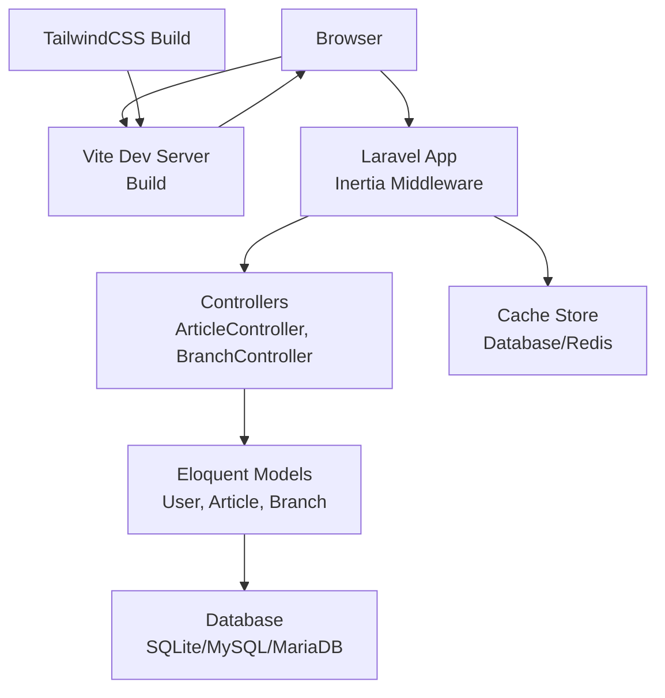
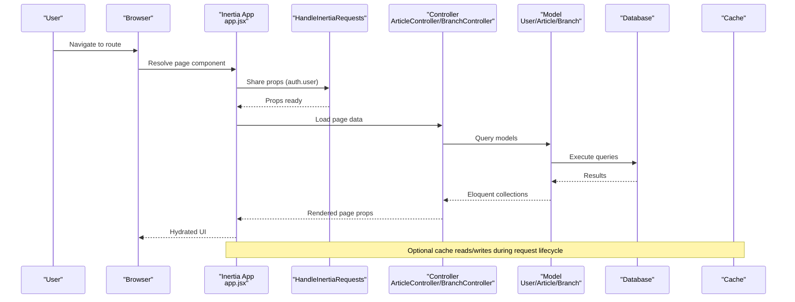
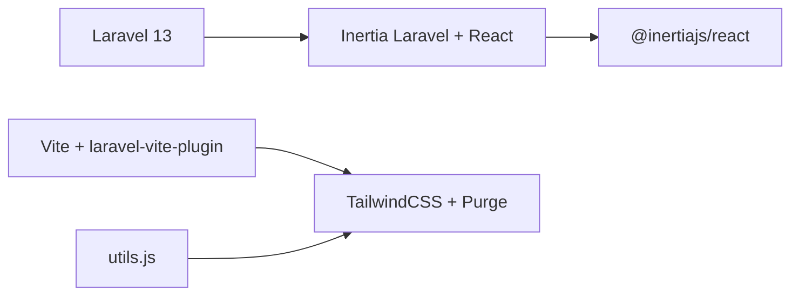

# Performance Optimization

<cite>
**Referenced Files in This Document**
- [composer.json](file://composer.json)
- [package.json](file://package.json)
- [vite.config.js](file://vite.config.js)
- [tailwind.config.js](file://tailwind.config.js)
- [resources/js/app.jsx](file://resources/js/app.jsx)
- [config/cache.php](file://config/cache.php)
- [config/database.php](file://config/database.php)
- [app/Http/Middleware/HandleInertiaRequests.php](file://app/Http/Middleware/HandleInertiaRequests.php)
- [app/Http/Controllers/ArticleController.php](file://app/Http/Controllers/ArticleController.php)
- [app/Http/Controllers/BranchController.php](file://app/Http/Controllers/BranchController.php)
- [app/Models/User.php](file://app/Models/User.php)
- [resources/js/Layouts/AuthenticatedLayout.jsx](file://resources/js/Layouts/AuthenticatedLayout.jsx)
- [resources/js/Pages/Guest/Page.jsx](file://resources/js/Pages/Guest/Page.jsx)
- [resources/js/lib/utils.js](file://resources/js/lib/utils.js)
</cite>

## Table of Contents
1. [Introduction](#introduction)
2. [Project Structure](#project-structure)
3. [Core Components](#core-components)
4. [Architecture Overview](#architecture-overview)
5. [Detailed Component Analysis](#detailed-component-analysis)
6. [Dependency Analysis](#dependency-analysis)
7. [Performance Considerations](#performance-considerations)
8. [Troubleshooting Guide](#troubleshooting-guide)
9. [Conclusion](#conclusion)
10. [Appendices](#appendices)

## Introduction
This document provides a comprehensive performance optimization guide for the EDUfa application, covering both backend (Laravel) and frontend (React with Inertia) techniques. It focuses on measurable improvements such as query optimization, caching strategies, eager loading, database indexing, asset optimization with Vite and TailwindCSS, React component performance, and monitoring approaches. The goal is to improve responsiveness, reduce latency, and lower resource consumption while maintaining maintainability.

## Project Structure
The application follows a modern stack:
- Backend: Laravel 13 with Inertia for server-driven rendering and React pages.
- Frontend: React 18 with Inertia adapter, Vite for asset bundling, and TailwindCSS for styling.
- Asset pipeline: Vite handles JS/CSS builds; Tailwind scans JSX and Blade templates for purge.

**Diagram sources**
- [resources/js/app.jsx:10-25](file://resources/js/app.jsx#L10-L25)
- [vite.config.js:5-13](file://vite.config.js#L5-L13)
- [tailwind.config.js:7-12](file://tailwind.config.js#L7-L12)
- [app/Http/Middleware/HandleInertiaRequests.php:30-38](file://app/Http/Middleware/HandleInertiaRequests.php#L30-L38)
- [config/database.php:20](file://config/database.php#L20)
- [config/cache.php:18](file://config/cache.php#L18)

**Section sources**
- [composer.json:8-16](file://composer.json#L8-L16)
- [package.json:9-23](file://package.json#L9-L23)
- [vite.config.js:5-13](file://vite.config.js#L5-L13)
- [tailwind.config.js:7-12](file://tailwind.config.js#L7-L12)
- [resources/js/app.jsx:10-25](file://resources/js/app.jsx#L10-L25)

## Core Components
- Laravel Inertia integration: Single-page navigation with server-rendered pages and client-side interactivity.
- React + Inertia: Pages and shared layouts powered by Inertia’s React adapter.
- Asset pipeline: Vite for development and production builds; TailwindCSS for utility-first styling with purge.
- Caching: Configurable cache stores including database and Redis.
- Database: SQLite by default with optional MySQL/MariaDB/PostgreSQL support.

Key performance-relevant configurations:
- Inertia progress bar and asset resolution.
- Tailwind content scanning for unused CSS removal.
- Cache store selection and key prefixing.
- Database connection defaults and Redis options.

**Section sources**
- [resources/js/app.jsx:10-25](file://resources/js/app.jsx#L10-L25)
- [tailwind.config.js:7-12](file://tailwind.config.js#L7-L12)
- [config/cache.php:18](file://config/cache.php#L18)
- [config/database.php:20](file://config/database.php#L20)

## Architecture Overview
The runtime flow connects browser requests to Laravel controllers, which render Inertia pages populated with Eloquent models. Assets are built via Vite and styled with TailwindCSS.

**Diagram sources**
- [resources/js/app.jsx:10-25](file://resources/js/app.jsx#L10-L25)
- [app/Http/Middleware/HandleInertiaRequests.php:30-38](file://app/Http/Middleware/HandleInertiaRequests.php#L30-L38)
- [app/Http/Controllers/ArticleController.php:16-21](file://app/Http/Controllers/ArticleController.php#L16-L21)
- [app/Http/Controllers/BranchController.php:17-22](file://app/Http/Controllers/BranchController.php#L17-L22)
- [app/Models/User.php:32-45](file://app/Models/User.php#L32-L45)

## Detailed Component Analysis

### Backend: Query Optimization and Eager Loading
Current patterns:
- Controllers load related data using eager loading to avoid N+1 queries.
- Pagination is not used for listing pages; consider adding pagination for large datasets.

Recommendations:
- Replace full-table loads with paginated queries for lists.
- Add selectivity: choose only needed columns.
- Use where clauses to filter early.
- Apply indexes on frequently filtered/sorted columns.

Examples to review:
- Listing articles with author eager loading.
- Listing branches ordered by city.

**Section sources**
- [app/Http/Controllers/ArticleController.php:16-21](file://app/Http/Controllers/ArticleController.php#L16-L21)
- [app/Http/Controllers/BranchController.php:17-22](file://app/Http/Controllers/BranchController.php#L17-L22)

### Backend: Caching Strategies
Current configuration:
- Default cache store is database.
- Redis options configured but not enabled by default.
- Cache key prefix includes app name.

Recommendations:
- Enable Redis for high-throughput scenarios.
- Cache expensive computed data and slow queries.
- Use cache tagging or TTL carefully to avoid stale data.
- Consider Octane-compatible stores for production.

**Section sources**
- [config/cache.php:18](file://config/cache.php#L18)
- [config/cache.php:75-80](file://config/cache.php#L75-L80)
- [config/database.php:146-180](file://config/database.php#L146-L180)

### Backend: Database Indexing
Recommendations:
- Add indexes on foreign keys (e.g., user_id on articles).
- Add indexes on frequently filtered columns (e.g., status, category).
- Add composite indexes for multi-column filters.
- Monitor slow queries and missing indexes using database profiling tools.

[No sources needed since this section provides general guidance]

### Backend: Middleware and Shared Props
The Inertia middleware shares auth.user globally, reducing per-page duplication. Keep shared props minimal to avoid unnecessary serialization overhead.

**Section sources**
- [app/Http/Middleware/HandleInertiaRequests.php:30-38](file://app/Http/Middleware/HandleInertiaRequests.php#L30-L38)

### Backend: Controllers and Model Access
- Controllers sanitize content and manage uploads; ensure validations are efficient and avoid heavy operations in request lifecycle.
- Models expose role checks; keep these lightweight and cacheable if accessed frequently.

**Section sources**
- [app/Http/Controllers/ArticleController.php:26-64](file://app/Http/Controllers/ArticleController.php#L26-L64)
- [app/Http/Controllers/BranchController.php:27-44](file://app/Http/Controllers/BranchController.php#L27-L44)
- [app/Models/User.php:32-45](file://app/Models/User.php#L32-L45)

### Frontend: React Performance Improvements
Current patterns:
- Inertia app bootstraps page components and renders with a root.
- Layouts use effects for keep-alive pings; ensure intervals are cleared.
- Pages use motion libraries and lazy image loading attributes.

Recommendations:
- Use React.memo for static components.
- Split large pages into smaller chunks with dynamic imports.
- Prefer windowing for long lists.
- Minimize re-renders by passing stable references and avoiding inline object/function creation.
- Use Suspense boundaries for data fetching where appropriate.

**Section sources**
- [resources/js/app.jsx:10-25](file://resources/js/app.jsx#L10-L25)
- [resources/js/Layouts/AuthenticatedLayout.jsx:14-23](file://resources/js/Layouts/AuthenticatedLayout.jsx#L14-L23)
- [resources/js/Pages/Guest/Page.jsx:304-314](file://resources/js/Pages/Guest/Page.jsx#L304-L314)

### Frontend: Asset Optimization with Vite and TailwindCSS
Current configuration:
- Vite plugin chain includes laravel-vite-plugin and @vitejs/plugin-react.
- Tailwind scans Blade and JSX for purge.

Recommendations:
- Enable production builds with minification and hashing.
- Use code splitting and dynamic imports for route-level chunks.
- Configure Tailwind purge aggressively; ensure all used utilities are included.
- Optimize images and compress assets; consider modern formats (AVIF/WebP) and responsive sizes.
- Leverage browser caching headers and CDN for static assets.

**Section sources**
- [vite.config.js:5-13](file://vite.config.js#L5-L13)
- [tailwind.config.js:7-12](file://tailwind.config.js#L7-L12)
- [package.json:9-23](file://package.json#L9-L23)

### Frontend: Efficient State Management
Recommendations:
- Keep global state minimal; use local component state where possible.
- Use lightweight state libraries if needed.
- Avoid unnecessary deep updates; prefer immutable updates.
- Debounce frequent updates (e.g., search inputs).

[No sources needed since this section provides general guidance]

### Frontend: Component Memoization and Lazy Loading
Recommendations:
- Wrap expensive components with memoization.
- Lazy-load route components and heavy widgets.
- Use React.lazy and Suspense for route-level code splitting.

**Section sources**
- [resources/js/app.jsx:12-16](file://resources/js/app.jsx#L12-L16)

### Frontend: Bundle Size Optimization
Recommendations:
- Audit bundle composition regularly.
- Tree-shake unused dependencies.
- Prefer smaller alternatives for heavy libraries.
- Use dynamic imports for feature toggles.

**Section sources**
- [package.json:24-47](file://package.json#L24-L47)

### Frontend: Loading Performance Improvements
Recommendations:
- Implement skeleton loaders for content areas.
- Use intersection observers for lazy-loading images.
- Defer non-critical scripts.
- Preload critical fonts and assets.

**Section sources**
- [resources/js/Pages/Guest/Page.jsx:304-314](file://resources/js/Pages/Guest/Page.jsx#L304-L314)

### Utility Functions and CSS Utilities
The cn utility merges Tailwind classes efficiently. Keep utilities small and composable.

**Section sources**
- [resources/js/lib/utils.js:4-6](file://resources/js/lib/utils.js#L4-L6)

## Dependency Analysis
The application depends on Laravel, Inertia, React, Vite, and TailwindCSS. Dependencies impact build times and runtime performance.

**Diagram sources**
- [composer.json:8-16](file://composer.json#L8-L16)
- [package.json:9-23](file://package.json#L9-L23)
- [resources/js/lib/utils.js:4-6](file://resources/js/lib/utils.js#L4-L6)

**Section sources**
- [composer.json:8-16](file://composer.json#L8-L16)
- [package.json:9-23](file://package.json#L9-L23)

## Performance Considerations
- Backend
  - Use pagination for large lists.
  - Add database indexes on foreign keys and frequently filtered columns.
  - Cache expensive queries and computed data.
  - Prefer Redis for production caching.
- Frontend
  - Split bundles and lazy-load route components.
  - Memoize components and avoid unnecessary re-renders.
  - Optimize images and leverage modern formats.
  - Minimize global state and use local state where possible.
- Assets
  - Enable production builds with minification and hashing.
  - Configure aggressive Tailwind purge.
  - Serve assets via CDN with proper caching headers.

[No sources needed since this section provides general guidance]

## Troubleshooting Guide
- Profiling tools
  - Laravel Debugbar or Clockwork for backend profiling.
  - Chrome DevTools Performance and Lighthouse for frontend profiling.
  - Network tab to inspect asset loading and caching.
- Bottleneck identification
  - Monitor slow queries and missing indexes.
  - Track bundle size growth and identify large dependencies.
  - Observe layout thrashing and excessive reflows.
- Memory management
  - Clear intervals and timeouts in components.
  - Avoid retaining references to removed DOM nodes.
  - Use virtualized lists for large datasets.

**Section sources**
- [resources/js/Layouts/AuthenticatedLayout.jsx:14-23](file://resources/js/Layouts/AuthenticatedLayout.jsx#L14-L23)

## Conclusion
By combining backend query optimization, strategic caching, and eager loading with frontend asset and component performance improvements, EDUfa can achieve significant speedups and reduced resource usage. Adopt the recommended patterns incrementally, measure impact, and iterate based on real-world metrics.

[No sources needed since this section summarizes without analyzing specific files]

## Appendices
- Measurement techniques
  - Use Laravel profiling tools and browser developer tools.
  - Track First Contentful Paint, Largest Contentful Paint, and Cumulative Layout Shift.
  - Monitor backend response times and database query durations.
- Monitoring
  - Set up application performance monitoring (APM) for both backend and frontend.
  - Track key metrics in production and alert on regressions.

[No sources needed since this section provides general guidance]